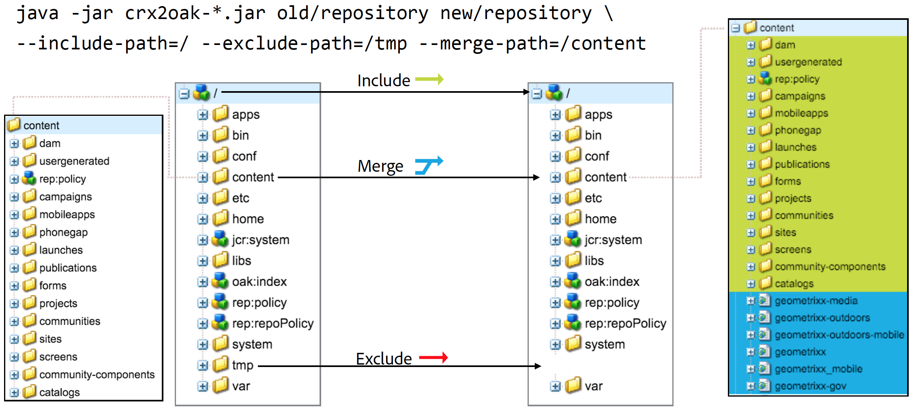

# Utilizzo dello strumento di migrazione CRX2Oak{#using-the-crx-oak-migration-tool}

## Introduzione {#introduction}

CRX2Oak è uno strumento progettato per migrare i dati tra diversi repository.

Può essere utilizzato per migrare i dati dalle versioni precedenti di CQ basate su Apache Jackrabbit 2 a Oak e può essere utilizzato anche per copiare i dati tra i repository Oak.

È possibile scaricare la versione più recente di crx2oak dall&#39;archivio pubblico  Adobe in questa posizione:
[https://repo.adobe.com/nexus/content/groups/public/com/adobe/granite/crx2oak/](https://repo.adobe.com/nexus/content/groups/public/com/adobe/granite/crx2oak/)

L&#39;elenco delle modifiche e delle correzioni per la versione più recente è disponibile nelle [Note sulla versione di CRX2Oak](https://docs.adobe.com/content/help/en/experience-manager-64/release-notes/crx2oak.html).

>[!NOTE]
>
>Per ulteriori informazioni su Apache Oak e sui concetti chiave della persistenza AEM, vedere [Introduzione alla piattaforma AEM](/help/sites-deploying/platform.md).

## Casi di utilizzo della migrazione {#migration-use-cases}

Lo strumento può essere utilizzato per:

* Migrazione dalle versioni precedenti di CQ 5 a AEM 6
* Copia dei dati tra più repository Oak
* Conversione di dati tra diverse implementazioni Oak MicroKernel.

Il supporto per la migrazione dei repository tramite store Blob esterni (comunemente noti come Data Store) è fornito in diverse combinazioni. Un possibile percorso di migrazione è da un repository CRX2 che utilizza un `FileDataStore` esterno a un repository Oak utilizzando un `S3DataStore`.

Il diagramma seguente illustra tutte le possibili combinazioni di migrazione supportate da CRX2Oak:


## Funzioni {#features}

CRX2Oak viene chiamato durante AEM aggiornamenti in modo che l&#39;utente possa specificare un profilo di migrazione predefinito che automatizza la riconfigurazione delle modalità di persistenza. Questa è chiamata modalità di avvio rapido.

Può anche essere eseguito separatamente nel caso in cui richieda una maggiore personalizzazione. Tuttavia, in questa modalità le modifiche vengono apportate solo al repository e ogni ulteriore riconfigurazione di AEM deve essere eseguita manualmente. Questa modalità è detta modalità standalone.

Un&#39;altra cosa da notare è che con le impostazioni predefinite in modalità standalone, verrà migrato solo il Node Store e il nuovo repository riutilizzerà il vecchio archivio binario.

### Modalità Quickstart automatizzata {#automated-quickstart-mode}

Dalla AEM 6.3, CRX2Oak è in grado di gestire i profili di migrazione definiti dall&#39;utente che possono essere configurati con tutte le opzioni di migrazione già disponibili. Ciò consente sia una maggiore flessibilità, sia la possibilità di automatizzare la configurazione di AEM, funzioni non disponibili se si utilizza lo strumento in modalità standalone.

Per passare da CRX2Oak alla modalità QuickStart è necessario definire il percorso della cartella crx-quickstart nella directory di installazione AEM tramite questa variabile ambientale del sistema operativo:

**Per sistemi basati su UNIX e macOS:**

```shell
export SLING_HOME="/path/to/crx-quickstart"
```

**Per Windows:**

```shell
SET "SLING_HOME=/path/to/crx-quickstart"
```

#### Supporto di ripresa {#resume-support}

La migrazione può essere interrotta in qualsiasi momento, con la possibilità di riprenderla successivamente.

#### Logica di aggiornamento personalizzabile {#customizable-upgrade-logic}

La logica Java personalizzata può essere implementata anche utilizzando `CommitHooks`. È possibile implementare classi `RepositoryInitializer` personalizzate per inizializzare l&#39;archivio con valori personalizzati.

#### Supporto per le operazioni con mappatura memoria {#support-for-memory-mapped-operations}

CRX2Oak supporta anche le operazioni di mappatura della memoria per impostazione predefinita. La mappatura della memoria migliora notevolmente le prestazioni e dovrebbe essere utilizzata quando possibile.

>[!CAUTION]
>
>Tuttavia, le operazioni mappate sulla memoria non sono supportate per le piattaforme Windows. Pertanto, è consigliabile aggiungere il parametro **—disable-mmap** quando si esegue la migrazione in Windows.

#### Migrazione selettiva dei contenuti {#selective-migration-of-content}

Per impostazione predefinita, lo strumento esegue la migrazione dell&#39;intero repository sotto il percorso `"/"`. Tuttavia, avete il controllo completo sul contenuto da migrare.

Se nella nuova istanza è presente una parte del contenuto non necessaria, potete utilizzare il parametro `--exclude-path` per escludere il contenuto e ottimizzare la procedura di aggiornamento.

#### Unione percorso {#path-merging}

Se i dati devono essere copiati tra due repository e si dispone di un percorso di contenuto diverso su entrambe le istanze, è possibile definirlo nel parametro `--merge-path`. Una volta fatto, CRX2Oak copierà solo i nuovi nodi nel repository di destinazione e manterrà quelli vecchi in posizione.



#### Supporto versione {#version-support}

Per impostazione predefinita, AEM creare una versione di ciascun nodo o pagina che viene modificato e memorizzarla nella directory archivio. Le versioni possono quindi essere utilizzate per ripristinare lo stato precedente della pagina.

Tuttavia, queste versioni non vengono mai eliminate anche se la pagina originale viene eliminata. Quando si gestiscono repository che sono in funzione da molto tempo, la migrazione potrebbe dover elaborare molti dati ridondanti causati dalle versioni orfane.

Una caratteristica utile per questi tipi di situazioni è l&#39;aggiunta del parametro `--copy-versions`. Può essere utilizzato per saltare i nodi di versione durante la migrazione o la copia di un repository.

È inoltre possibile scegliere se copiare le versioni orfane aggiungendo `--copy-orphaned-versions=true`.

Entrambi i parametri supportano anche un formato di data `YYYY-MM-DD`, nel caso in cui si desideri copiare le versioni entro una data specifica.


#### Open Source Version {#open-source-version}

Una versione open source di CRX2Oak è disponibile sotto forma di aggiornamento della quercia. Supporta tutte le funzioni tranne:

* Supporto CRX2
* Supporto profilo di migrazione
* Supporto per la riconfigurazione AEM automatizzata

Per ulteriori informazioni, vedere la [documentazione Apache](https://jackrabbit.apache.org/oak/docs/migration.html).

## Parametri {#parameters}

### Opzioni store nodo {#node-store-options}

* `--cache`: Dimensione cache in MB (impostazione predefinita:  `256`)

* `--mmap`: Abilita l&#39;accesso ai file mappati di memoria per l&#39;archivio segmenti
* `--src-password:` Password per il database RDB di origine

* `--src-user:` Utente per l&#39;RDB di origine

* `--user`: Utente per il RDB di destinazione

* `--password`: Password per il RDB di destinazione.

### Opzioni di migrazione {#migration-options}

* `--early-shutdown`: Chiude l&#39;archivio JCR2 di origine dopo che i nodi vengono copiati e prima che vengano applicati i ganci di commit
* `--fail-on-error`: Impone un errore di migrazione se i nodi non possono essere letti dall&#39;archivio di origine.
* `--ldap`: Consente di migrare gli utenti LDAP da un’istanza CQ 5.x a una basata su Oak. Affinché questo funzioni, il provider di identità nella configurazione Oak deve essere denominato ldap. Per ulteriori informazioni, consultate la [documentazione LDAP](/help/sites-administering/ldap-config.md).

* `--ldap-config:` Utilizzate questo insieme al  `--ldap` parametro per i repository CQ 5.x che utilizzavano più server LDAP per l’autenticazione. È possibile utilizzarlo per puntare ai file di configurazione CQ 5.x `ldap_login.conf` o `jaas.conf`. Il formato è `--ldapconfig=path/to/ldap_login.conf`.

### Opzioni store versione {#version-store-options}

* `--copy-orphaned-versions`: Ignora la copia delle versioni isolate. I parametri supportati sono: `true`, `false` e `yyyy-mm-dd`. Impostazione predefinita `true`.

* `--copy-versions:` Copia l&#39;archivio delle versioni. Parametri: `true`, `false`, `yyyy-mm-dd`. Impostazione predefinita `true`.

#### Opzioni percorso {#path-options}

* `--include-paths:` Elenco di percorsi separati da virgola da includere durante la copia
* `--merge-paths`: Elenco di percorsi da unire separati da virgole durante la copia
* `--exclude-paths:` Elenco di percorsi da escludere durante la copia separati da virgole.

### Opzioni store BLOB di origine {#source-blob-store-options}

* `--src-datastore:` La directory del datastore da utilizzare come origine  `FileDataStore`

* `--src-fileblobstore`: La directory del datastore da utilizzare come origine  `FileBlobStore`

* `--src-s3datastore`: La directory del datastore da utilizzare per l&#39;origine  `S3DataStore`

* `--src-s3config`: Il file di configurazione per l&#39;origine  `S3DataStore`.

### Opzioni BlobStore di destinazione {#destination-blobstore-options}

* `--datastore:` La directory del datastore da utilizzare come destinazione  `FileDataStore`

* `--fileblobstore:` La directory del datastore da utilizzare come destinazione  `FileBlobStore`

* `--s3datastore`: La directory del datastore da utilizzare per la destinazione  `S3DataStore`

* `--s3config`: Il file di configurazione per la destinazione  `S3DataStore`.

### Opzioni della Guida {#help-options}

* `-?, -h, --help:` Visualizza le informazioni della guida.

## Debug {#debugging}

Potete inoltre abilitare le informazioni di debug per il processo di migrazione al fine di risolvere eventuali problemi che potrebbero verificarsi durante il processo. È possibile eseguire questa operazione in modo diverso a seconda della modalità in cui si desidera eseguire lo strumento:

<table>
 <tbody>
  <tr>
   <td><strong>Modalità CRX2Oak</strong></td>
   <td><strong>Azione</strong></td>
  </tr>
  <tr>
   <td>Modalità Quickstart</td>
   <td>Durante l'esecuzione di CRX2Oak, è possibile aggiungere alla riga di comando le opzioni <strong>—log-level TRACE</strong> o <strong>—log-level DEBUG </strong>. In questa modalità i registri vengono reindirizzati automaticamente al file <strong>upgrade.log</strong>.</td>
  </tr>
  <tr>
   <td>Modalità indipendente</td>
   <td><p>Aggiungete le opzioni <strong>—trace</strong> alla riga di comando CRX2Oak per visualizzare gli eventi TRACE sull'output standard (è necessario reindirizzare i file di registro utilizzando il carattere di reindirizzamento: '&gt;' o 'tee' per un'ispezione successiva).</p> </td>
  </tr>
 </tbody>
</table>

## Altre considerazioni {#other-considerations}

Durante la migrazione a un set di repliche MongoDB, assicurarsi di impostare il parametro `WriteConcern` su `2` su tutte le connessioni ai database Mongo.

A questo scopo, aggiungete il parametro `w=2` alla fine della stringa di connessione, come segue:

```xml
java -Xmx4092m -XX:MaxPermSize=1024m -jar crx2oak.jar crx-quickstart/repository/ mongodb://localhost:27017/aem-author?replicaset=replica1&w=2
```

>[!NOTE]
>
>Per ulteriori informazioni, vedere la documentazione relativa alla stringa di connessione MongoDB in [Write Concerns](https://docs.mongodb.org/manual/reference/connection-string/#write-concern-options).

