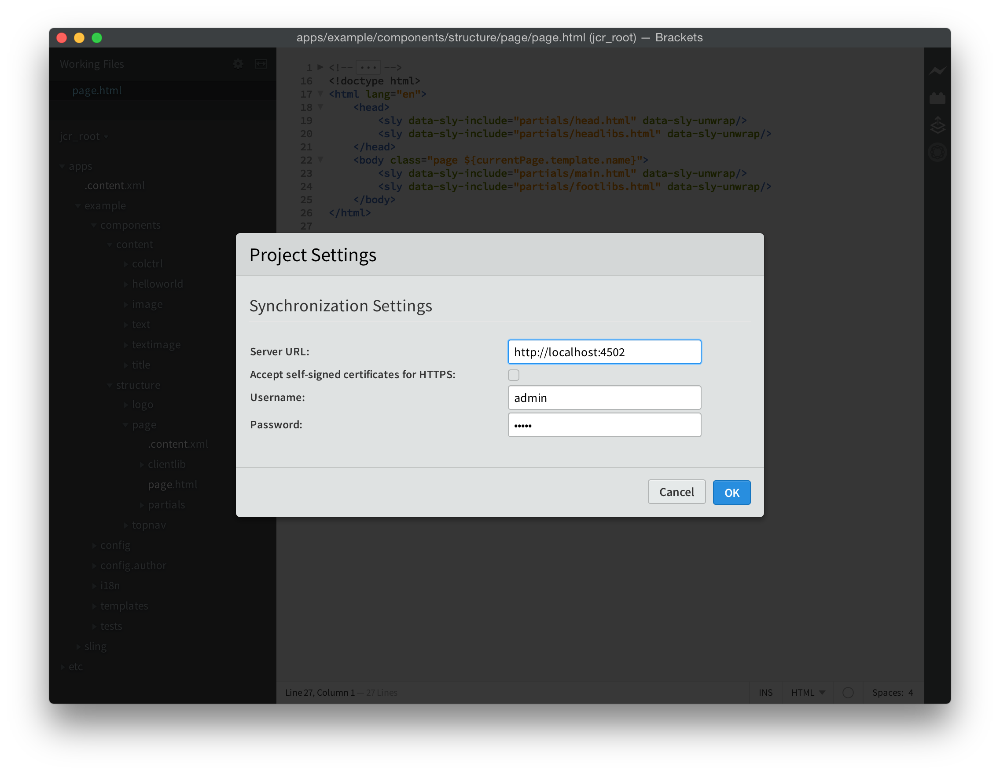

# Estensione parentesi AEM{#aem-brackets-extension}

## Panoramica {#overview}

L&#39;estensione per Brackets AEM fornisce un flusso di lavoro fluido per modificare i componenti AEM e le librerie client e utilizza la potenza dell&#39;editor di codice [Brackets](https://brackets.io/), che consente l&#39;accesso ai file e ai livelli Photoshop dall&#39;interno dell&#39;editor di codice. La facile sincronizzazione fornita dall’estensione (non è richiesto alcun Maven o File Vault) aumenta l’efficienza degli sviluppatori e aiuta anche gli sviluppatori front-end con conoscenze AEM limitate a partecipare ai progetti. Questa estensione fornisce anche un po&#39; di supporto per [HTML Template Language (HTL)](https://experienceleague.adobe.com/docs/experience-manager-htl/content/overview.html?lang=it), che elimina la complessità di JSP per rendere lo sviluppo dei componenti più semplice e sicuro.

### Funzioni {#features}

Le caratteristiche principali dell’estensione per Brackets dell’AEM sono:

* Sincronizzazione automatizzata dei file modificati con l’istanza di sviluppo AEM.
* Sincronizzazione bidirezionale manuale di file e cartelle.
* Sincronizzazione completa del pacchetto di contenuti del progetto.
* Completamento del codice HTL per espressioni e `data-sly-*` istruzioni di blocco.

Brackets offre inoltre molte funzioni utili per gli sviluppatori di font-end AEM:

* Supporto di file Photoshop per estrarre informazioni da un file PSD, come livelli, misure, colori, font, testi e così via.
* Suggerimenti sul codice dal PSD, per riutilizzare facilmente queste informazioni estratte nel codice.
* Supporto per il preprocessore CSS, come LESS e SCSS.
* E centinaia di estensioni aggiuntive che coprono esigenze più specifiche.

## Installazione {#installation}

### Parentesi {#brackets}

L&#39;estensione per Brackets AEM supporta Brackets versione 1.0 o successiva.

Scarica la versione più recente di Brackets da [brackets.io](https://brackets.io/).

### Estensione {#the-extension}

Per installare l’estensione, procedi come segue:

1. Aprire Parentesi. Nel menu **File**, selezionare **Extension Manager...**
1. Immetti **AEM** nella barra di ricerca e cerca **l&#39;estensione delle parentesi graffe AEM**.

   

1. Fare clic su **Installa**.
1. Chiudere la finestra di dialogo e l&#39;Extension Manager al termine dell&#39;installazione.

## Guida introduttiva {#getting-started}

### Il progetto Content-Package {#the-content-package-project}

Una volta installata l’estensione, puoi iniziare a sviluppare componenti AEM aprendo una cartella di pacchetti di contenuti dal file system con Brackets.

Il progetto deve contenere almeno:

1. una cartella `jcr_root` (ad esempio, `myproject/jcr_root`)

1. un file `filter.xml` (ad esempio, `myproject/META-INF/vault/filter.xml`); per ulteriori dettagli sulla struttura del file `filter.xml` vedi la [definizione filtro Workspace](https://jackrabbit.apache.org/filevault/filter.html).

Nel menu **File** di Brackets, scegli **Apri cartella...** e scegli la cartella `jcr_root` o la cartella del progetto principale.

>[!NOTE]
>
>Se non disponi di un tuo progetto con un pacchetto di contenuti, puoi provare l&#39;[Esempio HTL TodoMVC](https://github.com/Adobe-Marketing-Cloud/aem-sightly-sample-todomvc). Su GitHub, fai clic su **Scarica ZIP**, estrai i file localmente e, come indicato in precedenza, apri la cartella `jcr_root` in Brackets. Quindi segui i passaggi seguenti per configurare le **Impostazioni progetto** e infine caricare l&#39;intero pacchetto nell&#39;istanza di sviluppo AEM eseguendo un **Esporta pacchetto contenuto** come indicato più avanti nella sezione Sincronizzazione completa pacchetto contenuti.
>
>Dopo questi passaggi, dovresti essere in grado di accedere all&#39;URL `/content/todo.html` nell&#39;istanza di sviluppo AEM e di iniziare a modificare il codice in Brackets per vedere come, dopo aver eseguito un aggiornamento nel browser web, le modifiche sono state immediatamente sincronizzate con il server AEM.

### Impostazioni progetto {#project-settings}

Per sincronizzare i contenuti con e da un’istanza di sviluppo AEM, devi definire le Impostazioni del progetto. Per eseguire questa operazione, vai al menu **AEM** e scegli **Impostazioni progetto...**

Le Impostazioni progetto consentono di definire quanto segue:

1. URL del server (ad esempio, `http://localhost:4502`)
1. Tollerare i server che non dispongono di un certificato HTTPS valido (mantieni deselezionato, a meno che non sia necessario)
1. Nome utente utilizzato per la sincronizzazione del contenuto (ad esempio, `admin`)
1. Password dell&#39;utente (ad esempio, `admin`)

## Sincronizzazione dei contenuti {#synchronizing-content}

L&#39;estensione Brackets AEM fornisce i seguenti tipi di sincronizzazione del contenuto per file e cartelle consentiti dalle regole di filtro definite in `filter.xml`:

### Sincronizzazione Automatizzata Dei File Modificati {#automated-synchronization-of-changed-files}

In questo modo verranno sincronizzate solo le modifiche da Brackets all’istanza AEM, ma mai il contrario.

### Sincronizzazione bidirezionale manuale {#manual-bidirectional-synchronization}

In Esplora progetti aprire il menu contestuale facendo clic con il pulsante destro del mouse su un file o una cartella e accedere alle opzioni **Esporta su server** o **Importa da server**.

>[!NOTE]
>
>Se la voce selezionata si trova all&#39;esterno della cartella `jcr_root`, le voci di menu contestuali **Esporta su server** e **Importa da server** sono disabilitate.

### Sincronizzazione completa dei pacchetti di contenuti {#full-content-package-synchronization}

Nel menu **AEM**, le opzioni **Esporta pacchetto contenuti** o **Importa pacchetto contenuti** consentono di sincronizzare l&#39;intero progetto con il server.

### Stato di sincronizzazione {#synchronization-status}

L&#39;estensione per parentesi quadre AEM presenta un&#39;icona di notifica nella barra degli strumenti a destra della finestra Parentesi quadre, che indica lo stato dell&#39;ultima sincronizzazione:

* verde - tutti i file sono stati sincronizzati correttamente
* blu: è in corso un’operazione di sincronizzazione
* giallo - alcuni file non sono stati sincronizzati
* rosso: nessuno dei file è stato sincronizzato

Facendo clic sull&#39;icona di notifica viene visualizzata la finestra di dialogo Rapporto stato di sincronizzazione, in cui è riportato l&#39;elenco di tutti gli stati di ciascun file sincronizzato.

>[!NOTE]
>
>Solo il contenuto contrassegnato come incluso dalle regole di filtro di `filter.xml` verrà sincronizzato, indipendentemente dal metodo di sincronizzazione utilizzato.
>
>Sono inoltre supportati `.vltignore` file per escludere il contenuto dalla sincronizzazione con e dal repository.

## Modifica del codice HTL {#editing-htl-code}

L’estensione AEM Brackets dispone anche di un completamento automatico per facilitare la scrittura di attributi ed espressioni HTL.

### Completamento automatico attributo {#attribute-auto-completion}

1. In un attributo HTML, digitare `sly`. Attributo completato automaticamente in `data-sly-`.
1. Seleziona l’attributo HTL nell’elenco a discesa.

### Completamento automatico espressione {#expression-auto-completion}

All&#39;interno di un&#39;espressione `${}`, i nomi delle variabili comuni vengono completati automaticamente.

## Ulteriori informazioni {#more-information}

L&#39;estensione AEM Brackets è un progetto open-source, ospitato su GitHub dall&#39;organizzazione [Adobe Marketing Cloud](https://github.com/Adobe-Marketing-Cloud), con licenza Apache versione 2.0:

* Archivio codici: [https://github.com/Adobe-Marketing-Cloud/aem-sightly-brackets-extension](https://github.com/Adobe-Marketing-Cloud/aem-sightly-brackets-extension)
* Licenza Apache, versione 2.0: [https://www.apache.org/licenses/LICENSE-2.0.html](https://www.apache.org/licenses/LICENSE-2.0.html)

L&#39;editor di codice Brackets è anche un progetto open-source, ospitato su GitHub dall&#39;organizzazione [Adobe Systems Incorporated](https://github.com/adobe):

* Archivio codici: [https://github.com/adobe/brackets](https://github.com/adobe/brackets)

Sentiti libero di contribuire!
