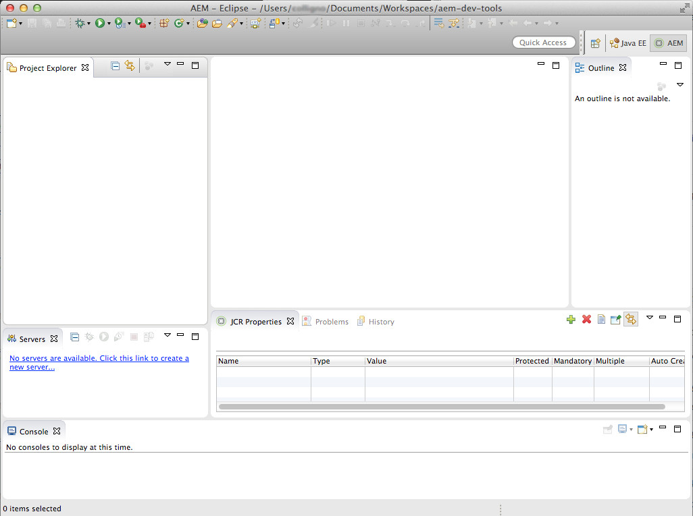

# Strumenti AEM Developer per Eclipse{#aem-developer-tools-for-eclipse}


## Panoramica {#overview}

&quot;Strumenti per sviluppatori AEM&quot; è un plug-in Eclipse basato sul plug-in [Eclipse per Apache Sling](https://sling.apache.org/documentation/development/ide-tooling.html) rilasciato con la Licenza Apache 2.

Offre diverse funzioni che facilitano lo sviluppo dell’AEM:

* Integrazione perfetta con le istanze AEM tramite il connettore del server Eclipse.
* Sincronizzazione sia per i bundle di contenuti che per quelli OSGI.
* Supporto del debug con funzionalità di hot-swapping del codice.
* Semplice Bootstrap di progetti AEM tramite una procedura guidata specifica per la creazione di progetti.
* Facile modifica delle proprietà JCR.

## Requisiti {#requirements}

Prima di utilizzare gli strumenti per sviluppatori dell’AEM, effettua le seguenti operazioni:

* Scarica e installa [Eclipse IDE per sviluppatori Java™ EE](https://www.eclipse.org/downloads/packages/release/luna/r/eclipse-ide-java-ee-developers). Gli strumenti per sviluppatori di AEM supportano attualmente Eclipse Kepler o versioni successive

* Può essere utilizzato con AEM versione 5.6.1 o successiva
* Configura l&#39;installazione di eclipse per assicurarti di disporre di almeno 1 GB di memoria heap modificando il file di configurazione `eclipse.ini` come descritto nelle [Domande frequenti su Eclipse](https://wiki.eclipse.org/FAQ_How_do_I_increase_the_heap_size_available_to_Eclipse%3F).

>[!NOTE]
>
>In macOS, fare clic con il pulsante destro del mouse su **Eclipse.app**, quindi selezionare **Mostra contenuto pacchetto** per trovare `eclipse.ini`.

## Come installare gli strumenti per sviluppatori AEM per Eclipse {#how-to-install-the-aem-developer-tools-for-eclipse}

Dopo aver soddisfatto i [requisiti](#requirements) di cui sopra, puoi installare il plug-in come segue:

1. Sfoglia il sito Web **Strumenti per sviluppatori AEM** all&#39;indirizzo `https://eclipse.adobe.com/aem/dev-tools/`.

1. Copia il **collegamento di installazione**.

   In alternativa, è possibile scaricare un archivio invece di utilizzare il collegamento di installazione. Questa operazione consente l’installazione offline, ma non le notifiche di aggiornamento automatico.

1. In Eclipse aprire il menu **Guida**.
1. Fare clic su **Installa nuovo software**.
1. Fare clic su **Aggiungi...**.
1. In **Name** digitare AEM Developer Tools.
1. In **Posizione** copiare l&#39;URL di installazione.
1. Fare clic su **Ok**.
1. Controlla entrambi i plug-in **AEM** e **Sling**.
1. Fai clic su **Avanti**.
1. Fai clic su **Avanti**.
1. Accettare i contratti di linea e fare clic su **Fine**.
1. Fare clic su **Sì** per riavviare Eclipse.

## Importare Progetti Esistenti {#how-to-import-existing-projects}

>[!NOTE]
>
>Vedi [Come utilizzare un bundle in Eclipse quando è stato scaricato da AEM](https://stackoverflow.com/questions/29699726/how-to-work-with-a-bundle-in-eclipse-when-it-was-downloaded-from-aem/29705407#29705407).

## La prospettiva dell&#39;AEM {#the-aem-perspective}

Gli strumenti di sviluppo AEM per Eclipse vengono forniti con una prospettiva che offre il pieno controllo sui tuoi progetti e istanze AEM.



## Esempio di progetto con più moduli {#sample-multi-module-project}

Gli &quot;Strumenti per sviluppatori AEM&quot; includono un esempio di progetto con più moduli che ti consente di imparare rapidamente a utilizzare la configurazione di un progetto in Eclipse. Funge anche da guida alle best practice per diverse funzioni dell’AEM. [Ulteriori informazioni su Archetipo progetto](https://github.com/adobe/aem-project-archetype).

La procedura seguente illustra come creare il progetto di esempio:

1. Nel menu **File** > **Nuovo** > **Progetto**, individua la sezione **AEM** e seleziona **Progetto con più moduli AEM di esempio**.

   

1. Fai clic su **Avanti**.

   >[!NOTE]
   >
   >Questo passaggio potrebbe richiedere del tempo perché m2eclipse deve analizzare i cataloghi dell’archetipo.

   

1. Scegli **com.adobe.granite.archetypes : sample-project-archetype : (numero più alto)** dal menu, quindi fai clic su **Next**.

   

1. Compila un **Nome**, **ID gruppo** e un **ID elemento** per il progetto di esempio. Puoi anche scegliere di impostare alcune proprietà avanzate.

   

1. Ora configura un server AEM a cui Eclipse può connettersi.

   Per utilizzare la funzione di debugger, accertati di aver avviato AEM in modalità di debug aggiungendo quanto segue alla riga di comando:

   ```
       -nofork -agentlib:jdwp=transport=dt_socket,server=y,suspend=n,address=10123
   ```

   

1. Fare clic su **Fine**. Viene creata la struttura del progetto.

   >[!NOTE]
   >
   >In una nuova installazione (nello specifico, quando le dipendenze Maven non sono mai state scaricate) puoi creare il progetto con errori. In questo caso, seguire la procedura descritta in [Risoluzione della definizione del progetto non valida](#resolving-invalid-project-definition).

## Risoluzione dei problemi {#troubleshooting}

### Risoluzione di una definizione di progetto non valida {#resolving-invalid-project-definition}

Per risolvere le dipendenze non valide e la definizione del progetto procedere come segue:

1. Seleziona tutti i progetti creati.
1. Fare clic con il pulsante destro del mouse. Nel menu **Maven**, seleziona **Aggiorna progetti**.
1. Controlla **Forza aggiornamenti di snapshot/release**.
1. Fare clic su **OK**. Eclipse tenta di scaricare le dipendenze richieste.

### Abilitazione del completamento automatico della libreria di tag nei file JSP {#enabling-tag-library-autocompletion-in-jsp-files}

Il completamento automatico della libreria di tag funziona in modo predefinito, dato che al progetto vengono aggiunte le dipendenze appropriate. Esiste un problema noto quando si utilizza il file JAR Uber dell’AEM, che non include i file tld e TagExtraInfo necessari.

Per ovviare a questo problema, accertati che l’artefatto org.apache.sling.scripting.jsp.taglib si trovi nel percorso di classe prima del file JAR Uber dell’AEM. Per i progetti Maven, inserisci la seguente dipendenza nel file pom.xml prima del file JAR Uber.

```xml
<dependency>
  <groupId>org.apache.sling</groupId>
  <artifactId>org.apache.sling.scripting.jsp.taglib</artifactId>
  <scope>provided</scope>
</dependency>
```

Assicurati di aggiungere la versione corretta per la distribuzione dell’AEM.

## Ulteriori informazioni {#more-information}

Il sito web ufficiale Apache Sling IDE tooling per Eclipse fornisce informazioni utili:

* La [**Guida utente di Apache Sling IDE tooling per Eclipse**](https://sling.apache.org/documentation/development/ide-tooling.html), questa documentazione ti guida attraverso i concetti generali, l&#39;integrazione del server e le funzionalità di distribuzione supportate dagli strumenti di sviluppo AEM.
* La [sezione Risoluzione dei problemi](https://sling.apache.org/documentation/development/ide-tooling.html#troubleshooting).
* [Elenco dei problemi noti](https://sling.apache.org/documentation/development/ide-tooling.html#known-issues).

La seguente documentazione ufficiale di [Eclipse](https://www.eclipse.org/) può essere utile per configurare l&#39;ambiente:

* [Guida introduttiva a Eclipse](https://eclipseide.org/getting-started/)
* [Guida di Eclipse Luna](https://help.eclipse.org/latest/index.jsp)
* [Integrazione Maven (m2eclipse)](https://www.eclipse.org/m2e/)
