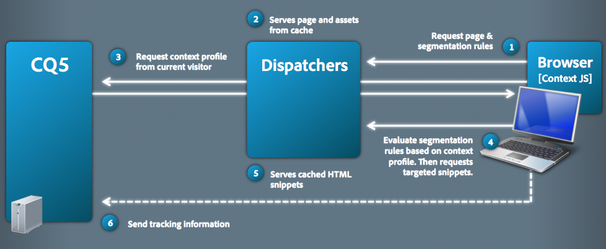

# ClientContext nei dettagli{#client-context-in-detail}

>[!NOTE]
>
>ClientContext è stato sostituito da ContextHub. Per informazioni dettagliate, consulta la [documentazione correlata](/help/sites-developing/contexthub.md).

ClientContext rappresenta una raccolta assemblata dinamicamente di dati utente. Puoi utilizzare i dati per determinare il contenuto da visualizzare su una pagina web in una determinata situazione (targeting del contenuto). I dati sono disponibili anche per l’analisi dei siti web e per qualsiasi JavaScript sulla pagina.

ClientContext è costituito principalmente dai seguenti aspetti:

* Archivio di sessione contenente i dati utente.
* L’interfaccia utente che visualizza i dati utente e fornisce gli strumenti per simulare l’esperienza utente.
* [API JavaScript](/help/sites-developing/ccjsapi.md) per l&#39;interazione con gli archivi di sessione.

Per creare un archivio di sessione autonomo e aggiungerlo a ClientContext oppure creare un archivio di sessione associato a un componente Archivio di sessione autonomo. Adobe Experience Manager (AEM) installa diversi componenti dell’archivio contestuale che puoi utilizzare immediatamente. Puoi utilizzare questi componenti come base per i tuoi componenti.

Per informazioni sull&#39;apertura di Client Context, sulla configurazione delle informazioni visualizzate e sulla simulazione dell&#39;esperienza utente, vedere [Client Context](/help/sites-administering/client-context.md).

## Archivi sessione {#session-stores}

ClientContext include vari archivi di sessione che contengono dati utente. I dati dell’archivio provengono dalle seguenti origini:

* Il browser Web client.
* Il server (vedi [Archivio JSONP](/help/sites-administering/client-context.md#main-pars-variable-8) per l&#39;archiviazione di informazioni da origini di terze parti)

Il framework ClientContext fornisce un&#39;[API JavaScript](/help/sites-developing/ccjsapi.md) che è possibile utilizzare per interagire con gli archivi di sessione per leggere e scrivere i dati utente e per ascoltare e reagire agli eventi di archivio. Puoi anche creare archivi di sessione per i dati utente da utilizzare per il targeting del contenuto o per altri scopi.

I dati dell&#39;archivio sessione rimangono nel client. ClientContext non riscrive i dati sul server. Per inviare dati al server, utilizzare un modulo o sviluppare un JavaScript personalizzato.

Ogni archivio sessione è una raccolta di coppie proprietà-valore. L’archivio delle sessioni rappresenta una raccolta di dati (di qualsiasi tipo) il cui significato concettuale può essere deciso dal progettista, dallo sviluppatore o da entrambi. L’esempio di codice JavaScript che segue definisce un oggetto che rappresenta i dati di profilo che l’archivio di sessione potrebbe contenere:

```
{
  age: 20,
  authorizableId: "aparker@geometrixx.info",
  birthday: "27 Feb 1992",
  email: "aparker@geometrixx.info",
  formattedName: "Alison Parker",
  gender: "female",
  path: "/home/users/geometrixx/aparker@geometrixx.info/profile"
}
```

Un archivio di sessione può essere mantenuto per tutte le sessioni del browser o può durare solo per la sessione del browser in cui viene creato.

>[!NOTE]
>
>La persistenza dello store utilizza l&#39;archiviazione del browser o i cookie (cookie `SessionPersistence`). L’archiviazione del browser è più comune.
>
>Quando il browser viene chiuso e riaperto, è possibile caricare un archivio di sessione con i valori provenienti da un archivio persistente. Per rimuovere i vecchi valori è necessario cancellare la cache del browser.

### Componenti archivio contesto {#context-store-components}

Un componente archivio contesto è un componente CQ che può essere aggiunto a ClientContext. In genere, i componenti dell’archivio di contesto visualizzano i dati di un archivio di sessione a cui sono associati. Tuttavia, le informazioni visualizzate dai componenti dell’archivio di contesto non sono limitate ai dati dell’archivio di sessione.

I componenti dell’archivio contesto possono includere i seguenti elementi:

* Script JSP che definiscono l’aspetto in ClientContext.
* Proprietà per elencare il componente nel Sidekick.
* Finestre di dialogo di modifica per la configurazione delle istanze dei componenti.
* JavaScript che inizializza l&#39;archivio sessioni.

Per una descrizione dei componenti dell&#39;archivio contesto installati che è possibile aggiungere all&#39;archivio contesto, vedere [Componenti contesto client disponibili](/help/sites-administering/client-context.md#available-client-context-components).

>[!NOTE]
>
>I dati di pagina non sono più nel contesto client come componente predefinito. Se necessario, è possibile aggiungerlo modificando il contesto del client, aggiungendo il componente **Proprietà store generiche** e configurandolo per definire l&#39;archivio **Store** come `pagedata`.

### Consegna mirata dei contenuti {#targeted-content-delivery}

Le informazioni sul profilo vengono utilizzate anche per la consegna di [contenuto con targeting](/help/sites-authoring/content-targeting-touch.md).

 

## Aggiunta Di ClientContext A Una Pagina {#adding-client-context-to-a-page}

Includi il componente ClientContext nella sezione body delle pagine web per abilitare ClientContext. Il percorso del nodo del componente ClientContext è `/libs/cq/personalization/components/clientcontext`. Per includere il componente, aggiungi il seguente codice al file JSP del componente page, che si trova appena sotto l&#39;elemento `body` della pagina:

```java
<cq:include path="clientcontext" resourceType="cq/personalization/components/clientcontext"/>
```

Il componente clientcontext fa sì che la pagina carichi le librerie client che implementano ClientContext.

* API JavaScript ClientContext.
* Framework ClientContext che supporta gli archivi di sessione, la gestione degli eventi e così via.
* Segmenti definiti.
* Gli script init.js generati per ogni componente dell’archivio di contesto aggiunto a ClientContext.
* (Solo istanza Autore) Interfaccia utente di ClientContext.

L’interfaccia utente ClientContext è disponibile solo nell’istanza di authoring.

## Estensione ClientContext {#extending-client-context}

Per estendere ClientContext, crea un archivio sessione e, facoltativamente, visualizza i dati dell’archivio:

* Crea un archivio di sessione per i dati utente necessari per il targeting dei contenuti e l’analisi web.
* Crea un componente archivio di contesto per consentire agli amministratori di configurare l’archivio di sessione associato e di visualizzare i dati dell’archivio in ClientContext a scopo di test.

>[!NOTE]
>
>Se si dispone (o si crea) un servizio `JSONP` in grado di fornire i dati, è sufficiente utilizzare il componente archivio di contesto `JSONP` e mapparlo al servizio JSONP. Gestisce l&#39;archivio sessione.

### Creazione di un archivio sessioni {#creating-a-session-store}

Crea un archivio di sessione per i dati da aggiungere e recuperare da ClientContext. In genere, per creare un archivio di sessione si utilizza la procedura seguente:

1. Creare una cartella della libreria client con il valore della proprietà `categories` di `personalization.stores.kernel`. ClientContext carica automaticamente le librerie client di questa categoria.

1. Configurare la cartella della libreria client in modo che abbia una dipendenza dalla cartella della libreria client `personalization.core.kernel`. La libreria client `personalization.core.kernel` fornisce l&#39;API JavaScript ClientContext.

1. Aggiungi il JavaScript che crea e inizializza l’archivio sessione.

L’inclusione di JavaScript nella libreria client personalization.store.kernel determina la creazione dell’archivio al caricamento del framework ClientContext.

>[!NOTE]
>
>Se stai creando un archivio sessione come parte di un componente archivio contesto, in alternativa puoi inserire il JavaScript nel file init.js.jsp del componente. In questo caso, l’archivio della sessione viene creato solo se il componente viene aggiunto a ClientContext.

#### Tipi di archivi di sessione {#types-of-session-stores}

Gli archivi di sessione vengono creati e disponibili durante una sessione del browser oppure vengono memorizzati in modo permanente nell’archiviazione del browser o nei cookie. L’API JavaScript ClientContext definisce diverse classi che rappresentano entrambi i tipi di archivi dati:

* ` [CQ_Analytics.SessionStore](/help/sites-developing/ccjsapi.md#cq-analytics-sessionstore)`: questi oggetti risiedono solo nel DOM della pagina. I dati vengono creati e memorizzati per tutta la durata della pagina.
* ` [CQ_Analytics.PerstistedSessionStore](/help/sites-developing/ccjsapi.md#cq-analytics-persistedsessionstore)`: questi oggetti risiedono nel DOM della pagina e vengono salvati in modo permanente nell&#39;archiviazione del browser o nei cookie. I dati sono disponibili su più pagine e tra sessioni utente.

L’API fornisce anche estensioni di queste classi, specializzate per l’archiviazione di dati JSON o JSONP:

* Oggetti solo sessione: [CQ_Analytics.JSONStore](/help/sites-developing/ccjsapi.md#cq-analytics-jsonstore) e [CQ_Analytics.JSONPStore](/help/sites-developing/ccjsapi.md#cq-analytics-jsonpstore).

* Oggetti persistenti: [CQ_Analytics.PersistedJSONStore](/help/sites-developing/ccjsapi.md#cq-analytics-persistedjsonstore) e [CQ_Analytics.PersistedJSONPStore](/help/sites-developing/ccjsapi.md#cq-analyics-persistedjsonpstore).

#### Creazione dell&#39;oggetto archivio sessione {#creating-the-session-store-object}

Il JavaScript della cartella della libreria client crea e inizializza l’archivio della sessione. L’archivio sessione deve essere registrato utilizzando Context Store Manager. Nell&#39;esempio seguente viene creato e registrato un oggetto [CQ_Analytics.SessionStore](/help/sites-developing/ccjsapi.md#cq-analytics-sessionstore).

```
//Create the session store
if (!CQ_Analytics.MyStore) {
    CQ_Analytics.MyStore = new CQ_Analytics.SessionStore();
    CQ_Analytics.MyStore.STOREKEY = "MYSTORE";
    CQ_Analytics.MyStore.STORENAME = "mystore";
    CQ_Analytics.MyStore.data={};
}
//register the session store
if (CQ_Analytics.ClientContextMgr){
    CQ_Analytics.ClientContextMgr.register(CQ_Analytics.MyStore)
}
```

Per l&#39;archiviazione dei dati JSON, nell&#39;esempio seguente viene creato e registrato un oggetto [CQ_Analytics.JSONStore](/help/sites-developing/ccjsapi.md#cq-analytics-sessionstore).

```
if (!CQ_Analytics.myJSONStore) {
    CQ_Analytics.myJSONStore = CQ_Analytics.JSONStore.registerNewInstance("myjsonstore",{});
}
```

### Creazione di un componente archivio contesto {#creating-a-context-store-component}

Crea un componente archivio di contesto per eseguire il rendering dei dati archivio sessione in ClientContext. Una volta creato, puoi trascinare il componente archivio di contesto in ClientContext per eseguire il rendering dei dati da un archivio di sessione. I componenti dell’archivio contesto sono costituiti dai seguenti elementi:

* Script JSP per il rendering dei dati.
* Una finestra di dialogo per modifica.
* Uno script JSP per l’inizializzazione dell’archivio di sessione.
* (Facoltativo) Cartella della libreria client che crea l&#39;archivio sessione. Non è necessario includere la cartella della libreria client se il componente utilizza un archivio di sessione esistente.

#### Estensione dei componenti dell’archivio contesto forniti {#extending-the-provided-context-store-components}

AEM fornisce i componenti archivio dati generico e archivio dati contestuali genericstoreproperties che è possibile estendere. La struttura dei dati del tuo archivio determina il componente che estendi:

* Coppie proprietà-valore: estendere il componente `GenericStoreProperties`. Questo componente esegue automaticamente il rendering degli archivi di coppie proprietà-valore. Vengono forniti diversi punti di interazione:

   * `prolog.jsp` e `epilog.jsp`: interazione del componente che consente di aggiungere logica lato server prima o dopo il rendering del componente.

* Dati complessi: estendere il componente `GenericStore`. L’archivio delle sessioni necessita di un metodo &quot;renderer&quot; chiamato ogni volta che è necessario eseguire il rendering del componente. La funzione di rendering viene chiamata con due parametri:

   * `@param {String} store`
Archivio di cui eseguire il rendering

   * `@param {String} divId`
ID del div in cui deve essere eseguito il rendering dell’archivio.

>[!NOTE]
>
>Tutti i componenti ClientContext sono estensioni dei componenti Generic Store o Generic Store Properties. Nella cartella `/libs/cq/personalization/components/contextstores` sono installati diversi esempi.

#### Configurazione dell&#39;aspetto nel Sidekick {#configuring-the-appearance-in-sidekick}

Quando si modifica ClientContext, i componenti dell’archivio contestuale vengono visualizzati nel Sidekick. Come per tutti i componenti, le proprietà `componentGroup` e `jcr:title` del componente contesto client determinano il gruppo e il nome del componente.

Per impostazione predefinita, tutti i componenti con valore di proprietà `componentGroup` pari a `Client Context` vengono visualizzati nel Sidekick. Se si utilizza un valore diverso per la proprietà `componentGroup`, è necessario aggiungere manualmente il componente al Sidekick utilizzando la modalità Progettazione.

#### Istanze componente archivio contesto {#context-store-component-instances}

Quando si aggiunge un componente archivio di contesto a ClientContext, viene creato un nodo che rappresenta l&#39;istanza del componente sotto `/etc/clientcontext/default/content/jcr:content/stores`. Questo nodo contiene i valori delle proprietà configurati utilizzando la finestra di dialogo per modifica del componente.

Quando ClientContext viene inizializzato, questi nodi vengono elaborati.

#### Inizializzazione dell&#39;archivio sessioni associato {#initializing-the-associated-session-store}

Aggiungi un file init.js.jsp al componente per generare il codice JavaScript che inizializza l’archivio sessioni utilizzato dal componente archivio contesto. Ad esempio, utilizza lo script di inizializzazione per recuperare le proprietà di configurazione del componente e utilizzarle per popolare l’archivio della sessione.

Il JavaScript generato viene aggiunto alla pagina quando ClientContext viene inizializzato al caricamento della pagina sia sulle istanze di authoring che di pubblicazione. Questa JSP viene eseguita prima del caricamento e del rendering dell’istanza del componente dell’archivio di contesto.

Il codice deve impostare il tipo MIME del file su `text/javascript`, altrimenti non viene eseguito.

>[!CAUTION]
>
>Lo script init.js.jsp viene eseguito sull’istanza di authoring e pubblicazione, ma solo se il componente archivio di contesto viene aggiunto a ClientContext.

La procedura seguente crea il file di script init.js.jsp e aggiunge il codice che imposta il tipo mime corretto. Segue il codice che esegue l&#39;inizializzazione dell&#39;archivio.

1. Fai clic con il pulsante destro del mouse sul nodo del componente archivio di contesto e fai clic su Crea > Crea file.
1. Nel campo Nome digitare `init.js.jsp` e quindi fare clic su OK.
1. Nella parte superiore della pagina, aggiungi il seguente codice e fai clic su Salva tutto.

   ```java
   <%@page contentType="text/javascript" %>
   ```

### Rendering dei dati dell&#39;archivio sessione per i componenti genericstoreproperties {#rendering-session-store-data-for-genericstoreproperties-components}

Visualizza i dati dell’archivio sessioni in ClientContext utilizzando un formato coerente.

#### Visualizzazione dei dati delle proprietà {#displaying-property-data}

La taglib di personalizzazione fornisce il tag `personalization:storePropertyTag` che visualizza il valore di una proprietà da un archivio sessione. Per utilizzare il tag, includi la seguente riga di codice nel file JSP:

```xml
<%@taglib prefix="personalization" uri="https://www.day.com/taglibs/cq/personalization/1.0" %>
```

Il tag ha il seguente formato:

```xml
<personalization:storePropertyTag propertyName="property_name" store="session_store_name"/>
```

L&#39;attributo `propertyName` è il nome della proprietà dell&#39;archivio da visualizzare. L&#39;attributo `store` è il nome dell&#39;archivio registrato. Il seguente tag di esempio visualizza il valore della proprietà `authorizableId` dell&#39;archivio `profile`:

```xml
<personalization:storePropertyTag propertyName="authorizableId" store="profile"/>
```

#### Struttura HTML {#html-structure}

La cartella della libreria client personalization.ui (/etc/clientlibs/foundation/personalization/ui/theme/default) fornisce gli stili CSS utilizzati da ClientContext per formattare il codice HTML. Il codice seguente illustra la struttura consigliata da utilizzare per la visualizzazione dei dati dell&#39;archivio:

```xml
<div class="cq-cc-store">
   <div class="cq-cc-thumbnail">
      <div class="cq-cc-store-property">
           <!-- personalization:storePropertyTag for the store thumbnail image goes here -->
      </div>
   </div>
   <div class="cq-cc-content">
       <div class="cq-cc-store-property cq-cc-store-property-level0">
           <!-- personalization:storePropertyTag for a store property goes here -->
       </div>
       <div class="cq-cc-store-property cq-cc-store-property-level1">
           <!-- personalization:storePropertyTag for a store property goes here -->
       </div>
       <div class="cq-cc-store-property cq-cc-store-property-level2">
           <!-- personalization:storePropertyTag for a store property goes here -->
       </div>
       <div class="cq-cc-store-property cq-cc-store-property-level3">
           <!-- personalization:storePropertyTag for a store property goes here -->
       </div>
   </div>
   <div class="cq-cc-clear"></div>
</div>
```

Il componente dell&#39;archivio di contesto `/libs/cq/personalization/components/contextstores/profiledata` utilizza questa struttura per visualizzare i dati dall&#39;archivio di sessione del profilo. La classe `cq-cc-thumbnail` inserisce l&#39;immagine di anteprima. Le classi `cq-cc-store-property-level*x*` formattano i dati alfanumerici:

* level0, level1 e level2 sono distribuiti verticalmente e utilizzano un font bianco.
* level3 ed eventuali livelli aggiuntivi sono distribuiti orizzontalmente e utilizzano un carattere bianco con uno sfondo più scuro.


### Rendering dei dati dell&#39;archivio sessione per i componenti genericstore {#rendering-session-store-data-for-genericstore-components}

Per eseguire il rendering dei dati di archivio utilizzando un componente genericstore, è necessario effettuare le seguenti operazioni:

* Aggiungi il tag personalization:storeRendererTag allo script JSP del componente per identificare il nome dell’archivio sessione.
* Implementa un metodo di rendering nella classe dell’archivio di sessione.

#### Identificazione dell&#39;archivio sessioni genericstore {#identifying-the-genericstore-session-store}

La taglib di personalizzazione fornisce il tag `personalization:storePropertyTag` che visualizza il valore di una proprietà da un archivio sessione. Per utilizzare il tag, includi la seguente riga di codice nel file JSP:

```xml
<%@taglib prefix="personalization" uri="https://www.day.com/taglibs/cq/personalization/1.0" %>
```

Il tag ha il seguente formato:

```java
<personalization:storeRendererTag store="store_name"/>
```

#### Implementazione del metodo del renderer dell’archivio sessioni {#implementing-the-session-store-renderer-method}

L’archivio delle sessioni necessita di un metodo &quot;renderer&quot; chiamato ogni volta che è necessario eseguire il rendering del componente. La funzione di rendering viene chiamata con due parametri:

* @param archivio {String}
Archivio di cui eseguire il rendering
* @param divId {String}
ID del div in cui deve essere eseguito il rendering dell’archivio.

## Interazione con gli archivi di sessione {#interacting-with-session-stores}

Utilizza JavaScript per interagire con gli archivi di sessione.

### Accesso agli store della sessione {#accessing-session-stores}

Ottieni un oggetto archivio sessione per leggere o scrivere dati nell’archivio. [CQ_Analytics.ClientContextMgr](/help/sites-developing/ccjsapi.md#cq-analytics-clientcontextmgr) fornisce l&#39;accesso agli archivi in base al nome dell&#39;archivio. Una volta ottenuti, utilizzare i metodi di [CQ_Analytics.SessionStore](/help/sites-developing/ccjsapi.md#cq-analytics-sessionstore) o [CQ_Analytics.PersistedSessionStore](/help/sites-developing/ccjsapi.md#cq-analytics-persistedsessionstore) per interagire con i dati dell&#39;archivio.

L&#39;esempio seguente ottiene l&#39;archivio `profile` e quindi recupera la proprietà `formattedName` dall&#39;archivio.

```
function getName(){
   var profilestore = CQ_Analytics.ClientContextMgr.getRegisteredStore("profile");
   if(profilestore){
      return profilestore.getProperty("formattedName", false);
   } else {
      return null;
   }
}
```

### Creazione di un listener per reagire a un aggiornamento dell’archivio sessioni {#creating-a-listener-to-react-to-a-session-store-update}

La sessione memorizza gli eventi di attivazione, pertanto è possibile aggiungere listener e attivare eventi in base a tali eventi.

Gli archivi di sessione sono basati sul modello `Observable`. Estendono [`CQ_Analytics.Observable`](/help/sites-developing/ccjsapi.md#cq-analytics-observable) che fornisce il metodo ` [addListener](/help/sites-developing/ccjsapi.md#addlistener-event-fct-scope)`.

Nell&#39;esempio seguente viene aggiunto un listener all&#39;evento `update` dell&#39;archivio di sessione `profile`.

```
var profileStore = ClientContextMgr.getRegisteredStore("profile");
if( profileStore ) {
  //callback execution context
  var executionContext = this;

  //add "update" event listener to store
  profileStore.addListener("update",function(store, property) {
    //do something on store update

  },executionContext);
}
```

### Controllo della definizione e inizializzazione di un archivio sessioni {#checking-that-a-session-store-is-defined-and-initialized}

Gli archivi di sessione non sono disponibili finché non vengono caricati e inizializzati con i dati. I seguenti fattori possono influenzare la tempistica di disponibilità dell’archivio sessioni:

* Caricamento pagina
* Caricamento JavaScript
* Tempo di esecuzione di JavaScript
* Tempi di risposta per le richieste XHR
* Modifiche dinamiche all’archivio delle sessioni

Utilizzare i metodi [onStoreRegistered](/help/sites-developing/ccjsapi.md#onstoreregistered-storename-callback) e [onStoreInitialized](/help/sites-developing/ccjsapi.md#onstoreinitialized-storename-callback-delay) dell&#39;oggetto [CQ_Analytics.ClientContextUtils](/help/sites-developing/ccjsapi.md#cq-analytics-clientcontextutils) per accedere agli archivi di sessione solo quando sono disponibili. Questi metodi consentono di registrare i listener di eventi che reagiscono agli eventi di registrazione e inizializzazione della sessione.

>[!CAUTION]
>
>Se dipendi da un altro negozio, devi fare i conti con il caso in cui il negozio non è mai registrato.

Nell&#39;esempio seguente viene utilizzato l&#39;evento `onStoreRegistered` dell&#39;archivio di sessione `profile`. Quando l&#39;archivio viene registrato, viene aggiunto un listener all&#39;evento `update` dell&#39;archivio sessione. Quando l&#39;archivio viene aggiornato, il contenuto dell&#39;elemento `<div class="welcome">` nella pagina viene aggiornato con il nome dell&#39;archivio `profile`.

```
//listen for the store registration
CQ_Analytics.ClientContextUtils.onStoreRegistered("profile", listen);

//listen for the store's update event
function listen(){
 var profilestore = CQ_Analytics.ClientContextMgr.getRegisteredStore("profile");
    profilestore.addListener("update",insertName);
}

//insert the welcome message
function insertName(){
 $("div.welcome").text("Welcome "+getName());
}

//obtain the name from the profile store
function getName(){
 var profilestore = CQ_Analytics.ClientContextMgr.getRegisteredStore("profile");
 if(profilestore){
  return profilestore.getProperty("formattedName", false);
    } else {
        return null;
    }
}
```

### Esclusione di una proprietà dal cookie sessionpersistence {#excluding-a-property-from-the-sessionpersistence-cookie}

Per evitare che una proprietà di `PersistedSessionStore` venga resa persistente (ovvero, esclusa dal cookie `sessionpersistence`), aggiungerla all&#39;elenco delle proprietà non persistenti dell&#39;archivio di sessione persistente.

Vedi ` [CQ_Analytics.PersistedSessionStore.setNonPersisted(propertyName)](/help/sites-developing/ccjsapi.md#setnonpersisted-name)`

```
CQ_Analytics.ClientContextUtils.onStoreRegistered("surferinfo", function(store) {
  //this will exclude the browser, OS and resolution properties of the surferinfo session store from the
  store.setNonPersisted("browser");
  store.setNonPersisted("OS");
  store.setNonPersisted("resolution");
});
```

## Configurazione del dispositivo di scorrimento {#configuring-the-device-slider}

### Condizioni {#conditions}

La pagina corrente deve avere una pagina corrispondente per dispositivi mobili; questo viene determinato solo se la pagina ha una Live Copy configurata con una configurazione di rollout per dispositivi mobili ( `rolloutconfig.path.toLowerCase` contiene `mobile`).

#### Configurazione {#configuration}

Quando si passa dalla pagina desktop all&#39;equivalente mobile:

* Il DOM della pagina mobile è caricato.
* Il `div` principale (obbligatorio) che contiene il contenuto viene estratto e inserito nella pagina del desktop corrente.

* Le classi CSS e body che vengono caricate devono essere configurate manualmente.

Ad esempio:

```
window.CQMobileSlider["geometrixx-outdoors"] = {
  //CSS used by desktop that need to be removed when mobile
  DESKTOP_CSS: [
    "/etc/designs/${app}/clientlibs_desktop_v1.css"
  ],

  //CSS used by mobile that need to be removed when desktop
  MOBILE_CSS: [
    "/etc/designs/${app}/clientlibs_mobile_v1.css"
  ],

  //id of the content that needs to be removed when mobile
  DESKTOP_MAIN_ID: "main",

  //id of the content that needs to be removed when desktop
  MOBILE_MAIN_ID: "main",

  //body classes used by desktop that need to be removed when mobile
  DESKTOP_BODY_CLASS: [
    "page"
  ],

  //body classes used by mobile that need to be removed when desktop
  MOBILE_BODY_CLASS: [
    "page-mobile"
  ]
};
```

## Esempio: creazione di un componente archivio contestuale personalizzato {#example-creating-a-custom-context-store-component}

In questo esempio, puoi creare un componente archivio di contesto che recupera i dati da un servizio esterno e li memorizza nell’archivio di sessione:

* Estende il componente genericstoreproperties.
* Inizializza un archivio utilizzando un oggetto CQ_Analytics.JSONPStore JavaScript.
* Chiama un servizio JSONP per recuperare i dati e aggiungerli all&#39;archivio.
* Esegue il rendering dei dati in ClientContext.

### Aggiungere il componente geologico {#add-the-geoloc-component}

Crea un’applicazione CQ e aggiungi il componente geoloc.

1. Apri CRXDE Lite nel browser ([https://localhost:4502/crx/de](https://localhost:4502/crx/de)).
1. Fare clic con il pulsante destro del mouse sulla cartella `/apps` e scegliere Crea > Crea cartella. Specificare un nome di `myapp` e quindi fare clic su OK.
1. Analogamente, sotto `myapp`, creare una cartella denominata `contextstores`. &quot;
1. Fare clic con il pulsante destro del mouse sulla cartella `/apps/myapp/contextstores` e scegliere Crea > Crea componente. Specifica i seguenti valori delle proprietà e fai clic su Avanti:

   * Etichetta: geoloc
   * Titolo: Archivio località
   * Super Type: cq/personalization/components/contextstore/genericstoreproperties
   * Gruppo: ClientContext

1. Nella finestra di dialogo Crea componente fare clic su Avanti in ogni pagina fino a quando il pulsante OK non viene attivato e quindi fare clic su OK.
1. Fai clic su Salva tutto.

### Creare la finestra di dialogo Modifica geologica {#create-the-geoloc-edit-dialog}

Il componente Archivio di contesto richiede una finestra di dialogo per modifica. La finestra di dialogo per modifica geografica contiene un messaggio statico che indica che non vi sono proprietà da configurare.

1. Fare clic con il pulsante destro del mouse sul nodo `/libs/cq/personalization/components/contextstores/genericstoreproperties/dialog` e scegliere Copia.
1. Fare clic con il pulsante destro del mouse sul nodo `/apps/myapp/contextstores/geoloc` e scegliere Incolla.
1. Elimina tutti i nodi secondari sotto il nodo /apps/myapp/contextstore/geoloc/dialog/items/items/tab1/items:

   * archiviare
   * proprietà
   * miniatura

1. Fare clic con il pulsante destro del mouse sul nodo `/apps/myapp/contextstores/geoloc/dialog/items/items/tab1/items` e scegliere Crea > Crea nodo. Specificare i valori delle proprietà seguenti e fare clic su OK:

   * Nome: statico
   * Tipo: cq:Widget

1. Aggiungi le seguenti proprietà al nodo:

   | Nome | Tipo | Valore |
   |---|---|---|
   | cls | Stringa | x-form-fieldset-description |
   | text | Stringa | Il componente geologico non richiede alcuna configurazione. |
   | xtype | Stringa | statico |

1. Fai clic su Salva tutto.

   

### Creare lo script di inizializzazione {#create-the-initialization-script}

Aggiungi un file init.js.jsp al componente geoloc e utilizzalo per creare l’archivio della sessione, recuperare i dati della posizione e aggiungerlo all’archivio.

Il file init.js.jsp viene eseguito quando ClientContext viene caricato dalla pagina. A questo punto, l’API JavaScript ClientContext viene caricata e disponibile per lo script.

1. Fai clic con il pulsante destro del mouse sul nodo /apps/myapp/contextstore/geoloc e fai clic su Crea > Crea file. Specificare il nome di init.js.jsp e fare clic su OK.
1. Aggiungi il codice seguente nella parte superiore della pagina, quindi fai clic su Salva tutto.

   ```java
   <%@page contentType="text/javascript;charset=utf-8" %><%
   %><%@include file="/libs/foundation/global.jsp"%><%
   log.info("***** initializing geolocstore ****");
   String store = "locstore";
   String jsonpurl = "https://api.wipmania.com/jsonp?callback=${callback}";
   
   %>
   var locstore = CQ_Analytics.StoreRegistry.getStore("<%= store %>");
   if(!locstore){
    locstore = CQ_Analytics.JSONPStore.registerNewInstance("<%= store %>", "<%= jsonpurl %>",{});
   }
   <% log.info(" ***** done initializing geoloc ************"); %>
   ```

### Eseguire il rendering dei dati dell’archivio sessione geoloc {#render-the-geoloc-session-store-data}

Aggiungi il codice al file JSP del componente geoloc per eseguire il rendering dei dati dell’archivio in ClientContext.


1. In CRXDE Lite, aprire il file `/apps/myapp/contextstores/geoloc/geoloc.jsp`.
1. Aggiungi il seguente codice HTML sotto il codice stub:

   ```xml
   <%@taglib prefix="personalization" uri="https://www.day.com/taglibs/cq/personalization/1.0" %>
   <div class="cq-cc-store">
      <div class="cq-cc-content">
          <div class="cq-cc-store-property cq-cc-store-property-level0">
              Continent: <personalization:storePropertyTag propertyName="address/continent" store="locstore"/>
          </div>
          <div class="cq-cc-store-property cq-cc-store-property-level1">
              Country: <personalization:storePropertyTag propertyName="address/country" store="locstore"/>
          </div>
          <div class="cq-cc-store-property cq-cc-store-property-level2">
              City: <personalization:storePropertyTag propertyName="address/city" store="locstore"/>
          </div>
          <div class="cq-cc-store-property cq-cc-store-property-level3">
              Latitude: <personalization:storePropertyTag propertyName="latitude" store="locstore"/>
          </div>
          <div class="cq-cc-store-property cq-cc-store-property-level4">
              Longitude: <personalization:storePropertyTag propertyName="longitude" store="locstore"/>
          </div>
      </div>
       <div class="cq-cc-clear"></div>
   </div>
   ```

1. Fai clic su Salva tutto.

### Aggiungere il componente a ClientContext {#add-the-component-to-client-context}

Aggiungi il componente Archivio posizione a ClientContext in modo che venga inizializzato al caricamento della pagina.

1. Apri la home page dei Geometrixx Outdoors nell&#39;istanza di authoring ([https://localhost:4502/content/geometrixx-outdoors/en.html](https://localhost:4502/content/geometrixx-outdoors/en.html)).
1. Fare clic su Ctrl-Alt-C (Windows) o su Control-Opzione-C (Mac) per aprire ClientContext.
1. Per aprire ClientContext Designer, fai clic sull’icona Modifica nella parte superiore di ClientContext.

   

1. Trascina il componente Archivio posizione in ClientContext.

### Visualizzare le informazioni sulla posizione in ClientContext {#see-the-location-information-in-client-context}

Apri la home page dei Geometrixx Outdoors in modalità di modifica, quindi apri ClientContext per visualizzare i dati dal componente Archivio posizione.

1. Apri la pagina inglese del sito Geometrixx Outdoors. ([https://localhost:4502/content/geometrixx-outdoors/en.html](https://localhost:4502/content/geometrixx-outdoors/en.html))
1. Per aprire ClientContext, premere Ctrl-Alt-c (Windows) o Control-option-c (Mac).

## Creazione di un contesto client personalizzato {#creating-a-customized-client-context}

Per creare un secondo contesto client, duplica il ramo:

`/etc/clientcontext/default`

* La sottocartella:
  `/content`
contiene il contenuto del contesto client personalizzato.

* La cartella:
  `/contextstores`
consente di definire configurazioni diverse per gli archivi contestuali.

Per utilizzare il contesto client personalizzato, modifica la proprietà
`path`
nello stile di progettazione del componente contesto client, come incluso nel modello di pagina. Ad esempio, come posizione standard di:
`/libs/cq/personalization/components/clientcontext/design_dialog/items/path`
