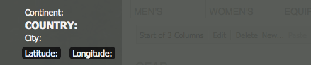

# ClientContext in Detail{#client-context-in-detail}

>[!NOTE]
>
>ClientContext è stato sostituito da ContextHub. Per ulteriori informazioni, consultare la [documentazione correlata](/help/sites-developing/contexthub.md).

ClientContext rappresenta una raccolta di dati utente assemblata in modo dinamico. Potete utilizzare i dati per determinare il contenuto da visualizzare su una pagina Web in una determinata situazione (targeting del contenuto). I dati sono disponibili anche per l&#39;analisi dei siti Web e per qualsiasi javascript nella pagina.

ClientContext è costituito principalmente dai seguenti aspetti:

* L&#39;archivio delle sessioni, che contiene i dati utente.
* Interfaccia utente che visualizza i dati utente e fornisce gli strumenti per simulare l&#39;esperienza utente.
* Una [API javascript](/help/sites-developing/ccjsapi.md) per interagire con gli store di sessioni.

Per creare un archivio di sessioni standalone e aggiungerlo a ClientContext oppure creare uno store di sessioni associato a un componente Context Store. AEM installa diversi componenti Context Store che puoi utilizzare immediatamente. Potete utilizzare questi componenti come base per i componenti.

Per informazioni sull&#39;apertura di ClientContext, sulla configurazione delle informazioni visualizzate e sulla simulazione dell&#39;esperienza utente, vedere [ClientContext](/help/sites-administering/client-context.md).

## Archivio sessione {#session-stores}

ClientContext include diversi store di sessioni contenenti dati utente. I dati dello store provengono dalle origini seguenti:

* Il browser Web del client.
* Il server (vedere [JSONP Store](/help/sites-administering/client-context.md#main-pars-variable-8) per l&#39;archiviazione di informazioni da origini terze parti)

Il framework ClientContext fornisce un [javascript API](/help/sites-developing/ccjsapi.md) che potete utilizzare per interagire con gli store di sessioni per leggere e scrivere i dati utente, nonché per ascoltare e reagire agli eventi di store. Potete anche creare store di sessioni per i dati utente da utilizzare per il targeting dei contenuti o per altri scopi.

I dati dell&#39;archivio delle sessioni rimangono sul client. ClientContext non riscrive i dati al server. Per inviare dati al server, utilizzare un modulo o sviluppare JavaScript personalizzato.

Ogni archivio di sessioni è un insieme di coppie proprietà-valore. Lo store di sessioni rappresenta una raccolta di dati (di qualsiasi tipo) il cui significato concettuale può essere deciso dal progettista e/o sviluppatore. Nell&#39;esempio seguente, il codice javascript definisce un oggetto che rappresenta i dati di profilo che potrebbero contenere gli archivi di sessioni:

```
{
  age: 20,
  authorizableId: "aparker@geometrixx.info",
  birthday: "27 Feb 1992",
  email: "aparker@geometrixx.info",
  formattedName: "Alison Parker",
  gender: "female",
  path: "/home/users/geometrixx/aparker@geometrixx.info/profile"
}
```

Un archivio delle sessioni può essere mantenuto nelle sessioni del browser, oppure può durare solo per la sessione del browser in cui viene creato.

>[!NOTE]
>
>La persistenza dello store utilizza l&#39;archiviazione del browser o i cookie (il cookie `SessionPersistence`). La memorizzazione del browser è più comune.
>
>Quando il browser viene chiuso e riaperto, uno store di sessioni può essere caricato con i valori di uno store persistente. La cancellazione della cache del browser è quindi necessaria per rimuovere i vecchi valori.

### Componenti per store di contesto {#context-store-components}

Un componente per l’archivio di contesto è un componente CQ che può essere aggiunto a ClientContext. In genere, i componenti dell&#39;archivio di contesto visualizzano i dati provenienti da uno store di sessioni a cui sono associati. Tuttavia, le informazioni visualizzate dai componenti dell&#39;archivio di contesto non sono limitate ai dati dell&#39;archivio di sessione.

I componenti dell&#39;archivio di contesto possono includere i seguenti elementi:

* Script JSP che definiscono l&#39;aspetto in ClientContext.
* Proprietà per elencare il componente nella barra laterale.
* Modificare le finestre di dialogo per configurare le istanze dei componenti.
* Javascript che inizializza lo store di sessioni.

Per una descrizione dei componenti Context Store installati che è possibile aggiungere a Context Store, vedere [Client Context Components](/help/sites-administering/client-context.md#available-client-context-components) disponibili.

>[!NOTE]
>
>I dati pagina non sono più nel contesto client come componente predefinito. Se necessario, è possibile aggiungere questo componente modificando il contesto client, aggiungendo il componente **Proprietà store generiche**, quindi configurandolo per definire **Store** come `pagedata`.

### Distribuzione di contenuti mirati {#targeted-content-delivery}

Le informazioni sul profilo vengono utilizzate anche per distribuire [contenuti mirati](/help/sites-authoring/content-targeting-touch.md).

 

## Aggiunta di contesto client a una pagina {#adding-client-context-to-a-page}

Includete il componente ClientContext nella sezione body delle pagine Web per attivare ClientContext. Il percorso del nodo del componente ClientContext è `/libs/cq/personalization/components/clientcontext`. Per includere il componente, aggiungete il seguente codice al file JSP del componente di pagina, situato appena sotto l&#39;elemento `body` della pagina:

```java
<cq:include path="clientcontext" resourceType="cq/personalization/components/clientcontext"/>
```

Il componente clientcontext fa in modo che la pagina carichi le librerie client che implementano ClientContext.

* L&#39;API JavaScript ClientContext.
* ClientContext Framework che supporta gli store di sessioni, la gestione eventi e così via.
* Segmenti definiti.
* Gli script init.js generati per ciascun componente dell&#39;archivio di contesto aggiunto a ClientContext.
* (Solo istanza Author) L&#39;interfaccia utente ClientContext.

L&#39;interfaccia utente ClientContext è disponibile solo nell&#39;istanza di creazione.

## Estensione del contesto client {#extending-client-context}

Per estendere ClientContext, create uno store di sessione ed eventualmente visualizzate i dati dello store:

* Create un archivio di sessione per i dati utente necessari per il targeting dei contenuti e l&#39;analisi Web.
* Create un componente per l’archivio di contesto per consentire agli amministratori di configurare l’archivio di sessioni associato e di visualizzare i dati dell’archivio di ClientContext a scopo di test.

>[!NOTE]
>
>Se disponete (o create) di un servizio `JSONP` in grado di fornire i dati, potete semplicemente utilizzare il componente dell&#39;archivio di contesto `JSONP` e mapparlo al servizio JSONP. In questo modo verrà gestito lo store della sessione.

### Creazione di uno store di sessione {#creating-a-session-store}

Crea uno store di sessione per i dati da aggiungere e recuperare da ClientContext. In genere, per creare uno store di sessioni si utilizza la procedura seguente:

1. Creare una cartella libreria client con un valore di proprietà `categories` di `personalization.stores.kernel`. ClientContext carica automaticamente le librerie client di questa categoria.

1. Configurate la cartella della libreria client in modo che abbia una dipendenza dalla cartella della libreria client `personalization.core.kernel`. La libreria client `personalization.core.kernel` fornisce l&#39;API JavaScript ClientContext.

1. Aggiungete il javascript che crea e inizializza lo store di sessioni.

L&#39;inclusione di javascript nella libreria client personalization.stores.kernel determina la creazione dello store quando viene caricato ClientContext Framework.

>[!NOTE]
>
>Se create uno store di sessione come parte di un componente per l’archivio di contesto, potete in alternativa inserire lo javascript nel file init.js.jsp del componente. In questo caso, lo store di sessione viene creato solo se il componente viene aggiunto a ClientContext.

#### Tipi di archivi di sessione {#types-of-session-stores}

Gli store di sessione vengono creati e disponibili durante una sessione del browser, oppure vengono memorizzati nell&#39;archivio del browser o nei cookie. L&#39;API JavaScript ClientContext definisce diverse classi che rappresentano entrambi i tipi di archivio dati:

* ` [CQ_Analytics.SessionStore](/help/sites-developing/ccjsapi.md#cq-analytics-sessionstore)`: Questi oggetti risiedono solo nel DOM della pagina. I dati vengono creati e memorizzati durante il ciclo di vita della pagina.
* ` [CQ_Analytics.PerstistedSessionStore](/help/sites-developing/ccjsapi.md#cq-analytics-persistedsessionstore)`: Questi oggetti risiedono nel DOM della pagina e sono persistenti nell’archiviazione del browser o nei cookie. I dati sono disponibili su più pagine e tra sessioni utente.

L&#39;API fornisce inoltre estensioni di queste classi specializzate nella memorizzazione di dati JSON o di dati JSONP:

* Oggetti solo sessione: [CQ_Analytics.JSONStore](/help/sites-developing/ccjsapi.md#cq-analytics-jsonstore) e [CQ_Analytics.JSONPStore](/help/sites-developing/ccjsapi.md#cq-analytics-jsonpstore).

* Oggetti persistenti: [CQ_Analytics.PersistedJSONStore](/help/sites-developing/ccjsapi.md#cq-analytics-persistedjsonstore) e [CQ_Analytics.PersistedJSONPStore](/help/sites-developing/ccjsapi.md#cq-analyics-persistedjsonpstore).

#### Creazione dell&#39;oggetto Store di sessione {#creating-the-session-store-object}

Il javascript della cartella della libreria client crea e inizializza lo store di sessioni. Lo store sessione deve quindi essere registrato tramite Context Store Manager. Nell&#39;esempio seguente viene creato e registrato un oggetto [CQ_Analytics.SessionStore](/help/sites-developing/ccjsapi.md#cq-analytics-sessionstore).

```
//Create the session store
if (!CQ_Analytics.MyStore) {
    CQ_Analytics.MyStore = new CQ_Analytics.SessionStore();
    CQ_Analytics.MyStore.STOREKEY = "MYSTORE";
    CQ_Analytics.MyStore.STORENAME = "mystore";
    CQ_Analytics.MyStore.data={};
}
//register the session store
if (CQ_Analytics.ClientContextMgr){
    CQ_Analytics.ClientContextMgr.register(CQ_Analytics.MyStore)
}
```

Per la memorizzazione dei dati JSON, l&#39;esempio seguente crea e registra un oggetto [CQ_Analytics.JSONStore](/help/sites-developing/ccjsapi.md#cq-analytics-sessionstore).

```
if (!CQ_Analytics.myJSONStore) {
    CQ_Analytics.myJSONStore = CQ_Analytics.JSONStore.registerNewInstance("myjsonstore",{});
}
```

### Creazione di un componente per l&#39;archivio di contesto {#creating-a-context-store-component}

Create un componente dell&#39;archivio di contesto per eseguire il rendering dei dati dell&#39;archivio di sessione in ClientContext. Una volta creato, potete trascinare il componente dell&#39;archivio di contesto in ClientContext per eseguire il rendering dei dati da uno store di sessione. I componenti dell’archivio di contesto sono costituiti dai seguenti elementi:

* Script JSP per il rendering dei dati.
* Una finestra di dialogo di modifica.
* Uno script JSP per l&#39;inizializzazione dello store di sessioni.
* (Facoltativo) Una cartella libreria client che crea lo store sessione. Non è necessario includere la cartella della libreria client se il componente utilizza uno store di sessione esistente.

#### Estensione dei componenti Context Store forniti {#extending-the-provided-context-store-components}

AEM fornisce i componenti di archivio contestuale di genericstore e di genericstoreproperties che è possibile estendere. La struttura dei dati dello store determina il componente che si estende:

* Coppie proprietà-valore: Estende il componente `GenericStoreProperties`. Questo componente esegue automaticamente il rendering degli archivi di coppie proprietà-valore. Sono forniti diversi punti di interazione:

   * `prolog.jsp` e  `epilog.jsp`: interazione di componente che consente di aggiungere logica lato server prima o dopo il rendering del componente.

* Dati complessi: Estende il componente `GenericStore`. Sarà quindi necessario un metodo &quot;renderer&quot; per lo store di sessioni, che verrà chiamato ogni volta che è necessario eseguire il rendering del componente. La funzione di rendering viene chiamata con due parametri:

   * `@param {String} store`
Lo store da eseguire

   * `@param {String} divId`
Id del div in cui deve essere eseguito il rendering dello store.

>[!NOTE]
>
>Tutti i componenti ClientContext sono estensioni dei componenti Store generici o Proprietà store generiche. Diversi esempi sono installati nella cartella `/libs/cq/personalization/components/contextstores`.

#### Configurazione dell&#39;aspetto nella barra laterale {#configuring-the-appearance-in-sidekick}

Durante la modifica di ClientContext, i componenti dell&#39;archivio di contesto vengono visualizzati nella barra laterale. Come per tutti i componenti, le proprietà `componentGroup` e `jcr:title` del componente ClientContext determinano il gruppo e il nome del componente.

Tutti i componenti con un valore di proprietà `componentGroup` di `Client Context` vengono visualizzati nella barra laterale per impostazione predefinita. Se si utilizza un valore diverso per la proprietà `componentGroup`, è necessario aggiungere manualmente il componente alla barra laterale utilizzando la modalità Progettazione.

#### Istanze componente archivio contesto {#context-store-component-instances}

Quando aggiungete un componente dell&#39;archivio di contesto a ClientContext, un nodo che rappresenta l&#39;istanza del componente viene creato sotto `/etc/clientcontext/default/content/jcr:content/stores`. Questo nodo contiene i valori delle proprietà configurati tramite la finestra di dialogo di modifica del componente.

Quando ClientContext viene inizializzato, questi nodi vengono elaborati.

#### Inizializzazione dello store di sessioni associato {#initializing-the-associated-session-store}

Aggiungete un file init.js.jsp al componente per generare codice JavaScript che inizializza l’archivio di sessioni utilizzato dal componente dell’archivio di contesto. Ad esempio, utilizzare lo script di inizializzazione per recuperare le proprietà di configurazione per il componente e utilizzarle per compilare l&#39;archivio delle sessioni.

Il codice JavaScript generato viene aggiunto alla pagina quando ClientContext viene inizializzato al caricamento della pagina sia nelle istanze di creazione che di pubblicazione. Questo JSP viene eseguito prima che l’istanza del componente dell’archivio di contesto venga caricata ed eseguita.

Il codice deve impostare il tipo mime del file su `text/javascript`, altrimenti non viene eseguito.

>[!CAUTION]
>
>Lo script init.js.jsp viene eseguito sull&#39;istanza di creazione e pubblicazione, ma solo se il componente dell&#39;archivio di contesto viene aggiunto a ClientContext.

La procedura seguente crea il file di script init.js.jsp e aggiunge il codice che imposta il tipo mime corretto. Seguirà il codice che esegue l&#39;inizializzazione dello store.

1. Fare clic con il pulsante destro del mouse sul nodo del componente dell&#39;archivio di contesto e scegliere Crea > Crea file.
1. Nel campo Nome, digitare `init.js.jsp`, quindi fare clic su OK.
1. Nella parte superiore della pagina, aggiungete il codice seguente e fate clic su Salva tutto.

   ```java
   <%@page contentType="text/javascript" %>
   ```

### Rendering dei dati dell&#39;archivio di sessioni per i componenti genericstoreproperties {#rendering-session-store-data-for-genericstoreproperties-components}

Visualizzare i dati dell&#39;archivio di sessioni in ClientContext utilizzando un formato coerente.

#### Visualizzazione dei dati delle proprietà {#displaying-property-data}

La libreria di personalizzazione fornisce il tag `personalization:storePropertyTag` che visualizza il valore di una proprietà da uno store di sessioni. Per utilizzare il tag , includi la seguente riga di codice nel file JSP:

```xml
<%@taglib prefix="personalization" uri="https://www.day.com/taglibs/cq/personalization/1.0" %>
```

Il tag ha il formato seguente:

```xml
<personalization:storePropertyTag propertyName="property_name" store="session_store_name"/>
```

L&#39;attributo `propertyName` è il nome della proprietà store da visualizzare. L&#39;attributo `store` è il nome dello store registrato. Il seguente tag di esempio visualizza il valore della proprietà `authorizableId` dell&#39;archivio `profile`:

```xml
<personalization:storePropertyTag propertyName="authorizableId" store="profile"/>
```

#### Struttura HTML {#html-structure}

La cartella della libreria client personalization.ui (/etc/clientlibs/foundation/personalization/ui/topics/default) fornisce gli stili CSS utilizzati da ClientContext per formattare il codice HTML. Il codice seguente illustra la struttura suggerita da utilizzare per visualizzare i dati dello store:

```xml
<div class="cq-cc-store">
   <div class="cq-cc-thumbnail">
      <div class="cq-cc-store-property">
           <!-- personalization:storePropertyTag for the store thumbnail image goes here -->
      </div>
   </div>
   <div class="cq-cc-content">
       <div class="cq-cc-store-property cq-cc-store-property-level0">
           <!-- personalization:storePropertyTag for a store property goes here -->
       </div>
       <div class="cq-cc-store-property cq-cc-store-property-level1">
           <!-- personalization:storePropertyTag for a store property goes here -->
       </div>
       <div class="cq-cc-store-property cq-cc-store-property-level2">
           <!-- personalization:storePropertyTag for a store property goes here -->
       </div>
       <div class="cq-cc-store-property cq-cc-store-property-level3">
           <!-- personalization:storePropertyTag for a store property goes here -->
       </div>
   </div>
   <div class="cq-cc-clear"></div>
</div>
```

Il componente `/libs/cq/personalization/components/contextstores/profiledata` dell&#39;archivio di contesto utilizza questa struttura per visualizzare i dati dall&#39;archivio delle sessioni di profilo. La classe `cq-cc-thumbnail` inserisce l&#39;immagine della miniatura. Le classi `cq-cc-store-property-level*x*` formattano i dati alfanumerici:

* level0, level1 e level2 sono distribuiti in verticale e utilizzano un font bianco.
* level3 ed eventuali livelli aggiuntivi vengono distribuiti in orizzontale e utilizzano un font bianco con uno sfondo più scuro.


### Rendering dei dati dell&#39;archivio delle sessioni per i componenti di genericstore {#rendering-session-store-data-for-genericstore-components}

Per eseguire il rendering dei dati di un archivio utilizzando un componente di un archivio generico, è necessario:

* Aggiungete il tag personalization:storeRendererTag allo script JSP del componente per identificare il nome dell&#39;archivio delle sessioni.
* Implementare un metodo di rendering nella classe dell&#39;archivio sessioni.

#### Identificazione dello store di sessioni di genericstore {#identifying-the-genericstore-session-store}

La libreria di personalizzazione fornisce il tag `personalization:storePropertyTag` che visualizza il valore di una proprietà da uno store di sessioni. Per utilizzare il tag , includi la seguente riga di codice nel file JSP:

```xml
<%@taglib prefix="personalization" uri="https://www.day.com/taglibs/cq/personalization/1.0" %>
```

Il tag ha il formato seguente:

```java
<personalization:storeRendererTag store="store_name"/>
```

#### Implementazione del metodo di rendering dello store di sessione {#implementing-the-session-store-renderer-method}

Sarà quindi necessario un metodo &quot;renderer&quot; per lo store di sessioni, che verrà chiamato ogni volta che è necessario eseguire il rendering del componente. La funzione di rendering viene chiamata con due parametri:

* Store @param {String}
Lo store da eseguire
* @param {String} divId
Id del div in cui deve essere eseguito il rendering dello store.

## Interazione con gli store di sessione {#interacting-with-session-stores}

Utilizzate javascript per interagire con gli store di sessioni.

### Accesso agli archivi di sessione {#accessing-session-stores}

Ottenete un oggetto store sessione per leggere o scrivere dati nello store. [CQ_Analytics.](/help/sites-developing/ccjsapi.md#cq-analytics-clientcontextmgr) ClientContextMgrfornisce l&#39;accesso agli store in base al nome dello store. Una volta ottenuto, utilizzate i metodi di [CQ_Analytics.SessionStore](/help/sites-developing/ccjsapi.md#cq-analytics-sessionstore) o [CQ_Analytics.PersistedSessionStore](/help/sites-developing/ccjsapi.md#cq-analytics-persistedsessionstore) per interagire con i dati dello store.

Nell&#39;esempio seguente viene ottenuto lo store `profile`, quindi viene recuperata la proprietà `formattedName` dallo store.

```
function getName(){
   var profilestore = CQ_Analytics.ClientContextMgr.getRegisteredStore("profile");
   if(profilestore){
      return profilestore.getProperty("formattedName", false);
   } else {
      return null;
   }
}
```

### Creazione di un listener per reagire a un aggiornamento dello store di sessioni {#creating-a-listener-to-react-to-a-session-store-update}

La sessione memorizza gli eventi di attivazione, pertanto è possibile aggiungere listener ed attivare gli eventi in base a tali eventi.

Gli archivi di sessione sono basati sul pattern `Observable`. Estendono [ `CQ_Analytics.Observable`](/help/sites-developing/ccjsapi.md#cq-analytics-observable) che fornisce il metodo ` [addListener](/help/sites-developing/ccjsapi.md#addlistener-event-fct-scope)`.

Nell&#39;esempio seguente viene aggiunto un listener all&#39;evento `update` dell&#39;archivio di sessioni `profile`.

```
var profileStore = ClientContextMgr.getRegisteredStore("profile");
if( profileStore ) {
  //callback execution context
  var executionContext = this;

  //add "update" event listener to store
  profileStore.addListener("update",function(store, property) {
    //do something on store update

  },executionContext);
}
```

### Verifica della definizione e dell&#39;inizializzazione di uno store di sessione {#checking-that-a-session-store-is-defined-and-initialized}

Gli store di sessione non sono disponibili finché non vengono caricati e inizializzati con i dati. I seguenti fattori possono influenzare il tempo di disponibilità dell&#39;archivio di sessione:

* Caricamento pagina
* Caricamento JavaScript
* Tempo di esecuzione JavaScript
* Tempi di risposta per le richieste XHR
* Modifiche dinamiche allo store di sessioni

Utilizzare i metodi [CQ_Analytics.ClientContextUtils](/help/sites-developing/ccjsapi.md#cq-analytics-clientcontextutils) dell&#39;oggetto [onStoreRegistered](/help/sites-developing/ccjsapi.md#onstoreregistered-storename-callback) e [onStoreInitialized](/help/sites-developing/ccjsapi.md#onstoreinitialized-storename-callback-delay) per accedere agli store di sessioni solo quando sono disponibili. Questi metodi consentono di registrare i listener di eventi che reagiscono agli eventi di registrazione e inizializzazione delle sessioni.

>[!CAUTION]
>
>Se si dipende da un altro negozio, è necessario provvedere per il caso in cui il negozio non è mai registrato.

Nell&#39;esempio seguente viene utilizzato l&#39;evento `onStoreRegistered` dell&#39;archivio di sessioni `profile`. Quando lo store viene registrato, un listener viene aggiunto all&#39;evento `update` dello store di sessione. Quando lo store viene aggiornato, il contenuto dell&#39;elemento `<div class="welcome">` nella pagina viene aggiornato con il nome dallo store `profile`.

```
//listen for the store registration
CQ_Analytics.ClientContextUtils.onStoreRegistered("profile", listen);

//listen for the store's update event
function listen(){
 var profilestore = CQ_Analytics.ClientContextMgr.getRegisteredStore("profile");
    profilestore.addListener("update",insertName);
}

//insert the welcome message
function insertName(){
 $("div.welcome").text("Welcome "+getName());
}

//obtain the name from the profile store
function getName(){
 var profilestore = CQ_Analytics.ClientContextMgr.getRegisteredStore("profile");
 if(profilestore){
  return profilestore.getProperty("formattedName", false);
    } else {
        return null;
    }
}
```

### Esclusione di una proprietà dal cookie di persistenza sessione {#excluding-a-property-from-the-sessionpersistence-cookie}

Per evitare che una proprietà di un oggetto `PersistedSessionStore` venga mantenuta (ovvero escluderla dal cookie `sessionpersistence`), aggiungete la proprietà all&#39;elenco delle proprietà non persistenti dell&#39;archivio delle sessioni persistenti.

Consulta ` [CQ_Analytics.PersistedSessionStore.setNonPersisted(propertyName)](/help/sites-developing/ccjsapi.md#setnonpersisted-name)`

```
CQ_Analytics.ClientContextUtils.onStoreRegistered("surferinfo", function(store) {
  //this will exclude the browser, OS and resolution properties of the surferinfo session store from the
  store.setNonPersisted("browser");
  store.setNonPersisted("OS");
  store.setNonPersisted("resolution");
});
```

## Configurazione del dispositivo di scorrimento {#configuring-the-device-slider}

### Condizioni {#conditions}

La pagina corrente deve avere una pagina mobile corrispondente; questo è determinato solo se per la pagina è configurato LiveCopy con una configurazione di rollout mobile ( `rolloutconfig.path.toLowerCase` contiene `mobile`).

#### Configurazione {#configuration}

Quando si passa dalla pagina desktop a quella mobile equivalente:

* Viene caricato il DOM della pagina mobile.
* La `div` principale (richiesta) che contiene il contenuto, viene estratta e iniettata nella pagina desktop corrente.

* Le classi CSS e body da caricare devono essere configurate manualmente.

Esempio:

```
window.CQMobileSlider["geometrixx-outdoors"] = {
  //CSS used by desktop that need to be removed when mobile
  DESKTOP_CSS: [
    "/etc/designs/${app}/clientlibs_desktop_v1.css"
  ],

  //CSS used by mobile that need to be removed when desktop
  MOBILE_CSS: [
    "/etc/designs/${app}/clientlibs_mobile_v1.css"
  ],

  //id of the content that needs to be removed when mobile
  DESKTOP_MAIN_ID: "main",

  //id of the content that needs to be removed when desktop
  MOBILE_MAIN_ID: "main",

  //body classes used by desktop that need to be removed when mobile
  DESKTOP_BODY_CLASS: [
    "page"
  ],

  //body classes used by mobile that need to be removed when desktop
  MOBILE_BODY_CLASS: [
    "page-mobile"
  ]
};
```

## Esempio: Creazione di un componente personalizzato per l&#39;archivio di contesto {#example-creating-a-custom-context-store-component}

In questo esempio, potete creare un componente per l’archivio di contesto che recupera i dati da un servizio esterno e li memorizza nell’archivio di sessioni:

* Estende il componente genericstoreproperties.
* Inizializza uno store utilizzando un oggetto JavaScript CQ_Analytics.JSONPStore.
* Chiama un servizio JSONP per recuperare i dati e aggiungerli allo store.
* Consente di renderizzare i dati in ClientContext.

### Aggiungere il componente geoloc {#add-the-geoloc-component}

Create un’applicazione CQ e aggiungete il componente geoloc.

1. Aprite il CRXDE Lite nel browser Web ([https://localhost:4502/crx/de](https://localhost:4502/crx/de)).
1. Fare clic con il pulsante destro del mouse sulla cartella `/apps` e scegliere Crea > Crea cartella. Specificate un nome di `myapp`, quindi fate clic su OK.
1. Analogamente, sotto `myapp`, create una cartella denominata `contextstores`. &quot;
1. Fare clic con il pulsante destro del mouse sulla cartella `/apps/myapp/contextstores` e scegliere Crea > Crea componente. Specificate i seguenti valori di proprietà e fate clic su Avanti:

   * Etichetta: geoloc
   * Titolo: Store posizione
   * Super Type: cq/personalization/components/contextstores/genericstoreproperties
   * Gruppo: ClientContext

1. Nella finestra di dialogo Crea componente, fare clic su Avanti su ciascuna pagina fino a quando il pulsante OK non è abilitato, quindi fare clic su OK.
1. Fate clic su Salva tutto.

### Crea finestra di dialogo Modifica geoloc {#create-the-geoloc-edit-dialog}

Il componente per l’archivio di contesto richiede una finestra di dialogo di modifica. La finestra di dialogo di modifica geoloc conterrà un messaggio statico che indica che non sono presenti proprietà da configurare.

1. Fare clic con il pulsante destro del mouse sul nodo `/libs/cq/personalization/components/contextstores/genericstoreproperties/dialog` e scegliere Copia.
1. Fare clic con il pulsante destro del mouse sul nodo `/apps/myapp/contextstores/geoloc` e fare clic su Incolla.
1. Elimina tutti i nodi secondari sotto il nodo /apps/myapp/contextstores/geoloc/dialog/items/items/tab1/items:

   * store
   * proprietà
   * thumbnail

1. Fare clic con il pulsante destro del mouse sul nodo `/apps/myapp/contextstores/geoloc/dialog/items/items/tab1/items` e scegliere Crea > Crea nodo. Specificate i seguenti valori di proprietà e fate clic su OK:

   * Nome: static
   * Tipo: cq:Widget

1. Aggiungi le seguenti proprietà al nodo:

   | Nome | Tipo | Valore |
   |---|---|---|
   | cls | Stringa | x-form-field-description |
   | testo | Stringa | Il componente geoloc non richiede alcuna configurazione. |
   | xtype | Stringa | statici |

1. Fate clic su Salva tutto.

   

### Creare lo script di inizializzazione {#create-the-initialization-script}

Aggiungete un file init.js.jsp al componente geoloc e utilizzatelo per creare lo store della sessione, recuperare i dati sulla posizione e aggiungerlo allo store.

Il file init.js.jsp viene eseguito quando ClientContext viene caricato dalla pagina. A questo punto, l&#39;API JavaScript ClientContext viene caricata e disponibile per lo script.

1. Fate clic con il pulsante destro del mouse sul nodo /apps/myapp/contextstores/geoloc e scegliete Crea > Crea file. Specificate il Nome di init.js.jsp e fate clic su OK.
1. Aggiungete il codice seguente nella parte superiore della pagina, quindi fate clic su Salva tutto.

   ```java
   <%@page contentType="text/javascript;charset=utf-8" %><%
   %><%@include file="/libs/foundation/global.jsp"%><%
   log.info("***** initializing geolocstore ****");
   String store = "locstore";
   String jsonpurl = "https://api.wipmania.com/jsonp?callback=${callback}";
   
   %>
   var locstore = CQ_Analytics.StoreRegistry.getStore("<%= store %>");
   if(!locstore){
    locstore = CQ_Analytics.JSONPStore.registerNewInstance("<%= store %>", "<%= jsonpurl %>",{});
   }
   <% log.info(" ***** done initializing geoloc ************"); %>
   ```

### Eseguire il rendering dei dati dell&#39;archivio delle sessioni geoloc {#render-the-geoloc-session-store-data}

Aggiungete il codice al file JSP del componente geoloc per eseguire il rendering dei dati dello store in ClientContext.



1. In CRXDE Lite , aprire il file `/apps/myapp/contextstores/geoloc/geoloc.jsp`.
1. Aggiungete il seguente codice HTML sotto il codice stub:

   ```xml
   <%@taglib prefix="personalization" uri="https://www.day.com/taglibs/cq/personalization/1.0" %>
   <div class="cq-cc-store">
      <div class="cq-cc-content">
          <div class="cq-cc-store-property cq-cc-store-property-level0">
              Continent: <personalization:storePropertyTag propertyName="address/continent" store="locstore"/>
          </div>
          <div class="cq-cc-store-property cq-cc-store-property-level1">
              Country: <personalization:storePropertyTag propertyName="address/country" store="locstore"/>
          </div>
          <div class="cq-cc-store-property cq-cc-store-property-level2">
              City: <personalization:storePropertyTag propertyName="address/city" store="locstore"/>
          </div>
          <div class="cq-cc-store-property cq-cc-store-property-level3">
              Latitude: <personalization:storePropertyTag propertyName="latitude" store="locstore"/>
          </div>
          <div class="cq-cc-store-property cq-cc-store-property-level4">
              Longitude: <personalization:storePropertyTag propertyName="longitude" store="locstore"/>
          </div>
      </div>
       <div class="cq-cc-clear"></div>
   </div>
   ```

1. Fate clic su Salva tutto.

### Aggiungere il componente al contesto client {#add-the-component-to-client-context}

Aggiungete il componente Location Store al ClientContext in modo che venga inizializzato al caricamento della pagina.

1. Aprite la home page dei Geometrixx Outdoors nell&#39;istanza di creazione ([https://localhost:4502/content/geometrixx-outdoors/en.html](https://localhost:4502/content/geometrixx-outdoors/en.html)).
1. Fate clic su Ctrl+Alt+C (Windows) o Ctrl+Opzione+C (Mac) per aprire Client Context.
1. Fate clic sull&#39;icona di modifica nella parte superiore di ClientContext per aprire ClientContext Designer.

   

1. Trascinate il componente Location Store in ClientContext.

### Vedere Informazioni sulla posizione nel contesto client {#see-the-location-information-in-client-context}

Aprite la home page dei Geometrixx Outdoors in modalità di modifica, quindi aprite ClientContext per visualizzare i dati dal componente Location Store.

1. Aprite la pagina inglese del sito Geometrixx Outdoors. ([https://localhost:4502/content/geometrixx-outdoors/en.html](https://localhost:4502/content/geometrixx-outdoors/en.html))
1. Per aprire ClientContext, premete Ctrl+Alt+C (Windows) o Ctrl+Opzione+C (Mac).

## Creazione di un contesto client personalizzato {#creating-a-customized-client-context}

Per creare un secondo contesto client è necessario duplicare il ramo:

`/etc/clientcontext/default`

* La sottocartella:
   `/content`
conterrà il contenuto del contesto client personalizzato.

* La cartella:
   `/contextstores`
consente di definire configurazioni diverse per gli store contestuali.

Per utilizzare il contesto personalizzato del cliente, modificare la proprietà
`path`
nello stile di progettazione del componente contesto client, come incluso nel modello di pagina. Ad esempio, come posizione standard di:
`/libs/cq/personalization/components/clientcontext/design_dialog/items/path`
