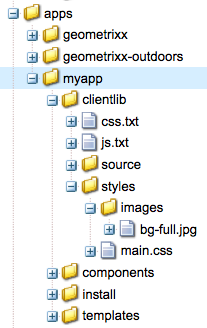

# Utilizzo delle librerie lato client{#using-client-side-libraries}

I siti web moderni si basano fortemente sull’elaborazione lato client guidata da codice JavaScript e CSS complesso. L’organizzazione e l’ottimizzazione della trasmissione di questo codice possono essere un problema complesso.

Per risolvere questo problema, l’AEM fornisce **Cartelle libreria lato client**, che ti consente di memorizzare il codice lato client nell’archivio, organizzarlo in categorie e definire quando e come ogni categoria di codice deve essere trasmessa al client. Il sistema di librerie lato client si occupa quindi di generare i collegamenti corretti nella pagina web finale per caricare il codice corretto.

## Funzionamento delle librerie lato client in AEM {#how-client-side-libraries-work-in-aem}

Il modo standard per includere una libreria lato client (ovvero un file JS o CSS) nel HTML di una pagina consiste semplicemente nell’includere una `<script>` o `<link>` nella JSP della pagina, contenente il percorso del file in questione. Ad esempio:

```xml
...
<head>
   ...
   <script type="text/javascript" src="/etc/clientlibs/granite/jquery/source/1.8.1/jquery-1.8.1.js"></script>
   ...
</head>
...
```

Anche se questo approccio funziona nell’AEM, può causare problemi quando le pagine e i relativi componenti diventano complessi. In questi casi esiste il pericolo che più copie della stessa libreria JS possano essere incluse nell’output HTML finale. Per evitare questo e consentire l’organizzazione logica delle librerie lato client utilizzate dall’AEM **cartelle di librerie lato client**.

Una cartella di libreria lato client è un nodo di archivio di tipo `cq:ClientLibraryFolder`. È una definizione in [Notazione CND](https://jackrabbit.apache.org/node-type-notation.html) è

```shell
[cq:ClientLibraryFolder] > sling:Folder
  - dependencies (string) multiple
  - categories (string) multiple
  - embed (string) multiple
  - channels (string) multiple
```

Per impostazione predefinita, `cq:ClientLibraryFolder` I nodi possono essere posizionati ovunque all&#39;interno del `/apps`, `/libs` e `/etc` sottostrutture dell’archivio (queste impostazioni predefinite e altre impostazioni possono essere controllate tramite **Adobe Granite HTML Library Manager** pannello del [Console di sistema](https://localhost:4502/system/console/configMgr)).

Ogni `cq:ClientLibraryFolder` viene compilato con un set di file JS e/o CSS, insieme ad alcuni file di supporto (vedi di seguito). Le proprietà del `cq:ClientLibraryFolder` sono configurate come segue:

* `categories`: identifica le categorie in cui il set di file JS e/o CSS all’interno di questo `cq:ClientLibraryFolder` caduta. Il `categories` Poiché questa proprietà ha più valori, una cartella libreria può far parte di più categorie (vedi di seguito per informazioni su come può essere utile).

* `dependencies`: questo è un elenco di altre categorie di librerie client da cui dipende la cartella della libreria. Ad esempio, dato due `cq:ClientLibraryFolder` nodi `F` e `G`, se un file in `F` richiede un altro file in `G` per funzionare correttamente, almeno uno dei `categories` di `G` deve essere tra i `dependencies` di `F`.

* `embed`: utilizzato per incorporare il codice da altre librerie. Se il nodo F incorpora i nodi G e H, il HTML risultante sarà una concentrazione di contenuto dai nodi G e H.
* `allowProxy`: se una libreria client si trova in `/apps`, questa proprietà consente l’accesso a essa tramite il servlet proxy. Consulta [Individuazione di una cartella di librerie client e utilizzo del servlet delle librerie client proxy](/help/sites-developing/clientlibs.md#locating-a-client-library-folder-and-using-the-proxy-client-libraries-servlet) di seguito.

## Riferimento a librerie lato client {#referencing-client-side-libraries}

Poiché HTL è la tecnologia preferita per lo sviluppo dei siti AEM, deve essere utilizzato per includere le librerie lato client nell’AEM. Tuttavia, è anche possibile farlo utilizzando JSP.

### Utilizzo di HTL {#using-htl}

In HTL, le librerie client vengono caricate tramite un modello helper fornito da AEM, a cui è possibile accedere tramite [ `data-sly-use`](https://helpx.adobe.com/experience-manager/htl/using/block-statements.html#use). In questo file sono disponibili tre modelli, che possono essere richiamati tramite [ `data-sly-call`](https://helpx.adobe.com/experience-manager/htl/using/block-statements.html#template-call):

* **css** : carica solo i file CSS delle librerie client di riferimento.
* **js** : carica solo i file JavaScript delle librerie client di riferimento.
* **tutto** : carica tutti i file delle librerie client di riferimento (sia CSS che JavaScript).

Ogni modello helper richiede un’opzione `categories` per fare riferimento alle librerie client desiderate. Tale opzione può essere una matrice di valori stringa o una stringa contenente un elenco di valori separati da virgola.

Per ulteriori dettagli ed esempi di utilizzo, consulta il documento [Guida introduttiva a HTML Template Language](https://helpx.adobe.com/experience-manager/htl/using/getting-started.html#loading-client-libraries).

### Utilizzo di JSP {#using-jsp}

Aggiungi un `ui:includeClientLib` aggiungi un tag al codice JSP per aggiungere un collegamento alle librerie client nella pagina HTML generata. Per fare riferimento alle librerie, utilizza il valore di `categories` proprietà del `ui:includeClientLib` nodo.

```
<%@taglib prefix="ui" uri="https://www.adobe.com/taglibs/granite/ui/1.0" %>
<ui:includeClientLib categories="<%= categories %>" />
```

Ad esempio, il `/etc/clientlibs/foundation/jquery` il nodo è di tipo `cq:ClientLibraryFolder` con una proprietà category di valore `cq.jquery`. Il codice seguente in un file JSP fa riferimento alle librerie:

```xml
<ui:includeClientLib categories="cq.jquery"/>
```

La pagina HTML generata contiene il seguente codice:

```xml
<script type="text/javascript" src="/etc/clientlibs/foundation/jquery.js"></script>
```

Per informazioni complete, inclusi gli attributi per filtrare le librerie JS, CSS o tema, consulta [ui:includeClientLib](/help/sites-developing/taglib.md#lt-ui-includeclientlib).

>[!CAUTION]
>
>`<cq:includeClientLib>`, che in passato veniva comunemente utilizzato per includere le librerie client, è diventato obsoleto a partire dalla versione 5.6 dell’AEM. [ `<ui:includeClientLib>`](/help/sites-developing/taglib.md#lt-ui-includeclientlib) deve essere utilizzato invece come descritto sopra.

## Creazione di cartelle di librerie client {#creating-client-library-folders}

Creare un `cq:ClientLibraryFolder` per definire le librerie JavaScript e CSS e renderle disponibili per le pagine HTML. Utilizza il `categories` del nodo per identificare le categorie di libreria a cui appartiene.

Il nodo contiene uno o più file di origine che, in fase di esecuzione, vengono uniti in un singolo file JS e/o CSS. Il nome del file generato è il nome del nodo con `.js` o `.css` estensione del nome file. Ad esempio, il nodo della libreria denominato `cq.jquery` restituisce il file generato denominato `cq.jquery.js` o `cq.jquery.css`.

Le cartelle delle librerie client contengono i seguenti elementi:

* I file sorgente JS e/o CSS da unire.
* Risorse che supportano gli stili CSS, ad esempio i file di immagine.

   **Nota:** È possibile utilizzare le sottocartelle per organizzare i file di origine.
* Uno `js.txt` file e/o uno `css.txt` file che identifica i file sorgente da unire nei file JS e/o CSS generati.


Per informazioni sui requisiti specifici delle librerie client per i widget, vedi [Utilizzo ed estensione dei widget](/help/sites-developing/widgets.md).

Il client web deve disporre delle autorizzazioni per accedere a `cq:ClientLibraryFolder` nodo. Puoi anche esporre le librerie da aree protette dell’archivio (vedi Incorporazione di codice da altre librerie, di seguito).

### Sovrascrittura delle librerie in /lib {#overriding-libraries-in-lib}

Cartelle della libreria client che si trovano sotto `/apps` hanno la precedenza sulle cartelle con lo stesso nome che si trovano in modo simile in `/libs`. Ad esempio: `/apps/cq/ui/widgets` ha la precedenza su `/libs/cq/ui/widgets`. Quando queste librerie appartengono alla stessa categoria, la libreria seguente `/apps` viene utilizzato.

### Individuazione di una cartella di librerie client e utilizzo del servlet delle librerie client proxy {#locating-a-client-library-folder-and-using-the-proxy-client-libraries-servlet}

Nelle versioni precedenti, le cartelle delle librerie client si trovavano sotto `/etc/clientlibs` nell’archivio. Questo è ancora supportato, tuttavia si consiglia di individuare ora le librerie client in `/apps`. Questo consente di individuare le librerie client accanto agli altri script, che si trovano generalmente di seguito `/apps` e `/libs`.

>[!NOTE]
>
>Le risorse statiche sotto la cartella della libreria client devono trovarsi in una cartella denominata *risorse*. Se non disponi delle risorse statiche, come le immagini, nella cartella *risorse*, non è possibile farvi riferimento in un’istanza Publish. Ecco un esempio: https://localhost:4503/etc.clientlibs/geometrixx/components/clientlibs/resources/example.gif

>[!NOTE]
>
>Per isolare meglio il codice dal contenuto e dalla configurazione, si consiglia di individuare le librerie client in `/apps` e pubblicarli tramite `/etc.clientlibs` sfruttando `allowProxy` proprietà.

Per le librerie client in `/apps` per essere accessibile, viene utilizzato un servlet proxy. Gli ACL vengono ancora applicati nella cartella della libreria client, ma il servlet consente la lettura del contenuto tramite `/etc.clientlibs/` se `allowProxy` proprietà impostata su `true`.

È possibile accedere a una risorsa statica solo tramite il proxy, se si trova al di sotto di una risorsa nella cartella della libreria client.

Ad esempio:

* Hai una libreria client in `/apps/myproject/clientlibs/foo`
* Hai un’immagine statica in `/apps/myprojects/clientlibs/foo/resources/icon.png`

Quindi imposta il `allowProxy` proprietà su `foo` su true.

* Puoi quindi richiedere `/etc.clientlibs/myprojects/clientlibs/foo.js`
* A questo punto puoi fare riferimento all’immagine tramite `/etc.clientlibs/myprojects/clientlibs/foo/resources/icon.png`

>[!CAUTION]
>
>Quando si utilizzano le librerie client abilitate al proxy, la configurazione del Dispatcher AEM può richiedere un aggiornamento per garantire che gli URI con le clientlibs dell’estensione siano consentiti.

>[!CAUTION]
>
>L’Adobe consiglia di individuare le librerie client in `/apps` e renderle disponibili utilizzando il servlet proxy. Tuttavia, ricorda che la best practice richiede comunque che i siti pubblici non includano mai elementi serviti direttamente tramite un `/apps` o `/libs` percorso.

### Creare una cartella della libreria client {#create-a-client-library-folder}

1. Apri CRXDE Lite in un browser Web ([https://localhost:4502/crx/de](https://localhost:4502/crx/de)).
1. Seleziona la cartella in cui desideri individuare la cartella della libreria client e fai clic su **Crea > Crea nodo**.
1. Immettere un nome per il file di libreria e nell&#39;elenco Tipo selezionare `cq:ClientLibraryFolder`. Clic **OK** e quindi fare clic su **Salva tutto**.
1. Per specificare la categoria o le categorie a cui appartiene la libreria, seleziona la `cq:ClientLibraryFolder` , aggiungere la seguente proprietà e quindi fare clic su **Salva tutto**:

   * Nome: categorie
   * Tipo: String
   * Valore: il nome della categoria
   * Multiplo: Seleziona

1. Aggiungere i file di origine alla cartella della libreria in qualsiasi modo. Ad esempio, utilizza un client WebDav per copiare i file oppure crea un file e crea il contenuto manualmente.

   **Nota:** Se necessario, è possibile organizzare i file di origine in sottocartelle.

1. Seleziona la cartella della libreria client e fai clic su **Crea > Crea file**.
1. Nella casella Nome file digitare uno dei seguenti nomi di file e fare clic su OK:

   * **`js.txt`:** Utilizza questo nome di file per generare un file JavaScript.
   * **`css.txt`:** Utilizzate questo nome di file per generare un foglio di stile CSS.

1. Apri il file e digita il testo seguente per identificare la directory principale del percorso dei file di origine:

   `#base=*[root]*`

   Sostituisci* `[root]`* con il percorso della cartella che contiene i file di origine, relativo al file TXT. Ad esempio, utilizza il testo seguente quando i file di origine si trovano nella stessa cartella del file TXT:

   `#base=.`

   Il codice seguente imposta la radice come cartella denominata mobile sotto il `cq:ClientLibraryFolder` nodo:

   `#base=mobile`

1. Sulle righe sottostanti `#base=[root]`, digitare i percorsi dei file di origine relativi alla directory principale. Posizionare ogni nome di file su una riga separata.
1. Clic **Salva tutto**.

### Collegamento alle dipendenze {#linking-to-dependencies}

Quando il codice nella cartella della libreria client fa riferimento ad altre librerie, identifica le altre librerie come dipendenze. Nella JSP, il `ui:includeClientLib` Se si utilizza un tag che fa riferimento alla cartella della libreria client, nel codice HTML verrà incluso un collegamento al file di libreria generato e alle dipendenze.

Le dipendenze devono essere un&#39;altra `cq:ClientLibraryFolder`. Per identificare le dipendenze, aggiungi una proprietà alla `cq:ClientLibraryFolder` con i seguenti attributi:

* **Nome:** dipendenze
* **Tipo:** Stringa[]
* **Valori:** Valore della proprietà Categories del nodo cq:ClientLibraryFolder da cui dipende la cartella della libreria corrente.

Ad esempio, il / `etc/clientlibs/myclientlibs/publicmain` ha una dipendenza da `cq.jquery` libreria. La JSP che fa riferimento alla libreria client principale genera HTML che include il seguente codice:

```xml
<script src="/etc/clientlibs/foundation/cq.jquery.js" type="text/javascript">
<script src="/etc/clientlibs/mylibs/publicmain.js" type="text/javascript">
```

### Incorporazione Di Codice Da Altre Librerie {#embedding-code-from-other-libraries}

Puoi incorporare il codice da una libreria client a un’altra libreria client. In fase di esecuzione, i file JS e CSS generati della libreria di incorporamento includono il codice della libreria incorporata.

L’incorporamento del codice è utile per fornire accesso alle librerie memorizzate in aree protette dell’archivio.

#### Cartelle Libreria Client Specifiche Per L&#39;App {#app-specific-client-library-folders}

È consigliabile conservare tutti i file relativi all&#39;applicazione nella cartella dell&#39;applicazione sottostante `/apps`. È inoltre consigliabile negare l’accesso ai visitatori del sito web `/apps` cartella. Per soddisfare entrambe le best practice, crea una cartella di librerie client di seguito `/apps`e renderle accessibili tramite il servlet proxy come descritto in [Individuazione di una cartella di librerie client e utilizzo del servlet delle librerie client proxy](/help/sites-developing/clientlibs.md#locating-a-client-library-folder-and-using-the-proxy-client-libraries-servlet).

Utilizzare la proprietà Categories per identificare la cartella della libreria client da incorporare. Per incorporare la libreria, aggiungi una proprietà all’incorporamento `cq:ClientLibraryFolder` utilizzando i seguenti attributi di proprietà:

* **Nome:** incorporare
* **Tipo:** Stringa[]
* **Valore:** Il valore della proprietà Categories della proprietà `cq:ClientLibraryFolder` nodo da incorporare.

#### Utilizzo dell’incorporamento per ridurre al minimo le richieste {#using-embedding-to-minimize-requests}

In alcuni casi è possibile che il HTML finale generato per la pagina tipica dall’istanza Publish includa un numero relativamente elevato di `<script>` , in particolare se il sito utilizza informazioni sul contesto del client per l&#39;analisi o il targeting. Ad esempio, in un progetto non ottimizzato potresti trovare la seguente serie di `<script>` elementi nel HTML di una pagina:

```xml
<script type="text/javascript" src="/etc/clientlibs/granite/jquery.js"></script>
<script type="text/javascript" src="/etc/clientlibs/granite/utils.js"></script>
<script type="text/javascript" src="/etc/clientlibs/granite/jquery/granite.js"></script>
<script type="text/javascript" src="/etc/clientlibs/foundation/jquery.js"></script>
<script type="text/javascript" src="/etc/clientlibs/foundation/shared.js"></script>
<script type="text/javascript" src="/etc/clientlibs/foundation/personalization/kernel.js"></script>
```

In questi casi, può essere utile combinare in un unico file tutto il codice libreria client richiesto, in modo da ridurre il numero di richieste avanti e indietro al caricamento della pagina. A tale scopo è possibile: `embed` le librerie richieste nella libreria client specifica per l’app utilizzando la proprietà embed di `cq:ClientLibraryFolder` nodo.

Le seguenti categorie di librerie client sono incluse con AEM. Devi incorporare solo quelli necessari per il funzionamento del tuo particolare sito. Tuttavia, **devi mantenere l’ordine elencato qui**:

1. `browsermap.standard`
1. `browsermap`
1. `jquery-ui`
1. `cq.jquery.ui`
1. `personalization`
1. `personalization.core`
1. `personalization.core.kernel`
1. `personalization.clientcontext.kernel`
1. `personalization.stores.kernel`
1. `personalization.kernel`
1. `personalization.clientcontext`
1. `personalization.stores`
1. `cq.collab.comments`
1. `cq.collab.feedlink`
1. `cq.collab.ratings`
1. `cq.collab.toggle`
1. `cq.collab.forum`
1. `cq.cleditor`

#### Percorsi nei file CSS {#paths-in-css-files}

Quando incorpori file CSS, il codice CSS generato utilizza i percorsi delle risorse relativi alla libreria di incorporamento. Ad esempio, la libreria accessibile al pubblico `/etc/client/libraries/myclientlibs/publicmain` incorpora il `/apps/myapp/clientlib` libreria client:



Il `main.css` Il file contiene il seguente stile:

```xml
body {
  padding: 0;
  margin: 0;
  background: url(images/bg-full.jpg) no-repeat center top;
  width: 100%;
}
```

Il file CSS che `publicmain` Il nodo genera contiene il seguente stile, utilizzando l’URL dell’immagine originale:

```xml
body {
  padding: 0;
  margin: 0;
  background: url(../../../apps/myapp/clientlib/styles/images/bg-full.jpg) no-repeat center top;
  width: 100%;
}
```

### Utilizzo di una libreria per gruppi mobili specifici {#using-a-library-for-specific-mobile-groups}

Utilizza il `channels` di una cartella della libreria client per identificare il gruppo mobile che utilizza la libreria. Il `channels` è utile quando le librerie della stessa categoria sono progettate per funzionalità di dispositivi diverse.

Per associare una cartella della libreria client a un gruppo di dispositivi, aggiungere una proprietà al `cq:ClientLibraryFolder` con i seguenti attributi:

* **Nome:** canali
* **Tipo:** Stringa[]
* **Valori:** Il nome del gruppo mobile. Per escludere la cartella della libreria da un gruppo, aggiungi al nome un punto esclamativo (&quot;!&quot;).

Ad esempio, nella tabella seguente viene elencato il valore `channels` per ogni cartella della libreria client del `cq.widgets` categoria:

| Cartella libreria client | Valore della proprietà dei canali |
|---|---|
| `/libs/cq/analytics/widgets` | `!touch` |
| `/libs/cq/analytics/widgets/themes/default` | `!touch` |
| `/libs/cq/cloudserviceconfigs/widgets` | `!touch` |
| `/libs/cq/touch/widgets` | `touch` |
| `/libs/cq/touch/widgets/themes/default` | `touch` |
| `/libs/cq/ui/widgets` | `!touch` |
| `/libs/cq/ui/widgets/themes/default` | `!touch` |

<!-- Search&Promote is end of life as of September 1, 2022 | `/libs/cq/searchpromote/widgets` | `!touch` | -->
<!-- Search&Promote is end of life as of September 1, 2022 | `/libs/cq/searchpromote/widgets/themes/default` |*[no value]* -->

## Utilizzo dei preprocessori {#using-preprocessors}

L&#39;AEM consente preprocessori collegabili e viene fornito con supporto per [Compressore YUI](https://github.com/yui/yuicompressor#yui-compressor---the-yahoo-javascript-and-css-compressor) per CSS e JavaScript e [Compilatore di chiusura Google (GCC)](https://developers.google.com/closure/compiler/) per JavaScript con YUI impostato come preprocessore predefinito per AEM.

I preprocessori collegabili consentono un utilizzo flessibile, tra cui:

* Definizione di ScriptProcessors che possono elaborare origini script
* I processori sono configurabili con opzioni
* I processori possono essere utilizzati per la minimizzazione, ma anche per i casi non minimizzati
* La libreria client può definire quale processore utilizzare

>[!NOTE]
>
>Per impostazione predefinita, l’AEM utilizza il compressore YUI. Consulta la [Documentazione di GitHub per il compressore YUI](https://github.com/yui/yuicompressor/issues) per un elenco dei problemi noti. Il passaggio al compressore GCC per particolari clientlibs può risolvere alcuni problemi osservati durante l’utilizzo di YUI.

>[!CAUTION]
>
>Non inserire una libreria minimizzata in una libreria client. Fornisci invece la libreria raw e, se è richiesta la minimizzazione, utilizza le opzioni dei preprocessori.

### Utilizzo {#usage}

È possibile scegliere di configurare la configurazione dei preprocessori per libreria client o a livello di sistema.

* Aggiungere le proprietà multivalore `cssProcessor` e `jsProcessor` sul nodo clientlibrary

* Oppure definisci la configurazione predefinita del sistema tramite **Gestione librerie HTML** Configurazione OSGi

Una configurazione del preprocessore sul nodo clientlib ha la precedenza sulla configurazione OSGI.

### Formato ed esempi {#format-and-examples}

#### Formato {#format}

```xml
config:= mode ":" processorName options*;
mode:= "default" | "min";
processorName := "none" | <name>;
options := ";" option;
option := name "=" value;
```

#### Compressore YUI per minimizzazione CSS e GCC per JS {#yui-compressor-for-css-minification-and-gcc-for-js}

```xml
cssProcessor: ["default:none", "min:yui"]
jsProcessor: ["default:none", "min:gcc;compilationLevel=advanced"]
```

#### Script da pre-elaborare e poi GCC da minimizzare e oscurare {#typescript-to-preprocess-and-then-gcc-to-minify-and-obfuscate}

```xml
jsProcessor: [
   "default:typescript",
   "min:typescript",
   "min:gcc;obfuscate=true"
]
```

#### Opzioni GCC aggiuntive {#additional-gcc-options}

```xml
failOnWarning (defaults to "false")
languageIn (defaults to "ECMASCRIPT5")
languageOut (defaults to "ECMASCRIPT5")
compilationLevel (defaults to "simple") (can be "whitespace", "simple", "advanced")
```

Per maggiori dettagli sulle opzioni GCC, vedi [Documentazione GCC](https://developers.google.com/closure/compiler/docs/compilation_levels).

### Imposta minimizzatore predefinito di sistema {#set-system-default-minifier}

YUI è impostato come minimizzatore predefinito in AEM. Per cambiare in GCC, segui la procedura riportata di seguito.

1. Vai a Apache Felix Config Manager all’indirizzo [https://localhost:4502/system/console/configMgr](https://localhost:4502/system/console/configMgr)
1. Trova e modifica il **Adobe Granite HTML Library Manager**.
1. Abilita **Minimizza** (se non già abilitata).
1. Imposta il valore **Configurazioni predefinite processore JS** a `min:gcc`.

   Le opzioni possono essere passate se separate da un punto e virgola, ad esempio `min:gcc;obfuscate=true`.

1. Clic **Salva** per salvare le modifiche.

## Strumenti di debug {#debugging-tools}

AEM fornisce diversi strumenti per il debug e il test delle cartelle delle librerie client.

### Vedi File incorporati {#see-embedded-files}

Per tracciare l’origine del codice incorporato o per garantire che le librerie client incorporate producano i risultati previsti, puoi visualizzare i nomi dei file incorporati in fase di esecuzione. Per visualizzare i nomi dei file, aggiungi `debugClientLibs=true` all’URL della pagina web. La libreria generata contiene `@import` al posto del codice incorporato.

Nell’esempio del precedente [Incorporazione Di Codice Da Altre Librerie](/help/sites-developing/clientlibs.md#embedding-code-from-other-libraries) sezione, il `/etc/client/libraries/myclientlibs/publicmain` la cartella della libreria client incorpora `/apps/myapp/clientlib` cartella della libreria client. L’aggiunta del parametro alla pagina web genera il seguente collegamento nel codice sorgente della pagina web:

```xml
<link rel="stylesheet" href="/etc/clientlibs/mycientlibs/publicmain.css">
```

Apertura di `publicmain.css` Il file mostra il seguente codice:

```xml
@import url("/apps/myapp/clientlib/styles/main.css");
```

1. Nella casella dell’indirizzo del browser web, aggiungi il testo seguente all’URL del tuo HTML:

   `?debugClientLibs=true`
1. Al caricamento della pagina, visualizza l’origine della pagina.
1. Fai clic sul collegamento fornito come href per l’elemento collegamento per aprire il file e visualizzare il codice sorgente.

### Scopri le librerie client {#discover-client-libraries}

Il `/libs/cq/granite/components/dumplibs/dumplibs` il componente genera una pagina di informazioni su tutte le cartelle delle librerie client sul sistema. Il `/libs/granite/ui/content/dumplibs` Il componente del nodo è un tipo di risorsa. Per aprire la pagina, utilizza il seguente URL (modificando l’host e la porta come richiesto):

`https://<host>:<port>/libs/granite/ui/content/dumplibs.test.html`

Le informazioni includono il percorso e il tipo della libreria (CSS o JS) e i valori degli attributi della libreria, come categorie e dipendenze. Le tabelle successive nella pagina mostrano le librerie in ogni categoria e canale.

### Vedi Output generato {#see-generated-output}

Il `dumplibs` il componente include un selettore di test che visualizza il codice sorgente generato per `ui:includeClientLib` tag. La pagina include il codice per diverse combinazioni di attributi js, css e a tema.

1. Per aprire la pagina Output test, utilizzare uno dei metodi seguenti:

   * Dalla sezione `dumplibs.html` , fare clic sul collegamento nella **Fai clic qui per il test di output** testo.

   * Apri il seguente URL nel browser web (utilizza un host e una porta diversi, a seconda delle necessità):

      * `http://<host>:<port>/libs/granite/ui/content/dumplibs.html`

   La pagina predefinita mostra l’output per i tag senza alcun valore per l’attributo categorie.

1. Per visualizzare l’output di una categoria, digita il valore della proprietà `categories` e fai clic su **Invia query**.

## Configurazione della gestione della libreria per lo sviluppo e la produzione {#configuring-library-handling-for-development-and-production}

Processi del servizio HTML Library Manager `cq:ClientLibraryFolder` e genera le librerie in fase di esecuzione. Il tipo di ambiente, sviluppo o produzione determina come configurare il servizio:

* Aumentare la sicurezza: disabilitare il debug
* Migliorare le prestazioni: rimuovi gli spazi vuoti e comprimi le librerie.
* Migliora la leggibilità: includi gli spazi vuoti e non comprimi.

Per informazioni sulla configurazione del servizio, consulta [Gestione libreria HTML AEM](/help/sites-deploying/osgi-configuration-settings.md#aemhtmllibrarymanager).
