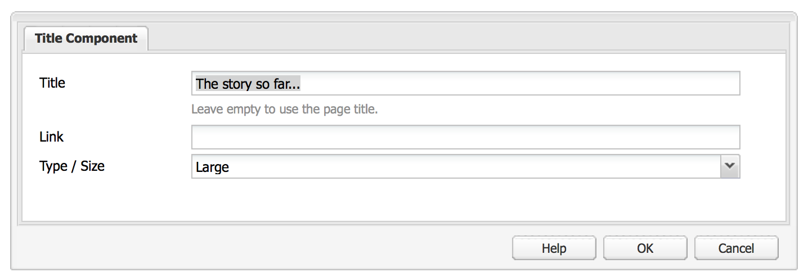

# Componenti Adobe Experience Manager (AEM) - Nozioni di base{#aem-components-the-basics}

Quando inizi a sviluppare nuovi componenti, devi comprendere le nozioni di base della loro struttura e configurazione.

Questo processo comporta la lettura della teoria e l&#39;esame dell&#39;ampia gamma di implementazioni di componenti in un&#39;istanza AEM standard. Quest’ultimo approccio è leggermente complicato dal fatto che, sebbene l’AEM sia passato a una nuova interfaccia utente standard, moderna e touch, continua a supportare l’interfaccia classica.

## Panoramica {#overview}

Questa sezione descrive concetti e problemi chiave come introduzione ai dettagli necessari per lo sviluppo di componenti personalizzati.

### Pianificazione {#planning}

Prima di iniziare a configurare o codificare il componente, è necessario chiedere:

* Cosa devi fare esattamente con il nuovo componente?
   * Una specifica chiara aiuta in tutte le fasi di sviluppo, test e trasferimento. I dettagli possono cambiare nel tempo, ma è possibile aggiornare le specifiche (anche se le modifiche devono essere documentate).
* È necessario creare il componente da zero o è possibile ereditare le nozioni di base da un componente esistente?
   * Non c&#39;è bisogno di reinventare la ruota.
   * Esistono diversi meccanismi forniti dall’AEM che consentono di ereditare ed estendere i dettagli da un’altra definizione di componente, tra cui override, overlay e [Sling Resource Merger](/help/sites-developing/sling-resource-merger.md).
* Il componente richiede logica per selezionare o manipolare il contenuto?
   * La logica deve essere tenuta separata dal livello dell&#39;interfaccia utente. HTL è progettato per garantire che questo accada.
* Il componente richiede la formattazione CSS?
   * La formattazione CSS deve essere mantenuta separata dalle definizioni dei componenti. Definisci le convenzioni per la denominazione degli elementi HTML in modo da poterli modificare tramite file CSS esterni.
* Quali aspetti di sicurezza devo considerare?
   * Consulta [Elenco di controllo della sicurezza - Procedure consigliate per lo sviluppo](/help/sites-administering/security-checklist.md#development-best-practices) per ulteriori dettagli.

### Interfaccia touch e interfaccia classica {#touch-enabled-vs-classic-ui}

Prima di avviare qualsiasi discussione seria sullo sviluppo di componenti, è necessario sapere quale interfaccia utente vengono utilizzati dagli autori:

* **Interfaccia touch**
  [Interfaccia utente standard](/help/sites-developing/touch-ui-concepts.md) si basa sull’esperienza utente unificata per Adobe Experience Cloud, utilizzando le tecnologie sottostanti di [Coral UI](/help/sites-developing/touch-ui-concepts.md#coral-ui) e [Interfaccia utente Granite](/help/sites-developing/touch-ui-concepts.md#granite-ui).
* **Interfaccia classica**
Interfaccia utente basata sulla tecnologia ExtJS, ora obsoleta con AEM 6.4.

Consulta [Interfaccia utente Recommendations per i clienti](/help/sites-deploying/ui-recommendations.md) per ulteriori dettagli.

I componenti possono essere implementati per supportare l’interfaccia touch, l’interfaccia classica o entrambe. Quando osservi un’istanza standard, trovi anche componenti pronti all’uso originariamente progettati per l’interfaccia classica, l’interfaccia touch o entrambe.

Le nozioni di base su entrambi sono descritte in questa pagina e come riconoscerli.

>[!NOTE]
>
>L’Adobe consiglia di utilizzare l’interfaccia utente touch per sfruttare le tecnologie più recenti. [Strumenti di modernizzazione AEM](modernization-tools.md) può semplificare la migrazione.

### Logica dei contenuti e markup di rendering  {#content-logic-and-rendering-markup}

L’Adobe consiglia di mantenere il codice responsabile del markup e del rendering separato dal codice che controlla la logica utilizzata per selezionare il contenuto del componente.

Questa filosofia è supportata da [HTL](https://experienceleague.adobe.com/docs/experience-manager-htl/content/overview.html?lang=it): linguaggio per modelli appositamente limitato per garantire che venga utilizzato un linguaggio di programmazione reale per definire la logica di business sottostante. Questa logica (facoltativa) viene richiamata da HTL con un comando specifico. Questo meccanismo evidenzia il codice chiamato per una determinata vista e, se necessario, consente una logica specifica per diverse viste dello stesso componente.

### Confronto tra HTL e JSP {#htl-vs-jsp}

HTL è un linguaggio di modelli HTML introdotto con AEM 6.0.

Discussione sull&#39;utilizzo [HTL](https://experienceleague.adobe.com/docs/experience-manager-htl/content/overview.html?lang=it) o JSP (Java™ Server Pages) durante lo sviluppo di componenti personalizzati deve essere semplice, in quanto HTL è ora il linguaggio di script consigliato per l’AEM.

Sia HTL che JSP possono essere utilizzati per lo sviluppo di componenti sia per l’interfaccia utente classica che per quella touch. Sebbene ci possa essere una tendenza a presumere che HTL sia solo per l’interfaccia touch e JSP per l’interfaccia classica, si tratta di un’idea errata e più dovuta ai tempi. L’interfaccia utente touch e HTL sono stati incorporati nell’AEM approssimativamente nello stesso periodo. Poiché HTL è ora la lingua consigliata, viene utilizzato per nuovi componenti, che in genere sono per l’interfaccia utente touch.

>[!NOTE]
>
>Le eccezioni sono i campi modulo base dell’interfaccia utente Granite (utilizzati nelle finestre di dialogo). Questi richiedono ancora l’utilizzo di JSP.

### Sviluppo di componenti personalizzati {#developing-your-own-components}

Per creare componenti personalizzati per l’interfaccia utente appropriata, consulta (dopo aver letto questa pagina):

* [Componenti AEM per l’interfaccia utente touch](/help/sites-developing/developing-components.md)
* [Componenti AEM per l’interfaccia classica](/help/sites-developing/developing-components-classic.md)

Un modo rapido per iniziare è copiare un componente esistente e quindi apportare le modifiche desiderate. Per informazioni su come creare componenti personalizzati e aggiungerli al sistema paragrafo, consulta:

* [Sviluppo di componenti](/help/sites-developing/developing-components-samples.md) (incentrato sull’interfaccia touch)

### Spostamento dei componenti nell’istanza di pubblicazione {#moving-components-to-the-publish-instance}

I componenti che eseguono il rendering del contenuto devono essere distribuiti nella stessa istanza AEM del contenuto. Pertanto, tutti i componenti utilizzati per l’authoring e il rendering delle pagine nell’istanza di authoring devono essere distribuiti nell’istanza di pubblicazione. Una volta implementati, i componenti sono disponibili per eseguire il rendering delle pagine attivate.

Per spostare i componenti nell’istanza Publish, utilizza i seguenti strumenti:

* [Utilizzare Gestione pacchetti](/help/sites-administering/package-manager.md) per aggiungere i componenti a un pacchetto e spostarli in un’altra istanza AEM.
* [Utilizzare lo strumento di replica Attiva albero](/help/sites-authoring/publishing-pages.md#manage-publication) per replicare i componenti.

>[!NOTE]
>
>Questi meccanismi possono essere utilizzati anche per trasferire il componente tra altre istanze, ad esempio dallo sviluppo all’istanza di test.

### Componenti di cui tenere conto fin dall&#39;inizio {#components-to-be-aware-of-from-the-start}

* Pagina:

   * L&#39;AEM ha *pagina* componente ( `cq:Page`).
   * Si tratta di un tipo specifico di risorsa importante per la gestione dei contenuti.
      * Una pagina corrisponde a una pagina web che contiene il contenuto del sito web.

* Sistemi paragrafo:

   * Il sistema paragrafo è una parte chiave di un sito web in quanto gestisce un elenco di paragrafi. Viene utilizzato per contenere e strutturare i singoli componenti che contengono il contenuto effettivo.
   * Potete creare, spostare, copiare ed eliminare paragrafi nel sistema paragrafo.
   * Potete anche selezionare i componenti da rendere disponibili per l&#39;uso all&#39;interno di un sistema paragrafo specifico.
   * All’interno di un’istanza standard sono disponibili vari sistemi paragrafo (ad esempio, `parsys`, ` [responsivegrid](/help/sites-authoring/responsive-layout.md)`).

## Struttura {#structure}

La struttura di una componente AEM è potente e flessibile, le considerazioni principali sono:

* Tipo risorsa
* Definizione componente
* Proprietà e nodi figlio di un componente
* Finestre di dialogo
* Finestre di dialogo per progettazione
* Disponibilità dei componenti
* Componenti e contenuti creati

### Tipo risorsa {#resource-type}

Un elemento chiave della struttura è il tipo di risorsa.

* La struttura del contenuto dichiara le intenzioni.
* Il tipo di risorsa li implementa.

Si tratta di un’astrazione che garantisce che, anche quando l’aspetto cambia nel tempo, l’intenzione rimanga nel tempo.

### Definizione componente {#component-definition}

#### Nozioni di base sui componenti {#component-basics}

La definizione di un componente può essere suddivisa come segue:

* I componenti AEM si basano su [Sling](https://sling.apache.org/documentation.html).
* I componenti dell’AEM si trovano (di solito) in:

   * HTL: `/libs/wcm/foundation/components`
   * JSP: `/libs/foundation/components`

* I componenti specifici del progetto/sito si trovano (in genere) in:

   * `/apps/<myApp>/components`

* I componenti standard dell’AEM sono definiti come `cq:Component` e avere gli elementi chiave:

   * proprietà jcr:

     Un elenco di proprietà jcr; queste sono variabili e alcune possono essere facoltative anche se la struttura di base di un nodo componente, le sue proprietà e i sottonodi sono definiti da `cq:Component` definizione

   * Risorse:

     Questi definiscono gli elementi statici utilizzati dal componente.

   * Script:

  Vengono utilizzati per implementare il comportamento dell’istanza risultante del componente.

* **Nodo principale**:

   * `<mycomponent> (cq:Component)` - Nodo gerarchico del componente.

* **Proprietà vitali**:

   * `jcr:title` - Titolo del componente; ad esempio, utilizzato come etichetta quando il componente è elencato nel browser Componenti o nella barra laterale.
   * `jcr:description` : descrizione del componente; può essere utilizzata come suggerimento del mouse nel browser dei componenti o nella barra laterale.
   * Interfaccia classica:

      * `icon.png` : icona per questo componente.
      * `thumbnail.png` - Immagine mostrata se il componente è elencato nel sistema paragrafo.

   * Interfaccia utente touch

      * Consulta la sezione [Icona del componente nell’interfaccia utente touch](/help/sites-developing/components-basics.md#component-icon-in-touch-ui) per i dettagli.

* **Nodi figlio vitali**:

   * `cq:editConfig (cq:EditConfig)` - Definisce le proprietà di modifica del componente e ne attiva la visualizzazione nel browser o nel Sidekick Componenti.

     Nota: se il componente ha una finestra di dialogo, questa viene visualizzata automaticamente nel browser Componenti o nel Sidekick, anche se cq:editConfig non esiste.

   * `cq:childEditConfig (cq:EditConfig)` - Controlla gli aspetti dell’interfaccia utente di authoring per i componenti secondari che non definiscono i propri `cq:editConfig`.
   * Interfaccia touch:

      * `cq:dialog` ( `nt:unstructured`) - Finestra di dialogo per questo componente. Definisce l’interfaccia che consente all’utente di configurare il componente e/o modificare il contenuto.
      * `cq:design_dialog` ( `nt:unstructured`) - Modifica del design di questo componente

   * Interfaccia classica:

      * `dialog` ( `cq:Dialog`) - Finestra di dialogo per questo componente. Definisce l’interfaccia che consente all’utente di configurare il componente, modificarne il contenuto o entrambi.
      * `design_dialog` ( `cq:Dialog`) - Modifica del design di questo componente.

#### Icona del componente nell’interfaccia utente touch {#component-icon-in-touch-ui}

L’icona o l’abbreviazione del componente viene definita tramite le proprietà JCR del componente quando questo viene creato dallo sviluppatore. Queste proprietà vengono valutate nell&#39;ordine seguente e viene utilizzata la prima proprietà valida trovata.

1. `cq:icon` : proprietà stringa che punta a un&#39;icona standard nella [Libreria interfaccia utente Coral](https://developer.adobe.com/experience-manager/reference-materials/6-5/coral-ui/coralui3/Coral.Icon.html) da visualizzare nel browser componenti
   * Utilizza il valore dell’attributo HTML dell’icona Coral.
1. `abbreviation` - Proprietà stringa per personalizzare l&#39;abbreviazione del nome del componente nel browser componenti
   * L’abbreviazione deve essere limitata a due caratteri.
   * Fornendo una stringa vuota, viene creata l’abbreviazione dai primi due caratteri della `jcr:title` proprietà.
      * Ad esempio, &quot;Im&quot; per &quot;Immagine&quot;
      * Il titolo localizzato viene utilizzato per creare l’abbreviazione.
   * L’abbreviazione viene tradotta solo se il componente ha un `abbreviation_commentI18n` , che viene quindi utilizzata come suggerimento di traduzione.
1. `cq:icon.png` o `cq:icon.svg` - Icona del componente, visualizzata nel browser componenti
   * 20 x 20 pixel sono le dimensioni delle icone dei componenti standard.
      * Le icone più grandi vengono ridimensionate (lato client).
   * Il colore consigliato è rgb(112, 112, 112) > #707070
   * Lo sfondo delle icone dei componenti standard è trasparente.
   * Solo `.png` e `.svg` sono supportati.
   * Se si esegue l’importazione dal file system tramite il plug-in Eclipse, i nomi dei file devono essere preceduti dalla sequenza di escape `_cq_icon.png` o `_cq_icon.svg` ad esempio.
   * `.png` ha precedenza su `.svg` se sono presenti entrambi

Se nessuna delle proprietà precedenti ( `cq:icon`, `abbreviation`, `cq:icon.png`, o `cq:icon.svg`) si trovano nel componente:

* Il sistema cerca le stesse proprietà nei super componenti seguendo la `sling:resourceSuperType` proprietà.
* Se non viene trovato nulla o un&#39;abbreviazione vuota a livello di super componente, il sistema crea l&#39;abbreviazione dalle prime lettere del `jcr:title` del componente corrente.

Per annullare l’ereditarietà delle icone dai super componenti, imposta un valore vuoto `abbreviation` sul componente viene ripristinato il comportamento predefinito.

Il [Console Componenti](/help/sites-authoring/default-components-console.md#component-details) mostra come viene definita l’icona di un particolare componente.

#### Esempio di icona SVG {#svg-icon-example}

```xml
<?xml version="1.0" encoding="utf-8"?>
<!DOCTYPE svg PUBLIC "-//W3C//DTD SVG 1.1//EN" "https://www.w3.org/Graphics/SVG/1.1/DTD/svg11.dtd">
<svg version="1.1" id="Layer_1" xmlns="https://www.w3.org/2000/svg" xmlns:xlink="https://www.w3.org/1999/xlink" x="0px" y="0px"
     width="20px" height="20px" viewBox="0 0 20 20" enable-background="new 0 0 20 20" xml:space="preserve">
    <ellipse cx="5" cy="5" rx="3" ry="3" fill="#707070"/>
    <ellipse cx="15" cy="5" rx="4" ry="4" fill="#707070"/>
    <ellipse cx="5" cy="15" rx="5" ry="5" fill="#707070"/>
    <ellipse cx="15" cy="15" rx="4" ry="4" fill="#707070"/>
</svg>
```

### Proprietà e nodi figlio di un componente {#properties-and-child-nodes-of-a-component}

Molti nodi/proprietà necessari per definire un componente sono comuni a entrambe le interfacce, con differenze che rimangono indipendenti in modo che il componente possa funzionare in entrambi gli ambienti.

Un componente è un nodo di tipo `cq:Component` e ha le seguenti proprietà e nodi secondari:

<table>
 <tbody>
  <tr>
   <td><strong>Nome <br /> </strong></td>
   <td><strong>Tipo <br /> </strong></td>
   <td><strong>Descrizione <br /> </strong></td>
  </tr>
  <tr>
   <td>.<br /> </td>
   <td><code>cq:Component</code></td>
   <td>Componente corrente. Un componente è di tipo nodo <code>cq:Component</code>.<br /> </td>
  </tr>
  <tr>
   <td><code>componentGroup</code></td>
   <td><code>String</code></td>
   <td>Gruppo in cui il componente può essere selezionato nel browser Componenti (interfaccia touch) o nel Sidekick (interfaccia classica).<br /> Un valore di <code>.hidden</code> viene utilizzato per i componenti che non sono disponibili per la selezione dall’interfaccia utente, ad esempio i sistemi paragrafo effettivi.</td>
  </tr>
  <tr>
   <td><code>cq:isContainer</code></td>
   <td><code>Boolean</code></td>
   <td>Indica se il componente è un componente contenitore e può quindi contenere altri componenti, ad esempio un sistema paragrafo.</td>
  </tr>
  <tr>
   <td> </td>
   <td> </td>
   <td> </td>
  </tr>
  <tr>
   <td><code>cq:dialog</code></td>
   <td><code>nt:unstructured</code><br /> </td>
   <td>Definizione della finestra di dialogo per modifica dell’interfaccia utente touch.</td>
  </tr>
  <tr>
   <td><code>dialog</code></td>
   <td><code>cq:Dialog</code></td>
   <td>Definizione della finestra di dialogo per modifica dell’interfaccia classica.</td>
  </tr>
  <tr>
   <td><code>cq:design_dialog</code></td>
   <td><code>nt:unstructured</code></td>
   <td>Definizione della finestra di dialogo per progettazione dell’interfaccia utente touch.</td>
  </tr>
  <tr>
   <td><code>design_dialog</code></td>
   <td><code>cq:Dialog </code></td>
   <td>Definizione della finestra di dialogo per progettazione dell’interfaccia classica.<br /> </td>
  </tr>
  <tr>
   <td><code>dialogPath</code></td>
   <td><code>String</code></td>
   <td>Percorso di una finestra di dialogo che tratta il caso in cui il componente non ha un nodo di dialogo.<br /> </td>
  </tr>
  <tr>
   <td> </td>
   <td> </td>
   <td> </td>
  </tr>
  <tr>
   <td><code>cq:cellName</code></td>
   <td><code>String</code></td>
   <td>Se impostata, questa proprietà viene considerata come ID cella. Per ulteriori informazioni, vedere l'articolo della Knowledge Base <a href="https://helpx.adobe.com/experience-manager/kb/DesigneCellId.html">Come vengono generati gli ID delle celle di progettazione</a>.<br /> </td>
  </tr>
  <tr>
   <td><code>cq:childEditConfig</code></td>
   <td><code>cq:EditConfig</code></td>
   <td>Quando il componente è un contenitore, ad esempio un sistema paragrafo, gestisce la configurazione di modifica dei nodi figlio.<br /> </td>
  </tr>
  <tr>
   <td><code>cq:editConfig</code></td>
   <td><code>cq:EditConfig</code></td>
   <td><a href="#edit-behavior">Modifica la configurazione del componente</a>.<br /> </td>
  </tr>
  <tr>
   <td><code>cq:htmlTag</code></td>
   <td><code>nt:unstructured </code></td>
   <td>Restituisce gli attributi di tag aggiuntivi aggiunti al tag HTML circostante. Abilita l’aggiunta di attributi ai div generati automaticamente.</td>
  </tr>
  <tr>
   <td><code>cq:noDecoration</code></td>
   <td><code>Boolean</code></td>
   <td>Se true, il componente non viene renderizzato con le classi div e css generate automaticamente.<br /> </td>
  </tr>
  <tr>
   <td><code>cq:template</code></td>
   <td><code>nt:unstructured</code></td>
   <td>Se individuato, questo nodo viene utilizzato come modello di contenuto quando il componente viene aggiunto dal browser o dal Sidekick Componenti.</td>
  </tr>
  <tr>
   <td><code>cq:templatePath</code></td>
   <td><code>String</code></td>
   <td>Percorso di un nodo da utilizzare come modello di contenuto quando il componente viene aggiunto dal browser o dal Sidekick Componenti. Deve essere un percorso assoluto, non relativo al nodo del componente.<br /> A meno che tu non voglia riutilizzare contenuti già disponibili altrove, questo non è richiesto e <code>cq:template</code> è sufficiente (vedi sotto).</td>
  </tr>
  <tr>
   <td><code>jcr:created</code></td>
   <td><code>Date</code></td>
   <td>Data di creazione del componente.<br /> </td>
  </tr>
  <tr>
   <td><code>jcr:description</code></td>
   <td><code>String</code></td>
   <td>Descrizione del componente.<br /> </td>
  </tr>
  <tr>
   <td><code>jcr:title</code></td>
   <td><code>String</code></td>
   <td>Titolo del componente.<br /> </td>
  </tr>
  <tr>
   <td><code>sling:resourceSuperType</code></td>
   <td><code>String</code></td>
   <td>Con questa impostazione, il componente eredita da questo componente.<br /> </td>
  </tr>
  <tr>
   <td><code>virtual</code></td>
   <td><code>sling:Folder</code></td>
   <td>Consente la creazione di componenti virtuali. Per visualizzare un esempio, osserva il componente contatto in:<br /> <code>/libs/foundation/components/profile/form/contact</code></td>
  </tr>
  <tr>
   <td><code>&lt;breadcrumb.jsp&gt;</code></td>
   <td><code>nt:file</code><br /> </td>
   <td>File di script.<br /> </td>
  </tr>
  <tr>
   <td><code>icon.png</code></td>
   <td><code>nt:file</code></td>
   <td>L’icona del componente viene visualizzata accanto al Titolo nel Sidekick.<br /> </td>
  </tr>
  <tr>
   <td><code>thumbnail.png</code></td>
   <td><code>nt:file</code></td>
   <td>Miniatura opzionale visualizzata quando il componente viene trascinato in posizione dal Sidekick.<br /> </td>
  </tr>
 </tbody>
</table>

Osservando il **Testo** (in una delle due versioni), puoi visualizzare i seguenti elementi:

* HTL ( `/libs/wcm/foundation/components/text`)

  

* JSP ( `/libs/foundation/components/text`)

  

Le proprietà di particolare interesse comprendono:

* `jcr:title` : titolo del componente, che può essere utilizzato per identificare il componente, ad esempio viene visualizzato nell’elenco dei componenti nel browser Componenti o nella barra laterale
* `jcr:description` : descrizione del componente; può essere utilizzata come suggerimento del mouse nell’elenco dei componenti nella barra laterale
* `sling:resourceSuperType`: indica il percorso di ereditarietà quando si estende un componente (escludendo una definizione)

I nodi figlio di particolare interesse includono:

* `cq:editConfig` ( `cq:EditConfig`): consente di controllare gli aspetti visivi, ad esempio definire l&#39;aspetto di una barra o di un widget oppure aggiungere controlli personalizzati
* `cq:childEditConfig` ( `cq:EditConfig`) - Questo controlla gli aspetti visivi per i componenti figlio che non hanno una propria definizione
* Interfaccia touch:
   * `cq:dialog` ( `nt:unstructured`) - definisce la finestra di dialogo per la modifica del contenuto di questo componente
   * `cq:design_dialog` ( `nt:unstructured`) - specifica le opzioni di modifica della progettazione per questo componente
* Interfaccia classica:
   * `dialog` ( `cq:Dialog`) - definisce la finestra di dialogo per la modifica del contenuto di questo componente (specifica per l’interfaccia classica)
   * `design_dialog` ( `cq:Dialog`) - specifica le opzioni di modifica della progettazione per questo componente
   * `icon.png` : file di grafica da utilizzare come icona per il componente nel Sidekick
   * `thumbnail.png` - file di grafica da usare come miniatura per il componente mentre lo si trascina dal Sidekick

### Finestre di dialogo {#dialogs}

Le finestre di dialogo sono un elemento chiave del componente in quanto forniscono un’interfaccia che consente agli autori di configurare e fornire input a tale componente.

A seconda della complessità del componente, la finestra di dialogo potrebbe richiedere una o più schede, per mantenere breve la finestra di dialogo e ordinare i campi di input.

Le definizioni delle finestre di dialogo sono specifiche dell’interfaccia utente:

>[!NOTE]
>
>* A scopo di compatibilità, l’interfaccia touch può utilizzare la definizione di finestra di dialogo dell’interfaccia classica, se non è stata definita alcuna finestra di dialogo per tale interfaccia.
>* Il [Strumenti di modernizzazione AEM](/help/sites-developing/modernization-tools.md) vengono inoltre fornite per estendere/convertire i componenti per i quali sono state definite finestre di dialogo solo per l’interfaccia classica.
>

* Interfaccia touch
   * `cq:dialog` ( `nt:unstructured`) nodi:
      * definisci la finestra di dialogo per la modifica del contenuto di questo componente
      * specifico per l’interfaccia touch
      * sono definiti utilizzando i componenti dell’interfaccia utente Granite
      * hanno una proprietà `sling:resourceType`, come struttura di contenuto Sling standard
      * può avere una proprietà `helpPath` per definire la risorsa della guida sensibile al contesto (percorso assoluto o relativo) a cui si accede quando si utilizza l&#39;icona Guida (il `?` ).
         * Per i componenti pronti all’uso, questo fa spesso riferimento a una pagina nella documentazione.
         * In caso negativo `helpPath` , viene visualizzato l’URL predefinito (pagina di panoramica della documentazione).

  

  Nella finestra di dialogo sono definiti i singoli campi:

  

* Interfaccia classica
   * `dialog` ( `cq:Dialog`) nodi
      * definisci la finestra di dialogo per la modifica del contenuto di questo componente
      * specifico per l’interfaccia classica
      * sono definiti utilizzando widget ExtJS
      * hanno una proprietà `xtype`, che fa riferimento a ExtJS
      * può avere una proprietà `helpPath` per definire la risorsa della guida sensibile al contesto (percorso assoluto o relativo) a cui si accede quando **Aiuto** è selezionato.
         * Per i componenti pronti all’uso, questo fa spesso riferimento a una pagina nella documentazione.
         * In caso negativo `helpPath` , viene visualizzato l’URL predefinito (pagina di panoramica della documentazione).

  

  Nella finestra di dialogo sono definiti i singoli campi:

  

  All&#39;interno di una finestra di dialogo classica:

   * puoi creare la finestra di dialogo come `cq:Dialog`, che fornisce una singola scheda: come nel componente testo, oppure se hai bisogno di più schede, come nel componente textimage, la finestra di dialogo può essere definita come `cq:TabPanel`.
   * a `cq:WidgetCollection` ( `items`) viene utilizzato per fornire una base per entrambi i campi di input ( `cq:Widget`) o altre schede ( `cq:Widget`). Questa gerarchia può essere estesa.

### Finestre di dialogo per progettazione {#design-dialogs}

Le finestre di dialogo per progettazione sono simili alle finestre di dialogo utilizzate per modificare e configurare il contenuto, ma forniscono agli autori l’interfaccia per configurare e fornire i dettagli di progettazione per tale componente.

[Le finestre di dialogo di progettazione sono disponibili in modalità progettazione](/help/sites-authoring/default-components-designmode.md), anche se non sono necessari per tutti i componenti, ad esempio, **Titolo** e **Immagine** entrambi dispongono di finestre di dialogo di progettazione, mentre **Testo** non lo fa.

La finestra di dialogo per progettazione del sistema paragrafo (ad esempio, parsys) è un caso speciale in quanto consente all’utente di rendere disponibili per la selezione altri componenti specifici (dal browser Componenti o dalla barra laterale) sulla pagina.

### Aggiunta del componente al sistema paragrafo {#adding-your-component-to-the-paragraph-system}

Dopo aver definito un componente, questo deve essere reso disponibile per l’uso. Per rendere un componente disponibile per l&#39;utilizzo in un sistema paragrafo, potete effettuare le seguenti operazioni:

1. Apri [Modalità Progettazione](/help/sites-authoring/default-components-designmode.md) per una pagina e abilita il componente richiesto.
1. Aggiungi i componenti richiesti al `components` della definizione del modello in:

   `/etc/designs/<*yourProject*>/jcr:content/<*yourTemplate*>/par`

   Ad esempio, consulta:

   `/etc/designs/geometrixx/jcr:content/contentpage/par`

   

### Componenti e contenuti creati {#components-and-the-content-they-create}

Se crei e configuri un’istanza di **Titolo** componente nella pagina: `<content-path>/Prototype.html`

* Interfaccia touch

  

* Interfaccia classica

  

Quindi puoi visualizzare la struttura del contenuto creato all’interno dell’archivio:


In particolare, se si considera il testo effettivo di un **Titolo**:

* la definizione (per entrambe le interfacce utente) ha la proprietà `name`= `./jcr:title`

   * `/libs/foundation/components/title/cq:dialog/content/items/column/items/title`
   * `/libs/foundation/components/title/dialog/items/title`

* all’interno del contenuto, genera la proprietà `jcr:title` contenente il contenuto dell’autore.

Le proprietà definite dipendono dalle singole definizioni. Anche se possono essere più complessi di quanto sopra, seguono comunque gli stessi principi di base.

## Gerarchia dei componenti ed ereditarietà {#component-hierarchy-and-inheritance}

I componenti dell’AEM sono soggetti a tre diverse gerarchie:

* **Gerarchia dei tipi di risorsa**

  Viene utilizzato per estendere i componenti utilizzando la proprietà `sling:resourceSuperType`. Questo consente al componente di ereditare. Ad esempio, un componente testo eredita vari attributi dal componente standard.

   * script (risolti da Sling)
   * finestre di dialogo
   * descrizioni (incluse miniature e icone)

* **Gerarchia dei contenitori**

  Viene utilizzato per popolare le impostazioni di configurazione del componente secondario ed è più comunemente utilizzato in uno scenario parsys.

  Ad esempio, è possibile definire sul componente principale le impostazioni di configurazione per i pulsanti della barra di modifica, il layout del set di controlli (barre di modifica, rollover) e della finestra di dialogo (in linea, mobile) e propagarle ai componenti figlio.

  Impostazioni di configurazione (relative alla funzionalità di modifica) in `cq:editConfig` e `cq:childEditConfig` vengono propagati.

* **Includi gerarchia**

  Questo viene imposto in fase di runtime dalla sequenza di inclusioni.

  Questa gerarchia viene utilizzata dalla finestra di progettazione, che a sua volta funge da base per vari aspetti progettuali del rendering, tra cui le informazioni di layout, le informazioni CSS e i componenti disponibili in un parsys.

## Modifica comportamento {#edit-behavior}

Questa sezione spiega come configurare il comportamento di modifica di un componente. Ciò include attributi quali le azioni disponibili per il componente, le caratteristiche dell’editor locale e i listener relativi agli eventi sul componente.

La configurazione è comune sia all’interfaccia touch che a quella classica, anche se con alcune differenze specifiche.

Il comportamento di modifica di un componente viene configurato aggiungendo un `cq:editConfig` nodo di tipo `cq:EditConfig` sotto il nodo del componente (di tipo `cq:Component`) e aggiungendo proprietà e nodi secondari specifici. Sono disponibili le seguenti proprietà e nodi figlio:

* [`cq:editConfig` proprietà nodo](#configuring-with-cq-editconfig-properties):

   * `cq:actions` ( `String array`): definisce le azioni che possono essere eseguite sul componente.
   * `cq:layout` ( `String`): definisce il modo in cui il componente viene modificato nell’interfaccia classica.
   * `cq:dialogMode` ( `String`): definisce il modo in cui la finestra di dialogo del componente viene aperta nell’interfaccia classica

      * Nell’interfaccia touch, le finestre di dialogo sono sempre mobili in modalità desktop e si aprono automaticamente come a schermo intero in dispositivi mobili.

   * `cq:emptyText` ( `String`): definisce il testo visualizzato quando non è presente alcun contenuto visivo.
   * `cq:inherit` ( `Boolean`): definisce se i valori mancanti vengono ereditati dal componente da cui eredita.
   * `dialogLayout` (Stringa): definisce come deve essere aperta la finestra di dialogo.

* [`cq:editConfig` nodi secondari](#configuring-with-cq-editconfig-child-nodes):

   * `cq:dropTargets` (tipo di nodo `nt:unstructured`): definisce un elenco di destinazioni di rilascio che possono accettare un rilascio da una risorsa di content finder

      * Nell’interfaccia classica sono disponibili più destinazioni di rilascio.
      * Nell’interfaccia touch, è consentita una singola destinazione di rilascio.

   * `cq:actionConfigs` (tipo di nodo `nt:unstructured`): definisce un elenco di nuove azioni che vengono aggiunte all&#39;elenco cq:actions.
   * `cq:formParameters` (tipo di nodo `nt:unstructured`): definisce parametri aggiuntivi che vengono aggiunti al modulo della finestra di dialogo.
   * `cq:inplaceEditing` (tipo di nodo `cq:InplaceEditingConfig`): definisce una configurazione di modifica diretta per il componente.
   * `cq:listeners` (tipo di nodo `cq:EditListenersConfig`): definisce cosa accade prima o dopo che si verifica un’azione sul componente.

>[!NOTE]
>
>In questa pagina, un nodo (proprietà e nodi figlio) è rappresentato come XML, come illustrato nell&#39;esempio seguente.

```
<jcr:root xmlns:cq="https://www.day.com/jcr/cq/1.0" xmlns:jcr="https://www.jcp.org/jcr/1.0"
    cq:actions="[edit]"
    cq:dialogMode="floating"
    cq:layout="editbar"
    jcr:primaryType="cq:EditConfig">
    <cq:listeners
        jcr:primaryType="cq:EditListenersConfig"
        afteredit="REFRESH_PAGE"/>
</jcr:root>
```

Nell’archivio sono presenti molte configurazioni esistenti. Puoi cercare facilmente proprietà specifiche o nodi secondari:

* Per cercare una proprietà del `cq:editConfig` nodo, ad esempio `cq:actions`, è possibile utilizzare lo strumento Query in **CRXDE Liti** e cerca con la seguente stringa di query XPath:

  `//element(cq:editConfig, cq:EditConfig)[@cq:actions]`

* Per cercare un nodo figlio di `cq:editConfig`, ad esempio, è possibile cercare `cq:dropTargets`, che è di tipo `cq:DropTargetConfig`; è possibile utilizzare lo strumento Query in** CRXDE Liti** ed eseguire ricerche con la seguente stringa di query XPath:

  `//element(cq:dropTargets, cq:DropTargetConfig)`

### Segnaposto Componente {#component-placeholders}

I componenti devono sempre eseguire il rendering di alcuni HTML visibili all’autore, anche quando il componente non ha contenuto. In caso contrario, potrebbe scomparire visivamente dall’interfaccia dell’editor, rendendolo tecnicamente presente ma invisibile nella pagina e nell’editor. In questo caso, gli autori non possono selezionare e interagire con il componente vuoto.

Per questo motivo, i componenti devono eseguire il rendering di un segnaposto, a condizione che non eseguano il rendering di alcun output visibile quando si esegue il rendering della pagina nell’editor di pagine (quando la modalità WCM è `edit` o `preview`).
Il markup HTML tipico per un segnaposto è il seguente:

```HTML
<div class="cq-placeholder" data-emptytext="Component Name"></div>
```

HTML Il tipico script HTL che esegue il rendering del segnaposto sopra riportato è il seguente:

```HTML
<div class="cq-placeholder" data-emptytext="${component.properties.jcr:title}"
     data-sly-test="${(wcmmode.edit || wcmmode.preview) && isEmpty}"></div>
```

Nell’esempio precedente, `isEmpty` è una variabile che è true solo quando il componente non ha contenuto ed è invisibile all’autore.

Per evitare ripetizioni, l’Adobe consiglia agli implementatori di componenti di utilizzare un modello HTL per questi segnaposto, [come quello fornito dai Componenti core.](https://github.com/adobe/aem-core-wcm-components/blob/master/content/src/content/jcr_root/apps/core/wcm/components/commons/v1/templates.html)

L’utilizzo del modello nel collegamento precedente viene quindi eseguito con la seguente riga di HTL:

```HTML
<sly data-sly-use.template="core/wcm/components/commons/v1/templates.html"
     data-sly-call="${template.placeholder @ isEmpty=!model.text}"></sly>
```

Nell’esempio precedente, `model.text` è la variabile che è true solo quando il contenuto ha contenuto ed è visibile.

Un esempio di utilizzo di questo modello è disponibile nei Componenti core, [come nel componente Titolo.](https://github.com/adobe/aem-core-wcm-components/blob/master/content/src/content/jcr_root/apps/core/wcm/components/title/v2/title/title.html#L27)

### Configurazione con le proprietà cq:EditConfig {#configuring-with-cq-editconfig-properties}

### cq:actions {#cq-actions}

Il `cq:actions` proprietà ( `String array`) definisce una o più azioni che possono essere eseguite sul componente. Per la configurazione sono disponibili i seguenti valori:

<table>
 <tbody>
  <tr>
   <td><strong>Valore proprietà</strong></td>
   <td><strong>Descrizione</strong></td>
  </tr>
  <tr>
   <td><code>text:&lt;some text&gt;</code></td>
   <td>Visualizza il valore di testo statico &lt;some text=""&gt;<br /> Visibile solo nell’interfaccia classica. L’interfaccia utente touch non visualizza le azioni in un menu contestuale, pertanto questo non è applicabile.</td>
  </tr>
  <tr>
   <td>-</td>
   <td>Aggiunge un distanziatore.<br /> Visibile solo nell’interfaccia classica. L’interfaccia utente touch non visualizza le azioni in un menu contestuale, pertanto questo non è applicabile.</td>
  </tr>
  <tr>
   <td><code>edit</code></td>
   <td>Aggiunge un pulsante per modificare il componente.</td>
  </tr>
      <tr>
    <td><code>editannotate</code></td>
    <td>Aggiunge un pulsante per modificare il componente e consentire <a href="/help/sites-authoring/annotations.md">annotazioni</a>.</td>
   </tr>
  <tr>
   <td><code>delete</code></td>
   <td>Aggiunge un pulsante per eliminare il componente.</td>
  </tr>
  <tr>
   <td><code>insert</code></td>
   <td>Aggiunge un pulsante per inserire un nuovo componente prima di quello corrente.</td>
  </tr>
  <tr>
   <td><code>copymove</code></td>
   <td>Aggiunge un pulsante per copiare e tagliare il componente.</td>
  </tr>
 </tbody>
</table>

Nella configurazione seguente vengono aggiunti alla barra di modifica del componente un pulsante di modifica, un spaziatore, un pulsante di eliminazione e un pulsante di inserimento:

```
<jcr:root xmlns:cq="https://www.day.com/jcr/cq/1.0" xmlns:jcr="https://www.jcp.org/jcr/1.0"
    cq:actions="[edit,-,delete,insert]"
    cq:layout="editbar"
    jcr:primaryType="cq:EditConfig"/>
```

La configurazione che segue aggiunge il testo &quot;Configurazioni ereditate da framework base&quot; alla barra di modifica del componente:

```
<jcr:root xmlns:cq="https://www.day.com/jcr/cq/1.0" xmlns:jcr="https://www.jcp.org/jcr/1.0"
    cq:actions="[text:Inherited Configurations from Base Framework]"
    cq:layout="editbar"
    jcr:primaryType="cq:EditConfig"/>
```

### cq:layout (solo interfaccia classica) {#cq-layout-classic-ui-only}

Il `cq:layout` proprietà ( `String`) definisce come il componente può essere modificato nell’interfaccia classica. Sono disponibili i seguenti valori:

<table>
 <tbody>
  <tr>
   <td><strong>Valore proprietà</strong></td>
   <td><strong>Descrizione</strong></td>
  </tr>
  <tr>
   <td><code>rollover</code></td>
   <td>Valore predefinito. L’edizione del componente è accessibile "al passaggio del mouse" tramite clic e/o menu di scelta rapida.<br /> Per un utilizzo avanzato, l’oggetto lato client corrispondente è: <code>CQ.wcm.EditRollover</code>.</td>
  </tr>
  <tr>
   <td><code>editbar</code></td>
   <td>L’edizione del componente è accessibile tramite una barra degli strumenti.<br /> Per un utilizzo avanzato, l’oggetto lato client corrispondente è: <code>CQ.wcm.EditBar</code>.</td>
  </tr>
  <tr>
   <td><code>auto</code></td>
   <td>La scelta è lasciata al codice lato client.</td>
  </tr>
 </tbody>
</table>

>[!NOTE]
>
>I concetti di rollover e barra di modifica non sono applicabili nell’interfaccia utente touch.

La configurazione che segue aggiunge un pulsante di modifica alla barra di modifica del componente:

```
<jcr:root xmlns:cq="https://www.day.com/jcr/cq/1.0" xmlns:jcr="https://www.jcp.org/jcr/1.0"
    cq:actions="[edit]"
    cq:layout="editbar"
    jcr:primaryType="cq:EditConfig">
</jcr:root>
```

### cq:dialogMode (solo interfaccia classica) {#cq-dialogmode-classic-ui-only}

Il componente può essere collegato a una finestra di dialogo per modifica. Il `cq:dialogMode` proprietà ( `String`) definisce il modo in cui la finestra di dialogo del componente viene aperta nell’interfaccia classica. Sono disponibili i seguenti valori:

<table>
 <tbody>
  <tr>
   <td><strong>Valore proprietà</strong></td>
   <td><strong>Descrizione</strong></td>
  </tr>
  <tr>
   <td><code>floating</code></td>
   <td>La finestra di dialogo è mobile.<br /> </td>
  </tr>
  <tr>
   <td><code>inline</code></td>
   <td>(valore predefinito). La finestra di dialogo è ancorata al componente.<br /> </td>
  </tr>
  <tr>
   <td><code>auto</code></td>
   <td>Se la larghezza del componente è inferiore a quella del lato client <code>CQ.themes.wcm.EditBase.INLINE_MINIMUM_WIDTH</code> , la finestra di dialogo è mobile, altrimenti è in linea.</td>
  </tr>
 </tbody>
</table>

>[!NOTE]
>
>Nell’interfaccia touch, le finestre di dialogo sono sempre mobili in modalità desktop e si aprono automaticamente come a schermo intero in dispositivi mobili.

La configurazione che segue definisce una barra di modifica con un pulsante di modifica e una finestra di dialogo mobile:

```
<jcr:root xmlns:cq="https://www.day.com/jcr/cq/1.0" xmlns:jcr="https://www.jcp.org/jcr/1.0"
    cq:actions="[edit]"
    cq:dialogMode="floating"
    cq:layout="editbar"
    jcr:primaryType="cq:EditConfig">
</jcr:root>
```

### cq:emptyText {#cq-emptytext}

Il `cq:emptyText` proprietà ( `String`) definisce il testo visualizzato quando non è presente alcun contenuto visivo. Il valore predefinito è: `Drag components or assets here`.

### cq:inherit {#cq-inherit}

Il `cq:inherit` proprietà ( `boolean`) definisce se i valori mancanti vengono ereditati dal componente da cui eredita. Il valore predefinito è `false`.

### dialogLayout {#dialoglayout}

Il `dialogLayout` definisce come deve aprirsi una finestra di dialogo per impostazione predefinita.

* Un valore di `fullscreen` apre la finestra di dialogo a schermo intero.
* Per impostazione predefinita, un valore vuoto o l’assenza della proprietà apre la finestra di dialogo normalmente.
* L’utente può sempre attivare o disattivare la modalità a schermo intero nella finestra di dialogo.
* Non si applica all’interfaccia classica.

### Configurazione con i nodi secondari cq:EditConfig {#configuring-with-cq-editconfig-child-nodes}

### cq:dropTarget {#cq-droptargets}

Il `cq:dropTargets` nodo (tipo di nodo) `nt:unstructured`) definisce un elenco di destinazioni di rilascio in grado di accettare un rilascio da una risorsa trascinata da content finder. Funge da raccolta di nodi di tipo `cq:DropTargetConfig`.

>[!NOTE]
>
>Nell’interfaccia classica sono disponibili più destinazioni di rilascio.
>
>Nell’interfaccia touch viene utilizzata solo la prima destinazione.

Ogni nodo figlio di tipo `cq:DropTargetConfig` definisce una destinazione di rilascio nel componente. Il nome del nodo è importante perché deve essere utilizzato nella JSP, come segue, per generare il nome della classe CSS assegnato all’elemento DOM che è la destinazione effettiva:

```
<drop target css class> = <drag and drop prefix> +
 <node name of the drop target in the edit configuration>
```

Il `<drag and drop prefix>` è definito dalla proprietà Java™:

`com.day.cq.wcm.api.components.DropTarget.CSS_CLASS_PREFIX`.

Ad esempio, il nome della classe è definito come segue nella JSP del componente Scarica ( `/libs/foundation/components/download/download.jsp`), dove `file` è il nome del nodo della destinazione di rilascio nella configurazione di modifica del componente Scarica:

`String ddClassName = DropTarget.CSS_CLASS_PREFIX + "file";`

Nodo di tipo `cq:DropTargetConfig` deve avere le seguenti proprietà:

<table>
 <tbody>
  <tr>
   <td><strong>Nome proprietà</strong></td>
   <td><strong>Valore proprietà<br /> </strong></td>
  </tr>
  <tr>
   <td><code>accept</code></td>
   <td>Regex applicato al tipo MIME della risorsa per verificare se è consentita la rimozione.</td>
  </tr>
  <tr>
   <td><code>groups</code></td>
   <td>Array di gruppi target di rilascio. Ogni gruppo deve corrispondere al tipo di gruppo definito nell’estensione content finder e associato alle risorse.</td>
  </tr>
  <tr>
   <td><code>propertyName</code></td>
   <td>Nome della proprietà che verrà aggiornato dopo un rilascio valido.</td>
  </tr>
 </tbody>
</table>

La seguente configurazione viene presa dal componente Scarica. Abilita qualsiasi risorsa (il tipo mime può essere qualsiasi stringa) dalla `media` gruppo da eliminare da content finder nel componente. Dopo il rilascio, la proprietà del componente `fileReference` è in corso di aggiornamento:

```
    <cq:dropTargets jcr:primaryType="nt:unstructured">
        <file
            jcr:primaryType="cq:DropTargetConfig"
            accept="[.*]"
            groups="[media]"
            propertyName="./fileReference"/>
    </cq:dropTargets>
```

### cq:actionConfigs (solo interfaccia classica) {#cq-actionconfigs-classic-ui-only}

Il `cq:actionConfigs` nodo (tipo di nodo) `nt:unstructured`) definisce un elenco di nuove azioni che vengono aggiunte all&#39;elenco definito da `cq:actions` proprietà. Ogni nodo figlio di `cq:actionConfigs` definisce una nuova azione definendo un widget.

La seguente configurazione di esempio definisce un nuovo pulsante (con un separatore per l’interfaccia classica):

* un separatore, definito dal tipo xtype `tbseparator`;

   * Viene utilizzato solo dall’interfaccia classica.
   * Questa definizione viene ignorata dall’interfaccia utente touch poiché gli xtype vengono ignorati (e i separatori non sono necessari in quanto la barra degli strumenti delle azioni viene costruita in modo diverso nell’interfaccia utente touch).

* un pulsante denominato **Gestisci commenti** che esegue la funzione del gestore `CQ_collab_forum_openCollabAdmin()`.

```
<jcr:root xmlns:cq="https://www.day.com/jcr/cq/1.0" xmlns:jcr="https://www.jcp.org/jcr/1.0" xmlns:nt="https://www.jcp.org/jcr/nt/1.0"
    cq:actions="[EDIT,COPYMOVE,DELETE,INSERT]"
    jcr:primaryType="cq:EditConfig">
    <cq:actionConfigs jcr:primaryType="nt:unstructured">
        <separator0
            jcr:primaryType="nt:unstructured"
            xtype="tbseparator"/>
        <manage
            jcr:primaryType="nt:unstructured"
            handler="function(){CQ_collab_forum_openCollabAdmin();}"
            text="Manage comments"/>
    </cq:actionConfigs>
</jcr:root>
```

>[!NOTE]
>
>Consulta [Aggiungere una nuova azione alla barra degli strumenti di un componente](/help/sites-developing/customizing-page-authoring-touch.md#add-new-action-to-a-component-toolbar) come esempio per l’interfaccia touch.

### cq:formParameters {#cq-formparameters}

Il `cq:formParameters` nodo (tipo di nodo) `nt:unstructured`) definisce parametri aggiuntivi che vengono aggiunti al modulo della finestra di dialogo. Ogni proprietà è mappata a un parametro di modulo.

La configurazione seguente aggiunge un parametro denominato `name`, impostato con il valore `photos/primary` al modulo della finestra di dialogo:

```
    <cq:formParameters
        jcr:primaryType="nt:unstructured"
        name="photos/primary"/>
```

### cq:inplaceEditing {#cq-inplaceediting}

Il `cq:inplaceEditing` nodo (tipo di nodo) `cq:InplaceEditingConfig`) definisce una configurazione di modifica diretta per il componente. Può avere le seguenti proprietà:

<table>
 <tbody>
  <tr>
   <td><strong>Nome proprietà</strong></td>
   <td><strong>Valore proprietà<br /> </strong></td>
  </tr>
  <tr>
   <td><code>active</code></td>
   <td>(<code>boolean</code>) True per abilitare la modifica diretta del componente.</td>
  </tr>
  <tr>
   <td><code>configPath</code></td>
   <td>(<code>String</code>) Percorso della configurazione dell’editor. La configurazione può essere specificata da un nodo di configurazione.</td>
  </tr>
  <tr>
   <td><code>editorType</code></td>
   <td><p>(<code>String</code>a) Tipo di editor. I tipi disponibili sono:</p>
    <ul>
     <li>testo normale: da utilizzare per contenuti non HTML.<br /> </li>
     <li>title: è un editor di testo normale migliorato che converte i titoli grafici in testo normale prima di iniziare la modifica. Utilizzato dal componente Geometrixx.<br /> </li>
     <li>text: da utilizzare per contenuti HTML (utilizza l’Editor Rich Text).<br /> </li>
    </ul> </td>
  </tr>
 </tbody>
</table>

La seguente configurazione abilita la modifica diretta del componente e definisce `plaintext` come tipo di editor:

```
    <cq:inplaceEditing
        jcr:primaryType="cq:InplaceEditingConfig"
        active="{Boolean}true"
        editorType="plaintext"/>
```

### cq:listeners {#cq-listeners}

Il `cq:listeners` nodo (tipo di nodo) `cq:EditListenersConfig`) definisce cosa accade prima o dopo un’azione sul componente. La tabella seguente definisce le proprietà possibili.

<table>
 <tbody>
  <tr>
   <td><strong>Nome proprietà</strong></td>
   <td><strong>Valore proprietà<br /> </strong></td>
   <td><p><strong>Valore predefinito</strong></p> <p>(Solo interfaccia classica)</p> </td>
  </tr>
  <tr>
   <td><code>beforedelete</code></td>
   <td>Il gestore viene attivato prima della rimozione del componente.<br /> </td>
   <td> </td>
  </tr>
  <tr>
   <td><code>beforeedit</code></td>
   <td>L’handler viene attivato prima che il componente venga modificato.</td>
   <td> </td>
  </tr>
  <tr>
   <td><code>beforecopy</code></td>
   <td>L’handler viene attivato prima che il componente venga copiato.</td>
   <td> </td>
  </tr>
  <tr>
   <td><code>beforemove</code></td>
   <td>L’handler viene attivato prima che il componente venga spostato.</td>
   <td> </td>
  </tr>
  <tr>
   <td><code>beforeinsert</code></td>
   <td>Il gestore viene attivato prima dell’inserimento del componente.<br /> Operativo solo per l’interfaccia touch.</td>
   <td> </td>
  </tr>
  <tr>
   <td><code>beforechildinsert</code></td>
   <td>L’handler viene attivato prima che il componente venga inserito all’interno di un altro componente (solo contenitori).</td>
   <td> </td>
  </tr>
  <tr>
   <td><code>afterdelete</code></td>
   <td>Il gestore viene attivato dopo la rimozione del componente.</td>
   <td><code>REFRESH_SELF</code></td>
  </tr>
  <tr>
   <td><code>afteredit</code></td>
   <td>Il gestore viene attivato dopo la modifica del componente.</td>
   <td><code>REFRESH_SELF</code></td>
  </tr>
  <tr>
   <td><code>aftercopy</code></td>
   <td>Il gestore viene attivato dopo la copia del componente.</td>
   <td><code>REFRESH_SELF</code></td>
  </tr>
  <tr>
   <td><code>afterinsert</code></td>
   <td>Il gestore viene attivato dopo l’inserimento del componente.</td>
   <td><code>REFRESH_INSERTED</code></td>
  </tr>
  <tr>
   <td><code>aftermove</code></td>
   <td>Il gestore viene attivato dopo lo spostamento del componente.</td>
   <td><code>REFRESH_SELFMOVED</code></td>
  </tr>
  <tr>
   <td><code>afterchildinsert</code></td>
   <td>L’handler viene attivato dopo che il componente è stato inserito all’interno di un altro componente (solo contenitori).</td>
   <td> </td>
  </tr>
 </tbody>
</table>

>[!NOTE]
>
>Il `REFRESH_INSERTED` e `REFRESH_SELFMOVED` I gestori sono disponibili solo nell’interfaccia utente classica.

>[!NOTE]
>
>I valori predefiniti per i listener sono impostati solo nell’interfaccia classica.

>[!NOTE]
>
>Se sono presenti componenti nidificati, esistono alcune limitazioni alle azioni definite come proprietà sul `cq:listeners` nodo:
>
>* Per i componenti nidificati, i valori delle seguenti proprietà *deve* essere `REFRESH_PAGE`: >
>  * `aftermove`
>  * `aftercopy`

Il gestore eventi può essere implementato con un’implementazione personalizzata. Ad esempio, dove `project.customerAction` è un metodo statico:

`afteredit = "project.customerAction"`

L’esempio seguente è equivalente al `REFRESH_INSERTED` configurazione:

`afterinsert="function(path, definition) { this.refreshCreated(path, definition); }"`

>[!NOTE]
>
>Per l’interfaccia classica, per vedere quali parametri possono essere utilizzati nei gestori, vedi `before<action>` e `after<action>` sezione degli eventi del [`CQ.wcm.EditBar`](https://developer.adobe.com/experience-manager/reference-materials/6-5/widgets-api/index.html?class=CQ.wcm.EditBar) e [`CQ.wcm.EditRollover`](https://developer.adobe.com/experience-manager/reference-materials/6-5/widgets-api/index.html?class=CQ.wcm.EditRollover) documentazione di widget.

Con la seguente configurazione, la pagina viene aggiornata dopo che il componente è stato eliminato, modificato, inserito o spostato:

```
    <cq:listeners
        jcr:primaryType="cq:EditListenersConfig"
        afterdelete="REFRESH_PAGE"
        afteredit="REFRESH_PAGE"
        afterinsert="REFRESH_PAGE"
        afterMove="REFRESH_PAGE"/>
```
