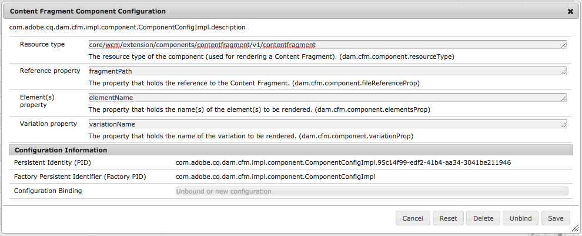

# Componenti di configurazione dei frammenti di contenuto per il rendering{#content-fragments-configuring-components-for-rendering}

Esistono diversi [servizi avanzati](/help/sites-developing/content-fragments-config-components-rendering.md#definition-of-advanced-services-that-need-configuration) relativi al rendering dei frammenti di contenuto. Per utilizzare questi servizi, i tipi di risorse di tali componenti devono farsi conoscere nel framework dei frammenti di contenuto.

Questa operazione viene eseguita configurando [Servizio OSGi - Configurazione componente Frammento di contenuto](#osgi-service-content-fragment-component-configuration).

>[!CAUTION]
>
>Se non hai bisogno dei [servizi avanzati](/help/sites-developing/content-fragments-config-components-rendering.md#definition-of-advanced-services-that-need-configuration) descritti di seguito, puoi ignorare questa configurazione.

>[!CAUTION]
>
>Quando estendi o utilizzi i componenti predefiniti, si sconsiglia di modificare la configurazione.

>[!CAUTION]
>
>Puoi scrivere da zero un componente che utilizza solo l’API Frammenti di contenuto, senza servizi avanzati. Tuttavia, in questo caso, dovrai sviluppare il componente in modo che gestisca l’elaborazione appropriata.
>
>Pertanto, si consiglia di utilizzare i Componenti core.

## Definizione dei servizi avanzati che richiedono la configurazione {#definition-of-advanced-services-that-need-configuration}

I servizi che richiedono la registrazione di un componente sono:

* Determinare correttamente le dipendenze durante la pubblicazione (ovvero, assicurarsi che frammenti e modelli possano essere pubblicati automaticamente con una pagina se sono stati modificati dopo l’ultima pubblicazione).
* Supporto per frammenti di contenuto nella ricerca full-text.
* Gestione/gestione di *contenuto intermedio.*
* Gestione di *risorse multimediali miste.*
* Svuotamento del Dispatcher per i frammenti di riferimento (se viene ripubblicata una pagina contenente un frammento).
* Utilizzo del rendering basato su paragrafi.

Se hai bisogno di una o più di queste funzioni, in genere è più facile utilizzare la funzionalità preconfigurata, invece di svilupparla da zero.

## Servizio OSGi - Configurazione del componente Frammento di contenuto {#osgi-service-content-fragment-component-configuration}

La configurazione deve essere associata al servizio OSGi **Configurazione del componente Frammento di contenuto**:

`com.adobe.cq.dam.cfm.impl.component.ComponentConfigImpl`

>[!NOTE]
>
>Per ulteriori dettagli, vedere [Configurazione di OSGi](/help/sites-deploying/configuring-osgi.md).

Ad esempio:



La configurazione OSGi è:

<table>
 <tbody>
  <tr>
   <td>Etichetta</td>
   <td>Configurazione OSGi<br /> </td>
   <td>Descrizione</td>
  </tr>
  <tr>
   <td><strong>Tipo risorsa</strong></td>
   <td><code>dam.cfm.component.resourceType</code></td>
   <td>Tipo di risorsa da registrare, ad esempio <br /> <p><span class="cmp-examples-demo__property-value"><code>core/wcm/components/contentfragment/v1/contentfragment</code></code></p> </td>
  </tr>
  <tr>
   <td><strong>Proprietà di riferimento</strong></td>
   <td><code>dam.cfm.component.fileReferenceProp</code></td>
   <td>Nome della proprietà che contiene il riferimento al frammento, ad esempio <code>fragmentPath</code> o <code>fileReference</code></td>
  </tr>
  <tr>
   <td><strong>Proprietà elemento/i</strong></td>
   <td><code>dam.cfm.component.elementsProp</code></td>
   <td>Il nome della proprietà che contiene i nomi degli elementi da riprodurre; ad esempio,<code>elementName</code></td>
  </tr>
  <tr>
   <td><strong>Proprietà variante</strong><br /> </td>
   <td><code>dam.cfm.component.variationProp</code></td>
   <td>Il nome della proprietà che contiene il nome della variante da riprodurre; ad esempio,<code>variationName</code></td>
  </tr>
 </tbody>
</table>

Per alcune funzionalità (ad esempio, per eseguire il rendering solo di un intervallo di paragrafi) è necessario rispettare alcune convenzioni:

<table>
 <tbody>
  <tr>
   <td>Nome proprietà</td>
   <td>Descrizione</td>
  </tr>
  <tr>
   <td><code>paragraphRange</code></td>
   <td><p>Proprietà stringa che definisce l'intervallo di paragrafi da restituire se in <em>modalità rendering elemento singolo</em>.</p> <p>Formato:</p>
    <ul>
     <li><code>1</code> o <code>1-3</code> o <code>1-3;6;7-8</code> o <code>*-3;5-*</code></li>
     <li>valutato solo se <code>paragraphScope</code> è impostato su <code>range</code></li>
    </ul> </td>
  </tr>
  <tr>
   <td><code>paragraphScope</code></td>
   <td><p>Proprietà stringa che definisce il modo in cui devono essere generati i paragrafi se in <em>modalità rendering elemento singolo</em>.</p> <p>Valori:</p>
    <ul>
     <li><code>all</code> : per eseguire il rendering di tutti i paragrafi</li>
     <li><code>range</code> : per riprodurre l’intervallo di paragrafi fornito da <code>paragraphRange</code></li>
    </ul> </td>
  </tr>
  <tr>
   <td><code>paragraphHeadings</code></td>
   <td>Proprietà booleana che definisce se le intestazioni (ad esempio, <code>h1</code>, <code>h2</code>, <code>h3</code>) vengono conteggiate come paragrafi (<code>true</code>) o meno (<code>false</code>)</td>
  </tr>
 </tbody>
</table>

>[!CAUTION]
>
>Questo potrebbe cambiare nelle fasi cardine successive di 6.5.

## Esempio {#example}

Ad esempio, consulta quanto segue (su un’istanza di AEM preconfigurata):

```
/apps/core/wcm/config/com.adobe.cq.dam.cfm.impl.component.ComponentConfigImpl-core-comp-v1.config
```

Contiene:

```
dam.cfm.component.resourceType="core/wcm/components/contentfragment/v1/contentfragment"
dam.cfm.component.fileReferenceProp="fragmentPath"
dam.cfm.component.elementsProp="elementName"
dam.cfm.component.variationProp="variationName"
```
