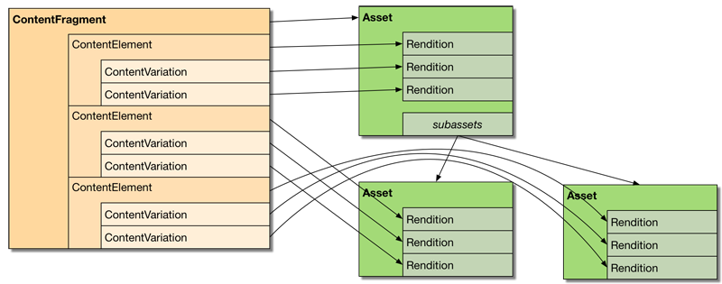
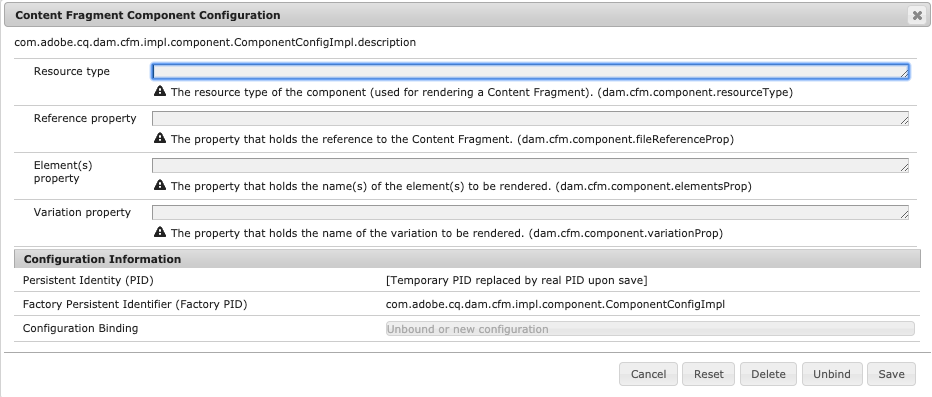

# Personalizzazione ed estensione dei frammenti di contenuto{#customizing-and-extending-content-fragments}

Un frammento di contenuto estende una risorsa standard; vedere:

* [Creazione e gestione di ](/help/assets/content-fragments/content-fragments.md) frammenti di contenuto e creazione di  [pagine con ](/help/sites-authoring/content-fragments.md) frammenti di contenuto per ulteriori informazioni sui frammenti di contenuto.

* [Gestione delle ](/help/assets/manage-assets.md) risorse e  [personalizzazione ed estensione ](/help/assets/extending-assets.md) delle risorse per ulteriori informazioni sulle risorse standard.

## Architettura {#architecture}

Le [parti costitutive di base](/help/assets/content-fragments/content-fragments.md#constituent-parts-of-a-content-fragment) di un frammento di contenuto sono:

* A *Frammento di contenuto,*
* costituito da uno o più *elementi di contenuto* s,
* e che possono avere una o più *Variazioni di contenuto* s.

A seconda del tipo di frammento, vengono utilizzati anche modelli o modelli:

>[!CAUTION]
>
>[Per la creazione di tutti i frammenti è ora consigliabile utilizzare ](/help/assets/content-fragments/content-fragments-models.md) i modelli di frammento di contenuto.
>
>I modelli di frammento di contenuto vengono utilizzati per tutti gli esempi in We.Retail.

* Modelli per frammenti di contenuto:

   * Utilizzato per definire frammenti di contenuto contenenti contenuto strutturato.
   * I modelli di frammento di contenuto definiscono la struttura di un frammento di contenuto al momento della creazione.
   * Un frammento fa riferimento al modello; le modifiche apportate al modello possono quindi avere o avranno effetto su eventuali frammenti dipendenti.
   * I modelli sono composti di tipi di dati.
   * Le funzioni per aggiungere nuove varianti, ecc., devono aggiornare di conseguenza il frammento.

   >[!CAUTION]
   >
   >Qualsiasi modifica apportata a un modello di frammento di contenuto esistente può avere un impatto sui frammenti dipendenti; in questo modo è possibile creare proprietà orfane nei frammenti.

* Modelli di frammento di contenuto:

   * Utilizzato per definire frammenti di contenuto semplici.
   * I modelli definiscono la struttura (di base, solo testo) di un frammento di contenuto al momento della creazione.
   * Il modello viene copiato nel frammento al momento della creazione; pertanto, ulteriori modifiche al modello non si rifletteranno sui frammenti esistenti.
   * Le funzioni per aggiungere nuove varianti, ecc., devono aggiornare di conseguenza il frammento.
   * [I ](/help/sites-developing/content-fragment-templates.md) modelli di frammento di contenuto funzionano in modo diverso da quello di altri meccanismi di modellazione all’interno dell’ecosistema AEM (ad esempio, modelli di pagina, ecc.). Devono pertanto essere considerati separatamente.
   * Quando si basa su un modello, il tipo MIME del contenuto è gestito sul contenuto effettivo; ciò significa che ogni elemento e ogni variante possono avere un tipo MIME diverso.

### Integrazione con le risorse {#integration-with-assets}

Content Fragment Management (CFM) fa parte di  AEM Assets come:

* I frammenti di contenuto sono risorse.
* Utilizzano la funzionalità Risorse esistente.
* Sono completamente integrati con le risorse (console di amministrazione, ecc.).

#### Mapping di frammenti di contenuto strutturati in risorse {#mapping-structured-content-fragments-to-assets}


I frammenti di contenuto con contenuto strutturato (ovvero basato su un modello di frammento di contenuto) vengono mappati su una singola risorsa:

* Tutto il contenuto è memorizzato nel nodo `jcr:content/data` della risorsa:

   * I dati dell&#39;elemento vengono memorizzati sotto il nodo secondario principale:
      `jcr:content/data/master`

   * Le varianti sono memorizzate in un nodo secondario che contiene il nome della variante:
ad esempio `jcr:content/data/myvariation`

   * I dati di ciascun elemento vengono memorizzati nel rispettivo nodo secondario come proprietà con il nome dell&#39;elemento:
Ad esempio, il contenuto dell&#39;elemento `text` è memorizzato come proprietà `text` in `jcr:content/data/master`

* I metadati e il contenuto associato sono memorizzati sotto `jcr:content/metadata`
Ad eccezione del titolo e della descrizione, che non sono considerati metadati tradizionali e memorizzati in 
`jcr:content`

#### Mapping di frammenti di contenuto semplici a risorse {#mapping-simple-content-fragments-to-assets}



I frammenti di contenuto semplici (basati su un modello) sono mappati su un composito costituito da una risorsa principale e (facoltativamente) da risorse secondarie:

* Tutte le informazioni non di contenuto di un frammento (ad esempio titolo, descrizione, metadati, struttura) vengono gestite esclusivamente sulla risorsa principale.
* Il contenuto del primo elemento di un frammento viene mappato sulla rappresentazione originale della risorsa principale.

   * Le varianti (se ce ne sono) del primo elemento sono mappate ad altre rappresentazioni della risorsa principale.

* Eventuali elementi aggiuntivi (se esistenti) sono mappati alle risorse secondarie della risorsa principale.

   * Il contenuto principale di questi elementi aggiuntivi viene associato alla rappresentazione originale della rispettiva sottorisorsa.
   * Altre variazioni (se applicabili) di eventuali elementi aggiuntivi sono associate ad altre rappresentazioni della rispettiva sub-attività.

#### Posizione risorsa {#asset-location}

Come per le risorse standard, un frammento di contenuto è memorizzato in:

`/content/dam`

#### Autorizzazioni risorsa {#asset-permissions}

Per ulteriori dettagli, vedere [Frammento di contenuto - Elimina considerazioni](/help/assets/content-fragments/content-fragments-delete.md).

#### Integrazione delle funzionalità {#feature-integration}

* La funzione Content Fragment Management (CFM) si basa sul core Assets, ma deve essere il più indipendente possibile.
* CFM fornisce le proprie implementazioni per gli elementi nelle viste scheda/colonna/elenco; questi plug-in nelle implementazioni di rendering dei contenuti di Assets.
* Diversi componenti Risorse sono stati estesi per gestire i frammenti di contenuto.

### Utilizzo di frammenti di contenuto nelle pagine {#using-content-fragments-in-pages}

>[!CAUTION]
>
>È ora consigliabile [Componente di base frammento di contenuto](https://helpx.adobe.com/experience-manager/core-components/using/content-fragment-component.html). Per ulteriori informazioni, vedere [Sviluppo di componenti core](https://helpx.adobe.com/experience-manager/core-components/using/developing.html).

È possibile fare riferimento ai frammenti di contenuto dalle AEM pagine, come qualsiasi altro tipo di risorsa. AEM fornisce il componente di base [**Frammento di contenuto**](https://helpx.adobe.com/experience-manager/core-components/using/content-fragment-component.html), un componente [che consente di includere frammenti di contenuto nelle pagine](/help/sites-authoring/content-fragments.md#adding-a-content-fragment-to-your-page). È inoltre possibile estendere questo componente di base **Frammento di contenuto**.

* Il componente utilizza la proprietà `fragmentPath` per fare riferimento al frammento di contenuto effettivo. La proprietà `fragmentPath` viene gestita allo stesso modo delle proprietà simili di altri tipi di risorse; ad esempio, quando il frammento di contenuto viene spostato in un&#39;altra posizione.

* Il componente consente di selezionare la variante da visualizzare.
* È inoltre possibile selezionare una serie di paragrafi per limitare l&#39;output; ad esempio, può essere utilizzato per l&#39;output a più colonne.
* Il componente consente di [inserire contenuto intermedio](/help/sites-developing/components-content-fragments.md#in-between-content):

   * Qui il componente permette di inserire altre risorse (immagini, ecc.) tra i paragrafi del frammento a cui viene fatto riferimento.
   * Per il contenuto intermedio è necessario:

      * essere a conoscenza della possibilità di riferimenti instabili; il contenuto intermedio (aggiunto durante l’authoring di una pagina) non ha alcuna relazione fissa con il paragrafo a cui è posizionato accanto, inserendo un nuovo paragrafo (nell’editor dei frammenti di contenuto) prima che la posizione del contenuto intermedio possa perdere la posizione relativa
      * prendete in considerazione i parametri aggiuntivi (come i filtri di variazione e paragrafo) per evitare falsi positivi nei risultati di ricerca

>[!NOTE]
>
>**Modello per frammenti di contenuto:**
>
>Quando si utilizza un frammento di contenuto basato su un modello di frammento di contenuto in una pagina, viene fatto riferimento al modello. Questo significa che se il modello non è stato pubblicato al momento della pubblicazione della pagina, verrà contrassegnato e il modello verrà aggiunto alle risorse da pubblicare insieme alla pagina.
>
>**Modello frammento di contenuto:**
>
>Quando si utilizza un frammento di contenuto basato su un modello di frammento di contenuto in una pagina, non è presente alcun riferimento in quanto il modello è stato copiato al momento della creazione del frammento.

#### Configurazione mediante la console OSGi {#configuration-using-osgi-console}

L’implementazione di back-end dei frammenti di contenuto, ad esempio, consente di rendere ricercabili le istanze di un frammento utilizzate in una pagina o di gestire contenuti multimediali diversi. Questa implementazione deve sapere quali componenti vengono utilizzati per il rendering dei frammenti e come viene parametrizzato il rendering.

I parametri per questo possono essere configurati nella [console Web](/help/sites-deploying/configuring-osgi.md#osgi-configuration-with-the-web-console), per il bundle OSGi **Configurazione componente frammento di contenuto**.

* **Tipi**
di risorseElenco di 
`sling:resourceTypes` può essere fornito per definire i componenti utilizzati per il rendering dei frammenti di contenuto e a cui applicare l&#39;elaborazione in background.

* **Proprietà**
di riferimento: un elenco di proprietà può essere configurato per specificare la posizione di memorizzazione del riferimento al frammento per il rispettivo componente.

>[!NOTE]
>
>Non esiste una mappatura diretta tra proprietà e tipo di componente.
>
>AEM considera semplicemente la prima proprietà che è possibile trovare su un paragrafo. Quindi dovreste scegliere le proprietà con attenzione.



Esistono ancora alcune linee guida da seguire per garantire che il componente sia compatibile con l’elaborazione in background del frammento di contenuto:

* Il nome della proprietà in cui è definito l&#39;elemento o gli elementi da sottoporre a rendering deve essere `element` o `elementNames`.

* Il nome della proprietà in cui è definito il rendering della variante deve essere `variation` o `variationName`.

* Se l&#39;output di più elementi è supportato (utilizzando `elementNames` per specificare più elementi), la modalità di visualizzazione effettiva è definita dalla proprietà `displayMode`:

   * Se il valore è `singleText` (e è configurato un solo elemento), l&#39;elemento viene rappresentato come un testo con contenuto intermedio, supporto di layout e così via. Questa è l&#39;impostazione predefinita per i frammenti in cui viene eseguito il rendering di un solo elemento.
   * In caso contrario, viene utilizzato un approccio molto più semplice (potrebbe essere denominato &quot;visualizzazione modulo&quot;), in cui non è supportato alcun contenuto intermedio e il contenuto del frammento viene rappresentato &quot;così com&#39;è&quot;.

* Se viene eseguito il rendering del frammento per `displayMode` == `singleText` (in modo implicito o esplicito), vengono visualizzate le seguenti proprietà aggiuntive:

   * `paragraphScope` Definisce se deve essere eseguito il rendering di tutti i paragrafi, o solo di un intervallo di paragrafi (valori:  `all` vs  `range`)

   * se `paragraphScope` == `range` la proprietà `paragraphRange` definisce l&#39;intervallo di paragrafi da sottoporre a rendering

### Integrazione con altri framework {#integration-with-other-frameworks}

I frammenti di contenuto possono essere integrati con:

* **Traduzioni**

   I frammenti di contenuto sono completamente integrati con il [flusso di lavoro di traduzione AEM](/help/sites-administering/tc-manage.md). A livello architettonico, ciò significa:

   * Le singole traduzioni di un frammento di contenuto sono in realtà frammenti separati; ad esempio:

      * si trovano in diverse radici linguistiche:

         `/content/dam/<path>/en/<to>/<fragment>`

         vs

         `/content/dam/<path>/de/<to>/<fragment>`

      * ma condividono esattamente lo stesso percorso relativo sotto la radice della lingua:

         `/content/dam/<path>/en/<to>/<fragment>`

         vs

         `/content/dam/<path>/de/<to>/<fragment>`
   * Oltre ai percorsi basati su regole, non esiste un&#39;ulteriore connessione tra le diverse versioni linguistiche di un frammento di contenuto; sono gestiti come due frammenti separati, anche se l’interfaccia utente fornisce i mezzi per spostarsi tra le varianti di lingua.
   >[!NOTE]
   >
   >Il flusso di lavoro di traduzione AEM funziona con `/content`:
   >
   >    * Poiché i modelli di frammento di contenuto risiedono in `/conf`, questi non sono inclusi in tali traduzioni. È possibile [internazionalizzare le stringhe dell&#39;interfaccia utente](/help/sites-developing/i18n-dev.md).
      >
      >    
   * I modelli vengono copiati per creare il frammento in modo che sia implicito.


* **Schemi metadati**

   * I frammenti di contenuto (re)utilizzano gli schemi di metadati [](/help/assets/metadata-schemas.md), che possono essere definiti con risorse standard.
   * CFM fornisce uno schema specifico proprio:

      `/libs/dam/content/schemaeditors/forms/contentfragment`

      può essere esteso, se necessario.

   * Il modulo schema corrispondente è integrato con l&#39;editor frammento.

## API di gestione dei frammenti di contenuto - Lato server {#the-content-fragment-management-api-server-side}

È possibile utilizzare l&#39;API lato server per accedere ai frammenti di contenuto; vedere:

[com.adobe.cq.dam.cfm](https://helpx.adobe.com/experience-manager/6-5/sites/developing/using/reference-materials/javadoc/com/adobe/cq/dam/cfm/package-summary.html)

>[!CAUTION]
>
>È vivamente consigliato utilizzare l&#39;API lato server invece di accedere direttamente alla struttura del contenuto.

### Interfacce chiave {#key-interfaces}

Le tre interfacce seguenti possono fungere da punti di ingresso:

* **Modello**  frammento ([FragmentTemplate](https://helpx.adobe.com/experience-manager/6-5/sites/developing/using/reference-materials/javadoc/com/adobe/cq/dam/cfm/FragmentTemplate.html))

   Utilizzare `FragmentTemplate.createFragment()` per creare un nuovo frammento.

   ```
   Resource templateOrModelRsc = resourceResolver.getResource("...");
   FragmentTemplate tpl = templateOrModelRsc.adaptTo(FragmentTemplate.class);
   ContentFragment newFragment = tpl.createFragment(parentRsc, "A fragment name", "A fragment description.");
   ```

   Questa interfaccia rappresenta:

   * un modello di frammento di contenuto o un modello di frammento di contenuto da cui creare un frammento di contenuto,
   * e (dopo la creazione) le informazioni strutturali di tale frammento

   Queste informazioni possono includere:

   * Accesso ai dati di base (titolo, descrizione)
   * Accesso a modelli/modelli per gli elementi del frammento:

      * Modelli degli elementi elenco
      * Ottenere informazioni strutturali per un dato elemento
      * Accedere al modello di elemento (vedere `ElementTemplate`)
   * Modelli di accesso per le varianti del frammento:

      * Elenca modelli di variante
      * Ottenere informazioni strutturali per una determinata variazione
      * Accedere al modello di variante (vedere `VariationTemplate`)
   * Ottenere il contenuto associato iniziale

   Interfacce che rappresentano informazioni importanti:

   * `ElementTemplate`

      * Ottenere i dati di base (nome, titolo)
      * Ottenere il contenuto iniziale dell&#39;elemento
   * `VariationTemplate`

      * Ottenere i dati di base (nome, titolo, descrizione)


* **Frammento**  di contenuto ([ContentFragment](https://helpx.adobe.com/experience-manager/6-5/sites/developing/using/reference-materials/javadoc/com/adobe/cq/dam/cfm/ContentFragment.html))

   Questa interfaccia consente di utilizzare un frammento di contenuto in modo astratto.

   >[!CAUTION]
   >
   >È vivamente consigliato accedere a un frammento tramite questa interfaccia. È necessario evitare di modificare direttamente la struttura del contenuto.

   L&#39;interfaccia fornisce i mezzi per:

   * Gestire i dati di base (ad es. get name; get/set title/description)
   * Accesso ai metadati
   * Elementi di accesso:

      * Elementi elenco
      * Ottieni elementi per nome
      * Creare nuovi elementi (vedere [Caveats](#caveats))

      * Dati degli elementi di accesso (vedere `ContentElement`)
   * Elenca le varianti definite per il frammento
   * Creare nuove varianti a livello globale
   * Gestire il contenuto associato:

      * Elenca raccolte
      * Aggiungere raccolte
      * Rimuovere le raccolte
   * Accesso al modello o al modello del frammento

   Le interfacce che rappresentano gli elementi primari di un frammento sono:

   * **Elemento**  contenuto ([ContentElement](https://helpx.adobe.com/experience-manager/6-5/sites/developing/using/reference-materials/javadoc/com/adobe/cq/dam/cfm/ContentElement.html))

      * Ottenere i dati di base (nome, titolo, descrizione)
      * Ottenere/impostare il contenuto
      * Accesso alle varianti di un elemento:

         * Varianti elenco
         * Ottieni varianti per nome
         * Creare nuove varianti (vedere [Caveats](#caveats))
         * Rimuovere le varianti (vedere [Caveats](#caveats))
         * Accedere ai dati delle varianti (vedere `ContentVariation`)
      * Tasti di scelta rapida per la risoluzione delle varianti (applicazione di una logica di fallback specifica per l&#39;implementazione, se la variante specificata non è disponibile per un elemento)
   * **Variazione**  contenuto ([ContentVariation](https://helpx.adobe.com/experience-manager/6-5/sites/developing/using/reference-materials/javadoc/com/adobe/cq/dam/cfm/ContentVariation.html))

      * Ottenere i dati di base (nome, titolo, descrizione)
      * Ottenere/impostare il contenuto
      * Sincronizzazione semplice, in base alle ultime informazioni modificate

   Tutte e tre le interfacce ( `ContentFragment`, `ContentElement`, `ContentVariation`) estendono l&#39;interfaccia `Versionable`, che aggiunge funzionalità di controllo delle versioni necessarie per i frammenti di contenuto:

   * Creare una nuova versione dell&#39;elemento
   * Elenca versioni dell&#39;elemento
   * Ottenete il contenuto di una versione specifica dell’elemento con versione


### Adattamento - Utilizzo di adaptTo() {#adapting-using-adaptto}

È possibile adattare quanto segue:

* `ContentFragment` può essere adattato a:

   * `Resource` - la risorsa Sling sottostante; tenere presente che l&#39;aggiornamento  `Resource` diretto del sottostante richiede la ricostruzione dell&#39; `ContentFragment` oggetto.

   * `Asset` - l&#39; `Asset` astrazione DAM che rappresenta il frammento di contenuto; tenere presente che l&#39;aggiornamento  `Asset` diretto dell&#39;oggetto richiede la ricostruzione dell&#39; `ContentFragment` oggetto.

* `ContentElement` può essere adattato a:

   * `ElementTemplate` - per accedere alle informazioni strutturali dell&#39;elemento.

* `FragmentTemplate` può essere adattato a:

   * `Resource` - la  `Resource` determinazione del modello di riferimento o del modello originale copiato;

      * le modifiche apportate tramite `Resource` non vengono riportate automaticamente nella cartella `FragmentTemplate`.

* `Resource` può essere adattato a:

   * `ContentFragment`
   * `FragmentTemplate`

### Caveats {#caveats}

Va osservato che:

* L&#39;API è implementata per fornire funzionalità supportate dall&#39;interfaccia utente.
* L&#39;intera API è progettata per **not** mantenere le modifiche automaticamente (se non diversamente specificato nel JavaDoc API). Sarà quindi sempre necessario impegnare il risolutore delle risorse della rispettiva richiesta (o il risolutore che si sta utilizzando).
* Attività che potrebbero richiedere ulteriore sforzo:

   * La creazione e la rimozione di nuovi elementi non comporta l&#39;aggiornamento della struttura dati di frammenti semplici (basati su un modello di frammento).
   * La creazione di nuove varianti da `ContentElement` non comporterà l&#39;aggiornamento della struttura dei dati (ma la loro creazione a livello globale da `ContentFragment` sarà possibile).

   * La rimozione delle varianti esistenti non aggiornerà la struttura dei dati.

## API di gestione dei frammenti di contenuto - Lato client {#the-content-fragment-management-api-client-side}

>[!CAUTION]
>
>Per AEM 6.5 l&#39;API lato client è interna.

### Informazioni aggiuntive {#additional-information}

Consulta:

* `filter.xml`

   La `filter.xml` per la gestione dei frammenti di contenuto è configurata in modo che non si sovrapponga al pacchetto di contenuti core Assets.

## Modifica sessioni {#edit-sessions}

Una sessione di modifica viene avviata quando l&#39;utente apre un frammento di contenuto in una delle pagine dell&#39;editor. La sessione di modifica è terminata quando l&#39;utente esce dall&#39;editor selezionando **Salva** o **Annulla**.

### Requisiti {#requirements}

Requisiti per il controllo di una sessione di modifica:

* La modifica di un frammento di contenuto, che può estendersi su più viste (= pagine HTML), deve essere atomica.
* L&#39;editing deve essere anche *transazionale*; alla fine della sessione di modifica, le modifiche devono essere salvate (salvate) o ripristinate (annullate).
* I casi Edge devono essere gestiti correttamente; tali situazioni includono situazioni come quelle in cui l’utente esce dalla pagina immettendo manualmente un URL o utilizzando la navigazione globale.
* Per evitare la perdita di dati, deve essere disponibile un salvataggio automatico periodico (ogni x minuti).
* Se un frammento di contenuto viene modificato da due utenti contemporaneamente, non devono sovrascrivere le modifiche l&#39;uno rispetto all&#39;altro.

#### Processi {#processes}

I processi coinvolti sono:

* Avvio di una sessione

   * Viene creata una nuova versione del frammento di contenuto.
   * Salvataggio automatico avviato.
   * I cookie sono impostati; tali opzioni definiscono il frammento attualmente modificato e indicano che è aperta una sessione di modifica.

* Completamento di una sessione

   * Salvataggio automatico interrotto.
   * Al momento del commit:

      * Le ultime informazioni modificate vengono aggiornate.
      * I cookie vengono rimossi.
   * Al ripristino:

      * Viene ripristinata la versione del frammento di contenuto creata all’avvio della sessione di modifica.
      * I cookie vengono rimossi.


* Modifica

   * Tutte le modifiche (salvataggio automatico incluso) vengono effettuate sul frammento di contenuto attivo, non in un&#39;area separata e protetta.
   * Di conseguenza, tali modifiche si riflettono immediatamente su AEM pagine che fanno riferimento al rispettivo frammento di contenuto

#### Azioni {#actions}

Le azioni possibili sono:

* Inserimento di una pagina

   * Verificate la presenza di una sessione di modifica; controllando il rispettivo cookie.

      * Se esistente, verificate che la sessione di modifica sia stata avviata per il frammento di contenuto in corso di modifica

         * Se il frammento corrente, ristabilire la sessione.
         * In caso contrario, provate ad annullare la modifica per il frammento di contenuto precedentemente modificato e a rimuovere i cookie (in seguito non sarà presente alcuna sessione di modifica).
      * Se non esiste alcuna sessione di modifica, attendete la prima modifica apportata dall’utente (vedete di seguito).
   * Verificate che in una pagina sia già presente un riferimento al frammento di contenuto e visualizzate le informazioni appropriate in tal caso.


* Modifica del contenuto

   * Ogni volta che l&#39;utente cambia contenuto e non è presente alcuna sessione di modifica, viene creata una nuova sessione di modifica (vedere [Avvio di una sessione](#processes)).

* Uscire da una pagina

   * Se è presente una sessione di modifica e le modifiche non sono state persistenti, viene visualizzata una finestra di dialogo di conferma modale per informare l’utente del contenuto potenzialmente perso e consentire loro di restare sulla pagina.

## Esempi {#examples}

### Esempio: Accesso a un frammento di contenuto esistente {#example-accessing-an-existing-content-fragment}

A tal fine, potete adattare la risorsa che rappresenta l&#39;API a:

`com.adobe.cq.dam.cfm.ContentFragment`

Esempio:

```java
// first, get the resource
Resource fragmentResource = resourceResolver.getResource("/content/dam/fragments/my-fragment");
// then adapt it
if (fragmentResource != null) {
    ContentFragment fragment = fragmentResource.adaptTo(ContentFragment.class);
    // the resource is now accessible through the API
}
```

### Esempio: Creazione di un nuovo frammento di contenuto {#example-creating-a-new-content-fragment}

Per creare un nuovo frammento di contenuto a livello di programmazione, è necessario utilizzare:

`com.adobe.cq.dam.cfm.ContentFragmentManager#create`

Esempio:

```java
Resource templateOrModelRsc = resourceResolver.getResource("...");
FragmentTemplate tpl = templateOrModelRsc.adaptTo(FragmentTemplate.class);
ContentFragment newFragment = tpl.createFragment(parentRsc, "A fragment name", "A fragment description.");
```

### Esempio: Specifica dell&#39;intervallo di salvataggio automatico {#example-specifying-the-auto-save-interval}

L’intervallo di salvataggio automatico (in secondi) può essere definito utilizzando il gestore di configurazione (ConfMgr):

* Nodo: `<*conf-root*>/settings/dam/cfm/jcr:content`
* Nome proprietà: `autoSaveInterval`
* Tipo: `Long`

* Predefinito: `600` (10 minuti); questo è definito in `/libs/settings/dam/cfm/jcr:content`

Per impostare un intervallo di salvataggio automatico di 5 minuti è necessario definire la proprietà sul nodo; ad esempio:

* Nodo: `/conf/global/settings/dam/cfm/jcr:content`
* Nome proprietà: `autoSaveInterval`

* Tipo: `Long`

* Valore: `300` (5 minuti equivale a 300 secondi)

## Modelli di frammento di contenuto {#content-fragment-templates}

Per ulteriori informazioni, vedere [Modelli di frammento di contenuto](/help/sites-developing/content-fragment-templates.md).

## Componenti per l’authoring delle pagine {#components-for-page-authoring}

Per ulteriori informazioni, consulta

* [Componenti di base - Componente](https://helpx.adobe.com/experience-manager/core-components/using/content-fragment-component.html)  frammento di contenuto (consigliato)
* [Componenti per frammenti di contenuto - Componenti per l’authoring delle pagine](/help/sites-developing/components-content-fragments.md#components-for-page-authoring)
