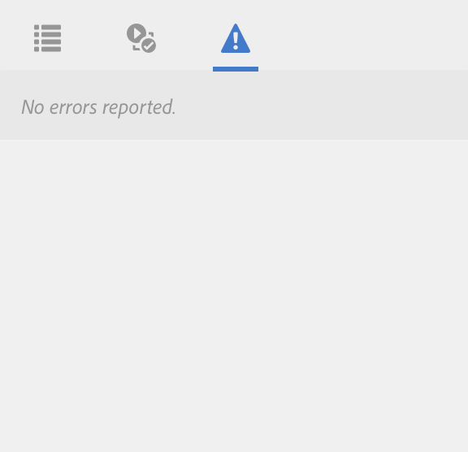

# Modalità Sviluppatore{#developer-mode}

Durante la modifica delle pagine in Adobe Experience Manager (AEM), sono disponibili diverse [modalità](/help/sites-authoring/author-environment-tools.md#modestouchoptimizedui), inclusa la modalità Sviluppatore. Viene aperto un pannello laterale con diverse schede che forniscono a uno sviluppatore informazioni sulla pagina corrente. Le tre schede sono:

* **[Componenti](#components)** per la visualizzazione di informazioni sulla struttura e sulle prestazioni.
* **[Test](#tests)** per l&#39;esecuzione di test e l&#39;analisi dei risultati.
* **[Errori](#errors)** per visualizzare eventuali problemi che si verificano.

Questi aiutano uno sviluppatore a:

* Scopri: di cosa sono composte le pagine.
* Debug: cosa accade dove e quando, il che a sua volta aiuta a risolvere i problemi.
* Test: l’applicazione si comporta come previsto.

>[!CAUTION]
>
>Modalità sviluppatore:
>
>* È disponibile solo nell’interfaccia touch (quando si modificano le pagine).
>* Non è disponibile su dispositivi mobili o piccole finestre sul desktop (a causa di limitazioni di spazio).
>
>   * Ciò si verifica quando la larghezza è inferiore a 1024 px.
>* È disponibile solo per gli utenti membri del gruppo `administrators`.

>[!CAUTION]
>
>La modalità Sviluppatore è disponibile solo in un’istanza Autore standard che non utilizza la modalità di esecuzione nosamplecontent.
>
>Se necessario, può essere configurato per l’uso:
>
>* in un’istanza dell’autore che utilizza la modalità di esecuzione nosamplecontent
>* un’istanza Publish
>
>Deve essere disattivato nuovamente dopo l’uso.

>[!NOTE]
>
>Consulta:
>
>* Articolo della Knowledge Base, [Risoluzione dei problemi relativi all&#39;interfaccia utente touch di AEM](https://experienceleague.adobe.com/it/docs/experience-cloud-kcs/kbarticles/ka-16935), per ulteriori suggerimenti e strumenti.
>* Sessione AEM Gems su [AEM 6.0 Developer Mode](https://experienceleague.adobe.com/docs/events/experience-manager-gems-recordings/gems2014/aem-developer-mode.html?lang=it).
>

## Apertura modalità sviluppatore {#opening-developer-mode}

La modalità Sviluppatore viene implementata come pannello laterale nell’editor di pagine. Per aprire il pannello, seleziona **Sviluppatore** dal selettore di modalità nella barra degli strumenti dell&#39;editor di pagine:

Il pannello è diviso in due schede:

* **[Componenti](/help/sites-developing/developer-mode.md#components)** - Viene visualizzata una struttura ad albero componente simile alla [struttura contenuto](/help/sites-authoring/author-environment-tools.md#content-tree) per gli autori

* **[Errori](/help/sites-developing/developer-mode.md#errors)** - Quando si verificano problemi, vengono visualizzati i dettagli per ciascun componente.

### Componenti {#components}

Viene mostrata una struttura ad albero componente che:

* Consente di definire la catena di componenti e modelli di cui viene eseguito il rendering sulla pagina (SLY, JSP e così via). La struttura può essere espansa per mostrare il contesto all’interno della gerarchia.
* Mostra il tempo di calcolo lato server per eseguire il rendering del componente.
* Consente di espandere la struttura e selezionare componenti specifici all&#39;interno della struttura. La selezione consente di accedere ai dettagli dei componenti, ad esempio:

   * Percorso archivio
   * Collegamenti agli script (a cui si accede in CRXDE Lite)

* I componenti selezionati (nel flusso di contenuto, indicati da un bordo blu) saranno evidenziati nella struttura del contenuto (e viceversa).

Questo può aiutare a:

* Determina e confronta il tempo di rendering per componente.
* Visualizzare e comprendere la gerarchia.
* Scopri e quindi migliora il tempo di caricamento della pagina individuando i componenti lenti.

Ogni voce di componente può mostrare (ad esempio):

* **Visualizza dettagli**: collegamento a un elenco che visualizza:

   * tutti gli script di componenti utilizzati per eseguire il rendering del componente.
   * il percorso del contenuto dell’archivio per questo componente specifico.

  

* **Modifica script**: un collegamento che:

   * apre lo script del componente in CRXDE Lite.

* L’espansione di una voce di componente (punta freccia) può anche mostrare:

   * Gerarchia all’interno del componente selezionato.
   * I tempi di rendering per il componente selezionato sono isolati, tutti i singoli componenti nidificati al suo interno e il totale combinato.

  

>[!CAUTION]
>
>Alcuni collegamenti fanno riferimento a script in `/libs`. Tuttavia, queste sono solo a scopo di riferimento, **non deve** modificare nulla in `/libs`, in quanto eventuali modifiche apportate potrebbero andare perse. Questo perché questo ramo può subire modifiche ogni volta che aggiorni o applichi un hotfix o un feature pack. Apportare le modifiche necessarie in `/apps`. Vedi [Sovrapposizioni e sostituzioni](/help/sites-developing/overlays.md).

### Errori {#errors}

Si spera che la scheda **Errori** sia sempre vuota (come sopra), ma quando si verificano problemi vengono visualizzati i dettagli seguenti per ciascun componente:

* Un avviso se il componente scrive una voce nel registro degli errori, insieme a dettagli dell’errore e collegamenti diretti al codice appropriato in CRXDE Lite.
* Un avviso se il componente apre una sessione di amministrazione.

Ad esempio, in una situazione in cui viene chiamato un metodo non definito, l&#39;errore risultante viene visualizzato nella scheda **Errori**:

Anche la voce del componente nella struttura della scheda Componenti verrà contrassegnata con un indicatore quando si verifica un errore.

### Prove {#tests}

>[!CAUTION]
>
>In AEM 6.2, le funzioni di test della modalità Sviluppatore sono state reimplementate come applicazione per strumenti autonoma.
>
>Per informazioni dettagliate, consulta [Verifica dell&#39;interfaccia utente](/help/sites-developing/hobbes.md).
