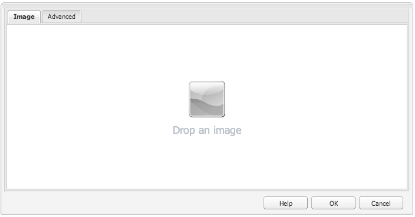

# Sviluppo di componenti Adobe Experience Manager (AEM) (interfaccia classica){#developing-aem-components-classic-ui}

L’interfaccia classica utilizza ExtJS per creare widget che forniscono l’aspetto dei componenti. A causa della natura di questi widget, ci sono alcune differenze tra il modo in cui i componenti interagiscono con l’interfaccia classica e il [interfaccia touch](/help/sites-developing/developing-components.md).

>[!NOTE]
>
>Molti aspetti dello sviluppo di componenti sono comuni sia all’interfaccia utente classica che a quella touch, pertanto **devi leggere [Componenti AEM - Nozioni di base](/help/sites-developing/components-basics.md) prima di** utilizzando questa pagina, che tratta le specifiche dell’interfaccia classica.

>[!NOTE]
>
>Anche se sia HTL (HTML Template Language) che JSP possono essere utilizzati per lo sviluppo di componenti per l’interfaccia utente classica, questa pagina illustra lo sviluppo con JSP. Ciò è dovuto esclusivamente alla cronologia dell’utilizzo di JSP nell’interfaccia classica.
>
>HTL è ora il linguaggio di script consigliato per l’AEM. Consulta [HTL](https://experienceleague.adobe.com/docs/experience-manager-htl/using/overview.html?lang=it) e [Sviluppo di componenti AEM](/help/sites-developing/developing-components.md) per confrontare i metodi.

## Struttura {#structure}

La struttura di base di un componente è illustrata nella pagina [Componenti AEM - Nozioni di base](/help/sites-developing/components-basics.md#structure), che applica sia l’interfaccia utente touch-screen che quella classica. Anche se non devi utilizzare le impostazioni per l’interfaccia utente touch nel nuovo componente, può essere utile conoscerle quando si ereditano i componenti esistenti.

## Script JSP {#jsp-scripts}

Gli script JSP o i servlet possono essere utilizzati per eseguire il rendering dei componenti. In base alle regole di elaborazione delle richieste di Sling, il nome dello script predefinito è:

`<*componentname*>.jsp`

## global.jsp {#global-jsp}

Il file di script JSP `global.jsp` viene utilizzato per fornire accesso rapido a oggetti specifici (ovvero, per accedere al contenuto) a qualsiasi file di script JSP utilizzato per il rendering di un componente.

Pertanto `global.jsp` deve essere incluso in ogni componente che esegue il rendering dello script JSP in cui uno o più oggetti forniti in `global.jsp` vengono utilizzati.

Posizione del valore predefinito `global.jsp` è:

`/libs/foundation/global.jsp`

>[!NOTE]
>
>Il percorso `/libs/wcm/global.jsp`, utilizzato nelle versioni CQ 5.3 e precedenti, è ora obsoleto.

### Funzione di global.jsp, API utilizzate e Taglibs {#function-of-global-jsp-used-apis-and-taglibs}

Di seguito sono elencati gli oggetti più importanti forniti dal valore predefinito `global.jsp`:

Riepilogo:

* `<cq:defineObjects />`

   * `slingRequest` - L&#39;oggetto richiesta racchiuso ( `SlingHttpServletRequest`).
   * `slingResponse` - L&#39;oggetto Risposta racchiuso ( `SlingHttpServletResponse`).
   * `resource` - Oggetto Risorsa Sling ( `slingRequest.getResource();`).
   * `resourceResolver` - Oggetto Resource Resolver Sling ( `slingRequest.getResoucreResolver();`).
   * `currentNode` : nodo JCR risolto per la richiesta.
   * `log` - Il logger predefinito ().
   * `sling` : helper per script Sling.
   * `properties` - Proprietà della risorsa indirizzata ( `resource.adaptTo(ValueMap.class);`).
   * `pageProperties` : proprietà della pagina della risorsa indirizzata.
   * `pageManager` - Il gestore delle pagine per l’accesso alle pagine di contenuti AEM ( `resourceResolver.adaptTo(PageManager.class);`).
   * `component` - L&#39;oggetto componente dell&#39;attuale componente AEM.
   * `designer` - L&#39;oggetto Designer per il recupero delle informazioni di progettazione ( `resourceResolver.adaptTo(Designer.class);`).
   * `currentDesign` - La progettazione della risorsa indirizzata.
   * `currentStyle` - Stile della risorsa indirizzata.

### Accesso al contenuto {#accessing-content}

Esistono tre metodi per accedere al contenuto in WCM AEM:

* Tramite l’oggetto proprietà introdotto in `global.jsp`:

  L&#39;oggetto properties è un&#39;istanza di ValueMap (vedere [API Sling](https://sling.apache.org/apidocs/sling5/org/apache/sling/api/resource/ValueMap.html)) e contiene tutte le proprietà della risorsa corrente.

  Esempio: `String pageTitle = properties.get("jcr:title", "no title");` utilizzato nello script di rendering di un componente pagina.

  Esempio: `String paragraphTitle = properties.get("jcr:title", "no title");` utilizzato nello script di rendering di un componente paragrafo standard.

* Attraverso il `currentPage` oggetto introdotto in `global.jsp`:

  Il `currentPage` L&#39;oggetto è un&#39;istanza di una pagina (vedere [API AEM](https://helpx.adobe.com/it/experience-manager/6-5/sites/developing/using/reference-materials/javadoc/com/day/cq/wcm/api/Page.html)). La classe page fornisce alcuni metodi per accedere al contenuto.

  Esempio: `String pageTitle = currentPage.getTitle();`

* Via `currentNode` oggetto introdotto in `global.jsp`:

  Il `currentNode` l&#39;oggetto è un&#39;istanza di un nodo (vedere [API JCR](https://jackrabbit.apache.org/api/2.16/org/apache/jackrabbit/standalone/cli/core/CurrentNode.html)). Le proprietà di un nodo sono accessibili da `getProperty()` metodo.

  Esempio: `String pageTitle = currentNode.getProperty("jcr:title");`

## Librerie di tag JSP {#jsp-tag-libraries}

Le librerie di tag CQ e Sling consentono di accedere a funzioni specifiche da utilizzare nello script JSP dei modelli e dei componenti.

Per ulteriori informazioni, consulta il documento [Librerie di tag](/help/sites-developing/taglib.md).

## Utilizzo delle librerie HTML lato client {#using-client-side-html-libraries}

I siti web moderni si basano fortemente sull’elaborazione lato client guidata da codice JavaScript e CSS complesso. L’organizzazione e l’ottimizzazione della trasmissione di questo codice possono essere un problema complesso.

Per risolvere questo problema, l’AEM fornisce **Cartelle libreria lato client**, che consente di memorizzare il codice lato client nell’archivio, organizzarlo in categorie e definire quando e come ogni categoria di codice deve essere trasmessa al client. Il sistema di librerie lato client si occupa quindi di generare i collegamenti corretti nella pagina web finale per caricare il codice corretto.

Consulta il documento [Utilizzo delle librerie HTML lato client](/help/sites-developing/clientlibs.md) per ulteriori informazioni.

## Finestra di dialogo {#dialog}

Il componente richiede una finestra di dialogo per consentire agli autori di aggiungere e configurare il contenuto.

Consulta [Componenti AEM - Nozioni di base](/help/sites-developing/components-basics.md#dialogs) per ulteriori dettagli.

## Configurazione del comportamento di modifica {#configuring-the-edit-behavior}

Puoi configurare il comportamento di modifica di un componente. Ciò include attributi quali le azioni disponibili per il componente, le caratteristiche dell’editor locale e i listener relativi agli eventi sul componente. La configurazione è comune sia alle interfacce touch che a quelle classiche, anche se con alcune differenze specifiche.

Il [il comportamento di modifica di un componente è configurato](/help/sites-developing/components-basics.md#edit-behavior) aggiungendo un `cq:editConfig` nodo di tipo `cq:EditConfig` sotto il nodo del componente (di tipo `cq:Component`) e aggiungendo proprietà e nodi secondari specifici.

## Utilizzo ed estensione dei widget ExtJS {#using-and-extending-extjs-widgets}

Consulta [Utilizzo ed estensione dei widget ExtJS](/help/sites-developing/widgets.md) per ulteriori dettagli.

## Utilizzo di xtypes per i widget ExtJS {#using-xtypes-for-extjs-widgets}

Consulta [Utilizzo di xtypes](/help/sites-developing/xtypes.md) per ulteriori dettagli.

## Sviluppo di nuovi componenti {#developing-new-components}

Questa sezione descrive come creare componenti personalizzati e aggiungerli al sistema paragrafo.

Un modo rapido per iniziare è copiare un componente esistente e quindi apportare le modifiche desiderate.

Un esempio di come sviluppare un componente è descritto in dettaglio in [Estensione del componente Testo e immagine: un esempio.](#extending-the-text-and-image-component-an-example)

### Sviluppare un nuovo componente (adattare componente esistente) {#develop-a-new-component-adapt-existing-component}

Per sviluppare nuovi componenti per l’AEM basati su componenti esistenti, è possibile copiare il componente, creare un file JavaScript per il nuovo componente e memorizzarlo in una posizione accessibile all’AEM (vedere anche [Personalizzazione di componenti e altri elementi](/help/sites-developing/dev-guidelines-bestpractices.md#customizing-components-and-other-elements)):

1. Utilizzando CRXDE Lite, crea una cartella di componenti in:

   / `apps/<myProject>/components/<myComponent>`

   Ricrea la struttura del nodo come in libs, quindi copia la definizione di un componente esistente, ad esempio il componente Testo. Ad esempio, per personalizzare la copia del componente Testo:

   * da `/libs/foundation/components/text`
   * a `/apps/myProject/components/text`

1. Modifica il `jcr:title` per riflettere il nuovo nome.
1. Apri la nuova cartella dei componenti e apporta le modifiche necessarie. Elimina inoltre eventuali informazioni estranee nella cartella.

   Puoi apportare modifiche quali:

   * aggiunta di un campo nella finestra di dialogo

      * `cq:dialog` - finestra di dialogo per l’interfaccia touch
      * `dialog` - finestra di dialogo per l’interfaccia classica

   * sostituzione del `.jsp` file (assegna un nome al nuovo componente)
   * o rielaborazione completa dell&#39;intero componente, se si desidera

   Ad esempio, se acquisisci una copia del componente Testo standard, puoi aggiungere un campo aggiuntivo alla finestra di dialogo, quindi aggiornare `.jsp` per elaborare l&#39;input fornito.

   >[!NOTE]
   >
   >Un componente per:
   >
   >* L’interfaccia touch utilizza [Granite](https://developer.adobe.com/experience-manager/reference-materials/6-5/granite-ui/api/jcr_root/libs/granite/ui/index.html) componenti
   >* L’interfaccia classica utilizza [Widget ExtJS](https://developer.adobe.com/experience-manager/reference-materials/6-5/widgets-api/index.html)

   >[!NOTE]
   >
   >Una finestra di dialogo definita per l’interfaccia classica funziona all’interno dell’interfaccia touch.
   >
   >Una finestra di dialogo definita per l’interfaccia touch non funziona nell’interfaccia classica.
   >
   >A seconda dell’istanza e dell’ambiente di authoring in uso, potrebbe essere utile definire entrambi i tipi di finestra di dialogo per il componente.

1. Affinché il nuovo componente venga visualizzato, è necessario che sia presente e inizializzato correttamente uno dei seguenti nodi:

   * `cq:dialog` - finestra di dialogo per l’interfaccia touch
   * `dialog` - finestra di dialogo per l’interfaccia classica
   * `cq:editConfig` - comportamento dei componenti nell&#39;ambiente di modifica (ad esempio, trascinamento della selezione)
   * `design_dialog` - finestra di dialogo per la modalità progettazione (solo interfaccia classica)

1. Attiva il nuovo componente nel sistema paragrafo:

   * utilizzo di CRXDE Lite per aggiungere il valore `<path-to-component>` (ad esempio, `/apps/geometrixx/components/myComponent`) ai componenti proprietà del nodo `/etc/designs/geometrixx/jcr:content/contentpage/par`
   * seguendo le istruzioni in [Aggiunta di nuovi componenti ai sistemi paragrafo](#adding-a-new-component-to-the-paragraph-system-design-mode)

1. In WCM per AEM, apri una pagina del sito web e inserisci un paragrafo del tipo appena creato per assicurarti che il componente funzioni correttamente.

>[!NOTE]
>
>Per visualizzare le statistiche sui tempi di caricamento delle pagine, puoi utilizzare Ctrl-Maiusc-U con `?debugClientLibs=true` impostato nell’URL.

### Aggiunta di un nuovo componente al sistema paragrafo (modalità Progettazione) {#adding-a-new-component-to-the-paragraph-system-design-mode}

Una volta sviluppato il componente, questo viene aggiunto al sistema paragrafo, che consente agli autori di selezionare e utilizzare il componente durante la modifica di una pagina.

1. Accedi a una pagina nell’ambiente di authoring che utilizza il sistema paragrafo, ad esempio `<contentPath>/Test.html`.
1. Passa alla modalità Progettazione in uno dei modi seguenti:

   * aggiunta `?wcmmode=design` alla fine dell’URL e accedendo di nuovo, ad esempio:

     `<contextPath>/ Test.html?wcmmode=design`

   * clic su Progettazione nel Sidekick

   Ora sei in modalità progettazione e puoi modificare il sistema paragrafo.

1. Fai clic su Modifica.

   Viene visualizzato un elenco di componenti appartenenti al sistema paragrafo. Viene elencato anche il nuovo componente.

   I componenti possono essere attivati (o disattivati) per determinare quali sono offerti all’autore durante la modifica di una pagina.

1. Attiva il componente, quindi torna alla modalità di modifica normale per verificare che sia disponibile per l’uso.

### Estensione del componente Testo e immagine: un esempio {#extending-the-text-and-image-component-an-example}

Questa sezione fornisce un esempio di come estendere il componente standard per testo e immagini ampiamente utilizzato con una funzione di posizionamento dell’immagine configurabile.

L’estensione del componente testo e immagine consente agli editor di utilizzare tutte le funzionalità esistenti del componente e di avere un’opzione aggiuntiva per specificare il posizionamento dell’immagine:

* Sul lato sinistro del testo (comportamento corrente e nuovo valore predefinito)
* E sul lato destro

Dopo aver esteso questo componente, puoi configurare il posizionamento dell’immagine tramite la finestra di dialogo del componente.

In questo esercizio sono descritte le tecniche riportate di seguito.

* Copia del nodo del componente esistente e modifica dei relativi metadati
* Modifica della finestra di dialogo del componente, inclusa l’ereditarietà dei widget dalle finestre di dialogo principali
* Modifica dello script del componente per implementare la nuova funzionalità

>[!NOTE]
>
>Questo esempio è destinato all’interfaccia classica.

>[!NOTE]
>
>Questo esempio si basa sul contenuto del Geometrixx, che non viene più fornito con AEM ed è stato sostituito da We.Retail. Consulta il documento [Implementazione di riferimento We.Retail](/help/sites-developing/we-retail.md#we-retail-geometrixx) per informazioni su come scaricare e installare Geometrixx.

#### Estensione del componente textimage esistente {#extending-the-existing-textimage-component}

Per creare il componente, utilizzate il componente textimage standard come base e modificatelo. Il nuovo componente viene memorizzato nell&#39;applicazione di esempio WCM per AEM Geometrixx.

1. Copia il componente textimage standard da `/libs/foundation/components/textimage` nella cartella dei componenti di Geometrixx, `/apps/geometrixx/components`, utilizzando textimage come nome del nodo di destinazione. Per copiare il componente, fai clic con il pulsante destro del mouse sul componente e seleziona Copia, quindi individua la directory di destinazione.

   

1. Per mantenere semplice questo esempio, passa al componente copiato ed elimina tutti i sottonodi del nuovo nodo textimage ad eccezione dei seguenti:

   * definizione finestra di dialogo: `textimage/dialog`
   * script componente: `textimage/textimage.jsp`
   * modifica nodo di configurazione (consente di trascinare e rilasciare le risorse): `textimage/cq:editConfig`

   >[!NOTE]
   >
   >La definizione della finestra di dialogo dipende dall’interfaccia utente:
   >
   >* Interfaccia touch: `textimage/cq:dialog`
   >* Interfaccia classica: `textimage/dialog`

1. Modifica i metadati del componente:

   * Nome componente

      * Imposta `jcr:description` a `Text Image Component (Extended)`
      * Imposta `jcr:title` a `Text Image (Extended)`

   * Gruppo, in cui il componente è elencato nella barra laterale (lascia invariato)

      * Esci `componentGroup` imposta su `General`

   * Componente padre del nuovo componente (il componente textimage standard)

      * Imposta `sling:resourceSuperType` a `foundation/components/textimage`

   Dopo questo passaggio, il nodo del componente si presenta così:

   

1. Modificare il `sling:resourceType` proprietà del nodo di configurazione per la modifica dell’immagine (proprietà: `textimage/cq:editConfig/cq:dropTargets/image/parameters/sling:resourceType`) a `geometrixx/components/textimage.`

   In questo modo, quando un’immagine viene rilasciata al componente nella pagina, il `sling:resourceType` proprietà del componente textimage esteso impostata su: `geometrixx/components/textimage.`

1. Modificate la finestra di dialogo del componente per includere la nuova opzione. Il nuovo componente eredita le parti della finestra di dialogo che sono identiche a quelle dell&#39;originale. L’unica aggiunta che effettui è quella di estendere **Avanzate** , aggiunta di un **Posizione immagine** elenco a discesa, con opzioni **Sinistra** e **Destra**:

   * Lascia `textimage/dialog`proprietà invariate.

   Nota come `textimage/dialog/items` dispone di quattro sottonodi, da tab1 a tab4, che rappresentano le quattro schede della finestra di dialogo textimage.

   * Per le prime due schede (tab1 e tab2):

      * Cambia xtype in cqinclude (per ereditare dal componente standard).
      * Aggiungi una proprietà percorso con valori `/libs/foundation/components/textimage/dialog/items/tab1.infinity.json`e `/libs/foundation/components/textimage/dialog/items/tab2.infinity.json`, rispettivamente.
      * Rimuovi tutte le altre proprietà o sottonodi.

   * Per tab3:

      * Lascia le proprietà e i sottonodi senza modifiche
      * Aggiungere una definizione di campo a `tab3/items`, posizione del nodo di tipo `cq:Widget`
      * Imposta le seguenti proprietà (di tipo String) per il nuovo `tab3/items/position`nodo:

         * `name`: `./imagePosition`
         * `xtype`: `selection`
         * `fieldLabel`: `Image Position`
         * `type`: `select`

      * Aggiungi sottonodo `position/options` di tipo `cq:WidgetCollection` per rappresentare le due scelte per il posizionamento dell&#39;immagine e sotto di essa creare due nodi, o1 e o2 di tipo `nt:unstructured`.
      * Per nodo `position/options/o1` impostare le proprietà: `text` a `Left` e `value` a `left.`
      * Per nodo `position/options/o2` impostare le proprietà: `text` a `Right` e `value` a `right`.

   * Elimina scheda4.

   La posizione dell&#39;immagine viene mantenuta nel contenuto come `imagePosition`proprietà del nodo che rappresenta `textimage` paragrafo. Dopo questi passaggi, la finestra di dialogo del componente si presenta così:

   

1. Estendere lo script del componente, `textimage.jsp`, con una gestione aggiuntiva del nuovo parametro:

   ```xml
   Image image = new Image(resource, "image");
   
   if (image.hasContent() || WCMMode.fromRequest(request) == WCMMode.EDIT) {
        image.loadStyleData(currentStyle);
   ```

   Stai per sostituire il frammento di codice evidenziato *%>&lt;div class=&quot;image&quot;>&lt;%* con un nuovo codice che genera uno stile personalizzato per questo tag.

   ```xml
   // todo: add new CSS class for the 'right image' instead of using
   // the style attribute
   String style="";
        if (properties.get("imagePosition", "left").equals("right")) {
             style = "style=\"float:right\"";
        }
        %><div <%= style %> class="image"><%
   ```

1. Salva il componente nel repository. Il componente è pronto per il test.

#### Controllo del nuovo componente {#checking-the-new-component}

Una volta sviluppato il componente, è possibile aggiungerlo al sistema paragrafo, consentendo agli autori di selezionare e utilizzare il componente durante la modifica di una pagina. Questi passaggi ti consentono di testare il componente.

1. Apri una pagina in Geometrixx, ad esempio Inglese/Azienda.
1. Passare alla modalità progettazione facendo clic su Progettazione nel Sidekick.
1. Modificate la struttura del sistema paragrafo facendo clic su Modifica (Edit) nel sistema paragrafo al centro della pagina. Viene visualizzato un elenco di componenti, che possono essere inseriti nel sistema paragrafo, e che dovrebbero includere il componente appena sviluppato, Immagine testo (estesa) . Attivarla per il sistema paragrafo selezionandola e facendo clic su OK.
1. Torna alla modalità di modifica.
1. Aggiungi il paragrafo Immagine di testo (estesa) al sistema paragrafo, inizializza il testo e l’immagine con contenuti di esempio. Salva le modifiche.
1. Aprire la finestra di dialogo del paragrafo di testo e immagine e impostare Posizione immagine nella scheda Avanzate su Destra, quindi fare clic su OK per salvare le modifiche.
1. Il paragrafo viene renderizzato con l&#39;immagine a destra.
1. Il componente è ora pronto per l’uso.

Il componente memorizza il proprio contenuto in un paragrafo della pagina Azienda.

### Disabilita la funzionalità di caricamento del componente Immagine {#disable-upload-capability-of-the-image-component}

Per disabilitare questa funzionalità, utilizza il componente immagine standard come base e modificalo. Il nuovo componente viene memorizzato nell&#39;applicazione di Geometrixx.

1. Copia il componente immagine standard da `/libs/foundation/components/image` nella cartella dei componenti di Geometrixx, `/apps/geometrixx/components`, utilizzando l’immagine come nome del nodo di destinazione.

   

1. Modifica i metadati del componente:

   * Imposta **jcr:title** a `Image (Extended)`

1. Accedi a `/apps/geometrixx/components/image/dialog/items/image`.
1. Aggiungi una proprietà:

   * **Nome**: `allowUpload`
   * **Tipo**: `String`
   * **Valore**: `false`

   

1. Clic **Salva tutto**. Il componente è pronto per il test.
1. Apri una pagina in Geometrixx, ad esempio Inglese/Azienda.
1. Passa alla modalità progettazione e attiva Immagine (estesa).
1. Tornate alla modalità di modifica e aggiungetela al sistema paragrafo. Nelle immagini successive puoi vedere le differenze tra il componente immagine originale e quello creato.

   Componente immagine originale:

   

   Nuovo componente immagine:

   

1. Il componente è ora pronto per l’uso.
