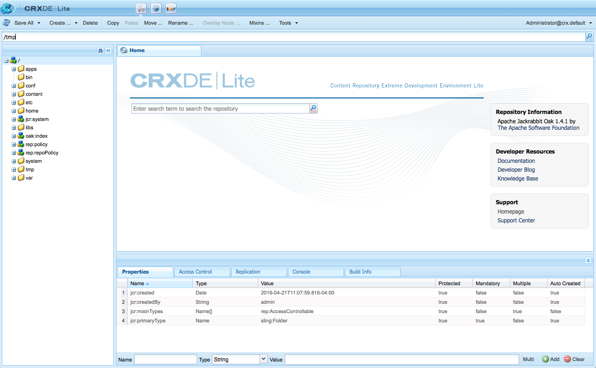

# Sviluppo con CRXDE Lite{#developing-with-crxde-lite}

Questa sezione descrive come sviluppare l’applicazione AEM con CRXDE Lite.

Per ulteriori informazioni sui diversi ambienti di sviluppo disponibili, consulta la documentazione di panoramica.

CRXDE Lite è integrato in AEM e consente di eseguire attività di sviluppo standard nel browser. Con CRXDE Lite, potete creare un progetto, creare e modificare file (come .jsp e .java), cartelle, modelli, componenti, finestre di dialogo, nodi, proprietà e bundle durante la registrazione e l&#39;integrazione con SVN.
CRXDE Lite è consigliato quando non si dispone dell&#39;accesso diretto al server AEM, quando si sviluppa un&#39;applicazione estendendo o modificando i componenti out-of-the-box e i bundle Java o quando non è necessario un debugger dedicato, completamento del codice e evidenziazione della sintassi.

>[!NOTE]
>
>Per impostazione predefinita, tutti gli utenti AEM possono accedere a CRXDE Lite. Se lo desiderate, [configurate ACL](/help/sites-administering/security.md#permissions-and-acls) per il seguente nodo in modo che solo gli sviluppatori possano accedere a CRX DE Lite:
>
>`/libs/granite/crxde`

>[!NOTE]
>
>È consigliabile utilizzare [AEM Developer Tools per Eclipse](/help/sites-developing/aem-eclipse.md) e [AEM HTL Brackets Extension](/help/sites-developing/aem-brackets.md) durante lo sviluppo del progetto.

## Guida introduttiva a CRXDE Lite {#getting-started-with-crxde-lite}

Per iniziare con CRXDE Lite, procedere come segue:

1. Installare AEM.
1. Nel browser, immettete `https://<host>:<port>/crx/de`. Per impostazione predefinita è `https://localhost:4502/crx/de`.
1. Inserite **nome utente** e **password**. Per impostazione predefinita è `admin` e `admin`.

1. Fai clic su **OK**. 

L&#39;interfaccia utente CRXDE Lite si presenta come segue nel browser:



È ora possibile utilizzare CRXDE Lite per sviluppare l&#39;applicazione.

## Panoramica dell&#39;interfaccia utente {#overview-of-the-user-interface}

CRXDE Lite offre le seguenti funzionalità:

<table>
 <tbody>
  <tr>
   <td>Barra di commutazione superiore</td>
   <td>Consente di passare rapidamente da CRXDE Lite, Package Manager e Package Share.</td>
  </tr>
  <tr>
   <td>Widget percorso nodo</td>
   <td><p>Visualizza il percorso del nodo attualmente selezionato.</p> <p>È inoltre possibile utilizzarlo per passare a un nodo, immettendo il percorso a mano, o incollandolo da un'altra posizione, e premendo Invio.</p> <p>Fornisce inoltre supporto per la ricerca di nodi con un nome di nodo specifico. Inserite il nome del nodo da trovare e attendete (o toccate il simbolo di ricerca sul lato destro). Potete provare a inserire, ad esempio, la <em>quercia</em> stringa nel widget per vedere come funziona. Se un determinato nodo o nodi viene caricato nel riquadro di esplorazione, verrà visualizzato l'elenco, quindi sarà possibile selezionare il percorso e premere Invio per passare a tale percorso. Si noti che funziona solo per i nodi attualmente caricati nell'applicazione client CRXDE nel browser. Se si desidera eseguire una ricerca nell'intero repository, utilizzare Strumenti, quindi Query.</p> </td>
  </tr>
  <tr>
   <td>Riquadro Esplora</td>
   <td><p>Visualizza una struttura ad albero di tutti i nodi della directory archivio.</p> <p>Fare clic su un nodo per visualizzarne le proprietà nella scheda <strong>Proprietà</strong> . Dopo aver fatto clic su un nodo, è possibile selezionare un'azione nella barra degli strumenti. Fare di nuovo clic sul nodo per rinominarlo.</p> <p>Filtro di navigazione albero (icona binoculare): consente di filtrare i nodi della directory archivio per i quali il nome contiene il testo di input. Si applica solo ai nodi caricati localmente.<br /> </p> </td>
  </tr>
  <tr>
   <td>Riquadro di modifica</td>
   <td><p><strong>Scheda Pagina iniziale</strong> : consente di effettuare ricerche nei contenuti e/o nella documentazione e di accedere alle risorse per gli sviluppatori (documentazione, blog per sviluppatori, knowledge base) e al supporto (homepage e centro di supporto di Adobe).<br /> </p> <p>Fare doppio clic su un file nel riquadro <strong>Esplora risorse</strong> per visualizzarne il contenuto; come ad esempio un file .jsp o .java. Potete quindi modificarlo e salvare le modifiche.</p> <p>Una volta modificato un file nel riquadro <strong>Modifica</strong> , nella barra degli strumenti sono disponibili i seguenti strumenti:<br /> </p> - <strong>Mostra nella struttura: </strong>mostra il file nella struttura del repository.<br /> - <strong>Cerca/Sostituisci ...</strong>: eseguire ricerche o sostituire.<br /> Fate <br /> doppio clic sulla riga di stato del riquadro <strong>Modifica</strong> per aprire la finestra di dialogo <strong>Vai alla riga</strong> , in modo da immettere un numero di riga specifico a cui passare.<br /> </td>
  </tr>
  <tr>
   <td>scheda Proprietà<br /> </td>
   <td>Visualizza le proprietà del nodo selezionato. È possibile aggiungere nuove proprietà o eliminare quelle esistenti.<br /> </td>
  </tr>
  <tr>
   <td>Scheda Controllo accesso</td>
   <td><p>Visualizza le autorizzazioni in base al percorso, al livello del repository o all'entità corrente.</p> <p>Le autorizzazioni sono suddivise in</p> <p>- <strong>Criterio</strong>di controllo degli accessi applicabile: Criteri che possono essere applicati alla selezione corrente.</p> <p>- Criteri per il controllo degli accessi <strong>locali</strong>: Criteri correnti applicati localmente alla selezione corrente.</p> <p>- Politiche <strong>Efficaci Di Controllo Dell'Accesso</strong>: I criteri correnti applicati alla selezione corrente possono essere impostati localmente o ereditati dai nodi padre.</p> <p>Nota. Per poter visualizzare le informazioni sul controllo di accesso, l'utente che ha eseguito l'accesso a CRXDE Lite deve disporre dei diritti per la lettura delle voci ACL. L'utente anonimo non può visualizzare queste informazioni per impostazione predefinita. Per visualizzare le informazioni, effettuate l'accesso, ad esempio, come amministratore.</p> </td>
  </tr>
  <tr>
   <td>Scheda Replica</td>
   <td><p>Visualizza lo stato di replica del nodo corrente. È possibile replicare e replicare l'eliminazione del nodo corrente.</p> </td>
  </tr>
  <tr>
   <td>Scheda Console<br /> </td>
   <td><p><strong>Registri del server</strong>:</p> <p>Visualizza i messaggi dei registri. Puoi configurare il livello di registro, cancellare la console, fissare la posizione di scorrimento selezionata e attivare/disattivare la visualizzazione dei messaggi.<br /> </p> <p><strong>Controllo della versione</strong>:</p> <p>Visualizza i messaggi relativi al controllo della versione.<br /> </p> </td>
  </tr>
  <tr>
   <td>Informazioni build, scheda<br /> </td>
   <td>Visualizza informazioni durante la creazione di un bundle.<br /> </td>
  </tr>
  <tr>
   <td>Aggiorna<br /> </td>
   <td>Aggiorna la selezione corrente. Le modifiche apportate da altri utenti vengono aggiornate nella visualizzazione della directory archivio. Le modifiche apportate restano invariate.<br /> </td>
  </tr>
  <tr>
   <td>Salva tutto</td>
   <td><p><strong>Salva tutto</strong>:<br /> </p> <p>Salva tutte le modifiche apportate. Fino a quando non si fa clic su Salva, le modifiche sono temporanee e andranno perse quando si esce dalla console.</p> <p><strong>Versione precedente</strong>:</p> <p>Ignora tutte le modifiche apportate al nodo selezionato dall'ultima azione di salvataggio, quindi ricarica lo stato corrente del repository per il nodo selezionato.</p> <p><strong>Ripristina tutto</strong>:</p> <p>Elimina tutte le modifiche apportate all’intero repository dall’ultima azione di salvataggio, quindi ricarica lo stato corrente dell’archivio.</p> </td>
  </tr>
  <tr>
   <td>Crea ...<br /> </td>
   <td><p>Menu a discesa per creare quanto segue sotto il nodo selezionato:<br /> </p> <p>- <strong>Nodo</strong>: un nodo con un tipo di nodo arbitrario<br /> </p> <p>- <strong>File</strong>: nt:nodo file e relativo nodo secondario nt:resource</p> <p>- <strong>Cartella</strong>: nt:folder, nodo</p> <p>- <strong>Modello</strong>: Modello AEM</p> <p>- <strong>Componente</strong>: Componente AEM</p> <p>- <strong>Dialogo</strong>: Finestra di dialogo AEM</p> </td>
  </tr>
  <tr>
   <td>Elimina<br /> </td>
   <td>Elimina il nodo selezionato.<br /> </td>
  </tr>
  <tr>
   <td>Copia</td>
   <td>Copia il nodo selezionato.<br /> </td>
  </tr>
  <tr>
   <td>Incolla<br /> </td>
   <td>Incolla il nodo copiato sotto il nodo selezionato.<br /> </td>
  </tr>
  <tr>
   <td>Sposta ...<br /> </td>
   <td>Sposta il nodo selezionato nel nodo impostato attraverso la finestra di dialogo.</td>
  </tr>
  <tr>
   <td>Rinomina ...<br /> </td>
   <td>Rinomina il nodo selezionato.<br /> </td>
  </tr>
  <tr>
   <td>Mixin...<br /> </td>
   <td>Consente di aggiungere tipi di mixin al tipo di nodo. I tipi di mixin vengono utilizzati principalmente per aggiungere al nodo funzioni avanzate quali controllo delle versioni, controllo degli accessi, riferimenti e blocco.</td>
  </tr>
  <tr>
   <td>Team<br /> </td>
   <td><p>Menu a discesa per eseguire le attività di controllo versione standard:</p> <p>- <strong>Aggiornamento</strong> repository da server SVN</p> <p>- <strong>Conferma</strong> modifiche locali al server SVN</p> <p>- Visualizza <strong>stato</strong> del nodo corrente</p> <p>- Visualizza stato <strong></strong> ricorsivo della struttura secondaria del nodo corrente</p> <p>- <strong>Estrazione</strong> di una copia di lavoro dal server SVN</p> <p>- <strong>Esportare</strong> un progetto dal server SVN (senza creare una copia di lavoro)</p> <p>- <strong>Importare</strong> un progetto dall'archivio al server SVN<br /> </p> <p>È necessario effettuare l'accesso come utente con autorizzazioni sufficienti per poter eseguire alcune delle attività (in particolare quelle che scrivono nell'archivio locale).<br /> </p> </td>
  </tr>
  <tr>
   <td>Strumenti<br /> </td>
   <td><p>Menu a discesa con i seguenti strumenti:</p> <p>- Configurazione <strong>server ...</strong>: per accedere alla console Felix.</p> <p>- <strong>Query ...</strong>: per eseguire una query nell'archivio.</p> <p>- <strong>Privilegi ...</strong>: per aprire la gestione dei privilegi, dove puoi visualizzare e aggiungere privilegi.</p> <p>- Controllo di accesso <strong>alla prova ...</strong>: un luogo in cui è possibile verificare l'autorizzazione per determinati percorsi e/o entità.</p> <p>- Tipo <strong>nodo</strong>esportazione: per esportare i tipi di nodi nel sistema come notazione cnd.</p> <p>- <strong>Importa tipo di nodo ...</strong>: per importare i tipi di nodo utilizzando la notazione cnd.</p> <p>- <strong>Installare SiteCatalyst Debugger ...</strong>: istruzioni su come installare Analytics Debugger.</p> </td>
  </tr>
  <tr>
   <td>widget di accesso<br /> </td>
   <td><p>Visualizza gli utenti attualmente connessi e l’area di lavoro in cui sono connessi, ad esempio admin@crx.default.</p> <p>Fate clic su di esso per accedere o effettuare nuovamente l'accesso come utente specifico. Se non specificate un'area di lavoro a cui accedere, dovrete accedere all'area di lavoro predefinita, crx.default.</p> <p>Se desiderate sfogliare l’archivio come utente anonimo, usate <strong>anonimo</strong> come nome di login e password (ad esempio, uno spazio o un punto).<br /> </p> <p>Se l’autorizzazione non è più valida (ad es., è scaduta), nel widget di accesso viene visualizzato "<strong>Non autorizzato - Accesso...</strong>". Fate clic su di esso per effettuare nuovamente l'accesso.</p> </td>
  </tr>
 </tbody>
</table>

## Creazione di un progetto {#creating-a-project}

Con CRXDE Lite è possibile creare un progetto di lavoro con tre clic. La procedura guidata del progetto crea un nuovo progetto in `/apps`, alcuni contenuti in `/conten`esso contenuti e un pacchetto che racchiude tutti i contenuti del progetto in `/etc/packages`. Il progetto può essere utilizzato immediatamente per eseguire il rendering di una pagina di esempio in cui viene visualizzato **Hello World**, in base a uno script jsp che esegue il rendering di una proprietà dall&#39;archivio e chiama una classe Java per eseguire il rendering di parte del testo.

Per creare un progetto con CRXDE Lite:

1. Aprite CRXDE Lite nel browser.
1. **Nel riquadro di navigazione, fare clic con il pulsante destro del mouse su un nodo, selezionare** Crea ...**, quindi**Crea progetto ... .
Nota: potete fare clic con il pulsante destro del mouse su qualsiasi nodo nella struttura ad albero, poiché i nuovi nodi di progetto sono, per impostazione predefinita, creati sotto `/apps,` e `/content` `/etc/packages`.

1. Definisci:

   * **Nome** progetto: il nome del progetto viene utilizzato per creare i nuovi nodi e il bundle, ad esempio `myproject`.

   * **Java Package** - il prefisso del nome del pacchetto Java, ad esempio `com.mycompany`.

1. Fai clic su **Crea**. 
1. Fate clic su **Salva tutto** per salvare le modifiche sul server.

Per accedere alla pagina di esempio in cui è visualizzato **Hello World**, selezionate il browser per:

`https://localhost:4502/content/<project-name>.html`

La pagina **Hello World** si basa su un nodo di contenuto, che richiama uno script jsp tramite la `sling:resourceType` proprietà. Lo script legge la `jcr:title` proprietà dall&#39;archivio e ottiene il contenuto body chiamando un metodo della classe SampleUtil, disponibile nel pacchetto di progetto.

Vengono creati i nodi seguenti:

* `/apps/<project-name>`: il contenitore dell’applicazione.
* `/apps/<project-name>/components`: il contenitore dei componenti, contenente il file html.jsp di esempio, utilizzato per il rendering di una pagina.

* `/apps/<project-name>/src`: il contenitore dei bundle, contenente un pacchetto di progetto di esempio.

* `/apps/<project-name>/install`: il contenitore dei bundle compilati, contenente il pacchetto di progetto di esempio compilato.
* `/content/<project-name>`: il contenitore del contenuto.
* /etc/packages/&lt;java-suffix>/&lt;project-name>.zip, un pacchetto che racchiude l&#39;app e il contenuto del progetto. Potete utilizzarlo per ricreare il progetto per un&#39;ulteriore implementazione (ad esempio, in altri ambienti) o per la condivisione tramite Package Share.

La struttura si presenta come segue in CRXDE Lite con un progetto denominato **myproject** e un suffisso di pacchetto Java denominato **mycompany**:


## Creating a Folder {#creating-a-folder}

Per creare una cartella con CRXDE Lite:

1. Aprite CRXDE Lite nel browser.
1. **Nel riquadro di navigazione, fare clic con il pulsante destro del mouse sulla cartella in cui si desidera creare la nuova cartella, selezionare** Crea ...**, quindi** Crea cartella ... .

1. Immettete il **nome** della cartella e fate clic su **OK**.

1. Fate clic su **Salva tutto** per salvare le modifiche sul server.

## Creating a Template {#creating-a-template}

Per creare un modello con CRXDE Lite:

1. Aprite CRXDE Lite nel browser.
1. **Nel riquadro di navigazione, fare clic con il pulsante destro del mouse sulla cartella in cui si desidera creare il modello, selezionare** Crea ...**, quindi** Crea modello ... .

1. Immettere **Etichetta**, **Titolo**, **Descrizione**, Tipo **** risorsa e **Classificazione** del modello. Fai clic su **Avanti**.

1. Questo passaggio è facoltativo: impostare i percorsi **consentiti**. Fai clic su **Avanti**

1. Questo passaggio è facoltativo: impostare i genitori **consentiti**. Fai clic su **Avanti**.

1. Questo passaggio è facoltativo: imposta gli elementi figlio **consentiti**. Fai clic su **OK**. 

1. Fate clic su **Salva tutto** per salvare le modifiche sul server.

Crea:

* Un nodo di tipo `cq:Template` con proprietà Modello

* Un nodo secondario di tipo `cq:PageContent` con proprietà Contenuto pagina

Potete aggiungere proprietà al modello: fare riferimento alla sezione [Creazione di una proprietà](#creating-a-property) .

## Creazione di un componente {#creating-a-component}

La funzione qui descritta è disponibile solo se CQ5 è installato, ovvero se il tipo di nodo `cq:Component` è disponibile nella directory archivio.

Per creare un componente con CRXDE Lite:

1. Aprite CRXDE Lite nel browser.
1. **Nel riquadro di navigazione, fare clic con il pulsante destro del mouse sulla cartella in cui si desidera creare il componente, selezionare** Crea ...**, quindi** Crea componente ... .

1. Immettere **Etichetta**, **Titolo**, **Descrizione**, **Super Resource Type** e **Gruppo** del componente. Fai clic su **Avanti**.

1. Questo passaggio è facoltativo: impostare le proprietà del componente **Contenitore,** **Nessuna decorazione**, Nome **** cella e Percorso **** finestra di dialogo. Fai clic su **Avanti**.

1. Questo passaggio è facoltativo: impostare la proprietà del componente **Parenti** consentiti. Fai clic su **Avanti**.

1. Questo passaggio è facoltativo: impostare la proprietà del componente **Allowed Children**. Fai clic su **OK**. 

1. Fate clic su **Salva tutto** per salvare le modifiche sul server.

Crea:

* Un nodo di tipo `cq:Component`
* Proprietà dei componenti
* Script .jsp di un componente

## Creazione di una finestra di dialogo {#creating-a-dialog}

Per creare una finestra di dialogo con CRXDE Lite:

1. Aprite CRXDE Lite nel browser.
1. **Nel riquadro di navigazione, fare clic con il pulsante destro del mouse sul componente in cui si desidera creare la finestra di dialogo, selezionare** Crea ...**, quindi** Crea finestra di dialogo ... .

1. Immettete **Etichetta** e **Titolo**. Fai clic su **OK**. 

1. Fate clic su **Salva** tutto per salvare le modifiche sul server.

Viene creata una finestra di dialogo con la struttura seguente:

`dialog[cq:Dialog]/items[cq:Widget]/items[cq:WidgetCollection]/tab1[cq:Panel]`

È ora possibile adattare la finestra di dialogo alle proprie esigenze modificando le proprietà o creando nuovi nodi.

È inoltre possibile utilizzare l&#39;Editor finestre di dialogo per modificare una finestra di dialogo. Facendo doppio clic sul nodo della finestra di dialogo in CRXDE Lite verrà visualizzato l&#39;editor. Per ulteriori informazioni sull’editor finestra di dialogo, consultate [questa](/help/sites-developing/dialog-editor.md)pagina.

## Creazione di un nodo {#creating-a-node}

Per creare un nodo con CRXDE Lite:

1. Aprite CRXDE Lite nel browser.
1. **Nel riquadro di navigazione, fare clic con il pulsante destro del mouse sul nodo in cui si desidera creare il nuovo nodo, selezionare** Crea ...**, quindi** Crea nodo ... .
1. Immettere il **Nome** e il **Tipo**. Fai clic su **OK**. 
1. Fate clic su **Salva tutto** per salvare le modifiche sul server.

È ora possibile adattare il nodo alle proprie esigenze modificando le proprietà o creando nuovi nodi.

>[!NOTE]
>
>La maggior parte delle operazioni di modifica, incluso Create Node, conserva tutte le modifiche in memoria e le memorizza nella directory archivio solo dopo il salvataggio (tramite il pulsante &quot;Save All&quot;). Tuttavia, alcune operazioni come quella di spostamento vengono automaticamente mantenute.
>
>La convalida relativa all&#39;eventuale autorizzazione del nodo appena creato da parte del tipo di nodo padre viene eseguita anche dall&#39;archivio JCR prima del salvataggio delle modifiche. Se durante il salvataggio di un nodo viene visualizzato un messaggio di errore, verificare se la struttura del contenuto è valida (ad es., non è possibile creare un `nt:unstructured` nodo come figlio di un `nt:folder` nodo).

## Creazione di una proprietà {#creating-a-property}

Per creare una proprietà con CRXDE Lite:

1. Aprite CRXDE Lite nel browser.
1. Nel riquadro di navigazione, selezionare il nodo in cui si desidera aggiungere la nuova proprietà.
1. Nella scheda **Proprietà** del riquadro inferiore, immettere **Nome**, **Tipo** e **Valore**. Fate clic su **Aggiungi**.

1. Fate clic su **Salva tutto** per salvare le modifiche sul server.

## Creazione di uno script {#creating-a-script}

Per creare un nuovo script:

1. Aprite CRXDE Lite nel browser.
1. **Nel riquadro di navigazione, fare clic con il pulsante destro del mouse sul componente in cui si desidera creare lo script, selezionare** Crea ...**, quindi** Crea file ... .

1. Immettere il **nome** del file, inclusa l&#39;estensione. Fai clic su **OK**. 

1. Il nuovo file si apre come scheda nel riquadro Modifica.
1. Modificate il file.
1. Fate clic su **Salva tutto** per salvare le modifiche.

## Gestione di un pacchetto {#managing-a-bundle}

Con CRXDE Lite, è semplice creare un bundle OSGI, aggiungere classi Java e crearlo. Il bundle viene quindi installato automaticamente e avviato nel contenitore OSGI.

Questa sezione descrive come creare un `Test` bundle con una classe `HelloWorld` Java che visualizza **Hello World!** nel browser quando la risorsa viene richiesta.

### Creazione di un pacchetto {#creating-a-bundle}

Per creare il bundle di prova con CRXDE Lite:

1. In CRXDE Lite create `myapp` un progetto con la procedura guidata [](#creating-a-project)del progetto. Tra gli altri, vengono creati i seguenti nodi:

   * `/apps/myapp/src`
   * `/apps/myapp/install`

1. `/apps/myapp/src`Fate clic con il pulsante destro del mouse sulla cartella `Test` che conterrà il **bundle, selezionate** Crea ...**, quindi** Crea pacchetto ... .

1. Impostate le proprietà del bundle come segue:

   * Nome bundle simbolico: `com.mycompany.test.TestBundle`

   * Nome bundle: `Test Bundle`
   * Descrizione pacchetto:

      ```
      This is my Test Bundle
      ```

   * Pacchetto:

      ```
      com.mycompany.test
      ```
   Fai clic su **OK**. 

1. Fate clic su **Salva tutto** per salvare le modifiche sul server.

La procedura guidata crea i seguenti elementi:

* Il nodo `com.mycompany.test.TestBundle` di tipo `nt:folder.` È il nodo contenitore del bundle.

* Il file `com.mycompany.test.TestBundle.bnd`. Funziona come descrittore di distribuzione per il pacchetto ed è costituito da un set di intestazioni.

* Le strutture delle cartelle:

   * `src/main/java/com/mycompany/test`. Conterrà i pacchetti e le classi Java.

   * `src/main/resources`. Conterrà le risorse utilizzate nel bundle.

* Il `Activator.java` file. È la classe listener opzionale a cui si desidera notificare gli eventi bundle start e stop.

Nella tabella seguente sono elencate tutte le proprietà del file .bnd, i relativi valori e descrizioni:

<table>
 <tbody>
  <tr>
   <td><strong>Proprietà</strong></td>
   <td><strong>Valore (alla creazione del bundle)<br /> </strong></td>
   <td><strong>Descrizione</strong></td>
  </tr>
  <tr>
   <td>Pacchetto di esportazione:</td>
   <td><p>*</p> <p>Nota: questo valore deve essere adattato per riflettere la specificità del bundle.</p> </td>
   <td>L’intestazione Export-Package definisce i pacchetti esportati dal bundle (elenco di pacchetti separati da virgola). I pacchetti esportati costituiscono la visualizzazione pubblica<br /> del bundle.<br /> </td>
  </tr>
  <tr>
   <td>Pacchetto importazione:</td>
   <td><p>*</p> <p>Nota: questo valore deve essere adattato per riflettere la specificità del bundle.</p> </td>
   <td>L’intestazione Import-Package definisce i pacchetti importati per il bundle (elenco di pacchetti separati da virgole)</td>
  </tr>
  <tr>
   <td>Pacchetto privato:</td>
   <td><p>*</p> <p>Nota: questo valore deve essere adattato per riflettere la specificità del bundle.</p> </td>
   <td>L’intestazione Private-Package definisce i pacchetti privati per il bundle (elenco di pacchetti separati da virgola). I pacchetti privati costituiscono l'implementazione interna.<br /> </td>
  </tr>
  <tr>
   <td>Bundle-Name:</td>
   <td>Test Bundle</td>
   <td>Definisce un nome breve e leggibile per il bundle</td>
  </tr>
  <tr>
   <td>Bundle-Description:</td>
   <td>Questo è il mio pacchetto di test</td>
   <td>Definisce una breve descrizione leggibile per il bundle</td>
  </tr>
  <tr>
   <td>Bundle-SymbolicName:</td>
   <td>com.mycompany.test.TestBundle</td>
   <td>Specifica un nome univoco non localizzabile per il bundle</td>
  </tr>
  <tr>
   <td>Versione bundle:</td>
   <td>1.0.0-SNAPSHOT</td>
   <td>Specifica la versione del bundle</td>
  </tr>
  <tr>
   <td>Bundle-Activator:</td>
   <td>com.mycompany.test.Activator</td>
   <td>Specifica il nome della classe di listener opzionale a cui si desidera notificare gli eventi start e stop del bundle</td>
  </tr>
 </tbody>
</table>

Per ulteriori informazioni sul formato della banda, fare riferimento all&#39;utilità [della](https://bndtools.org/) banda utilizzata da CRXDE per creare pacchetti OSGI.

### Creazione di una classe Java {#creating-a-java-class}

Per creare la classe `HelloWorld` Java all&#39;interno di Test Bundle:

1. Aprite CRXDE Lite nel browser.
1. `Activator.java`Nel riquadro di navigazione, fare clic con il pulsante destro del mouse sul nodo contenente il `/apps/myapp/src/com.mycompany.test.TestBundle/src/main/java` file ( **), selezionare** Crea ...**, quindi** Crea file ... .

1. Denominate il file `HelloWorld.java`. Fai clic su **OK**. 

1. Il `HelloWorld.java` file si apre nel riquadro Modifica.
1. Aggiungi le seguenti righe in `HelloWorld.java`:

   ```
     package com.mycompany.test;
   
     public class HelloWorld {
     public String getString(){
     return "Hello World!";
     }
     }
   ```
1. Fate clic su **Salva tutto** per salvare le modifiche sul server.

### Creazione di un pacchetto {#building-a-bundle}

Per creare il pacchetto di test:

1. Aprite CRXDE Lite nel browser.
1. Nel riquadro di navigazione, fare clic con il pulsante destro del mouse sul file .bnd, selezionare **Strumenti,** quindi **Bundle**.

Creazione guidata Bundle:

* Compila le classi Java.
* Crea il file .jar contenente le classi Java compilate e le risorse e lo inserisce nella `myapp/install` cartella.
* Installa e avvia il bundle nel contenitore OSGI.

Per visualizzare l’effetto del pacchetto di test, create un componente che utilizza il metodo Java HelloWorld.getString() e una risorsa di cui viene eseguito il rendering da questo componente:

1. Create il componente `mycomp` in `myapp/components`.

1. Modificate `mycomp.jsp` e sostituite il codice con le seguenti righe:

   ```
     <%@ page import="com.mycompany.test.HelloWorld"%><%
     %><%@ include file="/libs/foundation/global.jsp"%><%
     %><% HelloWorld hello = new HelloWorld();%><%
     %>
     <html>
     <body>
     <b><%= hello.getString() %></b><br>
     </body>
     </html>
   ```

1. Create la risorsa `test_node` di tipo `nt:unstructured` in `/content`.

1. Ad `test_node`esempio, creare la seguente proprietà: Nome = `sling:resourceType`, Tipo = `String`, Valore = `myapp/components/mycomp`.

1. Fate clic su **Salva tutto** per salvare le modifiche sul server.

1. Nel browser, richiedete `test_node`: `https://<hostname>:<port>/content/test_node.html`.

1. Viene visualizzata una pagina con **Hello World!** message.

## Esportazione e importazione di tipi di nodo {#exporting-and-importing-node-types}

Con CRXDE Lite è possibile importare e/o esportare le definizioni dei tipi di nodo nella notazione [](https://jackrabbit.apache.org/jcr/node-type-notation.html)CND (Compact Namespace and Node Type Definition).

Per esportare una definizione di tipo di nodo:

1. Aprite CRXDE Lite nel browser.
1. Selezionare il nodo desiderato.
1. Selezionare **Strumenti** , quindi **Esporta tipo** nodo.

1. La definizione, nella notazione cnd, verrà visualizzata nel browser. Se necessario, salvate le informazioni.

Per importare una definizione di tipo di nodo:

1. Aprite CRXDE Lite nel browser.
1. **Selezionare** Strumenti **, quindi** Importa tipo di nodo... .

1. Immettete la notazione CND per la definizione nella casella di testo.
1. Se state aggiornando una definizione esistente, selezionate **Consenti aggiornamento** .
1. Fai clic su **Importa**.

## Registrazione {#logging}

Con CRXDE Lite è possibile visualizzare il file `error.log` che si trova sul file system in `<crx-install-dir>/crx-quickstart/server/logs` e filtrarlo con il livello di registro appropriato. Procedere come segue:

1. Aprite CRXDE Lite nel browser.
1. Nella scheda **Console** nella parte inferiore della finestra, selezionate Registri **server dal menu a discesa a destra**.

1. Fai clic sull&#39;icona **Interrompi** per visualizzare i messaggi.

Tieni presente quanto segue:

* Per regolare i parametri di registro nella console Felix, fai clic sull’icona **Registrazioni configurazioni** .
* Cancella i messaggi facendo clic sull’icona **Pennello** .
* Fissa il messaggio alla selezione corrente facendo clic sull&#39;icona **Fissa** .
* Abilita o disabilita la visualizzazione dei messaggi facendo clic sull&#39;icona **Interrompi** .

## Controllo accesso {#access-control}

>[!NOTE]
>
>Per ulteriori informazioni, consulta [Utenti, gruppi e Amministrazione](/help/sites-administering/user-group-ac-admin.md) diritti di accesso.
