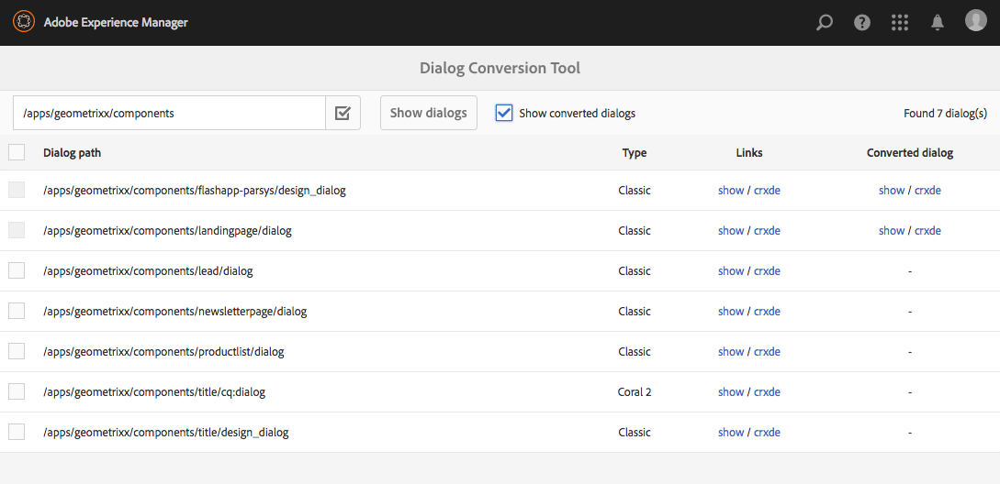

# Strumento di conversione finestra{#dialog-conversion-tool}

Lo strumento di conversione della finestra di dialogo consente di estendere i componenti esistenti che dispongono solo di una finestra di dialogo definita per l’interfaccia classica (in base a ExtJS) o in base all’interfaccia Granite e al Coral 2. Lo strumento utilizza la finestra di dialogo originale per creare una finestra di dialogo duplicata progettata per l’interfaccia standard, in base all’interfaccia Granite e al Corallo 3.

L&#39;obiettivo di questo strumento è automatizzare l&#39;aggiornamento per quanto possibile, aumentare l&#39;efficienza e ridurre gli errori. Tuttavia, poiché lo strumento non è in grado di coprire ogni scenario, il processo non può essere completamente automatizzato e l&#39;utente deve rivedere le finestre di dialogo convertite ed eventualmente apportare ulteriori modifiche. Lo strumento è inteso come aiuto per avviare il processo di conversione, ma non per prendere il controllo completo della conversione.

Lo strumento crea la nuova finestra di dialogo utilizzando l’interfaccia standard Granite e l’interfaccia utente basata su Coral 3, ma ignora ciò che non può convertire. Pertanto, la finestra di dialogo risultante potrebbe contenere nodi della finestra di dialogo originale copiati così com&#39;è, se nessuna regola corrispondeva a quel componente specifico. Inoltre, un componente convertito potrebbe avere alcune proprietà non convertite, perché non esisteva una regola appropriata per convertirle.

>[!CAUTION]
>
>Lo strumento non può coprire ogni scenario, in quanto le sue regole di conversione non sono esaustive e funzionano con il massimo sforzo. Converte gli elementi e le proprietà utilizzati più di frequente, ma la conversione sarà incompleta quando si tratta di personalizzazioni o dialoghi altamente specializzati. **Le finestre di dialogo convertite possono richiedere ulteriori aggiustamenti e tutte le conversioni devono essere riviste.**

>[!NOTE]
>
>Poiché l’interfaccia classica non è più sviluppata o migliorata,  Adobe consiglia agli utenti di passare all’interfaccia utente predefinita di Granite per beneficiare della tecnologia più avanzata.
>
>Anche se è generalmente buona prassi migrare alla piattaforma più recente, la migrazione da Coral 2 a Coral 3 non è fondamentale. Tuttavia, qualsiasi nuovo progetto dovrebbe essere avviato sulla base del Coral 3.

## Download e installazione dello strumento di conversione finestra di dialogo {#download-and-install-the-dialog-conversion-tool}

Lo strumento di conversione della finestra di dialogo è stato reso open source e può essere utilizzato tramite GitHub.

CODICE SU GITHUB

Puoi trovare il codice di questa pagina su GitHub

* [Apri progetto di conversione aem-dialog su GitHub](https://github.com/Adobe-Marketing-Cloud/aem-dialog-conversion)
* Scarica il progetto come [un file ZIP](https://github.com/Adobe-Marketing-Cloud/aem-dialog-conversion/archive/master.zip)

>[!NOTE]
>
>AEM non viene fornito con lo strumento di conversione finestra di dialogo. È necessario scaricarlo e installarlo per poterlo utilizzare.

Per installare lo strumento di conversione della finestra di dialogo, effettuate le seguenti operazioni.

1. Scaricate il pacchetto dal progetto [Dialog Conversion Tool GitHub project](https://github.com/Adobe-Marketing-Cloud/aem-dialog-conversion/releases).
1. Installate il pacchetto nell’istanza. Per informazioni dettagliate sulla gestione dei pacchetti, vedere [Come lavorare con i pacchetti](/help/sites-administering/package-manager.md).

## Conversione di una finestra di dialogo {#converting-a-dialog}

Lo strumento converte le finestre di dialogo creando una corrispondente finestra di dialogo Granite UI / Corallo 3 nella stessa posizione della finestra di dialogo originale nella struttura del contenuto. Nel caso delle finestre di dialogo Granite UI/Coral 2, queste vengono copiate in una posizione di backup (il suffisso `.coral2` viene aggiunto al nome del nodo di dialogo) per non essere ignorato. Lo strumento consente di convertire finestre di dialogo di progettazione e di modifica.

Per convertire una o più finestre di dialogo, effettuate le seguenti operazioni:

1. Aprire la console di conversione finestra di dialogo **accessibile da** Navigazione globale **->** Strumenti **->** Operazioni **:**

   `https://<hostname>:<port>/libs/cq/dialogconversion/content/console.html`

   

1. Immettere il percorso richiesto, ad esempio `/apps/geometrixx/components`. Potete anche inserire un percorso diretto a una singola finestra di dialogo, ad esempio `/apps/geometrixx/components/lead`.

   

1. Selezionare **Mostra finestre di dialogo** per visualizzare tutte le finestre di dialogo al di sotto di tale posizione.

   

   Nella tabella sono elencate tutte le finestre di dialogo precedenti esistenti sotto il percorso immesso. Ogni finestra di dialogo ha il relativo tipo elencato. I tipi includono:

   * **Classic:** nodi di tipo  `cq:Dialog` con nome nodo  `dialog` o  `design_dialog`
   * **Corallo 2:** Nodi denominati  `cq:dialog` o  `cq:design_dialog` con un tipo di risorsa Granite UI/Corallo 2 nel nodo di contenuto figlio

   Ogni riga contiene un collegamento per visualizzare la finestra di dialogo e un collegamento al CRXDE Lite per visualizzarne la struttura del nodo.

   >[!NOTE]
   >
   >Non sono elencati i componenti che non dispongono di alcuna finestra di dialogo per l’interfaccia classica o per il Corallo 2 (ovvero progettati con l’interfaccia Granite / Coral 3).

1. Selezionare una o più finestre di dialogo per la conversione e fare clic o toccare **Converti finestre di dialogo X** per avviare il processo di conversione.

   

1. Le finestre di dialogo selezionate sono elencate con i risultati delle conversioni. Se la conversione ha avuto esito positivo, la riga contiene collegamenti per visualizzare la finestra di dialogo convertita o per aprirla in CRXDE Lite.

   Tocca o fai clic su **Indietro** per tornare allo strumento di conversione finestra di dialogo.

   

1. Nello strumento di conversione finestra di dialogo, le finestre di dialogo convertite non vengono più visualizzate nell’elenco. Si noti tuttavia che il numero totale di finestre di dialogo trovate è ancora elencato, comprese quelle già convertite, ovvero il numero di righe nella tabella non corrisponde necessariamente a quello del numero trovato.

   

1. Selezionare l&#39;opzione **Mostra finestre di dialogo convertite** per visualizzare le finestre di dialogo che si trovano nel percorso specificato e che sono già state convertite.

   

   Se la finestra di dialogo è già stata convertita, vengono forniti anche i collegamenti alla finestra di dialogo convertita. Una finestra di dialogo viene considerata convertita se è già disponibile un&#39;interfaccia Granite di pari livello / Corallo 3.

## Regole di riscrittura finestra di dialogo {#dialog-rewrite-rules}

Lo strumento di conversione della finestra di dialogo si basa sul concetto di riscrittura del grafico **a**, consistente nella trasformazione di un grafico a oggetti mediante l&#39;applicazione di regole di riscrittura. Una regola di riscrittura è l&#39;accoppiamento di un pattern con un grafico di sostituzione. La regola corrisponde alle occorrenze di un determinato sottografico nel grafico dell&#39;oggetto e le sostituisce successivamente. Per informazioni dettagliate sulla riscrittura del grafico, vedere anche [https://en.wikipedia.org/wiki/Graph_rewriting](https://en.wikipedia.org/wiki/Graph_rewriting).

Lo strumento di conversione della finestra di dialogo utilizza questo approccio per riscrivere una determinata struttura di dialogo precedente (interfaccia classica o granita / Corallo 2) nell’interfaccia Granite / Corallo 3 corrispondente. Questo ha il vantaggio che la conversione è altamente flessibile e può prendere in considerazione anche componenti complessi, poiché la corrispondenza viene fatta su sottostrutture reali e non solo nodi o proprietà singoli.

### Algoritmo {#algorithm}

L&#39;algoritmo di riscrittura utilizza come parametro la struttura ad albero da riscrittare e un insieme di regole di riscrittura. Attraversa la struttura ad albero in pre-ordine e per ogni nodo verifica se è applicata una regola per la sottostruttura ad albero radicata in quel nodo. La prima regola che corrisponde viene applicata alla sottostruttura per riscriverla. Il traversal quindi si riavvia dalla radice. L&#39;algoritmo si arresta non appena l&#39;intero albero è stato attraversato e nessuna regola ha trovato corrispondenza in alcuna sottostruttura. Come misura di ottimizzazione, l&#39;algoritmo tiene traccia di un insieme di nodi che sono finali e quindi non devono essere ricontrollati per le corrispondenze nei successivi traversaggi. È compito delle regole di riscrittura definire quali nodi della struttura riscritta sono finali e quali dovrebbero essere rivisitati da passaggi futuri dell&#39;algoritmo.

Il punto di ingresso per la conversione è il `DialogConversionServlet`, che viene registrato sulle richieste POST a `/libs/cq/dialogconversion/content/convert.json`. Accetta un parametro di richiesta del percorso, ovvero un array contenente i percorsi delle finestre di dialogo da convertire. Per ogni finestra di dialogo, il servlet riscrive quindi la struttura di dialogo corrispondente applicando tutte le regole di riscrittura di finestra di dialogo definite.

### Riscrittura tipi di regole {#rewrite-rule-types}

Le regole di riscrittura possono essere definite in due modi diversi:

* Strutture nodo JCR - [Regole di riscrittura basate su nodo](/help/sites-developing/dialog-conversion.md#node-based-rewrite-rules)

* Classi Java che implementano un&#39;interfaccia specifica - [Regole di riscrittura basate su Java](/help/sites-developing/dialog-conversion.md#java-based-rewrite-rules)

Alcuni sono [forniti out-of-the-box](#provided-rewrite-rules), ma è anche possibile definire regole personalizzate. [Sono disponibili anche ](/help/sites-developing/dialog-conversion.md#sample-rewrite-rules) regole di riscrittura di esempio.

In genere, una singola regola di riscrittura finestra di dialogo è responsabile della riscrittura di un singolo elemento di dialogo, ad esempio il campo di immissione del browser percorso.

>[!CAUTION]
>
>I loop di riscrittura non vengono rilevati dall&#39;algoritmo, pertanto le **regole di riscrittura non devono riscrivere gli alberi in modo circolare**.

### Regole di riscrittura basate su nodo {#node-based-rewrite-rules}

Una regola di riscrittura finestra di dialogo può essere definita in termini di nodi e proprietà.

```xml
rule
  - jcr:primaryType = nt:unstructured
  - cq:rewriteRanking = 4
  + patterns
    - jcr:primaryType = nt:unstructured
    + foo
      - ...
      + ...
    + foo1
      - ...
      + ...
  + replacement
    + bar
      - ...
      + ...
```

In questo esempio viene definita una regola contenente due **pattern** (gli alberi radicati in `foo` e `foo1`) e una **sostituzione** (l&#39;albero radice in `bar`). Le strutture e gli alberi di sostituzione sono strutture arbitrarie contenenti nodi e proprietà. La regola corrisponde a una sottostruttura se uno dei pattern definiti corrisponde. Affinché un pattern corrisponda, la struttura ad albero dell&#39;oggetto deve contenere gli stessi nodi del pattern (nomi corrispondenti) e tutte le proprietà definite nel pattern devono corrispondere alle proprietà della struttura.

Nel caso di una corrispondenza, la sottostruttura associata (denominata albero originale) verrà sostituita dalla sostituzione. La struttura di sostituzione può definire proprietà mappate che erediteranno il valore di una proprietà nella struttura originale. Devono essere di tipo `String` e avere il formato seguente:

`${<path>}`

Se la proprietà di riferimento non esiste nella struttura originale, la proprietà viene omessa. In alternativa, è possibile specificare un valore predefinito per tale caso (solo per le proprietà stringa):

`${<path>:<default>}`

Le proprietà che contengono caratteri &#39; `:`&#39; possono essere virgolette singole per evitare conflitti con la fornitura di un valore predefinito. Le proprietà booleane vengono negate se l&#39;espressione ha il prefisso &quot; `!`&quot;. Le proprietà mappate possono essere multivalore, nel qual caso gli verrà assegnato il valore della prima proprietà esistente nella struttura ad albero corrispondente.

Ad esempio, alla seguente proprietà `one` verrà assegnato il valore della proprietà `./two/three` della struttura originale corrispondente.

```xml
...
  + replacement
    + bar
      - one = ${./two/three}
      - negated = !${./some/boolean/prop}
      - default = ${./some/prop:default}
      - multi = [${./prop1}, ${./prop2}]
```

Le regole supportano anche le seguenti proprietà facoltative.

* `cq:rewriteOptional` (booleano)

   Impostare questa proprietà su un nodo di pattern per indicare che il nodo non deve essere presente affinché il pattern corrisponda

* `cq:rewriteRanking` (numero intero)

   Impostate questa proprietà sul nodo della regola per influenzare l&#39;ordine in base al quale vengono applicate le regole. Ciò può essere utile per garantire che le regole che gestiscono strutture più specifiche non vengano sovrascritte da quelle più generali. Le regole con una classificazione inferiore hanno la precedenza su quelle con una classificazione superiore. Per impostazione predefinita, tutte le regole ricevono `Integer.MAX_VALUE` come classifica.

La struttura di sostituzione supporta anche le seguenti proprietà speciali (denominate a partire da `cq:rewrite`):

* `cq:rewriteMapChildren` (stringa)

   Il nodo contenente questa proprietà riceverà una copia degli elementi secondari del nodo nella struttura originale a cui fa riferimento il valore della proprietà (ad es. `cq:rewriteMapChildren=./items`).

* `cq:rewriteFinal` (booleano)

   Questa è una misura di ottimizzazione che indica all&#39;algoritmo che il nodo contenente questa proprietà è definitivo e non deve essere ricontrollato per cercare regole di riscrittura corrispondenti. Quando viene posizionato sul nodo di sostituzione stesso, l&#39;intero albero di sostituzione è considerato finale.
* `cq:rewriteCommonAttrs` (booleano)

   Impostate questa proprietà sul nodo di sostituzione ( `rule`/ `replacement`) per mappare le proprietà rilevanti del nodo principale originale sugli equivalenti di attributi comuni Granite nella radice della copia. Gestisce gli attributi dei dati copiando/creando il nodo secondario `granite:data` sulla destinazione e scrivendo le proprietà `data-*`.
* `cq:rewriteRenderCondition` (booleano)

   Impostate questa proprietà sul nodo di sostituzione ( `rule`/ `replacement`) per copiare qualsiasi condizione di rendering Granite ( `rendercondition` o `granite:rendercondition`) nodo secondario dal nodo principale originale a un nodo secondario `granite:rendercondition` della radice di copia.

Inoltre, un nodo `cq:rewriteProperties` può essere aggiunto a un nodo di sostituzione per definire le riscritture delle stringhe per le proprietà mappate nel risultato. Il nodo viene rimosso dalla sostituzione. Le proprietà del nodo `cq:rewriteProperties` devono essere denominate come quelle che stanno riscrivendo e accettano una matrice di stringhe con due parametri:

* `pattern`: Regex per la corrispondenza, ad esempio  `"(?:coral-Icon-)(.+)"`

* `replacement`: Fornita alla  `replaceAll` funzione matcher, ad esempio  `"$1"`

Di seguito è riportato un esempio di riscrittura delle proprietà dell&#39;icona Coral 2 negli equivalenti Coral 3:

```xml
...
  + replacement
    + bar
      - icon = ${./icon}
      + cq:rewriteProperties
       - icon = [(?:coral-Icon--)(.+), $1]
```

#### Definizione delle regole di riscrittura basate su nodo {#defining-your-own-node-based-rewrite-rules}

Le regole di riscrittura fornite sono definite in:

`/libs/cq/dialogconversion/rules`

Le regole sono ulteriormente divise in questa posizione in cartelle per le regole di riscrittura classiche e le regole di riscrittura Coral 2:

`/libs/cq/dialogconversion/rules/classic`

`/libs/cq/dialogconversion/rules/coral2`

Tali norme possono essere sovrascritte fornendo una serie di norme al seguente indirizzo:

`/apps/cq/dialogconversion/rules`

È possibile copiare `/libs/cq/dialogconversion/rules` in `/apps` e quindi modificare le regole esistenti e/o aggiungere nuove regole a questa nuova istanza &quot;.

### Regole di riscrittura basate su Java {#java-based-rewrite-rules}

Regole di riscrittura più complesse possono essere definite come classi Java che espongono un servizio OSGi dell&#39;interfaccia `com.adobe.cq.dialogconversion.DialogRewriteRule`.

Tale classe deve implementare i seguenti metodi:

```java
boolean matches(Node root) throws RepositoryException;
Node applyTo(Node root, Set<Node> finalNodes) throws DialogRewriteException, RepositoryException;
int getRanking();
```

Il metodo `matches` deve restituire `true` se la regola corrisponde alla struttura ad albero secondaria radicata nel nodo principale fornito. Se la regola corrisponde, l&#39;algoritmo di riscrittura della struttura chiamerà in seguito il metodo `applyTo`, che deve riscrivere la sottostruttura ad albero radicata nel nodo principale specificato. Solitamente, questo metodo rinominerà temporaneamente la struttura originale, genererà la nuova struttura come nuovo nodo secondario del nodo padre della struttura originale (utilizzando i relativi nodi e proprietà) e infine rimuoverà la struttura ad albero originale. Informazioni più dettagliate sono reperibili nel Javadoc dell&#39;interfaccia `com.adobe.cq.dialogconversion.DialogRewriteRule`.

#### Ulteriori informazioni - Javadocs {#further-information-javadocs}

Per ulteriori informazioni, vedere le Javadocs per [`com.adobe.cq.dialogconversion`](https://adobe-marketing-cloud.github.io/aem-touchui-dialogconversion-samples/javadoc/).

#### Definizione delle proprie regole di riscrittura basate su Java {#defining-your-own-java-based-rewrite-rules}

La classe seguente mostra un esempio di regola di riscrittura personalizzata che implementa l&#39;interfaccia `com.adobe.cq.dialogconversion.DialogRewriteRule`.

```java
@Component
@Service
public class CustomDialogRewriteRule implements DialogRewriteRule {

    public boolean matches(Node root) throws RepositoryException {
        // ...
    }

    public Node applyTo(Node root, Set<Node> finalNodes) throws DialogRewriteException, RepositoryException {
        // ...
    }

    int getRanking() {
        // ...
    }

}
```

In alternativa, è possibile estendere `com.adobe.cq.dialogconversion.AbstractDialogRewriteRule` come segue. La classe astratta implementa il metodo `getRanking` e utilizza la proprietà OSGi `service.ranking` del servizio per determinare la classificazione della regola.

```java
@Component
@Service
@Properties({
        @Property(name="service.ranking", intValue = 10)
})
public class CustomDialogRewriteRule extends AbstractDialogRewriteRule {

    public boolean matches(Node root) throws RepositoryException {
        // ...
    }

    public Node applyTo(Node root, Set<Node> finalNodes) throws RewriteException, RepositoryException {
        // ...
    }

}
```

### Regole di riscrittura fornite {#provided-rewrite-rules}

Il pacchetto `cq-dialog-conversion-content` contiene diverse regole di riscrittura predefinite. Per i widget dell&#39;interfaccia classica, consultate [Utilizzo di xtype](/help/sites-developing/xtypes.md) per ulteriori informazioni).

<table>
 <tbody>
  <tr>
   <td><strong>Regola</strong></td>
   <td><strong>Componente legacy</strong></td>
   <td><strong>Interfaccia utente Granite / Sostituzione Corallo 3</strong></td>
  </tr>
  <tr>
   <td><code>com.adobe.cq.dialogconversion.rules.CqDialogRewriteRule</code></td>
   <td>Nodo di tipo <code>cq:Dialog</code>, gestisce sottostrutture diverse</td>
   <td><p>A <code>granite/ui/components/foundation/container</code> utilizzando un layout <code>fixedcolumns</code> o <code>tabs</code></p> <p>I componenti effettivi della finestra di dialogo vengono copiati e riscritti in passaggi successivi dell’algoritmo.</p> </td>
  </tr>
  <tr>
   <td><code>com.adobe.cq.dialogconversion.rules.IncludeRule</code></td>
   <td>xtype = <code>cqinclude</code></td>
   <td>Il nodo a cui si fa riferimento viene copiato nella finestra di dialogo Granite UI / Corallo 3 e (eventualmente) riscritto dall'algoritmo.</td>
  </tr>
  <tr>
   <td><code>com.adobe.cq.dialogconversion.rules.MultifieldRewriteRule</code></td>
   <td>xtype = <code>multifield</code></td>
   <td><p>A <code>granite/ui/components/coral/foundation/form/multifield</code></p> <p>Il nodo secondario <code>fieldConfig</code> (se presente) viene riscritto separatamente, senza limitare i componenti supportati.</p> </td>
  </tr>
  <tr>
   <td><code>/libs/cq/dialogconversion/rules/classic</code></td>
   <td><code class="code">button
      checkbox
      colorfield
      combobox
      componentselector
      datetime
      fieldset
      fileupload
      hidden
      numberfield
      panel
      password
      pathfield
      radio
      radiogroup
      select
      sizefield
      tabpanel
      tags
      textarea
      textfield</code></td>
   <td> </td>
  </tr>
  <tr>
   <td><code>/libs/cq/dialogconversion/rules/coral2</code></td>
   <td><code class="code">actionfield
      autocomplete
      button
      checkbox
      collapsible
      colorpicker
      container
      datepicker
      fieldset
      fileupload
      fixedcolumns
      heading
      hidden
      hyperlink
      include
      multifield
      nestedcheckboxlist
      nestedcheckboxlist-checkbox
      numberfield
      password
      pathbrowser
      radio
      radiogroup
      reset
      select
      submit
      switch
      tabs
      tags
      text
      textarea
      textfield
      userpicker
      well</code></td>
   <td> </td>
  </tr>
 </tbody>
</table>

### Regole di riscrittura di esempio {#sample-rewrite-rules}

CODICE SU GITHUB

Puoi trovare il codice di questa pagina su GitHub

* [Open aem-touch-dialogconversion-samples project on GitHub](https://github.com/Adobe-Marketing-Cloud/aem-touchui-dialogconversion-samples)
* Scarica il progetto come [un file ZIP](https://github.com/Adobe-Marketing-Cloud/aem-touchui-dialogconversion-samples/archive/master.zip)

