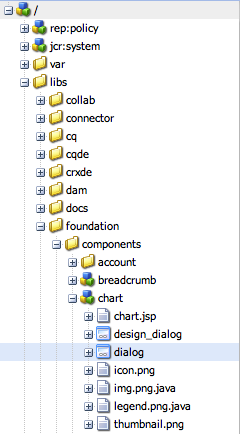

# Editor finestre di dialogo{#dialog-editor}

L’editor basato su finestra di dialogo fornisce un’interfaccia grafica per creare e modificare facilmente finestre di dialogo e pagine di scaffolding.

Per vedere come funziona, vai su CRXDE Lite, apri l&#39;albero dell&#39;esploratore in `/libs/foundation/components/chart` e fai doppio clic sul nodo `dialog`:

Il nodo di dialogo si aprirà nel **editor di dialogo**:

## Panoramica dell’interfaccia utente {#user-interface-overview}

L’interfaccia dell’editor basato su finestra di dialogo è composta da quattro riquadri:

* La **palette** nell&#39;angolo in alto a sinistra. Questo riquadro contiene i widget disponibili per la creazione di una finestra di dialogo, ad esempio pannelli a schede, campi di testo, elenchi di selezione e pulsanti. Per espandere le diverse categorie all’interno della palette, fai clic sulla barra di divisione desiderata.
* La **struttura** nell&#39;angolo in basso a sinistra. Questo riquadro mostra la struttura gerarchica dei nodi che compongono la definizione della finestra di dialogo. È possibile visualizzare la stessa struttura espandendo il nodo di dialogo in CRXDE Lite o CRX Content Explorer.
* La **rendering** al centro della finestra. Questo riquadro mostra come verrà eseguito il rendering della definizione della finestra di dialogo definita nel riquadro struttura come finestra di dialogo effettiva.
* La **proprietà** riquadro. Questo riquadro mostra le proprietà del nodo attualmente evidenziato nel riquadro struttura.

### Utilizzo dell’Editor finestre di dialogo {#using-the-dialog-editor}

Per creare una finestra di dialogo, l’utente trascina e rilascia gli elementi dalla palette al riquadro struttura in posizione all’interno della gerarchia di definizione della finestra di dialogo.

Una volta completata la struttura desiderata, l&#39;utente fa clic su **Salva**, nella parte superiore del riquadro di rendering.

>[!CAUTION]
>
>L’editor basato su finestra di dialogo è destinato alla creazione di finestre di dialogo relativamente semplici e potrebbe non essere in grado di modificare definizioni di dialogo più complesse. Nei casi in cui l’editor delle finestre di dialogo non consente la modifica di una struttura di dialogo, la definizione della finestra di dialogo deve essere creata e/o modificata manualmente modificando direttamente la struttura del nodo utilizzando, ad esempio, CRXDE Lite o CRX Content Explorer.

### Creazione di una nuova finestra di dialogo {#creating-a-new-dialog}

Per creare una nuova finestra di dialogo per selezionare il componente richiesto, fai clic su **Crea...** e poi **Crea finestra di dialogo..**.

Inserisci i dettagli richiesti e fai clic su **Salva tutto** - ora puoi fare doppio clic sulla finestra di dialogo per aprirla con l’editor.

### Utilizzo dell’Editor finestra di dialogo per le pagine di scaffolding {#using-the-dialog-editor-for-scaffolds}

Una pagina di scaffolding è una pagina speciale contenente un modulo che può essere compilato e inviato in un unico passaggio. Questo consente di creare rapidamente una pagina utilizzando il contenuto inserito.

Il modulo che costituisce una pagina di scaffolding è definito da una definizione di finestra di dialogo, come una finestra di dialogo normale, anche se viene visualizzato nella pagina di scaffolding in un formato diverso. Poiché le definizioni delle finestre di dialogo vengono utilizzate per definire le impalcature, le impalcature possono essere progettate utilizzando l’editor basato su finestra di dialogo. Tieni presente che quando utilizzi l’editor basato su finestra di dialogo in questo modo, il riquadro di rendering visualizza comunque la definizione della finestra di dialogo sotto forma di una finestra di dialogo non come una pagina di scaffolding.

Vedi [Scaffolding](/help/sites-authoring/scaffolding.md) per ulteriori informazioni sull’utilizzo dell’editor basato su finestra di dialogo per creare le impalcature.
