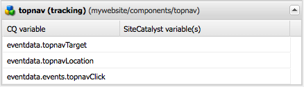

# Aggiunta del tracciamento di Adobe Analytics ai componenti{#adding-adobe-analytics-tracking-to-components}

## Inclusione del modulo Adobe Analytics in un componente Pagina {#including-the-adobe-analytics-module-in-a-page-component}

I componenti del modello di pagina (ad esempio, `head.jsp, body.jsp`) devono essere inclusi in JSP per caricare ContextHub e l&#39;integrazione Adobe Analytics (che fa parte di Cloud Service). Tutto include il caricamento di file JavaScript.

La voce ContextHub deve essere inclusa immediatamente sotto il tag `<head>`, mentre i Cloud Service devono essere inclusi nella sezione `<head>` e prima della sezione `</body>`; ad esempio:

```xml
<head>
   <sling:include path="contexthub" resourceType="granite/contexthub/components/contexthub" />
...
   <cq:include script="/libs/cq/cloudserviceconfigs/components/servicelibs/servicelibs.jsp"/>
...
</head>
<body>
...
    <cq:include path="cloudservices" resourceType="cq/cloudserviceconfigs/components/servicecomponents"/>
</body>
```

Lo script `contexthub` inserito dopo l&#39;elemento `<head>` aggiunge le funzionalità ContextHub alla pagina.

Gli script `cloudservices` aggiunti nelle sezioni `<head>` e `<body>` si applicano alle configurazioni dei servizi cloud aggiunti alla pagina. (Se la pagina utilizza più di una configurazione di Cloud Service, devi includere ContextHub jsp e Cloud Service jsp una sola volta.)

Quando un framework Adobe Analytics viene aggiunto alla pagina, gli script `cloudservices` generano JavaScript correlati ad Adobe Analytics e riferimenti a librerie lato client, in modo simile all&#39;esempio seguente:

```xml
<div class="sitecatalyst cloudservice">
<script type="text/javascript" src="/etc/clientlibs/foundation/sitecatalyst/sitecatalyst.js"></script>
<script type="text/javascript" src="/etc/clientlibs/foundation/sitecatalyst/util.js"></script>
<script type="text/javascript" src="/content/geometrixx-outdoors/_jcr_content/analytics.sitecatalyst.js"></script>
<script type="text/javascript" src="/etc/clientlibs/mac/mac-sc.js"></script>
<script type="text/javascript" src="/etc/clientlibs/foundation/sitecatalyst/plugins.js"></script>
<script type="text/javascript">
<!--
CQ_Analytics.Sitecatalyst.frameworkComponents = ['foundation/components/page'];
/**
 * Sets Adobe Analytics variables accordingly to mapped components. If <code>options</code>
 * object is provided only variables matching the options.componentPath are set.
 *
 * @param {Object} options Parameter object from CQ_Analytics.record() call. Optional.
 */
CQ_Analytics.Sitecatalyst.updateEvars = function(options) {
    this.frameworkMappings = [];
 this.frameworkMappings.push({scVar:"pageName",cqVar:"pagedata.title",resourceType:"foundation/components/page"});
    for (var i=0; i<this.frameworkMappings.length; i++){
  var m = this.frameworkMappings[i];
  if (!options || options.compatibility || (options.componentPath == m.resourceType)) {
   CQ_Analytics.Sitecatalyst.setEvar(m);
  }
    }
}

CQ_Analytics.CCM.addListener("storesinitialize", function(e) {
 var collect = true;
    var lte = s.linkTrackEvents;
    s.pageName="content:geometrixx-outdoors:en";
    CQ_Analytics.Sitecatalyst.collect(collect);
    if (collect) {
  CQ_Analytics.Sitecatalyst.updateEvars();
     /************* DO NOT ALTER ANYTHING BELOW THIS LINE ! **************/
     var s_code=s.t();if(s_code)document.write(s_code);
     s.linkTrackEvents = lte;
     if(s.linkTrackVars.indexOf('events')==-1){delete s.events};
     $CQ(document).trigger("sitecatalystAfterCollect");
    }
});
//-->
</script>
<script type="text/javascript">
<!--
if(navigator.appVersion.indexOf('MSIE')>=0)document.write(unescape('%3C')+'\!-'+'-')
//-->
</script>
<noscript></noscript>
<span data-tracking="{event:'pageView', values:{}, componentPath:'foundation/components/page'}"></span>
<div id="cq-analytics-texthint" style="background:white; padding:0 10px; display:none;">
 <h3 class="cq-texthint-placeholder">Component clientcontext is missing or misplaced.</h3>
</div>
<script type="text/javascript">
$CQ(function(){
 if( CQ_Analytics &&
  CQ_Analytics.ClientContextMgr &&
  !CQ_Analytics.ClientContextMgr.isConfigLoaded )
  {
   $CQ("#cq-analytics-texthint").show();
  }
});
</script>
</div>
```

Questo codice è incluso in tutti i siti di esempio per l’AEM, ad esempio i Geometrixx Outdoors.

### L&#39;evento sitecatalystAfterCollect {#the-sitecatalystaftercollect-event}

Lo script `cloudservices` attiva l&#39;evento `sitecatalystAfterCollect`:

```
$CQ(document).trigger("sitecatalystAfterCollect");
```

Questo evento viene attivato per indicare che il tracciamento della pagina è stato completato. Se in questa pagina vengono eseguite operazioni di tracciamento aggiuntive, è necessario ascoltare questo evento anziché l&#39;evento di caricamento del documento o l&#39;evento di preparazione del documento. L&#39;utilizzo dell&#39;evento `sitecatalystAfterCollect` evita conflitti o altri comportamenti imprevedibili.

>[!NOTE]
>
>La libreria `/libs/cq/analytics/clientlibs/sitecatalyst/sitecatalyst.js` include il codice del file Adobe Analytics `s_code.js`.

## Implementazione del tracciamento di Adobe Analytics per i componenti personalizzati {#implementing-adobe-analytics-tracking-for-custom-components}

Abilita i componenti AEM a interagire con il framework Adobe Analytics. Quindi, configura il framework in modo che Adobe Analytics tenga traccia dei dati del componente.

I componenti che interagiscono con il framework di Adobe Analytics vengono visualizzati nel Sidekick quando si modifica un framework. Dopo aver trascinato il componente nel framework, vengono visualizzate le relative proprietà e puoi mapparle con le proprietà di Adobe Analytics. (Vedi [Impostazione di un framework per il tracciamento di base](/help/sites-administering/adobeanalytics-connect.md#creating-a-adobe-analytics-framework).)

I componenti possono interagire con il framework di Adobe Analytics quando il componente ha un nodo figlio denominato `analytics`. Il nodo `analytics` ha le seguenti proprietà:

* `cq:trackevents`: identifica gli eventi CQ esposti dal componente. Consulta Eventi personalizzati.
* `cq:trackvars`: assegna un nome alle variabili CQ mappate con le proprietà Adobe Analytics.
* `cq:componentName`: nome del componente visualizzato nel Sidekick.
* `cq:componentGroup`: il Sidekick che include il componente.

Il codice nel componente JSP aggiunge il JavaScript alla pagina che attiva il tracciamento e definisce i dati tracciati. Il nome dell&#39;evento e i nomi dei dati utilizzati in JavaScript devono corrispondere ai valori corrispondenti delle proprietà del nodo `analytics`.

* Utilizza l’attributo di tracciamento dei dati per tenere traccia dei dati dell’evento al caricamento di una pagina. (Vedi [Tracciamento degli eventi personalizzati al caricamento della pagina](/help/sites-developing/extending-analytics.md#tracking-custom-events-on-page-load).)
* Utilizza la funzione CQ_Analytics.record per tenere traccia dei dati evento quando gli utenti interagiscono con le funzioni della pagina. (Vedi [Tracciamento Degli Eventi Personalizzati Dopo Il Caricamento Della Pagina](/help/sites-developing/extending-analytics.md#tracking-custom-events-after-page-load).)

Quando utilizzi questi metodi di tracciamento dei dati, il modulo di integrazione di Adobe Analytics esegue automaticamente le chiamate ad Adobe Analytics per registrare gli eventi e i dati.

### Esempio: tracciamento dei clic di navigazione principali {#example-tracking-topnav-clicks}

Estendi il componente base per la navigazione in modo che Adobe Analytics tenga traccia dei clic sui collegamenti di navigazione nella parte superiore della pagina. Quando si fa clic su un collegamento di navigazione, Adobe Analytics registra il collegamento su cui è stato fatto clic e la pagina in cui è stato fatto clic.

Per le procedure seguenti è necessario aver già eseguito le attività seguenti:

* Creazione di un&#39;applicazione CQ.
* Creazione di una configurazione Adobe Analytics e di un framework Adobe Analytics.

#### Copiare il componente topnav {#copy-the-topnav-component}

Copia il componente topnav nell’applicazione CQ. La procedura richiede che l’applicazione sia configurata in CRXDE Lite.

1. Fare clic con il pulsante destro del mouse sul nodo `/libs/foundation/components/topnav` e scegliere Copia.
1. Fare clic con il pulsante destro del mouse sulla cartella Componenti sotto la cartella dell&#39;applicazione e scegliere Incolla.
1. Fai clic su Salva tutto.

#### Integrazione Di Topnav Con Il Framework Adobe Analytics {#integrating-topnav-with-the-adobe-analytics-framework}

Configura il componente topnav e modifica il file JSP per definire gli eventi e i dati di tracciamento.

1. Fai clic con il pulsante destro del mouse sul nodo topnav e scegli Crea > Crea nodo. Specificare i valori delle proprietà seguenti, quindi fare clic su OK:

   * Nome: `analytics`
   * Tipo: `nt:unstructured`

1. Aggiungi la seguente proprietà al nodo di Analytics in modo da poter denominare l’evento di tracciamento:

   * Nome: cq:trackevents
   * Tipo: String
   * Valore: topnavClick

1. Aggiungi la seguente proprietà al nodo di Analytics in modo da poter denominare le variabili di dati:

   * Nome: cq:trackvars
   * Tipo: String
   * Valore: topnavTarget,topnavLocation

1. Aggiungi la seguente proprietà al nodo Analytics per denominare il componente per il Sidekick:

   * Nome: cq:componentName
   * Tipo: String
   * Valore: topnav (tracciamento)

1. Aggiungi la seguente proprietà al nodo Analytics per denominare il gruppo di componenti per il Sidekick:

   * Nome: cq:componentGroup
   * Tipo: String
   * Valore: Generale

1. Fai clic su Salva tutto.
1. Aprire il file `topnav.jsp`.
1. Nell&#39;elemento, aggiungi il seguente attributo:

   ```xml
   onclick = "tracknav('<%= child.getPath() %>.html')"
   ```

1. Nella parte inferiore della pagina, aggiungi il seguente codice JavaScript:

   ```xml
   <script type="text/javascript">
       function tracknav(target) {
               if (CQ_Analytics.Sitecatalyst) {
                   CQ_Analytics.record({
                       event: 'topnavClick',
                       values: {
                           topnavTarget: target,
                           topnavLocation:'<%=currentPage.getPath() %>.html'
                       },
                       componentPath: '<%=resource.getResourceType()%>'
                   });
               }
       }
   </script>
   ```

1. Fai clic su Salva tutto.

Il contenuto del file `topnav.jsp` deve essere visualizzato come segue:

```xml
<%@page session="false"%><%--
  Copyright 1997-2008 Day Management AG
  Barfuesserplatz 6, 4001 Basel, Switzerland
  All Rights Reserved.

  This software is the confidential and proprietary information of
  Day Management AG ("Confidential Information"). You shall not
  disclose such Confidential Information and shall use it only in
  accordance with the terms of the license agreement you entered into
  with Day.

  ==============================================================================

  Top Navigation component

  Draws the top navigation

--%><%@include file="/libs/foundation/global.jsp"%><%
%><%@ page import="java.util.Iterator,
        com.day.text.Text,
        com.day.cq.wcm.api.PageFilter,
        com.day.cq.wcm.api.Page,
        com.day.cq.commons.Doctype,
        org.apache.commons.lang3.StringEscapeUtils" %><%

    // get starting point of navigation
    long absParent = currentStyle.get("absParent", 2L);
    String navstart = Text.getAbsoluteParent(currentPage.getPath(), (int) absParent);

    //if not deep enough take current node
    if (navstart.equals("")) navstart=currentPage.getPath();

    Resource rootRes = slingRequest.getResourceResolver().getResource(navstart);
    Page rootPage = rootRes == null ? null : rootRes.adaptTo(Page.class);
    String xs = Doctype.isXHTML(request) ? "/" : "";
    if (rootPage != null) {
        Iterator<Page> children = rootPage.listChildren(new PageFilter(request));
        while (children.hasNext()) {
            Page child = children.next();
            %><a onclick = "tracknav('<%= child.getPath() %>.html')"  href="<%= child.getPath() %>.html"><%
            %>" src="<%= child.getPath() %>.navimage.png"<%= xs %>></a><%
        }
    }
%><script type="text/javascript">
    function tracknav(target) {
            if (CQ_Analytics.Sitecatalyst) {
                CQ_Analytics.record({
                    event: 'topnavClick',
                    values: {
                        topnavTarget:target,
                        topnavLocation:'<%=currentPage.getPath() %>.html'
                    },
                    componentPath: '<%=resource.getResourceType()%>'
                });
            }
    }
</script>
```

>[!NOTE]
>
>Spesso è auspicabile tenere traccia dei dati da ContextHub. Per informazioni sull&#39;utilizzo di JavaScript per ottenere queste informazioni, vedere [Accesso ai valori in ContextHub](/help/sites-developing/extending-analytics.md#accessing-values-in-the-contexthub).

#### Aggiunta del componente Tracciamento al Sidekick {#adding-the-tracking-component-to-sidekick}

Aggiungi al Sidekick i componenti abilitati per il tracciamento con Adobe Analytics in modo da poterli aggiungere al framework.

1. Apri il framework di Adobe Analytics dalla configurazione di Adobe Analytics. ([http://localhost:4502/etc/cloudservices/sitecatalyst.html](http://localhost:4502/etc/cloudservices/sitecatalyst.html))
1. In Sidekick, fare clic sul pulsante Progettazione.

   

1. Nell’area Configurazione tracciamento collegamenti, fai clic su Configura ereditarietà.

   

1. Nell’elenco Componenti consentiti, seleziona topnav (tracciamento) nella sezione Generale, quindi fai clic su OK.
1. Espandere Sidekick per passare alla modalità di modifica. Il componente è ora disponibile nel gruppo Generale.

#### Aggiunta del componente topnav al framework {#adding-the-topnav-component-to-your-framework}

Trascina il componente topnav nel framework Adobe Analytics e mappa le variabili componente e gli eventi sulle variabili Adobe Analytics e sugli eventi. (Vedi [Impostazione di un framework per il tracciamento di base](/help/sites-administering/adobeanalytics-connect.md).)



Il componente topnav è ora integrato con il framework Adobe Analytics. Quando aggiungi il componente a una pagina, facendo clic sugli elementi nella barra di navigazione superiore, i dati di tracciamento vengono inviati ad Adobe Analytics.

### Invio di dati s.products ad Adobe Analytics {#sending-s-products-data-to-adobe-analytics}

I componenti possono generare dati per la variabile s.products inviata ad Adobe Analytics. Progetta i componenti per contribuire alla variabile s.products:

* Registra un valore denominato `product` di una struttura specifica.
* Esporre i membri dati del valore `product` in modo che possano essere mappati con le variabili Adobe Analytics nel framework Adobe Analytics.

La variabile s.products di Adobe Analytics utilizza la sintassi seguente:

```
s.products="category;product;quantity;price;eventY={value}|eventZ={value};evarA={value}|evarB={value}"
```

Il modulo di integrazione di Adobe Analytics costruisce la variabile `s.products` utilizzando i valori `product` generati dai componenti AEM. Il valore `product` nel JavaScript generato dai componenti AEM è un array di valori con la seguente struttura:

```
"product": [{
    "category": "",
    "sku"     : "path to product node",
    "quantity": quantity,
    "price"   : price,
    "events   : {
      "eventName1": "eventValue1",
      "eventName_n": "eventValue_n"
    }
    "evars"   : {
      "eVarName1": "eVarValue1",
      "eVarName_n": "eVarValue_n"
    }
}]
```

Quando un elemento dati viene omesso dal valore `product`, viene inviato come stringa vuota in s.products.

>[!NOTE]
>
>Quando nessun evento è associato a un valore di prodotto, Adobe Analytics utilizza l&#39;evento `prodView` per impostazione predefinita.

Il nodo `analytics` del componente deve esporre i nomi delle variabili utilizzando la proprietà `cq:trackvars`:

* product.category
* product.sku
* product.quantity
* product.price
* product.events.eventName1
* product.events.eventName_n
* product.evars.eVarName1
* product.evars.eVarName_n

Il modulo eCommerce fornisce diversi componenti che generano dati di variabili s.products. Il componente `submitorder` ([http://localhost:4502/crx/de/index.jsp#/libs/commerce/components/submitorder/submitorder.jsp](http://localhost:4502/crx/de/index.jsp#/libs/commerce/components/submitorder/submitorder.jsp)), ad esempio, genera JavaScript simile al seguente esempio:

```
<script type="text/javascript">
    function trackCartPurchase() {
        if (CQ_Analytics.Sitecatalyst) {
            CQ_Analytics.record({
                "event": ["productsCartPurchase"],
                "values": {
                    "product": [
                        {
                            "category": "",
                            "sku"     : "/path/to/prod/1",
                            "quantity": 3,
                            "price"   : 179.7,
                            "evars"   : {
                                "childSku": "/path/to/prod/1/green/xs",
                                "size"    : "XS"
                            }
                        },
                        {
                            "category": "",
                            "sku"     : "/path/to/prod/2",
                            "quantity": 10,
                            "price"   : 150,
                            "evars"   : {
                                "childSku": "/path/to/prod/2",
                                "size"    : ""
                            }
                        },
                        {
                            "category": "",
                            "sku"     : "/path/to/prod/3",
                            "quantity": 2,
                            "price"   : 102,
                            "evars"   : {
                                "childSku": "/path/to/prod/3/m",
                                "size"    : "M"
                            }
                        }
                    ]
                },
                "componentPath": "commerce/components/submitorder"
            });
            CQ_Analytics.record({
                "event": ["discountRedemption"],
                "values": {
                    "discount": "/path/to/discount/1 - /path/to/discount/2",
                    "product" : [{
                        "category": "",
                        "sku"     : "Promotional Discount",
                        "events"  : {"discountRedemption": 20.00}
                    }]
                },
                "componentPath": "commerce/components/submitorder"
            });
            CQ_Analytics.record({
                "event": ["cartPurchase"],
                "values": {
                    "orderId"       : "00e40e2d-13a2-4a00-a8ee-01a9ebb0bf68",
                    "shippingMethod": "overnight",
                    "paymentMethod" : "Amex",
                    "billingState"  : "NY",
                    "billingZip"    : "10458",
                    "product"       : [{"category": "", "sku": "", "quantity": "", "price": ""}]
                },
                "componentPath": "commerce/components/submitorder"
            });
        }
        return true;
    }
</script>
```

#### Limitare la dimensione delle chiamate di tracciamento {#limiting-the-size-of-tracking-calls}

In genere, i browser web limitano la dimensione delle richieste di GET. Poiché i valori di prodotto CQ e SKU sono percorsi di archivio, gli array di prodotti che includono più valori possono superare il limite di dimensioni della richiesta. Pertanto, i componenti devono limitare il numero di elementi nell&#39;array `product` di ogni `CQ_Analytics.record function`. Crea più funzioni se il numero di elementi da monitorare può superare il limite.

Ad esempio, il componente eCommerce `submitorder` limita a quattro il numero di `product` elementi in una chiamata. Quando il carrello contiene più di quattro prodotti, genera più funzioni `CQ_Analytics.record`.
