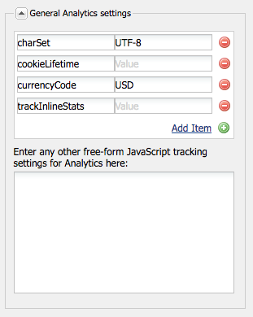

# Personalizzazione del framework Adobe Analytics{#customizing-the-adobe-analytics-framework}

Il framework Adobe Analytics determina le informazioni tracciate con Adobe Analytics. Per personalizzare il framework predefinito, utilizza javascript per aggiungere il tracciamento personalizzato, integrare i plug-in Adobe Analytics e modificare le impostazioni generali nel framework utilizzato per il tracciamento.

## Informazioni su JavaScript generato per i framework {#about-the-generated-javascript-for-frameworks}

Quando una pagina è associata a un framework Adobe Analytics e la pagina include [riferimenti al modulo Analytics](/help/sites-administering/adobeanalytics.md), per la pagina viene generato automaticamente un file analytics.sitecatalyst.js .

Il codice JavaScript nella pagina crea un `s_gi`oggetto (definito dalla libreria Adobe Analytics s_code.js) e assegna valori alle relative proprietà. Il nome dell’istanza dell’oggetto è `s`. Gli esempi di codice presentati in questa sezione fanno diversi riferimenti a questo `s` variabile.

Il codice di esempio seguente è simile al codice presente in un file analytics.sitecatalyst.js :

```
var s_account = "my_sitecatalyst_account";
var s = s_gi(s_account);
s.fpCookieDomainPeriods = "3";
s.currencyCode= 'USD';
s.trackInlineStats= true;
s.linkTrackVars= 'None';
s.charSet= 'UTF-8';
s.linkLeaveQueryString= false;
s.linkExternalFilters= '';
s.linkTrackEvents= 'None';
s.trackExternalLinks= true;
s.linkDownloadFileTypes= 'exe,zip,wav,mp3,mov,mpg,avi,wmv,doc,pdf,xls';
s.linkInternalFilters= 'javascript:,'+window.location.hostname;
s.trackDownloadLinks= true;

s.visitorNamespace = "mynamespace";
s.trackingServer = "xxxxxxx.net";
s.trackingServerSecure = "xxxxxxx.net";

/* Plugin Config */
/*
s.usePlugins=false;
function s_doPlugins(s) {
    //add your custom plugin code here
}
s.doPlugins=s_doPlugins;
*/
```

Quando si utilizza un codice javascript personalizzato per personalizzare il framework, si modifica il contenuto di questo file.

## Configurazione delle proprietà di Adobe Analytics {#configuring-adobe-analytics-properties}

All’interno di Adobe Analytics sono disponibili una serie di variabili predefinite configurabili su un framework. La **charset**, **cookieLifetime**, **currencyCode** e **trackInlineStats** sono incluse nella variabile **Impostazioni generali di Analytics** per impostazione predefinita.


È possibile aggiungere all’elenco i nomi e i valori delle variabili. Queste variabili predefinite e tutte le variabili aggiunte vengono utilizzate per configurare le proprietà di `s` nel file analytics.sitecatalyst.js . L’esempio seguente mostra come è stato aggiunto `prop10` proprietà del valore `CONSTANT` è rappresentato nel codice javascript:

```
var s_account = "my_sitecatalyst_account";
var s = s_gi(s_account);
s.fpCookieDomainPeriods = "3";
s.currencyCode= 'USD';
s.trackInlineStats= true;
s.linkTrackVars= 'None';
s.charSet= 'UTF-8';
s.linkLeaveQueryString= false;
s.linkExternalFilters= '';
s.linkTrackEvents= 'None';
s.trackExternalLinks= true;
s.linkDownloadFileTypes= 'exe,zip,wav,mp3,mov,mpg,avi,wmv,doc,pdf,xls';
s.prop10= 'CONSTANT';
s.linkInternalFilters= 'javascript:,'+window.location.hostname;
s.trackDownloadLinks= true;

s.visitorNamespace = "mynamespace";
s.trackingServer = "xxxxxxx.net";
s.trackingServerSecure = "xxxxxxx.net";
```

Per aggiungere variabili all’elenco, attenersi alla procedura descritta di seguito.

1. Nella pagina del framework Adobe Analytics, espandi la **Impostazioni generali di Analytics** area.
1. Sotto l’elenco delle variabili, fai clic su Aggiungi elemento per aggiungere una nuova variabile all’elenco.
1. Nella cella a sinistra, immetti un nome per la variabile, ad esempio `prop10`.

1. Nella colonna di destra, immetti un valore per la variabile, ad esempio `CONSTANT`.

1. Per rimuovere una variabile, fai clic sul pulsante (-) accanto a essa.

>[!NOTE]
>
>Quando immetti variabili e valori, accertati che siano formattati e digitati correttamente o **le chiamate non verranno inviate** con la coppia corretta valore/variabile. Le variabili e i valori errati possono anche impedire il verificarsi di chiamate.
>
>Per accertarti che queste variabili siano impostate correttamente, rivolgiti al tuo rappresentante Adobe Analytics.

>[!CAUTION]
>
>Alcune delle variabili in questo elenco sono **obbligatorio** affinché le chiamate Adobe Analytics funzionino correttamente (ad es. **currencyCode**, **charSet**)
>
>Quindi, anche se vengono rimossi dal framework stesso, saranno comunque associati con un valore predefinito quando viene effettuata la chiamata Adobe Analytics.

### Aggiunta di JavaScript personalizzati a un framework Adobe Analytics {#adding-custom-javascript-to-an-adobe-analytics-framework}

La casella javascript gratuita in **Impostazioni generali di Analytics** Area consente di aggiungere codice personalizzato a un framework Adobe Analytics.



Il codice che aggiungi viene aggiunto al file analytics.sitecatalyst.js . Pertanto, puoi accedere al `s` , che è un&#39;istanza della variabile `s_gi` oggetto javascript definito in `s_code.js`. Ad esempio, l&#39;aggiunta del codice seguente equivale all&#39;aggiunta di una variabile denominata `prop10` del valore `CONSTANT`, come illustrato nella sezione precedente:

`s.prop10= 'CONSTANT';`

Il codice nel [analytics.sitecatalyst.js](/help/sites-developing/extending-analytics-components.md) (che include il contenuto di Adobe Analytics) `s-code.js` file) contiene il seguente codice:

`if (s.usePlugins) s.doPlugins(s)`

La procedura seguente illustra come utilizzare la casella javascript per personalizzare il tracciamento di Adobe Analytics. Se il tuo JavaScript deve utilizzare i plug-in Adobe Analytics, [integrarli](/help/sites-administering/adobeanalytics.md) in AEM.

1. Aggiungi il seguente codice JavaScript alla casella in modo che `s.doPlugins` viene eseguito:

   ```
   s.usePlugins=true;
   function s_doPlugins(s) {
       //add your custom code here
   }
   s.doPlugins=s_doPlugins;
   ```

   >[!CAUTION]
   >
   >Questo codice è necessario se desideri inviare variabili in una chiamata Adobe Analytics che sono state personalizzate in un modo che non può essere fatto tramite l’interfaccia di trascinamento&amp;rilascio di base O attraverso javascript in linea in Adobe Analytics View.
   >
   >Se le variabili personalizzate si trovano al di fuori della funzione s_doPlugins, verranno inviate come *non definito *nella chiamata Adobe Analytics

1. Aggiungi il codice javascript nel **s_doPlugins** funzione .

L&#39;esempio seguente concatena i dati acquisiti su una pagina in ordine gerarchico, utilizzando un separatore comune di &quot;|&quot;.

Un framework Adobe Analytics dispone delle seguenti configurazioni:

* La `prop2` La variabile Adobe Analytics è mappata al `pagedata.sitesection` proprietà del sito.

* La `prop3` La variabile Adobe Analytics è mappata al `pagedata.subsection` proprietà del sito.

* Il seguente codice viene aggiunto alla casella javascript free-from:

   ```
   s.usePlugins=true;
    function s_doPlugins(s) {
    s.prop1 = s.prop2+'|'+s.prop3;
    }
    s.doPlugins=s_doPlugins;
   ```

* Quando viene visitata la pagina web che utilizza il framework (o, in modalità di modifica, la pagina viene ricaricata o visualizzata in anteprima), vengono eseguite le chiamate ad Adobe Analytics.

Ad esempio, in Adobe Analytics vengono generati i seguenti valori:


### Aggiunta di codice personalizzato globale per tutti i framework Adobe Analytics {#adding-global-custom-code-for-all-adobe-analytics-frameworks}

Fornisci codice JavaScript personalizzato integrato in tutti i framework Adobe Analytics. Quando il framework Adobe Analytics di una pagina non contiene elementi personalizzati [javascript in formato libero](/help/sites-administering/adobeanalytics.md), il javascript generato dallo script /libs/cq/analytics/components/sitecatalyst/config.js.jsp viene aggiunto al [analytics.sitecatalyst.js](/help/sites-administering/adobeanalytics.md) file. Per impostazione predefinita, lo script non ha alcun effetto in quanto è commentato. Il codice imposta anche `s.usePlugins` a `false`:

```
/* Plugin Config */
/*
s.usePlugins=false;
function s_doPlugins(s) {
    //add your custom plugin code here
}
s.doPlugins=s_doPlugins;
*/
```

Il codice nel file analytics.sitecatalyst.js (che include il contenuto del file Adobe Analytics s_code.js) contiene il seguente codice:

if (s.usePlugins) s.doPlugins(s)

Pertanto, il tuo javascript dovrebbe impostare `s.usePlugins` a `true` in modo che qualsiasi codice nel `s_doPlugins` viene eseguita la funzione . Per personalizzare il codice, sovrapponi il file config.js.jsp con uno che utilizza il tuo javascript. Se il tuo JavaScript deve utilizzare i plug-in Adobe Analytics, [integrarli](/help/sites-administering/adobeanalytics.md) in AEM.

>[!NOTE]
>
>Non modificare il file /libs/cq/analytics/components/sitecatalyst/config.js.jsp. Alcune attività di aggiornamento o manutenzione AEM possono reinstallare il file originale, rimuovendo le modifiche.

1. In CRXDE Lite, crea la struttura di cartelle /apps/cq/analytics/components:

   1. Fai clic con il pulsante destro del mouse sulla cartella /apps e fai clic su Crea > Crea cartella .
   1. Specifica `cq` come nome della cartella e fare clic su OK.
   1. Allo stesso modo, crea la `analytics` e `components` cartelle.

1. Fai clic con il pulsante destro del mouse sul pulsante `components` cartella appena creata e fai clic su Crea > Crea componente. Specifica i seguenti valori di proprietà:

   * Etichetta: `sitecatalyst`
   * Titolo: `sitecatalyst`
   * Super Type: `/libs/cq/analytics/components/sitecatalyst`
   * Gruppo: `hidden`

1. Fare clic ripetutamente su Avanti fino a quando il pulsante OK non è abilitato, quindi fare clic su OK.

   Il componente sitecatalyst contiene il file sitecatalyst.jsp creato automaticamente.

1. Fai clic con il pulsante destro del mouse sul file sitecatalyst.jsp e fai clic su Elimina.

1. Fai clic con il pulsante destro del mouse sul componente SiteCatalyst e fai clic su Crea > Crea file . Specifica il nome `config.js.jsp` quindi fare clic su OK.

   Il file config.js.jsp si apre automaticamente per la modifica.

1. Aggiungi al file il testo seguente e fai clic su Salva tutto:

   ```java
   <%@page session="true"%>
   /* Plugin Config */
   s.usePlugins=true;
   function s_doPlugins(s) {
       //add your custom plugin code here
   }
   s.doPlugins=s_doPlugins;
   ```

   Il codice javascript generato dallo script /apps/cq/analytics/components/sitecatalyst/config.js.jsp viene ora inserito nel file analytics.sitecatalyst.js per tutte le pagine che utilizzano un framework Adobe Analytics.

1. Aggiungi il codice javascript da eseguire nel `s_doPlugins` e fare clic su Salva tutto.

>[!CAUTION]
>
>Se un testo è presente nel javascript in formato libero del framework di una pagina (anche solo spazio vuoto), config.js.jsp viene ignorato.

### Utilizzo dei plug-in di Adobe Analytics in AEM {#using-adobe-analytics-plugins-in-aem}

Ottieni il codice javascript per i plug-in Adobe Analytics e integrali nel tuo framework Adobe Analytics in AEM. Aggiungi il codice a una cartella della libreria client della categoria `sitecatalyst.plugins` in modo che siano disponibili per il tuo codice javascript personalizzato.

Ad esempio, se si integra il `getQueryParams` plug-in, puoi chiamare il plug-in dal `s_doPlugins` funzione del tuo javascript personalizzato. Il codice di esempio seguente invia la stringa di query in **&quot;pid&quot;** dall’URL del referente come **eVar1**, quando viene attivata una chiamata Adobe Analytics .

```
s.usePlugins=true;
function s_doPlugins(s) {
   // take the query string from the referrer
   s.eVar1=s.getQueryParam('pid','',document.referrer);
}
s.doPlugins=s_doPlugins;
```

AEM i seguenti plug-in Adobe Analytics, in modo che siano disponibili per impostazione predefinita:

* getQueryParam()
* getPreviousValue()
* split()

La cartella della libreria client /libs/cq/analytics/clientlibs/sitecatalyst/plugins include questi plug-in nella categoria sitecatalyst.plugins.

>[!NOTE]
>
>Crea una nuova cartella della libreria client per i plug-in. Non aggiungere plug-in al `/libs/cq/analytics/clientlibs/sitecatalyst/plugins` cartella. Questa pratica assicura che il tuo contributo `sitecatalyst.plugins` la categoria non viene sovrascritta durante AEM reinstallazione o l&#39;aggiornamento delle attività.

Per creare la cartella della libreria client per i plug-in, attenersi alla procedura descritta di seguito. È sufficiente eseguire questa procedura una sola volta. Per aggiungere un plug-in alla cartella della libreria client, utilizza la procedura seguente.

1. In un browser Web, apri CRXDE Lite. ([http://localhost:4502/crx/de](http://localhost:4502/crx/de))

1. Fai clic con il pulsante destro del mouse sulla cartella /apps/my-app/clientlibs e fai clic su Crea > Crea nodo . Immetti i seguenti valori di proprietà e fai clic su OK:

   * Nome: Un nome per la cartella della libreria client, ad esempio i miei plug-in

   * Tipo: cq:ClientLibraryFolder

1. Seleziona la cartella della libreria client appena creata e utilizza la barra delle proprietà in basso a destra per aggiungere la seguente proprietà:

   * Nome: categorie
   * Tipo: Stringa
   * Valore: sitecatalyst.plugins
   * Multi: selezionato

   Fare clic su OK nella finestra Modifica per confermare il valore della proprietà.

1. Fai clic con il pulsante destro del mouse sulla cartella della libreria client appena creata e fai clic su Crea > Crea file. Per il nome del file digitare js.txt, quindi fare clic su OK.

1. Fai clic su Salva tutto.

Segui la procedura seguente per ottenere il codice del plug-in, memorizzare il codice nell’archivio AEM e aggiungere il codice alla cartella della libreria client.

1. Accedi a [sc.omniture.com](https://sc.omniture.com) utilizzando il tuo account Adobe Analytics.
1. Nella pagina di destinazione vai a Aiuto > Home dell’Aiuto.
1. Nel sommario a sinistra, fai clic su Plug-in di implementazione .
1. Fai clic sul collegamento al plug-in che desideri aggiungere e, quando la pagina si apre, individua il codice sorgente javascript per il plug-in, quindi seleziona il codice e copialo.

1. Fai clic con il pulsante destro del mouse sulla cartella della libreria client e fai clic su Crea > Crea file. Per il nome del file, digitare il nome del plug-in che si sta integrando seguito da .js, quindi fare clic su OK. Ad esempio, se stai integrando il plug-in getQueryParam, denomina il file getQueryParam.js.

   Quando crei il file, questo viene aperto per la modifica.

1. Incolla nel file il codice javascript del plug-in, fai clic su Salva tutto, quindi chiudi il file.

1. Apri il file js.txt dalla cartella della libreria client.

1. In una nuova riga, aggiungi il nome del file che contiene il plug-in, ad esempio getQueryParam.js. Quindi, fai clic su Salva tutto e chiudi il file.

>[!NOTE]
>
>Quando utilizzi i plug-in, assicurati di integrare anche tutti i plug-in di supporto, altrimenti il plugin javascript non riconoscerà le chiamate che effettua alle funzioni nel plugin di supporto. Ad esempio, il plug-in getPreviousValue() richiede il corretto funzionamento del plug-in split() .
>
>Il nome del plug-in di supporto deve essere aggiunto a **js.txt** anche.
