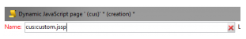

# Creazione di estensioni personalizzate{#creating-custom-extensions}

In genere, quando implementate un progetto, il codice personalizzato è disponibile sia in Adobe Campaign AEM che . Con l&#39;utilizzo dell&#39;API esistente, potete chiamare il codice personalizzato in  Adobe Campaign da AEM o da AEM a  Adobe Campaign. Questo documento descrive come farlo.

## Prerequisiti {#prerequisites}

Dovete disporre dei seguenti elementi installati:

* Adobe Experience Manager
*  Adobe Campaign 6.1

Per ulteriori informazioni, vedere [Integrazione AEM con  Adobe Campaign 6.1](/help/sites-administering/campaignonpremise.md).

## Esempio 1: AEM a  Adobe Campaign {#example-aem-to-adobe-campaign}

L&#39;integrazione standard tra AEM e Campaign è basata su JSON e JSSP (pagina JavaScript Server). Questi file JSSP si trovano nella console Campaign e iniziano tutti con **amc** (Adobe Marketing Cloud).


>[!NOTE]
>
>[Per questo esempio, consultate Geometrixx](/help/sites-developing/we-retail.md), disponibile da Package Share.

In questo esempio, creeremo un nuovo file JSSP personalizzato e lo chiameremo dal lato AEM per recuperare il risultato. Può essere utilizzato, ad esempio, per recuperare dati da  Adobe Campaign o per salvare dati in  Adobe Campaign.

1. In  Adobe Campaign, per creare un nuovo file JSSP, fare clic sull&#39;icona **New**.

   

1. Immettere il nome del file JSSP. In questo esempio, utilizzeremo **cus:custom.jssp** (il che significa che sarà nello spazio dei nomi **cus**).

   

1. Inserite il seguente codice nel file jssp:

   ```
   <%
   var origin = request.getParameter("origin");
   document.write("Hello from Adobe Campaign, origin : " + origin);
   %>
   ```

1. Salvate il lavoro. Il lavoro rimanente è in AEM.
1. Create un servlet semplice sul lato AEM per chiamare questo JSSP. In questo esempio, si presuppone quanto segue:

   * La connessione funziona tra AEM e Campaign
   * Il servizio cloud della campagna è configurato su **/content/geometrixx-outdoors**

   L&#39;oggetto più importante in questo esempio è il **GenericCampaignConnector**, che consente di chiamare (ottenere e pubblicare) i file jssp sul lato Adobe Campaign .

   Segue un piccolo frammento di codice:

   ```
   @Reference
   private GenericCampaignConnector campaignConnector;
   ...
   Map<String, String> params = new HashMap<String, String>();
   params.put("origin", "AEM");
   CallResults results = campaignConnector.callGeneric("/jssp/cus/custom.jssp", params, credentials);
   return results.bodyAsString();
   ```

1. Come illustrato in questo esempio, è necessario trasmettere le credenziali alla chiamata. Potete ottenere questo risultato tramite il metodo getCredentials(), in cui passate una pagina con il servizio cloud Campaign configurato.

   ```xml
   // page containing the cloudservice for Adobe Campaign
   Configuration config = campaignConnector.getWebserviceConfig(page.getContentResource().getParent());
   CampaignCredentials credentials = campaignConnector.retrieveCredentials(config);
   ```

Il codice completo è il seguente:

```java
import java.io.IOException;
import java.io.PrintWriter;
import java.util.HashMap;
import java.util.Map;

import javax.servlet.ServletException;

import org.apache.felix.scr.annotations.Reference;
import org.apache.felix.scr.annotations.sling.SlingServlet;
import org.apache.sling.api.SlingHttpServletRequest;
import org.apache.sling.api.SlingHttpServletResponse;
import org.apache.sling.api.servlets.SlingSafeMethodsServlet;
import org.slf4j.Logger;
import org.slf4j.LoggerFactory;

import com.day.cq.mcm.campaign.CallResults;
import com.day.cq.mcm.campaign.CampaignCredentials;
import com.day.cq.mcm.campaign.GenericCampaignConnector;
import com.day.cq.wcm.api.Page;
import com.day.cq.wcm.api.PageManager;
import com.day.cq.wcm.api.PageManagerFactory;
import com.day.cq.wcm.webservicesupport.Configuration;

@SlingServlet(paths="/bin/campaign", methods="GET")
public class CustomServlet extends SlingSafeMethodsServlet {

 private final Logger log = LoggerFactory.getLogger(this.getClass());

 @Reference
 private GenericCampaignConnector campaignConnector;

 @Reference
 private PageManagerFactory pageManagerFactory;

 @Override
 protected void doGet(SlingHttpServletRequest request,
   SlingHttpServletResponse response) throws ServletException,
   IOException {

  PageManager pm = pageManagerFactory.getPageManager(request.getResourceResolver());

  Page page = pm.getPage("/content/geometrixx-outdoors");

  String result = null;
  if ( page != null) {
   result = callCustomFunction(page);
  }
  if ( result != null ) {
   PrintWriter pw = response.getWriter();
   pw.print(result);
  }
 }

 private String callCustomFunction(Page page ) {
  try {
   Configuration config = campaignConnector.getWebserviceConfig(page.getContentResource().getParent());
   CampaignCredentials credentials = campaignConnector.retrieveCredentials(config);

   Map<String, String> params = new HashMap<String, String>();
   params.put("origin", "AEM");
   CallResults results = campaignConnector.callGeneric("/jssp/cus/custom.jssp", params, credentials);
   return results.bodyAsString();
  } catch (Exception e ) {
   log.error("Something went wrong during the connection", e);
  }
  return null;

 }

}
```

## Esempio 2:  Adobe Campaign a AEM {#example-adobe-campaign-to-aem}

AEM offre delle API pronte all&#39;uso per recuperare gli oggetti disponibili in qualsiasi punto della visualizzazione di Siteadmin Explorer.


>[!NOTE]
>
>[Per questo esempio, consultate Geometrixx](/help/sites-developing/we-retail.md), disponibile da Package Share.

Per ciascun nodo nell&#39;elenco di cartelle è presente un&#39;API collegata ad essa. Ad esempio per il nodo :

* [http://localhost:4502/siteadmin#/content/campaigns/geometrixx/scott-recommends](http://localhost:4502/siteadmin#/content/campaigns/geometrixx/scott-recommends)

l&#39;API è:

* [http://localhost:4502/content/campaigns/geometrixx/scott-recommends.1.json](http://localhost:4502/content/campaigns/geometrixx/scott-recommends.2.json)

La fine dell&#39;URL **.1.json** può essere sostituita da **.2.json**, **.3.json**, in base al numero di sottolivelli che si desidera ottenere Per ottenere tutti questi livelli è possibile utilizzare la parola chiave **infinity**:

* [http://localhost:4502/content/campaigns/geometrixx/scott-recommends.infinity.json](http://localhost:4502/content/campaigns/geometrixx/scott-recommends.2.json)

Ora, per utilizzare l&#39;API, dobbiamo sapere che AEM, per impostazione predefinita, utilizza l&#39;autenticazione di base.

Una libreria JS denominata **amcIntegration.js** è disponibile in 6.1.1 (build 8624 e versioni successive) che implementa tale logica tra le altre.

### AEM chiamata API {#aem-api-call}

```java
loadLibrary("nms:amcIntegration.js");

var cmsAccountId = sqlGetInt("select iExtAccountId from NmsExtAccount where sName=$(sz)","aemInstance")
var cmsAccount = nms.extAccount.load(String(cmsAccountId));
var cmsServer = cmsAccount.server;

var request = new HttpClientRequest(cmsServer+"/content/campaigns/geometrixx.infinity.json")
aemAddBasicAuthentication(cmsAccount, request);
request.method = "GET"
request.header["Content-Type"] = "application/json; charset=UTF-8";
request.execute();
var response = request.response;
```

