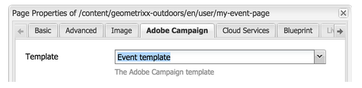

# Creazione di mapping di moduli personalizzati{#creating-custom-form-mappings}

Quando crei una tabella personalizzata in Adobe Campaign, potrebbe essere utile creare un modulo in AEM mappato su tale tabella personalizzata.

Questo documento descrive come creare mapping di moduli personalizzati. Dopo aver completato i passaggi descritti in questo documento, fornirai agli utenti una pagina evento in cui possono iscriversi per un evento in programma. Puoi quindi seguire questi utenti tramite Adobe Campaign.

## Prerequisiti {#prerequisites}

Devi avere installato quanto segue:

* Adobe Experience Manager
* Adobe Campaign Classic

Consulta [Integrazione dell’AEM con Adobe Campaign Classic](/help/sites-administering/campaignonpremise.md) per ulteriori informazioni.

## Creazione di mapping di moduli personalizzati {#creating-custom-form-mappings-2}

Per creare mappature di moduli personalizzate, è necessario seguire questi passaggi di alto livello, descritti in dettaglio nelle sezioni seguenti:

1. Crea una tabella personalizzata.
1. Estendi il **seed** tabella.
1. Creare una mappatura personalizzata.
1. Crea una consegna in base alla mappatura personalizzata.
1. Crea il modulo in AEM, che utilizzerà la consegna creata.
1. Inviare il modulo per verificarlo.

### Creazione della tabella personalizzata in Adobe Campaign {#creating-the-custom-table-in-adobe-campaign}

Inizia creando una tabella personalizzata in Adobe Campaign. In questo esempio, usiamo la seguente definizione per creare una tabella eventi:

```xml
<element autopk="true" label="Event" labelSingular="Event" name="event">
 <attribute label="Event Date" name="eventdate" type="date"/>
 <attribute label="Event Name" name="eventname" type="string"/>
 <attribute label="Email" name="email" type="string"/>
 <attribute label="Number of Seats" name="seats" type="long"/>
</element>
```

Dopo aver creato la tabella degli eventi, eseguire la **Procedura guidata di aggiornamento della struttura del database** per creare la tabella.

### Estensione della tabella dei valori iniziali {#extending-the-seed-table}

In Adobe Campaign, seleziona **Aggiungi** per creare un&#39;estensione del **Indirizzi seed (nms)** tabella.


Ora puoi utilizzare i campi della sezione **evento** tabella per estendere **seed** tabella:

```xml
<element label="Event" name="custom_cus_event">
 <attribute name="eventname" template="cus:event:event/@eventname"/>
 <attribute name="eventdate" template="cus:event:event/@eventdate"/>
 <attribute name="email" template="cus:event:event/@email"/>
 <attribute name="seats" template="cus:event:event/@seats"/>
 </element>
```

In seguito, esegui **Procedura guidata Aggiorna database** per applicare le modifiche.

### Creazione di una mappatura di destinazione personalizzata {#creating-custom-target-mapping}

In entrata **Amministrazione/Gestione delle campagne** t, vai a **Mappature target** e aggiungi una nuova T **Mappatura target.**

>[!NOTE]
>
>Utilizza un nome significativo per **Nome interno**.


### Creazione di un modello di consegna personalizzato {#creating-a-custom-delivery-template}

In questo passaggio, stai aggiungendo un modello di consegna che utilizza il **Mappatura target**.

In entrata **Risorse/Modelli**, passa al modello di consegna e duplica la consegna AEM esistente. Quando fai clic su **A**, seleziona l’evento di creazione **Mappatura target**.


### Creazione del modulo nell’AEM {#building-the-form-in-aem}

In AEM, assicurati di aver configurato un Cloud Service in **Proprietà pagina**.

Quindi, nella **Adobe Campaign** , seleziona la consegna creata in [Creazione di un modello di consegna personalizzato](#creating-a-custom-delivery-template).



Durante la configurazione dei campi, accertati di specificare nomi di elementi univoci per i campi modulo.

Dopo aver configurato i campi, devi modificare manualmente la mappatura.

In CRXDE-lite, vai al **jcr:content** (della pagina) e modificare il **acMapping** valore al nome interno del **Mappatura target**.


Nella configurazione del modulo, accertati di selezionare la casella di controllo per creare se non esistente


### Invio del modulo {#submitting-the-form}

Ora puoi inviare il modulo e verificare sul lato Adobe Campaign se i valori vengono salvati.


## Risoluzione dei problemi {#troubleshooting}

**&quot;Tipo non valido per il valore &#39;02/02/2015&#39; dall&#39;elemento &#39;@eventdate&#39; (documento di tipo &#39;Event ([adb:evento])&#39;)&quot;**

Quando si invia il modulo, questo errore viene registrato in **error.log** nell&#39;AEM.

Il formato del campo data non è valido. La soluzione consiste nel fornire **aaaa-mm-gg** come valore.
