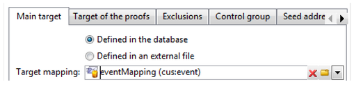

# Creazione di mappature di moduli personalizzate{#creating-custom-form-mappings}

Quando si crea una tabella personalizzata in Adobe Campaign, è possibile creare un modulo AEM mappato su tale tabella personalizzata.

Questo documento descrive come creare mappature dei moduli personalizzate. Quando completi i passaggi descritti in questo documento, fornirai agli utenti una pagina dell’evento in cui potranno iscriversi a un evento imminente. Quindi segui questi utenti tramite Adobe Campaign.

## Prerequisiti {#prerequisites}

Devi aver installato quanto segue:

* Adobe Experience Manager
* Adobe Campaign Classic

Vedi [Integrazione di AEM con Adobe Campaign Classic](/help/sites-administering/campaignonpremise.md) per ulteriori informazioni.

## Creazione di mappature di moduli personalizzate {#creating-custom-form-mappings-2}

Per creare mappature dei moduli personalizzate, è necessario seguire questi passaggi di alto livello, descritti in dettaglio nelle sezioni seguenti:

1. Creare una tabella personalizzata.
1. Estendi la **seme** tabella.
1. Crea una mappatura personalizzata.
1. Crea una consegna basata sulla mappatura personalizzata.
1. Crea il modulo in AEM, che utilizzerà la consegna creata.
1. Invia il modulo per verificarlo.

### Creazione di una tabella personalizzata in Adobe Campaign {#creating-the-custom-table-in-adobe-campaign}

Inizia creando una tabella personalizzata in Adobe Campaign. In questo esempio, utilizziamo la seguente definizione per creare una tabella eventi:

```xml
<element autopk="true" label="Event" labelSingular="Event" name="event">
 <attribute label="Event Date" name="eventdate" type="date"/>
 <attribute label="Event Name" name="eventname" type="string"/>
 <attribute label="Email" name="email" type="string"/>
 <attribute label="Number of Seats" name="seats" type="long"/>
</element>
```

Dopo aver creato la tabella eventi, esegui la **Aggiornamento della procedura guidata della struttura del database** per creare la tabella.

### Estensione della tabella delle sementi {#extending-the-seed-table}

In Adobe Campaign, tocca o fai clic su **Aggiungi** per creare una nuova estensione del **Indirizzi di seed (nms)** tabella.


Ora utilizza i campi della **event** tabella per estendere **seme** tabella:

```xml
<element label="Event" name="custom_cus_event">
 <attribute name="eventname" template="cus:event:event/@eventname"/>
 <attribute name="eventdate" template="cus:event:event/@eventdate"/>
 <attribute name="email" template="cus:event:event/@email"/>
 <attribute name="seats" template="cus:event:event/@seats"/>
 </element>
```

Dopo questo, esegui **Aggiornamento della procedura guidata del database** per applicare le modifiche.

### Creazione di una mappatura di Target personalizzata {#creating-custom-target-mapping}

In **Amministrazione/gestione campagne** t, vai a **Mappature di Target** e aggiungere una nuova T **Mappatura di Target.**

>[!NOTE]
>
>Assicurati di utilizzare un nome significativo per **Nome interno**.


### Creazione di un modello di consegna personalizzato {#creating-a-custom-delivery-template}

In questo passaggio, stai aggiungendo un modello di consegna che utilizza il **Mappatura del target**.

In **Risorse/Modelli**, passa al modello di consegna e duplica la consegna AEM esistente. Quando fai clic su **A**, seleziona l’evento crea **Mappatura del target**.



### Creazione del modulo in AEM {#building-the-form-in-aem}

In AEM, assicurati di aver configurato un Cloud Service in **Proprietà pagina**.

Quindi, nella **Adobe Campaign** , seleziona la consegna creata in [Creazione di un modello di consegna personalizzato](#creating-a-custom-delivery-template).


Durante la configurazione dei campi, assicurarsi di specificare nomi di elementi univoci per i campi modulo.

Una volta configurati i campi, devi modificare manualmente la mappatura.

In CRXDE-lite, vai alla **jcr:content** (della pagina) e modifica il **acMapping** al nome interno del **Mappatura del target**.


Nella configurazione del modulo, assicurarsi di selezionare la casella di controllo per creare se non esistente


### Invio del modulo {#submitting-the-form}

È ora possibile inviare il modulo e convalidare sul lato Adobe Campaign se i valori vengono salvati.


## Risoluzione dei problemi {#troubleshooting}

**&quot;Tipo non valido per il valore &#39;02/02/2015&#39; dall&#39;elemento &#39;@eventdate&#39; (documento di tipo &#39;Event ([adb:event])&quot;)**

Quando si invia il modulo, questo errore viene registrato nella **error.log** in AEM.

Formato non valido per il campo data. La soluzione alternativa è quella di fornire **aaaa-mm-gg** come valore.
