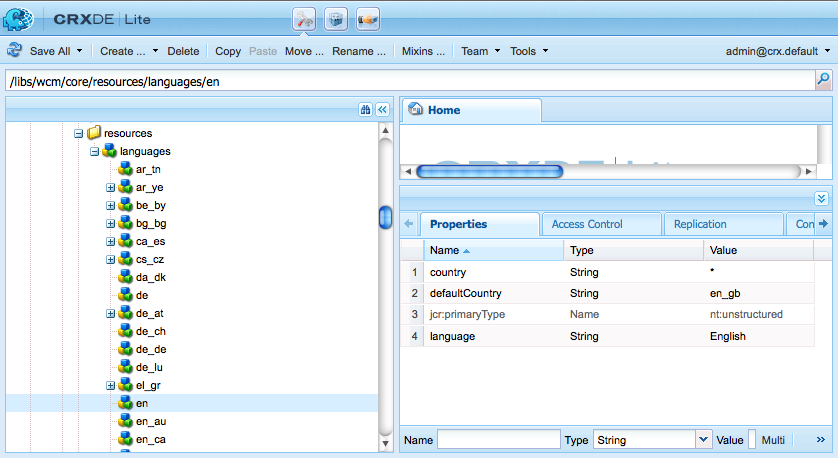

# Estensione di Multi Site Manager{#extending-the-multi-site-manager}

Questa pagina consente di estendere le funzionalità di Multi Site Manager:

* Scopri i membri principali dell’API Java MSM.
* Crea una nuova azione di sincronizzazione che può essere utilizzata in una configurazione di rollout.
* Modificare la lingua e i codici paese predefiniti.

<!-- * Remove the "Chapters" step in the Create Site wizard. -->

>[!NOTE]
>
>Questa pagina deve essere letta insieme a [Riutilizzo del contenuto: Multi Site Manager](/help/sites-administering/msm.md).
>
>Potrebbero interessare anche le seguenti sezioni della ristrutturazione dell’archivio siti nella AEM 6.4:
>* [Configurazioni blueprint di Multi-Site Manager](https://experienceleague.adobe.com/docs/experience-manager-64/deploying/restructuring/sites-repository-restructuring-in-aem-6-4.html?lang=en#multi-site-manager-blueprint-configurations)
>* [Configurazioni di rollout di Multi-Site Manager](https://experienceleague.adobe.com/docs/experience-manager-64/deploying/restructuring/sites-repository-restructuring-in-aem-6-4.html#multi-site-manager-rollout-configurations)


>[!CAUTION]
>
>Multi Site Manager e le relative API vengono utilizzate per la creazione di siti web, quindi sono destinate solo all’utilizzo in un ambiente di authoring.

## Panoramica dell’API Java {#overview-of-the-java-api}

Multi Site Management è costituito dai seguenti pacchetti:

* [com.day.cq.wcm.msm.api](https://helpx.adobe.com/experience-manager/6-5/sites/developing/using/reference-materials/javadoc/com/day/cq/wcm/msm/api/package-frame.html)
* [com.day.cq.wcm.msm.commons](https://helpx.adobe.com/experience-manager/6-5/sites/developing/using/reference-materials/javadoc/com/day/cq/wcm/msm/commons/package-frame.html)

I principali oggetti API MSM interagiscono come segue (vedi anche [Termini utilizzati](/help/sites-administering/msm.md#terms-used)):


* **`Blueprint`**

   A `Blueprint` (come in [configurazione blueprint](/help/sites-administering/msm.md#source-blueprints-and-blueprint-configurations)) specifica le pagine da cui una Live Copy può ereditare il contenuto.

   

   * L’utilizzo di una configurazione blueprint ( `Blueprint`) è facoltativo, ma:

      * Consente all’autore di utilizzare la funzione **Rollout** sull’origine (in modo esplicito) le modifiche push alle Live Copy che ereditano da questa origine).
      * Consente all’autore di utilizzare **Crea sito**; questo consente all’utente di selezionare facilmente le lingue e configurare la struttura della Live Copy.
      * Definisce la configurazione di rollout predefinita per tutte le Live Copy risultanti.

* **`LiveRelationship`**

   La `LiveRelationship` specifica la connessione (relazione) tra una risorsa nel ramo Live Copy e la relativa risorsa sorgente/blueprint equivalente.

   * Le relazioni vengono utilizzate per la realizzazione dell’ereditarietà e del rollout.
   * `LiveRelationship` Gli oggetti forniscono l’accesso (riferimenti) alle configurazioni di rollout ( `RolloutConfig`), `LiveCopy`e `LiveStatus` oggetti correlati alla relazione.

   * Ad esempio, viene creata una Live Copy in `/content/copy/us` dalla sorgente/blueprint all&#39;indirizzo `/content/we-retail/language-masters`. Risorse `/content/we.retail/language-masters/en/jcr:content` e `/content/copy/us/en/jcr:content` creare una relazione.

* **`LiveCopy`**

   `LiveCopy` contiene i dettagli di configurazione delle relazioni ( `LiveRelationship`) tra le risorse della Live Copy e le relative risorse sorgente/blueprint.

   * Utilizza la `LiveCopy` classe per accedere al percorso della pagina, al percorso della pagina sorgente/blueprint, alle configurazioni di rollout e se anche le pagine figlie sono incluse nel `LiveCopy`.

   * A `LiveCopy` viene creato ogni volta **Crea sito** o **Crea Live Copy** viene utilizzato.

* **`LiveStatus`**

   `LiveStatus` gli oggetti consentono di accedere allo stato di runtime di un `LiveRelationship`. Utilizza per eseguire una query sullo stato di sincronizzazione di una Live Copy.

* **`LiveAction`**

   A `LiveAction` è un’azione eseguita su ogni risorsa coinvolta nel rollout.

   * Le LiveActions sono generate solo da RolloutConfigs.

* **`LiveActionFactory`**

   Crea `LiveAction` oggetti dati `LiveAction` configurazione. Le configurazioni vengono memorizzate come risorse nell’archivio.

* **`RolloutConfig`**

   La `RolloutConfig` contiene un elenco di `LiveActions`, da utilizzare quando viene attivato. La `LiveCopy` eredita `RolloutConfig` e il risultato è presente nella `LiveRelationship`.

   * L&#39;impostazione di una Live Copy per la prima volta utilizza anche un RolloutConfig (che attiva le LiveActions).

## Creazione di una nuova azione di sincronizzazione {#creating-a-new-synchronization-action}

Crea azioni di sincronizzazione personalizzate da utilizzare con le configurazioni di rollout. Crea un&#39;azione di sincronizzazione quando [azioni installate](/help/sites-administering/msm-sync.md#installed-synchronization-actions) non soddisfano i requisiti specifici dell&#39;applicazione. Per eseguire questa operazione, creare due classi:

* L&#39;attuazione [ `com.day.cq.wcm.msm.api.LiveAction`](https://helpx.adobe.com/experience-manager/6-5/sites/developing/using/reference-materials/javadoc/com/day/cq/wcm/msm/api/LiveAction.html) che esegue l&#39;azione.
* Un componente OSGI che implementa il [ `com.day.cq.wcm.msm.api.LiveActionFactory`](https://helpx.adobe.com/experience-manager/6-5/sites/developing/using/reference-materials/javadoc/com/day/cq/wcm/msm/api/LiveActionFactory.html) e crea le istanze della `LiveAction` classe.

La `LiveActionFactory` crea le istanze del `LiveAction` classe per una determinata configurazione:

* `LiveAction` le classi includono i metodi seguenti:

   * `getName`: Restituisce il nome dell&#39;azione Il nome viene utilizzato per fare riferimento all&#39;azione, ad esempio nelle configurazioni di rollout.
   * `execute`: Esegue le attività dell&#39;azione.

* `LiveActionFactory` le classi includono i seguenti membri:

   * `LIVE_ACTION_NAME`: Campo contenente il nome dell&#39;associato `LiveAction`. Questo nome deve coincidere con il valore restituito dal `getName` metodo `LiveAction` classe.

   * `createAction`: Crea un&#39;istanza del `LiveAction`. L&#39;opzione `Resource` può essere utilizzato per fornire informazioni sulla configurazione.

   * `createsAction`: Restituisce il nome dell&#39;associato `LiveAction`.

### Accesso al nodo di configurazione LiveAction {#accessing-the-liveaction-configuration-node}

Utilizza la `LiveAction` nodo di configurazione nell&#39;archivio per memorizzare informazioni che influiscono sul comportamento di runtime del `LiveAction` istanza. Il nodo nell&#39;archivio che memorizza il `LiveAction` la configurazione è disponibile per `LiveActionFactory` oggetto in fase di runtime. Pertanto, puoi aggiungere proprietà al nodo di configurazione a e utilizzarle nel tuo `LiveActionFactory` implementazione in base alle esigenze.

Ad esempio, un `LiveAction` deve memorizzare il nome dell’autore della blueprint. Una proprietà del nodo di configurazione include il nome della proprietà della pagina blueprint che memorizza le informazioni. In fase di esecuzione, il `LiveAction` recupera il nome della proprietà dalla configurazione, quindi ottiene il valore della proprietà.

Il parametro della ` [LiveActionFactory](https://helpx.adobe.com/experience-manager/6-5/sites/developing/using/reference-materials/javadoc/com/day/cq/wcm/msm/api/LiveActionFactory.html).createAction` è un metodo `Resource` oggetto. Questo `Resource` l&#39;oggetto rappresenta `cq:LiveSyncAction` nodo per questa azione live nella configurazione di rollout; vedere [Creazione di una configurazione di rollout](/help/sites-administering/msm-sync.md#creating-a-rollout-configuration). Come di consueto, quando utilizzi un nodo di configurazione, devi adattarlo a un `ValueMap` oggetto:

```java
public LiveAction createAction(Resource resource) throws WCMException {
        ValueMap config;
        if (resource == null || resource.adaptTo(ValueMap.class) == null) {
            config = new ValueMapDecorator(Collections.<String, Object>emptyMap());
        } else {
            config = resource.adaptTo(ValueMap.class);
        }
        return new MyLiveAction(config, this);
}
```

### Accesso ai nodi di Target, ai nodi sorgente e alla LiveRelationship {#accessing-target-nodes-source-nodes-and-the-liverelationship}

I seguenti oggetti vengono forniti come parametri del `execute` metodo `LiveAction` oggetto:

* A [ `Resource`](https://helpx.adobe.com/it/experience-manager/6-5/sites/developing/using/reference-materials/javadoc/org/apache/sling/api/resource/Resource.html) che rappresenta l&#39;origine della Live Copy.
* A `Resource` che rappresenta la destinazione della Live Copy.
* La [ `LiveRelationship`](https://helpx.adobe.com/experience-manager/6-5/sites/developing/using/reference-materials/javadoc/com/day/cq/wcm/msm/api/LiveRelationship.html) oggetto per la Live Copy.
* La `autoSave` il valore indica se il `LiveAction` devono salvare le modifiche apportate all’archivio.

* Il valore di reset indica la modalità di ripristino del rollout.

Da questi oggetti è possibile ottenere tutte le informazioni sui `LiveCopy`. È inoltre possibile utilizzare `Resource` oggetti da ottenere `ResourceResolver`, `Session`e `Node` oggetti. Questi oggetti sono utili per manipolare il contenuto dell’archivio:

Nella prima riga del codice seguente, l&#39;origine è il `Resource` oggetto della pagina di origine:

```java
ResourceResolver resolver = source.getResourceResolver();
Session session = resolver.adaptTo(javax.jcr.Session.class);
Node sourcenode = source.adaptTo(javax.jcr.Node.class);
```

>[!NOTE]
>
>La `Resource` argomenti `null` o `Resources` oggetti che non si adattano `Node` oggetti, quali [ `NonExistingResource`](https://helpx.adobe.com/experience-manager/6-5/sites/developing/using/reference-materials/javadoc/org/apache/sling/api/resource/NonExistingResource.html) oggetti.

## Creazione di una nuova configurazione di rollout {#creating-a-new-rollout-configuration}

Crea una configurazione di rollout quando le configurazioni di rollout installate non soddisfano i requisiti dell&#39;applicazione:

* [Crea la configurazione di rollout](#create-the-rollout-configuration).
* [Aggiungi le azioni di sincronizzazione alla configurazione di rollout](#add-synchronization-actions-to-the-rollout-configuration).

La nuova configurazione di rollout è quindi disponibile quando imposti le configurazioni di rollout su una pagina blueprint o Live Copy.

>[!NOTE]
>
>Vedi anche [best practice per personalizzare i rollout](/help/sites-administering/msm-best-practices.md#customizing-rollouts).

### Creare la configurazione di rollout {#create-the-rollout-configuration}

Per creare una nuova configurazione di rollout:

1. CRXDE Lite aperto; ad esempio:
   [http://localhost:4502/crx/de](http://localhost:4502/crx/de)

1. Accedi a :
   `/apps/msm/<your-project>/rolloutconfigs`

   >[!NOTE]
   >Questa è la versione personalizzata del progetto di:
   >`/libs/msm/wcm/rolloutconfigs`
   >Deve essere creato se si tratta della prima configurazione.

   >[!NOTE]
   >
   >Non devi modificare nulla nel percorso /libs.
   >Questo perché il contenuto di /libs viene sovrascritto la prossima volta che aggiorni l&#39;istanza (e potrebbe essere sovrascritto quando applichi un hotfix o un feature pack).
   >Il metodo consigliato per la configurazione e altre modifiche è:
   >* Ricrea l&#39;elemento richiesto (cioè come esiste in /libs) sotto /apps
   >* Apporta modifiche a /apps


1. Sotto questo **Crea** un nodo con le seguenti proprietà:

   * **Nome**: Nome del nodo della configurazione di rollout. md#install-sync-actions), ad esempio `contentCopy` o `workflow`.
   * **Tipo**: `cq:RolloutConfig`

1. Aggiungi le seguenti proprietà a questo nodo:
   * **Nome**: `jcr:title`

      **Tipo**: `String`
      **Valore**: Titolo di identificazione che verrà visualizzato nell’interfaccia utente.
   * **Nome**: `jcr:description`

      **Tipo**: `String`
      **Valore**: Una descrizione facoltativa.
   * **Nome**: `cq:trigger`

      **Tipo**: `String`
      **Valore**: La [Attivatore di rollout](/help/sites-administering/msm-sync.md#rollout-triggers) da utilizzare. Seleziona da:
      * `rollout`
      * `modification`
      * `publish`
      * `deactivate`

1. Fai clic su **Salva tutto**.

### Aggiungere azioni di sincronizzazione alla configurazione del rollout {#add-synchronization-actions-to-the-rollout-configuration}

Le configurazioni di rollout sono memorizzate sotto [nodo di configurazione di rollout](#create-the-rollout-configuration) creato in `/apps/msm/<your-project>/rolloutconfigs` nodo.

Aggiungi nodi figlio di tipo `cq:LiveSyncAction` per aggiungere azioni di sincronizzazione alla configurazione di rollout. L’ordine dei nodi di azione di sincronizzazione determina l’ordine in cui si verificano le azioni.

1. Sempre in CRXDE Lite, seleziona la [Configurazione del rollout](#create-the-rollout-configuration) nodo.

   Esempio:
   `/apps/msm/myproject/rolloutconfigs/myrolloutconfig`

1. **Crea** un nodo con le seguenti proprietà del nodo:

   * **Nome**: Nome del nodo dell&#39;azione di sincronizzazione.
Il nome deve essere lo stesso del **Nome azione** nella tabella di cui [Azioni di sincronizzazione](/help/sites-administering/msm-sync.md#installed-synchronization-actions), ad esempio `contentCopy` o `workflow`.
   * **Tipo**: `cq:LiveSyncAction`

1. Aggiungi e configura tutti i nodi di azione di sincronizzazione necessari. Ridisponi i nodi di azione in modo che il loro ordine corrisponda all’ordine in cui desideri che si verifichino. Il nodo di azione più in alto si verifica per primo.

## Creazione e utilizzo di una semplice classe LiveActionFactory {#creating-and-using-a-simple-liveactionfactory-class}

Segui le procedure descritte in questa sezione per sviluppare un `LiveActionFactory` e utilizzalo in una configurazione di rollout. Le procedure utilizzano Maven ed Eclipse per sviluppare e distribuire il `LiveActionFactory`:

1. [Crea il progetto Maven](#create-the-maven-project) e importalo in Eclipse.
1. [Aggiungi dipendenze](#add-dependencies-to-the-pom-file) al file POM.
1. [Implementare `LiveActionFactory` interfaccia](#implement-liveactionfactory) e distribuire il bundle OSGi.
1. [Crea la configurazione di rollout](#create-the-example-rollout-configuration).
1. [Creare la Live Copy](#create-the-live-copy).

Il progetto Maven e il codice sorgente della classe Java sono disponibili nell’archivio Git pubblico.

CODICE SU GITHUB

Puoi trovare il codice di questa pagina su GitHub

* [Apri il progetto experiencemanager-java-msmrollout su GitHub](https://github.com/Adobe-Marketing-Cloud/experiencemanager-java-msmrollout)
* Scarica il progetto come [un file ZIP](https://github.com/Adobe-Marketing-Cloud/experiencemanager-java-msmrollout/archive/master.zip)

### Crea progetto Maven {#create-the-maven-project}

La procedura seguente richiede l’aggiunta del profilo adobe-public al file delle impostazioni Maven.

* Per informazioni sul profilo adobe-public, vedi [Ottenimento del plug-in Maven del pacchetto di contenuti](/help/sites-developing/vlt-mavenplugin.md#obtaining-the-content-package-maven-plugin)
* Per informazioni sul file delle impostazioni Maven, consulta la sezione Maven [Riferimento impostazioni](https://maven.apache.org/settings.html).

1. Apri un terminale o una sessione della riga di comando e modifica la directory in modo che punti alla posizione in cui creare il progetto.
1. Immetti il seguente comando:

   ```xml
   mvn archetype:generate -DarchetypeGroupId=com.day.jcr.vault -DarchetypeArtifactId=multimodule-content-package-archetype -DarchetypeVersion=1.0.0 -DarchetypeRepository=adobe-public-releases
   ```

1. Al prompt interattivo, specifica i seguenti valori:

   * `groupId`: `com.adobe.example.msm`
   * `artifactId`: `MyLiveActionFactory`
   * `version`: `1.0-SNAPSHOT`
   * `package`: `MyPackage`
   * `appsFolderName`: `myapp`
   * `artifactName`: `MyLiveActionFactory package`
   * `packageGroup`: `myPackages`

1. Avvia Eclipse e [importare il progetto Maven](/help/sites-developing/howto-projects-eclipse.md#import-the-maven-project-into-eclipse).

### Aggiungi dipendenze al file POM {#add-dependencies-to-the-pom-file}

Aggiungi le dipendenze in modo che il compilatore Eclipse possa fare riferimento alle classi utilizzate nel `LiveActionFactory` codice.

1. In Esplora progetti Eclipse, apri il file:

   `MyLiveActionFactory/pom.xml`

1. Nell’editor, fai clic su `pom.xml` e individua la `project/dependencyManagement/dependencies` sezione .
1. Aggiungi il seguente XML all’interno del `dependencyManagement` e quindi salva il file.

   ```xml
    <dependency>
     <groupId>com.day.cq.wcm</groupId>
     <artifactId>cq-msm-api</artifactId>
     <version>5.6.2</version>
     <scope>provided</scope>
    </dependency>
    <dependency>
     <groupId>org.apache.sling</groupId>
     <artifactId>org.apache.sling.api</artifactId>
     <version>2.4.3-R1488084</version>
     <scope>provided</scope>
    </dependency>
    <dependency>
     <groupId>com.day.cq.wcm</groupId>
     <artifactId>cq-wcm-api</artifactId>
     <version>5.6.6</version>
     <scope>provided</scope>
    </dependency>
    <dependency>
     <groupId>org.apache.sling</groupId>
     <artifactId>org.apache.sling.commons.json</artifactId>
     <version>2.0.6</version>
     <scope>provided</scope>
    </dependency>
    <dependency>
     <groupId>com.day.cq</groupId>
     <artifactId>cq-commons</artifactId>
     <version>5.6.4</version>
     <scope>provided</scope>
    </dependency>
    <dependency>
     <groupId>org.apache.sling</groupId>
     <artifactId>org.apache.sling.jcr.jcr-wrapper</artifactId>
     <version>2.0.0</version>
     <scope>provided</scope>
    </dependency>
    <dependency>
     <groupId>com.day.cq</groupId>
     <artifactId>cq-commons</artifactId>
     <version>5.6.4</version>
     <scope>provided</scope>
    </dependency>
   ```

1. Apri il file POM per il bundle da **Esplora progetti** a `MyLiveActionFactory-bundle/pom.xml`.
1. Nell’editor, fai clic su `pom.xml` e individua la sezione progetto/dipendenze . Aggiungi il seguente XML all’interno dell’elemento dipendenze, quindi salva il file:

   ```xml
    <dependency>
     <groupId>com.day.cq.wcm</groupId>
     <artifactId>cq-msm-api</artifactId>
    </dependency>
    <dependency>
     <groupId>org.apache.sling</groupId>
     <artifactId>org.apache.sling.api</artifactId>
    </dependency>
    <dependency>
     <groupId>com.day.cq.wcm</groupId>
     <artifactId>cq-wcm-api</artifactId>
    </dependency>
    <dependency>
     <groupId>org.apache.sling</groupId>
     <artifactId>org.apache.sling.commons.json</artifactId>
    </dependency>
    <dependency>
     <groupId>com.day.cq</groupId>
     <artifactId>cq-commons</artifactId>
    </dependency>
    <dependency>
     <groupId>org.apache.sling</groupId>
     <artifactId>org.apache.sling.jcr.jcr-wrapper</artifactId>
    </dependency>
    <dependency>
     <groupId>com.day.cq</groupId>
     <artifactId>cq-commons</artifactId>
    </dependency>
   ```

### Implementare LiveActionFactory {#implement-liveactionfactory}

I seguenti `LiveActionFactory` la classe implementa un `LiveAction` che registra i messaggi relativi alle pagine di origine e di destinazione e copia il `cq:lastModifiedBy` dal nodo di origine al nodo di destinazione. Il nome dell’azione live è `exampleLiveAction`.

1. In Esplora progetti Eclipse, fai clic con il pulsante destro del mouse sul pulsante `MyLiveActionFactory-bundle/src/main/java/com.adobe.example.msm` pacchetto e fai clic su **Nuovo** > **Classe**. Per **Nome**, inserisci `ExampleLiveActionFactory` quindi fai clic su **Fine**.
1. Apri `ExampleLiveActionFactory.java` , sostituisci il contenuto con il seguente codice e salva il file .

   ```java
   package com.adobe.example.msm;
   
   import java.util.Collections;
   
   import org.apache.felix.scr.annotations.Component;
   import org.apache.felix.scr.annotations.Property;
   import org.apache.felix.scr.annotations.Service;
   import org.apache.sling.api.resource.Resource;
   import org.apache.sling.api.resource.ResourceResolver;
   import org.apache.sling.api.resource.ValueMap;
   import org.apache.sling.api.wrappers.ValueMapDecorator;
   import org.apache.sling.commons.json.io.JSONWriter;
   import org.apache.sling.commons.json.JSONException;
   
   import org.slf4j.Logger;
   import org.slf4j.LoggerFactory;
   
   import javax.jcr.Node;
   import javax.jcr.RepositoryException;
   import javax.jcr.Session;
   
   import com.day.cq.wcm.msm.api.ActionConfig;
   import com.day.cq.wcm.msm.api.LiveAction;
   import com.day.cq.wcm.msm.api.LiveActionFactory;
   import com.day.cq.wcm.msm.api.LiveRelationship;
   import com.day.cq.wcm.api.WCMException;
   
   @Component(metatype = false)
   @Service
   public class ExampleLiveActionFactory implements LiveActionFactory<LiveAction> {
    @Property(value="exampleLiveAction")
    static final String actionname = LiveActionFactory.LIVE_ACTION_NAME;
   
    public LiveAction createAction(Resource config) {
     ValueMap configs;
     /* Adapt the config resource to a ValueMap */
           if (config == null || config.adaptTo(ValueMap.class) == null) {
               configs = new ValueMapDecorator(Collections.<String, Object>emptyMap());
           } else {
               configs = config.adaptTo(ValueMap.class);
           }
   
     return new ExampleLiveAction(actionname, configs);
    }
    public String createsAction() {
     return actionname;
    }
    /************* LiveAction ****************/
    private static class ExampleLiveAction implements LiveAction {
     private String name;
     private ValueMap configs;
     private static final Logger log = LoggerFactory.getLogger(ExampleLiveAction.class);
   
     public ExampleLiveAction(String nm, ValueMap config){
      name = nm;
      configs = config;
     }
   
     public void execute(Resource source, Resource target,
       LiveRelationship liverel, boolean autoSave, boolean isResetRollout)
         throws WCMException {
   
      String lastMod = null;
   
      log.info(" *** Executing ExampleLiveAction *** ");
   
      /* Determine if the LiveAction is configured to copy the cq:lastModifiedBy property */
      if ((Boolean) configs.get("repLastModBy")){
   
       /* get the source's cq:lastModifiedBy property */
       if (source != null && source.adaptTo(Node.class) !=  null){
        ValueMap sourcevm = source.adaptTo(ValueMap.class);
        lastMod = sourcevm.get(com.day.cq.wcm.msm.api.MSMNameConstants.PN_PAGE_LAST_MOD_BY, String.class);
       }
   
       /* set the target node's la-lastModifiedBy property */
       Session session = null;
       if (target != null && target.adaptTo(Node.class) !=  null){
        ResourceResolver resolver = target.getResourceResolver();
        session = resolver.adaptTo(javax.jcr.Session.class);
        Node targetNode;
        try{
         targetNode=target.adaptTo(javax.jcr.Node.class);
         targetNode.setProperty("la-lastModifiedBy", lastMod);
         log.info(" *** Target node lastModifiedBy property updated: {} ***",lastMod);
        }catch(Exception e){
         log.error(e.getMessage());
        }
       }
       if(autoSave){
        try {
         session.save();
        } catch (Exception e) {
         try {
          session.refresh(true);
         } catch (RepositoryException e1) {
          e1.printStackTrace();
         }
         e.printStackTrace();
        }
       }
      }
     }
     public String getName() {
      return name;
     }
   
     /************* Deprecated *************/
     @Deprecated
     public void execute(ResourceResolver arg0, LiveRelationship arg1,
       ActionConfig arg2, boolean arg3) throws WCMException {
     }
     @Deprecated
     public void execute(ResourceResolver arg0, LiveRelationship arg1,
       ActionConfig arg2, boolean arg3, boolean arg4)
         throws WCMException {
     }
     @Deprecated
     public String getParameterName() {
      return null;
     }
     @Deprecated
     public String[] getPropertiesNames() {
      return null;
     }
     @Deprecated
     public int getRank() {
      return 0;
     }
     @Deprecated
     public String getTitle() {
      return null;
     }
     @Deprecated
     public void write(JSONWriter arg0) throws JSONException {
     }
    }
   }
   ```

1. Utilizzando il terminale o la sessione di comando, cambiare la directory in `MyLiveActionFactory` directory (la directory di progetto Maven). Quindi, immetti il comando seguente:

   ```shell
   mvn -PautoInstallPackage clean install
   ```

   AEM `error.log` Il file deve indicare che il bundle è avviato.

   Ad esempio: [https://localhost:4502/system/console/status-slinglogs](https://localhost:4502/system/console/status-slinglogs).

   ```xml
   13.08.2013 14:34:55.450 *INFO* [OsgiInstallerImpl] com.adobe.example.msm.MyLiveActionFactory-bundle BundleEvent RESOLVED
   13.08.2013 14:34:55.451 *INFO* [OsgiInstallerImpl] com.adobe.example.msm.MyLiveActionFactory-bundle BundleEvent STARTING
   13.08.2013 14:34:55.451 *INFO* [OsgiInstallerImpl] com.adobe.example.msm.MyLiveActionFactory-bundle BundleEvent STARTED
   13.08.2013 14:34:55.453 *INFO* [OsgiInstallerImpl] com.adobe.example.msm.MyLiveActionFactory-bundle Service [com.adobe.example.msm.ExampleLiveActionFactory,2188] ServiceEvent REGISTERED
   13.08.2013 14:34:55.454 *INFO* [OsgiInstallerImpl] org.apache.sling.audit.osgi.installer Started bundle com.adobe.example.msm.MyLiveActionFactory-bundle [316]
   ```

### Creare la configurazione di rollout di esempio {#create-the-example-rollout-configuration}

Crea la configurazione di rollout MSM che utilizza il `LiveActionFactory` creato:

1. Creare e configurare un [Configurazione del rollout con la procedura standard](/help/sites-administering/msm-sync.md#creating-a-rollout-configuration) - e utilizzando le proprietà:

   * **Titolo**: Esempio di configurazione del rollout
   * **Nome**: examplerolloutconfig
   * **cq:trigger**: `publish`

### Aggiungi l’azione live alla configurazione di rollout di esempio {#add-the-live-action-to-the-example-rollout-configuration}

Configura la configurazione di rollout creata nella procedura precedente in modo che utilizzi `ExampleLiveActionFactory` classe.

1. CRXDE Lite aperto; ad esempio, [https://localhost:4502/crx/de](https://localhost:4502/crx/de).
1. Crea il seguente nodo sotto `/apps/msm/rolloutconfigs/examplerolloutconfig/jcr:content`:

   * **Nome**: `exampleLiveAction`
   * **Tipo**: `cq:LiveSyncAction`

1. Fai clic su **Salva tutto**.
1. Seleziona la `exampleLiveAction` e aggiungi la seguente proprietà:

   * **Nome**: `repLastModBy`
   * **Tipo**: `Boolean`
   * **Valore**: `true`

   Questa proprietà indica `ExampleLiveAction` la classe `cq:LastModifiedBy` La proprietà deve essere replicata dall&#39;origine al nodo di destinazione.

1. Fai clic su **Salva tutto**.

### Creare la Live Copy {#create-the-live-copy}

[Creare una Live Copy](/help/sites-administering/msm-livecopy.md#creating-a-live-copy-of-a-page) della sezione Inglese/Prodotti del sito di riferimento We.Retail utilizzando la configurazione di rollout:

* **Origine**: `/content/we-retail/language-masters/en/products`

* **Configurazione del rollout**: Esempio di configurazione del rollout

Attiva la **Prodotti** (inglese) pagina del ramo di origine e osserva i messaggi di log che `LiveAction` la classe genera:

```xml
16.08.2013 10:53:33.055 *INFO* [Thread-444535] com.adobe.example.msm.ExampleLiveActionFactory$ExampleLiveAction  ***ExampleLiveAction has been executed.***
16.08.2013 10:53:33.055 *INFO* [Thread-444535] com.adobe.example.msm.ExampleLiveActionFactory$ExampleLiveAction  ***Target node lastModifiedBy property updated: admin ***
```

<!--
## Removing the Chapters Step in the Create Site Wizard {#removing-the-chapters-step-in-the-create-site-wizard}

In some cases, the **Chapters** selection is not required in the create site wizard (only the **Languages** selection is required). To remove this step in the default We.Retail English blueprint:

1. In CRX Explorer, remove the node:
   `/etc/blueprints/weretail-english/jcr:content/dialog/items/tabs/items/tab_chap`.

1. Navigate to `/libs/wcm/msm/templates/blueprint/defaults/livecopy_tab/items` and create a new node:

    1. **Name** = `chapters`; **Type** = `cq:Widget`.

1. Add following properties to the new node:

    1. **Name** = `name`; **Type** = `String`; **Value** = `msm:chapterPages`

    1. **Name** = `value`; **Type** = `String`; **Value** = `all`

    1. **Name** = `xtype`; **Type** = `String`; **Value** = `hidden`
-->

## Modifica dei nomi delle lingue e dei paesi predefiniti {#changing-language-names-and-default-countries}

AEM utilizza un set predefinito di codici lingua e paese.

* Il codice della lingua predefinito è il codice a due lettere minuscolo come definito dallo standard ISO-639-1.
* Il codice del paese predefinito è il codice a due lettere minuscolo o superiore, come definito dalla norma ISO 3166.

MSM utilizza un elenco memorizzato di codici lingua e paese per determinare il nome del paese associato al nome della versione della lingua della pagina. Se necessario, è possibile modificare i seguenti aspetti dell’elenco:

* Titoli in lingua
* Nomi dei paesi
* Paesi predefiniti per le lingue (per codici quali `en`, `de`, tra gli altri)

L&#39;elenco delle lingue è memorizzato sotto la `/libs/wcm/core/resources/languages` nodo. Ogni nodo figlio rappresenta una lingua o un paese della lingua:

* Il nome del nodo è il codice della lingua (ad esempio `en` o `de`) o il codice language_country (ad esempio `en_us` o `de_ch`).

* La `language` La proprietà del nodo memorizza il nome completo della lingua per il codice.
* La `country` La proprietà del nodo memorizza il nome completo del paese per il codice.
* Quando il nome del nodo è costituito solo da un codice della lingua (ad esempio `en`), la proprietà del paese è `*`, e `defaultCountry` la proprietà memorizza il codice del paese della lingua per indicare il paese da utilizzare.



Per modificare le lingue:

1. Apri CRXDE Lite nel browser Web; ad esempio, [https://localhost:4502/crx/de](https://localhost:4502/crx/de)
1. Seleziona la `/apps` e fai clic su **Crea**, quindi **Crea cartella.**

   Denomina la nuova cartella `wcm`.

1. Ripeti il passaggio precedente per creare il `/apps/wcm/core` struttura delle cartelle. Crea un nodo di tipo `sling:Folder` in `core` chiamato `resources`. <!--  -->

1. Fai clic con il pulsante destro del mouse sul pulsante `/libs/wcm/core/resources/languages` nodo e fai clic su **Copia**.
1. Fai clic con il pulsante destro del mouse sul pulsante `/apps/wcm/core/resources` e fai clic su **Incolla**. Modifica i nodi figlio come necessario.
1. Fai clic su **Salva tutto**.
1. Fai clic su **Strumenti**, **Operazioni** then **Console web**. Da questa console fai clic su **OSGi**, quindi **Configurazione**.
1. Individua e fai clic su **Gestione della lingua di CQ WCM Day** e modifica il valore di **Elenco lingua** a `/apps/wcm/core/resources/languages`, quindi fai clic su **Salva**.

   

## Configurazione dei blocchi MSM nelle proprietà di pagina (interfaccia touch) {#configuring-msm-locks-on-page-properties-touch-enabled-ui}

Quando crei una proprietà pagina personalizzata, potrebbe essere necessario considerare se la nuova proprietà deve essere idonea per il rollout in qualsiasi Live Copy.

Ad esempio, se vengono aggiunte due nuove proprietà di pagina:

* E-mail di contatto:

   * Questa proprietà non deve essere implementata, in quanto sarà diversa in ogni paese (o marchio, ecc.).

* Stile visivo chiave:

   * Il requisito del progetto è che questa proprietà deve essere implementata così come è (di solito) comune a tutti i paesi (o marchi, ecc.).

Poi devi assicurarti che:

* E-mail di contatto:

   * è escluso dalle proprietà di rollout; vedere [Esclusione di proprietà e tipi di nodo dalla sincronizzazione](/help/sites-administering/msm-sync.md#excluding-properties-and-node-types-from-synchronization).

* Stile visivo chiave:

   * Assicurati di non poter modificare questa proprietà nell’interfaccia touch a meno che l’ereditarietà non venga annullata e di poter quindi ripristinare l’ereditarietà; questa opzione è controllata facendo clic sui collegamenti a catena o a catena interrotta che si attivano per indicare lo stato della connessione.

Il fatto che una proprietà di pagina sia soggetta a rollout e, quindi, soggetta a annullamento/ripristino dell’ereditarietà durante la modifica, sia controllata dalla proprietà di dialogo:

* `cq-msm-lockable`

   * è applicabile agli elementi in una finestra di dialogo dell’interfaccia touch
   * crea il simbolo di collegamento a catena nella finestra di dialogo
   * consente la modifica solo se l’ereditarietà viene annullata (il collegamento a catena è interrotto)
   * si applica solo al primo livello figlio della risorsa
   * **Tipo**: `String`

   * **Valore**: contiene il nome dell&#39;immobile considerato (ed è paragonabile al valore dell&#39;immobile `name`; ad esempio, vedi
      `/libs/foundation/components/page/cq:dialog/content/items/tabs/items/basic/items/column/items/title/items/title`

Quando `cq-msm-lockable` è stato definito, rompere/chiudere la catena interagisce con MSM nel modo seguente:

* se il valore di `cq-msm-lockable` è:

   * **Relativo** (ad esempio `myProperty` o `./myProperty`)

      * aggiungerà e rimuoverà la proprietà da `cq:propertyInheritanceCancelled`.
   * **Assoluto** (ad esempio `/image`)

      * l’interruzione della catena annullerà l’ereditarietà aggiungendo la `cq:LiveSyncCancelled` mixin `./image` e le impostazioni `cq:isCancelledForChildren` a `true`.

      * la chiusura della catena ripristina l’ereditarietà.


>[!NOTE]
>
>`cq-msm-lockable` si applica al primo livello figlio della risorsa da modificare e non funziona su alcun predecessore di livello più profondo, indipendentemente dal fatto che il valore sia definito come assoluto o relativo.

>[!NOTE]
>
>Quando riattivi l’ereditarietà, la proprietà della pagina Live Copy non viene sincronizzata automaticamente con la proprietà sorgente. Se necessario, è possibile richiedere manualmente una sincronizzazione.
