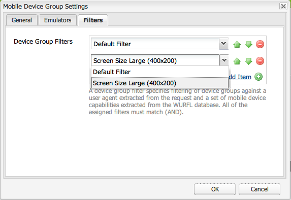

# Creazione di filtri per i gruppi di dispositivi{#creating-device-group-filters}

>[!NOTE]
>
>Adobe consiglia di utilizzare l’editor di SPA per i progetti che richiedono il rendering lato client basato sul framework di un’applicazione a pagina singola (ad esempio, React). [Per saperne di più](/help/sites-developing/spa-overview.md).

Crea un filtro per gruppi di dispositivi per definire un set di requisiti di funzionalità per i dispositivi. Crea tutti i filtri necessari per eseguire il targeting dei gruppi di funzionalità del dispositivo necessari.

Progetta i filtri in modo da poter utilizzare combinazioni di questi per definire i gruppi di funzionalità. In genere, esiste una sovrapposizione delle funzionalità di diversi gruppi di dispositivi. Pertanto, puoi utilizzare alcuni filtri con più definizioni di gruppi di dispositivi.

Dopo aver creato un filtro, puoi utilizzarlo nella [configurazione del gruppo.](/help/sites-developing/mobile.md#creating-a-device-group)

## Classe Java del filtro {#the-filter-java-class}

Un filtro per gruppi di dispositivi è un componente OSGi che implementa il [com.day.cq.wcm.mobile.api.device.DeviceGroupFilter](https://helpx.adobe.com/experience-manager/6-5/sites/developing/using/reference-materials/javadoc/index.html?com/day/cq/wcm/mobile/api/device/DeviceGroupFilter.html) interfaccia. Quando viene distribuita, la classe di implementazione fornisce un servizio filtro disponibile per le configurazioni del gruppo di dispositivi.

La soluzione descritta in questo articolo utilizza il plugin Apache Felix Maven SCR per facilitare lo sviluppo del componente e del servizio. Pertanto, la classe Java di esempio utilizza il `@Component`e `@Service` annotazioni. La classe presenta la seguente struttura:

```java
package com.adobe.example.myapp;

import java.util.Map;

import com.day.cq.wcm.mobile.api.device.DeviceGroup;
import com.day.cq.wcm.mobile.api.device.DeviceGroupFilter;

import org.apache.felix.scr.annotations.Component;
import org.apache.felix.scr.annotations.Service;

@Component(metatype = false)
@Service
public class myDeviceGroupFilter implements DeviceGroupFilter {

       public String getDescription() {
  return null;
 }

 public String getTitle() {
  return null;
 }

 public boolean matches(DeviceGroup arg0, String arg1, Map arg2) {
  return false;
 }

}
```

È necessario fornire il codice per i seguenti metodi:

* `getDescription`: Restituisce la descrizione del filtro. La descrizione viene visualizzata nella finestra di dialogo di configurazione del gruppo di dispositivi.
* `getTitle`: Restituisce il nome del filtro. Il nome viene visualizzato quando si selezionano i filtri per il gruppo di dispositivi.
* `matches`: Determina se il dispositivo dispone delle funzionalità richieste.

### Specifica del nome e della descrizione del filtro {#providing-the-filter-name-and-description}

La `getTitle` e `getDescription` i metodi restituiscono rispettivamente il nome e la descrizione del filtro. Il codice seguente illustra l&#39;implementazione più semplice:

```java
public String getDescription() {
    return "An example device group filter";
}

public String getTitle() {
 return "myFilter";
}
```

È sufficiente codificare il nome e la descrizione del testo per gli ambienti di authoring in lingue uniche. Prendi in considerazione l’esternalizzazione delle stringhe per uso multilingue o l’abilitazione della modifica delle stringhe senza ricompilare il codice sorgente.

### Valutazione In Base Ai Criteri Di Filtro {#evaluating-against-filter-criteria}

La `matches` restituisce la funzione `true` se le capacità del dispositivo soddisfano tutti i criteri del filtro. Valutare le informazioni fornite negli argomenti del metodo per determinare se il dispositivo appartiene al gruppo. Vengono forniti i seguenti valori come argomenti:

* Un oggetto DeviceGroup
* Nome dell&#39;agente utente
* Un oggetto Map contenente le funzionalità del dispositivo. Le chiavi Mappa sono i nomi delle funzionalità WURFL™ e i valori sono i corrispondenti valori del database WURFL™.

La [com.day.cq.wcm.mobile.api.devicissues.DeviceSpecsConstants](https://helpx.adobe.com/experience-manager/6-5/sites/developing/using/reference-materials/javadoc/index.html?com/day/cq/wcm/mobile/api/device/DeviceGroupFilter.html) L&#39;interfaccia contiene un sottoinsieme dei nomi delle funzionalità WURFL™ nei campi statici. Utilizza queste costanti di campo come chiavi per recuperare i valori dalla mappa delle funzionalità del dispositivo.

Ad esempio, il seguente esempio di codice determina se il dispositivo supporta CSS:

```xml
boolean cssSupport = true;
cssSupport = NumberUtils.toInt(capabilities.get(DeviceSpecsConstants.DSPEC_XHTML_SUPPORT_LEVEL)) > 1;
```

La `org.apache.commons.lang.math` il pacchetto fornisce `NumberUtils` classe.

>[!NOTE]
>
>Assicurati che il database WURFL™ distribuito per AEM includa le funzionalità utilizzate come criteri di filtro. (Vedi [Rilevamento del dispositivo](/help/sites-developing/mobile.md#server-side-device-detection).)

### Esempio di filtro per le dimensioni dello schermo {#example-filter-for-screen-size}

L&#39;implementazione DeviceGroupFilter di esempio che segue determina se le dimensioni fisiche del dispositivo soddisfano i requisiti minimi. Questo filtro consente di aggiungere granularità al gruppo di dispositivi touch. Le dimensioni dei pulsanti nell’interfaccia utente dell’applicazione devono essere uguali, indipendentemente dalle dimensioni dello schermo fisico. Le dimensioni di altri elementi, ad esempio il testo, possono variare. Il filtro abilita la selezione dinamica di un particolare CSS che controlla le dimensioni degli elementi dell’interfaccia utente.

Questo filtro applica i criteri di dimensione al `physical_screen_height` e `physical_screen_width` Nomi delle proprietà WURFL™.

```java
package com.adobe.example.myapp;

import java.util.Map;

import com.day.cq.wcm.mobile.api.device.DeviceGroup;
import com.day.cq.wcm.mobile.api.device.DeviceGroupFilter;

import org.apache.commons.lang.math.NumberUtils;
import org.apache.felix.scr.annotations.Component;
import org.apache.felix.scr.annotations.Service;

@Component(metatype = false)
@Service
@SuppressWarnings("unused")
public class ScreenSizeLarge implements DeviceGroupFilter {
    private int len=400;
    private int wid=200;
    public String getDescription() {

        return "Requires the physical size of the screen to have minimum dimensions " + len + "x" + wid+".";
    }

    public String getTitle() {
        return "Screen Size Large ("+len + "x" + wid+")";
    }

    public boolean matches(DeviceGroup deviceGroup, String userAgent,
            Map<String, String> deviceCapabilities) {

        boolean longEnough=true;
        boolean wideEnough=false;
        int dimension1=NumberUtils.toInt(deviceCapabilities.get("physical_screen_height"));
        int dimension2=NumberUtils.toInt(deviceCapabilities.get("physical_screen_width"));
        if(dimension1>dimension2){
            longEnough=dimension1>=len;
            wideEnough=dimension2>=wid;
        }else{
            longEnough=dimension2>=len;
            wideEnough=dimension1>=wid;
        }

        return longEnough && wideEnough;
    }
}
```

Il valore String restituito dal metodo getTitle viene visualizzato nell&#39;elenco a discesa delle proprietà del gruppo di dispositivi.



I valori String restituiti dai metodi getTitle e getDescription sono inclusi nella parte inferiore della pagina di riepilogo del gruppo di dispositivi.


### Il file Maven POM {#the-maven-pom-file}

Il seguente codice POM è utile se utilizzi Maven per creare le applicazioni. Il POM fa riferimento a diversi plug-in e dipendenze richiesti.

**Plug-in:**

* Plug-in Apache Maven Compiler: Compila le classi Java dal codice sorgente.
* Plug-in bundle Apache Felix Maven: Crea il bundle e il manifesto
* Plug-in Apache Felix Maven SCR: Crea il file descrittore del componente e configura l&#39;intestazione del manifesto del componente di servizio.

**Dipendenze:**

* `cq-wcm-mobile-api-5.5.2.jar`: Fornisce le interfacce DeviceGroup e DeviceGroupFilter.

* `org.apache.felix.scr.annotations.jar`: Fornisce le annotazioni del componente e del servizio.

Le interfacce DeviceGroup e DeviceGroupFilter sono incluse nel bundle dell’API mobile Day Communique 5 WCM. Le annotazioni Felix sono incluse nel bundle Apache Felix Declarative Services . Puoi ottenere questo file JAR dall’archivio pubblico di Adobe.

Al momento dell’authoring, la versione 5.5.2 è la versione del bundle API WCM Mobile che si trova nell’ultima versione di AEM. Utilizzare la console Web di Adobe ([https://localhost:4502/system/console/bundles](https://localhost:4502/system/console/bundles)) per assicurarti che questa sia la versione del bundle distribuita nel tuo ambiente.

**POM:** (Il POM utilizzerà un ID e una versione di gruppo diversi.)

```xml
<project xmlns="https://maven.apache.org/POM/4.0.0"
        xmlns:xsi="https://www.w3.org/2001/XMLSchema-instance"
        xsi:schemaLocation="https://maven.apache.org/POM/4.0.0 https://maven.apache.org/xsd/maven-4.0.0.xsd">
      <modelVersion>4.0.0</modelVersion>
      <groupId>com.adobe.example.myapp</groupId>
      <artifactId>devicefilter</artifactId>
      <version>0.0.1-SNAPSHOT</version>
      <name>my app device filter</name>
      <url>https://dev.day.com/docs/en/cq/current.html</url>
  <packaging>bundle</packaging>
<build>
    <plugins>
        <plugin>
            <groupId>org.apache.maven.plugins</groupId>
            <artifactId>maven-compiler-plugin</artifactId>
            <configuration>
                <source>1.5</source>
                <target>1.5</target>
            </configuration>
        </plugin>
        <plugin>
            <groupId>org.apache.felix</groupId>
            <artifactId>maven-scr-plugin</artifactId>
            <executions>
                  <execution>
                    <id>generate-scr-scrdescriptor</id>
                    <goals>
                          <goal>scr</goal>
                    </goals>
                  </execution>
            </executions>
          </plugin>
        <plugin>
            <groupId>org.apache.felix</groupId>
            <artifactId>maven-bundle-plugin</artifactId>
            <version>1.4.3</version>
            <extensions>true</extensions>
            <configuration>
                <instructions>
                    <Export-Package>com.adobe.example.myapp.*;version=${project.version}</Export-Package>
                </instructions>
            </configuration>
        </plugin>
    </plugins>
</build>
<dependencies>
     <dependency>
         <groupId>com.day.cq.wcm</groupId>
         <artifactId>cq-wcm-mobile-api</artifactId>
         <version>5.5.2</version>
         <scope>provided</scope>
     </dependency>
     <dependency>
        <groupId>org.apache.felix</groupId>
        <artifactId>org.apache.felix.scr.annotations</artifactId>
        <version>1.6.0</version>
        <scope>compile</scope>
    </dependency>
</dependencies>
</project>
```

Aggiungi il profilo che [Ottenimento del plug-in Maven del pacchetto di contenuti](/help/sites-developing/vlt-mavenplugin.md) fornisce al file delle impostazioni Maven per utilizzare l’archivio pubblico di Adobe.
