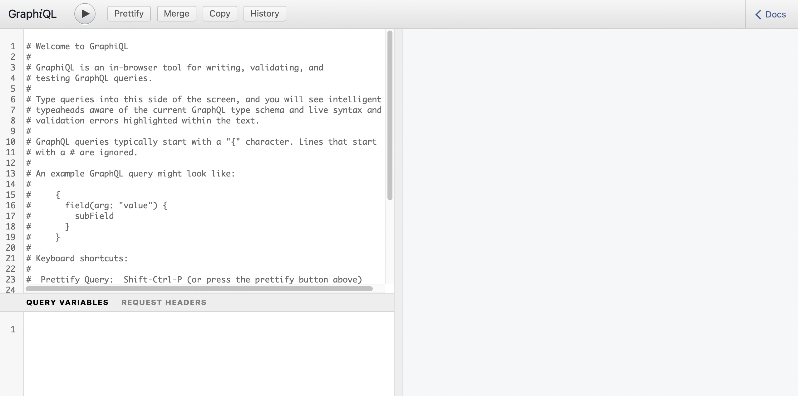

# Guida rapida all’accesso e alla distribuzione di frammenti di contenuto senza intestazione {#accessing-delivering-content-fragments}

Scopri come utilizzare AEM API REST di Assets per gestire i frammenti di contenuto e l’API GraphQL per la distribuzione headless di contenuti con frammenti di contenuto.

## Cosa sono le API REST di GraphQL e Assets? {#what-are-the-apis}

[Dopo aver creato alcuni frammenti di contenuto,](create-content-fragment.md) puoi utilizzare le API AEM per distribuirle senza problemi.

* [API GraphQL](/help/assets/content-fragments/graphql-api-content-fragments.md) consente di creare richieste per accedere e distribuire frammenti di contenuto.
   * Per utilizzare questo [gli endpoint devono essere definiti e abilitati in AEM](/help/assets/content-fragments/graphql-api-content-fragments.md#enabling-graphql-endpoint) e, se necessario, l’[Interfaccia GraphiQL deve essere installata](/help/assets/content-fragments/graphql-api-content-fragments.md#installing-graphiql-interface).
* [API REST di Assets](/help/assets/assets-api-content-fragments.md) consente di creare e modificare frammenti di contenuto (e altre risorse).

Il resto di questa guida sarà incentrato sull’accesso a GraphQL e la distribuzione di frammenti di contenuto.

## Come consegnare un frammento di contenuto utilizzando GraphQL {#how-to-deliver-a-content-fragment}

Gli architetti di informazioni dovranno progettare query per i loro endpoint di canale per distribuire contenuti. In genere queste query devono essere considerate solo una volta per endpoint per modello. Ai fini di questa guida introduttiva, è sufficiente crearne una.

1. Accedi a AEM e accedi al [Interfaccia GraphiQL](/help/assets/content-fragments/graphiql-ide.md):
   * Esempio: `http://<host>:<port>/aem/graphiql.html`.

1. GraphiQL è un editor di query interno al browser per GraphQL. Puoi utilizzarlo per creare query per recuperare frammenti di contenuto e distribuirli direttamente come JSON.
   * Il pannello a sinistra ti consente di creare la query.
   * Nel pannello a destra vengono visualizzati i risultati.
   * L’editor delle query dispone del completamento del codice e dei tasti di scelta rapida per eseguire facilmente la query.
      

1. Supponendo che il modello che abbiamo creato si chiama `person` con campi `firstName`, `lastName` e `position`, possiamo creare una semplice query per recuperare il contenuto del frammento di contenuto.

   ```text
   query 
   {
     personList {
       items {
         _path
         firstName
         lastName
         position
       }
     }
   }
   ```

1. Inserisci la query nel pannello a sinistra.

<!--
   
-->

1. Fai clic sul pulsante **Esegui query** (freccia destra) o utilizza la `Ctrl-Enter` il tasto di scelta rapida e i risultati vengono visualizzati come JSON nel pannello di destra.
   

1. Clic:
   * **Documenti** in alto a destra della pagina per visualizzare la documentazione contestuale per aiutarti a creare le query che si adattano ai tuoi modelli.
   * **Cronologia** nella barra degli strumenti superiore per visualizzare le query precedenti.
   * **Salva con nome** e **Salva** per salvare le query, dopodiché è possibile elencarle e recuperarle dalla **Query persistenti** pannello e **Pubblica**.
      

GraphQL consente query strutturate in grado di eseguire il targeting non solo di set di dati specifici o di singoli oggetti di dati, ma anche di fornire elementi specifici degli oggetti, risultati nidificati, offerte di supporto per variabili di query e molto altro.

GraphQL può evitare richieste API iterative e consegna in eccesso, e consente invece la distribuzione in massa di esattamente ciò che è necessario per il rendering come risposta a una singola query API. Il JSON risultante può essere utilizzato per inviare dati ad altri siti o app.

## Passaggi successivi {#next-steps}

Tutto qui. Ora hai una conoscenza di base della gestione dei contenuti headless in AEM. Naturalmente, sono disponibili molte altre risorse da approfondire per una comprensione completa delle funzioni disponibili.

* **[Browser di configurazione](create-configuration.md)** - Per informazioni dettagliate sul browser di configurazione AEM
* **[Frammenti di contenuto](/help/assets/content-fragments/content-fragments.md)**: per informazioni dettagliate sulla creazione e la gestione dei frammenti di contenuto
* **[IDE GraphiQL](/help/assets/content-fragments/graphiql-ide.md)** per ulteriori dettagli sull&#39;utilizzo dell&#39;IDE GraphiQL
* **[Query persistenti](/help/assets/content-fragments/persisted-queries.md)** per ulteriori dettagli sulle query persistenti
* **[Supporto per frammenti di contenuto nell’API HTTP di AEM Assets](/help/assets/assets-api-content-fragments.md)**: per informazioni dettagliate sull’accesso diretto ai contenuti AEM tramite l’API HTTP, mediante operazioni CRUD (Crea, Leggi, Aggiorna, Elimina)
* **[API di GraphQL](/help/assets/content-fragments/graphql-api-content-fragments.md)**: per informazioni dettagliate su come distribuire i frammenti di contenuto in modo corretto
