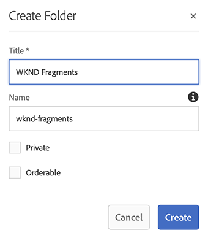
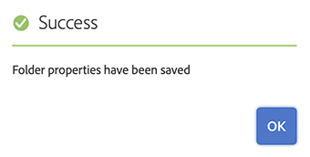

# Guida rapida alla creazione di una cartella Assets Headless {#creating-an-assets-folder}

Utilizza AEM modelli di frammenti di contenuto per definire la struttura dei frammenti di contenuto, la base del contenuto headless. I frammenti di contenuto vengono quindi memorizzati nelle cartelle delle risorse.

##  Cos’è una cartella di risorse? {#what-is-an-assets-folder}

[Ora che hai creato modelli di frammenti di contenuto](create-content-model.md) che definiscono la struttura desiderata per i futuri frammenti di contenuto, probabilmente è consigliabile creare alcuni frammenti.

Tuttavia, dovrai innanzitutto creare una cartella di risorse in cui memorizzarle.

Le cartelle di risorse vengono utilizzate per [organizzare risorse di contenuti tradizionali](/help/assets/manage-assets.md) come immagini e video e frammenti di contenuto.

## Come creare una cartella di risorse {#how-to-create-an-assets-folder}

Un amministratore deve creare le cartelle solo occasionalmente per organizzare i contenuti durante la creazione. Ai fini di questa guida introduttiva, è sufficiente creare una sola cartella.

1. Accedi a AEM e dal menu principale seleziona **Navigazione -> Risorse -> File**.
1. Tocca o fai clic su **Crea -> Cartella**.
1. Fornisci un **Titolo** e **Nome** per la cartella.
   * La **Titolo** deve essere descrittivo.
   * La **Nome** diventerà il nome del nodo nel repository.
      * Viene generato automaticamente in base al titolo e viene regolato in base a [AEM convenzioni di denominazione.](/help/sites-developing/naming-conventions.md)
      * Può essere regolato se necessario.

   
1. Seleziona la cartella appena creata, quindi seleziona **Proprietà** dalla barra degli strumenti (oppure utilizza la `p` [scelte rapide da tastiera.](/help/sites-authoring/keyboard-shortcuts.md))
1. In **Proprietà** seleziona la finestra **Cloud Services** scheda .
1. Per **Configurazione cloud** Seleziona la [configurazione creata in precedenza.](create-configuration.md)

   
1. Tocca o fai clic su **Salva e chiudi**.
1. Tocca o fai clic su **OK** nella finestra di conferma.

   

È possibile creare ulteriori sottocartelle all’interno della cartella appena creata. Le sottocartelle erediteranno le **Configurazione cloud** della cartella principale. Tuttavia, questo può essere ignorato se desideri utilizzare modelli di un’altra configurazione.

Se utilizzi una struttura del sito localizzata, puoi [creare una directory principale della lingua](/help/assets/multilingual-assets.md) sotto la nuova cartella.

## Passaggi successivi {#next-steps}

Dopo aver creato una cartella per i frammenti di contenuto, puoi passare alla quarta parte della guida introduttiva e [creare frammenti di contenuto.](create-content-fragment.md)

>[!TIP]
>
>Per informazioni complete sulla gestione dei frammenti di contenuto, consulta la sezione [Documentazione sui frammenti di contenuto](/help/assets/content-fragments/content-fragments.md)
