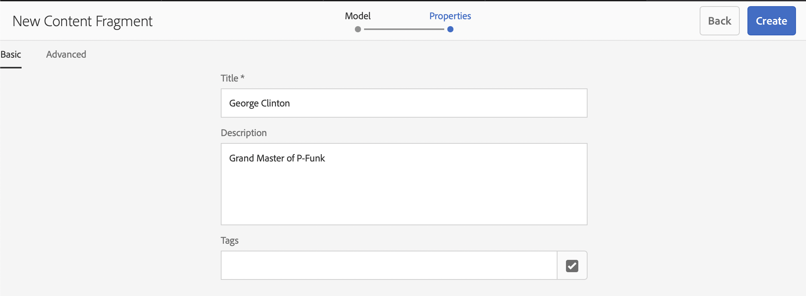

# Guida rapida alla creazione di frammenti di contenuto headless {#creating-content-fragments}

Scopri come utilizzare i Frammenti di contenuto AEM per progettare, creare, curare e utilizzare contenuti indipendenti dalla pagina per la consegna headless.

## Cosa sono i Frammenti di contenuto? {#what-are-content-fragments}

[Ora che hai creato una cartella risorse](create-assets-folder.md) nella quale puoi archiviare i Frammenti di contenuto, puoi cominciare a crearli.

I frammenti di contenuto ti consentono di progettare, creare, curare e pubblicare contenuti indipendenti dalle pagine. Consentono di preparare contenuti pronti per l&#39;uso in più posizioni e su più canali.

I Frammenti di contenuto contengono contenuto strutturato e possono essere consegnati in formato JSON.

## Come creare un Frammento di contenuto {#how-to-create-a-content-fragment}

Gli autori dei contenuti creano un certo numero di Frammenti di contenuto per rappresentare il contenuto creato. Questa sarà l’attività principale dei Frammenti di contenuto in AEM. Ai fini di questa guida introduttiva, ne creeremo uno.

1. Accedi all’AEM e dal menu principale seleziona **Navigazione > Risorse**.
1. Accedi a [cartella creata in precedenza.](create-assets-folder.md)
1. Clic **Crea > Frammento di contenuto**.
1. La creazione di un Frammento di contenuto viene presentata come una procedura guidata in due passaggi. Seleziona innanzitutto il modello da utilizzare per creare il frammento di contenuto e fai clic su **Successivo**.
   * I modelli disponibili dipendono dalla [**configurazione cloud** definita per la cartella risorse](create-assets-folder.md) in cui stai creando il frammento di contenuto.
   * Se ricevi il messaggio `We could not find any models`, controlla la configurazione della cartella delle risorse.

   
1. Fornisci un **Titolo**, **Descrizione**, e **Tag** in base alle esigenze e fai clic su **Crea**.

   
1. Clic **Apri** nella finestra di conferma.

   
1. Fornisci i dettagli del Frammento di contenuto nell’Editor frammento di contenuto.

   
1. Clic **Salva** o  **Salva e chiudi**.

I Frammenti di contenuto possono fare riferimento ad altri Frammenti di contenuto, consentendo se necessario una struttura di contenuto nidificata.

I Frammenti di contenuto possono fare riferimento ad altre risorse in AEM. [Queste risorse devono essere memorizzate in AEM](/help/assets/manage-assets.md) prima di creare un riferimento in un Frammento di contenuto.

## Passaggi successivi {#next-steps}

Dopo aver creato un Frammento di contenuto, puoi passare alla parte finale della guida introduttiva e [creare richieste API per accedere e distribuire frammenti di contenuto.](create-api-request.md)

>[!TIP]
>
>Per informazioni complete sulla gestione dei Frammenti di contenuto, consulta la sezione [Documentazione sui Frammenti di contenuto](/help/assets/content-fragments/content-fragments.md).
