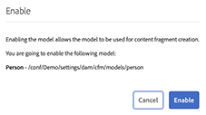

# Guida rapida alla creazione di modelli per frammenti di contenuto headless {#creating-content-fragment-models}

Definisci la struttura del contenuto creato e distribuito utilizzando le funzionalità headless di Adobe Experience Manager (AEM) utilizzando i modelli per frammenti di contenuto.

## Cosa sono i modelli per frammenti di contenuto? {#what-are-content-fragment-models}

[Ora che hai creato una configurazione,](create-configuration.md) puoi utilizzarla per creare modelli per frammenti di contenuto.

I modelli per frammenti di contenuto definiscono la struttura dei dati e del contenuto che puoi creare e gestire in AEM. Servono come una sorta di impalcatura per i tuoi contenuti. Quando si sceglie di creare i contenuti, gli autori selezionano dai modelli per frammenti di contenuto da te definiti, che li guidano nella creazione del contenuto.

## Creare un modello per frammenti di contenuto {#how-to-create-a-content-fragment-model}

Un architetto dell’informazione esegue tali attività solo occasionalmente, quando sono necessari nuovi modelli. Ai fini di questa guida introduttiva, stai creando un solo modello.

1. Accedi ad AEM e dal menu principale seleziona **Strumenti > Assets > Modelli per frammenti di contenuto**.
1. Fai clic sulla cartella creata durante la creazione della configurazione.

   
1. Fai clic su **Crea**.
1. Fornisci un **Titolo modello**, **Tag** e **Descrizione**. Puoi anche selezionare/deselezionare **Abilita modello** per assicurarti che il modello venga subito abilitato al momento della creazione.

   
1. Nella finestra di conferma, fai clic su **Apri** per configurare il modello.

   
1. Utilizzando l’**Editor modello per frammenti di contenuto**, crea il modello per frammenti di contenuto trascinando i campi dalla colonna **Tipi di dati**.

   

1. Dopo aver inserito un campo, è necessario configurarne le proprietà. L&#39;editor passa automaticamente alla scheda **Proprietà** per il campo aggiunto in cui è possibile fornire i campi obbligatori.

   
1. Al termine della creazione del modello, fare clic su **Salva**.

1. La modalità del modello appena creato dipende dalla selezione o meno dell’opzione **Abilita modello** durante la creazione dello stesso:
   * selezionato - il nuovo modello è già **abilitato**
   * non selezionato: il nuovo modello viene creato nella modalità **Bozza**

1. Se non è già abilitato, per poter essere utilizzato il modello deve essere **abilitato**.
   1. Selezionare il modello creato, quindi fare clic su **Abilita**.

      
   1. Conferma l’abilitazione del modello toccando o facendo clic su **Abilita** nella finestra di dialogo di conferma.

      
1. Il modello è ora abilitato e pronto per essere utilizzato.

   

L&#39;**Editor modello per frammenti di contenuto** supporta diversi tipi di dati, ad esempio campi di testo semplice, riferimenti alle risorse, riferimenti ad altri modelli e dati JSON.

Puoi creare più modelli. I modelli possono fare riferimento ad altri frammenti di contenuto. Utilizza le [configurazioni](create-configuration.md) per organizzare i modelli.

## Passaggi successivi {#next-steps}

Dopo aver definito le strutture dei frammenti di contenuto mediante la creazione di modelli, puoi passare alla terza parte della guida introduttiva e [creare cartelle in cui memorizzare i frammenti.](create-assets-folder.md)

>[!TIP]
>
>Per informazioni complete sui modelli per frammenti di contenuto, consulta la [documentazione sui modelli per frammenti di contenuto](/help/assets/content-fragments/content-fragments-models.md)
