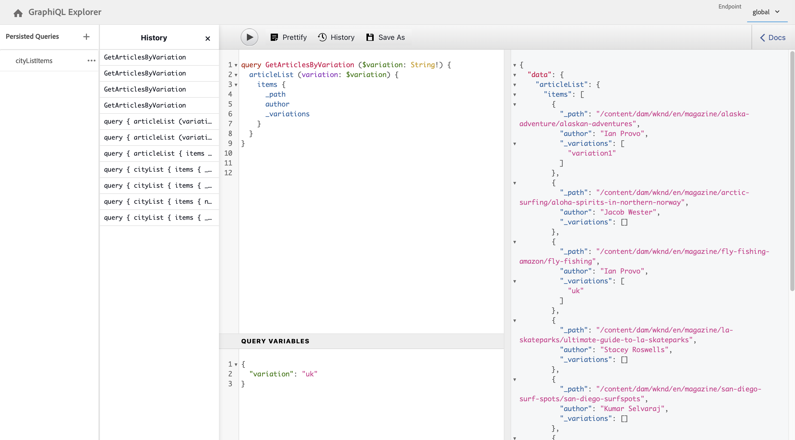

# API GraphQL AEM per l’utilizzo con Frammenti di contenuto {#graphql-api-for-use-with-content-fragments}

Scopri come utilizzare Frammenti di contenuto in Adobe Experience Manager (AEM) con l’API GraphQL dell’AEM per la distribuzione di contenuti headless.

L’API GraphQL dell’AEM utilizzata con i Frammenti di contenuto si basa in larga misura sull’API GraphQL standard open-source.

L’utilizzo dell’API GraphQL in AEM consente la consegna efficiente di Frammenti di contenuto ai client JavaScript in implementazioni CMS headless:

* evita richieste API iterative come con REST,
* garantisce che la consegna sia limitata ai requisiti specifici,
* consente la consegna in massa di ciò che è esattamente necessario per il rendering come risposta a una singola query API.

>[!NOTE]
>
>GraphQL viene utilizzato in due scenari (separati) in Adobe Experience Manager (AEM):
>
>* [AEM Commerce sfrutta i dati da una piattaforma Commerce tramite GraphQL](/help/commerce/cif/integrating/magento.md).
>* I Frammenti di contenuto AEM collaborano con l’API GraphQL di AEM (un’implementazione personalizzata, basata su GraphQL standard) per fornire contenuti strutturati da utilizzare nelle applicazioni.

## Prerequisiti {#prerequisites}

I clienti che utilizzano GraphQL devono installare il pacchetto 1.0.5 dell’indice Frammento di contenuto AEM con GraphQL. Consulta la [Note sulla versione](/help/release-notes/release-notes.md#install-aem-graphql-index-add-on-package) per ulteriori dettagli.

## API GraphQL {#graphql-api}

GraphQL è:

* “*...un linguaggio di query per le API e un runtime per l’esecuzione di tali query con i dati esistenti. GraphQL fornisce una descrizione completa e comprensibile dei dati nell’API. Offre ai clienti la possibilità di chiedere esattamente ciò di cui hanno bisogno e niente di più, semplifica l’evoluzione delle API nel tempo e abilita potenti strumenti per gli sviluppatori.*&quot;.

  Vedi [GraphQL.org](https://graphql.org)

* “*...una specifica aperta per un livello API flessibile. Posiziona GraphQL sui backend esistenti per creare prodotti più rapidamente che mai....*&quot;.

  Vedi [Esplorare GraphQL](https://graphql.com/).

* *&quot;...un linguaggio e una specifica di query di dati sviluppati internamente da Facebook nel 2012 prima di essere resi open source nel 2015. Offre un’alternativa alle architetture basate su REST allo scopo di aumentare la produttività degli sviluppatori e ridurre al minimo le quantità di dati trasferiti. GraphQL viene utilizzato in produzione da centinaia di organizzazioni di tutte le dimensioni...”*

  Vedi [GraphQL Foundation](https://graphql.org/foundation).

<!--
"*Explore GraphQL is maintained by the Apollo team. Our goal is to give developers and technical leaders around the world all the tools they need to understand and adopt GraphQL.*". 
-->

Per ulteriori informazioni sull’API di GraphQL, consulta le sezioni seguenti (tra molte altre risorse):

* In [graphql.org](https://graphql.org):

   * [Introduzione a GraphQL](https://graphql.org/learn)

   * [Specifiche GraphQL](https://spec.graphql.org/)

* In [graphql.com](https://graphql.com):

   * [Esercitazioni](https://graphql.com/tutorials/)


L’implementazione di GraphQL per AEM si basa sulla libreria Java™ standard di GraphQL. Consulta:

* [graphQL.org - Java](https://graphql.org/code/#java)

* [Java™ GraphQL su GitHub](https://github.com/graphql-java)

### Terminologia GraphQL {#graphql-terminology}

GraphQL utilizza quanto segue:

* **[Query](https://graphql.org/learn/queries/)**

* **[Schemi e tipi](https://graphql.org/learn/schema/)**:

   * Gli schemi vengono generati da AEM in base ai modelli di Frammenti di contenuto.
   * Utilizzando i tuoi schemi, GraphQL presenta i tipi e le operazioni consentiti per l’implementazione GraphQL per AEM.

* **[Campi](https://graphql.org/learn/queries/#fields)**

* **[Endpoint GraphQL](/help/sites-developing/headless/graphql-api/graphql-endpoint.md#graphql-aem-endpoint)**
   * Il percorso in AEM che risponde alle query GraphQL e fornisce accesso agli schemi GraphQL.

   * Consulta [Abilitazione dell’endpoint GraphQL](/help/sites-developing/headless/graphql-api/graphql-endpoint.md#enabling-graphql-endpoint) per ulteriori dettagli.

Consulta[(GraphQL.org) Introduzione a GraphQL](https://graphql.org/learn/) per informazioni complete, che comprendono le [Best practice](https://graphql.org/learn/best-practices/).

### Tipi di query GraphQL {#graphql-query-types}

Con GraphQL è possibile eseguire query per ottenere:

* Un **ingresso singolo**

* Un **[elenco delle voci](https://graphql.org/learn/schema/#lists-and-non-null)**

AEM fornisce funzionalità per convertire le query (di entrambi i tipi) in [Query persistenti](/help/sites-developing/headless/graphql-api/persisted-queries.md) memorizzate nella cache da Dispatcher e dalla rete CDN.

### Best practice per le query GraphQL (Dispatcher e CDN) {#graphql-query-best-practices}

[Query persistenti](/help/sites-developing/headless/graphql-api/persisted-queries.md) è il metodo consigliato da utilizzare sulle istanze di pubblicazione come:

* vengono memorizzate nella cache;
* sono gestiti centralmente dall’AEM

<!-- is this fully accurate? -->
>[!NOTE]
>
>In genere non esiste una rete Dispatcher/CDN sull’authoring, quindi non vi è alcun miglioramento delle prestazioni nell’utilizzo di query persistenti, a parte testarle.

Le query GraphQL con l’utilizzo di POST non sono consigliate in quanto non sono memorizzate nella cache. Quindi, in un’istanza predefinita, Dispatcher è configurato per bloccarle.

Anche se GraphQL supporta le richieste di GET, queste possono raggiungere dei limiti (ad esempio, la lunghezza dell’URL) che possono essere evitati utilizzando query persistenti.

Consulta [Abilita la memorizzazione nella cache delle query persistenti](#enable-caching-persisted-queries) per ulteriori dettagli.

>[!NOTE]
>
>In futuro, la capacità di eseguire query dirette potrebbe diventare obsoleta.

## Interfaccia GraphiQL {#graphiql-interface}

Un’implementazione dello standard [GraphiQL](https://graphql.org/learn/serving-over-http/#graphiql) L’interfaccia di è disponibile per l’utilizzo con AEM GraphQL.

>[!NOTE]
>
>GraphiQL è incluso in tutti gli ambienti dell’AEM (ma è accessibile/visibile solo quando configuri gli endpoint).
>
>Nelle versioni precedenti, era necessario un pacchetto per installare l’IDE GraphiQL. Se hai installato questo pacchetto, ora puoi rimuoverlo.

Questa interfaccia consente di inserire e testare direttamente le query.

Ad esempio:

* `http://localhost:4502/content/graphiql.html`

Fornisce funzioni quali evidenziazione della sintassi, completamento automatico, suggerimento automatico, nonché una cronologia e una documentazione online:


>[!NOTE]
>
>Consulta [Utilizzo dell’IDE GraphiQL](/help/sites-developing/headless/graphql-api/graphiql-ide.md).

## Casi di utilizzo per ambienti di authoring e pubblicazione {#use-cases-author-publish-environments}

I casi d’uso possono dipendere dal tipo di ambiente AEM:

* ambiente di pubblicazione; utilizzato per:
   * effettuare query sui dati per l’applicazione JS (caso di utilizzo standard)

* ambiente di authoring; utilizzato per:
   * effettuare query sui dati a “scopo di gestione dei contenuti”:
      * GraphQL nell’AEM è un’API di sola lettura.
      * L’API REST può essere utilizzata per le operazioni CR(u)D.

## Autorizzazioni {#permission}

Le autorizzazioni sono necessarie per accedere ad Assets.

Le query GraphQL vengono eseguite con l’autorizzazione dell’utente AEM della richiesta sottostante. Se l’utente non dispone dell’accesso in lettura ad alcuni frammenti (memorizzati come Risorse), essi non diventano parte del set di risultati.

Inoltre, l’utente deve avere accesso a un endpoint GraphQL per poter eseguire query GraphQL.

## Generazione schema {#schema-generation}

GraphQL è un’API tipizzata, il che significa che i dati devono essere chiaramente strutturati e organizzati per tipo.

La specifica GraphQL fornisce una serie di linee guida su come creare una solida API per l’interrogazione dei dati su una determinata istanza. Per completare queste linee guida, un client deve recuperare [Schema](#schema-generation), che contiene tutti i tipi necessari per una query.

Per quanto riguarda i Frammenti di contenuto, gli schemi GraphQL (struttura e tipi) sono basati su [modelli di Frammenti di contenuto](/help/assets/content-fragments/content-fragments-models.md) **abilitati** e i relativi tipi di dati.

>[!CAUTION]
>
>Tutti gli schemi GraphQL (derivati dai modelli di Frammenti di contenuto che sono stati **abilitati**) sono leggibili attraverso l’endpoint GraphQL.
>
>Ciò significa che devi assicurarti che non siano disponibili dati sensibili, in quanto potrebbero trapelare in questo modo. Ad esempio, include informazioni che potrebbero essere presenti come nomi di campo nella definizione del modello.

Ad esempio, se un utente ha creato un modello di frammento di contenuto denominato `Article`, AEM genera un tipo GraphQL `ArticleModel`. I campi all’interno di questo tipo corrispondono ai campi e ai tipi di dati definiti nel modello. Inoltre, crea alcuni punti di ingresso per le query che operano su questo tipo, come `articleByPath` o `articleList`.

1. Modello di Frammento di contenuto:

   

1. Lo schema GraphQL corrispondente (output dalla documentazione automatica GraphiQL):
   

   Questa immagine mostra che il tipo generato `ArticleModel` contiene diversi [campi](#fields).

   * Tre di essi sono stati controllati dall’utente: `author`, `main`, e `referencearticle`.

   * Gli altri campi sono stati aggiunti automaticamente dall’AEM e rappresentano metodi utili per fornire informazioni su un determinato frammento di contenuto. In questo esempio, (il [campi di supporto](#helper-fields)) `_path`, `_metadata`, `_variations`.

1. Un Frammento di contenuto basato sul modello di articolo creato da un utente può essere interrogato tramite GraphQL. Per esempi, consulta la sezione [Query di esempio](/help/sites-developing/headless/graphql-api/content-fragments-graphql-samples.md#graphql-sample-queries) (basata su una [struttura di Frammento di contenuto di esempio da utilizzare con GraphQL](/help/sites-developing/headless/graphql-api/content-fragments-graphql-samples.md#content-fragment-structure-graphql)).

In GraphQL per AEM, lo schema è flessibile. Questa flessibilità significa che viene generata automaticamente ogni volta che viene creato, aggiornato o eliminato un modello per frammenti di contenuto. Le cache dello schema dati vengono aggiornate anche quando si rivede un modello di Frammento di contenuto.

Il servizio GraphQL di Sites ascolta (in background) le modifiche apportate a un modello di Frammento di contenuto. Quando vengono rilevati aggiornamenti, viene rigenerata solo la parte dello schema. Questa ottimizzazione consente di risparmiare tempo e garantisce stabilità.

Ad esempio, se:

1. Installi un pacchetto contenente `Content-Fragment-Model-1` e `Content-Fragment-Model-2`:

   1. sono generati tipi di GraphQL per `Model-1` e `Model-2`.

1. Poi modifica `Content-Fragment-Model-2`:

   1. Solo il `Model-2` Il tipo di GraphQL viene aggiornato.

   1. considerando che `Model-1` rimane lo stesso.

>[!NOTE]
>
>Questo dettaglio è importante da notare solo nel caso in cui si desideri eseguire aggiornamenti in blocco sui modelli per frammenti di contenuto tramite l’API REST o in altro modo.

Lo schema viene gestito attraverso lo stesso endpoint delle query GraphQL, dove il client gestisce il fatto che lo schema viene chiamato con l’estensione `GQLschema`. Ad esempio, l’esecuzione di un’attività `GET` richiesta su `/content/cq:graphql/global/endpoint.GQLschema` determina l’output dello schema con il tipo di contenuto: `text/x-graphql-schema;charset=iso-8859-1`.

### Generazione schema: modelli non pubblicati {#schema-generation-unpublished-models}

Quando i frammenti di contenuto sono nidificati, può accadere che venga pubblicato un modello di Frammento di contenuto principale, ma non il modello di riferimento.

>[!NOTE]
>
>L’interfaccia utente dell’AEM impedisce che ciò accada, ma se la pubblicazione viene effettuata a livello di programmazione o con pacchetti di contenuti può verificarsi.

In questi casi, l’AEM genera un’ *incompleto* Schema per il modello per frammenti di contenuto principale. Significa che il Riferimento frammento, che dipende dal modello non pubblicato, viene rimosso dallo schema.

## Campi {#fields}

Nello schema sono presenti singoli campi, di due categorie di base:

* Campi generati dall’utente.

  Per creare campi in base alla modalità di configurazione del modello di frammento di contenuto, viene utilizzata una selezione di [Tipi di dati](#data-types). I nomi dei campi vengono ricavati dal campo **Nome proprietà** del **Tipo di dato**.

   * È inoltre disponibile **Rendering come** da considerare, in quanto gli utenti possono configurare determinati tipi di dati. Ad esempio, un campo di testo a riga singola può essere configurato per contenere più testi a riga singola scegliendo `multifield` dal menu a discesa.

* GraphQL per AEM genera anche diversi [campi di supporto](#helper-fields).

  Questi campi vengono utilizzati per identificare un frammento di contenuto o per ottenere ulteriori informazioni su di esso.

### Tipi di dati {#data-types}

GraphQL per AEM supporta un elenco di tipi. Vengono rappresentati tutti i tipi di dati dei modelli di Frammento di contenuto supportati e i corrispondenti tipi GraphQL:

| Modello di Frammento di contenuto: tipo di dati | Tipo GraphQL | Descrizione |
|--- |--- |--- |
| Testo su riga singola | `String`, `[String]` |  Utilizzato per stringhe semplici come i nomi degli autori e i nomi delle posizioni. |
| Testo su più righe | `String` |  Utilizzato per l’output di testo, ad esempio il corpo di un articolo |
| Numero |  `Float`, `[Float]` | Utilizzato per visualizzare il numero a virgola mobile e i numeri regolari |
| Booleano |  `Boolean` |  Utilizzato per visualizzare le caselle di controllo → semplici istruzioni true/false |
| Data e ora | `Calendar` |  Utilizzato per visualizzare la data e l’ora in formato ISO 8086. A seconda del tipo selezionato, sono disponibili tre versioni da utilizzare in AEM GraphQL: `onlyDate`, `onlyTime`, `dateTime` |
| Enumerazione |  `String` |  Utilizzato per visualizzare un’opzione da un elenco di opzioni definito durante la creazione del modello |
|  Tag |  `[String]` |  Utilizzato per visualizzare un elenco di stringhe che rappresentano tag utilizzati in AEM |
| Riferimento contenuto |  `String` |  Utilizzato per visualizzare il percorso per un’altra risorsa in AEM |
| Riferimento frammento |  *Un tipo di modello* <br><br>Campo singolo: `Model` - Tipo di modello, con riferimento diretto <br><br>Multifield, con un tipo di riferimento: `[Model]` - Array di tipo `Model`, a cui si fa riferimento direttamente dall’array <br><br>Multifield, con più tipi di riferimento: `[AllFragmentModels]` - Array di tutti i tipi di modello, con riferimento da array con tipo di unione |  Utilizzato per fare riferimento a uno o più frammenti di contenuto di alcuni tipi di modelli, definiti al momento della creazione del modello |

{style="table-layout:auto"}

### Campi di supporto {#helper-fields}

Oltre ai tipi di dati per i campi generati dall’utente, GraphQL per AEM genera anche diversi *aiutante* per identificare un frammento di contenuto o per fornire informazioni aggiuntive su un frammento di contenuto.

Tali [campi di supporto](#helper-fields) sono contrassegnati con un `_` precedente per distinguere tra ciò che è stato definito dall’utente e ciò che è stato generato automaticamente.

#### Percorso {#path}

In AEM GraphQL, il campo del percorso viene utilizzato come identificatore. Rappresenta il percorso della risorsa Frammenti di contenuto all’interno dell’archivio AEM. Questo percorso viene scelto come identificatore di un frammento di contenuto in quanto:

* è univoco all’interno di AEM,
* può essere facilmente recuperato.

Il codice seguente visualizza i percorsi di tutti i frammenti di contenuto creati in base al modello per frammenti di contenuto `Person`.

```graphql
{
  personList {
    items {
      _path
    }
  }
}
```

Per recuperare un singolo frammento di contenuto di un tipo specifico, devi prima determinarne il percorso. Esempio:

```graphql
{
  authorByPath(_path: "/content/dam/path/to/fragment/john-doe") {
    item {
      _path
      firstName
      name
    }
  }
}
```

Vedi [Query di esempio: un singolo frammento di città specifico](/help/sites-developing/headless/graphql-api/content-fragments-graphql-samples.md#sample-single-specific-city-fragment).

#### Metadati {#metadata}

Tramite GraphQL, AEM espone inoltre i metadati di un frammento di contenuto. I metadati sono informazioni che descrivono un frammento di contenuto, ad esempio quanto segue:

* titolo di un frammento di contenuto
* il percorso della miniatura
* la descrizione di un frammento di contenuto
* e la data di creazione, tra le altre.

Poiché i metadati vengono generati tramite l’Editor schemi e, pertanto, non dispongono di una struttura specifica, il tipo di `TypedMetaData` GraphQL è stato implementato per esporre i metadati di un frammento di contenuto. Il `TypedMetaData` espone le informazioni raggruppate per i seguenti tipi scalari:

| Campo |
|--- |
| `stringMetadata:[StringMetadata]!` |
| `stringArrayMetadata:[StringArrayMetadata]!` |
| `intMetadata:[IntMetadata]!` |
| `intArrayMetadata:[IntArrayMetadata]!` |
| `floatMetadata:[FloatMetadata]!` |
| `floatArrayMetadata:[FloatArrayMetadata]!` |
| `booleanMetadata:[BooleanMetadata]!` |
| `booleanArrayMetadata:[booleanArrayMetadata]!`  |
| `calendarMetadata:[CalendarMetadata]!` |
| `calendarArrayMetadata:[CalendarArrayMetadata]!` |

Ogni tipo scalare rappresenta una coppia nome-valore singola o un array di coppie nome-valore, in cui il valore di tale coppia è del tipo all&#39;interno del quale è stato raggruppato.

Ad esempio, se desideri recuperare il titolo di un frammento di contenuto, questa proprietà è una proprietà Stringa e puoi quindi eseguire una query per tutti i metadati stringa:

Per eseguire una query per i metadati:

```graphql
{
  personByPath(_path: "/content/dam/path/to/fragment/john-doe") {
    item {
      _path
      _metadata {
        stringMetadata {
          name
          value
        }
      }
    }
  }
}
```

Puoi visualizzare tutti i tipi di metadati GraphQL se visualizzi lo schema GraphQL generato. Tutti i tipi di modello hanno lo stesso `TypedMetaData`.

>[!NOTE]
>
>**Differenza tra metadati normali e quelli di array**
>Nota: `StringMetadata` e `StringArrayMetadata` si riferiscono a ciò che è memorizzato nell’archivio, non alla modalità di recupero.
>
>Ad esempio, chiamando `stringMetadata` , si riceve un array di tutti i metadati memorizzati nell&#39;archivio come `String`. E se chiami `stringArrayMetadata`, si riceve un array di tutti i metadati memorizzati nell’archivio come `String[]`.

Vedi [Query di esempio per metadati: elenca i metadati per riconoscimenti con titolo GB](/help/sites-developing/headless/graphql-api/content-fragments-graphql-samples.md#sample-metadata-awards-gb).

#### Varianti {#variations}

Il campo `_variations` è stato implementato per semplificare l’esecuzione delle query sulle varianti di un frammento di contenuto. Esempio:

```graphql
{
  personByPath(_path: "/content/dam/path/to/fragment/john-doe") {
    item {
      _variations
    }
  }
}
```

>[!NOTE]
>
>Il `_variations` il campo non contiene `master` variazione, come tecnicamente i dati originali (cui si fa riferimento come *Principale* nell’interfaccia utente) non è considerata una variante esplicita.

Vedi [Query di esempio: tutte le città con una variante denominata](/help/sites-developing/headless/graphql-api/content-fragments-graphql-samples.md#sample-cities-named-variation).

>[!NOTE]
>
>Se per un frammento di contenuto non esiste la variante determinata, i dati originali (noti anche come variante primaria) vengono restituiti come impostazione predefinita (fallback).

<!--
## Security Considerations {#security-considerations}
-->

## Variabili GraphQL {#graphql-variables}

GraphQL consente di inserire variabili nella query. Per ulteriori informazioni, consulta la [documentazione di GraphQL per variabili](https://graphql.org/learn/queries/#variables).

Ad esempio, per ottenere tutti i frammenti di contenuto di tipo `Article` che hanno una variante specifica, puoi specificare la variabile `variation` in GraphiQL.



```graphql
### query
query GetArticlesByVariation($variation: String!) {
    articleList(variation: $variation) {
        items {
            _path
            author
            _variations
        }
    }
}
 
### in query variables
{
    "variation": "uk"
}
```

## Direttive GraphQL {#graphql-directives}

In GraphQL è possibile modificare la query basata su variabili, denominate Direttive GraphQL.

Ad esempio, puoi includere il campo `adventurePrice` in una query per tutti i `AdventureModels` basati su una variabile `includePrice`.


```graphql
### query
query GetAdventureByType($includePrice: Boolean!) {
  adventureList {
    items {
      adventureTitle
      adventurePrice @include(if: $includePrice)
    }
  }
}
 
### in query variables
{
    "includePrice": true
}
```

## Filtro {#filtering}

Puoi inoltre utilizzare il filtro nelle query GraphQL per restituire dati specifici.

Il filtro utilizza una sintassi basata su operatori ed espressioni di tipo logico.

La parte più atomica è una singola espressione che può essere applicata al contenuto di un determinato campo. Confronta il contenuto del campo con un valore costante specificato.

Ad esempio, l’espressione seguente confronta il contenuto del campo con il valore `some text`e hanno esito positivo se il contenuto è uguale al valore. In caso contrario, l’espressione non riesce.:

```graphql
{
  value: "some text"
  _op: EQUALS
}
```

Per confrontare i campi con un determinato valore è possibile utilizzare i seguenti operatori:

| Operatore | Tipi | L’espressione ha esito positivo se ... |
|--- |--- |--- |
| `EQUALS` | `String`, `ID`, `Boolean` | ... il valore è uguale al contenuto del campo |
| `EQUALS_NOT` | `String`, `ID` | ... il valore *not* è uguale al contenuto del campo |
| `CONTAINS` | `String` | ... il contenuto del campo contiene il valore (`{ value: "mas", _op: CONTAINS }` corrisponde a `Christmas`, `Xmas`, `master`, ...) |
| `CONTAINS_NOT` | `String` | ... il contenuto del campo *non* contiene il valore |
| `STARTS_WITH` | `ID` | ... l’ID inizia con un determinato valore (`{ value: "/content/dam/", _op: STARTS_WITH` corrisponde a `/content/dam/path/to/fragment`, ma non `/namespace/content/dam/something` |
| `EQUAL` | `Int`, `Float` | ... il valore è uguale al contenuto del campo |
| `UNEQUAL` | `Int`, `Float` | ... il valore *non* è uguale al contenuto del campo |
| `GREATER` | `Int`, `Float` | ... il contenuto del campo è maggiore del valore |
| `GREATER_EQUAL` | `Int`, `Float` | ... il contenuto del campo è maggiore o uguale al valore |
| `LOWER` | `Int`, `Float` | ... il contenuto del campo è inferiore al valore |
| `LOWER_EQUAL` | `Int`, `Float` | ... il contenuto del campo è inferiore o uguale al valore |
| `AT` | `Calendar`, `Date`, `Time` | ... il contenuto del campo è uguale al valore (inclusa l’impostazione del fuso orario) |
| `NOT_AT` | `Calendar`, `Date`, `Time` | ... il contenuto del campo *non* è uguale al valore |
| `BEFORE` | `Calendar`, `Date`, `Time` | ... il punto nel tempo indicato dal valore è precedente a quello indicato dal contenuto del campo |
| `AT_OR_BEFORE` | `Calendar`, `Date`, `Time` | ... il punto nel tempo indicato dal valore è precedente o uguale a quello indicato dal contenuto del campo |
| `AFTER` | `Calendar`, `Date`, `Time` | ... il punto nel tempo indicato dal valore è successivo a quello indicato dal contenuto del campo |
| `AT_OR_AFTER` | `Calendar`, `Date`, `Time` | ... il punto nel tempo indicato dal valore è successivo o uguale a quello indicato dal contenuto del campo |

Alcuni tipi consentono inoltre di specificare opzioni aggiuntive che modificano la modalità di valutazione di un&#39;espressione:

| Opzione | Tipi | Descrizione |
|--- |--- |--- |
| `_ignoreCase` | `String` | Ignora le maiuscole/minuscole di una stringa, ad esempio un valore di `time` corrisponde a `TIME`, `time`, `tImE`, ... |
| `_sensitiveness` | `Float` | Consente un certo margine per valori `float` da considerare uguali (per aggirare i limiti tecnici dovuti alla rappresentazione interna dei valori `float`; dovrebbe essere evitata, in quanto questa opzione potrebbe avere un impatto negativo sulle prestazioni |

Le espressioni possono essere combinate in un set tramite un operatore logico (`_logOp`):

* `OR` - l&#39;insieme di espressioni ha esito positivo se almeno un&#39;espressione ha esito positivo
* `AND` - l&#39;insieme di espressioni ha esito positivo se tutte le espressioni hanno esito positivo (impostazione predefinita)

Ogni campo può essere filtrato in base al proprio set di espressioni. I set di espressioni di tutti i campi menzionati nell’argomento filtro vengono infine combinati dal proprio operatore logico.

Una definizione di filtro (passata come argomento `filter` a una query) contiene:

* Una sottodefinizione per ciascun campo (il campo è accessibile tramite il suo nome, ad esempio è presente un `lastName` campo nel filtro per `lastName` nel campo Dati (campo) (tipo)
* Ogni sottodefinizione contiene `_expressions` , che fornisce il set di espressioni e `_logOp` campo che definisce l’operatore logico con cui devono essere combinate le espressioni
* Ciascuna espressione è definita dal valore (campo `value`) e dall’operatore (campo `_operator`) con cui il contenuto di un campo deve essere confrontato

Puoi omettere `_logOp` se si desidera combinare gli elementi con `AND` e `_operator` se desiderate verificare l&#39;uguaglianza, poiché questi valori sono predefiniti.

L’esempio seguente illustra una query completa che filtra tutte le persone con una `lastName` di `Provo` o contenenti `sjö`, indipendentemente dal caso:

```graphql
{
  authorList(filter: {
    lastname: {
      _logOp: OR
      _expressions: [
        {
          value: "sjö",
          _operator: CONTAINS,
          _ignoreCase: true
        },
        {
          value: "Provo"
        }
      ]
    }
  }) {
    items {
      lastName
      firstName
    }
  }
}
```

Quando si esegue una query GraphQL utilizzando variabili facoltative, se un valore specifico è **non** fornito per la variabile opzionale, la variabile verrà ignorata nella valutazione del filtro. Ciò significa che i risultati della query conterranno tutti i valori, entrambi `null` e non `null`, per la proprietà correlata alla variabile di filtro.

>[!NOTE]
>
>Se un `null` il valore è *esplicitamente* specificato per tale variabile, il filtro corrisponderà solo `null` valori per la proprietà corrispondente.

Ad esempio, nella query seguente, dove non è specificato alcun valore per la proprietà `lastName`:

```graphql
query getAuthorsFilteredByLastName($authorLastName: String) {
  authorList(filter:
    {
      lastName: {_expressions: {value: $authorLastName}
      }}) {
    items {
      lastName
    }
  }
}
```

Verranno restituiti tutti gli autori:

```graphql
{
  "data": {
    "authorList": {
      "items": [
        {
          "lastName": "Hammer"
        },
        {
          "lastName": "Provo"
        },
        {
          "lastName": "Wester"
        },
        {
          "lastName": null
        },
         ...
      ]
    }
  }
}
```

È anche possibile filtrare i campi nidificati, ma non è consigliabile, in quanto potrebbe causare problemi di prestazioni.

Per altri esempi, consulta:

* informazioni dettagliate di [GraphQL per estensioni AEM](#graphql-extensions)

* [Query di esempio che utilizzano il contenuto e la struttura di esempio](/help/sites-developing/headless/graphql-api/content-fragments-graphql-samples.md#graphql-sample-queries-sample-content-fragment-structure)

   * e il [contenuto e la struttura di esempio](/help/sites-developing/headless/graphql-api/content-fragments-graphql-samples.md#content-fragment-structure-graphql) predisposta per l’utilizzo in query di esempio

* [Query di esempio basate sul progetto WKND](/help/sites-developing/headless/graphql-api/content-fragments-graphql-samples.md#sample-queries-using-wknd-project)

## Ordinamento {#sorting}

>[!NOTE]
>
>Per prestazioni ottimali, considera [Aggiornamento dei frammenti di contenuto per il paging e l’ordinamento nel filtro GraphQL](/help/sites-developing/headless/graphql-api/graphql-optimized-filtering-content-update.md).

Questa funzione consente di ordinare i risultati della query in base a un campo specificato.

I criteri di ordinamento:

* è un elenco di valori separati da virgole che rappresenta il percorso del campo
   * il primo campo dell&#39;elenco definisce l&#39;ordinamento principale
      * il secondo campo viene utilizzato se due valori del criterio di ordinamento primario sono uguali
      * il terzo campo viene utilizzato se i primi due criteri sono uguali e così via.
   * notazione punteggiata, ovvero `field1.subfield.subfield`e così via.
* con una direzione d’ordine opzionale
   * ASC (crescente) o DESC (decrescente); con l’applicazione di ASC come predefinito
   * la direzione può essere specificata per campo; questa capacità significa che è possibile ordinare un campo in ordine crescente, un altro in ordine decrescente (nome, nome DESC)

Esempio:

```graphql
query {
  authorList(sort: "lastName, firstName") {
    items {
      firstName
      lastName
    }
  }
}
```

Inoltre:

```graphql
{
  authorList(sort: "lastName DESC, firstName DESC") {
    items {
        lastName
        firstName
    }
  }
}
```

È inoltre possibile ordinare in base a un campo all’interno di un frammento nidificato utilizzando il formato `nestedFragmentname.fieldname`.

>[!NOTE]
>
>Questo formato potrebbe avere un impatto negativo sulle prestazioni.

Esempio:

```graphql
query {
  articleList(sort: "authorFragment.lastName")  {
    items {
      title
      authorFragment {
        firstName
        lastName
        birthDay
      }
      slug
    }
  }
}
```

## Paging {#paging}

>[!NOTE]
>
>Per prestazioni ottimali, considera [Aggiornamento dei frammenti di contenuto per il paging e l’ordinamento nel filtro GraphQL](/help/sites-developing/headless/graphql-api/graphql-optimized-filtering-content-update.md).

Questa funzione consente di eseguire il paging sui tipi di query che restituiscono un elenco. Vengono forniti due metodi:

* `offset` e `limit` in una query `List`
* `first` e `after` in una query `Paginated`

### Query elenco: offset e limite {#list-offset-limit}

In una `...List`query puoi utilizzare `offset` e `limit` per ottenere un sottoinsieme specifico di risultati:

* `offset`: specifica il primo set di dati da restituire
* `limit`: specifica il numero massimo di set di dati da restituire

Ad esempio, per un output con la pagina dei risultati contenente fino a cinque articoli, a partire dal quinto articolo dell’elenco dei risultati *completo*:

```graphql
query {
   articleList(offset: 5, limit: 5) {
    items {
      authorFragment {
        lastName
        firstName
      }
    }
  }
}
```

<!-- When available link to BP and replace "JCR query level" with a more neutral term. -->

<!-- When available link to BP and replace "JCR query result set" with a more neutral term. -->

>[!NOTE]
>
>* Il paging richiede un ordinamento stabile per funzionare correttamente in più query che richiedono pagine diverse dello stesso set di risultati. Per impostazione predefinita, utilizza il percorso dell’archivio di ogni elemento del set di risultati per assicurarsi che l’ordine sia sempre lo stesso. Se si utilizza un ordinamento diverso e tale ordinamento non può essere eseguito a livello di query JCR, si verifica un impatto negativo sulle prestazioni. Il motivo è che l’intero set di risultati deve essere caricato in memoria prima che le pagine vengano determinate.
>
>* Maggiore è l’offset, maggiore sarà il tempo necessario per saltare gli elementi dal set completo dei risultati della query JCR. Una soluzione alternativa per i set di risultati di grandi dimensioni è quella di utilizzare la query impaginata con il metodo `first` e `after`.

### Query impaginata: prima e dopo {#paginated-first-after}

Il tipo di query `...Paginated` riutilizza la maggior parte delle funzionalità del tipo di query `...List` (filtro, ordinamento), ma invece di utilizzare gli argomenti `offset`/`limit` utilizza `first`/`after` come definiti in [Specifica delle connessioni del cursore GraphQL](https://relay.dev/graphql/connections.htm). È possibile trovare un’introduzione meno formale in [Introduzione a GraphQL](https://graphql.org/learn/pagination/#pagination-and-edges).

* `first`: i primi elementi `n` da restituire.
Il valore predefinito è `50`.
Il massimo è `100`.
* `after`: cursore che determina l’inizio della pagina richiesta. L&#39;elemento rappresentato dal cursore non è incluso nel set di risultati. Il cursore di un elemento è determinato dal `cursor` campo del `edges` struttura.

Ad esempio, restituisce la pagina dei risultati contenenti fino a cinque avventure, a partire dalla voce del cursore specificata nell’elenco dei risultati *completo*:

```graphql
query {
    adventurePaginated(first: 5, after: "ODg1MmMyMmEtZTAzMy00MTNjLThiMzMtZGQyMzY5ZTNjN2M1") {
        edges {
          cursor
          node {
            title
          }
        }
        pageInfo {
          endCursor
          hasNextPage
        }
    }
}
```

<!-- When available link to BP -->
<!-- Due to internal technical constraints, performance will degrade if sorting and filtering is applied on nested fields. Therefore it is recommended to use filter/sort fields stored at root level. For more information, see the [Best Practices document](link). -->

>[!NOTE]
>
>* Per impostazione predefinita, il paging utilizza l’UUID del nodo dell’archivio che rappresenta il frammento per l’ordinamento, al fine di garantire che l’ordine dei risultati sia sempre lo stesso. Quando viene utilizzato `sort`, l’UUID viene utilizzato implicitamente per garantire un ordinamento univoco; anche per due elementi con chiavi di ordinamento identiche.
>
>* A causa di vincoli tecnici interni, le prestazioni peggiorano se l’ordinamento e il filtro vengono applicati ai campi nidificati. Pertanto, utilizza i campi di filtro/ordinamento memorizzati a livello principale. Questa tecnica è inoltre consigliata se si desidera eseguire query su set di risultati impaginati di grandi dimensioni.

## Query persistenti GraphQL: abilitazione della memorizzazione in cache in Dispatcher {#graphql-persisted-queries-enabling-caching-dispatcher}

>[!CAUTION]
>
>Se il caching in Dispatcher è abilitato, il [Filtro CORS](#cors-filter) non è necessario, e tale sezione può essere ignorata.

La memorizzazione nella cache delle query persistenti non è abilitata per impostazione predefinita in Dispatcher. L’abilitazione predefinita non è possibile perché i clienti che utilizzano CORS (Cross-Origin Resource Sharing) con più origini devono rivedere, e possibilmente aggiornare, la propria configurazione di Dispatcher.

>[!NOTE]
>
>Il Dispatcher non memorizza in cache `Vary` intestazione.
>
>La memorizzazione nella cache di altre intestazioni relative a CORS può essere abilitata in Dispatcher, ma potrebbe non essere sufficiente in presenza di più origini CORS.

### Abilita la memorizzazione nella cache delle query persistenti {#enable-caching-persisted-queries}

Per abilitare la memorizzazione nella cache delle query persistenti, sono necessari i seguenti aggiornamenti ai file di configurazione di Dispatcher:

* `<conf.d/rewrites/base_rewrite.rules>`

  ```xml
  # Allow the dispatcher to be able to cache persisted queries - they need an extension for the cache file
  RewriteCond %{REQUEST_URI} ^/graphql/execute.json
  RewriteRule ^/(.*)$ /$1;.json [PT] 
  ```

  >[!NOTE]
  >
  >Dispatcher aggiunge il suffisso `.json` a tutti gli URL di query persistenti, in modo che il risultato possa essere memorizzato nella cache.
  >
  >In questo modo, la query sarà conforme ai requisiti di Dispatcher per i documenti che possono essere memorizzati in cache. Per maggiori dettagli vedi [In che modo Dispatcher restituisce i documenti?](https://experienceleague.adobe.com/docs/experience-manager-dispatcher/using/troubleshooting/dispatcher-faq.html#how-does-the-dispatcher-return-documents%3F)

* `<conf.dispatcher.d/filters/ams_publish_filters.any>`

  ```xml
  # Allow GraphQL Persisted Queries & preflight requests
  /0110 { /type "allow" /method '(GET|POST|OPTIONS)' /url "/graphql/execute.json*" }
  ```

### Configurazione CORS in Dispatcher {#cors-configuration-in-dispatcher}

I clienti che utilizzano richieste CORS potrebbero dover rivedere e aggiornare la configurazione CORS in Dispatcher.

* Il `Origin` l’intestazione non deve essere passata a AEM publish tramite Dispatcher:
   * Controlla la `clientheaders.any` file.
* Al contrario, le richieste CORS devono essere valutate per le origini consentite a livello di Dispatcher. Questo approccio assicura inoltre che le intestazioni relative a CORS siano impostate correttamente, in un’unica posizione, in tutti i casi.
   * Tale configurazione deve essere aggiunta al `vhost` file. Di seguito è riportato un esempio di configurazione; per semplicità, è stata fornita solo la parte CORS. Puoi adattarlo ai tuoi casi d’uso specifici.

  ```xml
  <VirtualHost *:80>
     ServerName "publish"
  
     # ...
  
     <IfModule mod_headers.c>
         Header add X-Vhost "publish"
  
          ################## Start of the CORS specific configuration ##################
  
          SetEnvIfExpr "req_novary('Origin') == ''"  CORSType=none CORSProcessing=false
          SetEnvIfExpr "req_novary('Origin') != ''"  CORSType=cors CORSProcessing=true CORSTrusted=false
  
          SetEnvIfExpr "req_novary('Access-Control-Request-Method') == '' && %{REQUEST_METHOD} == 'OPTIONS' && req_novary('Origin') != ''  " CORSType=invalidpreflight CORSProcessing=false
          SetEnvIfExpr "req_novary('Access-Control-Request-Method') != '' && %{REQUEST_METHOD} == 'OPTIONS' && req_novary('Origin') != ''  " CORSType=preflight CORSProcessing=true CORSTrusted=false
          SetEnvIfExpr "req_novary('Origin') -strcmatch 'https://%{HTTP_HOST}*'"  CORSType=samedomain CORSProcessing=false
  
          # For requests that require CORS processing, check if the Origin can be trusted
          SetEnvIfExpr "%{HTTP_HOST} =~ /(.*)/ " ParsedHost=$1
  
          ################## Adapt the regex to match CORS origin for your environment
          SetEnvIfExpr "env('CORSProcessing') == 'true' && req_novary('Origin') =~ m#(https://.*.your-domain.tld(:\d+)?$)#" CORSTrusted=true
  
          # Extract the Origin header 
          SetEnvIfNoCase ^Origin$ ^https://(.*)$ CORSTrustedOrigin=https://$1
  
          # Flush If already set
          Header unset Access-Control-Allow-Origin
          Header unset Access-Control-Allow-Credentials
  
          # Trusted
          Header always set Access-Control-Allow-Credentials "true" "expr=reqenv('CORSTrusted') == 'true'"
          Header always set Access-Control-Allow-Origin "%{CORSTrustedOrigin}e" "expr=reqenv('CORSTrusted') == 'true'"
          Header always set Access-Control-Allow-Methods "GET" "expr=reqenv('CORSTrusted') == 'true'"
          Header always set Access-Control-Max-Age 1800 "expr=reqenv('CORSTrusted') == 'true'"
          Header always set Access-Control-Allow-Headers "Origin, Accept, X-Requested-With, Content-Type, Access-Control-Request-Method, Access-Control-Request-Headers" "expr=reqenv('CORSTrusted') == 'true'"
  
          # Non-CORS or Not Trusted
          Header unset Access-Control-Allow-Credentials "expr=reqenv('CORSProcessing') == 'false' || reqenv('CORSTrusted') == 'false'"
          Header unset Access-Control-Allow-Origin "expr=reqenv('CORSProcessing') == 'false' || reqenv('CORSTrusted') == 'false'"
          Header unset Access-Control-Allow-Methods "expr=reqenv('CORSProcessing') == 'false' || reqenv('CORSTrusted') == 'false'"
          Header unset Access-Control-Max-Age "expr=reqenv('CORSProcessing') == 'false' || reqenv('CORSTrusted') == 'false'"
  
          # Always vary on origin, even if its not there.
          Header merge Vary Origin
  
          # CORS - send 204 for CORS requests which are not trusted
          RewriteCond expr "reqenv('CORSProcessing') == 'true' && reqenv('CORSTrusted') == 'false'"
          RewriteRule "^(.*)" - [R=204,L]
  
          ################## End of the CORS specific configuration ##################
  
     </IfModule>
  
     <Directory />
  
         # ...
  
     </Directory>
  
     # ...
  
  </VirtualHost>
  ```

## GraphQL per AEM: riepilogo delle estensioni {#graphql-extensions}

Le operazioni di base delle query con GraphQL per AEM sono conformi alle specifiche standard di GraphQL. Per le query GraphQL con AEM, sono disponibili alcune estensioni:

* Se necessiti di un singolo risultato:
   * utilizza il nome del modello; ad esempio, città

* Se prevedi un elenco di risultati:
   * aggiungi `List` al nome del modello; ad esempio, `cityList`
   * Vedi [Query di esempio: informazioni su tutte le città](/help/sites-developing/headless/graphql-api/content-fragments-graphql-samples.md#sample-all-information-all-cities)

  Puoi effettuare le seguenti operazioni:

   * [Ordinare i risultati](#sorting)

      * `ASC` : crescente
      * `DESC` : decrescente

   * Restituisci una pagina di risultati utilizzando:

      * [Query elenco con offset e limite](/help/sites-developing/headless/graphql-api/content-fragments-graphql-samples.md#list-offset-limit)
      * [Query impaginata con prima e dopo](/help/sites-developing/headless/graphql-api/content-fragments-graphql-samples.md#paginated-first-after)
   * Vedi [Query di esempio: informazioni su tutte le città](/help/sites-developing/headless/graphql-api/content-fragments-graphql-samples.md#sample-all-information-all-cities)

* Il filtro `includeVariations` è incluso in `List` tipo di query. Per recuperare le varianti di frammenti di contenuto nei risultati della query, `includeVariations` il filtro deve essere impostato su `true`.

  >[!CAUTION]
  >Il filtro `includeVariations` non può essere utilizzato insieme al campo generato dal sistema `_variation`.

* Se vuoi utilizzare un operatore OR logico:
   * utilizza ` _logOp: OR`
   * Vedi [Query di esempio: tutti gli utenti denominati “Jobs” o “Smith”](/help/sites-developing/headless/graphql-api/content-fragments-graphql-samples.md#sample-all-persons-jobs-smith)

* Esiste anche l’operatore AND logico, ma è (spesso) implicito

* Puoi eseguire query sui nomi dei campi corrispondenti ai campi all’interno del modello per frammenti di contenuto
   * Vedi [Query di esempio: informazioni complete sull’amministratore delegato e sui dipendenti di un’azienda](/help/sites-developing/headless/graphql-api/content-fragments-graphql-samples.md#sample-full-details-company-ceos-employees)

* Oltre ai campi del modello, sono disponibili alcuni campi generati dal sistema (preceduti dal carattere di sottolineatura):

   * Per il contenuto:

      * `_locale`: per visualizzare la lingua; basato su Language Manager
         * Vedi [Query di esempio per più frammenti di contenuto di una specifica impostazione locale](/help/sites-developing/headless/graphql-api/content-fragments-graphql-samples.md#sample-wknd-multiple-fragments-given-locale)

      * `_metadata`: per visualizzare i metadati del frammento
         * Vedi [Query di esempio per metadati: elenca i metadati per riconoscimenti con titolo GB](/help/sites-developing/headless/graphql-api/content-fragments-graphql-samples.md#sample-metadata-awards-gb)

      * `_model`: consente di eseguire query per un modello per frammenti di contenuto (percorso e titolo)
         * Vedi [Query di esempio per un modello per frammenti di contenuto da un modello](/help/sites-developing/headless/graphql-api/content-fragments-graphql-samples.md#sample-wknd-content-fragment-model-from-model)

      * `_path`: il percorso del frammento di contenuto all’interno dell’archivio
         * Vedi [Query di esempio: un singolo frammento di città specifico](/help/sites-developing/headless/graphql-api/content-fragments-graphql-samples.md#sample-single-specific-city-fragment)

      * `_reference`: per visualizzare riferimenti; inclusi riferimenti in linea nell’Editor testo RTF
         * Vedi [Query di esempio per più frammenti di contenuto con riferimenti di prelettura](/help/sites-developing/headless/graphql-api/content-fragments-graphql-samples.md#sample-wknd-multiple-fragments-prefetched-references)

      * `_variation`: per visualizzare varianti specifiche all’interno del frammento di contenuto

        >[!NOTE]
        >
        >Se per un frammento di contenuto non esiste la variante determinata, la variante principale viene restituita come impostazione predefinita (fallback).

        >[!CAUTION]
        >Il campo generato dal sistema `_variation` non può essere utilizzato insieme al filtro `includeVariations`.

         * Consulta [Query di esempio: tutte le città con una variante denominata](/help/sites-developing/headless/graphql-api/content-fragments-graphql-samples.md#sample-cities-named-variation)

      * `_tags` : per visualizzare gli ID dei frammenti di contenuto o delle varianti che contengono tag; questo elenco è un array di `cq:tags` identificatori.

         * Consulta la [Query di esempio - Nomi di tutte le città classificate come Soggiorni in città](/help/sites-developing/headless/graphql-api/content-fragments-graphql-samples.md#sample-names-all-cities-tagged-city-breaks)
         * Consulta la [Query di esempio per le varianti dei frammenti di contenuto di un determinato modello a cui è assegnato un tag specifico](/help/sites-developing/headless/graphql-api/content-fragments-graphql-samples.md#sample-wknd-fragment-variations-given-model-specific-tag)

        >[!NOTE]
        >
        >È inoltre possibile eseguire query sui tag elencando i metadati di un frammento di contenuto.

   * E operazioni:

      * `_operator`: applica operatori specifici; `EQUALS`, `EQUALS_NOT`, `GREATER_EQUAL`, `LOWER`, `CONTAINS`, `STARTS_WITH`
         * Vedi [Query di esempio: tutti gli utenti non denominati “Jobs”](/help/sites-developing/headless/graphql-api/content-fragments-graphql-samples.md#sample-all-persons-not-jobs)
         * Vedi [Query di esempio: tutte le avventure in cui `_path` inizia con un prefisso specifico](/help/sites-developing/headless/graphql-api/content-fragments-graphql-samples.md#sample-wknd-all-adventures-cycling-path-filter)

      * `_apply`: applica condizioni specifiche; ad esempio, `AT_LEAST_ONCE`
         * Vedi [Query di esempio: applica filtro su un array con un elemento che deve verificarsi almeno una volta](/help/sites-developing/headless/graphql-api/content-fragments-graphql-samples.md#sample-array-item-occur-at-least-once)

      * `_ignoreCase`: per ignorare il caso durante la query
         * Vedi [Query di esempio: tutte le città che contengono SAN nel nome, indipendentemente da maiuscole/minuscole](/help/sites-developing/headless/graphql-api/content-fragments-graphql-samples.md#sample-all-cities-san-ignore-case)

* I tipi di unione GraphQL sono supportati:

   * utilizza `... on`
      * Vedi [Query di esempio per un frammento di contenuto di un modello specifico con un riferimento ai contenuti](/help/sites-developing/headless/graphql-api/content-fragments-graphql-samples.md#sample-wknd-fragment-specific-model-content-reference)

* Fallback durante la query dei frammenti nidificati:

   * Se la variante richiesta non esiste in un frammento nidificato, il **Principale** viene restituita la variante.

### Filtro CORS {#cors-filter}

>[!CAUTION]
>
>Se [il caching in Dispatcher è stato abilitato](#graphql-persisted-queries-enabling-caching-dispatcher) quindi il filtro CORS non è necessario e questa sezione può essere ignorata.

>[!NOTE]
>
>Per una panoramica dettagliata della politica di condivisione delle risorse CORS in AEM, vedi [Comprendere la condivisione CORS (Cross-Origin Resource Sharing)](https://experienceleague.adobe.com/docs/experience-manager-learn/foundation/security/understand-cross-origin-resource-sharing.html?lang=it#understand-cross-origin-resource-sharing-(cors)).

Per accedere all’endpoint GraphQL, configura un criterio CORS nell’archivio Git del cliente. Questa configurazione viene eseguita aggiungendo un file di configurazione OSGi CORS appropriato per uno o più endpoint desiderati.

Questa configurazione deve specificare un&#39;origine del sito Web attendibile `alloworigin` o `alloworiginregexp` per i quali deve essere concesso l’accesso.

Ad esempio, per concedere l’accesso all’endpoint GraphQL e all’endpoint con query persistenti per `https://my.domain` puoi utilizzare:

```xml
{
  "supportscredentials":true,
  "supportedmethods":[
    "GET",
    "HEAD",
    "POST"
  ],
  "exposedheaders":[
    ""
  ],
  "alloworigin":[
    "https://my.domain"
  ],
  "maxage:Integer":1800,
  "alloworiginregexp":[
    ""
  ],
  "supportedheaders":[
    "Origin",
    "Accept",
    "X-Requested-With",
    "Content-Type",
    "Access-Control-Request-Method",
    "Access-Control-Request-Headers"
  ],
  "allowedpaths":[
    "/content/_cq_graphql/global/endpoint.json",
    "/graphql/execute.json/.*"
  ]
}
```

Se hai configurato un percorso personalizzato per l’endpoint, puoi utilizzarlo in `allowedpaths`.

### Filtro referrer {#referrer-filter}

Oltre alla configurazione CORS, è necessario configurare un filtro Referrer per consentire l’accesso da host di terze parti.

Questo filtro viene eseguito aggiungendo un file di configurazione del filtro di riferimento OSGi appropriato che:

* specifica un nome host fidato del sito web; `allow.hosts` oppure `allow.hosts.regexp`,
* concede l’accesso per questo nome host.

Ad esempio, per concedere l’accesso alle richieste con il Referrer `my.domain` puoi:

```xml
{
    "allow.empty":false,
    "allow.hosts":[
      "my.domain"
    ],
    "allow.hosts.regexp":[
      ""
    ],
    "filter.methods":[
      "POST",
      "PUT",
      "DELETE",
      "COPY",
      "MOVE"
    ],
    "exclude.agents.regexp":[
      ""
    ]
}
```

>[!CAUTION]
>
>Spetta al cliente:
>
>* concedere l’accesso solo ai domini attendibili;
>* assicurarsi che non siano esposte informazioni sensibili
>* non utilizzare un carattere jolly [*] sintassi; questa funzionalità disabilita l’accesso autenticato all’endpoint GraphQL e lo espone a tutto il mondo.

>[!CAUTION]
>
>Tutti gli [schemi](#schema-generation) GraphQL (derivati dai modelli per frammenti di contenuto che sono stati **abilitati**) sono leggibili attraverso l’endpoint GraphQL.
>
>Questa funzionalità implica la necessità di assicurarsi che non siano disponibili dati sensibili, in quanto potrebbero trapelare in questo modo. Ad esempio, include informazioni che potrebbero essere presenti come nomi di campo nella definizione del modello.

## Autenticazione {#authentication}

Vedi [Autenticazione per query GraphQL AEM remote su frammenti di contenuto](/help/sites-developing/headless/graphql-api/graphql-authentication-content-fragments.md).

## Domande frequenti {#faqs}

Domande poste:

1. **D**: “*quali sono le differenze tra l’API di GraphQL per AEM e l’API di Query Builder?*”

   * **R**: 
“*l’API di GraphQL per AEM offre il controllo totale dell’output JSON ed è uno standard di settore per l’esecuzione di query sui contenuti.
In futuro, l’AEM prevede di investire nell’API GraphQL dell’AEM.*&quot;

## Tutorial: guida introduttiva ad AEM headless e GraphQL {#tutorial}

Cerchi un pratico tutorial? Dai un’occhiata al tutorial [Guida introduttiva di AEM headless e GraphQL](https://experienceleague.adobe.com/docs/experience-manager-learn/getting-started-with-aem-headless/graphql/overview.html?lang=it), che illustra come creare ed esporre contenuti, utilizzati da un’app esterna, mediante le API GraphQL di AEM in uno scenario CMS headless.
