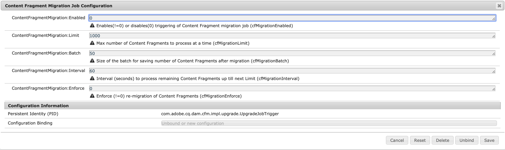

# Aggiornamento dei frammenti di contenuto per un filtro GraphQL ottimizzato {#updating-content-fragments-for-optimized-graphql-filtering}

Per ottimizzare le prestazioni dei filtri di GraphQL, esegui una procedura per aggiornare i frammenti di contenuto.

>[!NOTE]
>
>Dopo aver aggiornato i frammenti di contenuto, puoi seguire i consigli per [Ottimizzazione delle query GraphQL](/help/sites-developing/headless/graphql-api/graphql-optimization.md).

## Prerequisiti {#prerequisites}

Assicurati di disporre di almeno la versione 6.5.17.0 di AEM.

## Aggiornamento dei frammenti di contenuto {#updating-content-fragments}

Per eseguire la procedura, attenersi alla procedura descritta di seguito.

1. [Configurare le impostazioni OSGi](/help/sites-deploying/configuring-osgi.md) per **Configurazione del processo di migrazione di frammenti di contenuto**:

   

1. Nella finestra di dialogo, imposta questi due parametri come segue:

   * **ContentFragmentMigration:Abilitato** : `1`
   * **ContentFragmentMigration:Applica** : `1`

1. **Salva** specifiche: viene avviata la procedura di aggiornamento.

1. Attendere il completamento della procedura. La procedura viene completata quando la proprietà `cfGlobalVersion` viene visualizzato il `/content/dam` e è impostato su `1`.

1. Torna alla configurazione OSGi per disattivare la procedura.

   Nella finestra di dialogo per **Configurazione del processo di migrazione di frammenti di contenuto** impostate questi due parametri come segue:

   * **ContentFragmentMigration:Abilitato** : `0`
   * **ContentFragmentMigration:Applica** : `0`

## Limitazioni {#limitations}

Presta attenzione alle seguenti limitazioni:

* L’ottimizzazione delle prestazioni dei filtri di GraphQL sarà possibile solo dopo un aggiornamento completo di tutti i frammenti di contenuto (indicato dalla presenza della proprietà `cfGlobalVersion` per il nodo JCR `/content/dam`)

* Se i frammenti di contenuto vengono importati da un pacchetto di contenuti (utilizzando `crx/de`) dopo l’esecuzione della procedura di aggiornamento, tali frammenti di contenuto non vengono considerati nei risultati della query GraphQL, fino a quando la procedura di aggiornamento non viene eseguita nuovamente.