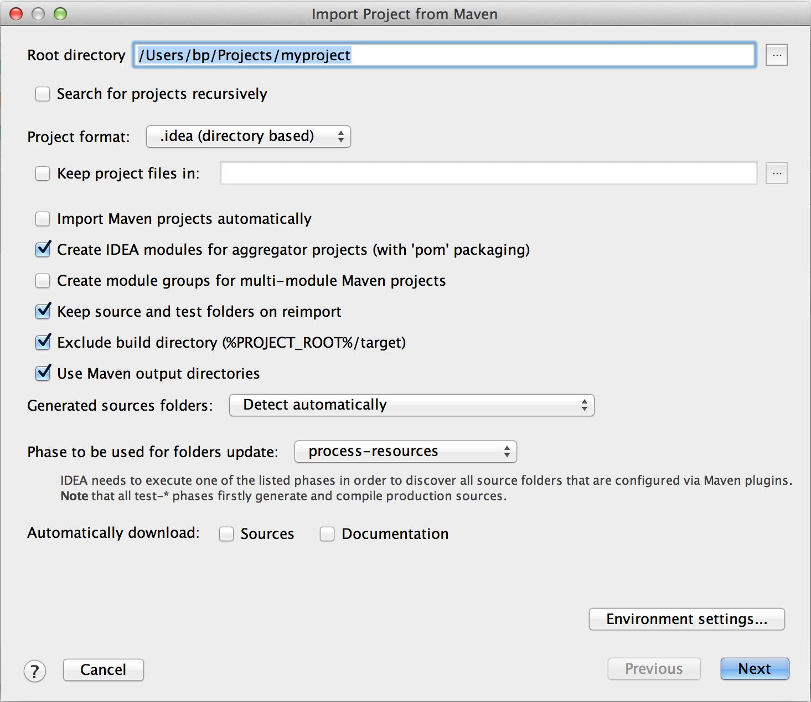
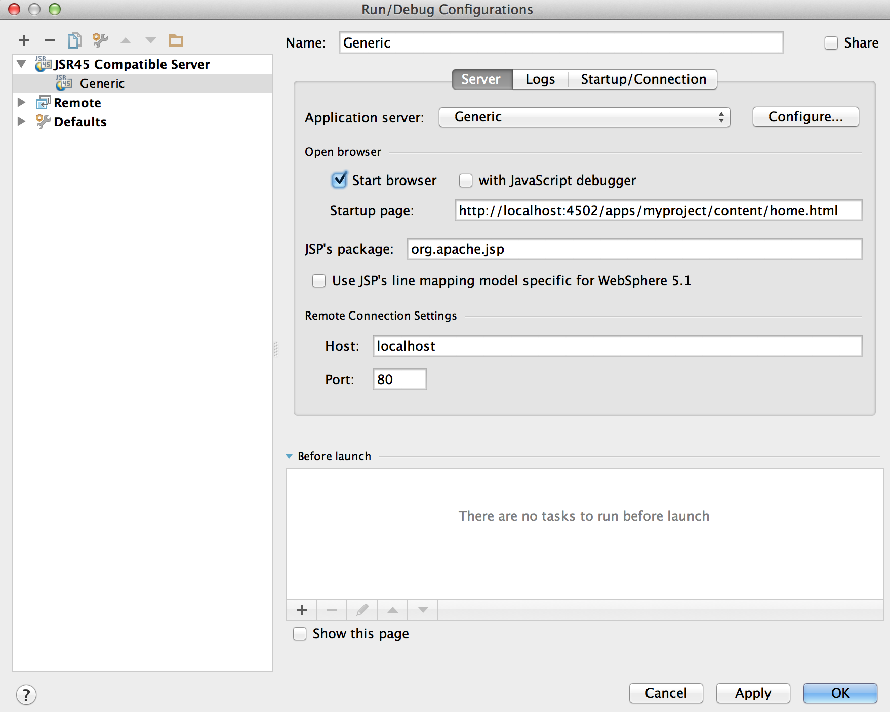

# Come sviluppare progetti AEM utilizzando IntelliJ IDEA{#how-to-develop-aem-projects-using-intellij-idea}

## Panoramica {#overview}

Per iniziare a sviluppare AEM su IntelliJ, sono necessari i seguenti passaggi.

Ogni passaggio è descritto più dettagliatamente nel resto di questo argomento.

* Installa IntelliJ
* Configurare il progetto AEM in base a Maven
* Preparare il supporto JSP per IntelliJ nel POM Maven
* Importare il progetto Maven in IntelliJ

>[!NOTE]
>
>Questa guida si basa su IntelliJ IDEA Ultimate Edition 12.1.4 e AEM 5.6.1.

### Installa IntelliJ IDEA {#install-intellij-idea}

Scarica IntelliJ IDEA da [la pagina Download in JetBrains](https://www.jetbrains.com/idea/download/).

Quindi, seguire le istruzioni di installazione riportate in quella pagina.

### Configurare il progetto AEM in base a Maven {#set-up-your-aem-project-based-on-maven}

Quindi, imposta il progetto utilizzando Maven come descritto in [Come creare progetti AEM con Apache Maven](/help/sites-developing/ht-projects-maven.md).

Per iniziare a lavorare con i progetti AEM in IntelliJ IDEA, la configurazione di base in [Guida introduttiva tra 5 minuti](https://maven.apache.org/guides/getting-started/maven-in-five-minutes.html) è sufficiente.

### Preparare il supporto JSP per IntelliJ IDEA {#prepare-jsp-support-for-intellij-idea}

IntelliJ IDEA può anche fornire supporto nell’utilizzo di JSP, ad esempio:

* completamento automatico delle librerie di tag
* conoscenza degli oggetti definiti da `<cq:defineObjects />` e `<sling:defineObjects />`

Affinché ciò funzioni, segui le istruzioni su [Come utilizzare le JSP](/help/sites-developing/ht-projects-maven.md#how-to-work-with-jsps) in [Come creare progetti AEM con Apache Maven](/help/sites-developing/ht-projects-maven.md).

### Importare il progetto Maven {#import-the-maven-project}

1. Apri **Importa** dialogo in IntelliJ IDEA di

   * selezione **Importa progetto** nella schermata di benvenuto se non hai ancora aperto un progetto
   * selezione **File -> Importa progetto** dal menu principale

1. Nella finestra di dialogo Importa, seleziona il file POM del progetto.

   

1. Continua con le impostazioni predefinite, come mostrato nella finestra di dialogo seguente.

   

1. Continuare le seguenti finestre di dialogo facendo clic su **Successivo** e **Fine**.
1. È ora configurato per lo sviluppo AEM utilizzando IntelliJ IDEA

   

### Debug di JSP con IntelliJ IDEA {#debugging-jsps-with-intellij-idea}

Per il debug di JSP con IntelliJ IDEA sono necessari i passaggi seguenti

* Configurare un facet web nel progetto
* Installare il plug-in di supporto JSR45
* Configurare un profilo di debug
* Configurare AEM per la modalità debug

#### Configurare un facet web nel progetto {#set-up-a-web-facet-in-the-project}

IntelliJ IDEA deve capire dove trovare le JSP per il debug. Perché IDEA non può interpretare `content-package-maven-plugin` deve essere configurato manualmente.

1. Vai a **File -> Struttura progetto**
1. Seleziona la **Contenuto** modulo
1. Clic **+** sopra l’elenco dei moduli e seleziona **Web**
1. Come directory delle risorse Web, selezionare `content/src/main/content/jcr_root subdirectory` come mostrato nella schermata seguente.


#### Installare il plug-in di supporto JSR45 {#install-the-jsr-support-plugin}

1. Vai a **Plug-in** nelle impostazioni IntelliJ IDEA
1. Accedi a **Integrazione JSR45** Collega il plug-in e seleziona la casella di controllo accanto
1. Fai clic su **Applica**
1. Riavvia IntelliJ IDEA quando richiesto a


#### Configurare un profilo di debug {#configure-a-debug-profile}

1. Vai a **Esegui -> Modifica configurazioni**
1. Premi il **+** e seleziona **Controllo remoto JSR45**
1. Nella finestra di dialogo di configurazione, seleziona **Configura** accanto a **Server applicazioni** e configurare un server generico
1. Impostare la pagina iniziale su un URL appropriato per aprire un browser all&#39;avvio del debug
1. Rimuovi tutto **Prima del lancio** se utilizzi la sincronizzazione automatica vlt, o se non la configuri, configura le attività Maven appropriate
1. Il giorno **Avvio/Connessione** , regolare la porta, se necessario
1. Copiare gli argomenti della riga di comando proposti da IntelliJ IDEA

 

#### Configurare AEM per la modalità debug {#configure-aem-for-debug-mode}

L’ultimo passaggio necessario consiste nell’avviare l’AEM con le opzioni JVM proposte da IntelliJ IDEA.

Avvia direttamente il file JAR dell’AEM e aggiungi queste opzioni, ad esempio, con la seguente riga di comando:

`java -Xdebug -Xrunjdwp:transport=dt_socket,address=58242,suspend=n,server=y -Xmx1024m -jar cq-quickstart-6.5.0.jar`

Puoi anche aggiungere queste opzioni allo script iniziale in `crx-quickstart/bin/start` come mostrato di seguito.

```shell
# ...

# default JVM options
if [ -z "$CQ_JVM_OPTS" ]; then
 CQ_JVM_OPTS='-server -Xmx1024m -Djava.awt.headless=true'
fi

CQ_JVM_OPTS="$CQ_JVM_OPTS -Xdebug -Xrunjdwp:transport=dt_socket,address=58242,suspend=n,server=y"

# ...
```

#### Avvia debug {#start-debugging}

Ora è tutto pronto per il debug delle JSP nell’AEM.

1. Seleziona **Esegui -> Debug -> Profilo di debug**
1. Impostare i punti di interruzione nel codice del componente
1. Accedere a una pagina nel browser


### Debug dei bundle con IntelliJ IDEA {#debugging-bundles-with-intellij-idea}

È possibile eseguire il debug del codice nei bundle utilizzando una connessione di debug remoto standard generica. Puoi seguire la [Documentazione di Jetbrain sul debug remoto](https://www.jetbrains.com/help/idea/remote-debugging-with-product.html#remote-interpreter).
