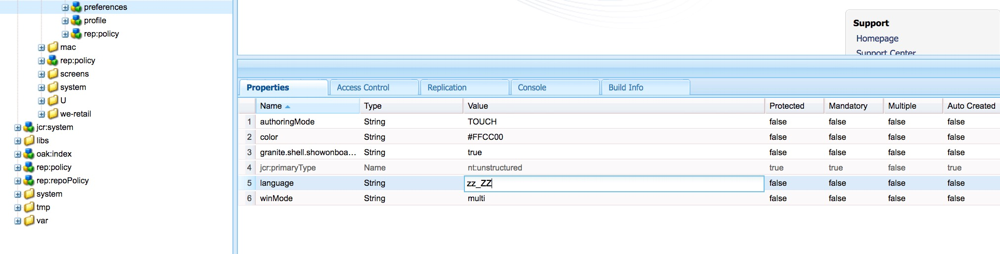

# Internazionalizzazione delle stringhe dell’interfaccia utente {#internationalizing-ui-strings}

Le API Java e JavaScript consentono di internazionalizzare le stringhe nei seguenti tipi di risorse:

* File Java di origine.
* Script JSP.
* JavaScript nelle librerie lato client o nella sorgente pagina.
* Valori delle proprietà del nodo JCR utilizzati nelle finestre di dialogo e nelle proprietà di configurazione dei componenti.

Per una panoramica del processo di internazionalizzazione e localizzazione, consulta [Internazionalizzazione dei componenti](/help/sites-developing/i18n.md).

## Internazionalizzazione delle stringhe nel codice Java e JSP {#internationalizing-strings-in-java-and-jsp-code}

Il `com.day.cq.i18n` Il pacchetto Java consente di visualizzare le stringhe localizzate nell’interfaccia utente. Il `I18n` la classe fornisce `get` metodo che recupera le stringhe localizzate dal dizionario AEM. L’unico parametro richiesto di `get` Il metodo è il valore letterale stringa in lingua inglese. La lingua predefinita per l’interfaccia utente è l’inglese. Nell&#39;esempio seguente la parola viene localizzata `Search`:

`i18n.get("Search");`

L’identificazione della stringa in inglese è diversa dai tipici framework di internazionalizzazione in cui un ID identifica una stringa e viene utilizzato per fare riferimento alla stringa in fase di esecuzione. L’utilizzo del valore letterale stringa inglese offre i seguenti vantaggi:

* Il codice è facile da capire.
* La stringa nella lingua predefinita è sempre disponibile.

### Determinazione della lingua dell&#39;utente {#determining-the-user-s-language}

Esistono due modi per determinare la lingua preferita dall’utente:

* Per gli utenti autenticati, determina la lingua dalle preferenze nell’account utente.
* Impostazioni locali della pagina richiesta.

La proprietà language dell’account utente è il metodo preferito perché è più affidabile. Tuttavia, per utilizzare questo metodo, l’utente deve aver effettuato l’accesso.

#### Creazione dell&#39;oggetto Java I18n {#creating-the-i-n-java-object}

La classe I18n fornisce due costruttori. Il modo in cui si determina la lingua preferita dell&#39;utente determina il costruttore da utilizzare.

Per presentare la stringa nel linguaggio specificato nell&#39;account utente, utilizzare il costruttore seguente (dopo l&#39;importazione `com.day.cq.i18n.I18n)`:

```java
I18n i18n = new I18n(slingRequest);
```

Il costruttore utilizza `SlingHTTPRequest` per recuperare l&#39;impostazione della lingua dell&#39;utente.

Per utilizzare le impostazioni locali della pagina per determinare la lingua, è innanzitutto necessario ottenere il ResourceBundle per la lingua della pagina richiesta:

```java
Locale pageLang = currentPage.getLanguage(false);
ResourceBundle resourceBundle = slingRequest.getResourceBundle(pageLang);
I18n i18n = new I18n(resourceBundle);
```

#### Internazionalizzazione di una stringa {#internationalizing-a-string}

Utilizza il `get` metodo del `I18n` oggetto per internazionalizzare una stringa. L’unico parametro richiesto di `get` Il metodo è la stringa da internazionalizzare. La stringa corrisponde a una stringa in un dizionario Translator. Il metodo get cerca la stringa nel dizionario e restituisce la traduzione per la lingua corrente.

Il primo argomento della `get` il metodo deve rispettare le seguenti regole:

* Il valore deve essere un valore letterale stringa. Una variabile di tipo `String` non è accettabile.
* Il valore letterale stringa deve essere espresso su una singola riga.
* La stringa fa distinzione tra maiuscole e minuscole.

```xml
i18n.get("Enter a search keyword");
```

#### Utilizzo dei suggerimenti di traduzione {#using-translation-hints}

Specifica la [suggerimento traduzione](/help/sites-developing/i18n-translator.md#adding-changing-and-removing-strings) della stringa internazionalizzata per distinguere tra stringhe duplicate nel dizionario. Utilizza il secondo parametro facoltativo del `get` per fornire il suggerimento di traduzione. L&#39;hint di traduzione deve corrispondere esattamente alla proprietà Comment dell&#39;elemento nel dizionario.

Ad esempio, il dizionario contiene la stringa `Request` due volte: una come verbo e una come sostantivo. Il codice seguente include il suggerimento di traduzione come argomento nel `get` metodo:

```java
i18n.get("Request","A noun, as in a request for a web page");
```

#### Inclusione di variabili nelle frasi localizzate {#including-variables-in-localized-sentences}

Includi le variabili nella stringa localizzata per creare un significato contestuale in una frase. Ad esempio, dopo aver effettuato l&#39;accesso a un&#39;applicazione Web, nella home page viene visualizzato il messaggio &quot;Welcome back Administrator. Nella tua casella in entrata sono presenti 2 messaggi.&quot; Il contesto della pagina determina il nome utente e il numero di messaggi.

[Nel dizionario](/help/sites-developing/i18n-translator.md#adding-changing-and-removing-strings), le variabili sono rappresentate in stringhe come indici tra parentesi. Specifica i valori delle variabili come argomenti della `get` metodo. Gli argomenti vengono inseriti dopo il suggerimento di traduzione e gli indici corrispondono all&#39;ordine degli argomenti:

```xml
i18n.get("Welcome back {0}. You have {1} messages.", "user name, number of messages", user.getDisplayName(), numItems);
```

La stringa internazionalizzata e l’hint di traduzione devono corrispondere esattamente alla stringa e al commento nel dizionario. È possibile omettere l’hint di localizzazione fornendo un `null` value come secondo argomento.

#### Utilizzo del metodo Get statico {#using-the-static-get-method}

Il `I18N` classe definisce un valore statico `get` metodo utile quando è necessario localizzare un numero limitato di stringhe. Oltre ai parametri di un oggetto `get` metodo, il metodo statico richiede `SlingHttpRequest` oggetto o `ResourceBundle` che utilizzi, in base a come stai determinando la lingua preferita dell’utente:

* Utilizza la preferenza della lingua dell’utente: specifica SlingHttpRequest come primo parametro.

  `I18n.get(slingHttpRequest, "Welcome back {}. You have {} messages.", "user name, number of messages", user.getDisplayName(), numItems);`
* Utilizza il linguaggio della pagina: specifica ResourceBundle come primo parametro.

  `I18n.get(resourceBundle,"Welcome back {}. You have {} messages.", "user name, number of messages", user.getDisplayName(), numItems);`

### Internazionalizzazione delle stringhe nel codice JavaScript {#internationalizing-strings-in-javascript-code}

L’API JavaScript consente di localizzare le stringhe sul client. Come con [Java e JSP](#internationalizing-strings-in-java-and-jsp-code) JavaScript API consente di identificare le stringhe da localizzare, fornire suggerimenti di localizzazione e includere variabili nelle stringhe localizzate.

Il `granite.utils` [cartella della libreria client](/help/sites-developing/clientlibs.md) fornisce l’API JavaScript. Per utilizzare l’API, includi nella pagina questa cartella della libreria client. Le funzioni di localizzazione utilizzano `Granite.I18n` spazio dei nomi.

Prima di presentare le stringhe localizzate, è necessario impostare la lingua utilizzando `Granite.I18n.setLocale` funzione. La funzione richiede come argomento il codice della lingua della lingua:

```
Granite.I18n.setLocale("fr");
```

Per presentare una stringa localizzata, utilizza `Granite.I18n.get` funzione:

```
Granite.I18n.get("string to localize");
```

L’esempio seguente internazionalizza la stringa &quot;Bentornato&quot;:

```
Granite.I18n.setLocale("fr");
Granite.I18n.get("string to localize", [variables], "localization hint");
```

I parametri della funzione sono diversi dal metodo Java I18n.get:

* Il primo parametro è il valore letterale stringa da localizzare.
* Il secondo parametro è una matrice di valori da inserire nel valore letterale stringa.
* Il terzo parametro è l&#39;hint di localizzazione.

Nell&#39;esempio seguente viene utilizzato JavaScript per localizzare &quot;Welcome back Administrator&quot;. Nella tua casella in entrata sono presenti 2 messaggi.&quot; frase:

```
Granite.I18n.setLocale("fr");
Granite.I18n.get("Welcome back {0}. You have {1} new messages in your inbox.", [username, numMsg], "user name, number of messages");
```

### Internazionalizzazione delle stringhe dai nodi JCR {#internationalizing-strings-from-jcr-nodes}

Le stringhe dell’interfaccia utente si basano spesso sulle proprietà del nodo JCR. Ad esempio, il `jcr:title` di una pagina viene in genere utilizzata come contenuto della proprietà `h1` nel codice della pagina. Il `I18n` la classe fornisce `getVar` metodo per localizzare queste stringhe.

L’esempio di script JSP seguente recupera `jcr:title` dal repository e visualizza la stringa localizzata sulla pagina:

```java
<% title = properties.get("jcr:title", String.class);%>
<h1><%=i18n.getVar(title) %></h1>
```

#### Specifica dei suggerimenti di traduzione per i nodi JCR {#specifying-translation-hints-for-jcr-nodes}

Simile a [hint di traduzione nell’API Java](#using-translation-hints), è possibile fornire suggerimenti di traduzione per distinguere le stringhe duplicate nel dizionario. Fornisci l’hint di traduzione come proprietà del nodo che contiene la proprietà internazionalizzata. Il nome della proprietà hint è composto dal nome della proprietà internazionalizzata con il `_commentI18n` suffisso:

`${prop}_commentI18n`

Ad esempio, un `cq:page` node include la proprietà jcr:title che viene localizzata. L’hint viene fornito come valore della proprietà denominata jcr:title_commentI18n.

### Verifica della copertura dell&#39;internazionalizzazione {#testing-internationalization-coverage}

Verifica se hai internazionalizzato tutte le stringhe nell’interfaccia utente. Per vedere quali stringhe sono coperte, imposta la lingua utente su zz_ZZ e apri l’interfaccia utente nel browser web. Le stringhe internazionalizzate vengono visualizzate con una traduzione stub nel seguente formato:

`USR_*Default-String*_尠`

L’immagine seguente mostra la traduzione stub per la home page dell’AEM:


Per impostare la lingua per l’utente, configura la proprietà lingua del nodo delle preferenze per l’account utente.

Il nodo delle preferenze di un utente ha un percorso come questo:

`/home/users/<letter>/<hash>/preferences`


