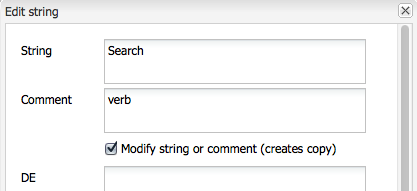
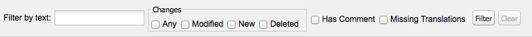
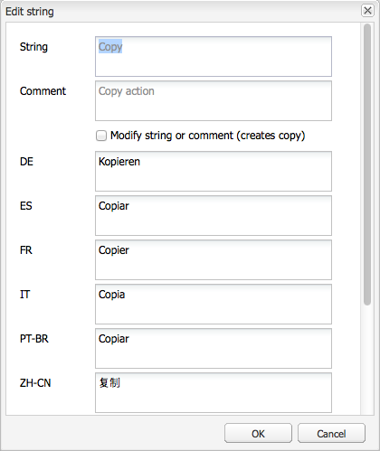

# Utilizzo di Translator per gestire i dizionari{#using-translator-to-manage-dictionaries}

L’AEM fornisce una console per gestire le varie traduzioni di testi utilizzati nell’interfaccia utente dei componenti. Questa console è disponibile all’indirizzo

`https://<hostname>:<port-number>/libs/cq/i18n/translator.html`

Utilizza lo strumento di traduzione per gestire le stringhe in inglese e le relative traduzioni. I dizionari vengono creati nell’archivio, ad esempio, /apps/myproject/i18n.

Lo strumento Traduttore e i dizionari gestiti servono per presentare l’interfaccia utente dei componenti in lingue diverse. Se desideri tradurre la pagina o il contenuto generato dall’utente, consulta [Traduzione di contenuti per siti multilingue](/help/sites-administering/translation.md) e [Traduzione di contenuti generati dagli utenti](/help/communities/translate-ugc.md).

>[!CAUTION]
>
>Modifica solo i dizionari creati per il progetto e presenti in `/apps`.
>
>In questo strumento sono disponibili anche i dizionari di sistema per l’AEM. Non modificare i dizionari di sistema dell’AEM in quanto ciò può causare problemi con l’interfaccia utente dell’AEM. Inoltre, le modifiche possono andare perse in seguito a un aggiornamento. I dizionari di sistema AEM si trovano sotto `/libs`.

>[!NOTE]
>
>Anche se lo strumento Translator ha un’interfaccia utente classica, viene utilizzato per la traduzione di frasi indipendentemente dall’interfaccia in cui si trovano tali frasi.

La traduttrice elenca i testi utilizzati in AEM insieme alle varie traduzioni linguistiche:


Puoi cercare, filtrare e modificare i testi in inglese e tradotto. È inoltre possibile esportare i dizionari in formato XLIFF per la traduzione, quindi importare nuovamente le traduzioni nei dizionari.

Da questa console è inoltre possibile aggiungere i dizionari i18n a un progetto di traduzione. Puoi crearne uno o aggiungerlo a un progetto esistente.

1. Clic **Traduci dizionario**.

   

1. Seleziona l’opzione Crea o Aggiungi a seconda delle tue esigenze. Viene visualizzata una finestra di dialogo.

   

1. Compila i campi come richiesto e fai clic su OK. 

1. Ora puoi fare clic su **OK** oppure consulta il dizionario Target.

   >[!NOTE]
   >
   >Per ulteriori informazioni sui progetti di traduzione, consulta [Gestione dei progetti di traduzione](/help/sites-administering/tc-manage.md).

## Creazione di un dizionario {#creating-a-dictionary}

Crea un dizionario per la gestione delle stringhe localizzate dell’interfaccia utente. Dopo aver creato un dizionario, puoi utilizzarlo per gestirlo con lo strumento di traduzione.

1. Utilizzando CRXDE Liti, aggiungi il nodo principale ( `sling:Folder`) per il nuovo dizionario come struttura per contenere le definizioni della lingua:

   ` /apps/<projectName>/i18n`

   Ad esempio `/apps/myProject/i18n`

1. Aggiungi la struttura della lingua richiesta sotto questa directory principale. Ad esempio:

   ```shell
   /apps/myProject/i18n [sling:Folder]
       - de.json [nt:file] [mix:language]
           + jcr:language = de
       - fr.json [nt:file] [mix:language]
           + jcr:language = fr
   ```

   >[!NOTE]
   >
   >Struttura del file [Modulo Sling i18n](https://sling.apache.org/site/internationalization-support.html).

1. Ricarica il traduttore e il percorso del dizionario (ad esempio, `/apps/myProject/i18n`) sarà disponibile nel selettore a discesa nella barra degli strumenti. Seleziona questa opzione per iniziare ad aggiungere stringhe e relative traduzioni.

   >[!NOTE]
   >
   >Il traduttore salva solo le traduzioni per le lingue effettivamente presenti nel percorso (ad esempio, `/apps/myProject/i18n`).
   >
   >Assicurati che corrispondano alle lingue mostrate nella griglia.

## Gestione delle stringhe di dizionario {#managing-dictionary-strings}

Utilizzare lo strumento di traduzione per gestire le stringhe nei dizionari. È possibile aggiungere, modificare e rimuovere stringhe in inglese, nonché fornire stringhe tradotte.

>[!CAUTION]
>
>Modifica solo i dizionari creati per il progetto e presenti in `/apps`.
>
>Non modificare i dizionari di sistema dell’AEM in quanto ciò può causare problemi con l’interfaccia utente dell’AEM. Inoltre, le modifiche possono andare perse in seguito a un aggiornamento. I dizionari di sistema AEM si trovano sotto `/libs`.

### Aggiunta, modifica e rimozione di stringhe {#adding-changing-and-removing-strings}

Aggiungere stringhe in inglese a un dizionario internazionalizzato dal componente. Aggiungere solo stringhe internazionalizzate in modo da non sprecare risorse traducendo stringhe non utilizzate.

Le stringhe aggiunte a un dizionario devono corrispondere esattamente alla stringa specificata nel codice. Se la stringa inglese predefinita utilizzata nel codice non corrisponde alla stringa inglese in un dizionario, la stringa tradotta non viene visualizzata nell’interfaccia utente quando necessario. Le stringhe distinguono tra maiuscole e minuscole.

**Fornitura di suggerimenti per la traduzione**

Utilizzare la proprietà Commenet della stringa del dizionario per fornire informazioni al traduttore per chiarire il significato della stringa. In genere, l’interfaccia utente aiuta gli utenti a determinare il significato di parole ambigue. Tuttavia, il traduttore non vede la stringa nel contesto dell’interfaccia utente. L’hint di traduzione rimuove l’ambiguità. Ad esempio, un commento aiuta il traduttore a capire che la parola inglese Request è usata come sostantivo invece che come verbo.

Gli hint di traduzione distinguono anche le stringhe identiche e con significati diversi. Ad esempio, la parola Ricerca può essere un sostantivo o un verbo, che richiede due voci &quot;Ricerca&quot; nel dizionario con due diversi suggerimenti di traduzione. Il codice che richiede la stringa include anche l’hint di traduzione in modo che la stringa corretta venga utilizzata nell’interfaccia utente.

**Inclusione di variabili indicizzate**

Includi le variabili nella stringa localizzata per creare un significato contestuale in una frase. Ad esempio, dopo aver effettuato l&#39;accesso a un&#39;applicazione Web, nella home page viene visualizzato il messaggio &quot;Welcome back Administrator. Nella tua casella in entrata sono presenti 2 messaggi.&quot; Il contesto della pagina determina il nome utente e il numero di messaggi.

Per includere variabili nella stringa localizzata, inserire indici racchiusi tra parentesi nella posizione delle variabili nel primo argomento del metodo get. Utilizza l’hint di localizzazione per descrivere i valori. Il traduttore deve capire il significato delle variabili perché lingue diverse usano strutture di frasi diverse.

Tieni presente che [il codice che richiede la stringa tradotta](/help/sites-developing/i18n-dev.md#including-variables-in-localized-sentences) fornisce valori per le variabili indicizzate in base al contesto.

Ad esempio, la seguente stringa viene visualizzata quando un utente accede a un sito web ed è incluso nel dizionario:

`Welcome back {0}. You have {1} messages.`

Il seguente commento descrive le variabili:

`{0} = the user name, {1} = the number of items in the user's inbox`

**Modifica delle stringhe**

Modifica o rimuovi le stringhe inglesi mentre vengono modificate o rimosse nel codice. Quando modifichi una stringa, la stringa originale viene mantenuta e viene creata una nuova stringa che riflette la modifica. Prima di rimuovere una stringa, verificare che non sia utilizzata da codice.

Per aggiungere una stringa, attenersi alla procedura descritta di seguito.

1. Nel menu a discesa Dizionari selezionare il dizionario al quale si desidera aggiungere una stringa. Nel menu a discesa, i dizionari sono rappresentati dal loro percorso nel repository.
1. Sopra la tabella Stringhe e traduzioni, fare clic su Aggiungi.

   

1. Nella casella Stringa della finestra di dialogo Aggiungi stringa digitare la stringa inglese. Nella casella Commento digitare un suggerimento di traduzione per il traduttore, se necessario.
1. Fai clic su OK.
1. Fai clic su Salva.

   

Per modificare una stringa in un dizionario, attenersi alla procedura descritta di seguito.

1. Nel menu a discesa Dizionari selezionare il dizionario contenente la stringa da modificare.
1. Fare doppio clic sulla stringa da modificare.
1. Nella finestra di dialogo Modifica stringa selezionare Modifica stringa o Commento (crea una copia).

   

1. Modificare la stringa o il commento e fare clic su OK.
1. Fai clic su Salva.

   

Per rimuovere una stringa da un dizionario, attenersi alla procedura descritta di seguito.

1. Nel menu a discesa Dizionari, selezionare il dizionario dal quale si desidera rimuovere una stringa.
1. Fai clic su Rimuovi.

   

1. Fai clic su Salva.

   

### Ricerca di stringhe {#searching-for-strings}

La barra di ricerca nella parte inferiore dello strumento Translator fornisce le opzioni di selezione delle stringhe:

* **Filtra per testo:** Schema da associare alla stringa inglese, al commento o alle traduzioni. Nella tabella vengono visualizzati solo gli elementi che corrispondono in tutto o in parte alla serie.
* **Modifiche: qualsiasi, modificato, nuovo, eliminato:** Mostra gli elementi che sono stati modificati e non salvati.

   * Qualsiasi: mostra gli elementi modificati, aggiunti o rimossi.
   * Modificato: mostra gli elementi modificati.
   * Nuovo: mostra gli elementi aggiunti.
   * Eliminato: mostra gli elementi da rimuovere.
   * Selezioni multiple: mostra gli elementi che hanno tutte le proprietà selezionate.

* **Ha Commento**: mostra gli elementi che contengono commenti per i traduttori.
* **Traduzioni mancanti:** Mostra gli elementi in cui almeno una lingua non dispone di una traduzione.



1. Sulla barra di ricerca, seleziona le opzioni di filtro.
1. Per filtrare utilizzando le opzioni, fai clic su Filtro.
1. Per rimuovere i filtri e visualizzare tutti gli elementi nel dizionario, fare clic su Cancella.

### Modifica delle stringhe tradotte {#editing-translated-strings}

Dopo aver aggiunto la stringa inglese a un dizionario, è possibile aggiungere le traduzioni della stringa. È inoltre possibile [esportare il dizionario](/help/sites-developing/i18n-translator.md#exporting-a-dictionary) per farla tradurre da un terzo.

1. Seleziona [dizionario specifico del progetto](#creating-a-dictionary) in quanto specifica il percorso nell’archivio in cui si trovano le traduzioni. Ad esempio, seleziona **Dizionari** come:

   `/apps/myProject/i18n`

   >[!CAUTION]
   >
   >Modifica solo i dizionari creati per il progetto e presenti in `/apps`.
   >
   >In questo strumento sono disponibili anche i dizionari di sistema per l’AEM. Non modificare i dizionari di sistema dell’AEM in quanto ciò può causare problemi con l’interfaccia utente dell’AEM. Inoltre, le modifiche possono andare perse in seguito a un aggiornamento. I dizionari di sistema AEM si trovano sotto `/libs`.

1. Per modificare i testi tradotti di una delle stringhe, puoi effettuare le seguenti operazioni:

   * Fare doppio clic sulla lingua appropriata per la stringa richiesta per modificare il testo:

   

   * Fai doppio clic sul pulsante **Stringa** o **Commento** campi per la stringa richiesta per aprire **Modifica stringa** , modifica le traduzioni come richiesto, quindi fai clic su **OK** per chiudere la finestra di dialogo:

   

1. Clic **Salva** nella barra degli strumenti per confermare le modifiche.

   >[!NOTE]
   >
   >Clic su **Reimposta e aggiorna** (anziché **Salva**) ripristina eventuali modifiche apportate ai testi precedenti.

## Utilizzo di traduttori di terze parti {#using-third-party-translators}

Per supportare l&#39;utilizzo di servizi di traduzione di terze parti, lo strumento di traduzione consente di esportare e importare dizionari.

### Esportazione di un dizionario {#exporting-a-dictionary}

Esporta un dizionario in un file XLIFF in modo che un servizio di terze parti possa tradurre le stringhe del dizionario.

* Esportare un dizionario e includere l&#39;inglese e i termini tradotti per una lingua.
* Esportare solo alcune o tutte le stringhe inglesi.

Quando esportate un file XLIFF e includete una lingua, la struttura dei nodi del dizionario nell&#39;archivio deve includere tale lingua. Se la lingua non è inclusa, si verificano errori. Ad esempio, per esportare il file XLIFF francese, la cartella del dizionario deve includere `mix:language` nodo figlio denominato `fr`. (vedere [Creazione di un dizionario](/help/sites-developing/i18n-translator.md#creating-a-dictionary).)

Per esportare un file XLIFF per una lingua specifica, attenersi alla procedura descritta di seguito.

1. Apri lo strumento di traduzione `http://<host>:<port>/libs/cq/i18n/translator.html`
1. Utilizza il menu a discesa Dizionari per selezionare il dizionario da esportare.
1. Fai clic su Esporta > Esporta completo *XX* Opzioni Xliff, dove *XX* è il codice della lingua a due lettere come DE o FR.

   Il file XLIFF viene aperto in una nuova scheda o finestra.

1. Utilizza i comandi del browser web per salvare la pagina come file nel file system, ad esempio File > Salva pagina con nome.

Per esportare tutte o alcune delle sole stringhe inglesi, attenersi alla procedura descritta di seguito.

1. Apri lo strumento di traduzione. `http://<host>:<port>/libs/cq/i18n/translator.html`
1. Utilizza il menu a discesa Dizionari per selezionare il dizionario da esportare.
1. Se si sta esportando un sottoinsieme delle stringhe, selezionare gli elementi nel dizionario da esportare. Se non si seleziona alcun elemento, vengono esportati tutti gli elementi.
1. Selezionate Esporta (Export) > Esporta selezione (Export Selection As Xliff) (Solo Stringhe).
1. Nella finestra di dialogo visualizzata, copiare il testo e incollarlo in un file di testo.

### Importazione di un dizionario {#importing-a-dictionary}

Importa un file XLIFF in un dizionario per compilare il dizionario. Quando il dizionario include una traduzione per una stringa inglese e il file XLIFF contiene una traduzione diversa per la stessa stringa, la traduzione del dizionario viene sostituita.

1. Apri lo strumento di traduzione `http://<host>:<port>/libs/cq/i18n/translator.html`
1. Fai clic su Importa > Traduzioni XLIFF.
1. Selezionare il file da importare e fare clic su OK.

## Gestione delle lingue supportate {#managing-supported-lanuages}

Aggiungi o rimuovi le lingue supportate dallo strumento di traduzione e fornite agli utenti delle pagine web.

### Modifica delle lingue elencate nella tabella del dizionario {#changing-languages-listed-in-the-dictionary-table}

Lo strumento Traduttore include le seguenti lingue nella tabella del dizionario:

* de - Tedesco
* fr - francese
* it - Italiano
* es - Spagnolo
* ja - Giapponese
* pt-br - Portoghese brasiliano
* zh-cn - Cinese semplificato
* zh-tw - Cinese tradizionale (supporto limitato)
* ko-kr - Coreano

Per aggiungere o rimuovere lingue, attenersi alla procedura descritta di seguito.

1. Utilizzando CRXDE Liti, crea un nodo:

   `/etc/languages`

1. In questo nodo, crea una proprietà:

   * **Nome**: `languages`
   * **Tipo**: `Multi-String`
   * **Valore**: l’elenco delle lingue da visualizzare. Ad esempio:

      * fr
      * es

   >[!NOTE]
   >
   >I codici della lingua devono essere in minuscolo.

1. Clic **Salva tutto** in CRXDE Liti e ricaricare il traduttore. La griglia verrà aggiornata per mostrare le lingue definite.

   >[!NOTE]
   >
   >Il traduttore salverà solo le traduzioni per le lingue che sono effettivamente [presente nel dizionario](#creating-a-dictionary) (ovvero, sotto il percorso del dizionario come `/apps/myProject/i18n`).
   >
   >Assicurati che corrispondano alle lingue mostrate nella griglia.

### Come rendere le lingue disponibili agli autori {#making-languages-available-to-authors}

Dopo aver definito un dizionario per una lingua nuova per l’istanza AEM, è necessario renderlo disponibile per la selezione da parte degli autori (ad esempio, per l’utilizzo in **Preferenze**):

1. Per modificare l&#39;elenco delle lingue disponibili in **Preferenze** del **Sicurezza** console:

   1. Crea una sovrapposizione nel codice dell’applicazione per:

      ```
              /libs/cq/security/widgets/source/widgets/security/Preferences.js
       and update as required.
      ```

1. Per rendere disponibile la lingua in **Preferenze** dal **Siti Web** console è necessario apportare le seguenti modifiche all&#39;applicazione:

   1. Crea una sovrapposizione per la struttura in:

      `/libs/cq/security/content/tools/userProperties`

   1. All’interno della sovrapposizione, aggiorna l’elenco delle lingue in:

      `items/common/items /lang/options`

1. Salva tutto e ricarica la console appropriata.

### Modifica dei nomi delle lingue e dei paesi predefiniti {#changing-language-names-and-default-countries}

Vari paesi utilizzano la stessa lingua, ad esempio Stati Uniti, Regno Unito e Australia utilizzano tutti l&#39;inglese. È indicato da un codice che indica sia la lingua che il paese, ad esempio `en_US`, `en_GB` e `en_AU`.

I paesi predefiniti vengono utilizzati quando vengono visualizzati i flag (ad esempio, nella finestra di dialogo di copia per lingua), per risolvere il paese per un codice di lingua.

>[!NOTE]
>
>Per le localizzazioni gestite dal traduttore qui sopra, funziona solo la lingua esatta. Se il menu a discesa delle preferenze della lingua utilizza `en_uk`, deve essere presente `en_uk` dizionario nell’archivio.

Per modificare le definizioni predefinite:

1. Un elenco delle lingue viene memorizzato in:

   `/libs/wcm/core/resources/languages`

   Sovrapponi questo elemento copiandolo in:

   `/apps/wcm/core/resources/languages`

   Quindi modificare o estendere l&#39;elenco. La proprietà `defaultCountry` in un nodo di lingua (ad esempio, `ja`) deve contenere il codice completo, ad esempio `ja_jp`, che definirebbe `jp` come paese predefinito per la lingua `ja`.

1. Aggiornare il **Gestione lingua CQ WCM**.

   * **Elenco lingue**:

     Percorso dell&#39;elenco delle lingue nell&#39;archivio. Impostate questo valore sulla posizione utilizzata per la sovrapposizione:

     ```
            /apps/wcm/core/resources/languages
     ```

   Puoi eseguire questa operazione utilizzando la console Web OSGi:

   ```shell
   https://<hostname>:<port-number>/system/console/configMgr/com.day.cq.wcm.core.impl.LanguageManagerImpl
   ```

## Pubblicazione dei dizionari {#publishing-dictionaries}

Integrare i dizionari nel processo di gestione del rilascio delle applicazioni AEM. Ad esempio, includi il dizionario nel pacchetto di contenuti dell’applicazione per la distribuzione nell’istanza Publish. Questa strategia offre i seguenti vantaggi:

* I dizionari sono disponibili per i componenti nel loro ambiente di pubblicazione.
* Le modifiche alle stringhe dell’interfaccia utente del componente vengono distribuite insieme alle traduzioni aggiornate.

Analogamente, il test delle stringhe di dizionario deve essere eseguito come parte del normale ciclo di sviluppo del software.

>[!NOTE]
>
>Non utilizzare la normale funzionalità di pubblicazione o replica per i dizionari. Al contrario, i dizionari devono essere trattati allo stesso modo del codice e della configurazione. Ciò include l’utilizzo del controllo del codice sorgente per tenere traccia delle modifiche e l’utilizzo di pacchetti di contenuti per applicare le modifiche all’authoring e alla pubblicazione.

>[!NOTE]
>
>Quando utilizzi Dispatcher, devi: [annullare la validità delle pagine memorizzate in cache](https://helpx.adobe.com/experience-manager/dispatcher/using/page-invalidate.html) per includere nuove stringhe indicatrici nelle stringhe di componenti sottoposte a rendering.
