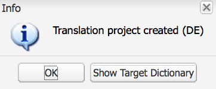

# Utilizzo di Translator per gestire i dizionari{#using-translator-to-manage-dictionaries}

AEM offre una console per la gestione delle diverse traduzioni di testi utilizzate nell’interfaccia utente dei componenti. Questa console è disponibile in

`https://<hostname>:<port-number>/libs/cq/i18n/translator.html`

Utilizzate lo strumento di traduzione per gestire le stringhe inglesi e le relative traduzioni. I dizionari vengono creati nella directory archivio, ad esempio /apps/myproject/i18n.

Lo strumento Traduttore e i dizionari gestiti consentono di presentare l’interfaccia utente dei componenti in lingue diverse. Per tradurre contenuti generati dalla pagina o dall&#39;utente, vedere [Traduzione di contenuti per siti multilingue](/help/sites-administering/translation.md) e [Traduzione di contenuti generati dall&#39;utente](/help/communities/translate-ugc.md).

>[!CAUTION]
>
>Modificate solo i dizionari creati per il progetto e residenti in `/apps`.
>
>AEM dizionari di sistema sono disponibili anche in questo strumento. Non modificate i dizionari di sistema AEM in quanto questo può causare problemi con l&#39;interfaccia utente AEM. Inoltre, le modifiche possono andare perse con l&#39;aggiornamento. AEM dizionari di sistema si trovano in `/libs`.

>[!NOTE]
>
>Anche se lo strumento di traduzione ha un&#39;interfaccia classica, viene utilizzato per la traduzione di frasi indipendentemente dall&#39;interfaccia in cui tali frasi vengono trovate.

Il traduttore elenca i testi utilizzati in AEM con le varie traduzioni linguistiche l&#39;una accanto all&#39;altra:


È possibile cercare, filtrare e modificare il testo inglese e tradotto. Potete anche esportare i dizionari in formato XLIFF per la traduzione, quindi importare di nuovo le traduzioni nei dizionari.

È inoltre possibile aggiungere i dizionari i18n a un progetto di traduzione da questa console. Potete crearne uno nuovo o aggiungerne uno esistente.

1. Fare clic su **Traduci dizionario**.

   

1. Selezionate l’opzione Crea o Aggiungi a seconda delle vostre esigenze. Viene visualizzata una finestra di dialogo.

   

1. Compilate i campi come richiesto e fate clic su OK. 

1. Ora è possibile fare clic su **OK** o visualizzare il Dizionario di destinazione.

   >[!NOTE]
   >
   >Per ulteriori informazioni sui progetti di traduzione, consultare [Managing Translation Projects](/help/sites-administering/tc-manage.md).

## Creazione di un dizionario {#creating-a-dictionary}

Create un dizionario per la gestione delle stringhe di interfaccia localizzate. Dopo aver creato un dizionario è possibile utilizzare lo strumento Traduzione per gestirlo.

1. Utilizzando CRXDE Lite, aggiungete il nodo principale ( `sling:Folder`) per il nuovo dizionario come struttura che contiene le definizioni della lingua:

   ` /apps/<projectName>/i18n`

   Esempio, `/apps/myProject/i18n`

1. Aggiungete la struttura della lingua richiesta sotto questa radice. Esempio:

   ```shell
   /apps/myProject/i18n [sling:Folder]
       - de.json [nt:file] [mix:language]
           + jcr:language = de
       - fr.json [nt:file] [mix:language]
           + jcr:language = fr
   ```

   >[!NOTE]
   >
   >Questa è la struttura del modulo [Sling i18n](https://sling.apache.org/site/internationalization-support.html).

1. Ricaricare il traduttore e il percorso del dizionario (ad es. `/apps/myProject/i18n`) sarà disponibile nel selettore a discesa nella barra degli strumenti. Selezionare questa opzione per iniziare ad aggiungere le stringhe e le relative traduzioni.

   >[!NOTE]
   >
   >Il traduttore salverà solo le traduzioni per le lingue che sono effettivamente presenti sotto il percorso (ad es. `/apps/myProject/i18n`).
   >
   >Verificate che corrispondano alle lingue visualizzate nella griglia.

## Gestione delle stringhe di dizionario {#managing-dictionary-strings}

Utilizzate lo strumento di traduzione per gestire le stringhe nei dizionari. È possibile aggiungere, modificare e rimuovere stringhe inglesi, nonché fornire stringhe tradotte.

>[!CAUTION]
>
>Modificate solo i dizionari creati per il progetto e residenti in `/apps`.
>
>Non modificate i dizionari di sistema AEM in quanto questo può causare problemi con l&#39;interfaccia utente AEM. Inoltre, le modifiche possono andare perse con l&#39;aggiornamento. AEM dizionari di sistema si trovano in `/libs`.

### Aggiunta, modifica e rimozione di stringhe {#adding-changing-and-removing-strings}

Aggiungete stringhe in inglese a un dizionario internazionalizzato dal componente. Aggiungere solo stringhe internazionalizzate in modo da non sprecare risorse traducendo stringhe non utilizzate.

Le stringhe aggiunte a un dizionario devono corrispondere esattamente alla stringa specificata nel codice. Se la stringa inglese predefinita utilizzata nel codice non corrisponde alla stringa inglese in un dizionario, la stringa convertita non viene visualizzata nell’interfaccia utente quando necessario. Le stringhe seguono la distinzione tra maiuscole e minuscole.

**Suggerimenti per la traduzione**

Utilizzare la proprietà Commenet della stringa del dizionario per fornire informazioni al traduttore per chiarire il significato della stringa. In genere, l’interfaccia utente facilita agli utenti la definizione del significato delle parole ambigue. Tuttavia, il traduttore non visualizza la stringa nel contesto dell&#39;interfaccia utente. Il suggerimento di traduzione rimuove l&#39;ambiguità. Ad esempio, un commento aiuta il traduttore a capire che la parola inglese Request è utilizzata come nome anziché come verbo.

I suggerimenti di traduzione distinguono anche le stringhe che sono identiche e hanno significati diversi. Ad esempio, la parola Ricerca può essere un nome o un verbo, che richiede due voci &quot;Cerca&quot; nel dizionario con due diversi suggerimenti di traduzione. Il codice che richiede la stringa include anche il suggerimento di conversione in modo che la stringa corretta venga utilizzata nell&#39;interfaccia utente.

**Inclusione di variabili indicizzate**

Includete le variabili nella stringa localizzata per creare un significato contestuale in una frase. Ad esempio, dopo aver effettuato l&#39;accesso a un&#39;applicazione Web, nella home page viene visualizzato il messaggio &quot;Benvenuti all&#39;amministratore. Hai 2 messaggi nella tua inbox.&quot; Il contesto della pagina determina il nome utente e il numero di messaggi.

Per includere le variabili nella stringa localizzata, posizionate gli indici tra parentesi nella posizione delle variabili nel primo argomento del metodo get. Utilizzate il suggerimento di localizzazione per descrivere i valori. Il traduttore deve capire il significato delle variabili perché lingue diverse utilizzano strutture di frasi diverse.

Tenere presente che [il codice che richiede la stringa convertita](/help/sites-developing/i18n-dev.md#including-variables-in-localized-sentences) fornisce i valori per le variabili indicizzate in base al contesto.

Ad esempio, la seguente stringa viene visualizzata quando un utente accede a un sito Web ed è inclusa nel dizionario:

`Welcome back {0}. You have {1} messages.`

Il commento seguente descrive le variabili:

`{0} = the user name, {1} = the number of items in the user's inbox`

**Modifica delle stringhe**

Modificare o rimuovere le stringhe inglesi mano a mano che vengono modificate o rimosse nel codice. Quando si modifica una stringa, la stringa originale viene mantenuta e viene creata una nuova stringa che riflette la modifica. Prima di rimuovere una stringa, assicurarsi che nessun codice la utilizzi.

Utilizzare la procedura seguente per aggiungere una stringa.

1. Nel menu a discesa Dizionari, selezionate il dizionario al quale state aggiungendo una stringa. Nel menu a discesa, i dizionari sono rappresentati dal relativo percorso nel repository.
1. Sopra la tabella Stringhe e traduzioni, fare clic su Aggiungi.

   

1. Nella casella Stringa della finestra di dialogo Aggiungi stringa, digitare la stringa inglese. Nella casella Commento, digitare un suggerimento di traduzione per il traduttore, se necessario.
1. Fai clic su OK.
1. Fate clic su Salva.

   

Utilizzare la procedura seguente per modificare una stringa in un dizionario.

1. Nel menu a discesa Dizionari, selezionate il dizionario che contiene la stringa da modificare.
1. Fare doppio clic sulla stringa da modificare.
1. Nella finestra di dialogo Modifica stringa, selezionare Modifica stringa o commento (Crea una copia).

   

1. Modificate la stringa o il commento e fate clic su OK.
1. Fate clic su Salva.

   

Per rimuovere una stringa da un dizionario, attenersi alla procedura descritta di seguito.

1. Nel menu a discesa Dizionari, selezionate il dizionario da cui state rimuovendo una stringa.
1. Fate clic su Rimuovi.

   

1. Fate clic su Salva.

   

### Ricerca di stringhe {#searching-for-strings}

La barra di ricerca nella parte inferiore dello strumento di traduzione fornisce le opzioni di selezione delle stringhe:

* **Filtrare per testo:** Un pattern che corrisponde alla stringa, al commento o alle traduzioni in inglese. Nella tabella vengono visualizzati solo gli elementi che corrispondono a tutto o a parte del pattern.
* **Modifiche: Qualsiasi, Modificato, Nuovo, Eliminato:** Mostra elementi modificati e non salvati.

   * Qualsiasi: Mostra gli elementi che sono stati modificati, aggiunti o rimossi.
   * Modificato: Mostra gli elementi modificati.
   * Nuovo: Mostra gli elementi aggiunti.
   * Eliminato: Mostra gli elementi da rimuovere.
   * Selezioni multiple: Mostra elementi con tutte le proprietà selezionate.

* **Con Commento**: Mostra gli elementi che contengono commenti per i traduttori.
* **Traduzioni mancanti:** Mostra elementi in cui almeno una lingua non dispone di una traduzione.


1. Nella barra di ricerca, selezionate le opzioni di filtro.
1. Per filtrare utilizzando le opzioni, fate clic su Filtro.
1. Per rimuovere i filtri e visualizzare tutti gli elementi nel dizionario, fate clic su Cancella.

### Modifica delle stringhe tradotte {#editing-translated-strings}

Dopo aver aggiunto la stringa inglese a un dizionario, è possibile aggiungere traduzioni della stringa. È inoltre possibile [esportare il dizionario](/help/sites-developing/i18n-translator.md#exporting-a-dictionary) per tradurlo da terzi.

1. Selezionare [il dizionario specifico del progetto](#creating-a-dictionary) in quanto specifica il percorso nella directory archivio che contiene le traduzioni. Ad esempio, selezionare **Dizionari** come:

   `/apps/myProject/i18n`

   >[!CAUTION]
   >
   >Modificate solo i dizionari creati per il progetto e residenti in `/apps`.
   >
   >AEM dizionari di sistema sono disponibili anche in questo strumento. Non modificate i dizionari di sistema AEM in quanto questo può causare problemi con l&#39;interfaccia utente AEM. Inoltre, le modifiche possono andare perse con l&#39;aggiornamento. AEM dizionari di sistema si trovano in `/libs`.

1. Per modificare i testi tradotti per una delle stringhe è possibile:

   * Fate doppio clic sulla lingua appropriata per la stringa richiesta per modificare il singolo testo:

   

   * Fare doppio clic sui campi **String** o **Comment** per la stringa richiesta per aprire la finestra di dialogo **Edit string**, modificare le traduzioni come necessario, quindi fare clic su **OK** per chiudere la finestra di dialogo:

   

1. Fare clic su **Salva** nella barra degli strumenti per salvare le modifiche.

   >[!NOTE]
   >
   >Facendo clic su **Reimposta e aggiorna** (invece di **Salva**), tutte le modifiche apportate ai testi precedenti vengono ripristinate.

## Utilizzo di traduttori di terze parti {#using-third-party-translators}

Per supportare l&#39;utilizzo di servizi di traduzione di terze parti, lo strumento di traduzione consente di esportare e importare dizionari.

### Esportazione di un dizionario {#exporting-a-dictionary}

Esportate un dizionario in un file XLIFF in modo che un servizio di terze parti possa tradurre le stringhe del dizionario.

* Esportate un dizionario e includete l&#39;inglese e i termini tradotti per una lingua.
* Esportate alcune o tutte le stringhe inglesi.

Quando esportate un file XLIFF e includete una lingua, la struttura del nodo del dizionario nell&#39;archivio deve includere tale lingua. Se la lingua non è inclusa, si verificano degli errori. Ad esempio, per esportare il file XLIFF francese, la cartella del dizionario deve includere il nodo secondario `mix:language` denominato `fr`. (Vedere [Creazione di un dizionario](/help/sites-developing/i18n-translator.md#creating-a-dictionary).)

Per esportare un file XLIFF per una lingua specifica, attenersi alla procedura descritta di seguito.

1. Aprire lo strumento di traduzione `http://<host>:<port>/libs/cq/i18n/translator.html`
1. Utilizzate il menu a discesa Dizionari per selezionare il dizionario da esportare.
1. Fate clic su Esporta > Esporta opzioni complete *XX* Xliff, dove *XX* è il codice della lingua di due lettere, ad esempio DE o FR.

   Il file XLIFF si apre in una nuova scheda o finestra.

1. Utilizzare i comandi del browser Web per salvare la pagina come file nel file system, ad esempio File > Salva pagina con nome.

Utilizzare la procedura seguente per esportare tutte o alcune delle stringhe inglesi.

1. Aprite lo strumento Traduzione. `http://<host>:<port>/libs/cq/i18n/translator.html`
1. Utilizzate il menu a discesa Dizionari per selezionare il dizionario da esportare.
1. Se state esportando un sottoinsieme di stringhe, selezionate gli elementi nel dizionario da esportare. Selezionando nessun elemento, vengono esportati tutti gli elementi.
1. Fate Clic Su Esporta > Esporta Selezione Come Xliff (Solo Stringhe).
1. Nella finestra di dialogo visualizzata, copiate il testo e incollatelo in un file di testo.

### Importazione di un dizionario {#importing-a-dictionary}

Importare un file XLIFF in un dizionario per compilare il dizionario. Quando il dizionario include una traduzione per una stringa inglese e il file XLIFF contiene una traduzione diversa per la stessa stringa, la traduzione del dizionario viene sostituita.

1. Aprire lo strumento di traduzione `http://<host>:<port>/libs/cq/i18n/translator.html`
1. Fate clic su Importa > Traduzioni XLIFF.
1. Selezionate il file da importare e fate clic su OK.

## Gestione delle lingue supportate {#managing-supported-lanuages}

Aggiungete o rimuovete le lingue supportate dallo strumento di traduzione e fornite agli utenti delle pagine Web.

### Modifica delle lingue elencate nella tabella del dizionario {#changing-languages-listed-in-the-dictionary-table}

Lo strumento Traduttore include le seguenti lingue nella tabella dei dizionari:

* de - tedesco
* fr - Francese
* it - Italiano
* es - Spagnolo
* ja - Giapponese
* pt-br - Portoghese brasiliano
* zh-cn - Cinese semplificato
* zh-tw - Cinese tradizionale (supporto limitato)
* ko-kr - Coreano

Per aggiungere o rimuovere lingue, attenersi alla procedura descritta di seguito.

1. Utilizzando CRXDE Lite create un nuovo nodo:

   `/etc/languages`

1. Su questo nodo, create una proprietà:

   * **Nome**: `languages`
   * **Tipo**: `Multi-String`
   * **Valore**: l’elenco delle lingue da visualizzare. Esempio:

      * fr
      * es

   >[!NOTE]
   >
   >I codici lingua devono essere in lettere minuscole.

1. Fare clic su **Salva tutto** nel CRXDE Lite e ricaricare il traduttore. La griglia verrà aggiornata per mostrare le lingue definite.

   >[!NOTE]
   >
   >Il traduttore salverà solo le traduzioni per le lingue che sono effettivamente [presenti nel dizionario](#creating-a-dictionary) (ovvero sotto il percorso del dizionario, come `/apps/myProject/i18n`).
   >
   >Verificate che corrispondano alle lingue visualizzate nella griglia.

### Come rendere le lingue disponibili agli autori {#making-languages-available-to-authors}

Dopo aver definito un dizionario per una lingua nuova nell&#39;istanza AEM, è necessario renderlo disponibile per la selezione da parte degli autori (ad esempio, da utilizzare in **Preferenze**):

1. Per modificare l&#39;elenco delle lingue disponibili in **Preferenze** della console **Protezione**:

   1. Create una sovrapposizione nel codice dell’applicazione per:

      ```
              /libs/cq/security/widgets/source/widgets/security/Preferences.js
       and update as required.
      ```

1. Per rendere disponibile la lingua in **Preferenze** dalla console **Siti Web**, è necessario apportare le seguenti modifiche all&#39;applicazione:

   1. Create una sovrapposizione per la struttura in:

      `/libs/cq/security/content/tools/userProperties`

   1. All’interno della sovrapposizione, aggiornate l’elenco delle lingue in:

      `items/common/items /lang/options`

1. Salvate tutto e ricaricate la console appropriata.

### Modifica dei nomi delle lingue e dei paesi predefiniti {#changing-language-names-and-default-countries}

Diversi paesi utilizzano la stessa lingua, ad esempio gli Stati Uniti, il Regno Unito e l&#39;Australia utilizzano tutti l&#39;inglese. Questo è indicato da un codice che indica sia la lingua che il paese, ad esempio `en_US`, `en_GB` e `en_AU`.

I paesi predefiniti vengono utilizzati per visualizzare i flag (ad esempio nella finestra di dialogo Copia lingua), per risolvere il paese in base al codice della lingua.

>[!NOTE]
>
>Per le localizzazioni come gestito dal traduttore sopra, funziona solo la lingua esatta. Se il menu a discesa delle preferenze della lingua utilizza `en_uk`, nella directory archivio deve essere presente un dizionario `en_uk`.

Per modificare le definizioni predefinite:

1. Un elenco di lingue è memorizzato in:

   `/libs/wcm/core/resources/languages`

   Sovrapponi questo copiandolo in:

   `/apps/wcm/core/resources/languages`

   Quindi, modificate o estendete l’elenco. La proprietà `defaultCountry` su un nodo della lingua (ad es. `ja`) deve contenere il codice completo, ad esempio `ja_jp`, che definirebbe `jp` come il paese predefinito per la lingua `ja`.

1. Aggiornate il **CQ WCM Language Manager**.

   * **Lingua**:

      Percorso dell’elenco delle lingue nella directory archivio. Impostate questo valore sulla posizione utilizzata per la sovrapposizione:

      ```
             /apps/wcm/core/resources/languages
      ```
   A tale scopo, utilizzate la console Web OSGi:

   ```shell
   https://<hostname>:<port-number>/system/console/configMgr/com.day.cq.wcm.core.impl.LanguageManagerImpl
   ```

## Pubblicazione dei dizionari {#publishing-dictionaries}

Incorporare i dizionari nel processo di gestione del rilascio delle applicazioni AEM. Ad esempio, includete il dizionario nel pacchetto di contenuto dell’applicazione per la distribuzione nell’istanza di pubblicazione. Questa strategia offre i seguenti vantaggi:

* I dizionari sono disponibili per i componenti nell’ambiente di pubblicazione.
* Le modifiche alle stringhe dell’interfaccia utente del componente vengono distribuite insieme alle traduzioni aggiornate.

Allo stesso modo, il test delle stringhe dizionario deve essere eseguito come parte del normale ciclo di vita del software di sviluppo.

>[!NOTE]
>
>La funzionalità di pubblicazione regolare, o replica, non deve essere utilizzata per i dizionari. I dizionari dovrebbero essere trattati allo stesso modo del codice e della configurazione. Ciò include l’utilizzo del controllo del codice sorgente per tenere traccia delle modifiche e l’utilizzo di pacchetti di contenuti per applicare le modifiche all’authoring e alla pubblicazione.

>[!NOTE]
>
>Quando si utilizza Dispatcher, è necessario [annullare la validità delle pagine memorizzate nella cache](https://helpx.adobe.com/experience-manager/dispatcher/using/page-invalidate.html) per includere nuove stringhe dicazionarie nelle stringhe dei componenti sottoposti a rendering.

