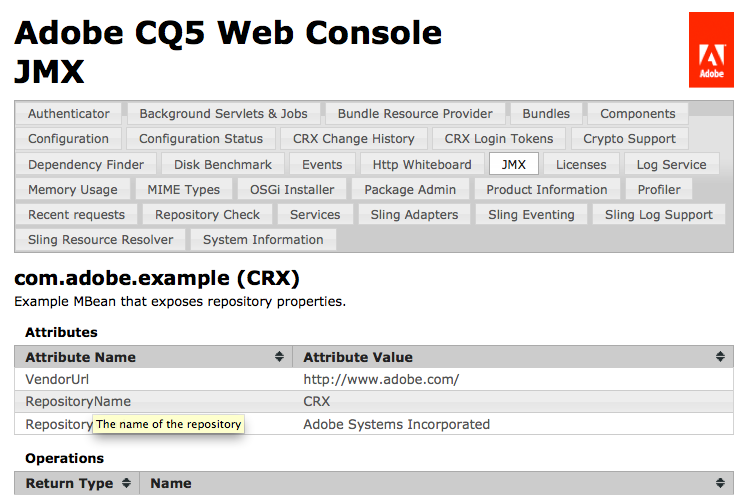

# Integrazione dei servizi con la console JMX{#integrating-services-with-the-jmx-console}

Crea e distribuisci MBeans per gestire i servizi utilizzando la console JMX. Esporre gli attributi e le operazioni del servizio per consentire l&#39;esecuzione delle attività di amministrazione.

Per informazioni sull&#39;utilizzo della console JMX, vedi [Risorse del server di monitoraggio tramite la console JMX](/help/sites-administering/jmx-console.md).

## Framework JMX in Felix e CQ5 {#the-jmx-framework-in-felix-and-cq}

Sulla piattaforma Apache Felix, distribuisci MBeans come servizi OSGi. Quando un servizio MBean viene registrato nel Registro di sistema del servizio OSGi, il modulo della lavagna Aries JMX registra automaticamente il MBean con il server MBean. MBean è quindi disponibile per la console JMX che espone gli attributi e le operazioni pubbliche.


## Creazione di MBeans per CQ5 e CRX {#creating-mbeans-for-cq-and-crx}

Gli MBeans creati per la gestione delle risorse CQ5 o CRX si basano sull&#39;interfaccia javax.management.DynamicMBean. Per crearli, segui i soliti modelli di progettazione descritti nella specifica JMX:

* Crea l’interfaccia di gestione, compresi i metodi get, set ed is per definire gli attributi e altri metodi per definire le operazioni.
* Crea la classe di implementazione . La classe deve implementare DynamicMBean o estendere una classe di implementazione di DynamicMBean.
* Segui la convenzione di denominazione standard in modo che il nome della classe di implementazione sia il nome dell&#39;interfaccia con il suffisso MBean .

Oltre a definire l’interfaccia di gestione, l’interfaccia definisce anche l’interfaccia del servizio OSGi. La classe di implementazione implementa il servizio OSGi.

### Utilizzo delle annotazioni per fornire informazioni MBean {#using-annotations-to-provide-mbean-information}

La [com.adobe.granite.jmx.annotation](https://helpx.adobe.com/experience-manager/6-5/sites/developing/using/reference-materials/javadoc/com/adobe/granite/jmx/annotation/package-summary.html) Il pacchetto fornisce diverse annotazioni e classi per fornire facilmente metadati MBean alla console JMX. Utilizzare queste annotazioni e classi invece di aggiungere informazioni direttamente all&#39;oggetto MBeanInfo di MBean.

**Annotazioni**

Aggiungi annotazioni all’interfaccia di gestione per specificare i metadati MBean. Le informazioni vengono visualizzate nella console JMX per ogni classe di implementazione distribuita. Sono disponibili le seguenti annotazioni (per informazioni complete, consulta [com.adobe.granite.jmx.annotation JavaDocs](https://helpx.adobe.com/experience-manager/6-5/sites/developing/using/reference-materials/javadoc/com/adobe/granite/jmx/annotation/package-summary.html)):

* **Descrizione:** Fornisce una descrizione della classe o del metodo MBean. Quando viene utilizzata nella dichiarazione della classe, la descrizione viene visualizzata nella pagina Console JMX per MBean. Quando viene utilizzata su un metodo, la descrizione viene visualizzata come testo al passaggio del mouse per l&#39;attributo o l&#39;operazione corrispondente.
* **Impatto:** L&#39;impatto di un metodo. I valori di parametro validi sono i campi definiti da [javax.management.MBeanOperationInfo](https://docs.oracle.com/javase/1.5.0/docs/api/javax/management/MBeanOperationInfo.html).

* **Nome:** Specifica il nome da visualizzare per un parametro di operazione. Utilizzare questa annotazione per ignorare il nome effettivo del parametro del metodo utilizzato nell&#39;interfaccia.
* **OpenTypeInfo:** Specifica la classe da utilizzare per rappresentare dati compositi o dati tabulari nella console JMX. Da utilizzare con Open MBeans
* **TabularTypeInfo:** Utilizzato per annotare la classe utilizzata per rappresentare i dati tabulari.

**Classi**

Sono disponibili classi per la creazione di MBeans dinamici che utilizzano le annotazioni aggiunte alle rispettive interfacce:

* **AnnotaStandardMBean:** Una sottoclasse della classe javax.management.StandardMBean che fornisce automaticamente alla console JMX i metadati dell&#39;annotazione.
* **OpenAnnotatedStandardMBean:** Sottoclasse della classe AnnotatedStandardMBean per la creazione di fagioli aperti che utilizzano l&#39;annotazione OpenTypeInfo.

### Sviluppo di MBeans {#developing-mbeans}

In genere, il MBean è una riflessione sul servizio OSGi che si desidera gestire. Sulla piattaforma Felix, puoi creare MBean come faresti per la distribuzione su altre piattaforme server Java. Una differenza principale è che è possibile utilizzare le annotazioni per specificare le informazioni MBean:

* Interfaccia di gestione: Definisce gli attributi utilizzando i metodi getter, setter e is. Definisce le operazioni utilizzando qualsiasi altro metodo pubblico. Utilizza le annotazioni per fornire metadati per l’oggetto BeanInfo.
* Classe MBean: Implementa l’interfaccia di gestione. Estende la classe AnnotatedStandardMBean in modo che elabori le annotazioni nell’interfaccia.

Il seguente esempio MBean fornisce informazioni sull&#39;archivio CRX. L’interfaccia utilizza l’annotazione Descrizione per fornire informazioni alla console JMX.

#### Interfaccia di gestione {#management-interface}

```java
package com.adobe.example.myapp;

import com.adobe.granite.jmx.annotation.Description;

@Description("Example MBean that exposes repository properties.")
public interface ExampleMBean {

    @Description("The name of the repository.")
    String getRepositoryName();

    @Description("The vendor of the repository.")
    String   getRepositoryVendor();

    @Description("The URL of repository vendor.")
    String getVendorUrl();
}
```

La classe di implementazione utilizza il servizio SlingRepository per recuperare informazioni sull&#39;archivio CRX.

#### Classe di implementazione MBean {#mbean-implementation-class}

```java
package com.adobe.example.myapp;

import org.apache.felix.scr.annotations.*;
import org.apache.sling.jcr.api.SlingRepository;

import com.adobe.granite.jmx.annotation.AnnotatedStandardMBean;

import javax.management.*;

public class ExampleMBeanImpl extends AnnotatedStandardMBean implements ExampleMBean {

    @Reference(cardinality = ReferenceCardinality.OPTIONAL_UNARY)
    private SlingRepository repository;

    public ExampleMBeanImpl() throws NotCompliantMBeanException {
        super(ExampleMBean.class);
    }

    public String getRepositoryName() {
        return repository.getDescriptor("jcr.repository.name");
    }

    public String getRepositoryVendor() {
        return repository.getDescriptor("jcr.repository.vendor");
    }

    public String getVendorUrl() {
        return repository.getDescriptor("jcr.repository.vendor.url");
    }
}
```

L’immagine seguente mostra la pagina per questo MBean nella console JMX.



### Registrazione MBeans {#registering-mbeans}

Quando si registra MBeans come servizio OSGi, questi vengono automaticamente registrati con il server MBean. Per installare un MBean su CQ5, includilo in un bundle ed esporta il servizio MBean come faresti con qualsiasi altro servizio OSGi.

Oltre ai metadati relativi a OSGi, è necessario fornire anche i metadati richiesti dal modulo Lavagna Aries JMX per la registrazione di MBean con il server MBean:

* **Nome dell&#39;interfaccia DynamicMBean:** Dichiara che il servizio MBean implementa il `javax.management.DynamicMBea`Interfaccia n. Questa dichiarazione notifica al modulo lavagna JMX Aries che il servizio è un servizio MBean.

* **Dominio MBean e proprietà chiave:** Su Felix, fornisci queste informazioni come proprietà del servizio OSGi di MBean. Si tratta delle stesse informazioni fornite di solito al server MBean in un `javax.management.ObjectName` oggetto.

Quando il tuo MBean riflette un singolo servizio, è necessaria solo una singola istanza del servizio MBean. In questo caso, se utilizzi il plug-in Maven Felix SCR, puoi utilizzare le annotazioni Apache Felix Service Component Runtime (SCR) nella classe di implementazione MBean per specificare i metadati relativi a JMX. Per creare un&#39;istanza di diverse istanze MBean, puoi creare un&#39;altra classe che esegue la registrazione del servizio OSGi di MBean. In questo caso, i metadati relativi a JMX vengono generati in fase di runtime.

**MBean singolo**

Gli MBeans per i quali è possibile definire tutti gli attributi e le operazioni in fase di progettazione possono essere distribuiti utilizzando le annotazioni SCR nella classe di implementazione MBean . Nell&#39;esempio seguente, la `value` dell&#39;attributo `Service` l’annotazione dichiara che il servizio implementa il `DynamicMBean` interfaccia. La `name` dell&#39;attributo `Property` annotazione specifica il dominio JMX e le proprietà chiave.

#### Classe di implementazione MBean con annotazioni SCR {#mbean-implementation-class-with-scr-annotations}

```java
package com.adobe.example.myapp;

import org.apache.felix.scr.annotations.*;
import org.apache.sling.jcr.api.SlingRepository;

import com.adobe.granite.jmx.annotation.AnnotatedStandardMBean;

import javax.management.*;

@Component(immediate = true)
@Property(name = "jmx.objectname", value="com.adobe.example:type=CRX")
@Service(value = DynamicMBean.class)
public class ExampleMBeanImpl extends AnnotatedStandardMBean implements ExampleMBean {

    @Reference(cardinality = ReferenceCardinality.OPTIONAL_UNARY)
    private SlingRepository repository;

    public ExampleMBeanImpl() throws NotCompliantMBeanException {
        super(ExampleMBean.class);
    }

    public String getRepositoryName() {
        return repository.getDescriptor("jcr.repository.name");
    }

    public String getRepositoryVendor() {
        return repository.getDescriptor("jcr.repository.vendor");
    }

    public String getVendorUrl() {
        return repository.getDescriptor("jcr.repository.vendor.url");
    }
}
```

**Istanze di servizio MBean multiple**

Per gestire più istanze di un servizio gestito, è necessario creare più istanze del servizio MBean corrispondente. Inoltre, le istanze del servizio MBean devono essere create o rimosse quando le istanze gestite vengono avviate o arrestate. È possibile creare una classe manager MBean per creare un&#39;istanza dei servizi MBean in fase di esecuzione e gestire il ciclo di vita del servizio.

Utilizza BundleContext per registrare MBean come servizio OSGi. Includere le informazioni relative a JMX nell&#39;oggetto Dictionary utilizzato come argomento del metodo BundleContext.registerService.

Nell&#39;esempio di codice seguente, il servizio ExampleMBean viene registrato a livello di programmazione. L&#39;oggetto componentContext è ComponentContext, che fornisce l&#39;accesso a BundleContext.

#### Frammento di codice: Registrazione del servizio MBean programmatico {#code-snippet-programmatic-mbean-service-registration}

```java
Dictionary mbeanProps = new Hashtable();
mbeanProps.put("jmx.objectname", "com.adobe.example:type=CRX");
ExampleMBeanImpl mbean = new ExampleMBeanImpl();
ServiceRegistration serviceregistration =
            componentContext.getBundleContext().registerService(DynamicMBean.class.getName(), mbean, mbeanProps);
```

L’esempio MBean nella sezione successiva fornisce ulteriori dettagli.

Un gestore di servizi MBean è utile quando le configurazioni di servizio sono memorizzate nell&#39;archivio. Il manager può recuperare le informazioni sul servizio e utilizzarle per configurare e creare la MBean corrispondente. La classe manager può anche ascoltare gli eventi di modifica dell&#39;archivio e aggiornare di conseguenza i servizi MBean.

## Esempio: Monitoraggio dei modelli di flussi di lavoro utilizzando JMX {#example-monitoring-workflow-models-using-jmx}

In questo esempio, MBean fornisce informazioni sui modelli di flussi di lavoro CQ5 memorizzati nell&#39;archivio. Una classe manager MBean crea MBeans in base ai modelli di Workflow memorizzati nell&#39;archivio e registra il servizio OSGi in fase di esecuzione. Questo esempio è costituito da un singolo bundle contenente i seguenti membri:

* WorkflowMBean: Interfaccia di gestione.
* WorkflowMBeanImpl: Classe di implementazione MBean .
* WorkflowMBeanManager: Interfaccia della classe manager MBean.
* WorkflowMBeanManagerImpl: Classe di implementazione del gestore MBean.

**Nota:** Per semplicità, il codice di questo esempio non esegue la registrazione o reagisce alle eccezioni lanciate.

WorkflowMBeanManagerImpl include un metodo di attivazione dei componenti. Quando il componente viene attivato, il metodo esegue le seguenti attività:

* Ottiene un BundleContext per il bundle.
* Esegue una query sull&#39;archivio per ottenere i percorsi dei modelli di workflow esistenti.
* Crea MBeans per ogni modello di flusso di lavoro.
* Registra i MBeans con il registro di servizio OSGi.

I metadati MBean vengono visualizzati nella console JMX con il dominio com.adobe.example, il tipo workflow_model e Proprietà è il percorso del nodo di configurazione del modello di flusso di lavoro.


### Esempio MBean {#the-example-mbean}

Questo esempio richiede un&#39;interfaccia e un&#39;implementazione MBean che rifletta sul `com.day.cq.workflow.model.WorkflowModel` interfaccia. La MBean è molto semplice in modo che l&#39;esempio possa concentrarsi sugli aspetti di configurazione e distribuzione della progettazione. MBean espone un singolo attributo, il nome del modello.

#### Interfaccia WorkflowMBean {#workflowmbean-interface}

```java
package com.adobe.example.myapp.api;

import com.adobe.granite.jmx.annotation.Description;

@Description("Example MBean that exposes Workflow model properties.")
public interface WorkflowMBean {

 @Description("The name of the Workflow model.")
 String getModelName();
}
```

#### WorkflowMBeanImpl {#workflowmbeanimpl}

```java
package com.adobe.example.myapp.impl;

import javax.management.NotCompliantMBeanException;

import com.day.cq.workflow.model.WorkflowModel;
import com.adobe.example.myapp.api.WorkflowMBean;
import com.adobe.granite.jmx.annotation.AnnotatedStandardMBean;

public class WorkflowMBeanImpl extends AnnotatedStandardMBean implements WorkflowMBean {

 WorkflowModel model;

 protected WorkflowMBeanImpl(WorkflowModel inmodel)
   throws NotCompliantMBeanException {
  super(WorkflowMBean.class);
  model=inmodel;
 }

 public String getModelName() {
  return model.getTitle();
 }
}
```

### Esempio di gestione MBean {#the-example-mbean-manager}

Il servizio WorkflowMBeanManager include il metodo di attivazione dei componenti che crea i servizi WorkflowMBean. L’implementazione del servizio include i seguenti metodi:

* attiva: Attivatore del componente. Crea la sessione JCR per la lettura dei nodi di configurazione WorkflowModel. Il nodo principale in cui sono memorizzate le configurazioni del modello è definito in un campo statico. Il nome del nodo di configurazione viene definito anche in un campo statico. Questo metodo chiama altri metodi che ottengono i percorsi del modello del nodo e creano il modello WorkflowMBeans.
* getModelIds: Passa il repository sotto il nodo principale e recupera il percorso di ciascun nodo del modello.
* makeMBean: Utilizza il percorso del modello per creare un oggetto WorkflowModel, crea un WorkflowMBean e registra il servizio OSGi.

>[!NOTE]
>
>L&#39;implementazione di WorkflowMBeanManager crea solo servizi MBean per le configurazioni di modelli esistenti quando il componente viene attivato. Un’implementazione più affidabile ascolta gli eventi del repository relativi alle nuove configurazioni del modello e alle modifiche o alle eliminazioni della configurazione del modello esistente. Quando si verifica una modifica, il manager può creare, modificare o rimuovere il servizio WorkflowMBean corrispondente.

#### Interfaccia WorkflowMBeanManager {#workflowmbeanmanager-interface}

```java
package com.adobe.example.myapp.api;

public interface WorkflowMBeanManager {

}
```

#### WorkflowMBeanManagerImpl {#workflowmbeanmanagerimpl}

```java
package com.adobe.example.myapp.impl;

import java.util.*;

import org.apache.felix.scr.annotations.*;

import javax.jcr.Session;
import javax.jcr.Node;
import javax.jcr.NodeIterator;
import javax.jcr.RepositoryException;
import javax.management.ObjectName;

import org.apache.sling.jcr.api.SlingRepository;
import org.osgi.framework.ServiceRegistration;
import org.osgi.service.component.ComponentContext;

import org.slf4j.Logger;
import org.slf4j.LoggerFactory;

import com.day.cq.workflow.WorkflowService;
import com.day.cq.workflow.WorkflowSession;
import com.adobe.example.myapp.api.WorkflowMBean;
import com.adobe.example.myapp.api.WorkflowMBeanManager;

/**Instantiates and registers WorkflowMBean services */
@Component(immediate=true)
@Service(value=WorkflowMBeanManager.class)
public class WorkflowMBeanManagerImpl implements WorkflowMBeanManager {
 //The ComponentContext provides access to the BundleContext
 private ComponentContext componentContext;

 //Use the SlingRepository service to read model nodes
 @Reference
        private SlingRepository repository = null;

 //Use the WorkflowService service to create WorkflowModel objects
 @Reference
 private WorkflowService workflowservice = null;

  private Session session;

         //Details about model nodes
  private static final String MODEL_ROOT ="/etc/workflow/models";
  private static final String MODEL_NODE = "model";

  private Set<String> modelIds = new HashSet<String>();

        //Storage for ServiceRegistrations for MBean services
  private Collection<ServiceRegistration> mbeanRegistrations= new Vector<ServiceRegistration>(0,1);

 @Activate
        protected void activate(ComponentContext ctx) {
             //Traverse the repository and load the model nodes
             try {
                   session = repository.loginAdministrative(null);
                   // load and store model node paths
                   if (session.nodeExists(MODEL_ROOT)) {
                          getModelIds(session.getNode(MODEL_ROOT));
                   }
                   //Create MBeans for each model
                   for(String modid: modelIds){
                    makeMBean(modid);
                    }
             }catch(Exception e){ }
          }

        /**
         * Add JMX domain and key properties to a collection
         * Instantiate a WorkflowModel and its WorkflowMBeanImpl object
         * Register the MBean OSGi service
         */
 private void makeMBean(String modelId) {
             // create MBean for the model
             try {
                 Dictionary<String, String> mbeanProps = new Hashtable<String, String>();
                 //These properties appear on the JMX Console home page
                 mbeanProps.put("jmx.objectname", "com.adobe.example:type=workflow_model,id=" + ObjectName.quote(modelId));
                 WorkflowSession wfsession = workflowservice.getWorkflowSession(session);
                 WorkflowMBeanImpl mbean = new WorkflowMBeanImpl(wfsession.getModel(modelId));

                ServiceRegistration serviceregistration = componentContext.getBundleContext().registerService(WorkflowMBean.class.getName(), mbean, mbeanProps);
                //Store the ServiceRegistration objects for deactivation
                mbeanRegistrations.add(serviceregistration);
             } catch (Throwable t) {}
         }

        /**
         * Traverses the repository branch below a given Node. Stores the path of each model node.
         */
 private void getModelIds(Node node) throws RepositoryException {
  try{
                     NodeIterator iter = node.getNodes();
                     while (iter.hasNext()) {
                           Node n = iter.nextNode();
                           //Look for "jcr:content" nodes
                           if (n.getName().equals("jcr:content")) {
                                //get the path of the model node and save it
                                if(n.hasNode(MODEL_NODE)){
                                      modelIds.add(n.getNode(MODEL_NODE).getPath());
                                 }
                           } else{
                                   //Scan child nodes
                                   getModelIds(n);
                           }
                       }
  }catch(Exception e){ }
       }

        /**
         * Log out of the JCR session and unregister WorkflowMBean services
         */
        @Deactivate
        protected void deactivate() {
          session.logout();
          session=null;
          for(ServiceRegistration sr:mbeanRegistrations){
         sr.unregister();
          }
        }
}
```

### Il file POM per l&#39;MBean di esempio {#the-pom-file-for-the-example-mbean}

Per comodità, puoi copiare e incollare il seguente codice XML nel file pom.xml del progetto per creare il bundle di componenti. Il POM fa riferimento a diversi plug-in e dipendenze richiesti.

**Plug-in:**

* Plug-in Apache Maven Compiler: Compila le classi Java dal codice sorgente.
* Plug-in bundle Apache Felix Maven: Crea il bundle e il manifesto
* Plug-in Apache Felix Maven SCR: Crea il file descrittore del componente e configura l&#39;intestazione del manifesto del componente di servizio.

**Nota:** Al momento della scrittura, il plugin maven scr non è compatibile con il plugin m2e per Eclipse. (Vedi [Bug Felix 3170](https://issues.apache.org/jira/browse/FELIX-3170).) Per utilizzare l&#39;IDE Eclipse, installa Maven e utilizza l&#39;interfaccia della riga di comando per eseguire le build.

#### Esempio di file POM {#example-pom-file}

```xml
<project xmlns="https://maven.apache.org/POM/4.0.0"
  xmlns:xsi="https://www.w3.org/2001/XMLSchema-instance"
  xsi:schemaLocation="https://maven.apache.org/POM/4.0.0 https://maven.apache.org/xsd/maven-4.0.0.xsd">
  <modelVersion>4.0.0</modelVersion>
  <groupId>com.adobe.example.myapp</groupId>
  <artifactId>workflow-mbean</artifactId>
  <version>0.0.2-SNAPSHOT</version>
  <name>mbean-simple</name>
  <url>www.adobe.com</url>
  <description>A simple MBean</description>
  <packaging>bundle</packaging>
    <properties>
        <project.build.sourceEncoding>UTF-8</project.build.sourceEncoding>
    </properties>
    <build>
        <plugins>
        <plugin>
            <groupId>org.apache.maven.plugins</groupId>
            <artifactId>maven-compiler-plugin</artifactId>
            <configuration>
                <source>1.5</source>
                <target>1.5</target>
            </configuration>
        </plugin>
            <plugin>
                <groupId>org.apache.felix</groupId>
                <artifactId>maven-scr-plugin</artifactId>
                <version>1.7.2</version>
                <executions>
                    <execution>
                        <id>generate-scr-scrdescriptor</id>
              <goals>
                 <goal>scr</goal>
              </goals>
            </execution>
         </executions>
            </plugin>
             <plugin>
            <groupId>org.apache.felix</groupId>
            <artifactId>maven-bundle-plugin</artifactId>
            <version>1.4.3</version>
            <extensions>true</extensions>
            <configuration>
                <instructions>
                    <Export-Package>com.adobe.example.myapp.*;version=${project.version}</Export-Package>
                </instructions>
            </configuration>
        </plugin>
        </plugins>
    </build>
    <dependencies>
        <dependency>
            <groupId>org.apache.felix</groupId>
            <artifactId>org.apache.felix.scr.annotations</artifactId>
            <version>1.6.0</version>
            <scope>provided</scope>
        </dependency>
         <dependency>
            <groupId>org.apache.sling</groupId>
            <artifactId>org.apache.sling.api</artifactId>
            <version>2.0.8</version>
            <scope>provided</scope>
        </dependency>
         <dependency>
            <groupId>org.apache.felix</groupId>
            <artifactId>org.apache.felix.scr</artifactId>
            <version>1.6.1-R1236132</version>
            <scope>provided</scope>
        </dependency>
        <dependency>
            <groupId>org.apache.sling</groupId>
            <artifactId>org.apache.sling.jcr.api</artifactId>
            <version>2.0.4</version>
        </dependency>
        <dependency>
            <groupId>com.adobe.granite</groupId>
            <artifactId>com.adobe.granite.jmx</artifactId>
            <version>0.1.6</version>
            <scope>provided</scope>
        </dependency>
        <dependency>
       <groupId>com.day.cq.wcm</groupId>
       <artifactId>cq-wcm-mobile-api</artifactId>
       <version>5.5.2</version>
       <scope>provided</scope>
      </dependency>
      <dependency>
       <groupId>com.day.cq.workflow</groupId>
       <artifactId>cq-workflow-api</artifactId>
       <version>5.5.0</version>
       <scope>provided</scope>
      </dependency>
      <dependency>
       <groupId>javax.jcr</groupId>
       <artifactId>jcr</artifactId>
       <version>2.0</version>
       <scope>provided</scope>
      </dependency>
      <dependency>
                <groupId>org.slf4j</groupId>
  <artifactId>slf4j-api</artifactId>
  <version>1.6.4</version>
  <scope>provided</scope>
 </dependency>
    </dependencies>
</project>
```

Aggiungi il seguente profilo al file delle impostazioni Maven per utilizzare l&#39;archivio pubblico di Adobe.

#### Profilo Maven {#maven-profile}

```xml
<profile>
    <id>adobe-public</id>
    <activation>
         <activeByDefault>false</activeByDefault>
    </activation>
    <properties>
         <releaseRepository-Id>adobe-public-releases</releaseRepository-Id>
         <releaseRepository-Name>Adobe Public Releases</releaseRepository-Name>
         <releaseRepository-URL>https://repo1.maven.org/maven2/com/adobe/</releaseRepository-URL>
    </properties>
    <repositories>
         <repository>
             <id>adobe-public-releases</id>
             <name>Adobe  Public Repository</name>
             <url>https://repo1.maven.org/maven2/com/adobe/</url>
             <releases>
                 <enabled>true</enabled>
                 <updatePolicy>never</updatePolicy>
             </releases>
             <snapshots>
                 <enabled>false</enabled>
             </snapshots>
         </repository>
     </repositories>
     <pluginRepositories>
         <pluginRepository>
             <id>adobe-public-releases</id>
             <name>Adobe Public Repository</name>
             <url>https://repo1.maven.org/maven2/com/adobe/</url>
             <releases>
                 <enabled>true</enabled>
                 <updatePolicy>never</updatePolicy>
             </releases>
             <snapshots>
                 <enabled>false</enabled>
             </snapshots>
         </pluginRepository>
     </pluginRepositories>
</profile>
```
