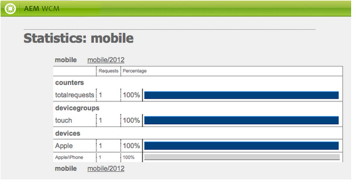

# Creazione di siti per dispositivi mobili{#creating-sites-for-mobile-devices}

>[!NOTE]
>
>L’Adobe consiglia di utilizzare l’Editor SPA per i progetti che richiedono il rendering lato client basato su framework di applicazione a pagina singola (ad esempio, React). [Ulteriori informazioni](/help/sites-developing/spa-overview.md).

La creazione di un sito mobile è simile alla creazione di un sito standard, in quanto comporta anche la creazione di modelli e componenti. Per ulteriori dettagli sulla creazione di modelli e componenti, consulta le pagine seguenti: [Modelli](/help/sites-developing/templates.md), [Componenti](/help/sites-developing/components.md), e [Guida introduttiva allo sviluppo per AEM Sites](/help/sites-developing/getting-started.md). La differenza principale consiste nell’abilitare le funzionalità mobili integrate di Adobe Experience Manager (AEM) all’interno del sito. Ciò si ottiene creando un modello che si basa sul componente Pagina mobile.

Valuta l’utilizzo di [design responsive](/help/sites-developing/responsive.md), creando un singolo sito per schermi di dimensioni multiple.

Per iniziare, puoi dare un’occhiata al **Sito di dimostrazione mobile We.Retail** disponibile nell’AEM.

Per creare un sito mobile, procedi come segue:

1. Creare il componente Pagina:

   * Imposta il `sling:resourceSuperType` proprietà a `wcm/mobile/components/page`
In questo modo il componente si basa sul componente Pagina mobile.

   * Creare `body.jsp` con la logica specifica del progetto.

1. Creare il modello di pagina:

   * Imposta il `sling:resourceType` al componente pagina appena creato.
   * Imposta il `allowedPaths` proprietà.

1. Crea la pagina di progettazione per il sito.
1. Crea la pagina principale del sito sotto `/content` nodo:

   * Imposta il `cq:allowedTemplates` proprietà.
   * Imposta il `cq:designPath` proprietà.

1. Nelle proprietà della pagina della directory principale del sito, imposta i gruppi di dispositivi in **Dispositivi mobili** scheda.
1. Creare le pagine del sito utilizzando il nuovo modello.

Il componente Pagina mobile ( `/libs/wcm/mobile/components/page`):

* Aggiunge il **Dispositivi mobili** nella finestra di dialogo delle proprietà della pagina.
* Attraverso i suoi `head.jsp`, recupera il gruppo di dispositivi mobili corrente dalla richiesta e, se viene trovato un gruppo di dispositivi, utilizza `drawHead()` metodo per includere il componente iniziale dell’emulatore associato al gruppo dispositivo (solo in modalità di authoring) e il CSS di rendering del gruppo dispositivo.

>[!NOTE]
>
>La pagina principale del sito mobile deve trovarsi al livello 1 della gerarchia dei nodi ed è consigliabile trovarsi al di sotto del nodo /content.

## Creazione di un sito mobile con Multi Site Manager {#creating-a-mobile-site-with-the-multi-site-manager}

Utilizza Multi Site Manager (MSM) per creare una Live Copy mobile da un sito standard. Il sito standard viene trasformato automaticamente in un sito mobile: il sito mobile dispone di tutte le funzioni dei siti mobili (ad esempio, l’edizione all’interno di un emulatore) e può essere gestito in sincronia con il sito standard. Consulta la sezione [Creazione di una Live Copy per canali diversi](/help/sites-administering/msm.md) nella pagina Gestione multisito.

## API mobile lato server {#server-side-mobile-api}

I pacchetti Java™ contenenti le classi mobili sono:

* [com.day.cq.wcm.mobile.api](https://developer.adobe.com/experience-manager/reference-materials/6-5/javadoc/com/day/cq/wcm/mobile/api/device/capability/package-summary.html) : definisce MobileConstants.
* [com.day.cq.wcm.mobile.api.device](https://developer.adobe.com/experience-manager/reference-materials/6-5/javadoc/com/day/cq/wcm/mobile/api/device/package-summary.html) : definisce Device, DeviceGroup e DeviceGroupList.
* [com.day.cq.wcm.mobile.api.device.capability](https://developer.adobe.com/experience-manager/reference-materials/6-5/javadoc/com/day/cq/wcm/mobile/api/device/capability/package-summary.html) : definisce DeviceCapability.
* [com.day.cq.wcm.mobile.api.wurfl](https://developer.adobe.com/experience-manager/reference-materials/6-5/javadoc/com/day/cq/wcm/workflow/api/package-summary.html) : definisce WurflQueryEngine.
* [com.day.cq.wcm.mobile.core](https://developer.adobe.com/experience-manager/reference-materials/6-5/javadoc/com/day/cq/wcm/mobile/core/package-summary.html) : definisce MobileUtil, che fornisce vari metodi di utilità che ruotano attorno a WCM Mobile.

### Componenti mobili {#mobile-components}

Il **Sito di dimostrazione mobile We.Retail** utilizza i seguenti componenti mobili che si trovano sotto `/libs/foundation/components`:

<table>
 <tbody>
  <tr>
   <td>Nome</td>
   <td>Gruppo</td>
   <td>Caratteristiche</td>
  </tr>
  <tr>
   <td>mobilefooter</td>
   <td>nascosto</td>
   <td>- piè di pagina</td>
  </tr>
  <tr>
   <td>mobileimage</td>
   <td>Mobile</td>
   <td>- in base al componente image foundation<br /> - esegue il rendering di un'immagine se il dispositivo è in grado di<br /> </td>
  </tr>
  <tr>
   <td>mobilelist</td>
   <td>Mobile</td>
   <td>- in base al componente di base elenco<br /> - listitem_teaser.jsp esegue il rendering di un’immagine se il dispositivo è in grado di<br /> </td>
  </tr>
  <tr>
   <td>mobilelogo</td>
   <td>nascosto</td>
   <td>- in base al componente base del logo<br /> - esegue il rendering di un'immagine se il dispositivo è in grado di<br /> </td>
  </tr>
  <tr>
   <td>riferimento mobile</td>
   <td>Mobile</td>
   <td><p>- simile al componente base di riferimento</p> <p>: mappa un componente textimage su un elemento mobiletextimage 1 e un componente immagine su un elemento mobiletextimage 1</p> </td>
  </tr>
  <tr>
   <td>mobiletextimage</td>
   <td>Mobile</td>
   <td>basato sul componente textimage foundation<br /> - esegue il rendering di un'immagine se il dispositivo è in grado di</td>
  </tr>
  <tr>
   <td>mobiletopnav</td>
   <td>nascosto</td>
   <td><p>- basato sul componente topnav foundation</p> <p>- esegue solo il rendering del testo</p> </td>
  </tr>
 </tbody>
</table>

#### Creazione di un componente mobile {#creating-a-mobile-component}

Il framework mobile dell’AEM consente di sviluppare componenti sensibili al dispositivo che emette la richiesta. Gli esempi di codice seguenti mostrano come utilizzare l’API mobile dell’AEM in un componente jsp e in particolare come:

* Ottieni il dispositivo dalla richiesta:
  `Device device = slingRequest.adaptTo(Device.class);`

* Ottieni il gruppo di dispositivi:
  `DeviceGroup deviceGroup = device.getDeviceGroup();`

* Ottieni le funzionalità del gruppo di dispositivi:
  `Collection<DeviceCapability> capabilities = deviceGroup.getCapabilities();`

* Ottieni gli attributi del dispositivo (chiave/valori di capacità non elaborati dal database WURFL):
  `Map<String,String> deviceAttributes = device.getAttributes();`

* Ottieni l’agente utente del dispositivo:
  `String userAgent = device.getUserAgent();`

* Ottieni l’elenco dei gruppi di dispositivi (gruppi di dispositivi assegnati al sito dall’autore) dalla pagina corrente:
  `DeviceGroupList deviceGroupList = currentPage.adaptTo(DeviceGroupList.class);`

* Verifica se il gruppo di dispositivi supporta le immagini
  `if (deviceGroup.hasCapability(DeviceCapability.CAPABILITY_IMAGES)) {`
...
OPPURE
  `if MobileUtil.hasCapability(request, DeviceCapability.CAPABILITY_IMAGES) {`
...

>[!NOTE]
>
>In un jsp, `slingRequest` è disponibile tramite `<sling:defineObjects>` tag e `currentPage` tramite `<cq:defineObjects>` tag.

### Emulatori {#emulators}

L’authoring basato su emulatore consente agli autori di creare pagine di contenuti destinate ai clienti di dispositivi mobili. L’authoring dei contenuti per dispositivi mobili segue lo stesso principio dell’editing WYSIWYG sul posto. Affinché gli autori possano percepire l’aspetto della pagina su un dispositivo mobile, una pagina di contenuto mobile viene modificata utilizzando un emulatore di dispositivo.

Gli emulatori per dispositivi mobili si basano sul framework dell’emulatore generico. Per ulteriori dettagli, consulta [Emulatori](/help/sites-developing/emulators.md).

L’emulatore del dispositivo visualizza il dispositivo mobile sulla pagina, mentre le normali modifiche (parsys, componenti) si verificano all’interno dello schermo del dispositivo. L’emulatore di dispositivi dipende dai gruppi di dispositivi configurati per il sito. È possibile assegnare diversi emulatori a un gruppo di dispositivi. Tutti gli emulatori sono quindi disponibili nella pagina del contenuto. Per impostazione predefinita, viene visualizzato il primo emulatore assegnato al primo gruppo di dispositivi assegnato al sito. Gli emulatori possono essere commutati tramite il carosello dell&#39;emulatore nella parte superiore della pagina o tramite il pulsante di modifica del Sidekick.

**Creazione di un emulatore**

Per creare un emulatore, vedi [Creazione di un emulatore mobile personalizzato](/help/sites-developing/emulators.md) nella pagina Emulatori generici.

**Caratteristiche principali degli emulatori mobili**

* Un gruppo di dispositivi è composto da uno o più emulatori: la pagina di configurazione del gruppo di dispositivi, ad esempio /etc/mobile/groups/touch, contiene il tag `emulators` proprietà sotto `jcr:content` nodo.
Nota: anche se è possibile che lo stesso emulatore appartenga a diversi gruppi di dispositivi, non ha molto senso.

* Tramite la finestra di dialogo di configurazione del gruppo di dispositivi, `emulators` viene impostata con il percorso degli emulatori desiderati. Esempio: `/libs/wcm/mobile/components/emulators/iPhone4`.

* I componenti dell’emulatore (ad esempio, `/libs/wcm/mobile/components/emulators/iPhone4`) estendere il componente emulatore mobile di base ( `/libs/wcm/mobile/components/emulators/base`).

* Ogni componente che estende l’emulatore mobile di base è disponibile per la selezione durante la configurazione di un gruppo di dispositivi. Gli emulatori personalizzati possono quindi essere facilmente creati o estesi.
* Al momento della richiesta in modalità di modifica, per eseguire il rendering della pagina viene utilizzata l’implementazione dell’emulatore.
* Quando il modello della pagina si basa sul componente della pagina mobile, le funzionalità dell’emulatore vengono integrate automaticamente nella pagina (tramite il `head.jsp` del componente pagina mobile).

### Gruppi dispositivo {#device-groups}

I gruppi di dispositivi mobili forniscono la segmentazione dei dispositivi mobili in base alle funzionalità del dispositivo. Un gruppo di dispositivi fornisce le informazioni necessarie per l’authoring basato su emulatori nell’istanza di authoring e per il rendering corretto dei contenuti nell’istanza di pubblicazione: una volta che gli autori hanno aggiunto contenuti alla pagina mobile e l’hanno pubblicata, la pagina può essere richiesta nell’istanza di pubblicazione. Al suo posto, la vista di modifica dell’emulatore riproduce la pagina di contenuto utilizzando uno dei gruppi di dispositivi configurati. La selezione del gruppo di dispositivi si verifica in base a [rilevamento di dispositivi mobili](#devicedetection). Il gruppo di dispositivi corrispondente fornisce quindi le informazioni necessarie sullo stile.

I gruppi di dispositivi sono definiti come pagine di contenuto sotto `/etc/mobile/devices` e utilizza **Gruppo dispositivi mobili** modello. Il modello gruppo di dispositivi funge da modello di configurazione per le definizioni dei gruppi di dispositivi sotto forma di pagine di contenuto. Le sue caratteristiche principali sono:

* Dove si trova: `/libs/wcm/mobile/templates/devicegroup`
* Percorso consentito: `/etc/mobile/groups/*`
* Componente Pagina: `wcm/mobile/components/devicegroup`

#### Assegnazione di gruppi di dispositivi al sito {#assigning-device-groups-to-your-site}

Quando crei un sito mobile, devi assegnare gruppi di dispositivi al sito. L’AEM fornisce tre gruppi di dispositivi a seconda delle funzionalità di rendering HTML e JavaScript del dispositivo:

* **Funzionalità** telefoni cellulari, per dispositivi come il Sony Ericsson W800 con supporto per HTML di base, ma senza supporto per immagini e JavaScript.
* **Smart** telefoni, per dispositivi come BlackBerry® con supporto per HTML e immagini di base, ma senza supporto per JavaScript.

* **Touch** telefoni, per dispositivi come iPad con supporto completo per HTML, immagini, JavaScript e rotazione dei dispositivi.

Come emulatori possono essere associati a un gruppo di dispositivi (vedi la sezione [Creazione di un gruppo di dispositivi](#creating-a-device-group)), l’assegnazione di un gruppo di dispositivi a un sito consente agli autori di selezionare tra gli emulatori associati al gruppo di dispositivi per modificare la pagina.

Per assegnare un gruppo di dispositivi al sito:

1. Nel browser, vai al **Siteadmin** console.
1. Apri la pagina root del tuo sito mobile di seguito **Siti Web**.
1. Apri le proprietà della pagina.
1. Seleziona la **Dispositivi mobili** scheda:

   * Definisci i gruppi di dispositivi.
   * Fai clic su **OK**.

>[!NOTE]
>
>Una volta definiti i gruppi di dispositivi per un sito, questi vengono ereditati da tutte le pagine del sito.

#### Filtri per gruppo dispositivo {#device-group-filters}

I filtri per gruppi di dispositivi definiscono criteri basati sulle funzionalità per determinare se un dispositivo appartiene al gruppo. Quando crei un gruppo di dispositivi, puoi selezionare i filtri da utilizzare per la valutazione dei dispositivi.

In fase di esecuzione, quando l’AEM riceve una richiesta HTTP da un dispositivo, ogni filtro associato a un gruppo confronta le funzionalità del dispositivo con criteri specifici. Il dispositivo viene considerato appartenente al gruppo quando dispone di tutte le funzionalità necessarie per i filtri. Le funzionalità vengono recuperate dal database WURFL™.

I gruppi di dispositivi possono utilizzare zero o più filtri per il rilevamento delle funzionalità. Inoltre, un filtro può essere utilizzato con più gruppi di dispositivi. L’AEM fornisce un filtro predefinito che determina se il dispositivo dispone delle funzionalità selezionate per un gruppo:

* CSS
* Immagini JPG e PNG
* JavaScript
* Rotazione del dispositivo

Se il gruppo di dispositivi non utilizza un filtro, le funzionalità selezionate configurate per il gruppo sono le uniche necessarie per un dispositivo.

Per ulteriori informazioni, consulta [Creazione di filtri per gruppi di dispositivi](/help/sites-developing/groupfilters.md).

#### Creazione di un gruppo di dispositivi {#creating-a-device-group}

Creare un gruppo di dispositivi quando i gruppi installati da AEM non soddisfano le proprie esigenze.

1. Nel browser, vai al **Strumenti** console.
1. Crea una pagina di seguito **Strumenti** > **Dispositivi mobili** > **Gruppi di dispositivi**. In **Crea pagina** finestra di dialogo:

   * As **Titolo**, immetti `Special Phones`.

   * As **Nome**, immetti `special`.

   * Seleziona la **Modello per gruppo dispositivi mobili**.
   * Fai clic su **Crea**.

1. In CRXDE, aggiungi un **static.css** file contenente gli stili per il gruppo di dispositivi sotto `/etc/mobile/groups/special` nodo.

1. Apri **Telefoni speciali** pagina.
1. Per configurare il gruppo di dispositivi, fare clic su **Modifica** pulsante accanto a **Impostazioni**.
Il giorno **Generale** scheda:

   * **Titolo**: nome del gruppo di dispositivi mobili.
   * **Descrizione**: descrizione del gruppo.
   * **User-Agent**: stringa user-agent a cui corrispondono i dispositivi. È facoltativo e può essere un regex. Esempio: `BlackBerryZ10`
   * **Funzionalità**: definisce se il gruppo può gestire immagini, CSS, JavaScript o la rotazione del dispositivo.
   * **Larghezza minima dello schermo** e **Altezza**
   * **Disabilita emulatore**: per abilitare/disabilitare l’emulatore durante la modifica del contenuto.

   Il giorno **Emulatori** scheda:

   * **Emulatori**: seleziona gli emulatori assegnati a questo gruppo di dispositivi.

   Il giorno **Filtri** scheda:

   * Per aggiungere un filtro, fai clic su Aggiungi elemento, quindi seleziona un filtro dall’elenco a discesa.
   * I filtri vengono valutati nell’ordine in cui vengono visualizzati. Quando un dispositivo non soddisfa i criteri di un filtro, i filtri successivi nell’elenco non vengono valutati.

1. Fai clic su OK.

La finestra di dialogo per la configurazione del gruppo di dispositivi mobili si presenta così:


#### CSS personalizzato per gruppo di dispositivi {#custom-css-per-device-group}

Come descritto in precedenza, è possibile associare un CSS personalizzato a una pagina del gruppo di dispositivi, in modo analogo al CSS di una pagina di progettazione. Questo CSS viene utilizzato per influenzare il rendering specifico del gruppo di dispositivi del contenuto della pagina durante l’authoring e la pubblicazione. Questo CSS viene quindi incluso automaticamente:

* Nella pagina dell’istanza di authoring, per ogni emulatore utilizzato da questo gruppo di dispositivi.
* Nella pagina dell’istanza Publish, se l’agente utente della richiesta corrisponde a un dispositivo mobile di questo particolare gruppo di dispositivi.

## Rilevamento dispositivo lato server {#server-side-device-detection}

Utilizza i filtri e una libreria di specifiche del dispositivo per determinare le funzionalità del dispositivo che esegue la richiesta HTTP.

### Sviluppa filtri per gruppo di dispositivi {#develop-device-group-filters}

Crea un filtro per gruppi di dispositivi per definire un set di requisiti di funzionalità per dispositivi. Crea tutti i filtri necessari per eseguire il targeting dei gruppi necessari di funzionalità del dispositivo.

Progetta i filtri in modo da poterne utilizzare le combinazioni per definire i gruppi di funzionalità. In genere, le funzionalità dei diversi gruppi di dispositivi si sovrappongono. Pertanto, è possibile utilizzare alcuni filtri con più definizioni di gruppi di dispositivi.

Dopo aver creato un filtro, puoi utilizzarlo nella configurazione del gruppo.

Per ulteriori informazioni, visitare il sito [Creazione di filtri per gruppi di dispositivi](/help/sites-developing/groupfilters.md).

### Utilizzo del database WURFL™ {#using-the-wurfl-database}

L’AEM utilizza una versione troncata del [WURFL](https://wurfl.sourceforge.net/)™ database per eseguire query sulle funzionalità del dispositivo, ad esempio la risoluzione dello schermo o il supporto JavaScript, in base all’agente utente del dispositivo.

Il codice XML del database WURFL™ è rappresentato come nodi di seguito `/var/mobile/devicespecs` analizzando `wurfl.xml`file in `/libs/wcm/mobile/devicespecs/wurfl.xml.` L’espansione ai nodi si verifica la prima volta che il `cq-mobile-core` bundle avviato.

Le funzionalità dei dispositivi sono memorizzate come proprietà dei nodi e i nodi rappresentano modelli di dispositivi. È possibile utilizzare le query per recuperare le funzionalità di un dispositivo o di un agente utente.

Con l&#39;evoluzione del database WURFL™, potrebbe essere necessario personalizzarlo o sostituirlo. Per aggiornare il database dei dispositivi mobili, sono disponibili le seguenti opzioni:

* Sostituisci il file con la versione più recente, se disponi di una licenza che consente questo utilizzo. Vedere Installazione di un altro database WURFL.
* Utilizza la versione disponibile in AEM e configura un regexp che corrisponda alle stringhe dell’agente utente e punti a un dispositivo WURFL™ esistente. Consulta [Aggiunta di una corrispondenza agente utente basata su regexp](#adding-a-regexp-based-user-agent-matching).

#### Verifica della mappatura di un agente utente sulle funzionalità WURFL™ {#testing-the-mapping-of-a-user-agent-to-wurfl-capabilities}

Quando un dispositivo accede al sito mobile, l’AEM rileva il dispositivo, lo mappa su un gruppo di dispositivi in base alle sue funzionalità e invia una visualizzazione della pagina che corrisponde al gruppo di dispositivi. Il gruppo di dispositivi corrispondente fornisce le informazioni necessarie sullo stile. Le mappature possono essere testate nella pagina di test agente utente mobile:

`https://localhost:4502/etc/mobile/useragent-test.html`

#### Installazione di un database WURFL™ diverso {#installing-a-different-wurfl-database}

Il database WURFL™ troncato installato con AEM è una versione precedente al 30 agosto 2011. Se la tua versione del WURFL è stata rilasciata dopo il 30 agosto 2011, assicurati che il tuo utilizzo sia conforme alla licenza.

Per installare un database WURFL™:

1. In CRXDE Liti, crea la seguente cartella: `/apps/wcm/mobile/devicespecs`
1. Copiare il file WURFL™ nella cartella.
1. Rinomina il file come `wurfl.xml`.

AEM analizza automaticamente `wurfl.xml` e aggiorna i nodi sottostanti `/var/mobile/devicespecs`.

>[!NOTE]
>
>Quando il database WURFL™ completo è attivato, l&#39;analisi e l&#39;attivazione potrebbero richiedere alcuni minuti. Puoi controllare i registri per informazioni sull’avanzamento.

#### Aggiunta di una corrispondenza agente utente basata su regexp {#adding-a-regexp-based-user-agent-matching}

Aggiungi user-agent come espressione regolare sotto /apps/wcm/mobile/devicespecs/wurfl/regexp per puntare a un tipo di dispositivo WURFL™ esistente.

1. In entrata **CRXDE Liti**, crea un nodo sotto /apps/wcm/mobile/devicespecs/regexp, ad esempio, `apple_ipad_ver1`.
1. Aggiungi le seguenti proprietà al nodo:

   * **regexp**: espressione regolare che definisce gli user-agents, ad esempio: .&#42;Mozilla.&#42;iPad.&#42;AppleWebKit&#42;Safari.&#42;
   * **deviceId**: l’ID dispositivo definito nel file wurfl.xml, ad esempio, `apple_ipad_ver1`

La configurazione precedente fa sì che i dispositivi per i quali l’agente utente corrisponde all’espressione regolare fornita vengano mappati sull’ID dispositivo apple_ipad_ver1 WURFL™, se presente.

## Rilevamento dispositivo lato client {#client-side-device-detection}

Questa sezione descrive come utilizzare il rilevamento dell’AEM lato client del dispositivo per ottimizzare il rendering della pagina o per fornire al client versioni alternative del sito web.

AEM supporta il rilevamento lato client del dispositivo basato su `BrowserMap`. `BrowserMap` viene fornito in AEM come libreria client in `/etc/clientlibs/browsermap`.

`BrowserMap` fornisce tre strategie che è possibile utilizzare per fornire un sito Web alternativo a un cliente, che viene utilizzato nel seguente ordine:

1. [Collegamenti alternativi](#providing-alternate-links)
1. [URL specifico del gruppo di dispositivi](#definingdevicegroupspecificurl)
1. [URL basato su selettore](#defining-selector-based-urls)

>[!NOTE]
>
Per ulteriori informazioni sull’integrazione della libreria client, consulta [Utilizzo delle librerie HTML lato client](/help/sites-developing/clientlibs.md).

### Fornitura di collegamenti alternativi {#providing-alternate-links}

Il `PageVariantsProvider` Il servizio OSGi è in grado di generare collegamenti alternativi per i siti appartenenti alla stessa famiglia. Per configurare i siti da considerare per il servizio, è necessario `cq:siteVariant` deve essere aggiunto al `jcr:content` dalla directory principale del sito.

Il `cq:siteVariant` il nodo deve avere le seguenti proprietà:

* `cq:childNodesMapTo` - determina a quale attributo dell’elemento di collegamento verranno mappati i nodi secondari; si consiglia di organizzare il contenuto del sito web in modo che gli elementi secondari del nodo principale rappresentino la radice per una variante di lingua del sito web globale (ad esempio, `/content/mysite/en`, `/content/mysite/de`), nel qual caso il valore della proprietà `cq:childNodesMapTo` dovrebbe essere `hreflang`;
* `cq:variantDomain` - indica cosa `Externalizer` Il dominio viene utilizzato per generare gli URL assoluti delle varianti di pagina. Se questo valore non è impostato, le varianti di pagina verranno generate utilizzando collegamenti relativi.
* `cq:variantFamily` - indica a quale famiglia di siti web appartiene questo sito; più rappresentazioni specifiche per dispositivo dello stesso sito web dovrebbero appartenere alla stessa famiglia;
* `media` : memorizza i valori dell’attributo media dell’elemento link; si consiglia di utilizzare il nome dell’elemento link `BrowserMap` registrato `DeviceGroups`, affinché il `BrowserMap` libreria può inoltrare automaticamente i client alla variante corretta del sito web.

#### PageVariantsProvider ed Externalizer {#pagevariantsprovider-and-externalizer}

Quando il valore di `cq:variantDomain` proprietà di un `cq:siteVariant` nodo non è vuoto, il `PageVariantsProvider` genera collegamenti assoluti utilizzando questo valore come dominio configurato per `Externalizer` servizio. Assicurati di configurare `Externalizer` per riflettere la configurazione.

>[!NOTE]
>
Quando si lavora con l’AEM, esistono diversi metodi per gestire le impostazioni di configurazione per tali servizi; vedi [Configurazione di OSGi](/help/sites-deploying/configuring-osgi.md) per ulteriori dettagli e le pratiche consigliate.

### Definizione di un URL specifico per un gruppo di dispositivi {#defining-a-device-group-specific-url}

Se non desideri utilizzare collegamenti alternativi, puoi configurare un URL globale per ciascuno di essi `DeviceGroup`. L’Adobe consiglia di creare una libreria client personalizzata che incorpori `browsermap.standard` ma ridefinisce i gruppi di dispositivi.

BrowserMap è progettato in modo tale che le definizioni dei gruppi di dispositivi possano essere ignorate creando e aggiungendo un gruppo di dispositivi con lo stesso nome al `BrowserMap` oggetto dalla libreria client personalizzata.

>[!NOTE]
>
Per ulteriori dettagli, consulta [Mappa browser personalizzata](#creatingacustomisedbrowsermap).

### Definizione degli URL basati su selettori {#defining-selector-based-urls}

Se non è stato utilizzato nessuno dei meccanismi precedenti per indicare un sito alternativo per `BrowserMap`, quindi i selettori che utilizzeranno i nomi dei `DeviceGroups` verrà aggiunto al `URL`s, nel qual caso è necessario fornire i propri servlet che gestiranno le richieste.

Ad esempio, la navigazione di un dispositivo `www.example.com/index.html` identificato come `smartphone` by BrowserMap viene inoltrato a `www.example.com/index.smartphone.html.`

### Utilizzo di BrowserMap sulle pagine {#using-browsermap-on-your-pages}

Per utilizzare la libreria client BrowserMap standard in una pagina, è necessario includere `/libs/wcm/core/browsermap/browsermap.jsp` file che utilizza un `cq:include`tag in della pagina `head` sezione.

```xml
<cq:include script="/libs/wcm/core/browsermap/browsermap.jsp" />
```

Oltre ad aggiungere `BrowserMap` libreria client nel tuo `JSP` , è inoltre necessario aggiungere un `cq:deviceIdentificationMode` Proprietà stringa impostata su `client-side` al `jcr:content` sotto la directory principale del sito web.

### Sovrascrittura del comportamento predefinito di BrowserMap {#overriding-browsermap-s-default-behaviour}

Se desideri personalizzare `BrowserMap` - escludendo `DeviceGroups` o aggiungendo più sonde: è necessario creare una libreria lato client in cui incorporare il `browsermap.standard`libreria lato client.

Inoltre, devi chiamare manualmente il `BrowserMap.forwardRequest()` metodo nel tuo `JavaScript` codice.

>[!NOTE]
>
Per ulteriori informazioni sull’integrazione della libreria client, consulta [Utilizzo delle librerie HTML lato client](/help/sites-developing/clientlibs.md).

Dopo aver creato il personalizzato `BrowserMap` libreria client, l’Adobe suggerisce il seguente approccio:

1. Creare un `browsermap.jsp` file nell’applicazione

   ```xml
   <%@include file="/libs/foundation/global.jsp" %>
   <%@ taglib prefix="c" uri="https://java.sun.com/jsp/jstl/core" %>
   <%@ page import="
       com.day.cq.wcm.api.variants.PageVariant,
       com.day.cq.wcm.api.variants.PageVariantsProvider,
       com.day.cq.wcm.api.devicedetection.DeviceIdentificationMode,
       com.day.cq.wcm.api.WCMMode"
   %>
   <%
       final PageVariantsProvider p = sling.getService(PageVariantsProvider.class);
       if(p == null) {
           throw new IllegalStateException("Missing PageVariantsProvider service");
       }
       for(PageVariant v : p.getVariants(currentPage, slingRequest)) {
           final String curVar = v.getAttributes().get("data-current-variant");
           String media = v.getAttributes().get("media");
           if (media != null) {
               media = media.replaceAll(" ", "");
           }
   %>
       <link
           rel="alternate"
           data-cq-role="site.variant"
           title="<%= xssAPI.encodeForHTMLAttr(v.getTitle()) %>"
           hreflang="<%= xssAPI.encodeForHTMLAttr(v.getAttributes().get("hreflang")) %>"
           media="<%= xssAPI.encodeForHTMLAttr(media) %>"
           href="<%= xssAPI.getValidHref(v.getURL()) %>"
           <% if(curVar != null) { %> data-current-variant="<%= curVar %>"<% } %>
       />
   <%
       }
       Boolean browserMapEnabled = true;
       final DeviceIdentificationMode dim = sling.getService(DeviceIdentificationMode.class);
       String[] selectors  = slingRequest.getRequestPathInfo().getSelectors();
       boolean isPortletRequest = false;
       for (int i = 0; i < selectors.length; i++) {
           if ("portlet".equals(selectors[i])) {
               isPortletRequest = true;
               break;
           }
       }
       if (isPortletRequest) {
           log.debug("Request was made by a portlet container - BrowserMap will not be embedded");
       } else {
           final WCMMode wcmMode = WCMMode.fromRequest(slingRequest);
           boolean shouldIncludeClientLib = false;
           if (WCMMode.EDIT != wcmMode && WCMMode.PREVIEW != wcmMode && WCMMode.DESIGN != wcmMode) {
               if (dim != null) {
                   final String mode = dim.getDeviceIdentificationModeForPage(currentPage);
                   shouldIncludeClientLib = DeviceIdentificationMode.CLIENT_SIDE.equals(mode);
                   if (shouldIncludeClientLib) {
                       browserMapEnabled = (Boolean) request.getAttribute("browsermap.enabled");
                       if (browserMapEnabled == null) {
                           browserMapEnabled = true;
                       }
                   }
               }
           }
   %>
           <c:if test="<%= !browserMapEnabled %>">
               <meta name="browsermap.enabled" content="false">
           </c:if>
           <c:if test="<%= shouldIncludeClientLib %>">
               <meta name="viewport" content="width=device-width, initial-scale=1.0">
               <cq:includeClientLib categories="browsermap.custom"/>
           </c:if>
   <%
       }
   %>
   ```

1. Includi `broswermap.jsp` nella sezione head.

   ```xml
   <cq:include script="browsermap.jsp" />
   ```

### Esclusione di BrowserMap da alcune pagine {#excluding-browsermap-from-certain-pages}

Se desideri escludere la libreria BrowserMap da alcune pagine in cui non è necessario il rilevamento client, puoi aggiungere un attributo di richiesta:

```xml
<%
request.setAttribute("browsermap.enabled", false);
%>
```

Questo renderà `/libs/wcm/core/browsermap/browsermap.jsp` script per aggiungere un tag meta alla pagina che `BrowserMap` per non eseguire alcun rilevamento:

```xml
<meta name="browsermap.enabled" content="false">
```

### Verifica di una versione specifica di un sito Web {#testing-a-specific-version-of-a-web-site}

Normalmente, lo script BrowserMap reindirizza sempre i visitatori alla versione più adatta del sito web, in genere reindirizzando i visitatori al desktop o al sito mobile quando necessario.

Puoi forzare il dispositivo di qualsiasi richiesta a testare una versione specifica di un sito web aggiungendo il `device` all&#39;URL. L’URL seguente esegue il rendering della versione mobile del sito web Geometrixx Outdoors.

`https://localhost:4502/content/geometrixx-outdoors/en.html?wcmmode=disabled&device=smartphone`

>[!NOTE]
>
Il `wcmmode` il parametro è impostato su `disabled` per simulare il comportamento di un&#39;istanza Publish.

Il valore del dispositivo di esclusione è memorizzato in un cookie che ti consente di navigare nel sito web senza aggiungere il `device` parametro per ogni `URL`.

Di conseguenza, è necessario chiamare lo stesso `URL` con `device` imposta su `browser` per tornare alla versione desktop del sito web.

>[!NOTE]
>
BrowserMap memorizza il valore del dispositivo di override in un cookie denominato `BMAP_device`. L’eliminazione di questo cookie assicura che CQ distribuisca la versione appropriata del sito web in base al dispositivo corrente (ad esempio desktop o mobile).

## Elaborazione di richieste mobili {#mobile-request-processing}

L’AEM elabora come segue una richiesta emessa da un dispositivo mobile che appartiene al gruppo di dispositivi touch:

1. Un’iPad invia una richiesta all’istanza di pubblicazione dell’AEM, ad esempio: `https://localhost:4503/content/geometrixx_mobile/en/products.html`
1. AEM determina se il sito della pagina richiesta è un sito mobile (verificando se la pagina di primo livello `/content/geometrixx_mobile` estende il componente pagina mobile). In caso affermativo:
1. AEM cerca le funzionalità del dispositivo in base all’agente utente nell’intestazione della richiesta.
1. AEM mappa le funzionalità del dispositivo al gruppo di dispositivi e imposta `touch` come selettore del gruppo di dispositivi.
1. AEM reindirizza la richiesta a `https://localhost:4503/content/geometrixx_mobile/en/products.touch.html.`
1. L’AEM invia la risposta all’iPad:

   * `products.touch.html` viene renderizzato nel modo abituale ed è memorizzabile in cache.
   * I componenti di rendering utilizzano i selettori per adattare la presentazione.
   * AEM aggiunge automaticamente il selettore mobile a tutti i collegamenti interni nella pagina.

### Statistiche {#statistics}

Puoi ottenere alcune statistiche sul numero di richieste effettuate al server AEM dai dispositivi mobili. Il numero di richieste può essere suddiviso:

* per gruppo di dispositivi e dispositivo
* all’anno, al mese e al giorno

Per visualizzare le statistiche:

1. Vai a **Strumenti** console.
1. Apri **Statistiche dispositivo** pagina sotto **Strumenti** > **Dispositivi mobili**.
1. Fare clic sul collegamento per visualizzare le statistiche relative a un anno, un mese o un giorno specifico.

Il **Statistiche** La pagina si presenta come segue:



>[!NOTE]
>
Il **Statistiche** viene creata la prima volta che viene rilevato un dispositivo mobile che accede all’AEM. Prima di allora, non era disponibile.

Per generare una voce nelle statistiche, procedere come segue:

1. Utilizza un dispositivo mobile o un emulatore (come, ad esempio, https://chrispederick.com/work/user-agent-switcher/ su Firefox).
1. Richiedi una pagina mobile nell’istanza di authoring disabilitando la modalità di authoring, ad esempio:
   `https://localhost:4502/content/geometrixx_mobile/en/products.html?wcmmode=disabled`

Il **Statistiche** è ora disponibile.

### Supporto del caching delle pagine per i collegamenti &quot;Invia collegamento a un amico&quot; {#supporting-page-caching-for-send-link-to-a-friend-links}

Le pagine mobili possono essere memorizzate nella cache in Dispatcher, perché quelle di cui è stato eseguito il rendering per un gruppo di dispositivi sono distinte nell’URL della pagina dal selettore del gruppo di dispositivi, ad esempio `/content/mobilepage.touch.html`. Una richiesta a una pagina mobile senza un selettore non viene mai memorizzata nella cache, come in questo caso, il rilevamento del dispositivo funziona e infine viene reindirizzato al gruppo di dispositivi corrispondente (o &quot;nomatch&quot; per tale questione). Una pagina mobile di cui è stato eseguito il rendering con un selettore di gruppo dispositivo viene elaborata dal rewriter del collegamento, che riscrive tutti i collegamenti all’interno della pagina in modo da contenere anche il selettore di gruppo dispositivo, impedendo di rieseguire il rilevamento del dispositivo per ogni clic su una pagina già qualificata.

Pertanto, potresti incontrare lo scenario seguente:

L&#39;utente Alice viene reindirizzato a `coolpage.feature.html`, e invia tale URL a un amico Bob che vi accede con un client diverso che rientra nel `touch` gruppo di dispositivi.

Se `coolpage.feature.html` viene fornito da una cache front-end, l’AEM non ha la possibilità di analizzare la richiesta per scoprire che il selettore mobile non corrisponde al nuovo agente utente e Bob ottiene la rappresentazione errata.

Per risolverlo, puoi includere nelle pagine una semplice interfaccia utente di selezione, in cui gli utenti finali possono ignorare il gruppo di dispositivi selezionato dall’AEM. Nell’esempio precedente, un collegamento (o un’icona) sulla pagina consente all’utente finale di passare a `coolpage.touch.html` se pensano che il loro dispositivo sia abbastanza buono per questo.
