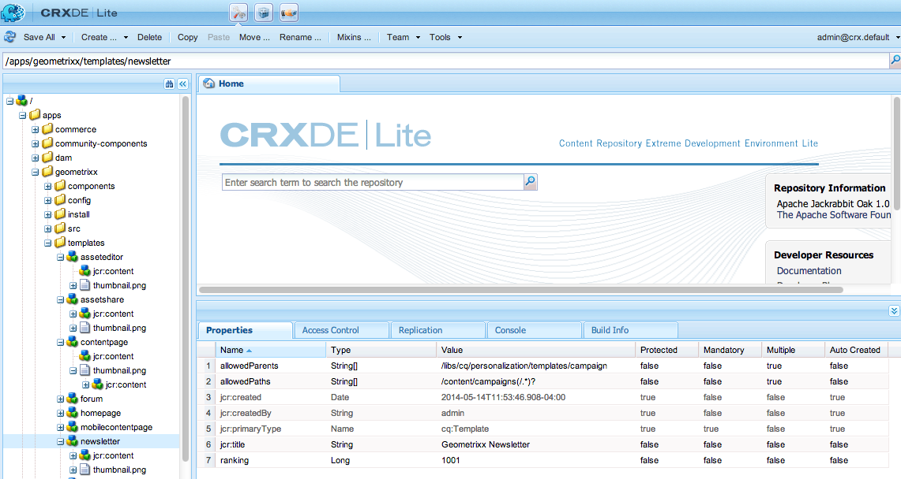

# Modelli di pagina - Static{#page-templates-static}

Un modello viene utilizzato per creare una pagina e definisce quali componenti possono essere utilizzati all’interno dell’ambito selezionato. Un modello è una gerarchia di nodi con la stessa struttura della pagina da creare, ma senza alcun contenuto effettivo.

Ogni modello vi presenta una selezione di componenti disponibili per l’uso.

* I modelli sono composti di [Componenti](/help/sites-developing/components.md);
* I componenti utilizzano e consentono l&#39;accesso ai Widget e questi vengono utilizzati per il rendering del contenuto.

>[!NOTE]
>
>[Sono inoltre disponibili ](/help/sites-developing/page-templates-editable.md) modelli modificabili che rappresentano il tipo consigliato di modelli per la maggior flessibilità e per le funzioni più recenti.

## Proprietà e nodi secondari di un modello {#properties-and-child-nodes-of-a-template}

Un modello è un nodo di tipo cq:Template con le seguenti proprietà e nodi secondari:

<table>
 <tbody>
  <tr>
   <td><strong>Nome   </strong></td>
   <td><strong>Tipo   </strong></td>
   <td><strong>Descrizione   </strong></td>
  </tr>
  <tr>
   <td>.   </td>
   <td> cq:Template</td>
   <td>Modello corrente. Un modello è di tipo nodo cq:Template.  </td>
  </tr>
  <tr>
   <td> allowChildren </td>
   <td> Stringa[]</td>
   <td>Percorso di un modello che può essere un elemento secondario di questo modello.  </td>
  </tr>
  <tr>
   <td> allowParents</td>
   <td> Stringa[]</td>
   <td>Percorso di un modello che può essere un elemento padre del modello.  </td>
  </tr>
  <tr>
   <td> allowPaths</td>
   <td> Stringa[]</td>
   <td>Percorso di una pagina che può essere basata su questo modello.  </td>
  </tr>
  <tr>
   <td> jcr:created</td>
   <td> Data</td>
   <td>Data di creazione del modello.  </td>
  </tr>
  <tr>
   <td> jcr:description</td>
   <td> Stringa</td>
   <td>Descrizione del modello.  </td>
  </tr>
  <tr>
   <td> jcr:title</td>
   <td> Stringa</td>
   <td>Titolo del modello.  </td>
  </tr>
  <tr>
   <td> classifica</td>
   <td> Lungo</td>
   <td>Classifica del modello. Utilizzato per visualizzare il modello nell'interfaccia utente.  </td>
  </tr>
  <tr>
   <td> jcr:content</td>
   <td> cq:PageContent</td>
   <td>Nodo contenente il contenuto del modello.  </td>
  </tr>
  <tr>
   <td> thumbnail.png</td>
   <td> nt:file</td>
   <td>Miniatura del modello.  </td>
  </tr>
  <tr>
   <td> icon.png</td>
   <td> nt:file</td>
   <td>Icona del modello.  </td>
  </tr>
 </tbody>
</table>

Un modello è la base di una pagina.

Per creare una pagina, il modello deve essere copiato (struttura ad albero nodo `/apps/<myapp>/template/<mytemplate>`) nella posizione corrispondente nella struttura ad albero del sito: questo è ciò che accade se una pagina viene creata utilizzando la scheda **Siti Web**.

Questa azione di copia assegna alla pagina anche il contenuto iniziale (in genere Contenuto di livello principale) e la proprietà sling:resourceType, il percorso del componente della pagina utilizzato per eseguire il rendering della pagina (tutto nel nodo figlio jcr:content).

## Struttura dei modelli {#how-templates-are-structured}

Occorre considerare due aspetti:

* la struttura del modello stesso
* la struttura del contenuto prodotto quando viene utilizzato un modello

### Struttura di un modello {#the-structure-of-a-template}

Un modello viene creato sotto un nodo di tipo **cq:Template**.

È possibile impostare diverse proprietà, in particolare:

* **jcr:title** - title per il modello; viene visualizzata nella finestra di dialogo durante la creazione di una pagina.
* **jcr:description** - descrizione del modello; viene visualizzata nella finestra di dialogo durante la creazione di una pagina.

Questo nodo contiene un nodo jcr:content (cq:PageContent) da utilizzare come base per il nodo di contenuto delle pagine risultanti; questo fa riferimento, utilizzando sling:resourceType, al componente da utilizzare per il rendering del contenuto effettivo di una nuova pagina.

Questo componente viene utilizzato per definire la struttura e la progettazione del contenuto al momento della creazione di una nuova pagina.

### Contenuto prodotto da un modello {#the-content-produced-by-a-template}

I modelli vengono utilizzati per creare pagine di tipo `cq:Page` (come indicato in precedenza, una pagina è un tipo speciale di componente). Ogni pagina AEM ha un nodo strutturato `jcr:content`. Tale comportamento:

* è di tipo cq:PageContent
* è un tipo di nodo strutturato che contiene una definizione del contenuto definita
* dispone di una proprietà `sling:resourceType` per fare riferimento al componente che contiene gli script sling utilizzati per il rendering del contenuto

### Modelli predefiniti {#default-templates}

AEM viene fornito con una serie di modelli predefiniti disponibili. In alcuni casi, potrebbe essere utile utilizzare i modelli così come sono. In tal caso, è necessario assicurarsi che il modello sia disponibile per il sito Web.

Ad esempio, AEM sono disponibili diversi modelli, tra cui una pagina di contenuto e una home page.

| **Titolo** | **Componente** | **Posizione** | **Scopo** |
|---|---|---|---|
| Home page | homepage | geometrixx | Modello della home page di Geometrixx. |
| Pagina contenuto | contentpage | geometrixx | Modello della pagina di contenuto di Geometrixx. |

#### Visualizzazione dei modelli predefiniti {#displaying-default-templates}

Per visualizzare un elenco di tutti i modelli nella directory archivio, procedere come segue:

1. In CRXDE Lite, aprite il menu **Strumenti** e fate clic su **Query**.

1. Nella scheda Query
1. Per **Tipo** selezionate **XPath**.

1. Nel campo di inserimento **Query** immettete la stringa seguente:
//element(*, cq:Template)

1. Fate clic su **Esegui**. Nella casella dei risultati viene visualizzato l’elenco di modelli disponibili.

Nella maggior parte dei casi, si prende un modello esistente e ne si sviluppa uno nuovo per uso personale. Per ulteriori informazioni, vedere [Sviluppo di modelli di pagina](#developing-page-templates).

Per abilitare un modello esistente per il sito Web e visualizzarlo nella finestra di dialogo **Crea pagina** quando si crea una pagina all&#39;interno di **Siti Web** dalla console **Siti Web**, impostare la proprietà allowPaths del nodo del modello su: **/content(/.*)?**

## Modalità di applicazione delle strutture dei modelli {#how-template-designs-are-applied}

Quando gli stili vengono definiti nell&#39;interfaccia utente utilizzando la modalità [Progettazione](/help/sites-authoring/default-components-designmode.md), la progettazione viene mantenuta nel percorso esatto del nodo di contenuto per il quale è definito lo stile.

>[!CAUTION]
>
> Adobe consiglia di applicare le progettazioni solo tramite [Modalità progettazione](/help/sites-authoring/default-components-designmode.md).
>
>Ad esempio, la modifica dei progetti in CRX DE non è consigliata e l’applicazione di tali progetti può variare da un comportamento all’altro.

Se le progettazioni vengono applicate solo in modalità Progettazione, non sono applicabili le sezioni seguenti, [Risoluzione percorso progettazione](/help/sites-developing/page-templates-static.md#design-path-resolution), [Albero decisionale](/help/sites-developing/page-templates-static.md#decision-tree) e [Esempio](/help/sites-developing/page-templates-static.md#example).

### Risoluzione percorso progettazione {#design-path-resolution}

Quando eseguite il rendering del contenuto basato su un modello statico, AEM tenterà di applicare al contenuto gli stili e la struttura più rilevanti in base a un passaggio della gerarchia dei contenuti.

AEM determina lo stile più rilevante per un nodo di contenuto nell&#39;ordine seguente:

* Se è presente una progettazione per il percorso completo ed esatto del nodo di contenuto (come quando la progettazione viene definita in modalità Progettazione), utilizzate tale progettazione.
* Se è presente una progettazione per il nodo di contenuto dell&#39;elemento padre, utilizzatela.
* Se esiste una progettazione per qualsiasi nodo sul percorso del nodo di contenuto, utilizzate tale progettazione.

Negli ultimi due casi, se è presente più di una progettazione applicabile, utilizzate quella più vicina al nodo del contenuto.

### Albero decisionale {#decision-tree}

Si tratta di una rappresentazione grafica della logica [Risoluzione percorso progettazione](/help/sites-developing/page-templates-static.md#design-path-resolution).

### Esempio {#example}

Considerate la struttura di contenuto semplice come segue, in cui una progettazione può essere applicata a uno qualsiasi dei nodi:

`/root/branch/leaf`

Nella tabella seguente viene descritto come AEM scegliere una progettazione.

<table>
 <tbody>
  <tr>
   <td><strong>Ricerca Di Design Per  </strong></td>
   <td><strong>Esistono Designer Per  </strong></td>
   <td><strong>Progettazione scelta  </strong></td>
   <td><strong>Commento</strong></td>
  </tr>
  <tr>
   <td><code class="code">leaf
      </code></td>
   <td>
<code>root</code>
 
<code>branch</code>
 
<code>leaf</code>
 </td>
   <td><code>leaf</code></td>
   <td>La corrispondenza più esatta viene sempre presa.  </td>
  </tr>
  <tr>
   <td><code>leaf</code></td>
   <td>
<code>root</code>
 
<code>branch</code>
 </td>
   <td><code>branch</code></td>
   <td>Tornate alla corrispondenza più vicina nella parte inferiore della struttura.</td>
  </tr>
  <tr>
   <td><code>leaf</code></td>
   <td><code>root</code></td>
   <td><code>root</code></td>
   <td>Se tutto il resto non riesce, prendere il resto.  </td>
  </tr>
  <tr>
   <td><code>branch</code></td>
   <td><code>branch</code></td>
   <td><code>branch</code></td>
   <td> </td>
  </tr>
  <tr>
   <td><code>branch</code></td>
   <td>
<code>branch</code>
 
<code class="code">leaf
       </code>
 </td>
   <td><code>branch</code></td>
   <td> </td>
  </tr>
  <tr>
   <td><code>branch</code></td>
   <td>
<code>root</code>
 
<code class="code">branch
       </code>
 </td>
   <td><code>branch</code></td>
   <td> </td>
  </tr>
  <tr>
   <td><code>branch</code></td>
   <td>
<code>root</code>
 
<code class="code">leaf
       </code>
 </td>
   <td><code>root</code></td>
   <td>
Se non c'è una corrispondenza esatta, prendete quella più in basso nell'albero.
 
Il presupposto è che questo sarà sempre applicabile, ma più in alto la struttura ad albero può essere troppo specifica.  
 </td>
  </tr>
 </tbody>
</table>

## Sviluppo di modelli di pagina {#developing-page-templates}

AEM modelli di pagina sono semplicemente modelli utilizzati per creare nuove pagine. Possono contenere il contenuto iniziale, o il numero di contenuto, necessario, il cui ruolo consiste nel creare le strutture di nodi iniziali corrette, con le proprietà richieste (principalmente sling:resourceType) impostate per consentire la modifica e il rendering.

### Creazione di un nuovo modello (basato su un modello esistente) {#creating-a-new-template-based-on-an-existing-template}

È inutile dire che un nuovo modello può essere creato completamente da zero, ma spesso un modello esistente verrà copiato e aggiornato per risparmiare tempo e fatica. Ad esempio, i modelli all&#39;interno di Geometrixx possono essere utilizzati per iniziare a utilizzarli.

Per creare un nuovo modello basato su un modello esistente:

1. Copiare un modello esistente (preferibilmente con una definizione il più vicino possibile a quello che si desidera ottenere) in un nuovo nodo.

   I modelli sono generalmente memorizzati in **/apps/&lt;nome-sito>/templates/&lt;nome-modello>**.

   >[!NOTE]
   >
   >L’elenco dei modelli disponibili dipende dalla posizione della nuova pagina e dalle limitazioni alla posizione specificate in ciascun modello. Vedere [Disponibilità dei modelli](#templateavailibility).

1. Modificate il **jcr:title** del nuovo nodo del modello in modo che rifletta il nuovo ruolo. È inoltre possibile aggiornare **jcr:description**, se appropriato. Assicuratevi di modificare la disponibilità del modello della pagina nel modo appropriato.

   >[!NOTE]
   >
   >Se desiderate che il modello venga visualizzato nella finestra di dialogo **Crea pagina** quando create una pagina all&#39;interno di **Siti Web** dalla console **Siti Web**, impostate la proprietà `allowedPaths` del nodo del modello su: `/content(/.*)?`

   

1. Copiate il componente su cui si basa il modello (indicato dalla proprietà **sling:resourceType** del nodo **jcr:content** all&#39;interno del modello) per creare una nuova istanza.

   I componenti sono generalmente memorizzati in **/apps/&lt;nome-sito>/components/&lt;nome-componente>**.

1. Aggiornare **jcr:title** e **jcr:description** del nuovo componente.
1. Sostituite thumbnail.png per visualizzare una nuova immagine in miniatura nell’elenco di selezione del modello (dimensione 128 x 98 px).
1. Aggiornate il nodo **sling:resourceType** del modello **jcr:content** per fare riferimento al nuovo componente.
1. Apportate ulteriori modifiche alla funzionalità o alla progettazione del modello e/o del componente sottostante.

   >[!NOTE]
   >
   >Le modifiche apportate al nodo **/apps/&lt;sito Web>/templates/&lt;nome-modello>** interesseranno l&#39;istanza del modello (come nell&#39;elenco di selezione).
   Le modifiche apportate al nodo **/apps/&lt;sito Web>/components/&lt;nome-componente>** influiranno sulla pagina del contenuto creata quando viene utilizzato il modello.

   Ora potete creare una pagina all’interno del sito Web utilizzando il nuovo modello.

>[!NOTE]
La libreria client dell&#39;editor presuppone la presenza dello spazio dei nomi `cq.shared` nelle pagine di contenuto, e se è assente, si verificherà l&#39;errore JavaScript `Uncaught TypeError: Cannot read property 'shared' of undefined`.
Tutte le pagine di contenuto di esempio contengono `cq.shared`, pertanto qualsiasi contenuto basato su di esse include automaticamente `cq.shared`. Tuttavia, se decidete di creare da zero pagine di contenuto personalizzate senza basarle su contenuti di esempio, dovete includere lo spazio dei nomi `cq.shared`.
Per ulteriori informazioni, vedere [Utilizzo di librerie lato client](/help/sites-developing/clientlibs.md).

## Come rendere disponibile un modello esistente {#making-an-existing-template-available}

Questo esempio illustra come consentire l&#39;utilizzo di un modello per determinati percorsi di contenuto. I modelli disponibili per l&#39;autore della pagina durante la creazione di nuove pagine sono determinati dalla logica definita in [Disponibilità dei modelli](/help/sites-developing/templates.md#template-availability).

1. In CRXDE Lite , andate al modello da usare per la pagina, ad esempio il modello Newsletter.
1. Modificare la proprietà `allowedPaths` e altre proprietà utilizzate per [la disponibilità del modello](/help/sites-developing/templates.md#template-availability). Ad esempio, `allowedPaths`: `/content/geometrixx-outdoors/[^/]+(/.*)?` indica che questo modello è consentito in qualsiasi percorso in `/content/geometrixx-outdoors`.

   
