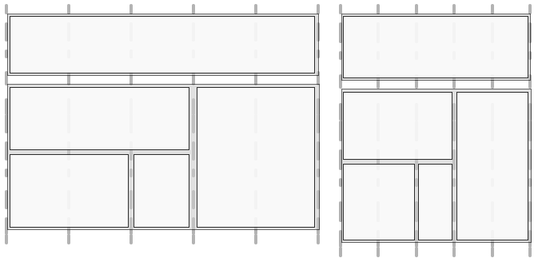

# Progettazione reattiva per pagine web{#responsive-design-for-web-pages}

>[!NOTE]
>
>L’Adobe consiglia di utilizzare l’Editor SPA per i progetti che richiedono il rendering lato client basato su framework di applicazione a pagina singola (come _React_). [Ulteriori informazioni](/help/sites-developing/spa-overview.md).
>

>[!NOTE]
>
>Vari esempi si basano sul contenuto del Geometrixx, che non viene più fornito con AEM (Adobe Experience Manager), essendo stato sostituito da We.Retail. Consulta il documento [Implementazione di riferimento We.Retail](/help/sites-developing/we-retail.md#we-retail-geometrixx) per informazioni su come scaricare e installare Geometrixx.

Progetta le pagine web in modo che si adattino al riquadro di visualizzazione client in cui vengono visualizzate. Con il design reattivo, le stesse pagine possono essere visualizzate in modo efficace su più dispositivi in entrambi gli orientamenti. L&#39;immagine seguente illustra alcuni modi in cui una pagina può rispondere alle modifiche apportate alle dimensioni del riquadro di visualizzazione:

* Layout: utilizza layout a colonna singola per riquadri di visualizzazione più piccoli e layout a più colonne per riquadri di visualizzazione più grandi.
* Dimensione testo: utilizza dimensioni maggiori del testo (se appropriato, ad esempio le intestazioni) nelle finestre di visualizzazione più grandi.
* Contenuto: include solo il contenuto più importante quando viene visualizzato su dispositivi più piccoli.
* Navigazione: sono disponibili strumenti specifici per i dispositivi per accedere ad altre pagine.
* Immagini: distribuiscono rappresentazioni di immagini appropriate per il riquadro di visualizzazione client. in base alle dimensioni della finestra.


Sviluppa applicazioni Adobe Experience Manager (AEM) che generano pagine HTML5 adattabili a più dimensioni e orientamenti di finestre. Ad esempio, i seguenti intervalli di larghezze dei riquadri di visualizzazione corrispondono a vari tipi di dispositivi e orientamenti

* Larghezza massima di 480 pixel (telefono, verticale)
* Larghezza massima di 767 pixel (telefono, orizzontale)
* Larghezza compresa tra 768 e 979 pixel (tablet, verticale)
* Larghezza compresa tra 980 e 1199 pixel (tablet, orizzontale)
* Larghezza uguale o superiore a 1200 pixel (desktop)

Per informazioni sull’implementazione del comportamento di progettazione reattiva, consulta i seguenti argomenti:

* [Query multimediali](/help/sites-developing/responsive.md#using-media-queries)
* [Griglie fluide](/help/sites-developing/responsive.md#developing-a-fluid-grid)
* [Immagini adattive](/help/sites-developing/responsive.md#using-adaptive-images)

Durante la progettazione, utilizzare **[!UICONTROL Sidekick]** per visualizzare in anteprima le pagine per diverse dimensioni dello schermo.

## Prima di sviluppare {#before-you-develop}

Prima di sviluppare l’applicazione AEM che supporta le pagine web, è necessario prendere diverse decisioni di progettazione. Ad esempio, è necessario disporre delle seguenti informazioni:

* Dispositivi di destinazione.
* Le dimensioni del riquadro di visualizzazione di destinazione.
* I layout di pagina per ciascuna dimensione del riquadro di visualizzazione di destinazione.

### Struttura dell’applicazione {#application-structure}

La tipica struttura di applicazioni AEM supporta tutte le implementazioni di progettazione reattiva:

* I componenti della pagina si trovano sotto /apps/*nome_applicazione*/components
* I modelli si trovano sotto /apps/*nome_applicazione*/templates
* Le progettazioni si trovano sotto /etc/designs

## Utilizzo delle query multimediali {#using-media-queries}

Le query multimediali consentono l’utilizzo selettivo degli stili CSS per il rendering delle pagine. Gli strumenti e le funzioni di sviluppo AEM consentono di implementare in modo efficace ed efficiente le query multimediali nelle applicazioni.

Il gruppo W3C fornisce [Query multimediali](https://www.w3.org/TR/mediaqueries-3/) consiglio che descrive questa funzione CSS3 e la sintassi.

### Creazione del file CSS {#creating-the-css-file}

Nel file CSS, definisci le query multimediali in base alle proprietà dei dispositivi di destinazione. La seguente strategia di implementazione è efficace per la gestione degli stili per ogni query multimediale:

* Utilizza una ClientLibraryFolder per definire il CSS assemblato al momento del rendering della pagina.
* Definisci ogni query multimediale e gli stili associati in file CSS separati. È utile utilizzare nomi di file che rappresentino le funzioni dispositivo della query multimediale.
* Definisci gli stili comuni a tutti i dispositivi in un file CSS separato.
* Nel file css.txt di ClientLibraryFolder, ordinare i file CSS di elenco come richiesto nel file CSS assemblato.

Il `We.Retail` L’esempio di file multimediali utilizza questa strategia per definire gli stili nella progettazione del sito. Il file CSS utilizzato da `We.Retail` è in `*/apps/weretail/clientlibs/clientlib-site/less/grid.less`.

Nella tabella seguente sono elencati i file presenti nella cartella secondaria css.

<table>
 <tbody>
  <tr>
   <th>Nome file</th>
   <th>Descrizione</th>
   <th>Media Query</th>
  </tr>
  <tr>
   <td>style.css</td>
   <td>Stili comuni.</td>
   <td>N/D</td>
  </tr>
  <tr>
   <td>bootstrap.css</td>
   <td>Stili comuni, definiti dalla Bootstrap di Twitter.</td>
   <td>N/D</td>
  </tr>
  <tr>
   <td>responsive-1200px.css</td>
   <td>Stili per tutti i file multimediali di larghezza pari o superiore a 1200 pixel.</td>
   <td><p>@media (larghezza min: 1200 px) {<br /> ...<br /> }</p> </td>
  </tr>
  <tr>
   <td>responsive-980px-1199px.css</td>
   <td>Stili per i file multimediali di larghezza compresa tra 980 e 1199 pixel.</td>
   <td><p>@media (larghezza min: 980 px) e (larghezza max: 1199 px) {<br /> ...<br /> }</p> </td>
  </tr>
  <tr>
   <td>responsive-768px-979px.css</td>
   <td>Stili per file multimediali con larghezza compresa tra 768 e 979 pixel. </td>
   <td><p>@media (larghezza min: 768 px) e (larghezza max: 979 px) {<br /> ...<br /> }</p> </td>
  </tr>
  <tr>
   <td>responsive-767px-max.css</td>
   <td>Stili per tutti i file multimediali con una larghezza inferiore a 768 pixel.</td>
   <td><p>@media (larghezza massima: 767 px) {<br /> ...<br /> }</p> </td>
  </tr>
  <tr>
   <td>responsive-480px.css</td>
   <td>Stili per tutti i file multimediali con una larghezza inferiore a 481 pixel.</td>
   <td>@media (larghezza massima: 480 px) {<br /> ...<br /> }</td>
  </tr>
 </tbody>
</table>

Il file css.txt in `/etc/designs/weretail/clientlibs` cartella elenca i file CSS inclusi nella cartella della libreria client. L’ordine dei file implementa la precedenza degli stili. Gli stili sono più specifici al diminuire delle dimensioni del dispositivo.

`#base=css`

```
style.css
 bootstrap.css
```

```
responsive-1200px.css
 responsive-980px-1199px.css
 responsive-768px-979px.css
 responsive-767px-max.css
 responsive-480px.css
```

**Suggerimento**: i nomi di file descrittivi ti consentono di identificare facilmente la dimensione del riquadro di visualizzazione di destinazione.

### Utilizzo delle query multimediali con le pagine AEM {#using-media-queries-with-aem-pages}

Includi la cartella della libreria client nello script JSP del componente pagina. In questo modo è possibile generare il file CSS che include le query multimediali e fare riferimento al file.

```xml
<ui:includeClientLib categories="apps.weretail.all"/>
```

>[!NOTE]
>
>Il `apps.weretail.all` la cartella della libreria client incorpora la libreria clientlibs.

Lo script JSP genera il seguente codice HTML che fa riferimento ai fogli di stile:

```xml
<link rel="stylesheet" href="/etc/designs/weretail/clientlibs-all.css" type="text/css">
<link href="/etc/designs/weretail.css" rel="stylesheet" type="text/css">
```

## Anteprima per dispositivi specifici {#previewing-for-specific-devices}

Visualizza le anteprime delle pagine in diverse dimensioni di riquadro di visualizzazione per verificare il comportamento del design reattivo. In entrata **[!UICONTROL Anteprima]** modalità, **[!UICONTROL Sidekick]** include un **[!UICONTROL Dispositivi]** menu a discesa utilizzato per selezionare un dispositivo. Quando selezioni un dispositivo, la pagina cambia in base alle dimensioni del riquadro di visualizzazione.


Per attivare l&#39;anteprima del dispositivo in **[!UICONTROL Sidekick]**, è necessario configurare la pagina e **[!UICONTROL MobileEmulatorProvider]** servizio. Un’altra configurazione di pagina controlla l’elenco dei dispositivi visualizzati nella **[!UICONTROL Dispositivi]** elenco.

### Aggiunta dell&#39;elenco dei dispositivi {#adding-the-devices-list}

Il **[!UICONTROL Dispositivi]** viene visualizzato in **[!UICONTROL Sidekick]** quando la pagina include lo script JSP che esegue il rendering del **[!UICONTROL Dispositivi]** elenco. Per aggiungere **[!UICONTROL Dispositivi]** elenca a **[!UICONTROL Sidekick]**, includi `/libs/wcm/mobile/components/simulator/simulator.jsp` script in `head` della pagina.

Includi il seguente codice nella JSP che definisce `head` sezione:

`<cq:include script="/libs/wcm/mobile/components/simulator/simulator.jsp"/>`

Per visualizzare un esempio, apri `/apps/weretail/components/page/head.jsp` file in CRXDE Liti.

### Registrazione dei componenti Pagina per la simulazione {#registering-page-components-for-simulation}

Per abilitare il simulatore di dispositivi per supportare le pagine, registra i componenti di pagina con il servizio di fabbrica MobileEmulatorProvider e definisci `mobile.resourceTypes` proprietà.

Quando si lavora con l’AEM, esistono diversi metodi per gestire le impostazioni di configurazione per tali servizi; vedi [Configurazione di OSGi](/help/sites-deploying/configuring-osgi.md) per informazioni dettagliate.

Ad esempio, per creare un ` [sling:OsgiConfig](/help/sites-deploying/configuring-osgi.md#adding-a-new-configuration-to-the-repository)` nodo nell&#39;applicazione:

* Cartella padre: `/apps/application_name/config`
* Nome: `com.day.cq.wcm.mobile.core.impl.MobileEmulatorProvider-*alias*`

  Il - `*alias*` suffix è necessario perché il servizio MobileEmulatorProvider è un servizio di fabbrica. Utilizzare qualsiasi alias univoco per questa factory.

* `jcr:primaryType`: `sling:OsgiConfig`

Aggiungi la seguente proprietà nodo:

* Nome: `mobile.resourceTypes`
* Tipo: `String[]`
* Valore: i percorsi dei componenti della pagina che eseguono il rendering delle pagine web. Ad esempio, l’app geometrixx-media utilizza i seguenti valori:

  ```
  geometrixx-media/components/page
   geometrixx-unlimited/components/pages/page
   geometrixx-unlimited/components/pages/coverpage
   geometrixx-unlimited/components/pages/issue
  ```

### Specifica dei gruppi di dispositivi {#specifying-the-device-groups}

Per specificare i gruppi di dispositivi visualizzati nell&#39;elenco Dispositivi, aggiungere una `cq:deviceGroups` proprietà per il `jcr:content` della pagina principale del sito. Il valore della proprietà è un array di percorsi ai nodi del gruppo di dispositivi.

I nodi del gruppo di dispositivi si trovano in `/etc/mobile/groups` cartella.

La pagina principale del sito Geometrixx Media, ad esempio, è `/content/geometrixx-media`. Il `/content/geometrixx-media/jcr:content` Il nodo include la seguente proprietà:

* Nome: `cq:deviceGroups`
* Tipo: `String[]`
* Valore: `/etc/mobile/groups/responsive`

Utilizza la console Strumenti per: [creare e modificare gruppi di dispositivi](/help/sites-developing/groupfilters.md).

>[!NOTE]
>
>Per i gruppi di dispositivi utilizzati per la progettazione reattiva, modifica il gruppo di dispositivi e nella scheda Generale seleziona Disattiva emulatore. Questa opzione impedisce la visualizzazione del carosello dell’emulatore, che non è rilevante per la progettazione reattiva.
>

## Utilizzo di immagini adattive {#using-adaptive-images}

Puoi utilizzare le query multimediali per selezionare una risorsa immagine da visualizzare nella pagina. Tuttavia, ogni risorsa che utilizza una query multimediale per condizionarne l’utilizzo viene scaricata nel client. La query multimediale determina semplicemente se la risorsa scaricata viene visualizzata.

Per risorse di grandi dimensioni, come le immagini, il download di tutte le risorse non rappresenta un utilizzo efficiente della pipeline dati del client. Per scaricare selettivamente le risorse, utilizza JavaScript per avviare la richiesta di risorse dopo che le query multimediali hanno eseguito la selezione.

La strategia seguente carica una singola risorsa scelta utilizzando le query multimediali:

1. Aggiungi un elemento DIV per ogni versione della risorsa. Includi l’URI della risorsa come valore di un valore di attributo. Il browser non interpreta l’attributo come risorsa.
1. Aggiungi una query multimediale a ciascun elemento DIV appropriato per la risorsa.
1. Quando il documento viene caricato o la finestra viene ridimensionata, il codice JavaScript verifica la query multimediale di ciascun elemento DIV.
1. In base ai risultati delle query, determina quale risorsa includere.
1. Inserisci un elemento HTML nel DOM che fa riferimento alla risorsa.

### Valutazione delle query multimediali tramite JavaScript {#evaluating-media-queries-using-javascript}

Implementazioni di [Interfaccia MediaQueryList](https://drafts.csswg.org/cssom-view/#the-mediaquerylist-interface) che il W3C definisce ti consente di valutare le query multimediali utilizzando JavaScript. Puoi applicare la logica ai risultati delle query multimediali ed eseguire script mirati per la finestra corrente:

* I browser che implementano l’interfaccia MediaQueryList supportano i `window.matchMedia()` funzione. Questa funzione verifica le query multimediali rispetto a una determinata stringa. La funzione restituisce un `MediaQueryList` oggetto che consente di accedere ai risultati della query.

* Per i browser che non implementano l’interfaccia, puoi utilizzare un’ `matchMedia()` poly fill, ad esempio [matchMedia.js](https://github.com/paulirish/matchMedia.js), una libreria JavaScript disponibile gratuitamente.

#### Selezione di risorse specifiche per i contenuti multimediali {#selecting-media-specific-resources}

W3C [elemento immagine](https://html.spec.whatwg.org/multipage/embedded-content.html#the-picture-element) utilizza le query multimediali per determinare l’origine da utilizzare per gli elementi immagine. L’elemento immagine utilizza gli attributi dell’elemento per associare le query multimediali ai percorsi delle immagini.

Il disponibile gratuitamente [libreria picturefill.js](https://github.com/scottjehl/picturefill) offre funzionalità simili a quelle proposte `picture` e utilizza una strategia simile. Chiamate alla libreria picturefill.js `window.matchMedia` per valutare le query multimediali definite per un set di `div` elementi. Ogni `div` specifica anche un&#39;origine immagine. L’origine viene utilizzata quando la query multimediale di `div` restituiti elementi `true`.

Il `picturefill.js` la libreria richiede un codice HTML simile al seguente:

```xml
<div data-picture>
    <div data-src='path to default image'></div>
    <div data-src='path to small image'    data-media="(media query for phone)"></div>
    <div data-src='path to medium image'   data-media="(media query for tablet)"></div>
    <div data-src='path to large image'     data-media="(media query for monitor)"></div>
</div>
```

Quando viene eseguito il rendering della pagina, picturefull.js inserisce un `img` come ultimo elemento figlio del `<div data-picture>` elemento:

```xml
<div data-picture>
    <div data-src='path to default image'></div>
    <div data-src='path to small image'    data-media="(media query for phone)"></div>
    <div data-src='path to medium image'   data-media="(media query for tablet)"></div>
    <div data-src='path to large image'     data-media="(media query for monitor)"></div>
    
</div>
```

In una pagina AEM, il valore della proprietà `data-src` attribute è il percorso di una risorsa nell’archivio.

### Implementazione di immagini adattive nell’AEM {#implementing-adaptive-images-in-aem}

Per implementare immagini adattive nell’applicazione AEM, devi aggiungere le librerie JavaScript richieste e includere nelle pagine il markup HTML richiesto.

**Librerie**

Ottieni le seguenti librerie JavaScript e includile in una cartella di librerie client:

* [matchMedia.js](https://github.com/paulirish/matchMedia.js) (per i browser che non implementano l’interfaccia MediaQueryList)
* [picturefill.js](https://github.com/scottjehl/picturefill)
* jquery.js (disponibile tramite il `/etc/clientlibs/granite/jquery` cartella della libreria client (categoria = jquery)
* [jquery.debouncedresize.js](https://github.com/louisremi/jquery-smartresize) (un evento jquery che si verifica una volta dopo il ridimensionamento della finestra)

**Suggerimento** È possibile concatenare automaticamente più cartelle di librerie client [incorporamento](/help/sites-developing/clientlibs.md#embedding-code-from-other-libraries).

**HTML**

Crea un componente che genera gli elementi div richiesti previsti dal codice picturefill.js. In una pagina AEM, il valore dell’attributo data-src è il percorso di una risorsa nell’archivio. Ad esempio, un componente pagina può eseguire il hardcode delle query multimediali e dei percorsi associati per le rappresentazioni delle immagini in DAM. In alternativa, crea un componente Immagine personalizzato che consenta agli autori di selezionare le rappresentazioni di immagini o di specificare le opzioni di rendering in fase di esecuzione.

L’esempio seguente HTML seleziona due rappresentazioni DAM della stessa immagine.

```xml
<div data-picture>
    <div data-src='/content/dam/geometrixx-media/articles/meridien.png'></div>
    <div data-src='/content/dam/geometrixx-media/articles/meridien.png/jcr:content/renditions/cq5dam.thumbnail.319.319.png'    data-media="(min-width: 769px)"></div>
    <div data-src='/content/dam/geometrixx-media/articles/meridien.png/jcr:content/renditions/cq5dam.thumbnail.140.100.png'   data-media="(min-width: 481px)"></div>
</div>
```

>[!NOTE]
>
>Il componente Adaptive Image Foundation implementa le immagini adattive:
>
>* Cartella libreria client: `/libs/foundation/components/adaptiveimage/clientlibs`
>* Script che genera il HTML: `/libs/foundation/components/adaptiveimage/adaptiveimage.jsp`
>
>La sezione successiva fornisce dettagli su questo componente.
>

### Informazioni sul rendering delle immagini nell’AEM {#understanding-image-rendering-in-aem}

Per personalizzare il rendering delle immagini, è necessario comprendere l’implementazione predefinita del rendering delle immagini statiche AEM. AEM fornisce il componente Immagine e un servlet di rendering delle immagini che interagiscono per eseguire il rendering delle immagini per le pagine web. Quando il componente Immagine è incluso nel sistema paragrafo della pagina, si verificano le seguenti sequenze di eventi:

1. Authoring: gli autori possono modificare il componente Immagine per specificare il file di immagine da includere in una pagina HTML. Il percorso del file viene memorizzato come valore di proprietà del nodo del componente Immagine.
1. Richiesta di pagina: la JSP del componente Pagina genera il codice HTML. La JSP del componente Immagine genera e aggiunge un elemento img alla pagina.
1. Richiesta immagine: il browser web carica la pagina e richiede l’immagine in base all’attributo src dell’elemento img.
1. Rendering immagine: il servlet di rendering delle immagini restituisce l’immagine al browser web.


Ad esempio, la JSP del componente Immagine genera il seguente elemento HTML:

``

Quando il browser carica la pagina, richiede l’immagine utilizzando il valore dell’attributo src come URL. Sling decompone l’URL:

* Risorsa: `/content/mywebsite/en/_jcr_content/par/image_0`
* Estensione nome file: `.jpg`
* Selettore: `img`
* Suffisso: `1358372073597.jpg`

Il `image_0` il nodo ha un `jcr:resourceType` valore di `foundation/components/image`, che ha un `sling:resourceSuperType` valore di `foundation/components/parbase`. Il componente parbase include lo script img.GET.java che corrisponde al selettore e l’estensione del nome file dell’URL della richiesta. CQ utilizza questo script (servlet) per riprodurre l’immagine.

Per visualizzare il codice sorgente dello script, utilizza CRXDE Liti per aprire `/libs/foundation/components/parbase/img.GET.java`
file.

## Ridimensionamento delle immagini per le dimensioni correnti del riquadro di visualizzazione {#scaling-images-for-the-current-viewport-size}

Ridimensiona le immagini in fase di runtime in base alle caratteristiche del riquadro di visualizzazione client per fornire immagini conformi ai principi di progettazione reattiva. Utilizza lo stesso pattern di progettazione del rendering statico delle immagini, utilizzando un servlet e un componente di authoring.

Il componente deve eseguire le seguenti attività:

* Memorizza il percorso e le dimensioni desiderate della risorsa immagine come valori di proprietà.
* Genera `div` elementi che contengono selettori multimediali e chiamate al servizio per il rendering dell’immagine.

>[!NOTE]
>
>Il client web utilizza le librerie JavaScript matchMedia e Picturefill (o librerie simili) per valutare i selettori multimediali.
>

Il servlet che elabora la richiesta di immagine deve eseguire le seguenti attività:

* Recuperate il percorso e le dimensioni dell&#39;immagine dalle proprietà del componente.
* Ridimensiona l’immagine in base alle proprietà e la restituisce.

**Soluzioni disponibili**

AEM installa le seguenti implementazioni che puoi utilizzare o estendere.

* Il componente di base Immagine adattiva che genera query multimediali e richieste HTTP al servlet del componente Immagine adattiva che ridimensiona le immagini.
* Il pacchetto Geometrixx Commons installa i servlet di esempio Image Reference Modification Servlet che modificano la risoluzione dell’immagine.

### Informazioni sul componente Immagine adattiva {#understanding-the-adaptive-image-component}

Il componente Immagine adattiva genera chiamate al servlet del componente Immagine adattiva per eseguire il rendering di un’immagine ridimensionata in base allo schermo del dispositivo. Il componente include le seguenti risorse:

* JSP: aggiunge elementi div che associano le query multimediali alle chiamate a Adaptive Image Component Servlet.
* Librerie client: la cartella clientlibs è una `cq:ClientLibraryFolder` che assembla la libreria JavaScript matchMedia polyfill e una libreria JavaScript Picturefill modificata.
* Finestra di dialogo Modifica: `cq:editConfig` node sostituisce il componente immagine di base CQ in modo che la destinazione di rilascio crei un componente immagine adattivo anziché un componente immagine di base.

#### Aggiunta di elementi DIV {#adding-the-div-elements}

Lo script adaptive-image.jsp include il seguente codice che genera elementi div e query multimediali:

```
<div data-picture data-alt='<%= alt %>'>
    <div data-src='<%= path + ".img.320.low." + extension + suffix %>'       data-media="(min-width: 1px)"></div>                                        <%-- Small mobile --%>
    <div data-src='<%= path + ".img.320.medium." + extension + suffix %>'    data-media="(min-width: 320px)"></div>  <%-- Portrait mobile --%>
    <div data-src='<%= path + ".img.480.medium." + extension + suffix %>'    data-media="(min-width: 321px)"></div>  <%-- Landscape mobile --%>
    <div data-src='<%= path + ".img.476.high." + extension + suffix %>'      data-media="(min-width: 481px)"></div>   <%-- Portrait iPad --%>
    <div data-src='<%= path + ".img.620.high." + extension + suffix %>'      data-media="(min-width: 769px)"></div>  <%-- Landscape iPad --%>
    <div data-src='<%= path + ".img.full.high." + extension + suffix %>'     data-media="(min-width: 1025px)"></div> <%-- Desktop --%>

    <%-- Fallback content for non-JS browsers. Same img src as the initial, unqualified source element. --%>
    <noscript>
        ' alt='<%= alt %>'>
    </noscript>
</div>
```

Il `path` contiene il percorso della risorsa corrente (il nodo del componente immagine adattiva). Il codice genera una serie di `div` elementi con la seguente struttura:

`<div data-scr = "*path-to-parent-node*.adaptive-image.adapt.*width*.*quality*.jpg" data-media="*media query*"></div>`

Il valore della proprietà `data-scr` attribute è un URL che Sling risolve in Adaptive Image Component Servlet per il rendering dell’immagine. L’attributo data-media contiene la query multimediale valutata in base alle proprietà client.

Il seguente codice HTML è un esempio di `div` elementi generati da JSP:

```xml
<div data-src='/content/geometrixx-media/en/events/the-lineup-you-ve-been-waiting-for/jcr:content/article-content-par/adaptive_image.adapt.320.low.jpg'></div>
    <div data-src='/content/geometrixx-media/en/events/the-lineup-you-ve-been-waiting-for/jcr:content/article-content-par/adaptive_image.adapt.320.medium.jpg'    data-media="(min-width: 320px)"></div>
    <div data-src='/content/geometrixx-media/en/events/the-lineup-you-ve-been-waiting-for/jcr:content/article-content-par/adaptive_image.adapt.480.medium.jpg'    data-media="(min-width: 321px)"></div>
    <div data-src='/content/geometrixx-media/en/events/the-lineup-you-ve-been-waiting-for/jcr:content/article-content-par/adaptive_image.adapt.476.high.jpg'     data-media="(min-width: 481px)"></div>
    <div data-src='/content/geometrixx-media/en/events/the-lineup-you-ve-been-waiting-for/jcr:content/article-content-par/adaptive_image.adapt.620.high.jpg'     data-media="(min-width: 769px)"></div>
    <div data-src='/content/geometrixx-media/en/events/the-lineup-you-ve-been-waiting-for/jcr:content/article-content-par/adaptive_image.adapt.full.high.jpg'     data-media="(min-width: 1025px)"></div>
```

#### Modifica dei selettori delle dimensioni dell&#39;immagine {#changing-the-image-size-selectors}

Se personalizzi il componente Immagine adattiva e modifichi i selettori di larghezza, devi anche configurare Adaptive Image Component Servlet per supportare le larghezze.

### Informazioni su Adaptive Image Component Servlet {#understanding-the-adaptive-image-component-servlet}

Adaptive Image Component Servlet ridimensiona un’immagine JPEG in base a una larghezza specificata e imposta la qualità JPEG.

#### Interfaccia di Adaptive Image Component Servlet {#the-interface-of-the-adaptive-image-component-servlet}

Adaptive Image Component Servlet è associato al servlet Sling predefinito e supporta le estensioni di file .jpg, .jpeg, .gif e .png. Il selettore servlet è img.

>[!CAUTION]
>
>I file GIF animati non sono supportati in AEM per le rappresentazioni adatte.

Pertanto, Sling risolve gli URL della richiesta HTTP nel seguente formato in questo servlet:

`*path-to-node*.img.*extension*`

Ad esempio, Sling inoltra le richieste HTTP con l’URL `http://localhost:4502/content/geometrixx/adaptiveImage.img.jpg` Adaptive Image Component Servlet.

Due selettori aggiuntivi specificano la larghezza dell’immagine richiesta e la qualità JPEG. L’esempio seguente richiede un’immagine di larghezza pari a 480 pixel e di qualità media:

`http://localhost:4502/content/geometrixx/adaptiveImage.adapt.480.MEDIUM.jpg`

**Proprietà immagine supportate**

Il servlet accetta un numero finito di larghezze e qualità delle immagini. Le seguenti larghezze sono supportate per impostazione predefinita (in pixel):

* completo
* 320
* 480
* 476
* 620

Il valore completo indica che non viene applicata alcuna scala.

Sono supportati i seguenti valori per la qualità dei JPEG:

* BASSA
* MEDIA
* ALTA

I valori numerici sono rispettivamente 0,4, 0,82 e 1,0.

**Modifica delle larghezze supportate predefinite**

Utilizzare la console Web ([http://localhost:4502/system/console/configMgr](http://localhost:4502/system/console/configMgr)) o un nodo sling:OsgiConfig per configurare le larghezze supportate di Adobe CQ Adaptive Image Component Servlet.

Per informazioni su come configurare i servizi AEM, vedi [Configurazione di OSGi](/help/sites-deploying/configuring-osgi.md).

<table>
 <tbody>
  <tr>
   <th> </th>
   <th>Console web</th>
   <th>sling:OsgiConfig</th>
  </tr>
  <tr>
   <th>Nome servizio o nodo</th>
   <td>Il nome del servizio nella scheda Configurazione è Adobe CQ Adaptive Image Component Servlet</td>
   <td>com.day.cq.wcm.foundation.impl. AdaptiveImageComponentServlet</td>
  </tr>
  <tr>
   <th>Proprietà</th>
   <td><p>Larghezze supportati</p>
    <ul>
     <li>Per aggiungere una larghezza supportata, fai clic su un pulsante + e immetti un numero intero positivo.</li>
     <li>Per rimuovere una larghezza supportata, fai clic sul relativo pulsante -.</li>
     <li>Per modificare una larghezza supportata, modifica il valore del campo.</li>
    </ul> </td>
   <td><p>adapt.supported.widths</p>
    <ul>
     <li>La proprietà è un valore String multivalore.</li>
    </ul> </td>
  </tr>
 </tbody>
</table>

#### Dettagli di implementazione {#implementation-details}

Il `com.day.cq.wcm.foundation.impl.AdaptiveImageComponentServlet` la classe estende [AbstractImageServlet](https://developer.adobe.com/experience-manager/reference-materials/6-5/javadoc/com/day/cq/wcm/commons/AbstractImageServlet.html) classe. Il codice sorgente di AdaptiveImageComponentServlet si trova in `/libs/foundation/src/impl/src/com/day/cq/wcm/foundation/impl` cartella.

La classe utilizza le annotazioni Felix SCR per configurare il tipo di risorsa e l’estensione di file a cui è associato il servlet e il nome del primo selettore.

```java
@Component(metatype = true, label = "Adobe CQ Adaptive Image Component Servlet",
        description = "Render adaptive images in a variety of qualities")
@Service
@Properties(value = {
    @Property(name = "sling.servlet.resourceTypes", value = "foundation/components/adaptiveimage", propertyPrivate = true),
    @Property(name = "sling.servlet.selectors", value = "img", propertyPrivate = true),
    @Property(name = "sling.servlet.extensions", value ={
            "jpg",
            "jpeg",
            "png",
            "gif"
    }, propertyPrivate = true)
})
```

Il servlet utilizza l’annotazione Property SCR (SCR proprietà) per impostare la qualità e le dimensioni predefinite supportate per le immagini.

```java
@Property(value = {
            "320", // iPhone portrait
            "480", // iPhone landscape
            "476", // iPad portrait
            "620" // iPad landscape
    },
            label = "Supported Widths",
            description = "List of widths this component is permitted to generate.")
```

Il `AbstractImageServlet` la classe fornisce `doGet` metodo che elabora la richiesta HTTP. Questo metodo determina la risorsa associata alla richiesta, recupera le proprietà della risorsa dal repository e le restituisce in un [ImageContext](https://developer.adobe.com/experience-manager/reference-materials/6-5/javadoc/com/day/cq/wcm/commons/AbstractImageServlet.ImageContext.html) oggetto.

>[!NOTE]
>
>Il [com.day.cq.commons.DownloadResource](https://developer.adobe.com/experience-manager/reference-materials/6-5/javadoc/com/day/cq/commons/DownloadResource.html) la classe fornisce `getFileReference method`, che recupera il valore della proprietà `fileReference` proprietà.

Il `AdaptiveImageComponentServlet` la classe sostituisce la `createLayer` metodo. Il metodo ottiene il percorso della risorsa immagine e la larghezza immagine richiesta da `ImageContext` oggetto. Chiama quindi i metodi del `info.geometrixx.commons.impl.AdaptiveImageHelper` che esegue il ridimensionamento effettivo dell&#39;immagine.

La classe AdaptiveImageComponentServlet esegue inoltre l&#39;override del metodo writeLayer. Questo metodo applica la qualità JPEG all&#39;immagine.

### Servlet per modifica riferimento immagine (Geometrixx Common) {#image-reference-modification-servlet-geometrixx-common}

Il Servlet Image Reference Modification di esempio genera attributi di dimensione per l&#39;elemento img per ridimensionare un&#39;immagine sulla pagina web.

#### Chiamata del servlet {#calling-the-servlet}

Il servlet è associato a `cq:page` e supporta l’estensione del file .jpg. Il selettore del servlet è `image`. Pertanto, Sling risolve gli URL della richiesta HTTP nel seguente formato in questo servlet:

`path-to-page-node.image.jpg`

Ad esempio, Sling inoltra le richieste HTTP con l’URL `http://localhost:4502/content/geometrixx/en.image.jpg` Image Reference Modification Servlet.

Tre selettori aggiuntivi specificano la larghezza, l’altezza e (facoltativamente) la qualità dell’immagine richiesta. L’esempio seguente richiede un’immagine di larghezza 770 pixel, altezza 360 pixel e qualità media.

`http://localhost:4502/content/geometrixx/en.image.770.360.MEDIUM.jpg`

**Proprietà immagine supportate**

Il servlet accetta un numero finito di dimensioni e valori di qualità delle immagini.

I seguenti valori sono supportati per impostazione predefinita (widthxheight):

* 256x192
* 370x150
* 480x200
* 127x127
* 770x360
* 620x290
* 480x225
* 320x150
* 375x175
* 303x142
* 1170x400
* 940x340
* 770x300
* 480x190

Sono supportati i seguenti valori per la qualità delle immagini:

* bassa
* media
* alta

Quando si lavora con l’AEM, esistono diversi metodi per gestire le impostazioni di configurazione per tali servizi; vedi [Configurazione di OSGi](/help/sites-deploying/configuring-osgi.md) per informazioni dettagliate.

#### Specifica della risorsa immagine {#specifying-the-image-resource}

Il percorso dell’immagine, le dimensioni e i valori di qualità devono essere memorizzati come proprietà di un nodo nell’archivio:

* Il nome del nodo è `image`.
* Il nodo principale è `jcr:content` nodo di una `cq:page` risorsa.

* Il percorso dell&#39;immagine viene memorizzato come valore di una proprietà denominata `fileReference`.

Quando crei una pagina, utilizza **Sidekick** per specificare l&#39;immagine e aggiungere `image` alle proprietà della pagina:

1. In entrata **Sidekick**, fare clic su **Pagina** e quindi fare clic su **Proprietà pagina**.
1. Fai clic su **Immagine** e specificare l&#39;immagine.
1. Fai clic su **OK**.

#### Dettagli di implementazione {#implementation-details-1}

La classe info.geometrixx.commons.impl.servlets.ImageReferenceModificationServlet estende [AbstractImageServlet](https://developer.adobe.com/experience-manager/reference-materials/6-5/javadoc/com/day/cq/wcm/commons/AbstractImageServlet.html) classe. Se è installato il pacchetto cq-geometrixx-commons-pkg, il codice sorgente ImageReferenceModificationServlet si trova nel `/apps/geometrixx-commons/src/core/src/main/java/info/geometrixx/commons/impl/servlets` cartella.

La classe utilizza le annotazioni Felix SCR per configurare il tipo di risorsa e l’estensione di file a cui è associato il servlet e il nome del primo selettore.

```java
@Component(metatype = true, label = "Adobe CQ Image Reference Modification Servlet",
        description = "Render the image associated with a page in a variety of dimensions and qualities")
@Service
@Properties(value = {
    @Property(name = "sling.servlet.resourceTypes", value = NameConstants.NT_PAGE, propertyPrivate = true),
    @Property(name = "sling.servlet.selectors", value = "image", propertyPrivate = true),
    @Property(name = "sling.servlet.extensions", value = "jpg", propertyPrivate = true)
})
```

Il servlet utilizza l’annotazione Property SCR (SCR proprietà) per impostare la qualità e le dimensioni predefinite supportate per le immagini.

```java
@Property(label = "Image Quality",
            description = "Quality must be a double between 0.0 and 1.0", value = "0.82")
@Property(value = {
                "256x192", // Category page article list images
                "370x150", // "Most popular" desktop & iPad & carousel min-width: 1px
                "480x200", // "Most popular" phone
                "127x127", // article summary phone square images
                "770x360", // article summary, desktop
                "620x290", // article summary, tablet
                "480x225", // article summary, phone (landscape)
                "320x150", // article summary, phone (portrait) and fallback
                "375x175", // 2-column article summary, desktop
                "303x142", // 2-column article summary, tablet
                "1170x400", // carousel, full
                "940x340",  // carousel min-width: 980px
                "770x300",  // carousel min-width: 768px
                "480x190"   // carousel min-width: 480px
            },
            label = "Supported Resolutions",
            description = "List of resolutions this component is permitted to generate.")
```

Il `AbstractImageServlet` la classe fornisce `doGet` metodo che elabora la richiesta HTTP. Questo metodo determina la risorsa associata alla chiamata, recupera le proprietà della risorsa dall’archivio e le salva in un [ImageContext](https://developer.adobe.com/experience-manager/reference-materials/6-5/javadoc/com/day/cq/wcm/commons/AbstractImageServlet.ImageContext.html) oggetto.

Il `ImageReferenceModificationServlet` la classe sostituisce la `createLayer` e implementa la logica che determina la risorsa immagine da riprodurre. Il metodo recupera un nodo figlio del di `jcr:content` nodo denominato `image`. Un [Immagine](https://developer.adobe.com/experience-manager/reference-materials/6-5/javadoc/com/day/cq/wcm/foundation/Image.html) l&#39;oggetto viene creato da questo `image` e il `getFileReference` il metodo restituisce il percorso del file di immagine da `fileReference` del nodo dell&#39;immagine.

>[!NOTE]
>Il [com.day.cq.commons.DownloadResource](https://developer.adobe.com/experience-manager/reference-materials/6-5/javadoc/com/day/cq/commons/DownloadResource.html) La classe fornisce il metodo getFileReference.
>

## Sviluppo di una griglia di fluidi {#developing-a-fluid-grid}

L&#39;AEM consente di implementare in modo efficiente ed efficace le griglie fluide. Questa pagina spiega come integrare la rete fluida o un’implementazione di rete esistente (ad esempio [Bootstrap](https://github.com/topics/twitter-bootstrap?l=css)) nell’applicazione per AEM.

Se non si ha familiarità con le griglie dei fluidi, vedere [Introduzione alle griglie fluide](/help/sites-developing/responsive.md#developing-a-fluid-grid) nella parte inferiore della pagina. Questa introduzione fornisce una panoramica delle griglie di fluidi e indicazioni per la loro progettazione.

### Definizione della griglia tramite un componente Pagina {#defining-the-grid-using-a-page-component}

Utilizza i componenti di pagina per generare gli elementi HTML che definiscono i blocchi di contenuto della pagina. La ClientLibraryFolder a cui la pagina fa riferimento fornisce il CSS che controlla il layout dei blocchi di contenuto:

* Componente pagina: aggiunge elementi div che rappresentano righe di blocchi di contenuto. Gli elementi div che rappresentano i blocchi di contenuto includono un componente parsys in cui gli autori aggiungono contenuto.
* Cartella libreria client: fornisce il file CSS che include le query multimediali e gli stili per gli elementi div.

Ad esempio, l&#39;applicazione geometrixx-media di esempio contiene il componente media-home. Questo componente page inserisce due script, che generano due script `div` elementi di classe `row-fluid`:

* La prima riga contiene un `div` elemento di classe `span12` (il contenuto si estende su 12 colonne). Il `div` contiene il componente parsys.

* La seconda riga contiene due `div` elementi, uno di classe `span8` e l&#39;altra della classe `span4`. Ogni `div` include il componente parsys.

```xml
<div class="page-content">
    <div class="row-fluid">
        <div class="span12">
            <cq:include path="grid-12-par" resourceType="foundation/components/parsys" />
        </div>
    </div>
    <div class="row-fluid">
        <div class="span8">
            <cq:include path="grid-8-par" resourceType="foundation/components/parsys" />
        </div>
        <div class="span4">
            <cq:include path="grid-4-par" resourceType="foundation/components/parsys" />
        </div>
    </div>
</div>
```

>[!NOTE]
>
>Quando un componente include più `cq:include` elementi che fanno riferimento al componente parsys, ciascuno `path` l&#39;attributo deve avere un valore diverso.
>

#### Ridimensionamento della griglia dei componenti Pagina {#scaling-the-page-component-grid}

Progettazione associata al componente della pagina geometrixx-media (`/etc/designs/geometrixx-media`) contiene `clientlibs` ClientLibraryFolder. Questa ClientLibraryFolder definisce gli stili CSS per `row-fluid` classi, `span*` le classi e `span*` classi figlio di `row-fluid` classi. Le query multimediali consentono di ridefinire gli stili per diverse dimensioni dei riquadri di visualizzazione.

L’esempio di CSS seguente è un sottoinsieme di tali stili. Questo sottoinsieme si concentra su `span12`, `span8`, e `span4` classi e query multimediali per due dimensioni del riquadro di visualizzazione. Osserva le seguenti caratteristiche del CSS:

* Il `.span` gli stili definiscono la larghezza degli elementi utilizzando numeri assoluti.
* Il `.row-fluid .span*` gli stili definiscono le larghezze degli elementi come percentuali dell&#39;elemento padre. Le percentuali vengono calcolate in base alle larghezze assolute.
* Le query multimediali per riquadri di visualizzazione più grandi assegnano larghezze assolute maggiori.

>[!NOTE]
>
>L’esempio dei Geometrixx Media integra [Bootstrap](https://getbootstrap.com/2.0.2/) Framework JavaScript nell’implementazione della sua griglia fluida. Il framework Bootstrap fornisce il file bootstrap.css.

```xml
/* default styles (no media queries) */
 .span12 { width: 940px }
 .span8 { width: 620px }
 .span4 { width: 300px }
 .row-fluid .span12 { width: 100% }
 .row-fluid .span8 { width: 65.95744680851064% }
 .row-fluid .span4 { width: 31.914893617021278% }

@media (min-width: 768px) and (max-width: 979px) {
 .span12 { width: 724px; }
 .span8 {     width: 476px; }
 .span4 {     width: 228px; }
 .row-fluid .span12 {     width: 100%;}
 .row-fluid .span8 {     width: 65.74585635359117%; }
 .row-fluid .span4 {     width: 31.491712707182323%; }
}

@media (min-width: 1200px) {
 .span12 { width: 1170px }
 .span8 { width: 770px }
 .span4 { width: 370px }
 .row-fluid .span12 { width: 100% }
 .row-fluid .span8 { width: 65.81196581196582% }
 .row-fluid .span4 { width: 31.623931623931625% }
}
```

#### Riposizionamento del contenuto nella griglia del componente Pagina {#repositioning-content-in-the-page-component-grid}

Le pagine dell’applicazione Geometrixx Media di esempio distribuiscono le righe di blocchi di contenuto in orizzontale in riquadri di visualizzazione larghi. Nei riquadri di visualizzazione più piccoli, gli stessi blocchi sono distribuiti verticalmente. Il seguente esempio di CSS mostra gli stili che implementano questo comportamento per il codice HTML generato dal componente media-home page:

* Il CSS predefinito per la pagina di benvenuto multimediale assegna il `float:left` stile per `span*` classi all&#39;interno di `row-fluid` classi.

* Le query multimediali per riquadri di visualizzazione più piccoli assegnano il `float:none` per le stesse classi.

```xml
/* default styles (no media queries) */
    .row-fluid [class*="span"] {
        width: 100%;
        float: left;
}

@media (max-width: 767px) {
    [class*="span"], .row-fluid [class*="span"] {
        float: none;
        width: 100%;
    }
}
```

#### Modulare i componenti Pagina {#tip-modularize-your-page-components}

Modularizza i componenti in modo da poter utilizzare il codice in modo efficiente. È probabile che il sito utilizzi diversi tipi di pagine, ad esempio una pagina di benvenuto, una pagina di articolo o una pagina di prodotto. Ogni tipo di pagina contiene diversi tipi di contenuto e probabilmente utilizza layout diversi. Tuttavia, quando alcuni elementi di ciascun layout sono comuni a più pagine, puoi riutilizzare il codice che implementa tale parte del layout.

**Utilizzare le sovrapposizioni dei componenti di pagina**

Crea un componente pagina principale che fornisce script per generare le varie parti di una pagina, ad esempio `head` e `body` sezioni, e `header`, `content`, e `footer` sezioni all’interno del corpo.

Crea altri componenti di pagina che utilizzano il componente pagina principale come `cq:resourceSuperType`. Questi componenti includono script che sostituiscono gli script della pagina principale in base alle esigenze.

Ad esempio, l’applicazione goemetrixx-media include il componente pagina (il `sling:resourceSuperType` è il componente pagina di base). Diversi componenti secondari (come articolo, categoria e media-home) utilizzano questo componente pagina come `sling:resourceSuperType`. Ogni componente secondario include un file content.jsp che esegue l’override del file content.jsp del componente page.

**Riutilizzare gli script**

Crea più script JSP che generano combinazioni di righe e colonne comuni a più componenti di pagina. Ad esempio, il `content.jsp` script dell’articolo e i componenti della media-home fanno entrambi riferimento al `8x4col.jsp` script.

**Organizzare gli stili CSS in base alle dimensioni del riquadro di visualizzazione di destinazione**

Includi stili CSS e query multimediali per diverse dimensioni dei riquadri di visualizzazione in file separati. Utilizza le cartelle della libreria client per concatenarle.

### Inserimento di componenti nella griglia della pagina {#inserting-components-into-the-page-grid}

Quando i componenti generano un singolo blocco di contenuto, in genere la griglia stabilita dal componente Pagina controlla il posizionamento del contenuto.

In qualità di autore, il blocco di contenuto può essere renderizzato in varie dimensioni e posizioni relative. Il testo del contenuto non deve utilizzare indicazioni relative per fare riferimento ad altri blocchi di contenuto.

Se necessario, il componente deve fornire tutte le librerie CSS o JavaScript necessarie per il codice HTML generato. Utilizza una cartella della libreria client all’interno del componente in modo da generare i file CSS e JS. Per esporre i file: [creare una dipendenza o incorporare la libreria](/help/sites-developing/clientlibs.md#creating-client-library-folders) in un&#39;altra cartella della libreria client sotto la cartella /etc.

**Griglie secondarie**

Se il componente contiene più blocchi di contenuto, aggiungi i blocchi di contenuto all’interno di una riga per stabilire una griglia secondaria sulla pagina:

* Utilizza gli stessi nomi di classe del componente pagina contenitore, in modo da poter esprimere gli elementi div come righe e blocchi di contenuto.
* Per ignorare il comportamento implementato dal CSS del progetto di pagina, utilizza un secondo nome di classe per l’elemento div riga e fornisci il CSS associato in una cartella della libreria client.

Ad esempio, il `/apps/geometrixx-media/components/2-col-article-summary` Il componente genera due colonne di contenuto. Il HTML generato ha la seguente struttura:

```xml
<div class="row-fluid mutli-col-article-summary">
    <div class="span6">
        <article>
            <div class="article-summary-image">...</div>
            <div class="social-header">...</div>
            <div class="article-summary-description">...</div>
            <div class="social">...</div>
        </article>
    </div>
</div>
```

Il `.row-fluid .span6` selettori del CSS della pagina si applica al `div` elementi della stessa classe e struttura in questo HTML. Tuttavia, il componente include anche la cartella /apps/geometrixx-media/components/2-col-article-summary/clientlibs della libreria client:

* Il CSS utilizza le stesse query multimediali del componente Pagina per stabilire modifiche nel layout con le stesse larghezze di pagina discrete.
* I selettori utilizzano `multi-col-article-summary` classe della riga `div` per ignorare il comportamento della pagina `row-fluid` classe.

Ad esempio, i seguenti stili sono inclusi nel `/apps/geometrixx-media/components/2-col-article-summary/clientlibs/css/responsive-480px.css` file:

```xml
@media (max-width: 480px) {
    .mutli-col-article-summary .article-summary-image {
        float: left;
        width: 127px;
    }
    .mutli-col-article-summary .article-summary-description {
        width: auto;
        margin-left: 127px;
    }
    .mutli-col-article-summary .article-summary-description h4 {
        padding-left: 10px;
    }
    .mutli-col-article-summary .article-summary-text {
        margin-left: 127px;
        min-height: 122px;
        top: 0;
    }
}
```

## Introduzione alle griglie fluide {#introduction-to-fluid-grids}

Le griglie fluide consentono ai layout di pagina di adattarsi alle dimensioni del riquadro di visualizzazione client. Le griglie sono costituite da colonne e righe logiche che posizionano i blocchi di contenuto nella pagina.

* Le colonne determinano la posizione orizzontale e la larghezza dei blocchi di contenuto.
* Le righe determinano le posizioni verticali relative dei blocchi di contenuto.

Utilizzando la tecnologia HTML5 è possibile implementare la griglia e modificarla per adattare i layout di pagina a diverse dimensioni dei riquadri di visualizzazione:

* HTML `div` Gli elementi contengono blocchi di contenuto che si estendono su alcune colonne.
* Uno o più di questi elementi div costituiscono una riga quando condividono un elemento div padre comune.

### Utilizzo di larghezze discrete {#using-discrete-widths}

Per ogni intervallo di larghezze dei riquadri di visualizzazione di destinazione, utilizza una larghezza di pagina statica e blocchi di contenuto di larghezza costante. Quando si ridimensiona manualmente una finestra del browser, le modifiche alle dimensioni del contenuto vengono apportate a larghezze di finestra discrete (note anche come punti di interruzione). Pertanto, le progettazioni di pagine vengono rispettate più da vicino, ottimizzando l’esperienza utente.

#### Ridimensionamento della griglia {#scaling-the-grid}

Le griglie consentono di ridimensionare i blocchi di contenuto in base alle diverse dimensioni dei riquadri di visualizzazione. I blocchi di contenuto si estendono su un numero specifico di colonne. Quando la larghezza delle colonne aumenta o diminuisce per adattarsi a dimensioni di riquadro di visualizzazione diverse, la larghezza dei blocchi di contenuto aumenta o diminuisce di conseguenza. Il ridimensionamento può supportare sia riquadri di grandi dimensioni che riquadri di medie dimensioni sufficientemente ampi da consentire il posizionamento affiancato dei blocchi di contenuto.



#### Riposizionamento del contenuto nella griglia {#repositioning-content-in-the-grid}

La dimensione dei blocchi di contenuto può essere limitata da una larghezza minima, oltre la quale il ridimensionamento non è più efficace. Per i riquadri di visualizzazione più piccoli, la griglia può essere utilizzata per distribuire blocchi di contenuto in verticale anziché in orizzontale.


### Progettazione della griglia {#designing-the-grid}

Determina le colonne e le righe da posizionare nei blocchi di contenuto delle pagine. I layout di pagina determinano il numero di colonne e righe che si estendono sulla griglia.

**Numero di colonne**

Includi un numero di colonne sufficiente per posizionare in orizzontale i blocchi di contenuto in tutti i layout, per tutte le dimensioni dei riquadri di visualizzazione. Utilizza più colonne di quante siano attualmente necessarie per adattarle alle progettazioni di pagine future.

**Contenuto riga**

Utilizza le righe per controllare il posizionamento verticale dei blocchi di contenuto. Determina i blocchi di contenuto che condividono la stessa riga:

* I blocchi di contenuto che si trovano uno accanto all’altro in orizzontale in uno qualsiasi dei layout si trovano nella stessa riga.
* I blocchi di contenuto che si trovano uno accanto all’altro in orizzontale (riquadri di visualizzazione più ampi) e in verticale (riquadri di visualizzazione più piccoli) si trovano nella stessa riga.

### Implementazioni griglia {#grid-implementations}

Crea classi e stili CSS per controllare il layout dei blocchi di contenuto in una pagina. Le progettazioni di pagine si basano spesso sulle dimensioni relative e sulla posizione dei blocchi di contenuto all’interno del riquadro di visualizzazione. Il riquadro di visualizzazione determina le dimensioni effettive dei blocchi di contenuto. I file CSS devono tenere conto delle dimensioni relativa e assoluta. Puoi implementare una griglia dei fluidi utilizzando tre tipi di classi CSS:

* Una classe per un `div` che è un contenitore per tutte le righe. Questa classe imposta la larghezza assoluta della griglia.
* Una classe per `div` elementi che rappresentano una riga. Questa classe controlla il posizionamento orizzontale o verticale dei blocchi di contenuto in essa contenuti.
* Classi per `div` elementi che rappresentano blocchi di contenuto di larghezze diverse. Le larghezze sono espresse come percentuale dell&#39;elemento padre, ovvero la riga.

Le larghezze dei riquadri di visualizzazione di destinazione (e le relative query multimediali associate) delimitano le larghezze discrete utilizzate per il layout di una pagina.

#### Larghezze dei blocchi di contenuto {#widths-of-content-blocks}

In genere, il `width` gli stili delle classi di blocchi di contenuto si basano sulle seguenti caratteristiche della pagina e della griglia:

* Larghezza assoluta della pagina utilizzata per ogni dimensione del riquadro di visualizzazione di destinazione. Valori noti.
* Larghezza assoluta delle colonne della griglia per ogni larghezza di pagina. Questi valori vengono determinati dall&#39;utente.
* Larghezza relativa di ogni colonna come percentuale della larghezza totale della pagina. Questi valori vengono calcolati automaticamente.

Il CSS include una serie di query multimediali che utilizzano la seguente struttura:

```xml
@media(query_for_targeted_viewport){

  .class_for_container{ width:absolute_page_width }
  .class_for_row { width:100%}

  /* several selectors for content blocks   */
  .class_for_content_block1 { width:absolute_block_width1 }
  .class_for_content_block2 { width:absolute_block_width2 }
  ...

  /* several selectors for content blocks inside rows */
  .class_for_row .class_for_content_block1 { width:relative_block_width1 }
  .class_for_row .class_for_content_block2 { width:relative_block_width2 }
  ...
}
```

Utilizza il seguente algoritmo come punto di partenza per sviluppare le classi di elementi e gli stili CSS per le pagine.

1. Definisci un nome di classe per l’elemento div che contiene tutte le righe, ad esempio: `content.`
1. Definisci una classe CSS per gli elementi div che rappresentano righe, ad esempio `row-fluid`.
1. Definisci i nomi delle classi per gli elementi dei blocchi di contenuto. È necessaria una classe per tutte le larghezze possibili, in termini di intervalli di colonne. Ad esempio, utilizza `span3` classe per `div` elementi che si estendono su tre colonne, utilizza `span4` classi per intervalli di quattro colonne. Definisci tutte le classi presenti nella griglia.

1. Per ogni dimensione del riquadro di visualizzazione di destinazione, aggiungi la query multimediale corrispondente al file CSS. Aggiungi i seguenti elementi in ciascuna query multimediale:

   * Un selettore per `content` classe, ad esempio `.content{}`.
   * Selettori per ciascuna classe di estensione, ad esempio: `.span3{ }`.
   * Un selettore per `row-fluid` classe, ad esempio `.row-fluid{ }`
   * I selettori per le classi di estensione che si trovano all’interno di classi riga-fluido, ad esempio `.row-fluid span3 { }`.

1. Aggiungi stili di larghezza per ciascun selettore:

   1. Imposta la larghezza di `content` alle dimensioni assolute della pagina, ad esempio, `width:480px`.
   1. Imposta la larghezza di tutti i selettori di fluidi di riga su 100%.
   1. Imposta la larghezza di tutti i selettori di estensione sulla larghezza assoluta del blocco di contenuto. Una griglia banale utilizza colonne distribuite in modo uniforme della stessa larghezza: `(absolute width of page)/(number of columns)`.
   1. Imposta la larghezza del `.row-fluid .span` selettori come percentuale della larghezza totale. Calcola questa larghezza utilizzando `(absolute span width)/(absolute page width)*100` formula.

#### Posizionamento dei blocchi di contenuto nelle righe {#positioning-content-blocks-in-rows}

Utilizza lo stile float del `.row-fluid` in modo da poter controllare se i blocchi di contenuto in una riga sono disposti orizzontalmente o verticalmente.

* Il `float:left` o `float:right` style causa la distribuzione orizzontale degli elementi figlio (blocchi di contenuto).

* Il `float:none` lo stile causa la distribuzione verticale degli elementi figlio.

Aggiungi lo stile al `.row-fluid` all&#39;interno di ogni query multimediale. Imposta il valore in base al layout di pagina utilizzato per la query multimediale. Ad esempio, il diagramma seguente illustra una riga che distribuisce il contenuto orizzontalmente per i riquadri di visualizzazione larghi e verticalmente per quelli stretti.


I seguenti CSS possono implementare questo comportamento:

```xml
@media (min-width: 768px) and (max-width: 979px) {
   .row-fluid {
       width:100%;
       float:left
   }
}

@media (max-width:480px){
    .row-fluid {
       width:100%;
       float:none
   }
}
```

#### Assegnazione di classi ai blocchi di contenuto {#assigning-classes-to-content-blocks}

Per il layout di pagina di ogni dimensione del riquadro di visualizzazione di destinazione, determina il numero di colonne su cui si estende ciascun blocco di contenuto. Quindi, determina la classe da utilizzare per gli elementi div di tali blocchi di contenuto.

Dopo aver stabilito le classi div, puoi implementare la griglia utilizzando l’applicazione AEM.
