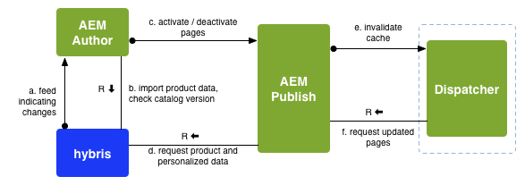

# Sviluppo con SAP Commerce Cloud {#developing-with-sap-commerce-cloud}

>[!NOTE]
>
>Il framework eCommerce può essere utilizzato con qualsiasi soluzione eCommerce. Alcune specifiche ed esempi qui trattati faranno riferimento alla soluzione [ibrida](https://www.hybris.com/) .

Il framework di integrazione include un livello di integrazione con un&#39;API. Questo consente di:

* collegare un sistema eCommerce ed estrarre i dati del prodotto in AEM
* creazione di componenti AEM per funzionalità di e-commerce indipendenti dal motore eCommerce specifico


>[!NOTE]
>
>[È disponibile anche la documentazione](/help/sites-developing/ecommerce.md#api-documentation) API.

Per utilizzare il livello di integrazione sono disponibili diversi componenti AEM predefiniti. Attualmente si tratta di:

* un componente per la visualizzazione di un prodotto
* un carrello
* check-out

Per la ricerca viene fornito un gancio di integrazione che consente di utilizzare la ricerca di AEM, la ricerca del sistema eCommerce, una ricerca di terze parti (come Search&amp;Promote) o una combinazione di esso.

## Selezione motore eCommerce {#ecommerce-engine-selection}

Il framework eCommerce può essere utilizzato con qualsiasi soluzione eCommerce, il motore utilizzato deve essere identificabile da AEM:

* I motori di eCommerce sono servizi OSGi che supportano l&#39; `CommerceService` interfaccia

   * I motori possono essere distinti da una proprietà `commerceProvider` del servizio

* AEM supporta `Resource.adaptTo()` per `CommerceService` e `Product`

   * L&#39; `adaptTo` implementazione cerca una `cq:commerceProvider` proprietà nella gerarchia della risorsa:

      * Se trovato, il valore viene utilizzato per filtrare la ricerca del servizio commerce.
      * Se non viene trovato, viene utilizzato il servizio di commercio di livello più elevato.
   * Viene utilizzato un `cq:Commerce` mixin per `cq:commerceProvider` aggiungere risorse fortemente tipizzate.


* La `cq:commerceProvider` proprietà viene utilizzata anche per fare riferimento alla definizione di fabbrica commerciale appropriata.

   * Ad esempio, una `cq:commerceProvider` proprietà con il valore `hybris` sarà correlata alla configurazione OSGi per **Day CQ Commerce Factory for Hybris** (com.adobe.cq.commerce.hybris.impl.HybrisServiceFactory), dove `commerceProvider` anche il parametro ha il valore `hybris`.

   * In questo caso è possibile configurare ulteriori proprietà, ad esempio la versione **** del catalogo (se appropriato e disponibile).

Vedere gli esempi seguenti:

| `cq:commerceProvider = geometrixx` | in un’installazione AEM standard è necessaria un’implementazione specifica; ad esempio, l&#39;esempio geometrixx, che include estensioni minime per l&#39;API generica |
|---|---|
| `cq:commerceProvider = hybris` | implementazione di hybris |

### Esempio {#example}

```shell
/content/store
+ cq:commerceProvider = hybris
  + mens
    + polo-shirt-1
    + polo-shirt-2
    + employee
+ cq:commerceProvider = jcr
  + adobe-logo-shirt
    + cq:commerceType = product
    + price = 12.50
  + adobe-logo-shirt_S
    + cq:commerceType = variant
    + size = S
  + adobe-logo-shirt_XL
    + cq:commerceType = variant
    + size = XL
    + price = 14.50
```

>[!NOTE]
>
>Utilizzando CRXDE Lite potete vedere come questo viene gestito nel componente prodotto per l’implementazione di hybris:
>
>`/apps/geometrixx-outdoors/components/hybris/product/product.jsp`

### Sviluppo per hybris 4 {#developing-for-hybris}

L&#39;estensione hybris di eCommerce Integration Framework è stata aggiornata per supportare Hybris 5, mantenendo al contempo la compatibilità con Hybris 4.

Le impostazioni predefinite nel codice sono sintonizzate per Hybris 5.

Per sviluppare per Hybris 4 è necessario quanto segue:

* Quando si richiama l&#39;area di visualizzazione, aggiungere al comando il seguente argomento della riga di comando

   `-P hybris4`

   Scarica la distribuzione preconfigurata di Hybris 4 e la incorpora nel pacchetto `cq-commerce-hybris-server`.

* In Gestione configurazione OSGi:

   * Disattivate il supporto di Hybris 5 per il servizio Parser di risposte predefinito.
   * Verificate che il servizio Gestore autenticazione di base Hybris abbia una classificazione di servizio inferiore a quella del servizio Gestore OAuth di Hybris.

### Gestione sessione {#session-handling}

hybris utilizza una sessione utente per memorizzare informazioni come il carrello acquisti del cliente. L&#39;ID sessione viene restituito da hybris in un `JSESSIONID` cookie che deve essere inviato in seguito a richieste successive ad hybris. Per evitare di memorizzare l’ID sessione nell’archivio, questo viene codificato in un altro cookie memorizzato nel browser dell’acquirente. Vengono eseguiti i seguenti passaggi:

* Alla prima richiesta non viene impostato alcun cookie sulla richiesta dell&#39;acquirente; viene quindi inviata una richiesta all’istanza hybris per creare una sessione.
* I cookie di sessione vengono estratti dalla risposta, codificati in un nuovo cookie (ad esempio, `hybris-session-rest`) e impostati sulla risposta dell&#39;acquirente. La codifica in un nuovo cookie è necessaria, perché il cookie originale è valido solo per un determinato percorso e in caso contrario non viene inviato dal browser nelle richieste successive. Le informazioni sul percorso devono essere aggiunte anche al valore del cookie.
* Su richieste successive, i cookie vengono decodificati dai `hybris-session-<*xxx*>` cookie e impostati sul client HTTP utilizzato per richiedere i dati da hybris.

>[!NOTE]
>
>Viene creata una nuova sessione anonima quando la sessione originale non è più valida.

#### CommerceSession {#commercesession}

* Questa sessione &quot;possiede&quot; il **carrello**

   * esegue add/remove/etc
   * esegue i vari calcoli sul carrello;

      `commerceSession.getProductPrice(Product product)`

* Possiede la posizione *di* archiviazione per i dati dell&#39; **ordine**

   `CommerceSession.getUserContext()`

* Possiede anche la connessione di elaborazione **pagamento**
* Possiede anche la connessione di **evasione**

### Sincronizzazione e pubblicazione dei prodotti {#product-synchronization-and-publishing}

I dati di prodotto mantenuti in hybris devono essere disponibili in AEM. È stato attuato il seguente meccanismo:

* Un carico iniziale di ID è fornito da hybris come feed. Possono essere presenti aggiornamenti a questo feed.
* hybris fornirà informazioni di aggiornamento tramite un feed (che AEM sondaggi).
* Quando AEM utilizza i dati del prodotto, invierà le richieste ai hybris per i dati correnti (richiesta di ricezione condizionale utilizzando l&#39;ultima data modificata).
* In hybris è possibile specificare il contenuto di feed in modo dichiarativo.
* La mappatura della struttura del feed al modello di contenuto AEM avviene nella scheda di feed sul lato AEM.



* L’importazione (b) viene utilizzata per l’impostazione iniziale della struttura ad albero della pagina in AEM per i cataloghi.
* Le modifiche al catalogo negli ibridi sono indicate per AEM tramite un feed, che poi si propagano a AEM (b)

   * Prodotto aggiunto/eliminato/modificato rispetto alla versione del catalogo.
   * Prodotto approvato.

* L&#39;estensione hybris fornisce un importatore polling (&quot;schema hybris&quot;), che può essere configurato per importare modifiche in AEM a un intervallo specificato (ad esempio, ogni 24 ore in cui l&#39;intervallo è specificato in secondi):

   * 

      ```js
      http://localhost:4502/content/geometrixx-outdoors/en_US/jcr:content.json
       {
       * "jcr:mixinTypes": ["cq:PollConfig"],
       * "enabled": true,
       * "source": "hybris:outdoors",
       * "jcr:primaryType": "cq:PageContent",
       * "interval": 86400
       }
      ```

* La configurazione del catalogo in AEM riconosce le versioni **dei cataloghi Staged** e **Online** .

* La sincronizzazione di prodotti tra versioni catalogo richiederà una (disattivazione)attivazione della pagina AEM corrispondente (a, c)

   * L&#39;aggiunta di un prodotto a una versione di catalogo **online** richiede l&#39;attivazione della pagina del prodotto.
   * La rimozione di un prodotto richiede la disattivazione.

* L&#39;attivazione di una pagina in AEM c) richiede un controllo (b) ed è possibile solo se

   * Il prodotto si trova in una versione catalogo **online** per le pagine dei prodotti.
   * I prodotti di riferimento sono disponibili in una versione catalogo **online** per altre pagine (ad esempio, pagine di campagna).

* Le pagine di prodotto attivate devono accedere alla versione **online** (d) dei dati del prodotto.

* L’istanza di pubblicazione AEM richiede l’accesso agli hybris per il recupero di prodotti e dati personalizzati (d).

### Architettura {#architecture}

#### Architettura di prodotti e varianti {#architecture-of-product-and-variants}

Un singolo prodotto può presentare più varianti; ad esempio, può variare in base al colore e/o alla dimensione. Un prodotto deve definire quali proprietà determinano la variazione; chiamiamo questi assi ** varianti.

Tuttavia, non tutte le proprietà sono assi variabili. Le variazioni possono interessare anche altre proprietà; ad esempio, il prezzo potrebbe dipendere dalle dimensioni. Queste proprietà non possono essere selezionate dall&#39;acquirente e pertanto non sono considerate assi di variante.

Ciascun prodotto e/o variante è rappresentato da una risorsa e pertanto viene mappato 1:1 su un nodo del repository. È un corollario che un prodotto e/o una variante specifica possa essere identificato in modo univoco dal suo percorso.

La risorsa prodotto/variante non contiene sempre i dati effettivi del prodotto. Può trattarsi di una rappresentazione dei dati effettivamente contenuti in un altro sistema (ad esempio gli ibridi). Ad esempio, le descrizioni dei prodotti, i prezzi, ecc. non vengono memorizzati in AEM, ma recuperati in tempo reale dal motore eCommerce.

Qualsiasi risorsa prodotto può essere rappresentata da un `Product API`. La maggior parte delle chiamate nell&#39;API del prodotto sono specifiche per le varianti (anche se le variazioni possono ereditare valori condivisi da un predecessore), ma ci sono anche chiamate che elencano il set di variazioni ( `getVariantAxes()`, `getVariants()`ecc.).

>[!NOTE]
>
>In effetti, gli assi di una variante sono determinati da qualsiasi `Product.getVariantAxes()` risultato:
>
>* hybris lo definisce per l&#39;implementazione hybris
>
>
Mentre i prodotti (in generale) possono avere molti assi di variante, il componente prodotto out-of-the-box gestisce solo due:
>
>1. `size`
   >
   >
1. più uno
>
>   
Questa variante aggiuntiva viene selezionata tramite la `variationAxis` proprietà del riferimento prodotto (in genere `color` per i Geometrixx Outdoors).

#### Riferimenti prodotto e dati prodotto {#product-references-and-product-data}

In generale:

* i dati del prodotto si trovano in `/etc`

* e i riferimenti ai prodotti in `/content`.

Deve essere presente una mappa 1:1 tra le varianti di prodotto e i nodi dati del prodotto.

Anche i riferimenti ai prodotti devono avere un nodo per ogni variante presentata, ma non è necessario presentare tutte le varianti. Ad esempio, se un prodotto ha varianti S, M, L, i dati del prodotto potrebbero essere.

```shell
etc
|──commerce
|  |──products
|     |──shirt
|       |──shirt-s
|       |──shirt-m
|       |──shirt-l
```

Mentre un catalogo &quot;Grande e Alto&quot; potrebbe avere solo.

```shell
content
|──big-and-tall
|  |──shirt
|     |──shirt-l
```

Infine, non è previsto l&#39;uso di dati di prodotto. È possibile inserire tutti i dati di prodotto sotto i riferimenti nel catalogo; ma non è possibile avere più cataloghi senza duplicare tutti i dati del prodotto.

**API**

#### com.adobe.cq.com di prodotto.api.Interfaccia di prodotto {#com-adobe-cq-commerce-api-product-interface}

```java
public interface Product extends Adaptable {

    public String getPath();            // path to specific variation
    public String getPagePath();        // path to presentation page for all variations
    public String getSKU();             // unique ID of specific variation

    public String getTitle();           // shortcut to getProperty(TITLE)
    public String getDescription();     // shortcut to getProperty(DESCRIPTION)
    public String getImageUrl();        // shortcut to getProperty(IMAGE_URL)
    public String getThumbnailUrl();    // shortcut to getProperty(THUMBNAIL_URL)

    public <T> T getProperty(String name, Class<T> type);

    public Iterator<String> getVariantAxes();
    public boolean axisIsVariant(String axis);
    public Iterator<Product> getVariants(VariantFilter filter) throws CommerceException;
}
```

#### com.adobe.cq.commerce.api.VariantFilter  {#com-adobe-cq-commerce-api-variantfilter}

```java
/**
 * Interface for filtering variants and AxisFilter provided as common implementation
 *
 * The <code>VariantFilter</code> is used to filter variants,
 * e.g. when using {@link Product#getVariants(VariantFilter filter)}.
 */
public interface VariantFilter {
    public boolean includes(Product product);
}

/**
 * A {@link VariantFilter} for filtering variants by the given
 * axis and value. The following example returns a list of
 * variant products that have a value of <i>blue</i> on the
 * <i>color</i> axis.
 *
 * <p>
 * <code>product.getVariants(new AxisFilter("color", "blue"));</code>
 */
public class AxisFilter implements VariantFilter {

    private String axis;
    private String value;

    public AxisFilter(String axis, String value) {
        this.axis = axis;
        this.value = value;
    }

    /**
     * {@inheritDoc}
     */
    public boolean includes(Product product) {
        ValueMap values = product.adaptTo(ValueMap.class);

        if(values != null) {
            String v = values.get(axis, String.class);

            return v != null && v == value;
        }

        return false;
    }
}
```

* **Meccanismo di storage generale**

   * I nodi di prodotto non sono:non strutturati.
   * Un nodo prodotto può essere:

      * Un riferimento, con i dati del prodotto memorizzati altrove:

         * I riferimenti ai prodotti contengono una `productData` proprietà che fa riferimento ai dati del prodotto (in genere sotto `/etc/commerce/products`).
         * I dati del prodotto sono gerarchici; gli attributi del prodotto vengono ereditati dagli predecessori di un nodo di dati di prodotto.
         * I riferimenti ai prodotti possono anche contenere proprietà locali, che ignorano quelle specificate nei relativi dati di prodotto.
      * Un prodotto:

         * Senza una `productData` proprietà.
         * Un nodo di prodotto che contiene tutte le proprietà localmente (e non contiene una proprietà productData) eredita gli attributi di prodotto direttamente dai propri predecessori.


* **Struttura AEM prodotto generica**

   * Ogni variante deve avere un proprio nodo foglia.
   * L&#39;interfaccia del prodotto rappresenta sia prodotti che varianti, ma il nodo del repository correlato è specifico sul quale si trova.
   * Il nodo product descrive gli attributi del prodotto e gli assi delle varianti.

#### Esempio {#example-1}

```shell
+ banyan_shirt
    - cq:commerceType = product
    - cq:productAttributes = [jcr:title, jcr:description, size, price, color]
    - cq:productVariantAxes = [color, size]
    - jcr:title = Banyan Shirt
    - jcr:description = Flowery, all-cotton shirt.
    - price = 14.00
    + banyan_shirt_s
        - cq:commerceType = variant
        - size = S
        + banyan_shirt_s_red
            - cq:commerceType = variant
            - color = red
        + banyan_shirt_s_blue
            - cq:commerceType = variant
            - color = blue
    + banyan_shirt_m
        - cq:commerceType = variant
        - size = M
        + banyan_shirt_m_red
            - cq:commerceType = variant
            - color = red
        + banyan_shirt_m_blue
            - cq:commerceType = variant
            - color = blue
    + banyan_shirt_l
        - cq:commerceType = variant
        - size = L
        + banyan_shirt_l_red
            - cq:commerceType = variant
            - color = red
        + banyan_shirt_l_blue
            - cq:commerceType = variant
            - color = blue
    + banyan_shirt_xl
        - cq:commerceType = variant
        - size = XL
        - price = 18.00
```

#### Architettura del carrello {#architecture-of-the-shopping-cart}

**Componenti**

* Il carrello è di proprietà del `CommerceSession:`

   * Consente di `CommerceSession` eseguire operazioni di aggiunta, rimozione e così via.
   * Vengono `CommerceSession` inoltre eseguiti i vari calcoli sul carrello. &quot;

* Anche se non direttamente correlati al carrello, l&#39; `CommerceSession` operatore deve anche fornire informazioni sui prezzi del catalogo (dal momento che possiede i prezzi)

   * La determinazione prezzi può avere diversi modificatori:

      * Sconti sulla quantità.
      * Valute diverse.
      * IVA e IVA.
   * I modificatori sono completamente aperti con la seguente interfaccia:

      * `int CommerceSession.getQuantityBreakpoints(Product product)`
      * `String CommerceSession.getProductPrice(Product product)`


**Archiviazione**

* Archiviazione

   * Nel caso hybris, il server hybris possiede il carrello.
   * Nel caso AEM-generico i carrelli di maiuscole e minuscole sono memorizzati nel [ClientContext](/help/sites-administering/client-context.md).

**Personalizzazione**

* La personalizzazione deve sempre essere guidata dal [ClientContext](/help/sites-administering/client-context.md).
* Viene creato un ClientContext `/version/` del carrello in tutti i casi:

   * I prodotti devono essere aggiunti utilizzando il `CommerceSession.addCartEntry()` metodo .

* Esempio di informazioni sul carrello nel carrello dei ClientContext:


#### Architettura del Checkout {#architecture-of-checkout}

**Dati carrello e ordine**

La proprietà `CommerceSession` possiede i tre elementi:

1. Contenuto del carrello
1. Prezzi
1. Dettagli ordine

1. **Contenuto del carrello**

   Lo schema del contenuto del carrello è fisso dall&#39;API:

   ```java
   public void addCartEntry(Product product, int quantity);
   public void modifyCartEntry(int entryNumber, int quantity);
   public void deleteCartEntry(int entryNumber);
   ```

1. **Prezzi**

   Lo schema tariffario è anche fissato dall&#39;API:

   ```java
   public String getCartPreTaxPrice();
   public String getCartTax();
   public String getCartTotalPrice();
   public String getOrderShipping();
   public String getOrderTotalTax();
   public String getOrderTotalPrice();
   ```

1. **Dettagli ordine**

   Tuttavia, i dettagli dell&#39;ordine *non* vengono corretti dall&#39;API:

   ```java
   public void updateOrderDetails(Map<String, String> orderDetails);
   public Map<String, String> getOrderDetails();
   public void submitOrder();
   ```

**Calcoli di spedizione**

* I moduli di ordine spesso devono presentare più opzioni di spedizione (e prezzi).
* I prezzi possono essere basati su articoli e dettagli dell&#39;ordine, come peso e/o indirizzo di consegna.
* L&#39; `CommerceSession` utente ha accesso a tutte le dipendenze, quindi può essere trattato in modo simile al prezzo del prodotto:

   * Il `CommerceSession` proprietario del prezzo di spedizione.
   * Può recuperare/aggiornare i dettagli di consegna utilizzando `updateOrder(Map<String, Object> delta)`

>[!NOTE]
>
>È possibile implementare un selettore di spedizione; ad esempio:
>
>`yourProject/commerce/components/shippingpicker`:
>
>* Essenzialmente questa potrebbe essere una copia di `foundation/components/form/radio`, ma con callback al `CommerceSession` for:
   >
   >
* Verifica della disponibilità del metodo
>* Aggiunta di informazioni sui prezzi
>* Per consentire agli acquirenti di aggiornare la pagina dell&#39;ordine in AEM (incluso il superset di metodi di spedizione e il testo che li descrive), pur mantenendo il controllo per esporre le `CommerceSession` informazioni pertinenti.


**Elaborazione pagamenti**

* Possiede `CommerceSession` anche la connessione di elaborazione del pagamento.
* Gli implementatori devono aggiungere chiamate specifiche (al servizio di elaborazione dei pagamenti prescelto) all&#39; `CommerceSession` implementazione.

**Evasione ordine**

* Possiede `CommerceSession` anche la connessione di evasione.
* Gli esecutori dovranno aggiungere chiamate specifiche (al servizio di elaborazione dei pagamenti prescelto) all&#39; `CommerceSession` implementazione.

### Ricerca definizione {#search-definition}

In base al modello di API per i servizi standard, il progetto eCommerce fornisce un set di API relative alla ricerca che possono essere implementate dai singoli motori di commercio.

>[!NOTE]
>
>Attualmente, solo il motore ibrido implementa l&#39;API di ricerca out-of-the-box.
>
>Tuttavia, l&#39;API di ricerca è generica e può essere implementata da ogni CommerceService singolarmente.

Il progetto eCommerce contiene un componente di ricerca predefinito, che si trova in:

`/libs/commerce/components/search`


Questo utilizza l&#39;API di ricerca per eseguire una query sul motore di eCommerce (vedi Selezione [motore di](#ecommerce-engine-selection)eCommerce) selezionato:

#### API di ricerca {#search-api}

Il progetto principale offre diverse classi generiche / helper:

1. `CommerceQuery`

   Viene utilizzato per descrivere una query di ricerca (contiene informazioni sul testo della query, la pagina corrente, la dimensione della pagina, l’ordinamento e i facet selezionati). Tutti i servizi eCommerce che implementano l&#39;API di ricerca riceveranno le istanze di questa classe per eseguire la ricerca. È `CommerceQuery` possibile creare un&#39;istanza di un oggetto di richiesta ( `HttpServletRequest`).

1. `FacetParamHelper`

   È una classe di utilità che fornisce un metodo statico, `toParams` , utilizzato per generare stringhe di `GET` parametri da un elenco di facet e un valore attivato. Questa funzione è utile nell’interfaccia utente, dove è necessario visualizzare un collegamento ipertestuale per ciascun valore di ciascun facet, in modo che quando l’utente fa clic sul collegamento ipertestuale il relativo valore venga attivato (ovvero se è stato selezionato, viene rimosso dalla query, altrimenti aggiunto). Questo si occupa di tutte le logiche di gestione di facet multivalore/monomalore, valori prevalenti, ecc.

Il punto di ingresso per l&#39;API di ricerca è il `CommerceService#search` metodo che restituisce un `CommerceResult` oggetto. Per ulteriori informazioni su questo argomento, consulta la Documentazione [sulle](/help/sites-developing/ecommerce.md#api-documentation) API.

### Integrazione utente {#user-integration}

L&#39;integrazione viene fornita tra AEM e vari sistemi di eCommerce. Ciò richiede una strategia per la sincronizzazione degli acquirenti tra i vari sistemi, in modo che il codice AEM specifico debba conoscere solo AEM e viceversa:

* Autenticazione

   Si presume che AEM sia l&#39; *unico* web front-end e pertanto esegua *tutta* l&#39;autenticazione.

* Account in Hybris

   AEM un account corrispondente (subordinato) in hybris per ogni acquirente. Il nome utente di questo account è lo stesso del nome utente AEM. Una password crittografata casuale viene generata automaticamente e memorizzata (cifrata) in AEM.

#### Utenti preesistenti {#pre-existing-users}

Un front-end AEM può essere posizionato davanti a un&#39;implementazione ibrida esistente. È inoltre possibile aggiungere un motore ibrido a un&#39;installazione AEM esistente. A tal fine, i sistemi devono essere in grado di gestire correttamente gli utenti esistenti in entrambi i sistemi:

* AEM -> hybris

   * Quando si effettua l&#39;accesso agli ibridi, se l&#39;utente AEM non esiste già:

      * creare un nuovo utente hybris con una password crittografata casuale
      * memorizzare il nome utente hybris nella directory utente dell&#39;utente AEM
   * Consulta: `com.adobe.cq.commerce.hybris.impl.HybrisSessionImpl#login()`


* hybris -> AEM

   * Durante l&#39;accesso a AEM, se il sistema riconosce l&#39;utente:

      * tentativo di accedere a hybris con nome utente/pwd fornito
      * in caso di esito positivo, create il nuovo utente in AEM con la stessa password (il valore di sale AEM specifico darà luogo a un hash AEM specifico)
   * L&#39;algoritmo di cui sopra è implementato in una Sling `AuthenticationInfoPostProcessor`

      * Consulta: `com.adobe.cq.commerce.hybris.impl.user.LazyUserImporter.java`


### Personalizzazione del processo di importazione {#customizing-the-import-process}

Per sfruttare le funzionalità esistenti del gestore di importazioni personalizzato:

* deve implementare l&#39; `ImportHandler` interfaccia

* può estendere il `DefaultImportHandler`.

```java
/**
 * Services implementing the <code>ImportHandler</code> interface are
 * called by the {@link HybrisImporter} to create actual commerce entities
 * such as products.
 */
public interface ImportHandler {

  /**
  * Not used.
  */
  public void createTaxonomie(ImporterContext ctx);

  /**
  * Creates a catalog with the given name.
  * @param ctx   The importer context
  * @param name  The catalog's name
  * @return Path of created catalog
  */
  public String createCatalog(ImporterContext ctx, String name) throws Exception;

  /**
  * Creates a product from the given values.
  * @param ctx                The importer context
  * @param values             The product's properties
  * @param parentCategoryPath The containing category's path
  * @return Path of created product
  */
  public String createProduct(ImporterContext ctx, ValueMap values, String parentCategoryPath) throws Exception;

  /**
  * Creates a variant product from the given values.
  * @param ctx             The importer context
  * @param values          The product's properties
  * @param baseProductPath The base product's path
  * @return Path of created product
  */
  public String createVariantProduct(ImporterContext ctx, ValueMap values, String baseProductPath) throws Exception;

  /**
  * Creates an asset for a product. This is usually a product
  * image.
  * @param ctx             The importer context
  * @param values          The product's properties
  * @param baseProductPath The product's path
  * @return Path of created asset
  */
  public String createAsset(ImporterContext ctx, ValueMap values, String productPath) throws Exception;

  /**
  * Creates a category from the given values.
  * @param ctx           The importer context
  * @param values        The category's properties
  * @param parentPath    Path of parent category or base path of import in case of root category
  * @return Path of created category
  */
  public String createCategory(ImporterContext ctx, ValueMap values, String parentCategoryPath) throws Exception;
}
```

Affinché il gestore personalizzato venga riconosciuto dall&#39;importatore, deve specificare la `service.ranking`proprietà con un valore superiore a 0; ad esempio.

```java
@Component
@Service
@Property(name = "service.ranking", value = 100)
public class MyImportHandler extends DefaultImportHandler
{
...
}
```
