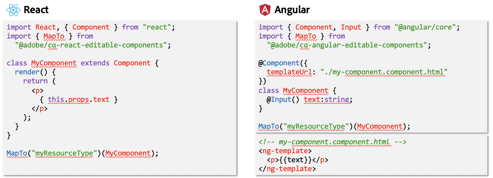

# Sviluppo di SPA per AEM{#developing-spas-for-aem}

Le applicazioni a pagina singola (SPA) possono offrire esperienze coinvolgenti agli utenti di siti web. Gli sviluppatori desiderano essere in grado di creare siti utilizzando framework SPA e gli autori desiderano modificare facilmente i contenuti all’interno di Adobe Experience Manager (AEM) per un sito creato utilizzando tali framework.

Questo articolo presenta questioni importanti da considerare quando si coinvolge uno sviluppatore front-end per sviluppare un’applicazione a pagina singola per AEM e fornisce una panoramica dell’architettura di AEM per quanto riguarda la distribuzione di applicazioni a pagina singola su AEM.

{{ue-over-spa}}

## Principi di sviluppo SPA per AEM {#spa-development-principles-for-aem}

Lo sviluppo di applicazioni a pagina singola in AEM presuppone che lo sviluppatore front-end osservi le best practice standard durante la creazione di una SPA. Se in qualità di sviluppatore front-end segui queste best practice generali e alcuni principi specifici di AEM, l&#39;applicazione a pagina singola funzionerà con [AEM e le relative funzionalità di authoring dei contenuti](/help/sites-developing/spa-walkthrough.md#content-editing-experience-with-spa).

* **[Portabilità](/help/sites-developing/spa-architecture.md#portability) -** Come per qualsiasi componente, i componenti devono essere costruiti in modo da essere il più possibile portatili. La SPA deve essere realizzata con componenti portabili e riutilizzabili.
* **[AEM definisce la struttura del sito](/help/sites-developing/spa-architecture.md#aem-drives-site-structure)**: lo sviluppatore front-end crea componenti e possiede la loro struttura interna, ma si basa su AEM per definire la struttura dei contenuti del sito.
* **[Rendering dinamico](/help/sites-developing/spa-architecture.md#dynamic-rendering)** - Tutto il rendering deve essere dinamico.
* **[Routing dinamico](#dynamic-routing) -** L&#39;applicazione a pagina singola è responsabile del routing e AEM lo ascolta e recupera in base a esso. Anche altri routing devono essere dinamici.

Se tieni presenti questi principi durante lo sviluppo dell’applicazione a pagina singola, sarà il più flessibile e scalabile possibile, e al contempo abiliterà tutte le funzionalità di authoring di AEM supportate.

Se non è necessario supportare le funzionalità di authoring di AEM, potrebbe essere necessario prendere in considerazione un [modello di progettazione SPA](/help/sites-developing/spa-architecture.md#spa-design-models) diverso.

### Portabilità {#portability}

Come per qualsiasi altro componente, i componenti devono essere progettati in modo da massimizzarne la portabilità. È necessario evitare qualsiasi modello che possa compromettere la portabilità o la riutilizzabilità dei componenti per garantire compatibilità, flessibilità e manutenibilità in futuro.

L’applicazione a pagina singola risultante deve essere realizzata con componenti altamente portatili e riutilizzabili.

### Struttura del sito delle unità AEM {#aem-drives-site-structure}

Lo sviluppatore front-end deve considerarsi responsabile della creazione di una libreria di componenti SPA utilizzati per creare l’app. Lo sviluppatore front-end ha il pieno controllo della struttura interna dei componenti. [Tuttavia, AEM è sempre il proprietario della struttura del sito.](/help/sites-developing/spa-overview.md)

Questo significa che lo sviluppatore front-end può aggiungere contenuto del cliente prima o dopo il punto di ingresso dei componenti e può anche effettuare chiamate di terze parti all’interno del componente. Tuttavia, lo sviluppatore front-end non ha il pieno controllo, ad esempio, del modo in cui i componenti vengono nidificati.

### Rendering dinamico {#dynamic-rendering}

L’applicazione a pagina singola deve basarsi solo sul rendering dinamico dei contenuti. Questa è l’aspettativa predefinita in cui AEM recupera ed esegue il rendering di tutti gli elementi secondari della struttura del contenuto.

Qualsiasi rendering esplicito che punti a contenuti specifici viene considerato come rendering statico e, anche se supportato, non è compatibile con le funzioni di authoring dei contenuti di AEM. Ciò è contrario anche al principio di [portabilità](/help/sites-developing/spa-architecture.md#portability).

### Routing dinamico {#dynamic-routing}

Come per il rendering, anche tutte le operazioni di instradamento devono essere dinamiche. In AEM, [l&#39;applicazione a pagina singola deve sempre essere proprietaria del routing](/help/sites-developing/spa-routing.md) e AEM lo ascolta e recupera il contenuto basato su di esso.

Qualsiasi routing statico funziona in base al principio [di portabilità](/help/sites-developing/spa-architecture.md#portability) e limita l&#39;autore in quanto non è compatibile con le funzionalità di authoring dei contenuti di AEM. Ad esempio, con il routing statico, se l’autore di contenuto desidera modificare un percorso o una pagina, deve chiedere allo sviluppatore front-end di farlo.

## Archetipo di progetto AEM {#aem-project-archetype}

Qualsiasi progetto AEM deve utilizzare l’[archetipo di progetto AEM](https://experienceleague.adobe.com/docs/experience-manager-core-components/using/developing/archetype/overview.html?lang=it), che supporta progetti SPA utilizzando React o Angular e sfrutta l’SDK di SPA.

## Modelli di progettazione SPA {#spa-design-models}

Se si seguono i [principi di sviluppo delle applicazioni a pagina singola in AEM](/help/sites-developing/spa-architecture.md#spa-development-principles-for-aem), l&#39;applicazione a pagina singola funzionerà con tutte le funzionalità supportate per l&#39;authoring dei contenuti AEM.

In alcuni casi, tuttavia, ciò non è del tutto necessario. Nella tabella seguente viene fornita una panoramica dei vari modelli di progettazione, dei vantaggi e degli svantaggi.

<table>
 <tbody>
  <tr>
   <th><strong>Modello di progettazione  </strong></th>
   <th><strong>Vantaggi</strong></th>
   <th><strong>Svantaggi</strong></th>
  </tr>
  <tr>
   <td>AEM viene utilizzato come CMS headless senza l'utilizzo del framework SDK dell'<a href="/help/sites-developing/spa-reference-materials.md">Editor applicazioni a pagina singola.</a></td>
   <td>Lo sviluppatore front-end ha il pieno controllo dell’app.</td>
   <td>
Gli autori dei contenuti non possono utilizzare l’esperienza di authoring dei contenuti di AEM.
 
Il codice non è portatile né riutilizzabile se contiene riferimenti statici o di routing.
 
Non consente l’utilizzo dell’editor di modelli, pertanto lo sviluppatore front-end deve mantenere i modelli modificabili tramite JCR.
 </td>
  </tr>
  <tr>
   <td>Lo sviluppatore front-end utilizza il framework SDK dell’editor di applicazioni a pagina singola, ma apre solo alcune aree all’autore di contenuto.</td>
   <td>Lo sviluppatore mantiene il controllo sull’app abilitando l’authoring solo nelle aree limitate dell’app.</td>
   <td>
Gli autori dei contenuti sono limitati a un set limitato di esperienze di authoring dei contenuti di AEM.
 
Il codice rischia di non essere né portatile né riutilizzabile se contiene riferimenti statici o instradamento.
 
Non consente l’utilizzo dell’editor di modelli, pertanto lo sviluppatore front-end deve mantenere i modelli modificabili tramite JCR.
 </td>
  </tr>
  <tr>
   <td>Il progetto utilizza appieno l’editor SDK per applicazioni a pagina singola, i componenti front-end vengono sviluppati come libreria e la struttura del contenuto dell’app viene delegata ad AEM.</td>
   <td>
L’app è riutilizzabile e portatile.
 
L'autore del contenuto può modificare l'app utilizzando l'esperienza di authoring dei contenuti di AEM.  
 
L’applicazione a pagina singola è compatibile con l’editor di modelli.
 </td>
   <td>
Lo sviluppatore non ha il controllo della struttura dell’app e della parte di contenuto delegata ad AEM.
 
Lo sviluppatore può comunque riservare alcune aree dell’app per i contenuti che non devono essere creati con AEM.
 </td>
  </tr>
 </tbody>
</table>

>[!NOTE]
>
>Anche se tutti i modelli sono supportati in AEM, solo implementando il terzo (e quindi seguendo i [principi di sviluppo SPA consigliati in AEM](/help/sites-developing/spa-architecture.md#spa-development-principles-for-aem)) gli autori di contenuti possono interagire con e modificare il contenuto dell&#39;SPA in AEM così come sono abituati.

## Migrazione delle applicazioni a pagina singola esistenti ad AEM {#migrating-existing-spas-to-aem}

In genere, se l&#39;applicazione a pagina singola segue i [Principi di sviluppo per AEM](/help/sites-developing/spa-architecture.md#spa-development-principles-for-aem), l&#39;applicazione a pagina singola funzionerà in AEM e sarà modificabile con l&#39;Editor applicazioni a pagina singola di AEM.

Segui questi passaggi per preparare l’applicazione a pagina singola esistente a funzionare con AEM.

1. **Rendere modulari i componenti JS.**

   Rendi possibile il rendering in qualsiasi ordine, posizione e dimensione.
1. **Utilizza i contenitori forniti da Adobe SDK per inserire i tuoi componenti sullo schermo.**

   AEM fornisce un componente di sistema pagina e paragrafo da utilizzare.
1. **Crea un componente AEM per ogni componente JS.**

   I componenti AEM definiscono la finestra di dialogo e l’output JSON.

## Istruzioni per sviluppatori front-end {#instructions-for-front-end-developers}

Per coinvolgere uno sviluppatore front-end nella creazione di un’applicazione a pagina singola per AEM, il compito principale è concordare i componenti e i relativi modelli JSON.

Di seguito è riportato uno schema dei passaggi che uno sviluppatore front-end deve seguire quando sviluppa un’applicazione a pagina singola per AEM.

1. **Accetto i componenti e il relativo modello JSON**

   Gli sviluppatori front-end e gli sviluppatori back-end di AEM devono concordare i componenti necessari e un modello, in modo da garantire una corrispondenza uno a uno tra i componenti SPA e i componenti back-end.

   I componenti AEM sono ancora necessari principalmente per fornire finestre di dialogo di modifica ed esportare il modello di componente.

1. **Nei componenti React, accedere al modello tramite`this.props.cqModel`**

   Una volta concordati i componenti e impostato il modello JSON, lo sviluppatore front-end è libero di sviluppare l&#39;applicazione a pagina singola e può semplicemente accedere al modello JSON tramite `this.props.cqModel`.

1. **Implementa il metodo `render()` del componente**

   Lo sviluppatore front-end implementa il metodo `render()` come ritiene opportuno e può utilizzare i campi della proprietà `cqModel`. In questo modo vengono generati i frammenti DOM e HTML inseriti nella pagina. Questo è il modo standard per creare un’app in React.

1. **Mappa il componente sul tipo di risorsa AEM tramite`MapTo()`**

   Il mapping archivia le classi di componenti e viene utilizzato internamente dal componente `Container` fornito per recuperare e creare in modo dinamico istanze di componenti in base al tipo di risorsa specificato.

   Questo funge da &quot;colla&quot; tra front-end e back-end in modo che l’editor sappia a quali componenti corrispondono i componenti react.

   `Page` e `ResponsiveGrid` sono buoni esempi di classi che estendono la base `Container`.

1. **Definisci `EditConfig` del componente come parametro per`MapTo()`**

   Questo parametro è necessario per indicare all’editor come deve essere denominato il componente, purché non sia ancora stato eseguito il rendering o non sia presente alcun contenuto da riprodurre.

1. **Estendi la classe `Container` fornita per pagine e contenitori**

   I sistemi di pagine e paragrafi devono estendere questa classe in modo che la delega ai componenti interni funzioni come previsto.

1. **Implementa una soluzione di routing che utilizza l&#39;API `History` di HTML5.**

   Quando `ModelRouter` è abilitato, la chiamata delle funzioni `pushState` e `replaceState` attiva una richiesta a `PageModelManager` per recuperare un frammento mancante del modello.

   La versione corrente di `ModelRouter` supporta solo l&#39;utilizzo di URL che puntano al percorso effettivo delle risorse dei punti di ingresso del modello Sling. Non supporta l’utilizzo di URL personalizzati o alias.

   `ModelRouter` può essere disabilitato o configurato per ignorare un elenco di espressioni regolari.

## AEM - Agnostico {#aem-agnostic}

Questi blocchi di codice illustrano in che modo i componenti React e Angular non richiedono nulla che sia specifico per Adobe o AEM.

* Tutto ciò che si trova all’interno del componente JavaScript è indipendente da AEM.
* Tuttavia, ciò che è specifico di AEM è che il componente JS deve essere mappato su un componente AEM con l’helper MapTo.

L&#39;helper `MapTo` è l&#39;&quot;associazione&quot; che consente la corrispondenza tra i componenti back-end e front-end:

* Indica al contenitore JS (o al sistema paragrafo JS) quale componente JS è responsabile del rendering di ciascuno dei componenti presenti nel JSON.
* Aggiunge un attributo di dati HTML al HTML riprodotto dal componente JS, in modo che l’editor SPA sappia quale finestra di dialogo visualizzare quando si modifica il componente.

Per ulteriori informazioni sull&#39;utilizzo di `MapTo` e sulla creazione di applicazioni a pagina singola per AEM in generale, vedere la Guida introduttiva per il framework scelto.

* [Guida introduttiva alle applicazioni a pagina singola in AEM - React](/help/sites-developing/spa-getting-started-react.md)
* [Guida introduttiva alle applicazioni a pagina singola in AEM - Angular](/help/sites-developing/spa-getting-started-angular.md)

## Architettura AEM e applicazioni a pagina singola {#aem-architecture-and-spas}

L’architettura generale di AEM, inclusi gli ambienti di sviluppo, authoring e pubblicazione, non cambia quando si utilizzano le applicazioni a pagina singola. Tuttavia, è utile comprendere in che modo lo sviluppo di applicazioni a pagina singola si inserisce in questa architettura.

* **Ambiente di compilazione**

  Qui è dove l&#39;origine dell&#39;applicazione SPA e l&#39;origine del componente sono estratte.

   * Il generatore clientlib NPM crea una libreria client dal progetto SPA.
   * Tale libreria viene presa da Maven e implementata dal plug-in Maven Build insieme al componente nell’istanza di authoring di AEM.

* **Autore AEM**

  Il contenuto viene creato nell’istanza di authoring di AEM, inclusa la creazione di applicazioni a pagina singola.

  Quando si modifica un’applicazione a pagina singola utilizzando l’Editor SPA nell’ambiente di authoring:

   1. L’applicazione a pagina singola richiede il HTML esterno.
   1. CSS caricato.
   1. Il JavaScript dell’applicazione SPA è caricato.
   1. Quando viene eseguita l&#39;applicazione SPA, viene richiesto il JSON, che consente all&#39;app di generare il DOM della pagina, inclusi gli attributi `cq-data`.
   1. Questi attributi `cq-data` consentono all&#39;editor di caricare informazioni aggiuntive sulla pagina in modo da sapere quali configurazioni di modifica sono disponibili per i componenti.

* **Pubblicazione AEM**

  Qui vengono pubblicati per l’utilizzo pubblico i contenuti creati e le librerie compilate, inclusi gli artefatti delle applicazioni SPA, clientlibs e componenti.

* **Dispatcher / CDN**

  Dispatcher funge da livello di caching di AEM per i visitatori del sito.

   * Le richieste vengono elaborate in modo simile a come nell’istanza di authoring di AEM, tuttavia non vi è alcuna richiesta di informazioni sulla pagina, perché questa è necessaria solo per l’editor.
   * JavaScript, CSS, JSON e HTML sono memorizzati nella cache, ottimizzando la pagina per una consegna rapida.

>[!NOTE]
>
>All’interno di AEM, non è necessario eseguire i meccanismi di build di JavaScript né eseguire JavaScript stesso. AEM ospita solo gli artefatti compilati dell’applicazione a pagina singola.

## Passaggi successivi {#next-steps}

Per una panoramica sulla struttura e sul funzionamento di una semplice applicazione a pagina singola in AEM, consulta la guida introduttiva sia per [React](/help/sites-developing/spa-getting-started-react.md) che per [Angular](/help/sites-developing/spa-getting-started-angular.md).

Per una guida dettagliata alla creazione di un&#39;applicazione a pagina singola personalizzata, vedi [Guida introduttiva all&#39;editor di applicazioni a pagina singola di AEM - Esercitazione eventi WKND](https://experienceleague.adobe.com/docs/experience-manager-learn/sites/spa-editor/spa-editor-framework-feature-video-use.html?lang=it).

Per ulteriori dettagli sul mapping tra modello dinamico e componente e sul suo funzionamento all&#39;interno delle applicazioni a pagina singola in AEM, vedere l&#39;articolo [Mapping tra modello dinamico e componente per applicazioni a pagina singola](/help/sites-developing/spa-dynamic-model-to-component-mapping.md).

Se desideri implementare le applicazioni a pagina singola in AEM per un framework diverso da React o Angular o semplicemente approfondire il funzionamento di SPA SDK for AEM, consulta l&#39;articolo [Blueprint SPA](/help/sites-developing/spa-blueprint.md).
