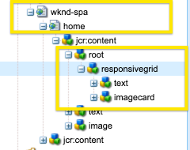

# Componenti compositi negli SPA {#composite-components-in-spas}

I componenti compositi utilizzano la natura modulare dei componenti dell’AEM combinando più componenti di base in un unico componente. Un caso d’uso comune di componente composito è il componente scheda, costituito da una combinazione dei componenti immagine e testo.

Quando i componenti compositi vengono implementati correttamente nel framework dell’Editor applicazioni a pagina singola (SPA) dell’AEM, gli autori dei contenuti possono trascinare e rilasciare tali componenti come farebbero con qualsiasi altro componente, ma hanno comunque la possibilità di modificare singolarmente ogni componente che costituisce il componente composito.

Questo articolo illustra come aggiungere un componente composito all’applicazione a pagina singola per lavorare direttamente con l’editor SPA dell’AEM.

## Caso d’uso {#use-case}

Questo articolo utilizza il componente tipico della scheda come caso d’uso di esempio. Le schede sono un elemento dell’interfaccia utente comune per molte esperienze digitali e sono in genere costituite da un’immagine e dal testo o dalla didascalia associati. L’autore desidera poter trascinare e rilasciare l’intera scheda, ma può modificare singolarmente l’immagine della scheda e personalizzare il testo associato.

## Prerequisiti {#prerequisites}

I seguenti modelli per il supporto dei casi di utilizzo dei componenti compositi richiedono i seguenti prerequisiti.

* L’istanza di sviluppo AEM è in esecuzione localmente sulla porta 4502 con un progetto di esempio.
* Hai un’app React esterna funzionante [è abilitato per la modifica in AEM.](spa-edit-external.md)
* L’app React viene caricata nell’editor AEM [mediante il componente RemotePage.](spa-remote-page.md)

## Aggiunta di componenti compositi a un SPA {#adding-composite-components}

Esistono tre diversi modelli per implementare il componente composito a seconda dell’implementazione SPA all’interno dell’AEM.

* [Il componente non esiste nel progetto AEM.](#component-does-not-exist)
* [Il componente esiste nel progetto AEM, ma il contenuto richiesto no.](#content-does-not-exist)
* [Il componente e il contenuto richiesto sono entrambi presenti nel progetto AEM.](#both-exist)

Le sezioni seguenti forniscono esempi di implementazione di ogni caso utilizzando il componente scheda come esempio.

### Il componente non esiste nel progetto AEM. {#component-does-not-exist}

Inizia creando i componenti che costituiranno il componente composito, ovvero i componenti per l’immagine e il relativo testo.

1. Crea la componente testo nel progetto AEM.
1. Aggiungi il corrispondente `resourceType` dal progetto nel file `editConfig` nodo.

   ```text
    resourceType: 'wknd-spa/components/text' 
   ```

1. Utilizza il `withMappable` per abilitare la modifica per il componente.

   ```text
   export const AEMText = withMappable(Text, TextEditConfig); 
   ```

Il componente testo sarà simile al seguente.

```javascript
import React from 'react';
import { withMappable } from '@adobe/aem-react-editable-components';

export const TextEditConfig = {
  emptyLabel: 'Text',
  isEmpty: function(props) {
    return !props || !props.text || props.text.trim().length < 1;
  },
  resourceType: 'wknd-spa/components/text'
};

export const Text = ({ cqPath, richText, text }) => {
  const richTextContent = () => (
    <div className="aem_text"
      id={cqPath.substr(cqPath.lastIndexOf('/') + 1)}
      data-rte-editelement
      dangerouslySetInnerHTML={{__html: text}} />
  );
  return richText ? richTextContent() : (
     <div className="aem_text">{text}</div>
  );
};

export const AEMText = withMappable(Text, TextEditConfig);
```

Se crei un componente immagine in modo simile, puoi combinarlo con il `AEMText` in un nuovo componente scheda, utilizzando i componenti immagine e testo come elementi secondari.

```javascript
import React from 'react';
import { AEMText } from './AEMText';
import { AEMImage } from './AEMImage';

export const AEMCard = ({ pagePath, itemPath}) => (
  <div>
    <AEMText
       pagePath={pagePath}
       itemPath={`text`} />
    <AEMImage
       pagePath={pagePath}
       itemPath={`image`} />
   </div>
);
```

Questo componente composito risultante può ora essere posizionato ovunque nell’app e aggiungerà segnaposto per un componente testo e immagine nell’editor SPA. Nell’esempio seguente, il componente scheda viene aggiunto al componente Home sotto il titolo.

```javascript
function Home() {
  return (
    <div className="Home">
      <h2>Current Adventures</h2>
      <AEMCard
        pagePath='/content/wknd-spa/home' />
    </div>
  );
}
```

Nell’editor verrà visualizzato un segnaposto vuoto per un testo e un’immagine. Quando si immettono i valori per questi utilizzando l’editor, essi vengono memorizzati nel percorso di pagina specificato, ovvero `/content/wknd-spa/home`  a livello principale con i nomi specificati in `itemPath`.


### Il componente esiste nel progetto AEM, ma il contenuto richiesto no. {#content-does-not-exist}

In questo caso, il componente scheda è già stato creato nel progetto AEM contenente il titolo e i nodi immagine. I nodi secondari (testo e immagine) dispongono dei tipi di risorse corrispondenti.


Puoi quindi aggiungerlo all’SPA e recuperarne il contenuto.

1. Crea un componente corrispondente nell’SPA a questo scopo. Assicurati che i componenti secondari siano mappati sui corrispondenti tipi di risorse AEM all’interno del progetto SPA. In questo esempio utilizziamo lo stesso `AEMText` e `AEMImage` componenti come dettagliato [nel caso precedente.](#component-does-not-exist)

   ```javascript
   import React from 'react';
   import { Container, withMappable, MapTo } from '@adobe/aem-react-editable-components';
   import { Text, TextEditConfig } from './AEMText';
   import Image, { ImageEditConfig } from './AEMImage';
   
   export const AEMCard = withMappable(Container, {
     resourceType: 'wknd-spa/components/imagecard'
   });
   
   MapTo('wknd-spa/components/text')(Text, TextEditConfig);
   MapTo('wknd-spa/components/image')(Image, ImageEditConfig);
   ```

1. Poiché non è presente alcun contenuto per `imagecard` aggiungere la scheda alla pagina. Includere nell’SPA il contenitore esistente dell’AEM.
   * Se il progetto AEM contiene già un contenitore, possiamo includerlo nell’SPA e aggiungerlo al contenitore dall’AEM.
   * Assicurati che il componente della scheda sia mappato sul tipo di risorsa corrispondente nell’SPA.

   ```javascript
   <ResponsiveGrid
    pagePath='/content/wknd-spa/home'
    itemPath='root/responsivegrid' />
   ```

1. Aggiungi il creato `wknd-spa/components/imagecard` ai componenti consentiti per il componente contenitore [nel modello della pagina.](/help/sites-authoring/templates.md)

Ora il `imagecard` Il componente può essere aggiunto direttamente al contenitore nell’editor AEM.


### Il componente e il contenuto richiesto sono entrambi presenti nel progetto AEM. {#both-exist}

Se il contenuto esiste nell’AEM, può essere incluso direttamente nell’SPA fornendo il percorso del contenuto.

```javascript
<AEMCard
    pagePath='/content/wknd-spa/home'
    itemPath='root/responsivegrid/imagecard' />
```



Il `AEMCard` il componente è uguale a quello definito [nel caso d’uso precedente.](#content-does-not-exist) In questo caso, il contenuto del progetto AEM, definito nel punto precedente, è incluso nell’SPA.
