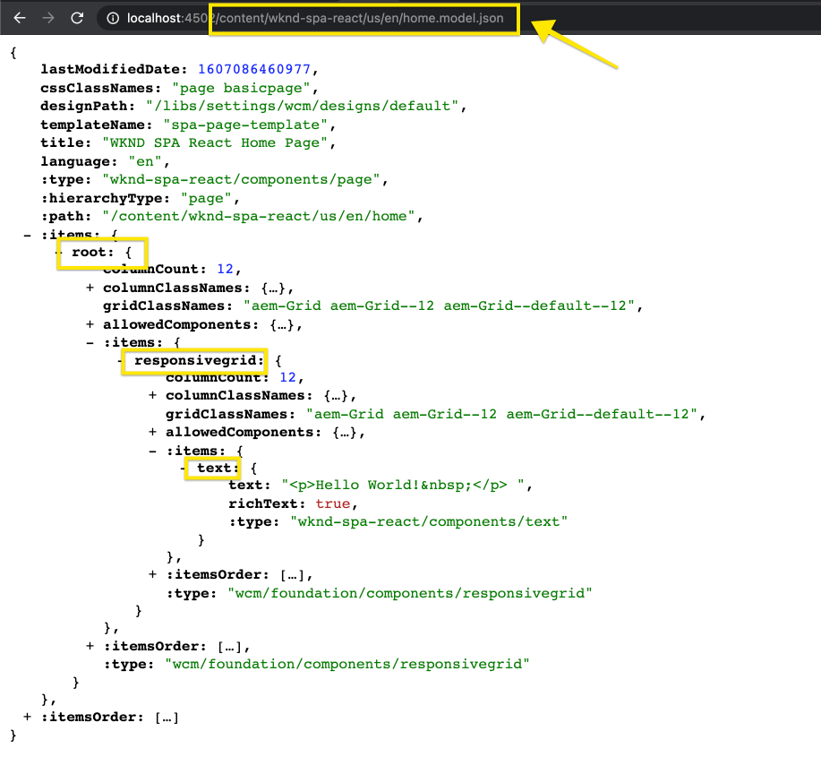
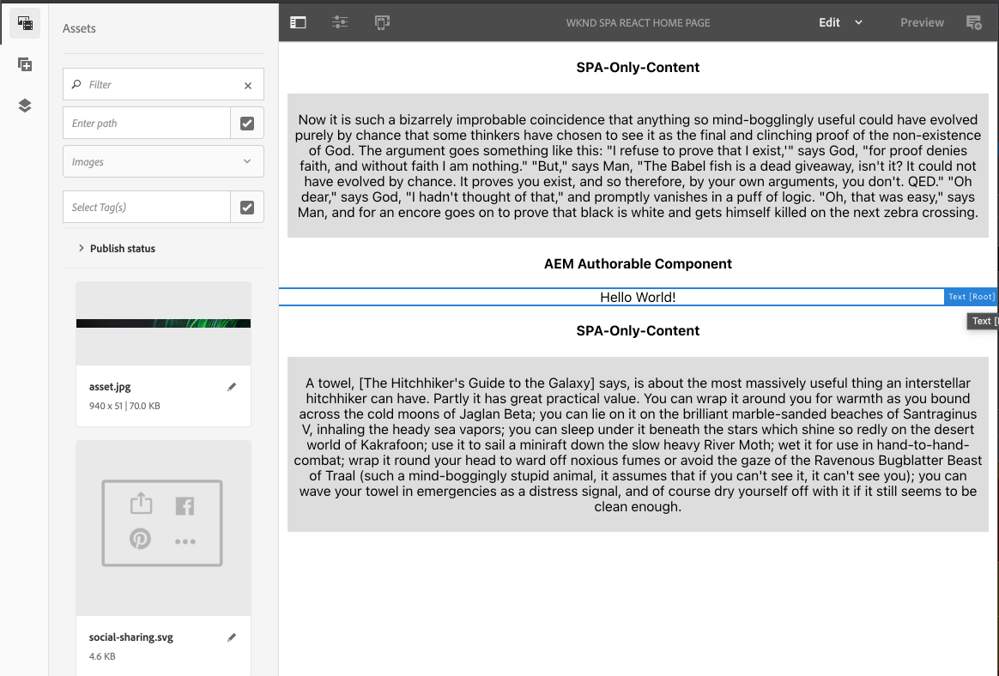

# Modifica di un SPA esterno in AEM {#editing-external-spa-within-aem}

Quando si decide quale livello di integrazione si desidera avere tra il SPA esterno e il AEM, spesso è necessario essere in grado di modificare e visualizzare il SPA in AEM.

## Panoramica {#overview}

Questo documento descrive i passaggi consigliati per caricare un SPA autonomo in un’istanza AEM, aggiungere sezioni di contenuto modificabili e abilitare l’authoring.

## Prerequisiti {#prerequisites}

I prerequisiti sono semplici.

* Assicurati che un&#39;istanza di AEM sia in esecuzione localmente.
* Crea un progetto di base AEM SPA utilizzando [l&#39;Archetipo AEM progetto.](https://experienceleague.adobe.com/docs/experience-manager-core-components/using/developing/archetype/overview.html?#available-properties)
   * Questo costituirà la base del progetto AEM che verrà aggiornato per includere il SPA esterno.
   * Per gli esempi contenuti in questo documento, utilizziamo il punto iniziale del [progetto di SPA WKND.](https://experienceleague.adobe.com/docs/experience-manager-learn/sites/spa-editor/spa-editor-framework-feature-video-use.html#spa-editor)
* Avere a portata di mano il React SPA funzionante ed esterno che si desidera integrare.

## Caricare SPA nel progetto AEM {#upload-spa-to-aem-project}

Innanzitutto devi caricare il SPA esterno nel progetto AEM.

1. Sostituisci `src` nella cartella di progetto `/ui.frontend` con la cartella `src` dell&#39;applicazione React.
1. Includi eventuali dipendenze aggiuntive nel file `package.json` dell’app nel file `/ui.frontend/package.json`.
   * Assicurati che le dipendenze SDK SPA siano delle [versioni consigliate.](spa-getting-started-react.md#dependencies)
1. Includi eventuali personalizzazioni nella cartella `/public` .
1. Includi eventuali script o stili in linea aggiunti nel file `/public/index.html`.

## Configurare il SPA remoto {#configure-remote-spa}

Ora che il SPA esterno fa parte del progetto AEM, deve essere configurato all’interno di AEM.

### Includere Adobe SPA pacchetti SDK {#include-spa-sdk-packages}

Per sfruttare AEM funzionalità SPA, esistono dipendenze dai tre pacchetti seguenti.

* [`@adobe/aem-react-editable-components`](https://github.com/adobe/aem-react-editable-components)
* [`@adobe/aem-spa-component-mapping`](https://www.npmjs.com/package/@adobe/aem-spa-component-mapping)
* [`@adobe/aem-spa-page-model-manager`](https://www.npmjs.com/package/@adobe/aem-spa-model-manager)

`@adobe/aem-spa-page-model-manager` fornisce l&#39;API per l&#39;inizializzazione di un Model Manager e il recupero del modello dall&#39;istanza AEM. Questo modello può quindi essere utilizzato per eseguire il rendering dei componenti AEM utilizzando le API di `@adobe/aem-react-editable-components` e `@adobe/aem-spa-component-mapping`.

#### Installazione {#installation}

Esegui il seguente comando npm per installare i pacchetti richiesti.

```shell
npm install --save @adobe/aem-spa-component-mapping @adobe/aem-spa-page-model-manager @adobe/aem-react-editable-components
```

### Inizializzazione ModelManager {#model-manager-initialization}

Prima del rendering dell&#39;app, è necessario inizializzare [`ModelManager`](spa-blueprint.md#pagemodelmanager) per gestire la creazione del AEM `ModelStore`.

Questo deve essere fatto all&#39;interno del file `src/index.js` dell&#39;applicazione o ovunque venga eseguito il rendering della radice dell&#39;applicazione.

A questo scopo, possiamo utilizzare l’ `initializationAsync` API fornita da `ModelManager`.

La schermata seguente mostra come abilitare l&#39;inizializzazione di `ModelManager` in una semplice applicazione React. L&#39;unico vincolo è che `initializationAsync` deve essere chiamato prima di `ReactDOM.render()`.


In questo esempio, il `ModelManager` viene inizializzato e viene creato un `ModelStore` vuoto.

`initializationAsync` Facoltativamente, può accettare un  `options` oggetto come parametro:

* `path` - All&#39;inizializzazione, il modello nel percorso definito viene recuperato e memorizzato in  `ModelStore`. Questo può essere utilizzato per recuperare il `rootModel` all&#39;inizializzazione, se necessario.
* `modelClient` - Consente di fornire un client personalizzato responsabile del recupero del modello.
* `model` - Un  `model` oggetto passato come parametro generalmente popolato quando si  [utilizza SSR.](spa-ssr.md)

### AEM componenti foglia autorizzati {#authorable-leaf-components}

1. Crea/identifica un componente AEM per il quale verrà creato un componente React di authoring. In questo esempio, utilizziamo il componente testo del progetto WKND.

   

1. Crea un semplice componente di testo React nel SPA. In questo esempio, è stato creato un nuovo file `Text.js` con il seguente contenuto.

   

1. Crea un oggetto di configurazione per specificare gli attributi necessari per abilitare AEM modifica.

   

   * `resourceType` è obbligatorio per mappare il componente React al componente AEM e abilitare la modifica all’apertura nell’editor di AEM.

1. Utilizzare la funzione wrapper `withMappable`.

   

   Questa funzione wrapper mappa il componente React al AEM `resourceType` specificato nella configurazione e abilita le funzionalità di modifica quando viene aperto nell&#39;editor AEM. Per i componenti indipendenti, recupererà anche il contenuto del modello per il nodo specifico.

   >[!NOTE]
   >
   >In questo esempio sono disponibili versioni separate del componente: AEM componenti React con wrapping e senza wrapping. La versione con wrapping deve essere utilizzata quando si utilizza esplicitamente il componente . Quando il componente fa parte di una pagina, puoi continuare a utilizzare il componente predefinito come attualmente avviene nell’editor di SPA.

1. Esegui il rendering del contenuto nel componente.

   Le proprietà JCR del componente testo vengono visualizzate come segue in AEM.

   

   Questi valori vengono passati come proprietà al componente `AEMText` React appena creato e possono essere utilizzati per eseguire il rendering del contenuto.

   ```javascript
   import React from 'react';
   import { withMappable } from '@adobe/aem-react-editable-components';
   
   export const TextEditConfig = {
       // Empty component placeholder label
       emptyLabel:'Text', 
       isEmpty:function(props) {
          return !props || !props.text || props.text.trim().length < 1;
       },
       // resourcetype of the AEM counterpart component
       resourceType:'wknd-spa-react/components/text'
   };
   
   const Text = ({ text }) => (<div>{text}</div>);
   
   export default Text;
   
   export const AEMText = withMappable(Text, TextEditConfig);
   ```

   Questo è il modo in cui il componente apparirà al termine delle configurazioni di AEM.

   ```javascript
   const Text = ({ cqPath, richText, text }) => {
      const richTextContent = () => (
         <div className="aem_text" id={cqPath.substr(cqPath.lastIndexOf('/') + 1)} data-rte-editelement dangerouslySetInnerHTML={{__html: text}}/>
      );
      return richText ? richTextContent() : (<div className="aem_text">{text}</div>);
   };
   ```

   >[!NOTE]
   >
   >In questo esempio, sono state apportate ulteriori personalizzazioni al componente di cui è stato eseguito il rendering per farlo corrispondere al componente di testo esistente. Questo tuttavia non è correlato all’authoring in AEM.

#### Aggiungere componenti autorizzati alla pagina {#add-authorable-component-to-page}

Una volta creati i componenti React modificabili, possiamo utilizzarli in tutta l’applicazione.

Prendiamo una pagina di esempio in cui è necessario aggiungere un testo dal progetto WKND SPA. Per questo esempio, vogliamo visualizzare il testo &quot;Hello World!&quot; su `/content/wknd-spa-react/us/en/home.html`.

1. Determinare il percorso del nodo da visualizzare.

   * `pagePath`: La pagina che contiene il nodo, nel nostro esempio  `/content/wknd-spa-react/us/en/home`
   * `itemPath`: Percorso del nodo all&#39;interno della pagina, nel nostro esempio  `root/responsivegrid/text`
      * È costituito dai nomi degli elementi contenenti nella pagina.

   

1. Aggiungi il componente nella posizione desiderata nella pagina.

   

   Il componente `AEMText` può essere aggiunto nella posizione desiderata all’interno della pagina con i valori `pagePath` e `itemPath` impostati come proprietà. `pagePath` è una proprietà obbligatoria.

#### Verifica della modifica del contenuto del testo in AEM {#verify-text-edit}

Ora possiamo testare il componente sulla nostra istanza AEM in esecuzione.

1. Esegui il seguente comando Maven dalla directory `aem-guides-wknd-spa` per generare e distribuire il progetto in AEM.

```shell
mvn clean install -PautoInstallSinglePackage
```

1. Nell’istanza di AEM, passa a `http://<host>:<port>/editor.html/content/wknd-spa-react/us/en/home.html`.



Il componente `AEMText` è ora autorizzato su AEM.

### AEM pagine autorizzate {#aem-authorable-pages}

1. Identifica una pagina da aggiungere per l’authoring nel SPA. In questo esempio viene utilizzato `/content/wknd-spa-react/us/en/home.html`.
1. Crea un nuovo file (ad es. `Page.js`) per il componente Pagina modificabile. In questo caso è possibile riutilizzare il componente Pagina fornito in `@adobe/cq-react-editable-components`.
1. Ripeti il passaggio quattro nella sezione [AEM componenti foglia modificabili.](#authorable-leaf-components) Utilizzare la funzione wrapper  `withMappable` sul componente.
1. Come già fatto in precedenza, applica `MapTo` ai tipi di risorse AEM per tutti i componenti secondari all’interno della pagina.

   ```javascript
   import { Page, MapTo, withMappable } from '@adobe/aem-react-editable-components';
   import Text, { TextEditConfig } from './Text';
   
   export default withMappable(Page);
   
   MapTo('wknd-spa-react/components/text')(Text, TextEditConfig);
   ```

   >[!NOTE]
   >
   >In questo esempio utilizziamo il componente di testo React senza wrapping invece del testo con wrapping `AEMText` creato in precedenza. Questo perché quando il componente fa parte di una pagina/contenitore e non è stand-alone, il contenitore si occuperà della mappatura ricorsiva del componente e dell’abilitazione delle funzionalità di authoring; il wrapper aggiuntivo non è necessario per ogni elemento figlio.

1. Per aggiungere una pagina di authoring nella SPA, segui gli stessi passaggi nella sezione [Aggiungi componenti di authoring alla pagina .](#add-authorable-component-to-page) Qui possiamo comunque saltare la  `itemPath` proprietà.

#### Verifica contenuto pagina in AEM {#verify-page-content}

Per verificare che la pagina possa essere modificata, segui gli stessi passaggi nella sezione [Verifica la modifica del contenuto di testo in AEM.](#verify-text-edit)


La pagina è ora modificabile in AEM con un contenitore di layout e un componente Testo secondario.

### Componenti foglia virtuali {#virtual-leaf-components}

Negli esempi precedenti, abbiamo aggiunto componenti al SPA con contenuto AEM esistente. Tuttavia, in alcuni casi in cui il contenuto non è ancora stato creato in AEM, ma deve essere aggiunto in un secondo momento dall’autore del contenuto. Per ovviare a questo problema, lo sviluppatore front-end può aggiungere componenti nelle posizioni appropriate all’interno della SPA. Questi componenti visualizzano i segnaposto quando vengono aperti nell’editor in AEM. Una volta che il contenuto viene aggiunto all’interno di questi segnaposto dall’autore del contenuto, i nodi vengono creati nella struttura JCR e il contenuto viene mantenuto. Il componente creato consentirà lo stesso set di operazioni dei componenti foglia indipendenti.

In questo esempio, stiamo riutilizzando il componente `AEMText` creato in precedenza. Desideriamo aggiungere nuovo testo sotto il componente di testo esistente nella home page WKND. L’aggiunta dei componenti è la stessa dei normali componenti foglia. Tuttavia, è possibile aggiornare il `itemPath` nel percorso in cui è necessario aggiungere il nuovo componente.

Poiché il nuovo componente deve essere aggiunto sotto il testo esistente in `root/responsivegrid/text`, il nuovo percorso sarà `root/responsivegrid/{itemName}`.

```html
<AEMText
 pagePath='/content/wknd-spa-react/us/en/home'
 itemPath='root/responsivegrid/text_20' />
```

Dopo l’aggiunta del componente virtuale, il componente `TestPage` avrà un aspetto simile al seguente.


>[!NOTE]
>
>Assicurati che il componente `AEMText` abbia il suo `resourceType` impostato nella configurazione per abilitare questa funzione.

Ora puoi distribuire le modifiche a AEM seguendo i passaggi descritti nella sezione [Verifica la modifica del contenuto di testo in AEM.](#verify-text-edit) Verrà visualizzato un segnaposto per il  `text_20` nodo attualmente non esistente.


Quando l’autore del contenuto aggiorna questo componente, viene creato un nuovo nodo `text_20` in `root/responsivegrid/text_20` in `/content/wknd-spa-react/us/en/home`.


#### Requisiti e limitazioni {#limitations}

Sono necessari diversi requisiti per aggiungere componenti foglia virtuali e alcune limitazioni.

* La proprietà `pagePath` è obbligatoria per la creazione di un componente virtuale.
* Il nodo di pagina fornito nel percorso in `pagePath` deve esistere nel progetto AEM.
* Il nome del nodo da creare deve essere specificato in `itemPath`.
* Il componente può essere creato a qualsiasi livello.
   * Se forniamo un `itemPath='text_20'` nell’esempio precedente, il nuovo nodo verrà creato direttamente sotto la pagina, ovvero `/content/wknd-spa-react/us/en/home/jcr:content/text_20`
* Il percorso del nodo in cui viene creato un nuovo nodo deve essere valido se fornito tramite `itemPath`.
   * In questo esempio, `root/responsivegrid` deve esistere in modo che il nuovo nodo `text_20` possa essere creato lì.
* È supportata solo la creazione di componenti foglia. Il contenitore virtuale e la pagina saranno supportati nelle versioni future.

## Personalizzazioni aggiuntive {#additional-customizations}

Se hai seguito gli esempi precedenti, la tua SPA esterna è ora modificabile in AEM. Tuttavia, è possibile personalizzare ulteriormente alcuni aspetti del SPA esterno.

### ID nodo principale {#root-node-id}

Per impostazione predefinita, si presuppone che l&#39;applicazione React sia sottoposta a rendering all&#39;interno di un `div` dell&#39;ID elemento `spa-root`. Se necessario, può essere personalizzato.

Ad esempio, supponiamo di avere un SPA in cui l&#39;applicazione viene sottoposta a rendering all&#39;interno di un `div` dell&#39;ID elemento `root`. Questo deve riflettersi in tre file.

1. In `index.js` dell&#39;applicazione React (o dove viene chiamato `ReactDOM.render()`)

   

1. Nell’ `index.html` dell’applicazione React

   

1. Nel corpo del componente della pagina dell’app AEM in due passaggi:

   1. Crea un nuovo `body.html` per il componente pagina.

   

   1. Aggiungi il nuovo elemento principale nel nuovo file `body.html`.

   

### Modifica di un SPA React con Routing {#editing-react-spa-with-routing}

Se l&#39;applicazione React SPA esterna dispone di più pagine, [può utilizzare il routing per determinare la pagina/componente da eseguire il rendering.](spa-routing.md) Il caso d’uso di base è quello di corrispondere all’URL attualmente attivo rispetto al percorso fornito per una route. Per abilitare la modifica su tali applicazioni abilitate per il routing, il percorso da abbinare deve essere trasformato per contenere informazioni specifiche per AEM.

Nell’esempio seguente abbiamo una semplice applicazione React con due pagine. La pagina di cui eseguire il rendering è determinata dalla corrispondenza del percorso fornito al router rispetto all&#39;URL attivo. Ad esempio, se è attiva `mydomain.com/test`, verrà eseguito il rendering di `TestPage`.


Per abilitare la modifica in AEM per questo esempio SPA, sono necessari i seguenti passaggi.

1. Identifica il livello che fungerebbe da radice su AEM.

   * Per il nostro campione, consideriamo `wknd-spa-react/us/en` come la radice del SPA. Ciò significa che tutto ciò che precede quel percorso è AEM solo pagine/contenuto.

1. Crea una nuova pagina al livello richiesto.

   * In questo esempio, la pagina da modificare è `mydomain.com/test`. `test` si trova nel percorso principale dell’app. Questa funzione deve essere mantenuta anche durante la creazione della pagina in AEM. Pertanto, possiamo creare una nuova pagina al livello principale definito nel passaggio precedente.
   * La nuova pagina creata deve avere lo stesso nome della pagina da modificare. In questo esempio per `mydomain.com/test`, la nuova pagina creata deve essere `/path/to/aem/root/test`.

1. Aggiungi gli helper all&#39;interno SPA routing.

   * La pagina appena creata non esegue ancora il rendering del contenuto previsto in AEM. Questo perché il router prevede un percorso di `/test`, mentre il percorso attivo AEM è `/wknd-spa-react/us/en/test`. Per includere la porzione AEM specifica dell’URL, è necessario aggiungere alcuni helper sul lato SPA.

   

   * A questo scopo è possibile utilizzare l’ `toAEMPath` helper fornito da `@adobe/cq-spa-page-model-manager` . Trasforma il percorso fornito per il routing in modo da includere porzioni specifiche AEM quando l&#39;applicazione è aperta in un&#39;istanza AEM. Accetta tre parametri:
      * Percorso necessario per il routing
      * L’URL di origine dell’istanza AEM in cui viene modificata la SPA.
      * La directory principale del progetto in AEM come determinato nel primo passaggio
   * Questi valori possono essere impostati come variabili di ambiente per una maggiore flessibilità.


1. Verifica di modificare la pagina in AEM.

   * Distribuisci il progetto per AEM e passare alla nuova pagina `test` creata. Il contenuto della pagina viene ora sottoposto a rendering e i componenti AEM sono modificabili.

## Risorse aggiuntive {#additional-resources}

Il seguente materiale di riferimento può essere utile per comprendere SPA nel contesto di AEM.

* [Archetipo di progetto AEM](https://experienceleague.adobe.com/docs/experience-manager-core-components/using/developing/archetype/overview.html)
* [Progetto WKND SPA](https://experienceleague.adobe.com/docs/experience-manager-learn/sites/spa-editor/spa-editor-framework-feature-video-use.html)
* [Guida introduttiva a SPA in AEM con React](spa-getting-started-react.md)
* [Materiali di riferimento SPA (riferimenti API)](spa-reference-materials.md)
* [Blueprint SPA e PageModelManager](spa-blueprint.md#pagemodelmanager)
* [Indirizzamento modello SPA](spa-routing.md)
* [Rendering lato SPA e server](spa-ssr.md)
