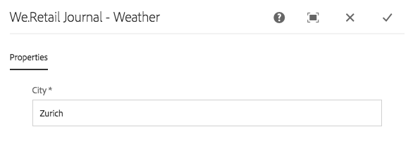
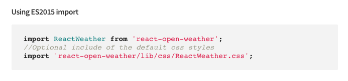

# Implementazione di un Componente React per applicazioni a pagina singola (SPA){#implementing-a-react-component-for-spa}

Le applicazioni a pagina singola (SPA) possono offrire esperienze coinvolgenti agli utenti di siti web. Gli sviluppatori desiderano essere in grado di creare siti utilizzando i framework SPA e gli autori desiderano modificare facilmente i contenuti in Adobe Experience Manager (AEM) per un sito creato utilizzando i framework SPA.

La funzione di authoring dell’SPA offre una soluzione completa per il supporto dell’SPA nell’ambito dell’AEM. Questo articolo presenta un esempio di come adattare un componente React semplice ed esistente per lavorare con l’Editor SPA dell’AEM.

>[!NOTE]
>
>L’editor SPA è la soluzione consigliata per i progetti che richiedono un rendering lato client basato sul framework SPA (ad esempio, React o Angular).

## Introduzione {#introduction}

Grazie al contratto semplice e leggero richiesto dall&#39;AEM e stabilito tra l&#39;SPA e l&#39;editor SPA, è facile prendere un&#39;applicazione JavaScript esistente e adattarla per l&#39;utilizzo con un SPA in AEM.

Questo articolo illustra l’esempio della componente meteo sull’SPA di esempio del Diario We.Retail.

Dovresti conoscere il [Struttura di una domanda di AEM presentata dall&#39;SPA](/help/sites-developing/spa-getting-started-react.md) prima di leggere questo articolo.

>[!CAUTION]
>Questo documento utilizza [App We.Retail Journal](https://github.com/adobe/aem-sample-we-retail-journal) solo a scopo dimostrativo. Non utilizzarlo per alcun lavoro di progetto.
>
>Qualsiasi progetto AEM deve utilizzare [Archetipo progetto AEM](https://experienceleague.adobe.com/docs/experience-manager-core-components/using/developing/archetype/overview.html?lang=it), che supporta i progetti SPA utilizzando React o Angular e utilizza l’SDK dell’SPA.

## Componente meteo {#the-weather-component}

Il componente meteo si trova in alto a sinistra nell’app We.Retail Journal. Visualizza il meteo corrente di una posizione definita, estraendo i dati meteo in modo dinamico.

### Utilizzo del widget meteo {#using-the-weather-widget}


Quando si crea un contenuto dell’SPA nell’Editor SPA, la componente meteo viene visualizzata come qualsiasi altro componente AEM, completa di una barra degli strumenti, ed è modificabile.


La città può essere aggiornata in una finestra di dialogo come qualsiasi altra componente dell’AEM.



La modifica viene mantenuta e il componente si aggiorna automaticamente con i nuovi dati meteo.


### Implementazione componente meteo {#weather-component-implementation}

La componente meteo si basa su un componente React disponibile al pubblico, denominato [Tempo React Open](https://www.npmjs.com/package/react-open-weather). È stato adattato per funzionare come componente nell’applicazione SPA di esempio di We.Retail Journal.

Di seguito sono riportati alcuni snippet della documentazione NPM relativa all’utilizzo del componente React Open Weather.

 

Revisione del codice della componente meteo personalizzata ( `Weather.js`) nell&#39;applicazione del diario We.Retail:

* **Riga 16**: il widget meteo React Open viene caricato come richiesto.
* **Riga 46**: Il `MapTo` questa funzione di React collega questo componente a un componente AEM corrispondente in modo che possa essere modificato nell’Editor SPA.

* **Righe 22-29**: Il `EditConfig` è definito, verificando se la città è stata compilata e definendo il valore se vuoto.

* **Righe 31-44**: la componente Meteo estende il `Component` e fornisce i dati richiesti come definito nella documentazione di utilizzo NPM per il componente React Open Weather ed esegue il rendering del componente.

```javascript
/*~~~~~~~~~~~~~~~~~~~~~~~~~~~~~~~~~~~~~~~~~~~~~~~~~~~~~~~~~~~~~~~~~~~~~~~~~~~~~~
 ~ Copyright 2018 Adobe Systems Incorporated
 ~
 ~ Licensed under the Apache License, Version 2.0 (the "License");
 ~ you may not use this file except in compliance with the License.
 ~ You may obtain a copy of the License at
 ~
 ~     https://www.apache.org/licenses/LICENSE-2.0
 ~
 ~ Unless required by applicable law or agreed to in writing, software
 ~ distributed under the License is distributed on an "AS IS" BASIS,
 ~ WITHOUT WARRANTIES OR CONDITIONS OF ANY KIND, either express or implied.
 ~ See the License for the specific language governing permissions and
 ~ limitations under the License.
 ~~~~~~~~~~~~~~~~~~~~~~~~~~~~~~~~~~~~~~~~~~~~~~~~~~~~~~~~~~~~~~~~~~~~~~~~~~~~~*/
import React, {Component} from 'react';
import ReactWeather from 'react-open-weather';
import {MapTo} from '@adobe/aem-react-editable-components';

require('./Weather.css');

const WeatherEditConfig = {

    emptyLabel: 'Weather',

    isEmpty: function() {
        return !this.props || !this.props.cq_model || !this.props.cq_model.city || this.props.cq_model.city.trim().length < 1;
    }
};

class Weather extends Component {

    render() {
        let apiKey = "12345678901234567890";
        let city;

        if (this.props.cq_model) {
            city = this.props.cq_model.city;
            return <ReactWeather key={'react-weather' + Date.now()} forecast="today" apikey={apiKey} type="city" city={city} />
        }

        return null;
    }
}

MapTo('we-retail-journal/global/components/weather')(Weather, WeatherEditConfig);
```

Anche se un componente back-end deve già esistere, lo sviluppatore front-end può utilizzare il componente React Open Weather nell’SPA di We.Retail Journal con poca codifica.

## Passaggio successivo {#next-step}

Per maggiori informazioni sullo sviluppo dell’SPA per l’AEM vedi l’articolo [Sviluppo dell&#39;SPA per l&#39;AEM](/help/sites-developing/spa-architecture.md).
