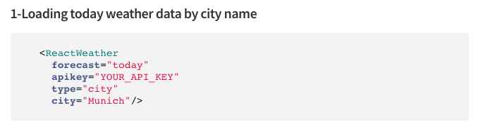

# Implementazione di un componente React per SPA{#implementing-a-react-component-for-spa}

Le applicazioni a pagina singola (SPA) possono offrire esperienze coinvolgenti agli utenti di siti Web. Gli sviluppatori desiderano essere in grado di creare siti utilizzando SPA framework e gli autori desiderano modificare i contenuti all&#39;interno di AEM per un sito creato utilizzando SPA framework.

La funzione di authoring SPA offre una soluzione completa per SPA di supporto in AEM. Questo articolo illustra come adattare un componente React semplice ed esistente per lavorare con l’editor SPA AEM.

>[!NOTE]
>
>SPA Editor è la soluzione consigliata per i progetti che richiedono SPA rendering lato client basato su framework (ad es. React o Angular).

## Introduzione {#introduction}

Grazie al contratto semplice e leggero che è richiesto da AEM e stabilito tra il SPA e l&#39;Editor SPA, prendere un&#39;applicazione Javascript esistente e adattarlo per l&#39;uso con SPA in AEM è una questione semplice.

Questo articolo illustra l’esempio del componente meteo nel SPA di esempio We.Retail Journal.

Prima di leggere questo articolo, è necessario avere familiarità con la struttura [di un&#39;applicazione SPA per AEM](/help/sites-developing/spa-getting-started-react.md).

>[!CAUTION]
>Questo documento utilizza l&#39;app [We.Retail Journal](https://github.com/Adobe-Marketing-Cloud/aem-sample-we-retail-journal) solo a scopo dimostrativo. Non deve essere utilizzato per nessun progetto.
>
>Qualsiasi progetto AEM deve sfruttare il [AEM Project Archetype](https://docs.adobe.com/content/help/it-IT/experience-manager-core-components/using/developing/archetype/overview.html), che supporta SPA progetti utilizzando React o Angular e sfrutta l&#39;SDK SPA.

## Componente meteo {#the-weather-component}

Il componente meteo si trova in alto a sinistra nell&#39;app We.Retail Journal. Visualizza il tempo corrente di una posizione definita, estraendo i dati meteo in modo dinamico.

### Utilizzo del widget meteo {#using-the-weather-widget}


Durante la creazione di contenuti del SPA nell’editor SPA, il componente meteo viene visualizzato come qualsiasi altro componente AEM, completo di una barra degli strumenti ed è modificabile.


La città può essere aggiornata in una finestra di dialogo come qualsiasi altro componente AEM.


Il cambiamento è persistente e il componente si aggiorna automaticamente con i nuovi dati meteo.


### Implementazione componente meteo {#weather-component-implementation}

Il componente meteo è in realtà basato su un componente React disponibile al pubblico, denominato [React Open Weather](https://www.npmjs.com/package/react-open-weather), che è stato adattato per funzionare come un componente all&#39;interno dell&#39;applicazione di esempio SPA We.Retail Journal.

Di seguito sono riportati alcuni esempi della documentazione NPM relativa all’utilizzo del componente React Open Weather.

 

Revisione del codice del componente meteo personalizzato ( `Weather.js`) nell&#39;applicazione We.Retail Journal:

* **Linea 16**: Il widget React Open Weather viene caricato come necessario.
* **Linea 46**: La  `MapTo` funzione collega questo componente React a un componente AEM corrispondente in modo che possa essere modificato nell’editor SPA.

* **Linee 22-29**: Il valore  `EditConfig` è definito, controllando se la città è stata popolata e definendo il valore se vuoto.

* **Linee 31-44**: Il componente Meteo estende la  `Component` classe e fornisce i dati richiesti come definito nella documentazione sull’utilizzo di NPM per il componente React Open Weather ed esegue il rendering del componente.

```javascript
/*~~~~~~~~~~~~~~~~~~~~~~~~~~~~~~~~~~~~~~~~~~~~~~~~~~~~~~~~~~~~~~~~~~~~~~~~~~~~~~
 ~ Copyright 2018 Adobe Systems Incorporated
 ~
 ~ Licensed under the Apache License, Version 2.0 (the "License");
 ~ you may not use this file except in compliance with the License.
 ~ You may obtain a copy of the License at
 ~
 ~     https://www.apache.org/licenses/LICENSE-2.0
 ~
 ~ Unless required by applicable law or agreed to in writing, software
 ~ distributed under the License is distributed on an "AS IS" BASIS,
 ~ WITHOUT WARRANTIES OR CONDITIONS OF ANY KIND, either express or implied.
 ~ See the License for the specific language governing permissions and
 ~ limitations under the License.
 ~~~~~~~~~~~~~~~~~~~~~~~~~~~~~~~~~~~~~~~~~~~~~~~~~~~~~~~~~~~~~~~~~~~~~~~~~~~~~*/
import React, {Component} from 'react';
import ReactWeather from 'react-open-weather';
import {MapTo} from '@adobe/aem-react-editable-components';

require('./Weather.css');

const WeatherEditConfig = {

    emptyLabel: 'Weather',

    isEmpty: function() {
        return !this.props || !this.props.cq_model || !this.props.cq_model.city || this.props.cq_model.city.trim().length < 1;
    }
};

class Weather extends Component {

    render() {
        let apiKey = "12345678901234567890";
        let city;

        if (this.props.cq_model) {
            city = this.props.cq_model.city;
            return <ReactWeather key={'react-weather' + Date.now()} forecast="today" apikey={apiKey} type="city" city={city} />
        }

        return null;
    }
}

MapTo('we-retail-journal/global/components/weather')(Weather, WeatherEditConfig);
```

Anche se un componente back-end deve già esistere, lo sviluppatore front-end può sfruttare il componente React Open Weather nel SPA We.Retail Journal con pochissima codifica.

## Passaggio successivo {#next-step}

Per ulteriori informazioni sullo sviluppo di SPA per AEM vedere l&#39;articolo [Sviluppo SPA per AEM](/help/sites-developing/spa-architecture.md).
