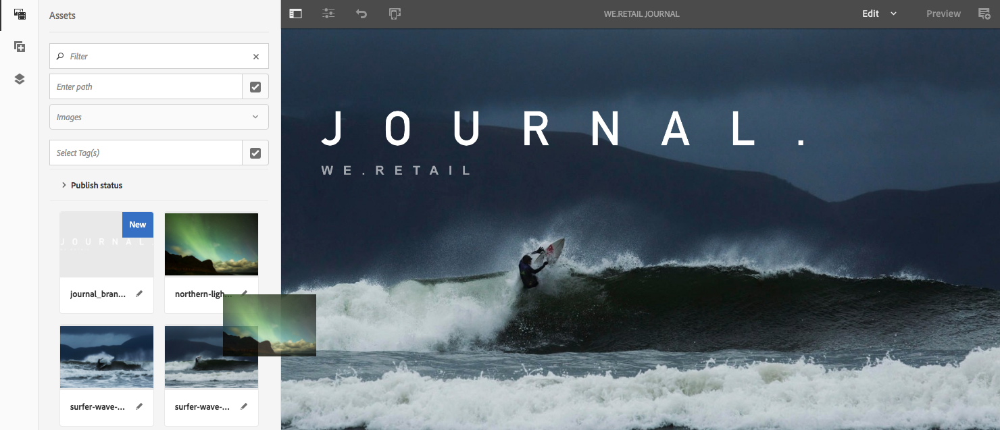

# Introduzione a SPA e procedura dettagliata{#spa-introduction-and-walkthrough}

Le applicazioni a pagina singola (SPA) possono offrire esperienze coinvolgenti agli utenti di siti web. Gli sviluppatori desiderano poter creare siti utilizzando framework SPA e gli autori desiderano modificare facilmente i contenuti all’interno di AEM per un sito creato utilizzando tali framework.

SPA Editor offre una soluzione completa per il supporto dei SPA in AEM. Questo articolo illustra l’utilizzo di un’applicazione di SPA di base per l’authoring e illustra come si relaziona con l’editor di SPA di AEM sottostante.

>[!NOTE]
>
>L’editor di SPA è la soluzione consigliata per i progetti che richiedono SPA rendering lato client basato su framework (ad esempio, React o Angular).

## Introduzione {#introduction}

### Obiettivo dell&#39;articolo {#article-objective}

Questo articolo introduce i concetti di base di SPA prima di guidare il lettore attraverso una procedura dettagliata dell’editor di SPA utilizzando una semplice applicazione SPA per illustrare le modifiche di base dei contenuti. Viene quindi descritto come creare la pagina e come l’applicazione SPA si relaziona e interagisce con l’editor di SPA AEM.

L&#39;obiettivo di questa introduzione e di questa procedura dettagliata è dimostrare a uno sviluppatore AEM perché SPA sono rilevanti, come funzionano in generale, come un SPA viene gestito dall&#39;editor di SPA AEM e come è diverso da un&#39;applicazione AEM standard.

La procedura dettagliata si basa sulla funzionalità AEM standard e sull&#39;app di esempio We.Retail Journal. Devono essere soddisfatti i seguenti requisiti:

* [AEM versione 6.4 con service pack 2 o successivo](/help/release-notes/release-notes.md)
* [Installa l&#39;app di esempio We.Retail Journal disponibile qui su GitHub.](https://github.com/Adobe-Marketing-Cloud/aem-sample-we-retail-journal)

>[!CAUTION]
>
>Questo documento utilizza [App Journal We.Retail](https://github.com/Adobe-Marketing-Cloud/aem-sample-we-retail-journal) solo a scopo dimostrativo. Non deve essere utilizzato per alcun lavoro di progetto.
>
>Qualsiasi progetto AEM deve sfruttare [Archetipo di progetto AEM](https://docs.adobe.com/content/help/it/experience-manager-core-components/using/developing/archetype/overview.html), che supporta progetti SPA utilizzando React o Angular e sfrutta l’SDK di SPA.

### Cos&#39;è un SPA? {#what-is-a-spa}

Un’applicazione a pagina singola (SPA) differisce da una pagina convenzionale in quanto viene sottoposta a rendering lato client ed è principalmente guidata da Javascript, basandosi sulle chiamate Ajax per caricare i dati e aggiornare dinamicamente la pagina. La maggior parte o tutto il contenuto viene recuperato una volta in un singolo caricamento di pagina con risorse aggiuntive caricate in modo asincrono in base alle esigenze, in base all’interazione dell’utente con la pagina.

Questo riduce la necessità di aggiornare le pagine e presenta all’utente un’esperienza fluida, rapida e più simile a un’esperienza nativa per le app.

L’editor di SPA AEM consente agli sviluppatori front-end di creare SPA che possono essere integrati in un sito AEM, consentendo agli autori di contenuti di modificare il contenuto SPA con la stessa facilità con cui sono presenti altri contenuti AEM.

### Perché un SPA? {#why-a-spa}

Essendo più veloce, fluida e più simile a un&#39;applicazione nativa, un SPA diventa un&#39;esperienza molto attraente non solo per il visitatore della pagina web, ma anche per gli esperti di marketing e gli sviluppatori a causa della natura del funzionamento di SPA.


**Visitatori**

* I visitatori desiderano esperienze di tipo nativo quando interagiscono con i contenuti.
* Ci sono dati chiari che più veloce sarà una pagina, più probabile sarà una conversione.

**Addetti al marketing**

* Gli esperti di marketing desiderano offrire esperienze avanzate e di tipo nativo per invitare i visitatori a interagire pienamente con i contenuti.
* La personalizzazione può rendere queste esperienze ancora più coinvolgenti.

**Sviluppatori**

* Gli sviluppatori vogliono una netta separazione tra contenuti e presentazioni.
* La separazione pulita rende il sistema più estensibile e consente uno sviluppo front-end indipendente.

### Come funziona un SPA? {#how-does-a-spa-work}

L&#39;idea principale alla base di un SPA è che le chiamate e la dipendenza da un server vengono ridotte al fine di ridurre al minimo i ritardi causati dalle chiamate al server in modo che il SPA si avvicini alla reattività di un&#39;applicazione nativa.

In una pagina web tradizionale sequenziale, vengono caricati solo i dati necessari per la pagina immediata. Questo significa che quando il visitatore si sposta su un’altra pagina, il server viene chiamato per le risorse aggiuntive. Potrebbero essere necessarie chiamate aggiuntive mentre il visitatore interagisce con gli elementi della pagina. Queste chiamate multiple possono dare un senso di ritardo o ritardo in quanto la pagina deve soddisfare le richieste del visitatore.


Per un’esperienza più fluida, che si avvicina a ciò che un visitatore si aspetta dalle app native per dispositivi mobili, un SPA carica tutti i dati necessari al visitatore al primo caricamento. Anche se inizialmente l&#39;operazione potrebbe richiedere un po&#39; più di tempo, elimina la necessità di chiamate server aggiuntive.

Effettuando il rendering sul lato client, l’elemento pagina reagisce più rapidamente e le interazioni con la pagina da parte del visitatore sono immediate. Eventuali dati aggiuntivi che potrebbero essere necessari vengono chiamati in modo asincrono per massimizzare la velocità della pagina.

>[!NOTE]
>
>Per informazioni tecniche sul funzionamento SPA in AEM, consulta l’articolo [Guida introduttiva a SPA in AEM](/help/sites-developing/spa-getting-started-react.md).
>
>Per un’analisi più approfondita della progettazione, dell’architettura e del flusso di lavoro tecnico dell’Editor SPA, consulta l’articolo [Panoramica dell’editor di SPA](/help/sites-developing/spa-overview.md).

## Esperienza di modifica dei contenuti con SPA {#content-editing-experience-with-spa}

Quando viene creata una SPA per sfruttare l’Editor SPA AEM, l’autore del contenuto non nota alcuna differenza durante la modifica e la creazione di contenuti. È disponibile una funzionalità AEM comune e non è necessaria alcuna modifica al flusso di lavoro dell’autore.

>[!NOTE]
>
>La procedura dettagliata si basa sulla funzionalità AEM standard e sull&#39;app di esempio We.Retail Journal. Devono essere soddisfatti i seguenti requisiti:
>
>* [AEM versione 6.4 con service pack 2](/help/release-notes/release-notes.md)
>* [Installa l&#39;app di esempio We.Retail Journal disponibile qui su GitHub.](https://github.com/Adobe-Marketing-Cloud/aem-sample-we-retail-journal)
>


1. Modifica l’app We.Retail Journal in AEM.

   `https://localhost:4502/editor.html/content/we-retail-journal/react.html`

   

1. Seleziona un componente di intestazione e osserva che la barra degli strumenti è simile a quella di qualsiasi altro componente. Seleziona **Modifica**.

   

1. Modifica il contenuto come normale in AEM e osserva che le modifiche sono persistenti.

   

   >[!NOTE]
   >Consulta la sezione [Panoramica dell’editor di SPA](spa-overview.md#requirements-limitations) per ulteriori informazioni sull&#39;editor di testo e sulle SPA in posizione.

1. Utilizza il browser Risorse per trascinare una nuova immagine in un componente immagine.

   

1. La modifica viene mantenuta.

   

Sono supportati ulteriori strumenti di authoring, come il trascinamento e il rilascio di componenti aggiuntivi sulla pagina, la ridisposizione dei componenti e la modifica del layout, come in qualsiasi applicazione non SPA.

>[!NOTE]
>
>L’Editor SPA non modifica il DOM dell’applicazione. Il SPA stesso è responsabile del DOM.
>
>Per vedere come funziona, continua con la sezione successiva di questo articolo [App SPA e editor SPA AEM](/help/sites-developing/spa-walkthrough.md#spa-apps-and-the-aem-spa-editor).

## App SPA e editor SPA AEM {#spa-apps-and-the-aem-spa-editor}

L’esperienza di come si comporta un SPA per l’utente finale e quindi l’analisi della pagina di SPA aiuta a comprendere meglio come funziona un’app SAP con l’editor di SPA in AEM.

### Utilizzo di un&#39;applicazione SPA {#using-an-spa-application}

1. Carica l&#39;applicazione We.Retail Journal sul server di pubblicazione o utilizzando l&#39;opzione **Visualizza come pubblicato** dal **Informazioni pagina** nell’editor pagina.

   `/content/we-retail-journal/react.html`

   

   Osserva la struttura delle pagine, inclusa la navigazione verso pagine figlie, widget meteo e articoli.

1. Passa a una pagina figlia utilizzando il menu e controlla che la pagina venga caricata immediatamente senza la necessità di un aggiornamento.

   

1. Apri gli strumenti di sviluppo incorporati del browser e monitora l’attività di rete mentre navighi nelle pagine figlie.

   

   C&#39;è molto poco traffico mentre si passa da una pagina all&#39;altra nell&#39;app. La pagina non viene ricaricata e vengono richieste solo le nuove immagini.

   Il SPA gestisce il contenuto e il routing interamente sul lato client.

Quindi, se la pagina non viene ricaricata durante la navigazione tra le pagine figlie, come viene caricata?

La sezione successiva, [Caricamento di un&#39;applicazione SPA](/help/sites-developing/spa-walkthrough.md#loading-an-spa-application), approfondisce la procedura di caricamento del SPA e spiega come caricare il contenuto in modo sincrono e asincrono.

### Caricamento di un&#39;applicazione SPA {#loading-an-spa-application}

1. Se non è già caricato, carica l&#39;applicazione We.Retail Journal sul server di pubblicazione o utilizzando l&#39;opzione **Visualizza come pubblicato** dal **Informazioni pagina** nell’editor pagina.

   `/content/we-retail-journal/react.html`

   

1. Utilizza lo strumento incorporato del browser per visualizzare l’origine della pagina.
1. Il contenuto della sorgente è estremamente limitato.

   ```
   <!DOCTYPE HTML>
   <html lang="en-CH">
       <head>
       <meta charset="UTF-8">
       <title>We.Retail Journal</title>
   
       <meta name="template" content="we-retail-react-template"/>
   
   <link rel="stylesheet" href="/etc.clientlibs/we-retail-journal/react/clientlibs/we-retail-journal-react.css" type="text/css">
   
   <link rel="stylesheet" href="/libs/wcm/foundation/components/page/responsive.css" type="text/css">
   
   </head>
       <body class="page basicpage">
   
   <div id="page"></div>
   
   <script type="text/javascript" src="/etc.clientlibs/we-retail-journal/react/clientlibs/we-retail-journal-react.js"></script>
   
       </body>
   </html>
   ```

   La pagina non ha alcun contenuto all’interno del suo corpo. È composto principalmente da fogli di stile e una chiamata a un copione React, `we-retail-journal-react.js`.

   Questo script React è il driver principale di questa applicazione ed è responsabile del rendering di tutti i contenuti.

1. Utilizza gli strumenti incorporati del browser per ispezionare la pagina. Visualizzare il contenuto del DOM completamente caricato.

   

1. Passa alla scheda Rete in Ispettore e ricarica la pagina.

   Le richieste di immagini vengono ignorate. Le risorse principali caricate per la pagina sono la pagina stessa, CSS, il JavaScript di React, le sue dipendenze e i dati JSON per la pagina.

   

1. Carica il `react.model.json` in una nuova scheda.

   `/content/we-retail-journal/react.model.json`

   

   L’editor SPA AEM sfrutta [AEM Content Services](/help/assets/content-fragments/content-fragments.md) per fornire l’intero contenuto della pagina come modello JSON.

   Implementando interfacce specifiche, i modelli Sling forniscono le informazioni necessarie al SPA. La consegna dei dati JSON viene delegata verso il basso a ciascun componente (dalla pagina, al paragrafo, al componente, ecc.).

   Ogni componente sceglie ciò che espone e come viene riprodotto (lato server con HTL o lato client con React). Naturalmente questo articolo si concentra sul rendering lato client con React.

1. Il modello può anche raggruppare le pagine in modo che vengano caricate in modo sincrono, riducendo il numero di ricaricamenti di pagina necessari.

   Nell&#39;esempio di We.Retail Journal, il `home`, `blog`e `aboutus` le pagine vengono caricate in modo sincrono, in quanto i visitatori visitano solitamente tutte le pagine. Tuttavia, `weather` La pagina viene caricata in modo asincrono, in quanto i visitatori hanno meno probabilità di visitarla.

   Questo comportamento non è obbligatorio ed è completamente definibile.

   

1. Per visualizzare questa differenza di comportamento, ricaricare la pagina e cancellare l&#39;attività di rete del controllo. Accedi al blog e alle nostre pagine nel menu della pagina e scopri che non è stata segnalata alcuna attività di rete.

   Passa alla pagina del meteo e osserva come `weather.model.json` viene chiamato in modo asincrono.

   

### Interazione con l’editor SPA {#interaction-with-the-spa-editor}

Utilizzando l’applicazione di esempio We.Retail Journal, è chiaro come funziona l’app e come viene caricata quando viene pubblicata, sfruttando i servizi di contenuto per la distribuzione dei contenuti JSON e il caricamento asincrono delle risorse.

Inoltre, per l’autore dei contenuti, la creazione di contenuti tramite un editor di SPA è semplice all’interno di AEM.

Nella sezione seguente esploreremo il contratto che consente all’editor di SPA di correlare i componenti all’interno del SPA a AEM componenti e di ottenere questa esperienza di editing perfetta.

1. Carica l&#39;applicazione We.Retail Journal nell&#39;editor e passa a **Anteprima** modalità.

   `https://localhost:4502/editor.html/content/we-retail-journal/react.html`

1. Utilizzando gli strumenti di sviluppo incorporati del browser, esamina il contenuto della pagina. Con lo strumento di selezione, seleziona un componente modificabile nella pagina e visualizza i dettagli dell’elemento.

   Il componente ha un nuovo attributo dati `data-cq-data-path`.

   

   Esempio

   `data-cq-data-path="root/responsivegrid/paragraph_1`

   Questi percorsi consentono il recupero e l&#39;associazione dell&#39;oggetto di configurazione del contesto di modifica di ciascun componente.

   Questo è l’unico attributo di markup necessario affinché l’editor riconosca questo come componente modificabile all’interno del SPA. In base a questo attributo, l’Editor SPA determinerà quale configurazione modificabile è associata al componente, in modo che la cornice, la barra degli strumenti e così via corretta. è caricato.

   Vengono inoltre aggiunti alcuni nomi di classe specifici per i segnaposto di contrassegno e per la funzionalità di trascinamento della risorsa.

   >[!NOTE]
   >
   >Questo è un cambiamento nel comportamento delle pagine di cui è stato eseguito il rendering lato server in AEM, dove è presente un `cq` per ogni componente modificabile.
   >
   >
   >Questo approccio in SPA elimina la necessità di inserire elementi personalizzati, basandosi solo su un attributo di dati aggiuntivo, semplificando il markup per lo sviluppatore front-end.

## Passaggi successivi {#next-steps}

Ora che comprendi l’esperienza di modifica SPA in AEM e come un SPA si relaziona con l’Editor SPA, approfondisci più approfonditamente il modo in cui viene generato un SPA.

* [Guida introduttiva a SPA in AEM](/help/sites-developing/spa-getting-started-react.md) mostra come viene creata una SPA di base per lavorare con l’editor SPA in AEM
* [Panoramica dell’editor di SPA](/help/sites-developing/spa-overview.md) approfondisce il modello di comunicazione tra AEM e SPA.
* [Sviluppo di SPA per AEM](/help/sites-developing/spa-architecture.md) descrive come coinvolgere gli sviluppatori front-end nello sviluppo di un SPA per AEM e come SPA interagire con AEM architettura.
