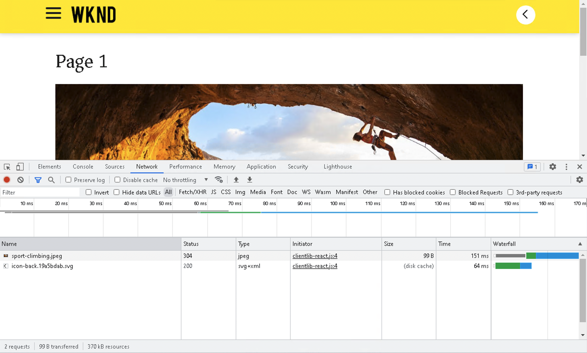

# Introduzione alla SPA e procedura dettagliata {#spa-introduction-and-walkthrough}

Le applicazioni a pagina singola (SPA) possono offrire esperienze coinvolgenti agli utenti di siti web. Gli sviluppatori desiderano essere in grado di creare siti utilizzando framework SPA e gli autori desiderano modificare i contenuti all’interno di AEM per un sito creato utilizzando tali frameworks.

L’editor di SPA offre una soluzione completa per il supporto di SPA in AEM. Questo articolo illustra l’utilizzo di un’applicazione di SPA di base per l’authoring e illustra come si relaziona con l’editor di SPA di AEM sottostante.

>[!NOTE]
>
>L’editor SPA è la soluzione consigliata per i progetti che richiedono un rendering lato client basato sul framework SPA (ad esempio, React o Angular).

## Introduzione {#introduction}

### Obiettivo dell’articolo {#article-objective}

Questo articolo introduce i concetti di base delle SPA prima di guidare il lettore attraverso una procedura dettagliata dell’editor di SPA utilizzando una semplice applicazione SPA per illustrare la modifica dei contenuti di base. Viene quindi descritto come creare la pagina e come l’applicazione SPA si relaziona e interagisce con l’editor di SPA di AEM.

L’obiettivo di questa introduzione e di questa procedura dettagliata è dimostrare a uno sviluppatore AEM perché le SPA sono rilevanti, come funzionano in generale, come una SPA viene gestita dall’editor di SPA AEM e come si differenzia da un’applicazione AEM standard.

## Requisiti {#requirements}

La procedura dettagliata si basa sulle funzionalità di AEM standard e sull’app di esempio del progetto SPA WKND. Per seguire questa procedura dettagliata, è necessario disporre dei seguenti elementi.

* [AEM versione 6.5.4 o successiva](/help/release-notes/release-notes.md)
   * Devi disporre dei diritti di amministratore del sistema.
* [L’app di esempio del progetto SPA WKND disponibile su GitHub](https://github.com/adobe/aem-guides-wknd-spa)
   * Scarica il file [versione più recente dell’app React.](https://github.com/adobe/aem-guides-wknd-spa/releases) Verrà denominato in modo simile a `wknd-spa-react.all.classic-X.Y.Z-SNAPSHOT.zip`.
   * Scarica il file [immagini di esempio più recenti](https://github.com/adobe/aem-guides-wknd-spa/releases) per l’app. Verrà denominato in modo simile a `wknd-spa-sample-images-X.Y.Z.zip`.
   * [Utilizzare Gestione pacchetti](/help/sites-administering/package-manager.md) per installare i pacchetti come faresti con qualsiasi altro pacchetto in AEM.
   * Ai fini della procedura dettagliata, non è necessario installare l’app tramite Maven.

>[!CAUTION]
>
>Questo documento utilizza [App progetto SPA WKND](https://github.com/adobe/aem-guides-wknd-spa) solo a scopo dimostrativo. L’app non deve essere utilizzata per alcun progetto di lavoro.
>
>Qualsiasi progetto AEM dovrebbe sfruttare [Archetipo progetto AEM,](https://experienceleague.adobe.com/docs/experience-manager-core-components/using/developing/archetype/overview.html?lang=it) che supporta i progetti SPA utilizzando React o Angular e sfrutta l’SDK dell’SPA.

### Cos’è una SPA? {#what-is-a-spa}

Un’applicazione a pagina singola (SPA) è diversa da una pagina convenzionale in quanto viene sottoposta a rendering lato client ed è principalmente basata su Javascript, utilizza le chiamate Ajax per caricare i dati e aggiornare dinamicamente la pagina. La maggior parte o tutto il contenuto viene recuperato una volta nel caricamento di una singola pagina con risorse aggiuntive caricate in modo asincrono in base alle esigenze, a seconda dell’interazione dell’utente con la pagina.

Questo riduce la necessità di aggiornare le pagine e offre all’utente un’esperienza caratterizzata da fluidità e rapidità, che si rivela più simile all’esperienza assicurata da un’app nativa.

L’editor AEM di SPA consente agli sviluppatori front-end di creare SPA che possono essere integrate in un sito AEM, permettendo agli autori dei contenuti di modificare il contenuto delle SPA con la stessa facilità con cui sono modificati altri contenuti AEM.

### Perché una SPA? {#why-a-spa}

Essendo più veloce, fluida e più simile a un’applicazione nativa, una SPA diventa un’esperienza molto piacevole non solo per il visitatore della pagina web, ma anche per gli esperti di marketing e gli sviluppatori grazie al tipo di funzionamento delle SPA.

**Visitatori**

* I visitatori desiderano esperienze di tipo nativo quando interagiscono con i contenuti.
* È dimostrato che più veloce sarà una pagina, più probabile sarà una conversione.

**Persone addette al marketing**

* Le persone addette al marketing desiderano offrire esperienze avanzate e di tipo nativo per invitare la clientela a interagire pienamente con i contenuti.
* La personalizzazione può rendere queste esperienze ancora più coinvolgenti.

**Sviluppatori**

* Gli sviluppatori vogliono una netta separazione delle competenze tra contenuti e presentazioni.
* Una separazione pulita rende il sistema più estensibile e consente uno sviluppo front-end indipendente.

### Come funziona una SPA? {#how-does-a-spa-work}

L’idea principale alla base di un SPA è che le chiamate e la dipendenza da un server siano ridotte al fine di ridurre al minimo i ritardi causati dalle chiamate al server in modo che l’SPA si avvicini alla reattività di un’applicazione nativa.

In una pagina web tradizionale sequenziale, vengono caricati solo i dati necessari per la pagina immediata. Questo significa che quando l&#39;utente si sposta su un’altra pagina, il server viene chiamato per le risorse aggiuntive. Potrebbero essere necessarie chiamate aggiuntive quando il visitatore interagisce con gli elementi sulla pagina. Queste chiamate multiple possono dare una sensazione di attesa o ritardo in quanto la pagina deve soddisfare le richieste dell&#39;utente.

Per un’esperienza più fluida, che si avvicina a quella che un visitatore si aspetta da app native per dispositivi mobili, un SPA carica tutti i dati necessari per il visitatore al primo caricamento. Anche se l’operazione inizialmente potrebbe richiedere un po’ più di tempo, elimina la necessità di chiamate server aggiuntive.

Tramite il rendering sul lato client, l’elemento della pagina reagisce più rapidamente e le interazioni con la pagina da parte del visitatore sono immediate. Eventuali dati aggiuntivi necessari vengono chiamati in modo asincrono per massimizzare la velocità della pagina.

>[!NOTE]
>
>Per informazioni tecniche sul funzionamento dell&#39;SPA nell&#39;AEM, consultare l&#39;articolo [Guida introduttiva dell’SPA nell’AEM](/help/sites-developing/spa-getting-started-react.md).
>
>Per un’occhiata più da vicino al design, all’architettura e al flusso di lavoro tecnico dell’editor SPA, consulta l’articolo [Panoramica dell’editor SPA](/help/sites-developing/spa-overview.md).

## Esperienza di modifica dei contenuti con SPA {#content-editing-experience-with-spa}

Quando un SPA viene creato per sfruttare l’Editor SPA dell’AEM, l’autore di contenuto non nota alcuna differenza durante la modifica e la creazione di contenuti. È disponibile una funzionalità AEM comune e non è necessaria alcuna modifica al flusso di lavoro dell’autore.

1. Modifica l’app del progetto SPA WKND in AEM.

   `http://<host>:<port>/editor.html/content/wknd-spa-react/us/en/home.html`

   

1. Seleziona un componente intestazione e osserva che viene visualizzata una barra degli strumenti simile a quella di qualsiasi altro componente. Seleziona **Modifica**.

   

1. Modifica il contenuto come normale in AEM e osserva che le modifiche sono persistenti.

   

   >[!NOTE]
   >
   >Consulta la [Panoramica dell’editor SPA](spa-overview.md#requirements-limitations) per ulteriori informazioni sull’editor di testo locale e sull’SPA.

1. Utilizza il browser Risorse per trascinare una nuova immagine in un componente immagine.

   

1. La modifica viene mantenuta.

   

Sono supportati ulteriori strumenti di authoring, come il trascinamento e il rilascio di componenti aggiuntivi sulla pagina, la ridisposizione dei componenti e la modifica del layout, come in qualsiasi applicazione non SPA.

>[!NOTE]
>
>L’editor di SPA non modifica il DOM dell’applicazione. La stessa SPA è responsabile del DOM.
>
>Per vedere come funziona, continua con la sezione successiva di questo articolo [App SPA ed editor di SPA AEM](#spa-apps-and-the-aem-spa-editor).

## App SPA ed editor di SPA AEM {#spa-apps-and-the-aem-spa-editor}

L&#39;esperienza del comportamento di un SPA per l&#39;utente finale e l&#39;analisi della pagina SPA consentono di comprendere meglio il funzionamento di un&#39;app SAP con l&#39;Editor SPA nell&#39;AEM.

### Utilizzo di un’applicazione SPA {#using-an-spa-application}

1. Carica l’applicazione del progetto SPA WKND sul server di pubblicazione o utilizzando l’opzione **Visualizza come pubblicato** dal menu **Informazioni pagina** nell’editor di pagina.

   `http://<host>:<port>/content/wknd-spa-react/us/en/home.html`

   

   Osserva la struttura delle pagine, inclusa la navigazione alle pagine figlie, al widget meteo e agli articoli.

1. Passa a una pagina figlia utilizzando il menu e controlla che la pagina venga caricata immediatamente senza la necessità di un aggiornamento.

   

1. Apri gli strumenti di sviluppo incorporati del browser e monitora l’attività di rete mentre navighi nelle pagine figlie.

   

   C’è molto poco traffico mentre passi da una pagina all’altra nell’app. La pagina non viene ricaricata e vengono richieste solo le nuove immagini.

   La SPA gestisce il contenuto e il routing interamente sul lato client.

Quindi, se la pagina non viene ricaricata durante la navigazione tra le pagine figlie, come viene caricata?

Nella sezione successiva, [Caricamento di un’applicazione SPA,](#loading-an-spa-application) approfondisce la meccanica di caricamento dell’SPA e come caricare il contenuto in modo sincrono e asincrono.

### Caricamento di un’applicazione SPA {#loading-an-spa-application}

1. Se non è già stata caricata, carica l’app del progetto SPA WKND sul server di pubblicazione o utilizzando l’opzione **Visualizza come pubblicato** dal menu **Informazioni pagina** nell’editor pagina.

   `http://<host>:<port>/content/wknd-spa-react/us/en/home.html`

   

1. Utilizza lo strumento incorporato del browser per visualizzare l’origine della pagina.
1. Il contenuto della sorgente è estremamente limitato.

   * La pagina non ha alcun contenuto all’interno del corpo. È composta principalmente da fogli di stile e da una chiamata a vari script come `clientlib-react.min.js`.
   * Questi script sono i driver primari di questa applicazione e sono responsabili del rendering di tutti i contenuti.

1. Utilizza gli strumenti incorporati del browser per ispezionare la pagina. Visualizza il contenuto del DOM completamente caricato.

   

1. Passa a **Rete** degli strumenti per sviluppatori e ricarica la pagina.

   Le richieste di immagini vengono ignorate. Nota che le risorse principali caricate per la pagina sono la pagina stessa, il CSS, il JavaScript di React, le sue dipendenze e i dati JSON per la pagina.

   

1. Carica il `react.model.json` in una nuova scheda.

   `http://<host>:<port>/content/wknd-spa-react/us/en/home.model.json`

   

   L’editor SPA AEM sfrutta [AEM Content Services](/help/assets/content-fragments/content-fragments.md) per distribuire l’intero contenuto della pagina come un modello JSON.

   Implementando interfacce specifiche, i modelli Sling forniscono le informazioni necessarie alla SPA. La distribuzione dei dati JSON viene delegata verso il basso per ciascun componente (dalla pagina, al paragrafo, al componente, ecc.).

   Ogni componente sceglie cosa espone e come viene renderizzato (lato server con HTL o lato client con React). Questo articolo si concentra sul rendering lato client con React.

1. Il modello può anche raggruppare le pagine in modo che vengano caricate in modo sincrono, riducendo il numero di ricaricamenti di pagina necessari.

   Nell’esempio dell’app del progetto SPA WKND, le pagine `home`, `page-1`, `page-2` e `page-3` vengono caricate in modo sincrono, in quanto le persone solitamente visitano tutte le pagine.

   Questo comportamento non è obbligatorio ed è completamente definibile.

   

1. Per visualizzare questa differenza di comportamento, ricarica la pagina e cancella l’attività di rete degli strumenti per sviluppatori. Passa a `page-1` nel menu della pagina e osserva che l’unica attività di rete è una richiesta dell’immagine di `page-1`. Non è necessario caricare `page-1`.

   

### Interazione con l’editor SPA {#interaction-with-the-spa-editor}

Utilizzando l’applicazione di esempio del progetto SPA WKND, è chiaro come l’app si comporta e viene caricata quando viene pubblicata, utilizzando i servizi di contenuto per la distribuzione di contenuti JSON e il caricamento asincrono delle risorse.

Inoltre, per l’autore dei contenuti, la creazione di contenuti tramite un editor SPA è semplice all’interno di AEM.

Nella sezione seguente esploreremo il contratto che consente all’editor di SPA di relazionare i componenti all’interno della SPA con i componenti AEM e ottenere questa esperienza di editing perfetta.

1. Caricare l’applicazione del progetto SPA WKND nell’editor e passare alla modalità **Anteprima**.

   `http://<host>:<port>/editor.html/content/wknd-spa-react/us/en/home.html`

1. Utilizzando gli strumenti di sviluppo incorporati nel browser, esaminare il contenuto della pagina. Con lo strumento di selezione, selezionare un componente modificabile nella pagina e visualizzare i dettagli dell’elemento.

   Tieni presente che il componente ha un nuovo attributo dati `data-cq-data-path`.

   

   Per esempio

   `data-cq-data-path="/content/wknd-spa-react/us/en/home/jcr:content/root/responsivegrid/text`

   Questo percorso consente il recupero e l’associazione dell’oggetto di modifica del contesto di configurazione di ciascun componente.

   Questo è l’unico attributo di markup necessario affinché l’editor riconosca questo come componente modificabile all’interno della SPA. In base a questo attributo, l’editor di SPA determinerà quale configurazione modificabile è associata al componente in modo che il corretto frame, la corretta barra degli strumenti ecc. siano caricati.

   Vengono inoltre aggiunti alcuni nomi di classe specifici per contrassegnare i segnaposto e per la funzionalità di trascinamento della risorsa.

   >[!NOTE]
   >
   >Si tratta di un cambiamento di comportamento rispetto alle pagine sottoposte a rendering lato server in AEM, in cui è presente `cq` per ciascun componente modificabile.
   >
   >
   >Questo approccio nell’SPA elimina la necessità di inserire elementi personalizzati, basandosi solo su un attributo di dati aggiuntivo, rendendo il markup più semplice per lo sviluppatore front-end.

## Passaggi successivi {#next-steps}

Ora che è chiara l’esperienza di modifica SPA in AEM e come una SPA si relaziona con l’editor di SPA, approfondisci ulteriormente il modo in cui viene creata una SPA.

* [Guida introduttiva dell’SPA nell’AEM](/help/sites-developing/spa-getting-started-react.md) mostra come viene creato un SPA di base per funzionare con l’Editor SPA nell’AEM
* La [Panoramica dell’editor di SPA](/help/sites-developing/spa-overview.md) approfondisce il modello di comunicazione tra AEM e SPA.
* [Sviluppo di SPA per AEM](/help/sites-developing/spa-architecture.md) descrive come coinvolgere gli sviluppatori front-end nello sviluppo di una SPA per AEM e come le SPA interagiscono con l’architettura di AEM.
