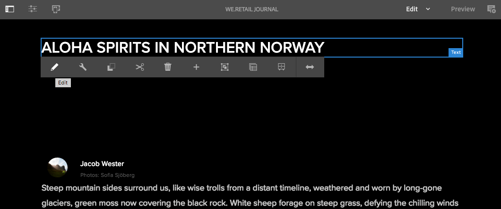
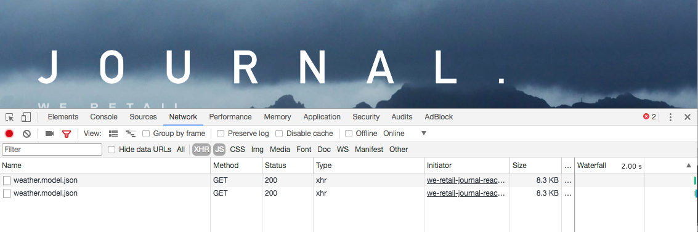

# Introduzione SPA e Procedura dettagliata{#spa-introduction-and-walkthrough}

Le applicazioni a pagina singola (SPA) possono offrire esperienze coinvolgenti agli utenti di siti Web. Gli sviluppatori desiderano essere in grado di creare siti utilizzando SPA framework e gli autori desiderano modificare i contenuti all&#39;interno di AEM per un sito creato utilizzando tali framework.

SPA Editor offre una soluzione completa per SPA di supporto in AEM. Questo articolo descrive l’utilizzo di un’applicazione SPA di base per l’authoring e mostra come si collega all’editor SPA AEM sottostante.

>[!NOTE]
>
>SPA Editor è la soluzione consigliata per i progetti che richiedono SPA rendering lato client basato su framework (ad es. React o Angular).

## Introduzione {#introduction}

### Articolo Obiettivo {#article-objective}

In questo articolo vengono introdotti i concetti di base di SPA prima di guidare il lettore attraverso una procedura dettagliata dell&#39;editor SPA, utilizzando una semplice applicazione SPA per illustrare la modifica di base dei contenuti. Viene quindi descritto come creare la pagina e come l’applicazione SPA si collega e interagisce con l’editor SPA AEM.

L&#39;obiettivo di questa introduzione e di questa procedura dettagliata è dimostrare a uno sviluppatore AEM perché SPA rilevanti, come funzionano in generale, come un SPA viene gestito dall&#39;Editor SPA AEM e come è diverso da un&#39;applicazione AEM standard.

La procedura dettagliata si basa sulla funzionalità standard AEM e sull&#39;app di esempio We.Retail Journal. Devono essere soddisfatti i seguenti requisiti:

* [AEM versione 6.4 con service pack 2 o successiva](/help/release-notes/sp-release-notes.md)
* [Installa l&#39;app di esempio We.Retail Journal disponibile su GitHub qui.](https://github.com/Adobe-Marketing-Cloud/aem-sample-we-retail-journal)

>[!CAUTION]
>
>Questo documento utilizza l&#39;app [We.Retail Journal](https://github.com/Adobe-Marketing-Cloud/aem-sample-we-retail-journal) solo a scopo dimostrativo. Non deve essere utilizzato per nessun progetto.
>
>Qualsiasi progetto AEM deve sfruttare il [AEM Project Archetype](https://docs.adobe.com/content/help/it-IT/experience-manager-core-components/using/developing/archetype/overview.html), che supporta SPA progetti utilizzando React o Angular e sfrutta l&#39;SDK SPA.

### Cos&#39;è un SPA? {#what-is-a-spa}

Un’applicazione a pagina singola (SPA) è diversa da una pagina tradizionale in quanto viene sottoposta a rendering sul lato client ed è principalmente guidata da Javascript, basandosi sulle chiamate Ajax per caricare i dati e aggiornare dinamicamente la pagina. La maggior parte o tutto il contenuto viene recuperato una volta in un singolo caricamento di pagina con risorse aggiuntive caricate in modo asincrono in base alle esigenze, in base all&#39;interazione dell&#39;utente con la pagina.

Questo riduce la necessità di aggiornare le pagine e offre all&#39;utente un&#39;esperienza semplice, rapida e più simile a un&#39;esperienza app nativa.

AEM SPA Editor consente agli sviluppatori front-end di creare SPA che possono essere integrati in un sito AEM, consentendo agli autori dei contenuti di modificare i contenuti SPA con la stessa facilità con cui si trovano altri contenuti AEM.

### Perché un SPA? {#why-a-spa}

Essendo più veloce, fluido e simile a un&#39;applicazione nativa, un SPA diventa un&#39;esperienza molto interessante non solo per il visitatore della pagina Web, ma anche per gli esperti di marketing e gli sviluppatori a causa della natura del funzionamento SPA.


**Visitatori**

* I visitatori desiderano esperienze simili a quelle native quando interagiscono con i contenuti.
* Esistono dati chiari che più veloce sarà una pagina, più probabile sarà una conversione.

**Marketing**

* Gli esperti di marketing desiderano offrire esperienze ricche e native per consentire ai visitatori di interagire pienamente con i contenuti.
* La personalizzazione può rendere queste esperienze ancora più coinvolgenti.

**Sviluppatori**

* Gli sviluppatori desiderano una netta separazione tra contenuti e presentazioni.
* La separazione pulita rende il sistema più estensibile e consente uno sviluppo front-end indipendente.

### Come funziona un SPA? {#how-does-a-spa-work}

L&#39;idea principale alla base di un SPA è che le chiamate e la dipendenza da un server vengono ridotte al fine di ridurre al minimo i ritardi causati dalle chiamate server in modo che il SPA si avvicini alla reattività di un&#39;applicazione nativa.

In una pagina Web sequenziale tradizionale, vengono caricati solo i dati necessari per la pagina immediata. Questo significa che quando il visitatore si sposta in un’altra pagina, il server viene chiamato per le risorse aggiuntive. Potrebbero essere necessarie ulteriori chiamate quando il visitatore interagisce con gli elementi sulla pagina. Queste chiamate multiple possono dare un senso di ritardo o ritardo, in quanto la pagina deve essere in grado di soddisfare le richieste del visitatore.


Per un&#39;esperienza più fluida, che si avvicina alle aspettative di un visitatore dalle app mobili e native, un SPA carica tutti i dati necessari per il visitatore al primo caricamento. Anche se inizialmente l&#39;operazione potrebbe richiedere un po&#39; più di tempo, elimina la necessità di ulteriori chiamate server.

Rendering sul lato client, l’elemento di pagina reagisce più rapidamente e le interazioni con la pagina da parte del visitatore sono immediate. Eventuali dati aggiuntivi che potrebbero essere necessari vengono denominati in modo asincrono per massimizzare la velocità della pagina.

>[!NOTE]
>
>Per informazioni tecniche sul funzionamento SPA in AEM, vedere l&#39;articolo [Guida introduttiva a SPA in AEM](/help/sites-developing/spa-getting-started-react.md).
>
>Per un&#39;occhiata più dettagliata alla progettazione, all&#39;architettura e al flusso di lavoro tecnico dell&#39;Editor SPA, consultate l&#39;articolo [SPA Panoramica dell&#39;Editor](/help/sites-developing/spa-overview.md).

## Esperienza di modifica dei contenuti con SPA {#content-editing-experience-with-spa}

Quando un SPA è creato per sfruttare l&#39;editor SPA AEM, l&#39;autore del contenuto non nota alcuna differenza quando si modifica e si crea contenuto. È disponibile una funzionalità AEM comune e non sono necessarie modifiche al flusso di lavoro dell’autore.

>[!NOTE]
>
>La procedura dettagliata si basa sulla funzionalità standard AEM e sull&#39;app di esempio We.Retail Journal. Devono essere soddisfatti i seguenti requisiti:
>
>* [AEM versione 6.4 con service pack 2](/help/release-notes/sp-release-notes.md)
>* [Installa l&#39;app di esempio We.Retail Journal disponibile su GitHub qui.](https://github.com/Adobe-Marketing-Cloud/aem-sample-we-retail-journal)

>


1. Modificate l&#39;app We.Retail Journal in AEM.

   `https://localhost:4502/editor.html/content/we-retail-journal/react.html`

   

1. Selezionate un componente di intestazione e osservate che la barra degli strumenti è simile a quella di qualsiasi altro componente. Seleziona **Modifica**.

   

1. Modificate il contenuto come normale all’interno AEM e tenete presente che le modifiche sono persistenti.

   

   >[!NOTE]
   >Per ulteriori informazioni sull&#39;editor di testo e sui SPA, vedere la sezione [Panoramica sull&#39;editor SPA](spa-overview.md#requirements-limitations).

1. Usate il Browser risorse per trascinare una nuova immagine in un componente immagine.

   

1. La modifica è persistente.

   

Sono supportati ulteriori strumenti di authoring, come il trascinamento di componenti aggiuntivi sulla pagina, la ridisposizione dei componenti e la modifica del layout, come in qualsiasi applicazione non SPA.

>[!NOTE]
>
>L&#39;Editor SPA non modifica il DOM dell&#39;applicazione. Il SPA stesso è responsabile del DOM.
>
>Per vedere come funziona, andate alla sezione successiva di questo articolo [SPA App e all&#39;editor SPA AEM](/help/sites-developing/spa-walkthrough.md#spa-apps-and-the-aem-spa-editor).

## SPA App e l&#39;editor SPA AEM {#spa-apps-and-the-aem-spa-editor}

L&#39;esperienza di come un SPA si comporta per l&#39;utente finale e quindi l&#39;analisi della pagina SPA aiuta a comprendere meglio come funziona un&#39;app SAP con l&#39;Editor SPA in AEM.

### Utilizzo di un&#39;applicazione SPA {#using-an-spa-application}

1. Caricate l&#39;applicazione We.Retail Journal sul server di pubblicazione o utilizzando l&#39;opzione **Visualizza come pubblicato** dal menu **Informazioni pagina** nell&#39;editor pagina.

   `/content/we-retail-journal/react.html`

   

   Prendete nota della struttura delle pagine, inclusa la navigazione verso pagine figlie, widget meteo e articoli.

1. Passa a una pagina figlia utilizzando il menu e verifica che la pagina venga caricata immediatamente senza che sia necessario effettuare un aggiornamento.

   

1. Aprite gli strumenti di sviluppo integrati del browser e monitorate l&#39;attività di rete mentre vi spostate nelle pagine figlie.

   

   Il traffico si riduce notevolmente quando si passa da una pagina all&#39;altra nell&#39;app. La pagina non viene ricaricata e vengono richieste solo le nuove immagini.

   Il SPA gestisce il contenuto e il routing interamente sul lato client.

Quindi, se la pagina non viene ricaricata durante la navigazione tra le pagine figlie, come viene caricata?

La sezione successiva, [Caricamento di un&#39;applicazione SPA](/help/sites-developing/spa-walkthrough.md#loading-an-spa-application), approfondisce la procedura di caricamento del SPA e spiega come caricare il contenuto in modo sincrono e asincrono.

### Caricamento di un&#39;applicazione SPA {#loading-an-spa-application}

1. Se non è già stato caricato, caricate l&#39;applicazione We.Retail Journal sul server di pubblicazione o utilizzando l&#39;opzione **Visualizza come pubblicato** dal menu **Informazioni pagina** nell&#39;editor pagina.

   `/content/we-retail-journal/react.html`

   

1. Utilizzate lo strumento incorporato del browser per visualizzare l’origine della pagina.
1. Il contenuto dell&#39;origine è estremamente limitato.

   ```
   <!DOCTYPE HTML>
   <html lang="en-CH">
       <head>
       <meta charset="UTF-8">
       <title>We.Retail Journal</title>
   
       <meta name="template" content="we-retail-react-template"/>
   
   <link rel="stylesheet" href="/etc.clientlibs/we-retail-journal/react/clientlibs/we-retail-journal-react.css" type="text/css">
   
   <link rel="stylesheet" href="/libs/wcm/foundation/components/page/responsive.css" type="text/css">
   
   </head>
       <body class="page basicpage">
   
   <div id="page"></div>
   
   <script type="text/javascript" src="/etc.clientlibs/we-retail-journal/react/clientlibs/we-retail-journal-react.js"></script>
   
       </body>
   </html>
   ```

   La pagina non ha alcun contenuto all’interno del suo corpo. È costituito principalmente da fogli di stile e da una chiamata a uno script React, `we-retail-journal-react.js`.

   Questo script React è il driver principale di questa applicazione ed è responsabile del rendering di tutto il contenuto.

1. Utilizzate gli strumenti integrati del browser per ispezionare la pagina. Visualizzare il contenuto del DOM completamente caricato.

   

1. Passate alla scheda Rete in Ispettore e ricaricate la pagina.

   Ignorando le richieste di immagini, tenete presente che le risorse principali caricate per la pagina sono la pagina stessa, CSS, il JavaScript React, le sue dipendenze e i dati JSON per la pagina.

   

1. Caricate la `react.model.json` in una nuova scheda.

   `/content/we-retail-journal/react.model.json`

   

   L&#39;editor SPA AEM utilizza [AEM Content Services](/help/assets/content-fragments/content-fragments.md) per distribuire l&#39;intero contenuto della pagina come modello JSON.

   Implementando interfacce specifiche, Sling Models fornisce le informazioni necessarie al SPA. La consegna dei dati JSON viene delegata verso il basso a ciascun componente (dalla pagina al paragrafo, al componente, ecc.).

   Ciascun componente sceglie le funzioni esposte e di rendering (lato server con HTL o lato client con React). Naturalmente questo articolo si concentra sul rendering lato client con React.

1. Il modello può anche raggruppare le pagine in modo che vengano caricate in modo sincrono, riducendo il numero di ricariche di pagina necessarie.

   Nell&#39;esempio di We.Retail Journal, le pagine `home`, `blog` e `aboutus` vengono caricate in modo sincrono, dal momento che i visitatori visitano comunemente tutte queste pagine. Tuttavia, la pagina `weather` viene caricata in modo asincrono, poiché i visitatori hanno meno probabilità di visitarla.

   Questo comportamento non è obbligatorio ed è completamente definibile.

   

1. Per visualizzare questa differenza di comportamento, ricaricare la pagina e cancellare l&#39;attività di rete della finestra di ispezione. Nel menu della pagina, andate al blog e alle pagine su di noi e scoprite che non è stata segnalata alcuna attività di rete.

   Passate alla pagina meteo e verificate che la `weather.model.json` sia denominata in modo asincrono.

   

### Interazione con l&#39;editor SPA {#interaction-with-the-spa-editor}

Utilizzando l&#39;applicazione di esempio We.Retail Journal, è chiaro come l&#39;app si comporta e viene caricata quando viene pubblicata, sfruttando i servizi di contenuto per la distribuzione dei contenuti JSON e il caricamento asincrono delle risorse.

Inoltre, per l&#39;autore del contenuto, la creazione di contenuto tramite un editor SPA è perfettamente all&#39;interno di AEM.

Nella sezione seguente verrà illustrato il contratto che consente all’editor SPA di correlare i componenti all’interno del SPA a AEM componenti e di ottenere questa esperienza di modifica senza soluzione di continuità.

1. Caricate l&#39;applicazione We.Retail Journal nell&#39;editor e passate alla modalità **Preview**.

   `https://localhost:4502/editor.html/content/we-retail-journal/react.html`

1. Utilizzando gli strumenti di sviluppo incorporati del browser, controllate il contenuto della pagina. Con lo strumento selezione, selezionate un componente modificabile sulla pagina e visualizzate il dettaglio dell’elemento.

   Il componente ha un nuovo attributo di dati `data-cq-data-path`.

   

   Esempio

   `data-cq-data-path="root/responsivegrid/paragraph_1`

   Questi percorsi consentono il recupero e l&#39;associazione dell&#39;oggetto di configurazione del contesto di modifica di ciascun componente.

   Questo è l&#39;unico attributo di markup richiesto all&#39;editor per riconoscere questo come componente modificabile all&#39;interno del SPA. In base a questo attributo, l’Editor SPA determinerà quale configurazione modificabile è associata al componente, in modo che il frame, la barra degli strumenti e così via siano corretti. è caricato.

   Alcuni nomi di classe specifici vengono aggiunti anche per i segnaposto di marketing e per la funzionalità di trascinamento della risorsa.

   >[!NOTE]
   >
   >Si tratta di una modifica nel comportamento delle pagine sottoposte a rendering sul lato server in AEM, dove è inserito un elemento `cq` per ciascun componente modificabile.
   >
   >
   >Questo approccio in SPA elimina la necessità di inserire elementi personalizzati, basandosi solo su un attributo di dati aggiuntivo, semplificando il markup per lo sviluppatore frontend.

## Passaggi successivi {#next-steps}

Ora che avete compreso l&#39;esperienza di modifica SPA in AEM e come un SPA si collega all&#39;Editor SPA, approfondisci la conoscenza di come un SPA è costruito.

* [Guida introduttiva alle SPA in ](/help/sites-developing/spa-getting-started-react.md) AEMmostra come viene creata una SPA di base per l’utilizzo dell’Editor SPA in AEM
* [SPA Editor ](/help/sites-developing/spa-overview.md) Overviewfinder approfondisce il modello di comunicazione tra AEM e SPA.
* [Lo sviluppo di SPA per ](/help/sites-developing/spa-architecture.md) AEM descrive come coinvolgere gli sviluppatori front-end nello sviluppo di un SPA per AEM e come SPA interagire con AEM architettura.
