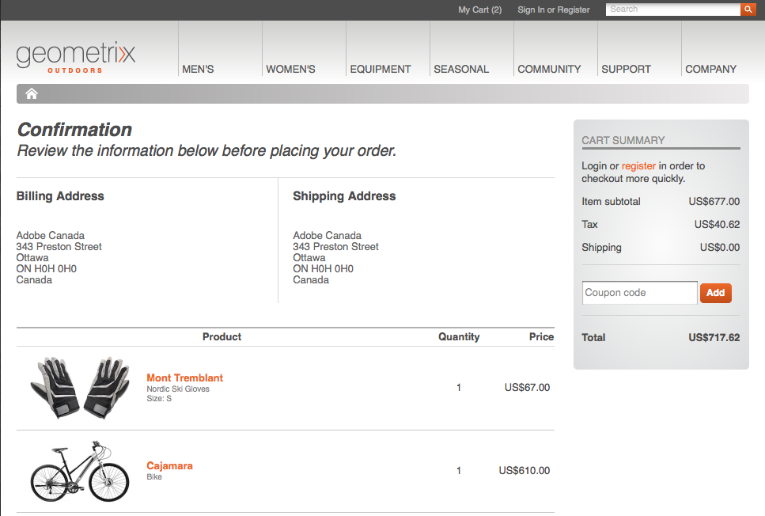

# Sviluppo per contenuti mirati{#developing-for-targeted-content}

In questa sezione vengono descritti gli argomenti sullo sviluppo di componenti da utilizzare con il targeting dei contenuti.

* Per informazioni sulla connessione con  Adobe Target, vedere [Integrazione con  Adobe Target](/help/sites-administering/target.md).
* Per informazioni sulla creazione di contenuti mirati, consultate [Creazione di contenuti mirati con la modalità di targeting](/help/sites-authoring/content-targeting-touch.md).

>[!NOTE]
>
>Quando eseguite il targeting di un componente in AEM autore, il componente effettua una serie di chiamate lato server  Adobe Target per registrare la campagna, impostare le offerte e recuperare  segmenti Adobe Target (se configurato). Nessuna chiamata lato server viene effettuata da AEM pubblicazione a  Adobe Target.

## Abilitazione del targeting con  Adobe Target sulle pagine {#enabling-targeting-with-adobe-target-on-your-pages}

Per utilizzare nelle pagine componenti mirati che interagiscono con  Adobe Target, includete nell&#39;elemento &lt;head> un codice lato client specifico.

### Sezione intestazione {#the-head-section}

Aggiungete entrambi i seguenti blocchi di codice alla sezione &lt;head> della pagina:

```xml
<!--/* Include Context Hub */-->
<sly data-sly-resource="${'contexthub' @ resourceType='granite/contexthub/components/contexthub'}"/>
```

```xml
<cq:include script="/libs/cq/cloudserviceconfigs/components/servicelibs/servicelibs.jsp"/>
```

Questo codice aggiunge gli oggetti JavaScript di analisi richiesti e carica le librerie dei servizi cloud associate al sito Web. Per il servizio Target, le librerie vengono caricate tramite `/libs/cq/analytics/components/testandtarget/headlibs.jsp`

Il set di librerie caricato dipende dal tipo di libreria client di destinazione (mbox.js o at.js) utilizzato nella configurazione di Target:

**Per mbox.js predefinito**

```
<script type="text/javascript" src="/libs/cq/foundation/testandtarget/parameters.js"></script>
 <script type="text/javascript" src="/libs/cq/foundation/testandtarget/mbox.js"></script>
 <script type="text/javascript" src="/libs/cq/foundation/personalization/integrations/commons.js"></script>
 <script type="text/javascript" src="/libs/cq/foundation/testandtarget/util.js"></script>
 <script type="text/javascript" src="/libs/cq/foundation/testandtarget/init.js"></script>
```

**Per mbox.js personalizzato**

```
<script type="text/javascript" src="/etc/cloudservices/testandtarget/<CLIENT-CODE>/_jcr_content/public/mbox.js"></script>
        <script type="text/javascript" src="/libs/cq/foundation/testandtarget/parameters.js"></script>
 <script type="text/javascript" src="/libs/cq/foundation/personalization/integrations/commons.js"></script>
 <script type="text/javascript" src="/libs/cq/foundation/testandtarget/util.js"></script>
 <script type="text/javascript" src="/libs/cq/foundation/testandtarget/init.js"></script>
```

**For at.js**

```
<script type="text/javascript" src="/libs/cq/foundation/testandtarget/parameters.js"></script>
 <script type="text/javascript" src="/libs/cq/foundation/testandtarget/atjs-integration.js"></script>
 <script type="text/javascript" src="/libs/cq/foundation/testandtarget/atjs.js"></script>
```

>[!NOTE]
>
>È supportata solo la versione di `at.js` fornita con il prodotto. La versione di `at.js` spedita con il prodotto può essere ottenuta esaminando il file `at.js` sul posto:
>
>**/libs/cq/testandtarget/clientlibs/testandtarget/atjs/source/at.js**.

**Per l&#39;app personalizzata at.js**

```
<script type="text/javascript" src="/etc/cloudservices/testandtarget/<CLIENT-CODE>/_jcr_content/public/at.js"></script>
    <script type="text/javascript" src="/libs/cq/foundation/testandtarget/parameters.js"></script>
 <script type="text/javascript" src="/libs/cq/foundation/testandtarget/atjs-integration.js"></script>
```

La funzionalità Target sul lato client è gestita dall&#39;oggetto `CQ_Analytics.TestTarget`. Di conseguenza, la pagina conterrà del codice init, ad esempio nell’esempio seguente:

```
<script type="text/javascript">
            if ( !window.CQ_Analytics ) {
                window.CQ_Analytics = {};
            }
            if ( !CQ_Analytics.TestTarget ) {
                CQ_Analytics.TestTarget = {};
            }
            CQ_Analytics.TestTarget.clientCode = 'my_client_code';
        </script>
      ...

    <div class="cloudservice testandtarget">
  <script type="text/javascript">
  CQ_Analytics.TestTarget.maxProfileParams = 11;

  if (CQ_Analytics.CCM) {
   if (CQ_Analytics.CCM.areStoresInitialized) {
    CQ_Analytics.TestTarget.registerMboxUpdateCalls();
   } else {
    CQ_Analytics.CCM.addListener("storesinitialize", function (e) {
     CQ_Analytics.TestTarget.registerMboxUpdateCalls();
    });
   }
  } else {
   // client context not there, still register calls
   CQ_Analytics.TestTarget.registerMboxUpdateCalls();
  }
  </script>
 </div>
```

JSP aggiunge gli oggetti JavaScript di analisi richiesti e i riferimenti alle librerie javascript lato client. Il file testandtarget.js contiene le funzioni mbox.js. L&#39;HTML generato dallo script è simile al seguente esempio:

```xml
<script type="text/javascript">
        if ( !window.CQ_Analytics ) {
            window.CQ_Analytics = {};
        }
        if ( !CQ_Analytics.TestTarget ) {
            CQ_Analytics.TestTarget = {};
        }
        CQ_Analytics.TestTarget.clientCode = 'MyClientCode';
</script>
<link rel="stylesheet" href="/etc/clientlibs/foundation/testandtarget/testandtarget.css" type="text/css">
<script type="text/javascript" src="/etc/clientlibs/foundation/testandtarget/testandtarget.js"></script>
<script type="text/javascript" src="/etc/clientlibs/foundation/testandtarget/init.js"></script>
```

#### Sezione corpo (start) {#the-body-section-start}

Aggiungete il codice seguente immediatamente dopo il tag &lt;body> per aggiungere alla pagina le funzioni del contesto client:

```xml
<cq:include path="clientcontext" resourceType="cq/personalization/components/clientcontext"/>
```

#### Sezione corpo (fine) {#the-body-section-end}

Aggiungete il codice seguente immediatamente prima del tag finale &lt;/body>:

```xml
<cq:include path="cloudservices" resourceType="cq/cloudserviceconfigs/components/servicecomponents"/>
```

Lo script JSP di questo componente genera chiamate all&#39;API JavaScript di Target e implementa altre configurazioni richieste. L&#39;HTML generato dallo script è simile al seguente esempio:

```xml
<div class="servicecomponents cloudservices">
  <div class="cloudservice testandtarget">
    <script type="text/javascript">
      CQ_Analytics.TestTarget.maxProfileParams = 11;
      CQ_Analytics.CCM.addListener("storesinitialize", function(e) {
        CQ_Analytics.TestTarget.registerMboxUpdateCalls();
      });
    </script>
    <div id="cq-analytics-texthint" style="background:white; padding:0 10px; display:none;">
      <h3 class="cq-texthint-placeholder">Component clientcontext is missing or misplaced.</h3>
    </div>
    <script type="text/javascript">
      $CQ(function(){
      if( CQ_Analytics &&
          CQ_Analytics.ClientContextMgr &&
          !CQ_Analytics.ClientContextMgr.isConfigLoaded )
        {
          $CQ("#cq-analytics-texthint").show();
        }
      });
    </script>
  </div>
</div>
```

### Utilizzo di un file libreria di Target personalizzato {#using-a-custom-target-library-file}

>[!NOTE]
>
>Se non utilizzi DTM o un altro sistema di marketing di destinazione, puoi utilizzare file libreria di destinazione personalizzati.

>[!NOTE]
>
>Per impostazione predefinita, le mbox sono nascoste; questo comportamento è determinato dalla classe mboxDefault. Nascondere le mbox assicura che i visitatori non vedano il contenuto predefinito prima che venga scambiato; tuttavia, nascondere le mbox influisce sulle prestazioni percepite.

Il file mbox.js predefinito utilizzato per creare mbox si trova in /etc/clientlibs/foundation/testandtarget/mbox/source/mbox.js. Per utilizzare un file mbox.js del cliente, aggiungete il file alla configurazione cloud di Target. Per aggiungere il file, il file mbox.js deve essere disponibile nel file system.

Ad esempio, per utilizzare il [servizio ID Marketing Cloud](https://docs.adobe.com/content/help/en/id-service/using/home.html), è necessario scaricare mbox.js in modo che contenga il valore corretto per la variabile `imsOrgID`, basata sul tenant. Questa variabile è necessaria per l’integrazione con il servizio ID Marketing Cloud. Per informazioni, vedere [ Adobe Analytics come origine di reporting per  Adobe Target](https://docs.adobe.com/content/help/en/target/using/integrate/a4t/a4t.html) e [Prima di implementare](https://docs.adobe.com/content/help/en/target/using/integrate/a4t/before-implement.html).

>[!NOTE]
>
>Se una mbox personalizzata è definita in una configurazione Target, tutti devono disporre dell&#39;accesso in lettura a **/etc/cloudservices** sui server di pubblicazione. Senza questo accesso, il caricamento di file mbox.js sul sito Web di pubblicazione genera un errore 404.

1. Passare alla pagina CQ **Strumenti** e selezionare **Cloud Services**. ([https://localhost:4502/libs/cq/core/content/tools/cloudservices.html](https://localhost:4502/libs/cq/core/content/tools/cloudservices.html))
1. Nella struttura ad albero, selezionate  Adobe Target e, nell&#39;elenco delle configurazioni, fate doppio clic sulla configurazione di Target.
1. Nella pagina di configurazione, fate clic su Modifica.
1. Per la proprietà Custom mbox.js, fate clic su Sfoglia e selezionate il file.
1. Per applicare le modifiche, immettete la password per il vostro account Adobe Target , fate clic su Ricollega a Target e fate clic su OK quando la connessione ha esito positivo. Fare clic su OK nella finestra di dialogo Modifica componente.

La configurazione di Target include un file mbox.js personalizzato, [il codice richiesto nella sezione head](/help/sites-developing/target.md#p-the-head-section-p) della pagina aggiunge il file al framework della libreria client invece di un riferimento alla libreria testandtarget.js.

## Disattivazione del comando Target per i componenti {#disabling-the-target-command-for-components}

La maggior parte dei componenti può essere convertita in componenti con targeting utilizzando il comando Target nel menu di scelta rapida.


Per rimuovere il comando Target dal menu di scelta rapida, aggiungi la seguente proprietà al nodo cq:editConfig del componente:

* Nome: cq:disableTargeting
* Tipo: booleano
* Valore: True

Ad esempio, per disabilitare il targeting per i componenti titolo delle pagine del sito demo di Geometrixx, aggiungere la proprietà al nodo /apps/geometrixx/components/title/cq:editConfig.


## Invio delle informazioni di conferma dell&#39;ordine a  Adobe Target {#sending-order-confirmation-information-to-adobe-target}

>[!NOTE]
>
>Se non usi Gestione dinamica dei tag, invia la conferma dell&#39;ordine a  Adobe Target.

Per tenere traccia delle prestazioni del sito Web, inviate le informazioni di acquisto dalla pagina di conferma dell&#39;ordine a  Adobe Target. (vedere [Creare una mbox orderConfirmPage](https://docs.adobe.com/content/help/en/dtm/implementing/target/configure-target/mboxes/order-confirmation-mbox.html) nella documentazione Adobe Target .)  Adobe Target riconosce i dati mbox come dati di conferma dell&#39;ordine quando il nome MBox è `orderConfirmPage` e utilizza i seguenti nomi di parametro specifici:

* productPurchasedId: Elenco di ID che identificano i prodotti acquistati.
* orderId: ID dell’ordine.
* orderTotal: L&#39;importo totale dell&#39;acquisto.

Il codice nella pagina HTML di cui è stato eseguito il rendering che crea la mbox è simile al seguente esempio:

```xml
<script type="text/javascript">
     mboxCreate('orderConfirmPage',
     'productPurchasedId=product1 product2 product3',
     'orderId=order1234',
     'orderTotal=24.54');
</script>
```

I valori di ciascun parametro sono diversi per ciascun ordine. Pertanto, è necessario un componente che generi il codice in base alle proprietà dell&#39;acquisto. CQ [eCommerce Integration Framework](/help/sites-administering/ecommerce.md) consente di integrarsi nel catalogo dei prodotti e di implementare un carrello e una pagina di estrazione.

L’esempio di Geometrixx Outdoors mostra la seguente pagina di conferma quando un visitatore acquista prodotti:



Il codice seguente per lo script JSP di un componente accede alle proprietà del carrello e quindi stampa il codice per la creazione della mbox.

```java
<%--

  confirmationmbox component.

--%><%
%><%@include file="/libs/foundation/global.jsp"%><%
%><%@page session="false"
          import="com.adobe.cq.commerce.api.CommerceService,
                  com.adobe.cq.commerce.api.CommerceSession,
                  com.adobe.cq.commerce.common.PriceFilter,
                  com.adobe.cq.commerce.api.Product,
                  java.util.List, java.util.Iterator"%><%

/* obtain the CommerceSession object */
CommerceService commerceservice = resource.adaptTo(CommerceService.class);
CommerceSession session = commerceservice.login(slingRequest, slingResponse);

/* obtain the cart items */
List<CommerceSession.CartEntry> entries = session.getCartEntries();
Iterator<CommerceSession.CartEntry> cartiterator = entries.iterator();

/* iterate the items and get the product IDs */
String productIDs = new String();
while(cartiterator.hasNext()){
 CommerceSession.CartEntry entry = cartiterator.next();
 productIDs = productIDs + entry.getProduct().getSKU();
    if (cartiterator.hasNext()) productIDs = productIDs + ", ";
}

/* get the cart price and orderID */
String total = session.getCartPrice(new PriceFilter("CART", "PRE_TAX"));
String orderID = session.getOrderId();

%><div class="mboxDefault"></div>
<script type="text/javascript">
     mboxCreate('orderConfirmPage',
     'productPurchasedId=<%= productIDs %>',
     'orderId=<%= orderID %>',
     'orderTotal=<%= total %>');
</script>
```

Quando il componente viene incluso nella pagina di estrazione dell&#39;esempio precedente, l&#39;origine pagina include lo script seguente che crea la mbox:

```
<div class="mboxDefault"></div>
<script type="text/javascript">

     mboxCreate('orderConfirmPage',
     'productPurchasedId=47638-S, 46587',
     'orderId=d03cb015-c30f-4bae-ab12-1d62b4d105ca',
     'orderTotal=US$677.00');

</script>
```

## Informazioni sul componente di destinazione {#understanding-the-target-component}

Il componente Target consente agli autori di creare mbox dinamiche dai componenti di contenuto CQ. (Vedere [Targeting dei contenuti](/help/sites-authoring/content-targeting-touch.md).) Il componente Target si trova in /libs/cq/personalization/components/target.

Lo script target.jsp accede alle proprietà della pagina per determinare il motore di targeting da utilizzare per il componente, quindi esegue lo script appropriato:

*  Adobe Target: /libs/cq/personalization/components/target/engine_tnt.jsp
* [ Adobe Target con AT.JS](/help/sites-administering/target.md): /libs/cq/personalization/components/target/engine_atjs.jsp
* [ Adobe Campaign](/help/sites-authoring/target-adobe-campaign.md): /libs/cq/personalization/components/target/engine_cq_campaign.jsp
* Regole lato client/ContextHub: /libs/cq/personalization/components/target/engine_cq.jsp

### Creazione di mbox {#the-creation-of-mboxes}

>[!NOTE]
>
>Per impostazione predefinita, le mbox sono nascoste; questo comportamento è determinato dalla classe mboxDefault. Nascondere le mbox assicura che i visitatori non vedano il contenuto predefinito prima che venga scambiato; tuttavia, nascondere le mbox influisce sulle prestazioni percepite.

Quando  Adobe Target esegue il targeting del contenuto, lo script Engine_tnt.jsp crea mbox che contengono il contenuto dell&#39;esperienza di destinazione:

* Aggiunge un elemento `div` con la classe `mboxDefault`, come richiesto dall&#39;API Adobe Target .

* Aggiunge il contenuto mbox (il contenuto dell&#39;esperienza di targeting) all&#39;interno dell&#39;elemento `div`.

Dopo l&#39;elemento div `mboxDefault`, viene inserito il codice javascript che crea la mbox:

* Il nome, l’ID e la posizione della mbox si basano sul percorso dell’archivio del componente.
* Lo script ottiene i nomi e i valori dei parametri ClientContext.
* Vengono effettuate chiamate alle funzioni definite da mbox.js e da altre librerie client per creare mbox.

#### Librerie client per il targeting dei contenuti {#client-libraries-for-content-targeting}

Di seguito sono riportate le categorie clientlib disponibili:

* testandtarget.mbox
* testandtarget.init
* testandtarget.util
* testandtarget.atjs
* testandtarget.atjs-integration
