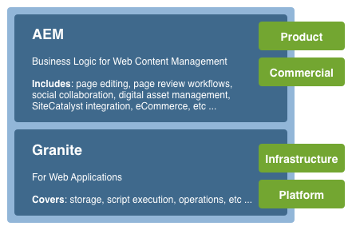

# Concetti dell’interfaccia utente di Adobe Experience Manager con funzionalità touch{#concepts-of-the-aem-touch-enabled-ui}

Adobe Experience Manager (AEM) dispone di un&#39;interfaccia utente touch con [design reattivo](/help/sites-authoring/responsive-layout.md) per l&#39;ambiente di authoring progettato per funzionare sia su dispositivi touch che desktop.

>[!NOTE]
>
>L’interfaccia touch è l’interfaccia utente standard per l’AEM. L’interfaccia classica è stata rimossa con AEM 6.4.

L’interfaccia touch include:

* L’intestazione della suite che:
   * Mostra il logo
   * Fornisce un collegamento alla navigazione globale
   * Fornisce un collegamento ad altre azioni generiche, ad esempio Ricerca, Guida, Soluzioni di Experience Cloud, Notifiche e Impostazioni utente.
* La barra a sinistra (visualizzata quando necessario e nascosta), che può mostrare:
   * Timeline
   * Riferimenti
   * Filtri
* L’intestazione di navigazione, che è nuovamente sensibile al contesto e può mostrare:
   * Indica quale console stai utilizzando attualmente, o la tua posizione, o entrambe, all’interno di tale console
   * Selezione per la barra a sinistra
   * Breadcrumb
   * Accedi alle azioni **Crea** appropriate
   * Visualizza selezioni
* L’area del contenuto che:
   * Elenca gli elementi di contenuto (pagine, risorse, post in forum e così via)
   * Può essere formattato come richiesto, ad esempio colonna, scheda o elenco
   * Utilizza un design reattivo (il display si ridimensiona automaticamente in base al dispositivo e/o alle dimensioni della finestra)
   * Utilizza lo scorrimento infinito (nessuna più impaginazione, tutti gli elementi sono elencati in un&#39;unica finestra)


>[!NOTE]
>
>Quasi tutte le funzionalità AEM sono state trasferite all’interfaccia utente touch. Tuttavia, in alcuni casi limitati, la funzionalità torna all’interfaccia classica. Per ulteriori informazioni, vedere [Stato delle funzioni dell&#39;interfaccia utente touch](/help/release-notes/touch-ui-features-status.md).

L’interfaccia utente touch è stata progettata da Adobe per fornire un’esperienza utente coerente su più prodotti. Si basa su:

* **Coral UI** (CUI) è un&#39;implementazione dello stile visivo di Adobe per l&#39;interfaccia touch. Coral UI fornisce tutto ciò che il tuo prodotto / progetto / applicazione web ha bisogno per adottare lo stile visivo dell&#39;interfaccia utente.
* **I componenti dell&#39;interfaccia utente Granite** sono generati con l&#39;interfaccia utente Coral.

I principi di base dell’interfaccia utente touch sono:

* Prima il mobile (pensando al desktop)
* Design reattivo
* Visualizzazione pertinente al contesto
* Riutilizzabile
* Includi documentazione di riferimento incorporata
* Includi test incorporati
* Progettazione bottom-up per garantire che questi principi vengano applicati a ogni elemento e componente

Per un&#39;ulteriore panoramica della struttura dell&#39;interfaccia utente touch, vedere [Struttura dell&#39;interfaccia utente AEM touch](/help/sites-developing/touch-ui-structure.md).

## Stack di tecnologie AEM {#aem-technology-stack}

AEM utilizza la piattaforma Granite come base e la piattaforma Granite include, tra le altre cose, Java™ Content Repository.



## Granite {#granite}

Granite è uno stack Open Web di Adobe che fornisce vari componenti, tra cui:

* Un modulo di avvio applicazioni
* Un framework OSGi in cui tutto è distribuito
* Diversi servizi del compendio OSGi per supportare le applicazioni di costruzione
* Un framework di registrazione completo che fornisce diverse API di registrazione
* Implementazione dell’archivio CRX delle specifiche API JCR
* Framework web Apache Sling
* Parti aggiuntive del prodotto CRX corrente

>[!NOTE]
>
>Granite viene eseguito come progetto di sviluppo aperto all’interno di Adobe: i contributi al codice, le discussioni e i problemi vengono effettuati da tutta l’azienda.
>
>Granite è tuttavia **non** un progetto open-source. È basato su diversi progetti open-source (Apache Sling, Felix, Jackrabbit e Lucene in particolare), ma Adobe disegna una linea chiara tra ciò che è pubblico e ciò che è interno.

## Interfaccia utente Granite {#granite-ui}

La piattaforma di progettazione Granite fornisce anche un framework di base per l’interfaccia utente. Gli obiettivi principali sono:

* Fornire widget di interfaccia granulari
* Implementa i concetti dell’interfaccia utente e illustra le best practice (rendering di elenchi lunghi, filtro di elenchi, CRUD di oggetti, procedure guidate CUD...)
* Fornire un&#39;interfaccia utente di amministrazione estensibile e basata su plug-in

Queste soluzioni rispettano i seguenti requisiti:

* Rispetta &quot;prima il cellulare&quot;
* Essere estensibile
* Facile da ignorare


GraniteUI.pdf

[Ottieni file](assets/graniteui.pdf)
L’interfaccia utente Granite:

* Utilizza l’architettura RESTful di Sling
* Implementa librerie di componenti destinate alla creazione di applicazioni web incentrate sui contenuti
* Fornisce widget di interfaccia granulari
* Fornisce un&#39;interfaccia utente standard predefinita
* Estensibile
* È progettato sia per dispositivi mobili che per dispositivi desktop (rispetta prima il mobile)
* Può essere utilizzato in qualsiasi piattaforma/prodotto/progetto basato su Granite; ad esempio, AEM


* [Componenti Foundation dell&#39;interfaccia utente Granite](#granite-ui-foundation-components)
Questa libreria di componenti di base può essere utilizzata o estesa da altre librerie.
* [Componenti di amministrazione dell’interfaccia utente Granite](#granite-ui-administration-components)

### Lato client e lato server {#client-side-vs-server-side}

La comunicazione client-server nell’interfaccia utente Granite è costituita da ipertesti, non da oggetti, pertanto non è necessario che il client comprenda la logica di business

* Il server arricchisce il HTML con dati semantici
* Il client arricchisce l’ipertesto con hypermedia (interazione)


#### Lato client {#client-side}

Questo utilizza un’estensione del vocabolario HTML, a condizione che l’autore possa esprimere la propria intenzione di creare un’app web interattiva. Questo approccio è simile a [WAI-ARIA](https://www.w3.org/TR/wai-aria/) e [microformati](https://microformats.org/).

È costituito principalmente da una raccolta di pattern di interazione (ad esempio, l’invio asincrono di un modulo) interpretati da codici JS e CSS ed eseguiti sul lato client. Il ruolo del lato client è quello di migliorare il markup (dato come prezzo per l’hypermedia dal server) per l’interattività.

Il lato client è indipendente da qualsiasi tecnologia server. Se il server fornisce il markup appropriato, il lato client può svolgere il proprio ruolo.

Attualmente i codici JS e CSS vengono consegnati come Granite [clientlibs](/help/sites-developing/clientlibs.md) nella categoria:

`granite.ui.foundation and granite.ui.foundation.admin`

Questi vengono forniti come parte del pacchetto di contenuti:

`granite.ui.content`

#### Lato server {#server-side}

Questa è formata da una raccolta di componenti sling che consentono all&#39;autore di *comporre* un&#39;app Web velocemente. Lo sviluppatore sviluppa i componenti, l’autore assembla i componenti come una web app. Il ruolo del lato server è quello di offrire al client il markup (prezzo conveniente per l&#39;hypermedia).

Attualmente, i componenti si trovano nell’archivio Granite in:

`/libs/granite/ui/components/foundation`

Viene fornito come parte del pacchetto di contenuti:

`granite.ui.content`

### Differenze con l’interfaccia classica {#differences-with-the-classic-ui}

Anche le differenze tra l’interfaccia utente Granite e ExtJS (utilizzata per l’interfaccia classica) sono interessanti:

<table>
 <tbody>
  <tr>
   <td><strong>ExtJS</strong></td>
   <td><strong>Interfaccia utente Granite</strong></td>
  </tr>
  <tr>
   <td>Chiamata procedura remota<br /> </td>
   <td>Transizioni di stato</td>
  </tr>
  <tr>
   <td>Oggetti di trasferimento dati</td>
   <td>Hypermedia</td>
  </tr>
  <tr>
   <td>Il client conosce le funzionalità interne del server</td>
   <td>Il client non conosce gli elementi interni</td>
  </tr>
  <tr>
   <td>"Fat client"</td>
   <td>"Thin client"</td>
  </tr>
  <tr>
   <td>Librerie client specializzate</td>
   <td>Librerie client universali</td>
  </tr>
 </tbody>
</table>

### Componenti Foundation dell’interfaccia utente Granite {#granite-ui-foundation-components}

I [componenti di base dell&#39;interfaccia utente Granite](https://developer.adobe.com/experience-manager/reference-materials/6-5/granite-ui/api/jcr_root/libs/granite/ui/index.html) forniscono i blocchi predefiniti di base necessari per la creazione di qualsiasi interfaccia utente. Esse comprendono, tra l&#39;altro:

* Pulsante
* Collegamento ipertestuale
* Avatar utente

I componenti di base si trovano in:

`/libs/granite/ui/components/foundation`

Questa libreria contiene un componente dell’interfaccia utente Granite per ogni elemento Coral. Un componente è basato sui contenuti, con la relativa configurazione che risiede nell’archivio. In questo modo è possibile comporre un’applicazione dell’interfaccia utente Granite senza scrivere manualmente il markup HTML.

Finalità:

* Modello di componente per elementi HTML
* Composizione componente
* Test automatici delle unità e delle funzionalità

Implementazione:

* Composizione e configurazione basate su archivio
* Utilizzo delle strutture di test fornite dalla piattaforma Granite
* Modellazione JSP

Questa libreria di componenti di base può essere utilizzata o estesa da altre librerie.

### ExtJS e i corrispondenti componenti dell’interfaccia utente Granite {#extjs-and-corresponding-granite-ui-components}

Quando si aggiorna il codice ExtJS per utilizzare l’interfaccia utente Granite, l’elenco seguente fornisce una pratica panoramica degli xtype ExtJS e dei tipi di nodo con i corrispondenti tipi di risorse dell’interfaccia utente Granite.

| **ExtJS xtype** | **Tipo di risorsa dell&#39;interfaccia utente Granite** |
|---|---|
| `button` | `granite/ui/components/foundation/form/button` |
| `checkbox` | `granite/ui/components/foundation/form/checkbox` |
| `componentstyles` | `cq/gui/components/authoring/dialog/componentstyles` |
| `cqinclude` | `granite/ui/components/foundation/include` |
| `datetime` | `granite/ui/components/foundation/form/datepicker` |
| `dialogfieldset` | `granite/ui/components/foundation/form/fieldset` |
| `hidden` | `granite/ui/components/foundation/form/hidden` |
| `html5smartfile, html5smartimage` | `granite/ui/components/foundation/form/fileupload` |
| `multifield` | `granite/ui/components/foundation/form/multifield` |
| `numberfield` | `granite/ui/components/foundation/form/numberfield` |
| `pathfield, paragraphreference` | `granite/ui/components/foundation/form/pathbrowser` |
| `selection` | `granite/ui/components/foundation/form/select` |
| `sizefield` | `cq/gui/components/authoring/dialog/sizefield` |
| `tags` | `granite/ui/components/foundation/form/autocomplete` `cq/gui/components/common/datasources/tags` |
| `textarea` | `granite/ui/components/foundation/form/textarea` |
| `textfield` | `granite/ui/components/foundation/form/textfield` |

| **Tipo di nodo** | **Tipo di risorsa dell&#39;interfaccia utente Granite** |
|---|---|
| `cq:WidgetCollection` | `granite/ui/components/foundation/container` |
| `cq:TabPanel` | `granite/ui/components/foundation/container` `granite/ui/components/foundation/layouts/tabs` |
| `cq:panel` | `granite/ui/components/foundation/container` |

### Componenti di amministrazione dell’interfaccia utente Granite {#granite-ui-administration-components}

I [componenti di amministrazione dell&#39;interfaccia utente Granite](https://developer.adobe.com/experience-manager/reference-materials/6-5/granite-ui/api/jcr_root/libs/granite/ui/index.html) si basano sui componenti di base per fornire blocchi predefiniti generici che qualsiasi applicazione di amministrazione può implementare. Tra queste figurano:

* Barra di navigazione globale
* Barra (ossatura)
* Pannello di ricerca

Finalità:

* Aspetto unificato per le applicazioni di amministrazione
* RAD per applicazioni di amministrazione

Implementazione:

* Componenti predefiniti che utilizzano i componenti di base
* I componenti possono essere personalizzati

## Coral UI {#coral-ui}

CoralUI.pdf

[Ottieni file](assets/coralui.pdf)
Coral UI (CUI) è un&#39;implementazione dello stile visivo di Adobe per l&#39;interfaccia touch progettata per fornire coerenza nell&#39;esperienza utente tra più prodotti. L’interfaccia utente Coral offre tutto il necessario per adottare lo stile visivo utilizzato nell’ambiente di authoring.

>[!CAUTION]
>
>Coral UI è una libreria dell’interfaccia utente resa disponibile ai clienti AEM per la creazione di applicazioni e interfacce web entro i limiti dell’utilizzo del prodotto concesso in licenza.
>
>L’utilizzo dell’interfaccia utente Coral è consentito solo:
>
>
>* Quando è stato spedito e fornito in bundle con AEM.
>* Da utilizzare quando si estende l’interfaccia utente esistente dell’ambiente di authoring.
>* Adobe di materiale collaterale aziendale, annunci e presentazioni.
>* L’interfaccia utente delle applicazioni a marchio Adobe (il font non deve essere prontamente disponibile per altri utilizzi).
>* Con personalizzazioni minori.
>
>L’utilizzo dell’interfaccia utente Coral deve essere evitato in:
>
>* Documenti e altri elementi non correlati a Adobe.
>* Ambienti di creazione dei contenuti (in cui gli elementi precedenti potrebbero essere generati da altri).
>* Applicazioni/componenti/pagine web che non sono chiaramente collegati ad Adobe.
>

L’interfaccia utente Coral è una raccolta di elementi di base per lo sviluppo di applicazioni web.


Progettato per essere modulare fin dall&#39;inizio, ogni modulo forma un livello distinto in base al suo ruolo principale. Anche se i livelli sono stati progettati per supportarsi a vicenda, possono anche essere utilizzati in modo indipendente, se necessario. Questo rende possibile implementare l&#39;esperienza utente di Coral in qualsiasi ambiente compatibile con HTML.

Con l’interfaccia utente Coral non è obbligatorio utilizzare un particolare modello e/o piattaforma di sviluppo. L’obiettivo principale di Coral è fornire un markup HTML5 unificato e pulito, indipendente dal metodo effettivo utilizzato per emettere questo markup. Questo può essere utilizzato per il rendering lato client o server, modelli, JSP, PHP o anche applicazioni RIA di Flash di Adobe - per citarne solo alcuni.

### Elementi HTML - Livello markup {#html-elements-the-markup-layer}

Gli elementi HTML forniscono un aspetto comune a tutti gli elementi dell’interfaccia utente di base (tra cui barra di navigazione, pulsante, menu, barra, ecc.).

Al livello più elementare, un elemento HTML è un tag HTML con un nome di classe dedicato. Gli elementi più complessi possono essere composti da più tag, nidificati l’uno all’altro (in un modo specifico).

Il CSS viene utilizzato per fornire l’aspetto effettivo. Per consentire di personalizzare facilmente il look-and-feel (ad esempio, nel caso del branding), i valori di stile effettivi vengono dichiarati come variabili espanse dal preprocessore [LESS](https://lesscss.org/) durante il runtime.

Finalità:

* Fornire elementi di base dell’interfaccia utente con un aspetto comune
* Fornire il sistema di griglia predefinito

Implementazione:

* HTML tag con stili ispirati a [Bootstrap](https://twitter.github.com/bootstrap/)
* Le classi sono definite in file LESS
* Le icone sono definite come sprite dei caratteri

Ad esempio, il markup:

```xml
<button class="btn btn-large btn-primary" type="button">Large button</button>
<button class="btn btn-large" type="button">Large button</button>
```

Viene visualizzato come:


Il look-and-feel è definito in LESS, legato a un elemento dal nome di classe dedicato (il seguente estratto è stato abbreviato per brevità):

```xml
.btn {
    font-size: @baseFontSize;
    line-height: @baseLineHeight;
    .buttonBackground(@btnBackground,
                                @btnBackgroundHighlight,
                                @grayDark, 0 1px 1px rgba(255,255,255,.75));
```

I valori effettivi sono definiti in un file di variabili LESS (la seguente estrazione è stata abbreviata per motivi di brevità):

```xml
@btnBackgroundHighlight: darken(@white, 10%);
@btnPrimaryBackgroundHighlight: spin(@btnPrimaryBackground, 20%);
@baseFontSize: 17px;
@baseFontFamily: @sansFontFamily;
```

### Plug-in elemento {#element-plugins}

Molti elementi HTML devono presentare un comportamento dinamico, ad esempio l&#39;apertura e la chiusura di menu a comparsa. Questo è il ruolo dei plug-in dell’elemento, che eseguono tali attività manipolando il DOM utilizzando JavaScript.

Un plug-in può essere:

* Progettato per funzionare su un elemento DOM specifico. Ad esempio, un plug-in di dialogo prevede di trovare `DIV class=dialog`
* Di natura generica. Ad esempio, un gestore di layout fornisce il layout per qualsiasi elenco di `DIV` o `LI` elementi

Il comportamento del plug-in può essere personalizzato con i parametri mediante:

* Trasmettere i parametri con una chiamata JavaScript
* Utilizzo di attributi `data-*` dedicati associati al markup HTML

Anche se lo sviluppatore può selezionare l’approccio migliore per qualsiasi plug-in, la regola empirica è quella di utilizzare:

* Attributi `data-*` per le opzioni relative al layout di HTML. Ad esempio, per specificare il numero di colonne
* Opzioni/classi API per la funzionalità relativa ai dati. Ad esempio, la costruzione dell’elenco di elementi da visualizzare

Lo stesso concetto viene utilizzato per implementare la convalida del modulo. Per un elemento da convalidare, è necessario specificare il modulo di input richiesto come attributo `data-*` personalizzato. Questo attributo viene quindi utilizzato come opzione per un plug-in di convalida.

>[!NOTE]
>
>La convalida del modulo nativo per HTML5 deve essere utilizzata quando possibile e/o estesa.

Finalità:

* Fornire un comportamento dinamico per gli elementi HTML
* Fornire layout personalizzati non possibili con file CSS puri
* Esegui convalida modulo
* Eseguire manipolazioni DOM avanzate

Implementazione:

* Plug-in jQuery, associato a elementi DOM specifici
* Utilizzo degli attributi `data-*` per personalizzare il comportamento

Estratto di markup di esempio (prendere nota delle opzioni specificate come attributi dati-&#42;):

```xml
<ul data-column-width="220" data-layout="card" class="cards">
  <li class="item">
    <div class="thumbnail">
      
      <div class="caption">
        <h4>Toolbar</h4>
          <p><small>toolbar</small><br></p>
      </div>
    </div>
  </li>
  <li class="item">
    <div class="thumbnail">
      
      <div class="caption">
        <h4>Toolbar</h4>
        <p><small>toolbar</small><br></p>
      </div>
    </div>
  </li>
```

Chiamata al plug-in jQuery:

```
$('.cards').cardlayout ();
```

Viene visualizzato come:


Il plug-in `cardLayout` imposta gli elementi `UL` inclusi in base alle rispettive altezze e tenendo conto della larghezza dell&#39;elemento padre.

### Widget elementi HTML {#html-elements-widgets}

Un widget combina uno o più elementi di base con un plug-in JavaScript per formare elementi di interfaccia utente di &quot;livello superiore&quot;. Questi possono implementare un comportamento più complesso e anche un aspetto più complesso di quello che un singolo elemento potrebbe fornire. Esempi validi sono i widget per selettori di tag o barre.

Un widget può sia attivare che ascoltare eventi personalizzati per cooperare con altri widget sulla pagina. Alcuni widget sono widget jQuery nativi che utilizzano gli elementi di Coral HTML.

Finalità:

* Implementare elementi dell’interfaccia utente di livello superiore che mostrano un comportamento complesso
* Attivazione e gestione degli eventi

Implementazione:

* Plug-in jQuery + markup HTML
* Può utilizzare modelli lato client/server

Esempio di markup:

```
<input type="text" name="tags" placeholder="Tags" class="tagManager"/>
```

Chiamata al plug-in jQuery (con opzioni):

```
$(".tagManager").tagsManager({
        prefilled: ["Pisa", "Rome"] })
```

Il plug-in genera il markup HTML (questo markup utilizza elementi di base, che possono utilizzare altri plug-in internamente):

```
<span>Pisa</code>
<a title="Removing tag" tagidtoremove="0"
   id="myRemover_0" class="myTagRemover" href="#">x</a></code>

<span id="myTag_1" class="myTag"><span>Rome</code>
<a title="Removing tag" tagidtoremove="1"
   id="myRemover_1" class="myTagRemover" href="#">x</a></code>

<input type="text" data-original-title="" class="input-medium tagManager"
       placeholder="Tags" name="tags" data-provide="typeahead" data-items="6"
       autocomplete="off">
```

Viene visualizzato come:


### Libreria utilità {#utility-library}

Questa libreria è una raccolta di plug-in e/o funzioni di assistenza JavaScript che sono:

* Indipendente dall’interfaccia utente
* Tuttavia, è fondamentale per la creazione di applicazioni web complete

Questi includono la gestione XSS e il bus di eventi.

Anche se i plug-in e i widget dell&#39;elemento HTML possono basarsi sulle funzionalità fornite dalla libreria di utilità, la libreria di utilità non può avere alcuna dipendenza dagli elementi o dai widget stessi.

Finalità:

* Fornire funzionalità comuni
* Implementazione bus di evento
* Modelli lato client
* XSS

Implementazione:

* Plug-in jQuery o moduli JavaScript compatibili con AMD
