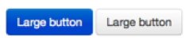

# Concetti dell’interfaccia AEM touch{#concepts-of-the-aem-touch-enabled-ui}

AEM presenta un’interfaccia touch con [design dinamico](/help/sites-authoring/responsive-layout.md) per l’ambiente di authoring progettato per funzionare sia su dispositivi touch che su dispositivi desktop.

>[!NOTE]
>
>L’interfaccia touch è l’interfaccia standard per AEM. L’interfaccia classica era obsoleta con AEM 6.4.

L’interfaccia touch include:

* Intestazione della suite che:
   * Mostra il logo
   * Fornisce un collegamento alla navigazione globale
   * Fornisce un collegamento ad altre azioni generiche; come Ricerca, Aiuto, Soluzioni di Marketing Cloud, Notifiche e impostazioni utente.
* La barra a sinistra (visualizzata quando necessario e nascosta), che può mostrare:
   * Timeline 
   * Riferimenti
   * Filtri
* L’intestazione di navigazione, che è nuovamente sensibile al contesto e può mostrare:
   * Indica la console in uso e/o la posizione all’interno della console
   * Selezione della barra a sinistra
   * Breadcrumb
   * Accesso a **Crea** azioni
   * Visualizza selezioni
* L’area contenuto che:
   * Elenca gli elementi di contenuto (siano essi pagine, risorse, post di forum, ecc.)
   * Può essere formattato come richiesto, ad esempio colonna, scheda o elenco
   * Utilizza una progettazione reattiva (la visualizzazione viene ridimensionata automaticamente in base alle dimensioni del dispositivo e/o della finestra)
   * Utilizza lo scorrimento infinito (non più impaginazione, tutti gli elementi sono elencati in una finestra)


>[!NOTE]
>
>Quasi tutte le funzionalità AEM sono state trasferite nell’interfaccia touch. Tuttavia, in alcuni casi limitati, le funzionalità torneranno all’interfaccia classica. Vedi [Stato delle funzioni dell’interfaccia touch](/help/release-notes/touch-ui-features-status.md) per ulteriori informazioni.

L’interfaccia touch è stata progettata per Adobe per fornire coerenza nell’esperienza utente tra più prodotti. Si basa su:

* **Interfaccia Coral** (CUI) implementazione dello stile visivo di Adobe per l’interfaccia touch. L’interfaccia utente Coral offre tutto il necessario per adottare lo stile visivo dell’interfaccia utente.
* **Interfaccia Granite** I componenti sono generati con l’interfaccia utente Coral.

I principi di base dell’interfaccia touch sono:

* Prima di tutto mobile (con il desktop in mente)
* Design dinamico
* Visualizzazione pertinente al contesto
* Riutilizzabile
* Includi documentazione di riferimento incorporata
* Includi test incorporati
* Progettazione dal basso verso l’alto per garantire che questi principi vengano applicati a ogni elemento e componente

Per un’ulteriore panoramica della struttura dell’interfaccia touch, consulta l’articolo [Struttura dell’interfaccia utente AEM touch](/help/sites-developing/touch-ui-structure.md).

## Stack di tecnologia AEM {#aem-technology-stack}

AEM utilizza la piattaforma Granite come base e la piattaforma Granite include, tra le altre cose, Java Content Repository.


## Granite {#granite}

Granite è uno stack Web aperto di Adobe che fornisce vari componenti tra cui:

* Un modulo di avvio applicazioni
* Un framework OSGi in cui tutto viene distribuito
* Vari servizi di compendium OSGi per supportare applicazioni di costruzione
* Un framework di registrazione completo che fornisce diverse API di registrazione
* Implementazione del repository CRX della specifica API JCR
* Framework Web di Apache Sling
* Parti aggiuntive del prodotto CRX corrente

>[!NOTE]
>
>Granite viene eseguito come progetto di sviluppo aperto in Adobe: i contributi al codice, le discussioni e le questioni vengono effettuati da tutta l&#39;azienda.
>
>Tuttavia, Granite è **not** un progetto open source. È fortemente basato su diversi progetti open source (Apache Sling, Felix, Jackrabbit e Lucene in particolare), ma l&#39;Adobe disegna una linea chiara tra ciò che è pubblico e ciò che è interno.

## Interfaccia Granite {#granite-ui}

La piattaforma di progettazione Granite fornisce anche un framework di interfaccia utente di base. I principali obiettivi sono:

* Fornisci widget di interfaccia utente granulare
* Implementa i concetti dell’interfaccia utente e illustra le best practice (rendering di elenchi lunghi, filtri di elenchi, creazione di oggetti CRUD, procedure guidate per CUD..)
* Fornire un’interfaccia utente di amministrazione estensibile e basata su plug-in

Questi sono conformi ai requisiti:

* Rispetta &quot;mobile first&quot;
* Essere estensibile
* È facile da sostituire


GraniteUI.pdf

[Ottieni file](assets/graniteui.pdf)
Interfaccia utente Granite:

* Utilizza l’architettura RESTful di Sling
* Implementa le librerie dei componenti destinate alla creazione di applicazioni web incentrate sui contenuti
* Fornisce widget di interfaccia granulare
* Offre un’interfaccia utente standard e predefinita
* Estensibile
* È progettato sia per i dispositivi mobili che per quelli desktop (rispetta prima i dispositivi mobili)
* può essere utilizzato in qualsiasi piattaforma/prodotto/progetto basato su Granite; eg AEM


* [Componenti di base dell’interfaccia utente Granite](#granite-ui-foundation-components)
Questa libreria di componenti di base può essere utilizzata o estesa da altre librerie.
* [Componenti di amministrazione dell’interfaccia utente Granite](#granite-ui-administration-components)

### Lato client e lato server {#client-side-vs-server-side}

La comunicazione client-server nell&#39;interfaccia utente Granite è costituita da ipertesto e non da oggetti, pertanto non è necessario che il client comprenda la logica di business

* Il server arricchisce il HTML con dati semantici
* Il cliente arricchisce l&#39;ipertesto con ipermedia (interazione)


#### Lato client {#client-side}

Viene utilizzata un’estensione del vocabolario di HTML, purché l’autore possa esprimere l’intenzione di creare un’app web interattiva. Questo è un approccio simile a [WAI-ARIA](https://www.w3.org/TR/wai-aria/) e [microformati](https://microformats.org/).

Si compone principalmente di una raccolta di pattern di interazione (ad esempio, l’invio asincrono di un modulo) interpretati dai codici JS e CSS, eseguiti sul lato client. Il ruolo del lato client è quello di migliorare il markup (dato come il costo dell&#39;ipermedia dal server) per l&#39;interattività.

Il lato client è indipendente da qualsiasi tecnologia server. Se il server fornisce il markup appropriato, il lato client può svolgere il proprio ruolo.

Attualmente i codici JS e CSS vengono consegnati come Granite [clientlibs](/help/sites-developing/clientlibs.md) nella categoria:

`granite.ui.foundation and granite.ui.foundation.admin`

Questi vengono consegnati come parte del pacchetto di contenuti:

`granite.ui.content`

#### Lato server {#server-side}

Questo è costituito da una raccolta di componenti sling che consentono all’autore di *comporre* una webapp veloce. Lo sviluppatore sviluppa i componenti, l’autore assembla i componenti in un’app Web. Il ruolo del lato server è quello di fornire al client l&#39;accessibilità (markup) dell&#39;ipermedia.

Attualmente i componenti si trovano nell’archivio Granite all’indirizzo:

`/libs/granite/ui/components/foundation`

Viene fornito come parte del pacchetto di contenuti:

`granite.ui.content`

### Differenze con l’interfaccia classica {#differences-with-the-classic-ui}

Interessano anche le differenze tra l’interfaccia Granite e ExtJS (utilizzata per l’interfaccia classica):

<table>
 <tbody>
  <tr>
   <td><strong>ExtJS</strong></td>
   <td><strong>Interfaccia Granite</strong></td>
  </tr>
  <tr>
   <td>Chiamata a procedura remota<br /> </td>
   <td>Transistenze di stato</td>
  </tr>
  <tr>
   <td>Oggetti di trasferimento dati</td>
   <td>Hypermedia</td>
  </tr>
  <tr>
   <td>Il client conosce gli interni del server</td>
   <td>Il client non conosce gli interni</td>
  </tr>
  <tr>
   <td>"client grasso"</td>
   <td>"Thin client"</td>
  </tr>
  <tr>
   <td>Librerie client specializzate</td>
   <td>Librerie client universali</td>
  </tr>
 </tbody>
</table>

### Componenti di base dell’interfaccia utente Granite {#granite-ui-foundation-components}

La [Componenti di base dell’interfaccia utente Granite](https://helpx.adobe.com/experience-manager/6-5/sites/developing/using/reference-materials/granite-ui/api/jcr_root/libs/granite/ui/index.html) fornisce i blocchi predefiniti di base necessari per la creazione di qualsiasi interfaccia utente. Esse comprendono, tra l&#39;altro:

* Pulsante
* Collegamento ipertestuale
* Avatar utente

I componenti di base si trovano in:

`/libs/granite/ui/components/foundation`

Questa libreria contiene un componente Granite UI per ogni elemento Coral. Un componente è basato sui contenuti e la sua configurazione risiede nell’archivio. Questo consente di comporre un’applicazione Granite UI senza scrivere manualmente il markup HTML.

Scopo:

* Modello componente per gli elementi di HTML
* Composizione componente
* Test automatico di unità e funzionalità

Implementazione:

* Composizione e configurazione basate su archivio
* Utilizzo degli impianti di prova forniti dalla piattaforma Granite
* Modello JSP

Questa libreria di componenti di base può essere utilizzata o estesa da altre librerie.

### ExtJS e corrispondenti componenti dell’interfaccia Granite {#extjs-and-corresponding-granite-ui-components}

Quando si aggiorna il codice ExtJS per utilizzare l&#39;interfaccia utente Granite, l&#39;elenco seguente fornisce una comoda panoramica degli xtype e dei tipi di nodo ExtJS con i tipi di risorse equivalenti dell&#39;interfaccia Granite.

| **ExtJS xtype** | **Tipo di risorsa dell’interfaccia Granite** |
|---|---|
| `button` | `granite/ui/components/foundation/form/button` |
| `checkbox` | `granite/ui/components/foundation/form/checkbox` |
| `componentstyles` | `cq/gui/components/authoring/dialog/componentstyles` |
| `cqinclude` | `granite/ui/components/foundation/include` |
| `datetime` | `granite/ui/components/foundation/form/datepicker` |
| `dialogfieldset` | `granite/ui/components/foundation/form/fieldset` |
| `hidden` | `granite/ui/components/foundation/form/hidden` |
| `html5smartfile, html5smartimage` | `granite/ui/components/foundation/form/fileupload` |
| `multifield` | `granite/ui/components/foundation/form/multifield` |
| `numberfield` | `granite/ui/components/foundation/form/numberfield` |
| `pathfield, paragraphreference` | `granite/ui/components/foundation/form/pathbrowser` |
| `selection` | `granite/ui/components/foundation/form/select` |
| `sizefield` | `cq/gui/components/authoring/dialog/sizefield` |
| `tags` | `granite/ui/components/foundation/form/autocomplete``cq/gui/components/common/datasources/tags` |
| `textarea` | `granite/ui/components/foundation/form/textarea` |
| `textfield` | `granite/ui/components/foundation/form/textfield` |

| **Tipo di nodo** | **Tipo di risorsa dell’interfaccia Granite** |
|---|---|
| `cq:WidgetCollection` | `granite/ui/components/foundation/container` |
| `cq:TabPanel` | `granite/ui/components/foundation/container``granite/ui/components/foundation/layouts/tabs` |
| `cq:panel` | `granite/ui/components/foundation/container` |

### Componenti di amministrazione dell’interfaccia utente Granite {#granite-ui-administration-components}

La [Componenti per l’amministrazione dell’interfaccia utente Granite](https://helpx.adobe.com/experience-manager/6-5/sites/developing/using/reference-materials/granite-ui/api/jcr_root/libs/granite/ui/index.html) crea i componenti di base per fornire blocchi predefiniti generici che qualsiasi applicazione di amministrazione può implementare. Tra questi figurano, tra l&#39;altro:

* Barra di navigazione globale
* Ferrovia (scheletro)
* Pannello di ricerca

Scopo:

* Aspetto unificato per le applicazioni di amministrazione
* Rad per le applicazioni di amministrazione

Implementazione:

* Componenti predefiniti che utilizzano i componenti di base
* I componenti possono essere personalizzati

## Interfaccia Coral {#coral-ui}

CoralUI.pdf

[Ottieni file](assets/coralui.pdf)
L’interfaccia utente Coral (CUI) è un’implementazione dello stile visivo di Adobe per l’interfaccia touch, progettata per fornire coerenza nell’esperienza utente tra più prodotti. L’interfaccia utente Coral offre tutto il necessario per adottare lo stile visivo utilizzato nell’ambiente di authoring.

>[!CAUTION]
>
>L’interfaccia utente Coral è una libreria di interfaccia utente resa disponibile ai clienti AEM per la creazione di applicazioni e interfacce web entro i limiti dell’utilizzo concesso in licenza del prodotto.
>
>L’utilizzo dell’interfaccia utente Coral è consentito solo:
>
>
>* Quando è stato spedito e abbinato con AEM.
>* Da utilizzare quando si estende l’interfaccia utente esistente dell’ambiente di authoring.
>* Adobe materiale collaterale aziendale, annunci pubblicitari e presentazioni.
>* Interfaccia delle applicazioni con marchio Adobe (il font non deve essere prontamente disponibile per altri utilizzi).
>* Con personalizzazioni minori.
>
>L’utilizzo dell’interfaccia utente Coral deve essere evitato in:
>
>* Documenti e altri elementi non correlati all&#39;Adobe.
>* Ambienti per la creazione di contenuti (in cui gli elementi precedenti potrebbero essere generati da altri).
>* Applicazioni/componenti/pagine web che non sono chiaramente collegati ad Adobe.
>


L’interfaccia utente Coral è una raccolta di blocchi predefiniti per lo sviluppo di applicazioni web.


Progettato per essere modulare fin dall&#39;inizio, ogni modulo forma un livello distinto in base al suo ruolo primario. Anche se i livelli sono stati progettati per sostenersi l&#39;uno con l&#39;altro, possono anche essere utilizzati in modo indipendente se necessario. Questo consente di implementare l’esperienza utente di Coral in qualsiasi ambiente compatibile con HTML.

Con l’interfaccia utente Coral non è obbligatorio utilizzare un particolare modello e/o piattaforma di sviluppo. L’obiettivo principale di Coral è quello di fornire un markup HTML5 unificato e pulito, indipendentemente dal metodo effettivo utilizzato per emettere questo markup. Questo può essere utilizzato per il rendering lato client o server, modelli, JSP, PHP o anche applicazioni RIA Flash di Adobe - per citarne solo alcuni.

### Elementi HTML - Livello Markup {#html-elements-the-markup-layer}

Gli elementi di HTML offrono un aspetto comune a tutti gli elementi dell’interfaccia utente di base (tra cui barra di navigazione, pulsante, menu, barra laterale, ecc.).

Al livello più semplice, un elemento HTML è un tag HTML con un nome di classe dedicato. Gli elementi più complessi possono essere composti da più tag, nidificati uno all’altro (in un modo specifico).

Il CSS viene utilizzato per fornire l’aspetto effettivo. Per personalizzare facilmente l’aspetto (ad esempio, per il caso del branding), i valori di stile effettivi sono dichiarati come variabili espanse dal [MENO](https://lesscss.org/) pre-processore durante il runtime.

Scopo:

* Offrire elementi dell’interfaccia utente di base di aspetto comune
* Fornire il sistema di griglia predefinito

Implementazione:

* Tag HTML con stili ispirati [bootstrap](https://twitter.github.com/bootstrap/)
* Le classi sono definite nei file LESS
* Le icone sono definite come sprite di font

Ad esempio, il markup:

```xml
<button class="btn btn-large btn-primary" type="button">Large button</button>
<button class="btn btn-large" type="button">Large button</button>
```

Viene visualizzato come:



Il look-and-feel è definito in LESS, legato a un elemento dal nome di classe dedicato (il seguente estratto è stato abbreviato per motivi di brevità):

```xml
.btn {
    font-size: @baseFontSize;
    line-height: @baseLineHeight;
    .buttonBackground(@btnBackground,
                                @btnBackgroundHighlight,
                                @grayDark, 0 1px 1px rgba(255,255,255,.75));
```

I valori effettivi sono definiti in un file variabile LESS (il seguente estratto è stato abbreviato per motivi di brevità):

```xml
@btnBackgroundHighlight: darken(@white, 10%);
@btnPrimaryBackgroundHighlight: spin(@btnPrimaryBackground, 20%);
@baseFontSize: 17px;
@baseFontFamily: @sansFontFamily;
```

### Plug-in elementi {#element-plugins}

Molti degli elementi di HTML dovranno mostrare un comportamento dinamico, ad esempio l’apertura e la chiusura dei menu a comparsa. Questo è il ruolo dei plug-in di elementi, che eseguono tali attività manipolando il DOM utilizzando JavaScript.

Un plug-in è:

* Progettato per funzionare su un elemento DOM specifico. Ad esempio, un plug-in della finestra di dialogo prevede di trovare `DIV class=dialog`
* Generico in natura. Ad esempio, un gestore di layout fornisce il layout per qualsiasi elenco di `DIV` o `LI` elementi

Il comportamento del plug-in può essere personalizzato con i parametri tramite:

* Trasferimento dei parametri tramite una chiamata javascript
* Utilizzo di `data-*` attributi associati al markup HTML

Anche se lo sviluppatore può selezionare l’approccio migliore per qualsiasi plug-in, la regola del pollice è di utilizzare:

* `data-*` attributi per le opzioni relative al layout di HTML. Ad esempio, per specificare il numero di colonne
* Opzioni/classi API per funzionalità correlate ai dati. Ad esempio, la costruzione dell’elenco di elementi da visualizzare

Lo stesso concetto viene utilizzato per implementare la convalida del modulo. Per un elemento che si desidera convalidare, è necessario specificare come personalizzato il modulo di input richiesto `data-*` attributo. Questo attributo viene quindi utilizzato come opzione per un plug-in di convalida.

>[!NOTE]
>
>La convalida del modulo nativo di HTML5 deve essere utilizzata ogni volta che è possibile e/o estesa.

Scopo:

* Fornire un comportamento dinamico per gli elementi di HTML
* Fornire layout personalizzati non è possibile con CSS puri
* Esegui convalida del modulo
* Esegui manipolazione DOM avanzata

Implementazione:

* Plug-in jQuery associato a specifici elementi DOM
* Utilizzo `data-*` attributi per personalizzare il comportamento

Un estratto del markup di esempio (nota le opzioni specificate come dati-&#42; attributes):

```xml
<ul data-column-width="220" data-layout="card" class="cards">
  <li class="item">
    <div class="thumbnail">
      
      <div class="caption">
        <h4>Toolbar</h4>
          <p><small>toolbar</small><br></p>
      </div>
    </div>
  </li>
  <li class="item">
    <div class="thumbnail">
      
      <div class="caption">
        <h4>Toolbar</h4>
        <p><small>toolbar</small><br></p>
      </div>
    </div>
  </li>
```

La chiamata al plug-in jQuery:

```
$(‘.cards’).cardlayout ();
```

Questo verrà visualizzato come:


La `cardLayout` il plug-in espone il `UL` elementi in base alle rispettive altezze e tenendo conto anche della larghezza del genitore.

### Widget degli elementi di HTML {#html-elements-widgets}

Un widget combina uno o più elementi di base con un plug-in javascript per formare elementi di interfaccia utente di &quot;livello superiore&quot;. Questi possono implementare un comportamento più complesso e anche un aspetto e un aspetto più complessi rispetto a quanto un singolo elemento potrebbe fornire. Esempi validi sono il selettore tag o i widget per barra.

Un widget può attivare e ascoltare eventi personalizzati per cooperare con altri widget sulla pagina. Alcuni widget sono in realtà widget jQuery nativi che utilizzano gli elementi Coral HTML.

Scopo:

* Implementare elementi dell’interfaccia utente di livello superiore che presentano un comportamento complesso
* Attivazione e gestione di eventi

Implementazione:

* Plug-in jQuery + markup HTML
* Può utilizzare modelli lato client/server

Esempio di markup:

```
<input type="text" name="tags" placeholder="Tags" class="tagManager"/>
```

La chiamata al plug-in jQuery (con opzioni):

```
$(".tagManager").tagsManager({
        prefilled: ["Pisa", "Rome"] })
```

Il plug-in emette tag HTML (questo markup utilizza elementi di base, che possono utilizzare altri plug-in internamente):

```
<span>Pisa</code>
<a title="Removing tag" tagidtoremove="0"
   id="myRemover_0" class="myTagRemover" href="#">x</a></code>

<span id="myTag_1" class="myTag"><span>Rome</code>
<a title="Removing tag" tagidtoremove="1"
   id="myRemover_1" class="myTagRemover" href="#">x</a></code>

<input type="text" data-original-title="" class="input-medium tagManager"
       placeholder="Tags" name="tags" data-provide="typeahead" data-items="6"
       autocomplete="off">
```

Questo verrà visualizzato come:


### Libreria di utilità {#utility-library}

Questa libreria è una raccolta di plug-in di supporto javascript e/o funzioni che sono:

* Interfaccia indipendente
* Ancora cruciale per la creazione di applicazioni web complete

tra cui la gestione XSS e il bus dell&#39;evento.

Anche se i plug-in e i widget dell&#39;elemento HTML possono basarsi sulle funzionalità fornite dalla libreria di utilità, la libreria di utilità non può avere alcuna dipendenza dagli elementi o dai widget stessi.

Scopo:

* Fornire funzionalità comuni
* Implementazione dell&#39;autobus dell&#39;evento
* Modelli lato client
* XSS

Implementazione:

* Plug-in jQuery o moduli JavaScript conformi a AMD
