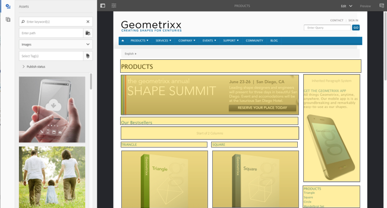
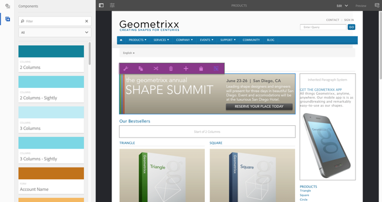

# Struttura dell’interfaccia utente touch dell’AEM{#structure-of-the-aem-touch-enabled-ui}

L’interfaccia utente touch dell’AEM ha diversi principi di base ed è costituita da diversi elementi chiave:

## Console {#consoles}

### Layout e ridimensionamento di base {#basic-layout-and-resizing}

L’interfaccia utente è adatta sia per i dispositivi mobili che per quelli desktop, ma invece di creare due stili, Adobe ha deciso di utilizzare uno stile che funziona per tutti gli schermi e i dispositivi.

Tutti i moduli utilizzano lo stesso layout di base, che nell’AEM può essere visto come:

Il layout rispetta uno stile di progettazione reattivo e si adatta alle dimensioni del dispositivo o della finestra in uso.

Ad esempio, quando la risoluzione scende al di sotto di 1024 px (come su un dispositivo mobile), il display viene regolato di conseguenza:

### Barra intestazione {#header-bar}

La barra dell’intestazione mostra gli elementi globali, tra cui:

* il logo e lo specifico prodotto/soluzione attualmente in uso; per l’AEM questo costituisce anche un collegamento alla navigazione globale
* Ricerca
* icona per accedere alle risorse della guida
* icona per accedere ad altre soluzioni
* un indicatore di (e accesso a) eventuali avvisi o elementi della casella in entrata che ti aspettano
* l’icona utente, insieme a un collegamento per la gestione del profilo

### Barra degli strumenti {#toolbar}

Ciò è contestuale alla posizione e rende visibili gli strumenti rilevanti per il controllo della vista o delle risorse nella pagina seguente. La barra degli strumenti è specifica per il prodotto, ma presenta alcune caratteristiche in comune con gli elementi.

In qualsiasi posizione, la barra degli strumenti mostra le azioni attualmente disponibili:

Dipende anche dal fatto che una risorsa sia attualmente selezionata:

### Barra a sinistra {#left-rail}

La barra a sinistra può essere aperta/nascosta come richiesto per mostrare:

* **Timeline**
* **Riferimenti**
* **Filtro**

Il valore predefinito è **Solo contenuto** (barra nascosta).

## Authoring delle pagine {#page-authoring}

Quando si creano le pagine, le aree strutturali sono le seguenti.

### Frame del contenuto {#content-frame}

Il rendering del contenuto della pagina viene eseguito nel frame del contenuto. Il frame del contenuto è completamente indipendente dall’editor, per garantire che non vi siano conflitti dovuti a CSS o JavaScript.

La cornice di contenuto si trova nella sezione destra della finestra, sotto la barra degli strumenti.

### Frame dell&#39;editor {#editor-frame}

Il frame dell&#39;editor consente di realizzare le funzioni di editing.

Il frame dell&#39;editor è un contenitore (astratto) per tutti *elementi di authoring delle pagine*. Si trova sopra la cornice del contenuto e include:

* barra degli strumenti superiore
* pannello laterale
* tutte le sovrapposizioni
* qualsiasi altro elemento di creazione pagina, ad esempio la barra degli strumenti del componente

### Pannello laterale {#side-panel}

Contiene due schede predefinite che consentono di selezionare risorse e componenti; possono essere trascinati da qui e rilasciati sulla pagina.

Il pannello laterale è nascosto per impostazione predefinita. Se questa opzione è selezionata, verrà visualizzata sul lato sinistro o scorrerà per coprire l&#39;intera finestra (quando la dimensione della finestra è inferiore a 1024 px, come ad esempio su un dispositivo mobile).

### Pannello laterale - Risorse {#side-panel-assets}

Nella scheda Risorse puoi selezionare dall’intervallo di risorse. Puoi anche filtrare in base a un termine specifico o selezionare un gruppo.

### Pannello laterale - Gruppi di risorse {#side-panel-asset-groups}

Nella scheda Risorsa è disponibile un elenco a discesa che puoi utilizzare per selezionare i gruppi di risorse specifici.

### Pannello laterale - Componenti {#side-panel-components}

Nella scheda Componenti puoi selezionare uno dei componenti disponibili. Puoi anche filtrare in base a un termine specifico o selezionare un gruppo.

### Sovrapposizioni {#overlays}

Questi si sovrappongono alla cornice del contenuto e vengono utilizzati dal [livelli](#layer) realizzare i meccanismi che consentono di interagire (in modo completamente trasparente) con i componenti e i relativi contenuti.

Le sovrapposizioni sono live nel frame dell’editor (con tutti gli altri elementi di authoring della pagina), anche se in realtà sovrappongono i componenti appropriati nel frame del contenuto.

### Layer {#layer}

Un livello è un bundle indipendente di funzionalità che può essere attivato per:

* fornisce una visualizzazione diversa della pagina
* consente di manipolare e/o interagire con una pagina

I livelli forniscono funzionalità avanzate per l’intera pagina, anziché azioni specifiche per un singolo componente.

L’AEM viene fornito con diversi livelli già implementati per l’authoring delle pagine, tra cui, ad esempio, modifica, anteprima e annota.

>[!NOTE]
>
>I livelli sono un concetto potente che influisce sulla visualizzazione e sull’interazione dell’utente con il contenuto della pagina. Quando sviluppate i vostri livelli dovete assicurarvi che il livello si ripulisca quando viene chiuso.

### Switcher livello {#layer-switcher}

Il selettore livello consente di scegliere il livello da utilizzare. Quando è chiuso, indica il livello attualmente in uso.

Il selettore livelli è disponibile come elenco a discesa dalla barra degli strumenti (nella parte superiore della finestra, all’interno del frame dell’editor).

### Barra degli strumenti del componente {#component-toolbar}

Ogni istanza di un componente mostra la propria barra degli strumenti quando fa clic su di esso (una volta o con un doppio clic lento). La barra degli strumenti contiene le azioni specifiche (ad esempio copia, incolla, open-editor) disponibili per l’istanza del componente (Modificabile) nella pagina.

A seconda dello spazio disponibile, le barre degli strumenti del componente sono posizionate nell’angolo superiore o inferiore destro del componente appropriato.

## Ulteriori informazioni {#further-information}

Per ulteriori dettagli sui concetti relativi all’interfaccia utente touch, continua con l’articolo [Concetti dell’interfaccia touch dell’AEM](/help/sites-developing/touch-ui-concepts.md).

Per ulteriori informazioni tecniche, vedere [Set di documentazione JS](https://helpx.adobe.com/experience-manager/6-5/sites/developing/using/reference-materials/jsdoc/ui-touch/editor-core/index.html) per l’editor di pagine touch.
