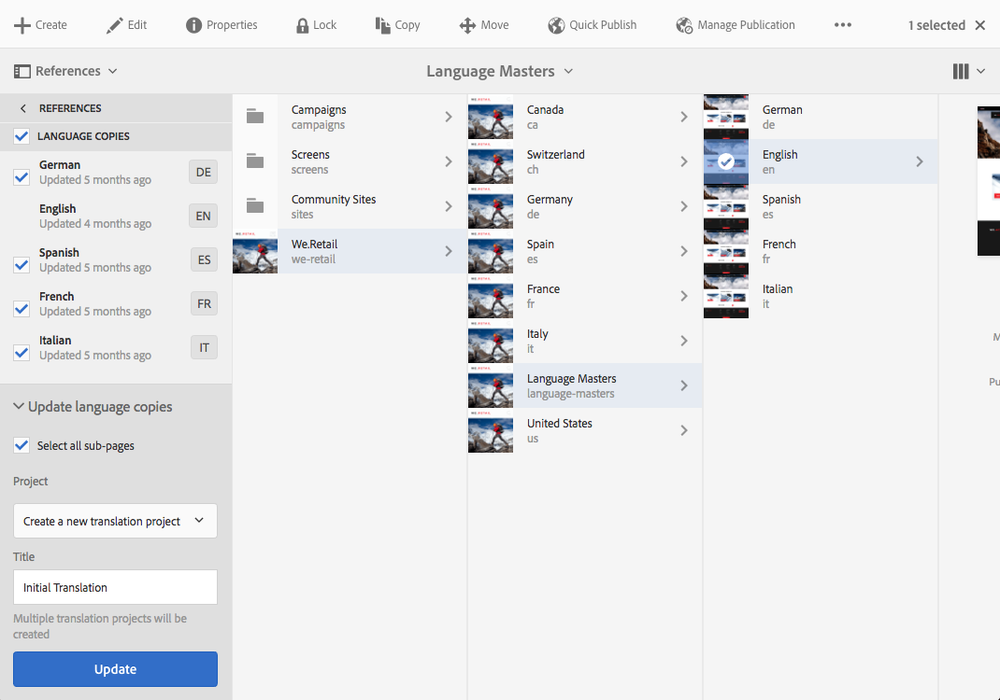

# Provare la struttura globalizzata del sito in We.Retail{#trying-out-the-globalized-site-structure-in-we-retail}

We.Retail è stato creato con una struttura del sito globalizzata che offre un master in lingua che può essere copiato in tempo reale su siti web specifici del paese. Tutto è configurato per consentire di sperimentare questa struttura e le funzionalità di traduzione incorporate.

## Prova {#trying-it-out}

1. Apri la console Sites da **Navigazione globale > Sites**.
1. Passa alla vista a colonne (se non è già attiva) e seleziona We.Retail. Prendi nota dell’esempio di struttura dei paesi con Svizzera, Stati Uniti, Francia e così via, accanto al master lingua.

   

1. Selezionare Svizzera e vedere le radici della lingua per le lingue di quel paese. Non c&#39;è ancora alcun contenuto sotto queste radici.

   

1. Passa alla vista a elenco e verifica che le copie per lingua dei paesi siano tutte Live Copy.

   

1. Torna alla vista a colonne, fai clic sulla Master lingua e visualizza le directory principali della lingua con il contenuto. Solo l&#39;inglese ha dei contenuti.

   We.Retail non include alcun contenuto tradotto, ma la struttura e la configurazione sono implementate per consentirti di dimostrare i servizi di traduzione.

   

1. Con il master lingua inglese selezionato, apri il **Riferimenti** nella console sites e seleziona **Copie per lingua**.

   

1. Seleziona la casella di controllo accanto a **Copie per lingua** per selezionare tutte le copie per lingua. In **Aggiorna copie per lingua** nella barra, seleziona l’opzione per **Crea un nuovo progetto di traduzione**. Assegna un nome al progetto e fai clic su **Aggiorna**.

   

1. Viene creato un progetto per ogni traduzione in lingua. Visualizzali in **Navigazione > Progetti**.

   

1. Fai clic su Tedesco per visualizzare i dettagli del progetto di traduzione. Lo stato è in **Bozza**. Per avviare la traduzione con il servizio di traduzione di Microsoft®, fai clic sulla freccia accanto al **Lavoro di traduzione** intestazione e selezione **Inizio**.

   

1. Il progetto di traduzione inizia. Fai clic sull’ellissi nella parte inferiore della scheda etichettata Lavoro di traduzione per visualizzare i dettagli. Pagine con lo stato **Pronto per la revisione** sono già stati tradotti dal servizio di traduzione.

   

1. Seleziona una delle pagine dell’elenco e quindi **Anteprima in Sites** nella barra degli strumenti apre la pagina tradotta nell’editor pagina.

   

>[!NOTE]
>
>Questa procedura ha dimostrato l&#39;integrazione integrata con la traduzione automatica Microsoft®. Utilizzo di [Framework di integrazione della traduzione AEM](/help/sites-administering/translation.md), puoi integrarti con molti servizi di traduzione standard per orchestrare la traduzione dell’AEM.

## Ulteriori informazioni {#further-information}

Per ulteriori informazioni, consulta il documento di authoring [Traduzione di contenuti per siti multilingue](/help/sites-administering/translation.md) per dettagli tecnici completi.
