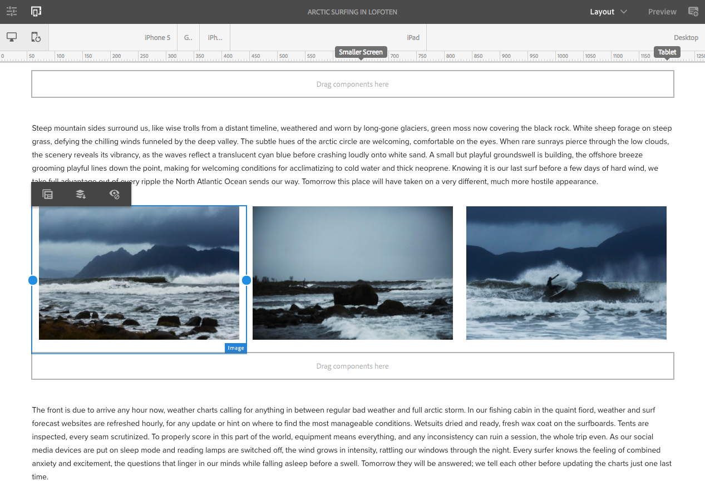

# Layout reattivo in We.Retail{#trying-out-responsive-layout-in-we-retail}

Tutte le pagine We.Retail utilizzano il componente Contenitore di layout per implementare una progettazione reattiva. Il contenitore layout fornisce un sistema paragrafo che consente di posizionare i componenti all’interno di una griglia reattiva. Questa griglia può ridisporre il layout in base alle dimensioni e al formato del dispositivo/finestra. Il componente viene utilizzato insieme al **Layout** nell’editor di pagine, che consente di creare e modificare il layout dinamico a seconda del dispositivo.

## Prova {#trying-it-out}

1. Modifica la pagina Navigazione artica nella sezione Esperienze del ramo principale lingua.

   http://localhost:4502/editor.html/content/we-retail/language-masters/en/experience/arctic-surfing-in-lofoten.html

1. Passa a **Anteprima** per visualizzare l’aspetto che la pagina avrebbe rappresentato per un visitatore del sito web. Scorri verso il basso fino al contenuto dell’articolo *acquaviti di Aloha nella Norvegia settentrionale*.

   

1. Ridimensiona la finestra del browser e osserva come il layout si adatta dinamicamente al ridimensionamento.

   

1. Passa alla modalità Layout . Viene visualizzata automaticamente la barra degli strumenti dell’emulatore, che consente di pianificare il layout per dispositivo di destinazione.

   Quando si seleziona un componente, vengono visualizzate le opzioni mobili e nascoste nel menu di modifica e le relative maniglie di ridimensionamento.

   

1. Quando si seleziona e si trascina la maniglia di ridimensionamento del componente, viene automaticamente visualizzata la griglia di layout che consente di eseguire le operazioni di ridimensionamento.

   

## Ulteriori informazioni {#further-information}

Per ulteriori informazioni, consulta il documento di authoring [Layout reattivo](/help/sites-authoring/responsive-layout.md) o il documento dell&#39;amministratore [Configurazione del contenitore di layout e della modalità di layout](/help/sites-administering/configuring-responsive-layout.md) per informazioni tecniche complete.
